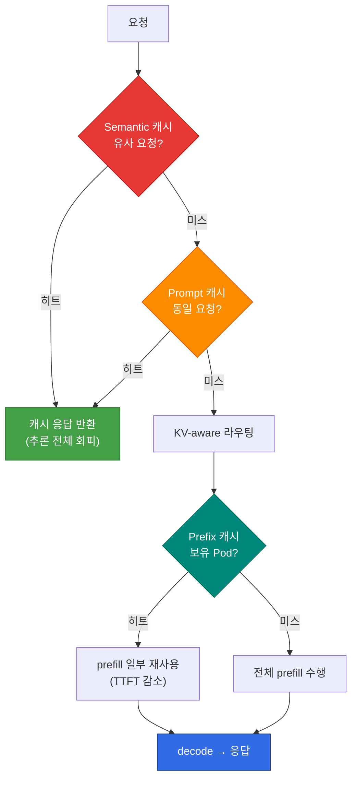

## 개요

추론 캐시는 단일 계층이 아니라 **서로 다른 적중 조건을 가진 세 계층**으로 구성됩니다. 각 계층은 회피하는 연산의 범위가 다르고, 히트율을 높이는 레버와 측정 지점도 다릅니다. 이 문서는 KV/Prefix·Prompt·Semantic 캐시를 하나의 의사결정 프레임으로 통합하고, 계층별 히트율 목표와 튜닝 방법을 정리합니다.

각 계층의 상세 구현은 전용 문서에서 다룹니다. 이 문서는 **세 계층을 함께 보고 어디를 튜닝할지 판단**하는 지도 역할을 합니다. 추론 인프라 전체에서의 위치는 [추론 인프라 개요](../inference-infrastructure-overview.md)의 L5 캐시 계층에 해당합니다.

## 3계층 캐시 비교

| 계층 | 적중 조건 | 회피하는 연산 | 적중 단위 | 상세 문서 |
|------|----------|-------------|----------|----------|
| **KV / Prefix 캐시** | 동일 prefix(시스템 프롬프트·공통 컨텍스트) | prefill 일부 | Pod 또는 공유 KV 계층 | [KV Cache 최적화](./kv-cache-optimization.md) |
| **Prompt 캐시** | 완전 동일 요청(정확 매칭) | 전체 추론 | 게이트웨이/앱 | [라우팅 전략](../inference-routing/routing-strategy.md) |
| **Semantic 캐시** | 의미적으로 유사한 요청(임베딩 유사도) | 전체 추론 | 게이트웨이/앱 | [Semantic Caching 전략](../../design-architecture/advanced-patterns/semantic-caching-strategy.md) |

세 계층은 배타적이지 않습니다. 게이트웨이 레벨에서 Semantic·Prompt 캐시로 전체 추론을 회피하고, 캐시 미스 시 서빙 엔진 레벨에서 KV/Prefix 캐시로 prefill을 줄이는 식으로 **중첩 적용**하는 것이 일반적입니다.

## 계층별 히트율 전략

### KV / Prefix 캐시

Prefix 캐시는 동일 시스템 프롬프트나 공통 컨텍스트를 가진 요청의 prefill을 재사용합니다. 히트율을 높이는 레버는 다음과 같습니다.

- **프롬프트 구조 정렬**: 변하지 않는 부분(시스템 프롬프트·few-shot 예시)을 요청 앞쪽에 고정하면 prefix 일치 구간이 길어집니다.
- **KV cache-aware 라우팅**: 같은 prefix를 가진 요청을 캐시 보유 Pod로 보냅니다. Round-Robin은 이 캐시를 무력화합니다([기존 L7 게이트웨이의 한계](../inference-infrastructure-overview.md#기존-l7-게이트웨이의-한계)).
- **공유 KV 계층(LMCache)**: GPU 밖으로 캐시를 확장해 Pod·노드를 넘어 재사용합니다([LMCache](./lmcache.md)).

상세 동작은 [KV Cache 최적화](./kv-cache-optimization.md)를 참조하세요.

### Prompt 캐시 (정확 매칭)

완전히 동일한 요청에 대해 저장된 응답을 반환합니다. 구현이 단순하고 오탐 위험이 없지만, 요청 텍스트가 한 글자라도 다르면 미스가 됩니다. 정형화된 요청(고정 템플릿·배치 작업)에서 효과가 큽니다.

### Semantic 캐시 (유사도 매칭)

요청을 임베딩으로 변환해 **의미적으로 유사한** 과거 요청의 응답을 반환합니다. 히트율과 정확도는 유사도 임계값에 좌우됩니다.

- **임계값이 높으면**: 정확하지만 히트율이 낮습니다.
- **임계값이 낮으면**: 히트율은 높지만 부정확한 응답(오탐)을 반환할 위험이 커집니다.

임계값 설계, 캐시 키 구성, 멀티테넌시 처리는 [Semantic Caching 전략](../../design-architecture/advanced-patterns/semantic-caching-strategy.md)에서 상세히 다룹니다.

## 히트율 목표와 측정

캐시 효과는 측정 없이는 관리할 수 없습니다. 계층별로 적중률을 분리해 측정하고, 게이트웨이·서빙 엔진의 메트릭을 함께 봐야 합니다.

| 지표 | 측정 지점 | 참고 목표 |
|------|----------|----------|
| **KV Cache Hit Rate** | 서빙 엔진(vLLM 메트릭) | 공유 프롬프트 워크로드에서 60% 이상 |
| **Semantic Cache Hit Rate** | LLM API Gateway | 워크로드 특성에 따라 상이, 30% 이상이면 비용 효과 뚜렷 |
| **오탐율(False Hit)** | Semantic 캐시 품질 검증 | 임계값 튜닝으로 최소화 |

:::warning 캐시 적중률은 워크로드에 종속적입니다
위 목표값은 공유 프롬프트·반복 질의가 많은 워크로드 기준의 참고치입니다. 다양성이 높은 요청에서는 동일 목표가 비현실적일 수 있으므로, 실제 트래픽으로 측정한 baseline에서 출발해야 합니다.
:::

관측 도구 연동(Langfuse OTel)과 대시보드 패널 구성은 [Semantic Caching 전략 — 관측성](../../design-architecture/advanced-patterns/semantic-caching-strategy.md#6-관측성-langfuse-연동)과 [라우팅 전략 — 모니터링 & Observability](../inference-routing/routing-strategy.md#모니터링--observability)를 참조하세요.

## 참고 자료

### 공식 문서
- [vLLM Automatic Prefix Caching](https://docs.vllm.ai/en/latest/features/automatic_prefix_caching.html) — vLLM Prefix Caching 공식 문서
- [Langfuse Documentation](https://langfuse.com/docs) — 캐시 적중률 추적을 위한 관측성 도구

### 논문 / 기술 블로그
- [PagedAttention (SOSP 2023)](https://arxiv.org/abs/2309.06180) — KV 캐시 관리 기반 논문
- [GPTCache](https://github.com/zilliztech/GPTCache) — Semantic 캐시 오픈소스 구현

### 관련 문서 (내부)
- [KV Cache 최적화](./kv-cache-optimization.md) — Prefix Caching과 KV Cache-Aware Routing
- [Semantic Caching 전략](../../design-architecture/advanced-patterns/semantic-caching-strategy.md) — 유사도 임계값·캐시 키 설계
- [LMCache](./lmcache.md) — 공유 KV 캐시 계층
