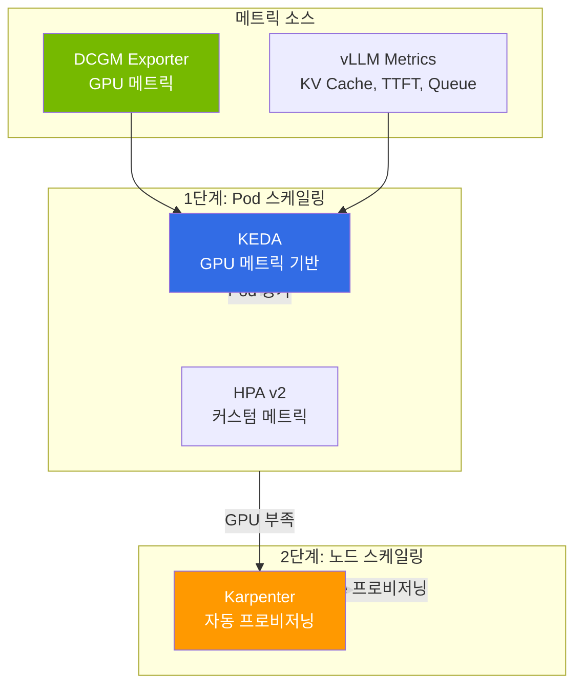
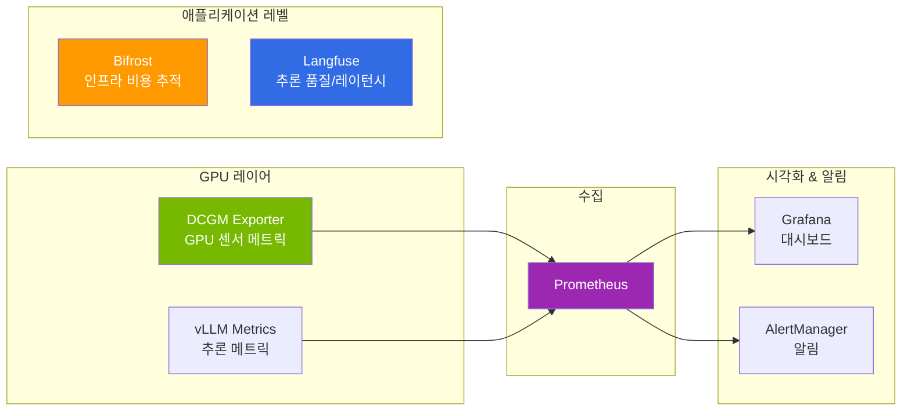
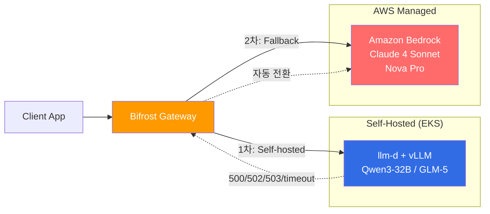
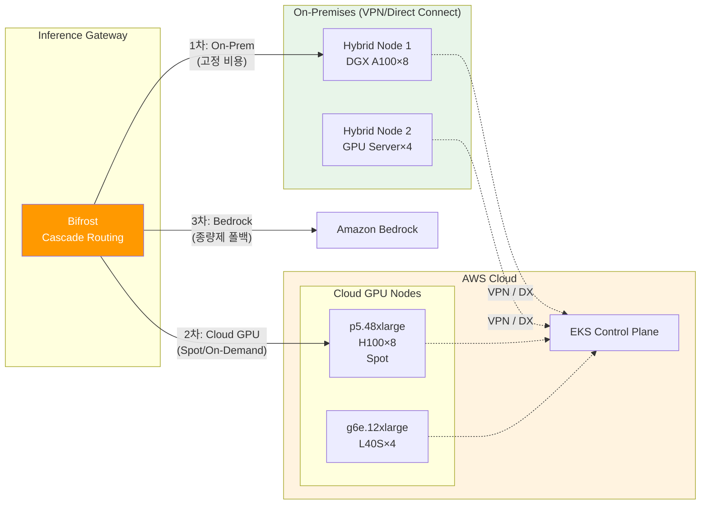

## 개요

LLM 서빙 운영 비용의 대부분은 GPU 가동 시간이며, 비용 효율성을 확보하려면 오토스케일링·관측성·Fallback·온프레미스 통합이 유기적으로 맞물려야 합니다. 본 문서는 2-Tier 스케일링, DCGM/vLLM 모니터링, Bifrost→Bedrock Cascade Fallback, EKS Hybrid Node 통합, 그리고 대형 MoE 모델 배포에서 축적된 실전 교훈을 정리합니다.

## GPU 리소스 관리 & 오토스케일링

### 2-Tier 스케일링 아키텍처

LLM 서빙에서는 Pod 스케일링과 노드 스케일링을 2단계로 구성합니다.



### KEDA 스케일링 구성

LLM 서빙의 핵심 스케일링 시그널 3가지:

```yaml
apiVersion: keda.sh/v1alpha1
kind: ScaledObject
metadata:
  name: llm-inference-scaler
spec:
  scaleTargetRef:
    name: vllm-deployment
  minReplicaCount: 2
  maxReplicaCount: 8
  triggers:
    # 1. KV Cache 포화 — 가장 민감한 시그널
    - type: prometheus
      metadata:
        query: avg(vllm_gpu_cache_usage_perc)
        threshold: "80"
    # 2. 대기 중인 요청 수
    - type: prometheus
      metadata:
        query: sum(vllm_num_requests_waiting)
        threshold: "10"
    # 3. TTFT SLO 위반 근접
    - type: prometheus
      metadata:
        query: |
          histogram_quantile(0.95,
            rate(vllm_time_to_first_token_seconds_bucket[5m]))
        threshold: "2"
```

### Disaggregated Serving 스케일링 기준

Prefill과 Decode의 병목 시그널이 다릅니다.

| | Prefill | Decode |
|---|---|---|
| **병목 시그널** | TTFT 증가, 입력 큐 적체 | TPS 감소, KV Cache 포화 |
| **스케일 기준** | 입력 토큰 처리 대기시간 | 동시 생성 세션 수 |
| **GPU 특성** | Compute 집약 (연산 병목) | Memory 집약 (대역폭 병목) |

### DRA(Dynamic Resource Allocation) 현실

DRA는 K8s 1.32+에서 v1beta1, 1.34+에서 GA로 GPU 파티셔닝/토폴로지 인식 스케줄링을 제공합니다. 그러나 **Karpenter/Auto Mode와 호환되지 않는** 아키텍처적 한계가 있습니다.

- Karpenter는 **노드 생성 전** GPU 리소스를 시뮬레이션해야 하는데, DRA의 ResourceSlice는 **노드 생성 후** DRA Driver가 발행
- 이 "닭과 달걀" 문제로 인해 DRA Pod는 Karpenter에서 skip됨
- **DRA 사용 시**: MNG + Cluster Autoscaler 필수

:::info DRA 사용 판단
**DRA가 필요한 경우:** MIG 파티셔닝, CEL 기반 속성 GPU 선택, P6e-GB200 환경

**Device Plugin이 충분한 경우:** 전체 GPU 단위 할당, Karpenter/Auto Mode 사용
:::

### 비용 최적화 스택

4가지 전략을 조합하여 **총 ~85% 비용 절감**이 가능합니다.

| 전략 | 절감 효과 | 적용 방법 |
|------|---------|---------|
| **Spot 인스턴스** | 60-90% | Karpenter `capacity-type: spot`, p5 Spot $13-15/hr (us-east-2) |
| **Consolidation** | 20-30% | `consolidationPolicy: WhenEmptyOrUnderutilized`, 30초 대기 |
| **Right-sizing** | 15-25% | 모델 크기별 인스턴스 타입 자동 선택 (NodePool weight) |
| **시간대별 스케줄링** | 30-40% | disruption budget으로 비업무 시간 50%+ 축소 |

```yaml
# Karpenter 시간대별 disruption budget 예시
disruption:
  consolidationPolicy: WhenEmptyOrUnderutilized
  consolidateAfter: 30s
  budgets:
    # 업무 시간: 안정성 우선
    - nodes: "10%"
      schedule: "0 9 * * 1-5"
      duration: 9h
    # 비업무 시간: 비용 우선
    - nodes: "50%"
      schedule: "0 18 * * 1-5"
      duration: 15h
```

## Observability & Fallback 전략

### GPU 모니터링 스택



### 핵심 모니터링 메트릭

**GPU 인프라 메트릭 (DCGM):**

| 메트릭 | 설명 | 임계값 |
|--------|------|-------|
| `DCGM_FI_DEV_GPU_UTIL` | GPU SM 활용률 | &gt; 90%: 경고, &gt; 95%: 위험 |
| `DCGM_FI_DEV_MEM_COPY_UTIL` | 메모리 복사 활용률 | &gt; 80%: 주의 |
| `DCGM_FI_DEV_FB_USED` | 프레임버퍼 사용량 | 가용 메모리 &lt; 10%: 위험 |
| `DCGM_FI_DEV_POWER_USAGE` | GPU 전력 소비 | TDP 근접 시 주의 |

**vLLM 추론 메트릭:**

| 메트릭 | 설명 | 임계값 |
|--------|------|-------|
| `vllm:gpu_cache_usage_perc` | KV Cache 사용률 | &gt; 80%: 스케일 아웃 |
| `vllm:num_requests_waiting` | 대기 중인 요청 | &gt; 10: 스케일 아웃 |
| `vllm:time_to_first_token_seconds` | TTFT | P95 &gt; 2초: 조치 필요 |
| `vllm:num_preemptions_total` | 선점 횟수 | 높으면 메모리 부족 |
| `vllm:avg_generation_throughput_toks_per_s` | 생성 처리량 | 기준선 대비 모니터링 |

### 2-Tier 비용 추적

완전한 비용 가시성을 위해 인프라와 애플리케이션 레벨을 모두 추적합니다.

- **Bifrost (인프라 레벨)**: 모델별 토큰 단가, 팀/프로젝트별 예산 관리, 월간 비용 리포트
- **Langfuse (애플리케이션 레벨)**: Agent 워크플로우 각 단계별 토큰 소비, 체인 end-to-end latency, Trace 기반 성능 병목 분석

이 2-Tier 전략으로 "어떤 모델이 얼마나 사용되었는가"(인프라)와 "어떤 기능이 비용을 유발하는가"(애플리케이션)를 동시에 파악할 수 있습니다.

### Bifrost → Bedrock Cascade Fallback

Self-hosted 모델(vLLM/llm-d)이 과부하이거나 장애일 때, Amazon Bedrock의 관리형 모델로 자동 폴백하는 Cascade Routing을 구성할 수 있습니다. Bifrost(또는 LiteLLM)가 Gateway 역할을 하며, 응답 실패/타임아웃 시 Bedrock으로 요청을 전환합니다.



**Bifrost Cascade Routing 설정:**

```yaml
# bifrost-config.yaml
routing:
  defaultModel: self-hosted-qwen3
  strategy: cascade
  cascadeOrder:
    - self-hosted-qwen3      # 1차: EKS Self-hosted (비용 최적)
    - self-hosted-glm5        # 2차: EKS Self-hosted 대안
    - bedrock-claude-sonnet   # 3차: Bedrock 관리형 (폴백)
  fallbackConditions:
    - statusCode: [500, 502, 503, 504]
    - latencyMs: "> 30000"    # 30초 초과 시 폴백
    - errorRate: "> 0.1"      # 에러율 10% 초과 시 폴백

models:
  - name: self-hosted-qwen3
    provider: openai-compatible
    baseUrl: http://inference-gateway.llm-d:8080/v1
    model: Qwen/Qwen3-32B
    priority: 1
    costPer1kTokens: 0.001    # Self-hosted 추정 비용

  - name: self-hosted-glm5
    provider: openai-compatible
    baseUrl: http://glm5-service.agentic-serving:8000/v1
    model: zai-org/GLM-5-FP8
    priority: 2
    costPer1kTokens: 0.003

  - name: bedrock-claude-sonnet
    provider: bedrock
    model: anthropic.claude-sonnet-4-20250514
    region: us-east-1
    priority: 3
    costPer1kTokens: 0.003    # Bedrock 공식 단가
    maxTokens: 4096
```

**Cascade Routing의 장점:**

| 관점 | Self-hosted 단독 | Cascade (Self-hosted + Bedrock) |
|------|----------------|-------------------------------|
| **가용성** | GPU 장애 시 서비스 중단 | Bedrock 폴백으로 무중단 |
| **비용** | GPU 고정 비용 | 평시 Self-hosted(저비용) + 피크 Bedrock(종량제) |
| **용량 계획** | 피크 트래픽 기준 GPU 확보 | 기본 트래픽만 GPU, 초과분 Bedrock |
| **Cold Start** | Spot 중단 시 수 분 지연 | Bedrock 즉시 응답 |

:::tip 비용 최적화 패턴
평시 트래픽의 80%를 Self-hosted로 처리하고, 피크 시 20%를 Bedrock으로 오프로드하면 **GPU를 피크 기준으로 프로비저닝할 필요가 없어** 인프라 비용을 30-40% 추가 절감할 수 있습니다. Spot 인스턴스 중단 시에도 Bedrock이 즉시 백업 역할을 합니다.
:::

## Hybrid Node: 온프레미스 GPU 팜 통합

### 개요

EKS Hybrid Node는 **온프레미스 GPU 서버를 EKS 클러스터에 등록**하는 기능입니다 (2024년 11월 GA). 이미 보유한 DGX, GPU 서버를 클라우드 EKS와 통합하여 하이브리드 Inference 아키텍처를 구성할 수 있습니다.



### Hybrid Node 등록

```bash
# 1. Hybrid Node IAM Role 생성
aws iam create-role \
  --role-name EKSHybridNodeRole \
  --assume-role-policy-document file://hybrid-node-trust-policy.json

aws iam attach-role-policy \
  --role-name EKSHybridNodeRole \
  --policy-arn arn:aws:iam::aws:policy/AmazonEKSWorkerNodePolicy

# 2. 온프레미스 서버에서 Hybrid Node 등록
curl -o hybrid-node-installer.sh https://hybrid.eks.amazonaws.com/installer
chmod +x hybrid-node-installer.sh

sudo ./hybrid-node-installer.sh \
  --cluster-name genai-platform \
  --region us-west-2 \
  --role-arn arn:aws:iam::123456789012:role/EKSHybridNodeRole \
  --credential-provider ssm

# 3. 노드 확인
kubectl get nodes -l node.kubernetes.io/instance-type=hybrid
```

### Hybrid Node GPU Operator 설치

온프레미스 노드에는 AWS 관리 GPU 스택이 없으므로 **GPU Operator 필수**입니다.

```yaml
# GPU Operator Helm Values (Hybrid Node 전용)
driver:
  enabled: true               # 온프레미스: 드라이버 설치 필요
  version: "580.126.18"
  nodeSelector:
    node.kubernetes.io/instance-type: hybrid

toolkit:
  enabled: true
  nodeSelector:
    node.kubernetes.io/instance-type: hybrid

devicePlugin:
  enabled: true               # 온프레미스: Device Plugin도 설치 필요
  nodeSelector:
    node.kubernetes.io/instance-type: hybrid

dcgmExporter:
  enabled: true
  serviceMonitor:
    enabled: true
    additionalLabels:
      location: on-premises   # 온프레미스/클라우드 메트릭 분리
  nodeSelector:
    node.kubernetes.io/instance-type: hybrid
```

### 3-Tier Cascade: On-Prem → Cloud → Bedrock

Hybrid Node와 Bifrost Cascade를 결합하면 **비용 효율성과 가용성을 동시에 극대화**하는 3-Tier 아키텍처를 구성할 수 있습니다.

| Tier | 인프라 | 비용 구조 | 역할 |
|------|--------|---------|------|
| **Tier 1** | On-Prem Hybrid Node (DGX) | 고정 비용 (이미 보유) | 기본 트래픽 처리 (항상 활성) |
| **Tier 2** | Cloud GPU (EKS Spot/OD) | 변동 비용 (시간당) | 피크 트래픽 버스트 |
| **Tier 3** | Amazon Bedrock | 종량제 (토큰당) | 장애/과부하 폴백 |

```yaml
# Bifrost 3-Tier Cascade 설정
routing:
  strategy: cascade
  cascadeOrder:
    - onprem-dgx-llm          # 1차: On-Prem (고정 비용, 항상 활성)
    - cloud-eks-llm            # 2차: Cloud GPU (Spot, 탄력적)
    - bedrock-fallback         # 3차: Bedrock (종량제, 무제한 용량)

models:
  - name: onprem-dgx-llm
    provider: openai-compatible
    baseUrl: http://hybrid-node-vllm.inference:8000/v1
    model: Qwen/Qwen3-32B
    priority: 1
    healthCheck:
      endpoint: /health
      intervalMs: 10000

  - name: cloud-eks-llm
    provider: openai-compatible
    baseUrl: http://inference-gateway.llm-d:8080/v1
    model: Qwen/Qwen3-32B
    priority: 2

  - name: bedrock-fallback
    provider: bedrock
    model: anthropic.claude-sonnet-4-20250514
    region: us-east-1
    priority: 3
```

### Pod 배치 전략: nodeSelector로 워크로드 분리

```yaml
# On-Prem Hybrid Node에 배치 (기본 추론)
apiVersion: apps/v1
kind: Deployment
metadata:
  name: vllm-onprem
spec:
  template:
    spec:
      nodeSelector:
        node.kubernetes.io/instance-type: hybrid
      tolerations:
        - key: nvidia.com/gpu
          operator: Exists
          effect: NoSchedule
      containers:
        - name: vllm
          image: vllm/vllm-openai:v0.6.3
          args: ["Qwen/Qwen3-32B-FP8", "--gpu-memory-utilization=0.95"]
          resources:
            limits:
              nvidia.com/gpu: 1
---
# Cloud GPU Node에 배치 (버스트 트래픽)
apiVersion: apps/v1
kind: Deployment
metadata:
  name: vllm-cloud-burst
spec:
  template:
    spec:
      nodeSelector:
        karpenter.sh/nodepool: gpu-inference  # Cloud Karpenter NodePool
      tolerations:
        - key: nvidia.com/gpu
          operator: Exists
          effect: NoSchedule
      containers:
        - name: vllm
          image: vllm/vllm-openai:v0.6.3
          args: ["Qwen/Qwen3-32B-FP8", "--gpu-memory-utilization=0.95"]
          resources:
            limits:
              nvidia.com/gpu: 1
```

:::warning Hybrid Node 네트워크 고려사항
- **레이턴시**: VPN/Direct Connect 경유로 클라우드 노드 대비 10-50ms 추가 지연
- **대역폭**: 멀티노드 NCCL 통신은 고대역폭 필요 → On-Prem 내 PP는 가능하나, On-Prem↔Cloud 간 PP는 비권장
- **권장**: On-Prem 노드는 독립적인 모델을 서빙하고, Cloud 노드와는 Gateway 레벨에서 Cascade Routing으로 연결
:::

## 실전 교훈: 대형 MoE 모델 배포

### 이미지/모델 다운로드 실패 대응

대형 모델(744GB+)의 가중치 다운로드는 LLM 서빙에서 가장 흔한 Cold Start 병목입니다. HuggingFace Hub에서 수백 GB를 다운로드할 때 네트워크 불안정, 타임아웃, 디스크 부족 등으로 자주 실패합니다.

#### 문제 유형과 대응

| 문제 | 증상 | 대응 |
|------|------|------|
| **HF Hub 다운로드 타임아웃** | Pod CrashLoopBackOff, `ConnectionError` | 재시도 + resume 지원 (`HF_HUB_ENABLE_HF_TRANSFER=1`) |
| **대형 파일 부분 다운로드** | 모델 로딩 시 corruption 에러 | 체크섬 검증 + 재다운로드 |
| **컨테이너 이미지 Pull 느림** | `ImagePullBackOff`, 수 분 대기 | 이미지 사전 캐싱 (Bottlerocket 데이터 볼륨, SOCI) |
| **멀티노드 동시 다운로드** | 네트워크 대역폭 경합 | S3 캐싱 + init container 순차 로딩 |
| **EFS 느린 다운로드** | 로딩 시간 30분+ | NVMe emptyDir로 전환 |

#### 전략 1: HuggingFace Transfer 가속

`hf_transfer`는 Rust 기반 고속 다운로드 라이브러리로, 기본 다운로드 대비 **3-5배 빠릅니다**.

```yaml
env:
  - name: HF_HUB_ENABLE_HF_TRANSFER
    value: "1"
  - name: HF_TOKEN
    valueFrom:
      secretKeyRef:
        name: hf-token
        key: token
  # 다운로드 재시도 설정
  - name: HF_HUB_DOWNLOAD_TIMEOUT
    value: "600"            # 10분 타임아웃
```

#### 전략 2: S3 사전 캐싱 + Init Container

가장 안정적인 방법입니다. 모델 가중치를 S3에 미리 업로드하고, init container에서 로컬 NVMe로 복사합니다.

```yaml
apiVersion: apps/v1
kind: Deployment
metadata:
  name: vllm-with-s3-cache
spec:
  template:
    spec:
      initContainers:
        # 1단계: S3에서 NVMe로 모델 다운로드
        - name: model-downloader
          image: amazon/aws-cli:latest
          command: ["/bin/sh", "-c"]
          args:
            - |
              echo "Checking local cache..."
              if [ -f /models/config.json ]; then
                echo "Model already cached, skipping download"
                exit 0
              fi
              echo "Downloading model from S3..."
              aws s3 sync s3://model-cache/qwen3-32b-fp8/ /models/ \
                --no-progress \
                --expected-size 65000000000
              echo "Download complete, verifying..."
              # 체크섬 검증
              if [ -f /models/model.safetensors.index.json ]; then
                echo "Model verified successfully"
              else
                echo "ERROR: Model incomplete, retrying..."
                rm -rf /models/*
                aws s3 sync s3://model-cache/qwen3-32b-fp8/ /models/
              fi
          volumeMounts:
            - name: model-cache
              mountPath: /models
          resources:
            requests:
              cpu: 2
              memory: 4Gi
      containers:
        - name: vllm
          image: vllm/vllm-openai:v0.6.3
          args:
            - /models
            - "--gpu-memory-utilization=0.95"
          volumeMounts:
            - name: model-cache
              mountPath: /models
      volumes:
        - name: model-cache
          emptyDir:
            sizeLimit: 200Gi  # NVMe emptyDir
```

#### 전략 3: 컨테이너 이미지 사전 캐싱

vLLM/SGLang 이미지(10-20GB)의 Pull 시간을 줄이는 방법입니다.

```yaml
# Karpenter NodePool에서 이미지 사전 Pull 활성화
apiVersion: karpenter.sh/v1
kind: NodePool
metadata:
  name: gpu-inference
spec:
  template:
    spec:
      kubelet:
        # 이미지 GC 임계값을 높여 캐시 유지
        imageGCHighThresholdPercent: 90
        imageGCLowThresholdPercent: 85
```

**SOCI (Seekable OCI) 인덱스 활용:**

ECR에 SOCI 인덱스를 생성하면 이미지를 lazy-loading으로 Pull하여 **컨테이너 시작 시간을 70-80% 단축**합니다.

```bash
# SOCI 인덱스 생성 (ECR)
aws soci create \
  --image-uri 123456789012.dkr.ecr.us-east-2.amazonaws.com/vllm:v0.6.3

# EKS Auto Mode는 SOCI를 자동 지원
# Karpenter: Bottlerocket AMI 사용 시 SOCI 네이티브 지원
```

#### 전략 4: 멀티노드 LWS의 모델 다운로드 조율

LWS로 멀티노드 배포 시, Leader와 Worker가 동시에 같은 모델을 다운로드하면 네트워크 경합이 발생합니다.

```yaml
# Leader Pod: S3에서 다운로드 후 NVMe 캐시
initContainers:
  - name: model-downloader
    command: ["/bin/sh", "-c"]
    args:
      - |
        # Leader만 S3에서 다운로드
        aws s3 sync s3://model-cache/glm5-fp8/ /models/
        echo "READY" > /models/.download-complete

# Worker Pod: Leader 완료 대기 후 독립 다운로드
initContainers:
  - name: model-downloader
    command: ["/bin/sh", "-c"]
    args:
      - |
        # Worker는 독립적으로 S3에서 다운로드
        # (NVMe emptyDir는 노드별 독립이므로 공유 불가)
        aws s3 sync s3://model-cache/glm5-fp8/ /models/
```

:::tip 다운로드 성능 비교
| 방법 | 744GB 모델 소요 시간 | 안정성 | 비용 |
|------|-------------------|--------|------|
| HF Hub 직접 | 20-40분 | 타임아웃 빈번 | 무료 |
| HF Hub + hf_transfer | 10-15분 | 양호 | 무료 |
| **S3 사전 캐싱** | **5-10분** | **매우 안정** | **S3 저장 비용** |
| FSx for Lustre | 5-8분 | 안정 | 높음 |
| NVMe 로컬 캐시 (재기동) | &lt; 1분 | 최고 | 무료 |
:::

### EKS Auto Mode GPU 제약 사항

GLM-5(744B MoE)와 Kimi K2.5(1T MoE) 배포 과정에서 확인된 핵심 제약사항입니다.

#### p6-b200 미지원

2026년 4월 기준, EKS Auto Mode의 managed Karpenter는 **p6-b200.48xlarge를 프로비저닝할 수 없습니다**. NodePool validation은 통과하지만, 실제 NodeClaim 생성 시 `NoCompatibleInstanceTypes` 오류가 발생합니다.

#### GPU 인스턴스 용량 확보

서울/도쿄 리전에서 p5.48xlarge는 InsufficientCapacity가 빈번합니다. **us-east-2 (Ohio) Spot에서 $13-15/hr로 확보 가능**합니다 (On-Demand $98/hr 대비 85% 절감).

| 리전 | p5.48xlarge On-Demand | p5.48xlarge Spot | Spot 가격 |
|------|---------------------|-----------------|----------|
| ap-northeast-2 (서울) | InsufficientCapacity | 미확인 | — |
| ap-northeast-1 (도쿄) | InsufficientCapacity | 미확인 | — |
| **us-east-2 (Ohio)** | 가용성 변동 | **확보 가능** | **$13~15/hr** |

#### GPU Operator 충돌

`devicePlugin.enabled=true`로 GPU Operator를 설치하면 Auto Mode 내장 Device Plugin과 충돌하여 `allocatable=0`이 됩니다. **반드시 `devicePlugin.enabled=false`로 설치**해야 합니다.

#### EC2 인스턴스 직접 종료 불가

Auto Mode 관리 노드는 resource-based policy로 `ec2:TerminateInstances`가 차단됩니다. 노드 정리는 Karpenter NodePool 삭제 또는 Pod 제거를 통해 간접적으로 수행해야 합니다.

### 서빙 프레임워크 호환성

| 모델 | vLLM 지원 | SGLang 지원 | 비고 |
|------|---------|-----------|------|
| Qwen3-32B | 지원 | 지원 | llm-d 기본 모델, Apache 2.0 |
| Kimi K2.5 (1T MoE) | 지원 | 지원 | INT4 W4A16 Marlin MoE, `gpu_memory_utilization=0.85` |
| GLM-5 (744B MoE) | 미지원 | 지원 | `glm_moe_dsa` 아키텍처 → transformers v5.2+ 필요, vLLM은 v4.x 사용 |
| DeepSeek V3.2 | 지원 | 지원 | MoE, 671B/37B active |

:::warning GLM-5 배포 시 주의
GLM-5는 vLLM에서 지원되지 않습니다. SGLang 전용 이미지(`lmsysorg/sglang:glm5-hopper`)를 사용해야 하며, 멀티노드 배포 시 `--pp-size 2 --nnodes 2 --dist-init-addr <leader>:5000`을 설정합니다.
:::

### 스토리지 전략

대형 모델(744GB+)의 가중치 로딩은 스토리지 성능이 핵심입니다.

| 스토리지 | 순차 읽기 | 멀티노드 공유 | 권장 시나리오 |
|---------|---------|------------|------------|
| **NVMe emptyDir** | ~3,500 MB/s | 노드별 개별 | p5 내장 NVMe, 최고 성능 |
| EFS | ~100-300 MB/s | ReadWriteMany | 소형 모델, 공유 필요 시 |
| S3 + init container | ~1,000 MB/s | S3 공유 | 중간 성능, 비용 효율 |
| FSx for Lustre | ~1,000+ MB/s | ReadWriteMany | 학습 워크로드 |

:::tip 대형 모델 권장
GLM-5(744GB), Kimi K2.5(630GB) 같은 대형 모델은 **로컬 NVMe(emptyDir)**를 권장합니다. p5.48xlarge에 8×3.84TB NVMe SSD가 내장되어 추가 비용 없이 최고 성능을 제공합니다. HuggingFace Hub 직접 다운로드 시 첫 기동 10-20분 소요되지만, 이후 로딩은 빠릅니다.
:::

### GPU 쿼터 함정

EC2 vCPU 쿼터가 인스턴스 버킷별로 분리되어 있어 주의가 필요합니다.

| 쿼타 | 적용 인스턴스 | 기본값 | 주의사항 |
|------|------------|--------|---------|
| Running On-Demand P instances | p4d, p5, p5en | 384 | p5.48xlarge(192 vCPU) 2대 가능 |
| Running On-Demand G and VT instances | g5, g6, g6e | **64** | g6e.48xlarge 1대도 불가 → 쿼터 증가 필요 |

GPU NodePool에 `instance-category: [g, p]`를 함께 설정하면, Karpenter가 G 타입을 먼저 시도하여 G 쿼터(64 vCPU)에 걸릴 수 있습니다. P 타입만 필요하면 명시적으로 지정해야 합니다.

## 참고 자료

### 공식 문서
- [KEDA Documentation](https://keda.sh/docs/) — Kubernetes Event-driven Autoscaling
- [Karpenter Documentation](https://karpenter.sh/docs/) — 노드 오토프로비저닝, Disruption, Consolidation
- [EKS Hybrid Nodes](https://docs.aws.amazon.com/eks/latest/userguide/hybrid-nodes.html) — 온프레 GPU 팜 통합
- [NVIDIA DCGM Exporter](https://github.com/NVIDIA/dcgm-exporter) — GPU 센서 메트릭 수집
- [Langfuse Self-hosted](https://langfuse.com/docs/deployment/self-host) — Agent 관측성 OSS

### 논문·기술 블로그
- [a16z "The Economics of AI"](https://a16z.com/navigating-the-high-cost-of-ai-compute/) — GPU 비용 구조 분석
- [AWS Bottlerocket & SOCI](https://aws.amazon.com/blogs/containers/introducing-seekable-oci-for-lazy-loading-container-images/) — 컨테이너 이미지 lazy-loading
- [Spot 인스턴스 운영 가이드 (AWS)](https://aws.amazon.com/ec2/spot/) — Karpenter Spot 중단 대응
- [NVIDIA Triton & DCGM Metrics Guide](https://developer.nvidia.com/dcgm) — GPU 메트릭 해석

### 관련 문서
- [Inference Optimization on EKS (개요)](./index.md) — 추론 최적화 카테고리 진입점
- [KV Cache 최적화 (vLLM Deep Dive + Cache-Aware Routing)](./kv-cache-optimization.md) — vLLM/llm-d/Dynamo 심화
- [Disaggregated Serving + LWS 멀티노드](./disaggregated-serving.md) — Prefill/Decode 분리, LWS 배포
- [GPU 리소스 관리](../gpu-infrastructure/gpu-resource-management.md) — GPU 스케일링, DRA
- [NVIDIA GPU 소프트웨어 스택](../gpu-infrastructure/nvidia-gpu-stack.md) — GPU Operator, DCGM
- [Agent 모니터링 (Langfuse canonical)](../../operations-mlops/observability/agent-monitoring.md) — Langfuse 기반 Agent 관측성
