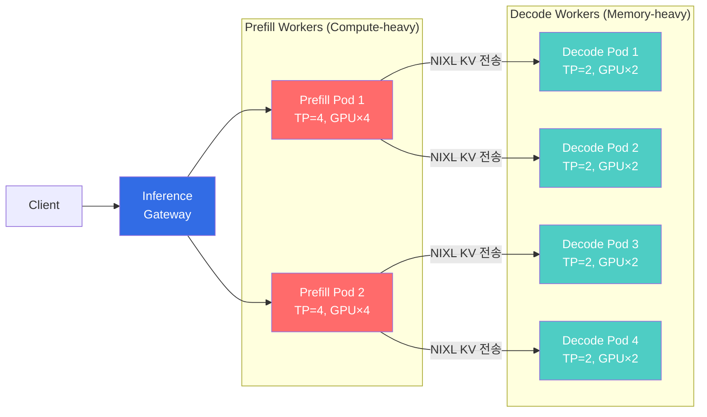
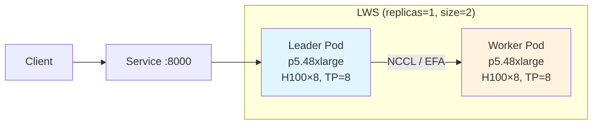

## 개요

대형 LLM 추론은 두 가지 서로 다른 연산 단계(Prefill / Decode)로 나뉘며, 각 단계의 하드웨어 요구 프로파일이 다릅니다. 700B+ 모델은 단일 노드에 적재할 수 없어 멀티노드 파이프라인 병렬화가 필수입니다. 본 문서는 **Disaggregated Serving** 아키텍처와 **LeaderWorkerSet(LWS)** 기반 멀티노드 배포 패턴을 다룹니다.

## Disaggregated Serving

### Prefill/Decode 분리의 필요성

LLM 추론은 두 가지 근본적으로 다른 연산 단계로 구성됩니다.

| 단계 | 특성 | 병목 | GPU 요구 |
|------|------|------|---------|
| **Prefill** | 입력 프롬프트 전체 처리 | Compute-bound | 높은 연산 능력 (TP=4) |
| **Decode** | 토큰 하나씩 순차 생성 | Memory-bound | 높은 메모리 대역폭 (TP=2) |

이 두 단계를 동일 Pod에서 처리하면, Prefill의 compute 부하가 Decode의 latency를 악화시킵니다. 분리하면 각 단계를 독립적으로 스케일링할 수 있어 GPU 활용률이 극대화됩니다.

### 분리 아키텍처



### NIXL: 공통 KV Cache 전송 엔진

NIXL(NVIDIA Inference Xfer Library)은 llm-d, Dynamo, production-stack, aibrix 등 대부분의 프로젝트가 사용하는 공통 KV 전송 엔진입니다. NVLink/RDMA를 활용한 초고속 GPU 간 KV Cache 전송을 제공합니다.

### EKS Auto Mode에서의 Disaggregated Serving

Auto Mode에서는 MIG 파티셔닝이 불가능하므로, **인스턴스(노드) 단위로 역할을 분리**합니다.

```yaml
# Prefill 전용 NodePool
apiVersion: karpenter.sh/v1
kind: NodePool
metadata:
  name: gpu-prefill
spec:
  template:
    metadata:
      labels:
        llm-d-role: prefill
    spec:
      requirements:
        - key: eks.amazonaws.com/instance-family
          operator: In
          values: ["p5"]
      nodeClassRef:
        group: eks.amazonaws.com
        kind: NodeClass
        name: default
      taints:
        - key: llm-d-role
          value: prefill
          effect: NoSchedule
---
# Decode 전용 NodePool
apiVersion: karpenter.sh/v1
kind: NodePool
metadata:
  name: gpu-decode
spec:
  template:
    metadata:
      labels:
        llm-d-role: decode
    spec:
      requirements:
        - key: eks.amazonaws.com/instance-family
          operator: In
          values: ["p5"]
      nodeClassRef:
        group: eks.amazonaws.com
        kind: NodeClass
        name: default
      taints:
        - key: llm-d-role
          value: decode
          effect: NoSchedule
```

**GPU 배치 전략:**
- Prefill: p5.48xlarge 1대에 Prefill Pod 2개 (각 TP=4, GPU 4개)
- Decode: p5.48xlarge 1대에 Decode Pod 4개 (각 TP=2, GPU 2개)
- 이를 통해 GPU 유휴를 최소화

## LWS 기반 멀티노드 대형 모델 서빙

### LeaderWorkerSet 개요

700B+ 대형 MoE 모델은 단일 노드(8× GPU)에 적재할 수 없어 멀티노드 파이프라인 병렬화가 필수입니다. [LeaderWorkerSet(LWS)](https://github.com/kubernetes-sigs/lws)는 Kubernetes 네이티브 멀티노드 워크로드 패턴으로, **Ray 없이도 멀티노드 Pipeline Parallelism**을 구현할 수 있습니다.



### LWS vs Ray 비교

| 항목 | LWS + vLLM | Ray + vLLM |
|------|-----------|-----------|
| **의존성** | LWS CRD만 설치 | Ray Cluster (head + worker) |
| **복잡도** | 낮음 | 높음 |
| **Pod 관리** | K8s StatefulSet 기반 | Ray 자체 스케줄러 |
| **장애 복구** | RecreateGroupOnPodRestart | Ray 재연결 |
| **EKS Auto Mode** | 호환 | 호환 |

### 배포 예제: GLM-5 744B (PP=2, TP=8)

```yaml
apiVersion: leaderworkerset.x-k8s.io/v1
kind: LeaderWorkerSet
metadata:
  name: vllm-glm5-fp8
  namespace: agentic-serving
spec:
  replicas: 1
  leaderWorkerTemplate:
    size: 2  # leader + worker = 2 pods (16 GPUs)
    restartPolicy: RecreateGroupOnPodRestart
    leaderTemplate:
      spec:
        tolerations:
          - key: nvidia.com/gpu
            operator: Exists
            effect: NoSchedule
        containers:
          - name: vllm
            image: vllm/vllm-openai:v0.18.1
            command: ["vllm", "serve"]
            args:
              - "zai-org/GLM-5-FP8"
              - "--tensor-parallel-size=8"
              - "--pipeline-parallel-size=2"
              - "--gpu-memory-utilization=0.92"
              - "--enable-prefix-caching"
            env:
              - name: VLLM_USE_DEEP_GEMM
                value: "1"
              - name: NCCL_DEBUG
                value: "INFO"
            resources:
              requests:
                nvidia.com/gpu: "8"
            volumeMounts:
              - name: model-cache
                mountPath: /models
              - name: dshm
                mountPath: /dev/shm
        volumes:
          - name: model-cache
            emptyDir:
              sizeLimit: 1Ti
          - name: dshm
            emptyDir:
              medium: Memory
              sizeLimit: 32Gi
    workerTemplate:
      spec:
        # leader와 동일한 container spec (args에서 node-rank만 다름)
        tolerations:
          - key: nvidia.com/gpu
            operator: Exists
            effect: NoSchedule
        containers:
          - name: vllm
            image: vllm/vllm-openai:v0.18.1
            command: ["vllm", "serve"]
            args:
              - "zai-org/GLM-5-FP8"
              - "--tensor-parallel-size=8"
              - "--pipeline-parallel-size=2"
              - "--gpu-memory-utilization=0.92"
              - "--enable-prefix-caching"
            env:
              - name: VLLM_USE_DEEP_GEMM
                value: "1"
            resources:
              requests:
                nvidia.com/gpu: "8"
            volumeMounts:
              - name: model-cache
                mountPath: /models
              - name: dshm
                mountPath: /dev/shm
        volumes:
          - name: model-cache
            emptyDir:
              sizeLimit: 1Ti
          - name: dshm
            emptyDir:
              medium: Memory
              sizeLimit: 32Gi
```

### NCCL / EFA 네트워크 최적화

멀티노드 파이프라인 병렬화에서 노드 간 통신 성능이 핵심입니다. p5.48xlarge는 3,200 Gbps EFA(Elastic Fabric Adapter)를 제공합니다.

```yaml
# NCCL 환경 변수 최적화 (LWS Pod에 추가)
env:
  - name: NCCL_DEBUG
    value: "INFO"
  - name: FI_PROVIDER
    value: "efa"
  - name: FI_EFA_USE_DEVICE_RDMA
    value: "1"
  - name: NCCL_ALGO
    value: "Ring"           # Ring이 멀티노드 PP에 적합
  - name: NCCL_PROTO
    value: "Simple"         # EFA에서 안정적
  - name: NCCL_MIN_NCHANNELS
    value: "4"
```

:::tip LWS 장애 복구
`restartPolicy: RecreateGroupOnPodRestart`로 설정하면, Leader 또는 Worker Pod 중 하나가 실패할 때 전체 그룹을 재생성합니다. 멀티노드 NCCL 통신은 모든 노드가 동기화되어야 하므로, 부분 재시작보다 전체 재시작이 안정적입니다.
:::

## 참고 자료

### 공식 문서
- [LeaderWorkerSet GitHub](https://github.com/kubernetes-sigs/lws) — K8s 네이티브 멀티노드 워크로드
- [NVIDIA Dynamo Disaggregated Serving](https://developer.nvidia.com/dynamo) — Prefill/Decode 분리 설계
- [Elastic Fabric Adapter (EFA)](https://docs.aws.amazon.com/AWSEC2/latest/UserGuide/efa.html) — p5.48xlarge 3,200Gbps RDMA
- [NCCL 튜닝 가이드](https://docs.nvidia.com/deeplearning/nccl/user-guide/docs/env.html) — 멀티노드 통신 최적화

### 논문·기술 블로그
- [DistServe (OSDI 2024)](https://arxiv.org/abs/2401.09670) — "DistServe: Disaggregating Prefill and Decoding for Goodput-optimized Large Language Model Serving"
- [Splitwise Paper (Microsoft)](https://arxiv.org/abs/2311.18677) — "Splitwise: Efficient Generative LLM Inference Using Phase Splitting"
- [llm-d Disaggregated Design](https://llm-d.ai/docs/architecture/disaggregated-serving) — llm-d 분리 서빙 아키텍처
- [NIXL Overview (NVIDIA)](https://developer.nvidia.com/blog/introducing-nvidia-dynamo-a-low-latency-distributed-inference-framework-for-scaling-reasoning-ai-models/) — 공통 KV 전송 엔진

### 관련 문서
- [KV Cache 최적화 (vLLM Deep Dive + Cache-Aware Routing)](./kv-cache-optimization.md) — vLLM 병렬화 전략
- [GPU 리소스·관측·Hybrid Node·실전 교훈](./cost-optimization.md) — NodePool 기반 오토스케일링
- [MoE 모델 서빙 가이드](../inference-frameworks/moe-model-serving.md) — MoE 모델 배포
- [llm-d 기반 EKS 분산 추론](../inference-frameworks/llm-d-eks-automode.md) — llm-d 배포 가이드
