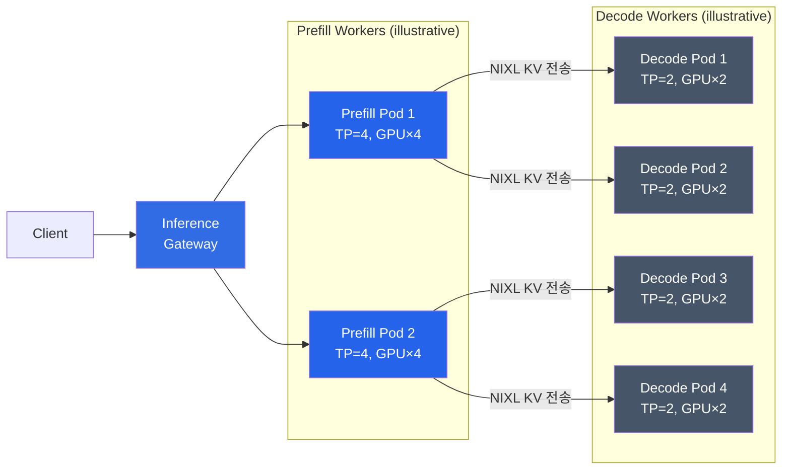
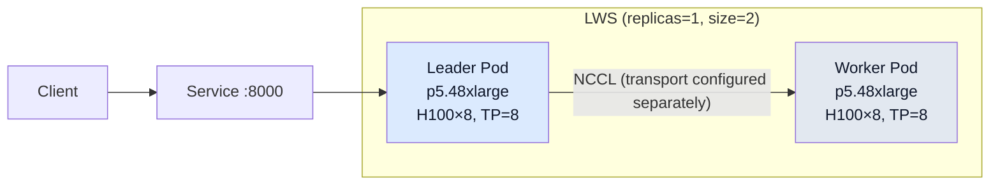

## 개요

LLM 추론은 입력을 처리하는 Prefill과 이후 토큰을 생성하는 Decode로 나뉩니다. 각 단계의 자원 요구량은 모델, 요청 길이, 배치 구성에 따라 달라집니다. GPU에 유지하는 가중치와 KV cache, 런타임의 GPU 메모리 사용량이 사용 가능한 용량에 들어가는지 확인해야 합니다. 양자화, 오프로딩과 지원되는 병렬화 방식도 이 계산에 영향을 줍니다. 오프로딩을 사용하면 호스트 메모리 용량도 따로 확인합니다.

이 문서는 두 구성을 설명합니다. **Disaggregated Serving**은 Prefill과 Decode를 분리해 운영하는 방식입니다. 뒤의 **LeaderWorkerSet(LWS)** 예제는 하나의 모델 복제본을 두 노드에 나눠 실행하는 TP/PP 구성입니다.

## Disaggregated Serving

### Prefill/Decode 분리의 필요성

LLM 추론은 두 가지 근본적으로 다른 연산 단계로 구성됩니다.

| 단계 | 특성 | 흔한 병목 자원 | 크기를 정할 때 확인할 항목 |
|------|------|------|---------|
| **Prefill** | 입력 프롬프트 처리 | 특히 긴 입력에서의 연산 처리량 | 입력 길이, 배치 구성, 연산 능력, 모델 메모리 |
| **Decode** | 이후 토큰을 하나씩 순차 생성 | 특히 작은 배치에서의 가중치/KV 메모리 전송 | 동시 시퀀스 수, 컨텍스트 길이, 메모리 대역폭과 용량 |

이는 워크로드에 따라 달라지는 경향입니다. 그림의 TP=4와 TP=2는 예시이며, 각 단계에 필요한 고정값이 아닙니다. 각 단계가 선택한 병렬화 구성에서 모델과 런타임 상태를 독립적으로 적재할 수 있어야 합니다.

같은 Pod에서 긴 입력의 Prefill과 다른 요청의 Decode가 겹치면, 입력을 처리하는 연산 때문에 토큰 생성이 늦어질 수 있습니다. 두 단계를 분리하면 Prefill과 Decode의 부하에 맞춰 Pod 수를 따로 조정할 수 있습니다. 다만 단계 사이에 KV cache를 전송해야 하므로, GPU 활용률과 함께 전송 비용과 토큰 생성 지연도 비교해야 합니다.

### 분리 아키텍처

그림은 가능한 자원 배치와 KV 전송 방향을 보여줍니다. 서빙 프레임워크는 Prefill/Decode 선택, KV 메타데이터 전달, 응답 스트림도 조정해야 하며, 이 제어·응답 경로는 그림에서 생략했습니다. 이 배치는 뒤에 나오는 GLM-5 배포 구성이 아닙니다.


```mermaid
flowchart LR
    C[Client] --> GW[Inference<br/>Gateway]

    subgraph Prefill["Prefill Workers (illustrative)"]
        PF1[Prefill Pod 1<br/>TP=4, GPU×4]
        PF2[Prefill Pod 2<br/>TP=4, GPU×4]
    end

    subgraph Decode["Decode Workers (illustrative)"]
        DC1[Decode Pod 1<br/>TP=2, GPU×2]
        DC2[Decode Pod 2<br/>TP=2, GPU×2]
        DC3[Decode Pod 3<br/>TP=2, GPU×2]
        DC4[Decode Pod 4<br/>TP=2, GPU×2]
    end

    GW --> PF1
    GW --> PF2
    PF1 -->|"NIXL KV 전송"| DC1
    PF1 -->|"NIXL KV 전송"| DC2
    PF2 -->|"NIXL KV 전송"| DC3
    PF2 -->|"NIXL KV 전송"| DC4

    style GW fill:#326ce5,color:#fff
    style PF1 fill:#2563eb,color:#fff
    style PF2 fill:#2563eb,color:#fff
    style DC1 fill:#475569,color:#fff
    style DC2 fill:#475569,color:#fff
    style DC3 fill:#475569,color:#fff
    style DC4 fill:#475569,color:#fff
```

### NIXL: 공통 KV Cache 전송 엔진

[NIXL](https://github.com/ai-dynamo/nixl/blob/492aca7ce6743570b4cc0857983628ae34ca13c9/README.md)은 프레임워크가 KV cache 이동에 사용할 수 있는 플러그인 기반 데이터 전송 계층입니다. 스케줄러가 아니며, NIXL을 설치하는 것만으로 P/D 분리가 구성되지는 않습니다. [llm-d v0.8.1 P/D 가이드](https://github.com/llm-d/llm-d/blob/v0.8.1/docs/well-lit-paths/foundations/pd-disaggregation.md)는 NIXL 연동을 설명하며, TCP 전송도 지원하되 높은 대역폭의 네트워크를 권장합니다. GPU 직접 전송 여부와 실제 대역폭은 선택한 백엔드, 장치 노출, 드라이버, 물리적 토폴로지에 따라 달라집니다. 서로 다른 EC2 노드가 NVLink로 연결된다거나 NIXL 설치만으로 RDMA 경로가 만들어진다고 가정해서는 안 됩니다.

### EKS Auto Mode에서의 Disaggregated Serving

P/D 분리에 MIG가 필요한 것은 아닙니다. 자원과 스케줄링 조건이 맞으면 같은 노드의 서로 다른 GPU를 별도 Pod에 할당할 수 있습니다. **역할별 전용 NodePool**은 배치와 확장을 나누기 위한 선택 사항입니다. 아래 예시는 EKS Auto Mode의 GPU 지원과 기존 `default` NodeClass를 전제로 하며, 8개 GPU 배치 계산이 해당 인스턴스에 적용되도록 `p5.48xlarge`를 명시합니다.

```yaml
# Prefill 전용 NodePool
apiVersion: karpenter.sh/v1
kind: NodePool
metadata:
  name: gpu-prefill
spec:
  template:
    metadata:
      labels:
        llm-d-role: prefill
    spec:
      requirements:
        - key: node.kubernetes.io/instance-type
          operator: In
          values: ["p5.48xlarge"]
      nodeClassRef:
        group: eks.amazonaws.com
        kind: NodeClass
        name: default
      taints:
        - key: llm-d-role
          value: prefill
          effect: NoSchedule
---
# Decode 전용 NodePool
apiVersion: karpenter.sh/v1
kind: NodePool
metadata:
  name: gpu-decode
spec:
  template:
    metadata:
      labels:
        llm-d-role: decode
    spec:
      requirements:
        - key: node.kubernetes.io/instance-type
          operator: In
          values: ["p5.48xlarge"]
      nodeClassRef:
        group: eks.amazonaws.com
        kind: NodeClass
        name: default
      taints:
        - key: llm-d-role
          value: decode
          effect: NoSchedule
```

**GPU 배치 전략:**

- GPU 개수만 계산하면 8개 슬롯에 4-GPU Prefill Pod는 최대 2개, 2-GPU Decode Pod는 최대 4개까지 배치할 수 있습니다. 이는 측정한 단계별 비율이나 GPU 활용률 보장이 아닙니다.
- 각 단계의 GPU 할당량에 모델이 적재되어야 하며, CPU·메모리·스토리지·토폴로지 제약과 다른 워크로드 때문에 실제 배치 수는 더 적을 수 있습니다.
- NodePool이 단계별 워크로드를 설정해 주지는 않습니다. 아래 배치·자원 필드를 해당 프레임워크의 Deployment에 병합하고, 이미지·명령·포트·KV 전송 및 라우팅 구성은 유지합니다. TP=4/TP=2는 모델 적재와 프레임워크 지원을 확인한 뒤 런타임에서 설정합니다. 아래 코드는 독립 실행 워크로드가 아닌 Pod spec의 일부입니다.

```yaml
# Prefill Deployment.spec.template.spec fragment
nodeSelector:
  llm-d-role: prefill
tolerations:
  - key: llm-d-role
    operator: Equal
    value: prefill
    effect: NoSchedule
containers:
  - name: vllm
    resources:
      requests:
        nvidia.com/gpu: "4"
      limits:
        nvidia.com/gpu: "4"
---
# Decode Deployment.spec.template.spec fragment
nodeSelector:
  llm-d-role: decode
tolerations:
  - key: llm-d-role
    operator: Equal
    value: decode
    effect: NoSchedule
containers:
  - name: vllm
    resources:
      requests:
        nvidia.com/gpu: "2"
      limits:
        nvidia.com/gpu: "2"
```

## LWS 기반 멀티노드 대형 모델 서빙

### LeaderWorkerSet 개요

[LeaderWorkerSet(LWS)](https://github.com/kubernetes-sigs/lws)는 Leader/Worker Pod 그룹을 관리합니다. 컨트롤러는 Pod 수명주기를 관리하고, 추론 런타임이 rank, 통신, 모델 병렬화를 구성합니다. [vLLM v0.23.0의 멀티노드 `mp` 실행 방식](https://github.com/vllm-project/vllm/blob/0fc695fc6d1d82e9a5ac6835ac8e4e1c83703665/docs/serving/parallelism_scaling.md#running-vllm-with-multiprocessing)은 노드 수, rank, 공통 rendezvous 주소를 지정하면 Ray 없이 TP/PP를 구성할 수 있습니다. 아래 예제는 별도 Prefill/Decode worker가 아니라 **하나의 결합된 TP/PP replica**를 만듭니다. 선택한 체크포인트와 하드웨어에 맞는 메모리 계산은 별도로 필요합니다.

이 예제의 TP=8은 각 pipeline stage의 연산을 GPU 8개에 나누고, PP=2는 모델의 layer를 두 stage로 나눕니다. 두 stage가 함께 하나의 모델 복제본으로 요청을 처리합니다.


```mermaid
graph LR
    subgraph "LWS (replicas=1, size=2)"
        L["Leader Pod<br/>p5.48xlarge<br/>H100×8, TP=8"] -->|"NCCL (transport configured separately)"| W["Worker Pod<br/>p5.48xlarge<br/>H100×8, TP=8"]
    end
    C[Client] --> S["Service :8000"]
    S --> L
    style L fill:#dbeafe,color:#0f172a
    style W fill:#e2e8f0,color:#0f172a
```

### LWS vs Ray 비교

| 항목 | LWS + vLLM `mp` | Ray 런타임을 사용하는 vLLM |
|------|-----------|-----------|
| **의존성** | LWS CRD, 컨트롤러, admission webhook과 각 Pod의 vLLM | 호환되는 Ray 설치 및 통신 가능한 head/worker 프로세스와 vLLM |
| **런타임 구성** | 노드 수, rank, rendezvous 주소를 명시 | Ray 클러스터 구성과 vLLM의 Ray executor 설정 |
| **Pod 관리** | LWS가 StatefulSet과 Pod 그룹을 조정하고 Kubernetes가 Pod를 스케줄링 | Kubernetes가 Pod를 스케줄링하며 KubeRay 같은 컨트롤러가 관리 가능; Ray는 actor를 스케줄링 |
| **장애 복구** | LWS 재시작 정책에 따라 그룹을 재생성하고 엔진을 다시 초기화 | Ray·컨트롤러·애플리케이션의 복구 설정에 따라 달라지며, 재연결만으로 서빙 가용성을 보장하지 않음 |
| **EKS Auto Mode** | 선택한 런타임의 GPU·스토리지·네트워크 요건 확인 필요 | 같은 인프라 검증이 필요하며, Ray 선택만으로 호환성이 확보되지는 않음 |

LWS와 Ray는 배타적인 선택이 아닙니다. LWS v0.8.0의 vLLM 예제도 Ray 클러스터를 시작합니다. 이 문서에서는 그 대신 vLLM의 `mp` 백엔드를 명시합니다.

### 배포 예제: GLM-5 744B (PP=2, TP=8)

이 템플릿은 LWS **v0.8.0**과 두 Pod 모두 동일한 vLLM **v0.23.0**을 사용합니다. [GLM-5-FP8 모델 카드](https://huggingface.co/zai-org/GLM-5-FP8/tree/4f96cc5eec29dcee5d6ded54f7ffe889438f9516)의 총 파라미터 수는 744B이며, 활성 파라미터 수가 가중치 저장 용량을 뜻하지는 않습니다. 크기를 가늠하면 744B 파라미터를 각각 1바이트로 표현해도 scale과 기타 텐서를 제외하고 약 744 GB로, `p5.48xlarge` 한 대의 총 GPU 메모리 640 GB보다 큽니다. 이 계산은 실제 체크포인트 크기가 아닙니다. 두 노드 구성만으로 모델 적재, 컨텍스트 길이, 측정 성능이 입증되는 것도 아닙니다.

매니페스트를 사용하기 전에 다음 조건을 준비합니다.

1. LWS v0.8.0의 CRD뿐 아니라 컨트롤러와 admission webhook도 설치되어 있어야 합니다. `agentic-serving` 네임스페이스, Auto Mode GPU 지원, `default` NodeClass가 필요합니다.
2. 네임스페이스에 `model-glm5-fp8`라는 Bound PVC를 준비합니다. 두 노드가 동시에 접근할 수 있는 스토리지와 드라이버가 필요하며, ReadOnlyMany 또는 ReadWriteMany 지원이 한 방법입니다. 볼륨의 `GLM-5-FP8` 디렉터리에 tokenizer·설정 파일을 포함한 [모델 revision `4f96cc5eec29dcee5d6ded54f7ffe889438f9516`](https://huggingface.co/zai-org/GLM-5-FP8/tree/4f96cc5eec29dcee5d6ded54f7ffe889438f9516) 전체를 준비하고 파일 무결성과 사용 가능한 용량을 확인합니다. 일반적인 단일 노드 ReadWriteOnce 볼륨으로는 이 접근 조건을 충족할 수 없습니다.
3. 선택한 이미지 태그의 digest를 확인해 기록하고 CUDA/드라이버 조합을 검증합니다. 아래 CPU·메모리 예산, 8,192토큰 컨텍스트 상한, 최대 동시 시퀀스 8개, GPU 메모리 비율은 시작 구성값이며 검증된 용량 권장값이 아닙니다.
4. Pod 간 통신을 신뢰할 수 있는 참여자로 제한하고, 두 Pod 사이에 런타임의 rendezvous와 데이터 통신 경로를 허용합니다. vLLM의 분산 통신은 인증·암호화를 갖춘 공개 프로토콜이 아닙니다. ClusterIP API에도 적절한 호출자 접근 정책이 필요하며, 이 예제는 공개 ingress를 추가하지 않습니다.

전용 `gpu-glm5` NodePool은 앞의 P/D용 풀과 별개입니다. 각 Pod가 `p5.48xlarge`의 GPU 8개를 모두 요청하므로, 두 Pod로 구성된 한 그룹에는 해당 노드가 2대 필요합니다.

```yaml
# Separate capacity for this coupled TP/PP replica, not P/D stage workers.
apiVersion: karpenter.sh/v1
kind: NodePool
metadata:
  name: gpu-glm5
spec:
  template:
    metadata:
      labels:
        serving-workload: glm5
    spec:
      requirements:
        - key: node.kubernetes.io/instance-type
          operator: In
          values: ["p5.48xlarge"]
        - key: karpenter.sh/capacity-type
          operator: In
          values: ["on-demand"]
      nodeClassRef:
        group: eks.amazonaws.com
        kind: NodeClass
        name: default
      taints:
        - key: nvidia.com/gpu
          value: "true"
          effect: NoSchedule
---
apiVersion: leaderworkerset.x-k8s.io/v1
kind: LeaderWorkerSet
metadata:
  name: vllm-glm5-fp8
  namespace: agentic-serving
spec:
  replicas: 1
  startupPolicy: LeaderCreated
  leaderWorkerTemplate:
    size: 2  # 1 leader + 1 worker; TP 8 * PP 2 = 16 GPU processes
    restartPolicy: RecreateGroupOnPodRestart
    leaderTemplate:
      metadata:
        labels:
          role: leader
      spec:
        automountServiceAccountToken: false
        nodeSelector:
          serving-workload: glm5
          node.kubernetes.io/instance-type: p5.48xlarge
        tolerations:
          - key: nvidia.com/gpu
            operator: Exists
            effect: NoSchedule
        containers:
          - name: vllm
            image: vllm/vllm-openai:v0.23.0
            command: ["vllm", "serve"]
            args:
              - "/models/GLM-5-FP8"
              - "--served-model-name=zai-org/GLM-5-FP8"
              - "--distributed-executor-backend=mp"
              - "--tensor-parallel-size=8"
              - "--pipeline-parallel-size=2"
              - "--nnodes=$(LWS_GROUP_SIZE)"
              - "--node-rank=$(LWS_WORKER_INDEX)"
              - "--master-addr=$(LWS_LEADER_ADDRESS)"
              - "--master-port=29501"
              - "--host=0.0.0.0"
              - "--port=8000"
              - "--max-model-len=8192"
              - "--max-num-seqs=8"
              - "--gpu-memory-utilization=0.92"
              - "--enable-prefix-caching"
            env:
              - name: VLLM_HOST_IP
                valueFrom:
                  fieldRef:
                    fieldPath: status.podIP
              - name: HF_HUB_OFFLINE
                value: "1"
            ports:
              - name: http
                containerPort: 8000
            readinessProbe:
              httpGet:
                path: /health
                port: http
              periodSeconds: 10
              timeoutSeconds: 5
            resources:
              requests:
                cpu: "32"
                memory: 512Gi
                nvidia.com/gpu: "8"
              limits:
                memory: 1Ti
                nvidia.com/gpu: "8"
            volumeMounts:
              - name: model
                mountPath: /models
                readOnly: true
              - name: dshm
                mountPath: /dev/shm
        volumes:
          - name: model
            persistentVolumeClaim:
              claimName: model-glm5-fp8
              readOnly: true
          - name: dshm
            emptyDir:
              medium: Memory
              sizeLimit: 32Gi
    workerTemplate:
      spec:
        automountServiceAccountToken: false
        nodeSelector:
          serving-workload: glm5
          node.kubernetes.io/instance-type: p5.48xlarge
        tolerations:
          - key: nvidia.com/gpu
            operator: Exists
            effect: NoSchedule
        containers:
          - name: vllm
            image: vllm/vllm-openai:v0.23.0
            command: ["vllm", "serve"]
            args:
              - "/models/GLM-5-FP8"
              - "--served-model-name=zai-org/GLM-5-FP8"
              - "--distributed-executor-backend=mp"
              - "--tensor-parallel-size=8"
              - "--pipeline-parallel-size=2"
              - "--nnodes=$(LWS_GROUP_SIZE)"
              - "--node-rank=$(LWS_WORKER_INDEX)"
              - "--master-addr=$(LWS_LEADER_ADDRESS)"
              - "--master-port=29501"
              - "--headless"
              - "--max-model-len=8192"
              - "--max-num-seqs=8"
              - "--gpu-memory-utilization=0.92"
              - "--enable-prefix-caching"
            env:
              - name: VLLM_HOST_IP
                valueFrom:
                  fieldRef:
                    fieldPath: status.podIP
              - name: HF_HUB_OFFLINE
                value: "1"
            resources:
              requests:
                cpu: "32"
                memory: 512Gi
                nvidia.com/gpu: "8"
              limits:
                memory: 1Ti
                nvidia.com/gpu: "8"
            volumeMounts:
              - name: model
                mountPath: /models
                readOnly: true
              - name: dshm
                mountPath: /dev/shm
        volumes:
          - name: model
            persistentVolumeClaim:
              claimName: model-glm5-fp8
              readOnly: true
          - name: dshm
            emptyDir:
              medium: Memory
              sizeLimit: 32Gi
---
apiVersion: v1
kind: Service
metadata:
  name: vllm-glm5-fp8-api
  namespace: agentic-serving
spec:
  type: ClusterIP
  selector:
    leaderworkerset.sigs.k8s.io/name: vllm-glm5-fp8
    role: leader
  ports:
    - name: http
      port: 8000
      targetPort: http
```

LWS는 두 컨테이너에 `LWS_GROUP_SIZE=2`, worker index `0`/`1`, 동일한 leader DNS 주소를 주입합니다. Kubernetes는 컨테이너 인자의 `$(...)`를 확장합니다. Leader가 HTTP API를 제공하고, rank 1은 `--headless`로 실행해 별도 API 서버를 열지 않습니다.

`startupPolicy: LeaderCreated`는 Leader의 health check가 성공하기 전에 Worker를 시작하게 합니다. 이 엔진은 Worker와 함께 초기화되므로, Worker 생성을 Leader의 준비 완료까지 미루는 `LeaderReady`를 사용하면 서로를 기다리게 됩니다. LWS의 headless discovery Service는 readiness 이전에도 주소를 게시하며, 별도의 API Service는 준비된 Leader만 선택합니다.

vLLM에 전달한 체크포인트 경로는 실제 읽기 전용 볼륨 경로이므로 두 Pod가 동일하게 준비된 파일을 읽습니다. `emptyDir`를 마운트하는 것만으로 Hugging Face 다운로드 위치가 바뀌지는 않으며, `sizeLimit: 1Ti`도 노드 디스크 1 TiB를 할당하거나 Pod 삭제 후 파일을 보존하지 않습니다. Pod 로컬 다운로드를 사용한다면 `--download-dir`을 마운트 경로로 지정하고 충분한 ephemeral storage를 요청한 뒤 실제 노드 디스크도 준비해야 합니다. 이 템플릿의 메모리 기반 `/dev/shm` 32 GiB는 Pod/컨테이너 메모리를 사용하므로 설정한 메모리 예산에 포함해야 합니다.

Readiness는 vLLM의 `/health`를 검사하며, 응답 품질이나 처리 용량을 입증하지는 않습니다. 이 템플릿에는 startup/liveness 재시작 타이머를 두지 않았습니다. 이를 추가할 때는 모델 로딩과 초기화 시간을 관찰해 시작 허용 시간을 정해야 합니다. Worker의 Kubernetes Ready 상태는 분산 초기화 완료보다 먼저 나타날 수 있으므로, Worker Ready 상태만 보지 말고 Leader와 런타임 로그로 그룹 초기화를 확인합니다.

### NCCL / EFA 네트워크 최적화

AWS가 제시한 `p5.48xlarge`의 EFA 네트워크 대역폭은 합계 최대 3,200 Gbps입니다. 이는 인스턴스 사양이며, 측정한 NCCL 처리량이나 종단 간 KV 전송 속도가 아닙니다. 앞의 매니페스트는 GPU를 할당하지만 EFA나 EFA용 컨테이너 소프트웨어 구성을 준비하지 않습니다.

EFA를 사용하려면 노드 생성 시 EFA 인터페이스, 필요한 보안 그룹 통신, Pod에 대한 장치 할당을 구성합니다. Auto Mode에서는 문서화된 NodeClass/인터페이스 구성과 EFA device plugin의 `vpc.amazonaws.com/efa` 자원을 사용합니다. 현재 EKS 가이드는 Auto Mode에서 EFA DRA 경로를 지원하지 않습니다. 다른 인스턴스 예제의 장치 수를 복사하지 말고 실제 연결된 인터페이스와 토폴로지에 맞춰 수량을 정해야 합니다. 컨테이너에도 호환되는 CUDA/NCCL, libfabric, AWS OFI NCCL plugin이 필요합니다. 환경 변수만으로 이 조건들이 갖춰지지는 않습니다.

```yaml
# Container fragment for temporary transport diagnosis, not EFA provisioning.
env:
  - name: NCCL_DEBUG
    value: "INFO"
```

전송 경로를 확인하는 제한된 테스트에서 초기화 로그의 선택된 provider를 확인합니다. AWS NCCL 가이드는 `NET/OFI Selected Provider is efa`를 NCCL의 EFA 선택 근거로 사용합니다. 이는 대역폭 측정이나 애플리케이션 테스트와 별개입니다. Socket 기준 구성이라면 NCCL이 socket을 선택했다는 사실을 기록합니다. 처음에는 `NCCL_ALGO`, `NCCL_PROTO`, channel 재정의를 지정하지 않아 NCCL이 지원되는 값을 선택하도록 둡니다. NVIDIA는 값을 강제하면 버전 변경 후 성능 저하나 잘못된 동작이 발생할 수 있다고 설명합니다. 특정 버전에서 재현한 문제에 한해 재정의를 적용하고, 조사 후에는 진단 로그 수준을 되돌립니다.

:::tip LWS 장애 복구
`RecreateGroupOnPodRestart`는 구성원 Pod가 재생성되거나 그 안의 컨테이너가 재시작되면 그룹을 재생성합니다. 결합된 런타임을 초기화하는 동작이며, 진행 중인 요청이나 GPU의 KV 상태를 보존하지는 않습니다. `replicas: 1`에서는 두 Pod가 모델을 다시 적재하고 초기화한 뒤 Leader가 readiness를 통과할 때까지 유일한 서빙 replica가 중단됩니다. 준비한 PVC는 체크포인트 파일을 유지할 수 있지만 모델 로딩을 없애거나 요청 상태를 복구하지는 않습니다. 가용성 계획에는 필요한 자원을 갖춘 독립 replica와 클라이언트 재시도·오류 처리가 필요하며, 그룹 재시작 자체가 연속 서빙을 보장하는 것은 아닙니다.
:::

## 참고 자료

### 공식 문서
- [vLLM v0.23.0 distributed serving](https://github.com/vllm-project/vllm/blob/0fc695fc6d1d82e9a5ac6835ac8e4e1c83703665/docs/serving/parallelism_scaling.md) — 노드 수, rank, 네트워크, 모델 경로의 실행 조건
- [LWS v0.8.0 installation](https://github.com/kubernetes-sigs/lws/blob/fc19b9ae9b0113d228ba15f4b62b06bea434b510/site/content/en/docs/installation/_index.md) and [vLLM example](https://github.com/kubernetes-sigs/lws/blob/fc19b9ae9b0113d228ba15f4b62b06bea434b510/docs/examples/vllm/GPU/lws.yaml) — 컨트롤러 설치와 upstream의 Ray 기반 예제
- [LWS v0.8.0 API](https://github.com/kubernetes-sigs/lws/blob/fc19b9ae9b0113d228ba15f4b62b06bea434b510/api/leaderworkerset/v1/leaderworkerset_types.go) — 시작·재시작 정책과 주입 변수
- [Kubernetes GPU scheduling](https://kubernetes.io/docs/tasks/manage-gpus/scheduling-gpus/) and [volumes](https://kubernetes.io/docs/concepts/storage/volumes/#emptydir) — 자원과 스토리지 의미
- [Kubernetes persistent volumes](https://kubernetes.io/docs/concepts/storage/persistent-volumes/#access-modes) — 멀티노드 접근 모드
- [EKS Auto Mode GPU workloads](https://docs.aws.amazon.com/eks/latest/userguide/auto-accelerated.html), [NodePools](https://docs.aws.amazon.com/eks/latest/userguide/create-node-pool.html) and [EFA device management](https://docs.aws.amazon.com/eks/latest/userguide/device-management-efa.html) — 모드별 전제 조건 (2026-09-19 확인)
- [EC2 P5 specifications](https://aws.amazon.com/ec2/instance-types/p5/) and [EFA/NCCL setup](https://docs.aws.amazon.com/AWSEC2/latest/UserGuide/efa-start-nccl.html) — 하드웨어 상한, 소프트웨어 구성, provider 확인
- [Ray on Kubernetes](https://docs.ray.io/en/latest/cluster/kubernetes/index.html) — KubeRay의 수명주기 관리 범위
- [LeaderWorkerSet GitHub](https://github.com/kubernetes-sigs/lws) — K8s 네이티브 멀티노드 워크로드
- [NVIDIA Dynamo Disaggregated Serving](https://developer.nvidia.com/dynamo) — Prefill/Decode 분리 설계
- [Elastic Fabric Adapter (EFA)](https://docs.aws.amazon.com/AWSEC2/latest/UserGuide/efa.html) — EFA 기능과 전제 조건
- [NCCL 튜닝 가이드](https://docs.nvidia.com/deeplearning/nccl/user-guide/docs/env.html) — 멀티노드 통신 최적화

### 논문·기술 블로그
- [DistServe (OSDI 2024)](https://arxiv.org/abs/2401.09670) — "DistServe: Disaggregating Prefill and Decoding for Goodput-optimized Large Language Model Serving"
- [Splitwise Paper (Microsoft)](https://arxiv.org/abs/2311.18677) — "Splitwise: Efficient Generative LLM Inference Using Phase Splitting"
- [llm-d Disaggregated Design](https://llm-d.ai/docs/architecture/advanced/disaggregation) — llm-d 분리 서빙 아키텍처
- [NIXL Overview (NVIDIA)](https://developer.nvidia.com/blog/introducing-nvidia-dynamo-a-low-latency-distributed-inference-framework-for-scaling-reasoning-ai-models/) — 공통 KV 전송 엔진

### 관련 문서
- [KV Cache 최적화 (vLLM Deep Dive + Cache-Aware Routing)](./kv-cache-optimization.md) — vLLM 병렬화 전략
- [GPU 오토스케일링과 대형 모델 배포 운영](./gpu-autoscaling-operations.md) — NodePool 기반 오토스케일링
- [MoE 모델 서빙 가이드](../inference-frameworks/moe-model-serving.md) — MoE 모델 배포
- [llm-d 기반 EKS 분산 추론](../inference-frameworks/llm-d-eks-automode.md) — llm-d 배포 가이드
