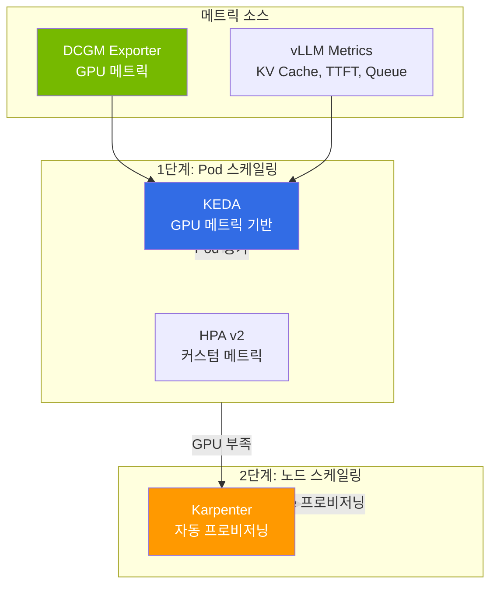

## 개요

LLM 서빙 운영에서 GPU 가동 시간은 비용과 직결되며, 트래픽 변동에 맞춰 자원을 탄력적으로 확장·축소하는 오토스케일링이 효율성의 핵심입니다. 본 문서는 LLM 서빙에 특화된 2-Tier 스케일링(Pod·노드), DRA(Dynamic Resource Allocation)의 현실적 제약, 그리고 GLM-5(744B), Kimi K2.5(1T) 등 대형 MoE 모델 배포 과정에서 축적된 실전 운영 교훈을 정리합니다.

:::info 관련 주제
GPU 비용 최적화(Spot·Consolidation·시간대별 스케줄링)는 [EKS 비용 관리](/docs/eks-best-practices/resource-cost/cost-management), GPU·vLLM 모니터링과 Cascade Fallback은 [Agent 모니터링 & 운영](../../operations-mlops/observability/agent-monitoring.md), 온프레미스 GPU 통합은 [EKS Hybrid Nodes 완전 가이드](/docs/hybrid-infrastructure/hybrid-nodes-adoption-guide)를 참조하세요.
:::

## GPU 리소스 관리 & 오토스케일링

### 2-Tier 스케일링 아키텍처

LLM 서빙에서는 Pod 스케일링과 노드 스케일링을 2단계로 구성합니다.



### KEDA 스케일링 구성

LLM 서빙의 핵심 스케일링 시그널 3가지:

```yaml
apiVersion: keda.sh/v1alpha1
kind: ScaledObject
metadata:
  name: llm-inference-scaler
spec:
  scaleTargetRef:
    name: vllm-deployment
  minReplicaCount: 2
  maxReplicaCount: 8
  triggers:
    # 1. KV Cache 포화 — 가장 민감한 시그널
    - type: prometheus
      metadata:
        query: avg(vllm_gpu_cache_usage_perc)
        threshold: "80"
    # 2. 대기 중인 요청 수
    - type: prometheus
      metadata:
        query: sum(vllm_num_requests_waiting)
        threshold: "10"
    # 3. TTFT SLO 위반 근접
    - type: prometheus
      metadata:
        query: |
          histogram_quantile(0.95,
            rate(vllm_time_to_first_token_seconds_bucket[5m]))
        threshold: "2"
```

### Disaggregated Serving 스케일링 기준

Prefill과 Decode의 병목 시그널이 다릅니다.

| | Prefill | Decode |
|---|---|---|
| **병목 시그널** | TTFT 증가, 입력 큐 적체 | TPS 감소, KV Cache 포화 |
| **스케일 기준** | 입력 토큰 처리 대기시간 | 동시 생성 세션 수 |
| **GPU 특성** | Compute 집약 (연산 병목) | Memory 집약 (대역폭 병목) |

### DRA(Dynamic Resource Allocation) 현실

DRA는 K8s 1.34에서 GA(`resource.k8s.io/v1`, 기본 활성화)되어 GPU 파티셔닝/토폴로지 인식 스케줄링을 제공합니다. 그러나 **Karpenter/Auto Mode와 호환되지 않는** 아키텍처적 한계가 있습니다.

- Karpenter는 **노드 생성 전** GPU 리소스를 시뮬레이션해야 하는데, DRA의 ResourceSlice는 **노드 생성 후** DRA Driver가 발행
- 이 "닭과 달걀" 문제로 인해 DRA Pod는 Karpenter에서 skip됨
- **DRA 사용 시**: MNG + Cluster Autoscaler 필수

:::info DRA 사용 판단
**DRA가 필요한 경우:** MIG 파티셔닝, CEL 기반 속성 GPU 선택, P6e-GB200 환경

**Device Plugin이 충분한 경우:** 전체 GPU 단위 할당, Karpenter/Auto Mode 사용
:::

GPU 스케일링·DRA의 기초 개념은 [GPU 리소스 관리](../gpu-infrastructure/gpu-resource-management.md)를 참조하세요.

## 실전 교훈: 대형 MoE 모델 배포

### 이미지/모델 다운로드 실패 대응

대형 모델(744GB+)의 가중치 다운로드는 LLM 서빙에서 가장 흔한 Cold Start 병목입니다. HuggingFace Hub에서 수백 GB를 다운로드할 때 네트워크 불안정, 타임아웃, 디스크 부족 등으로 자주 실패합니다.

#### 문제 유형과 대응

| 문제 | 증상 | 대응 |
|------|------|------|
| **HF Hub 다운로드 타임아웃** | Pod CrashLoopBackOff, `ConnectionError` | 재시도 + resume 지원 (`HF_HUB_ENABLE_HF_TRANSFER=1`) |
| **대형 파일 부분 다운로드** | 모델 로딩 시 corruption 에러 | 체크섬 검증 + 재다운로드 |
| **컨테이너 이미지 Pull 느림** | `ImagePullBackOff`, 수 분 대기 | 이미지 사전 캐싱 (Bottlerocket 데이터 볼륨, SOCI) |
| **멀티노드 동시 다운로드** | 네트워크 대역폭 경합 | S3 캐싱 + init container 순차 로딩 |
| **EFS 느린 다운로드** | 로딩 시간 30분+ | NVMe emptyDir로 전환 |

#### 전략 1: HuggingFace Hub 고속 전송

HuggingFace Hub는 2025년 말부터 Xet 스토리지 백엔드로 전환되어, `huggingface_hub` v0.32.0+에서 `hf-xet`(Rust 기반 청크 dedup) 바이너리가 기본 포함됩니다. 최대 처리량이 필요한 경우 `HF_XET_HIGH_PERFORMANCE=1`을 설정합니다.

```yaml
env:
  - name: HF_XET_HIGH_PERFORMANCE
    value: "1"              # Xet 고성능 모드
  - name: HF_TOKEN
    valueFrom:
      secretKeyRef:
        name: hf-token
        key: token
  # 다운로드 재시도 설정
  - name: HF_HUB_DOWNLOAD_TIMEOUT
    value: "600"            # 10분 타임아웃
```

#### 전략 2: S3 사전 캐싱 + Init Container

가장 안정적인 방법입니다. 모델 가중치를 S3에 미리 업로드하고, init container에서 로컬 NVMe로 복사합니다.

```yaml
apiVersion: apps/v1
kind: Deployment
metadata:
  name: vllm-with-s3-cache
spec:
  template:
    spec:
      initContainers:
        # 1단계: S3에서 NVMe로 모델 다운로드
        - name: model-downloader
          image: amazon/aws-cli:latest
          command: ["/bin/sh", "-c"]
          args:
            - |
              echo "Checking local cache..."
              if [ -f /models/config.json ]; then
                echo "Model already cached, skipping download"
                exit 0
              fi
              echo "Downloading model from S3..."
              aws s3 sync s3://model-cache/qwen3-32b-fp8/ /models/ \
                --no-progress \
                --expected-size 65000000000
              echo "Download complete, verifying..."
              # 체크섬 검증
              if [ -f /models/model.safetensors.index.json ]; then
                echo "Model verified successfully"
              else
                echo "ERROR: Model incomplete, retrying..."
                rm -rf /models/*
                aws s3 sync s3://model-cache/qwen3-32b-fp8/ /models/
              fi
          volumeMounts:
            - name: model-cache
              mountPath: /models
          resources:
            requests:
              cpu: 2
              memory: 4Gi
      containers:
        - name: vllm
          image: vllm/vllm-openai:v0.23.0
          args:
            - /models
            - "--gpu-memory-utilization=0.95"
          volumeMounts:
            - name: model-cache
              mountPath: /models
      volumes:
        - name: model-cache
          emptyDir:
            sizeLimit: 200Gi  # NVMe emptyDir
```

#### 전략 3: 컨테이너 이미지 사전 캐싱

vLLM/SGLang 이미지(10-20GB)의 Pull 시간을 줄이는 방법입니다.

```yaml
# Karpenter NodePool에서 이미지 사전 Pull 활성화
apiVersion: karpenter.sh/v1
kind: NodePool
metadata:
  name: gpu-inference
spec:
  template:
    spec:
      kubelet:
        # 이미지 GC 임계값을 높여 캐시 유지
        imageGCHighThresholdPercent: 90
        imageGCLowThresholdPercent: 85
```

**SOCI (Seekable OCI) 인덱스 활용:**

ECR에 SOCI 인덱스를 생성하면 이미지를 lazy-loading으로 Pull하여 컨테이너 시작 시간을 단축합니다. AWS 공식 벤치마크 기준 **약 50%(Fargate), 이미지 크기에 따라 30-70%**(SageMaker BYOI) 개선되며, 250MB 이상 대형 이미지에서 효과적입니다.

```bash
# SOCI 인덱스 생성: 별도 soci CLI 사용
# 방법 1: soci create (v1, 기본)
sudo soci create 123456789012.dkr.ecr.us-east-2.amazonaws.com/vllm:v0.6.3

# 방법 2: CloudFormation SOCI Index Builder (자동화 권장)
# https://github.com/awslabs/soci-snapshotter/tree/main/builder-example

# EKS Auto Mode는 SOCI를 자동 지원
# Karpenter: Bottlerocket AMI 사용 시 SOCI 네이티브 지원
```

#### 전략 4: 멀티노드 LWS의 모델 다운로드 조율

LWS로 멀티노드 배포 시, Leader와 Worker가 동시에 같은 모델을 다운로드하면 네트워크 경합이 발생합니다.

```yaml
# Leader Pod: S3에서 다운로드 후 NVMe 캐시
initContainers:
  - name: model-downloader
    command: ["/bin/sh", "-c"]
    args:
      - |
        # Leader만 S3에서 다운로드
        aws s3 sync s3://model-cache/glm5-fp8/ /models/
        echo "READY" > /models/.download-complete

# Worker Pod: Leader 완료 대기 후 독립 다운로드
initContainers:
  - name: model-downloader
    command: ["/bin/sh", "-c"]
    args:
      - |
        # Worker는 독립적으로 S3에서 다운로드
        # (NVMe emptyDir는 노드별 독립이므로 공유 불가)
        aws s3 sync s3://model-cache/glm5-fp8/ /models/
```

:::tip 다운로드 성능 비교
| 방법 | 744GB 모델 소요 시간 | 안정성 | 비용 |
|------|-------------------|--------|------|
| HF Hub 직접 | 20-40분 | 타임아웃 빈번 | 무료 |
| HF Hub + HF_XET_HIGH_PERFORMANCE | 10-15분 | 양호 | 무료 |
| **S3 사전 캐싱** | **5-10분** | **매우 안정** | **S3 저장 비용** |
| FSx for Lustre | 5-8분 | 안정 | 높음 |
| NVMe 로컬 캐시 (재기동) | &lt; 1분 | 최고 | 무료 |
:::

### EKS Auto Mode GPU 제약 사항

GLM-5(744B MoE)와 Kimi K2.5(1T MoE) 배포 과정에서 확인된 핵심 제약사항입니다.

#### p6-b200 지원 추가

2026년 4월 초(2026-04-10 이전) 기준 EKS Auto Mode의 managed Karpenter는 p6-b200.48xlarge를 프로비저닝할 수 없었으나, **2026-04-10부터 지원이 추가되었습니다**. 현재 p6-b200, p6-b300, p5e, p5en, trn2 등이 공식 지원 인스턴스 목록에 포함되어 있습니다.

#### GPU 인스턴스 용량 확보

서울/도쿄 리전에서 p5.48xlarge는 InsufficientCapacity가 빈번합니다. **us-east-2 (Ohio) Spot에서 $13-15/hr로 확보 가능**합니다 (On-Demand $55.04/hr 대비 약 73-76% 절감, 2025년 6월 P5 가격 44% 인하 반영). 상세한 GPU 비용 절감 전략은 [EKS 비용 관리 — GPU 워크로드 비용 최적화](/docs/eks-best-practices/resource-cost/cost-management)를 참조하세요.

| 리전 | p5.48xlarge On-Demand | p5.48xlarge Spot | Spot 절감률 |
|------|---------------------|-----------------|----------|
| ap-northeast-2 (서울) | InsufficientCapacity | 미확인 | — |
| ap-northeast-1 (도쿄) | InsufficientCapacity | 미확인 | — |
| **us-east-2 (Ohio)** | $55.04/hr | **$13~15/hr** | **약 73~76%** |

#### GPU Operator 충돌

`devicePlugin.enabled=true`로 GPU Operator를 설치하면 Auto Mode 내장 Device Plugin과 충돌하여 `allocatable=0`이 됩니다. **반드시 `devicePlugin.enabled=false`로 설치**해야 합니다.

#### EC2 인스턴스 직접 종료 불가

Auto Mode 관리 노드는 EC2 managed instance의 내장 IAM 강제 제한으로 `ec2:TerminateInstances` 직접 호출이 차단됩니다(루트 계정도 우회 불가). 노드 정리는 NodePool 삭제 또는 Pod 제거를 통해 간접적으로 수행해야 합니다.

### 서빙 프레임워크 호환성

| 모델 | vLLM 지원 | SGLang 지원 | 비고 |
|------|---------|-----------|------|
| Qwen3-32B | 지원 | 지원 | llm-d 기본 모델, Apache 2.0 |
| Kimi K2.5 (1T MoE) | 지원 | 지원 | INT4 W4A16 Marlin MoE, `gpu_memory_utilization=0.85` |
| GLM-5 (744B MoE) | 초기 SGLang 전용, 이후 vLLM 지원 | 지원 | `glm_moe_dsa` 아키텍처, vLLM 지원 여부는 최신 릴리스 확인 |
| DeepSeek V3.2 | 지원 | 지원 | MoE, 671B/37B active |

:::warning GLM-5 배포 시 주의
GLM-5는 초기 SGLang 전용으로 출시되었으나 이후 vLLM에서도 지원이 추가되었습니다. 최신 vLLM 버전에서 지원 여부를 확인하세요. SGLang 사용 시 v0.5.13.post1+ (`lmsysorg/sglang:latest`)를 사용하며, 멀티노드 배포 시 `--nnodes 2 --node-rank <rank> --dist-init-addr <leader>:20000`을 설정합니다.
:::

### 스토리지 전략

대형 모델(744GB+)의 가중치 로딩은 스토리지 성능이 핵심입니다.

| 스토리지 | 순차 읽기 | 멀티노드 공유 | 권장 시나리오 |
|---------|---------|------------|------------|
| **NVMe emptyDir** | ~3,500 MB/s | 노드별 개별 | p5 내장 NVMe, 최고 성능 |
| EFS | 최대 1,500 MiB/s (Elastic, 조건부) | ReadWriteMany | 소형 모델, 공유 필요 시 |
| S3 + init container | ~1,000 MB/s | S3 공유 | 중간 성능, 비용 효율 |
| FSx for Lustre | ~1,000+ MB/s | ReadWriteMany | 학습 워크로드 |

:::tip 대형 모델 권장
GLM-5-FP8(약 756GB), Kimi K2.5(약 595GB) 같은 대형 모델은 **로컬 NVMe(emptyDir)**를 권장합니다. p5.48xlarge에 8×3.84TB NVMe SSD가 내장되어 추가 비용 없이 최고 성능을 제공합니다. HuggingFace Hub 직접 다운로드 시 첫 기동 10-20분 소요되지만, 이후 로딩은 빠릅니다.
:::

### GPU 쿼터 함정

EC2 vCPU 쿼터가 인스턴스 버킷별로 분리되어 있어 주의가 필요합니다.

| 쿼타 | 적용 인스턴스 | AWS 기본값 | 주의사항 |
|------|------------|--------|---------|
| Running On-Demand P instances | p4d, p5, p5en | 0 vCPU | 신규 계정은 0 — 사전 쿼터 증가 필요 (예: p5.48xlarge 2대 = 384 vCPU) |
| Running On-Demand G and VT instances | g5, g6, g6e | 0 vCPU | 신규 계정은 0 — 사전 쿼터 증가 필요 |

GPU NodePool에 `instance-category: [g, p]`를 함께 설정하면, Karpenter가 G 타입을 먼저 시도하여 G 쿼터(64 vCPU)에 걸릴 수 있습니다. P 타입만 필요하면 명시적으로 지정해야 합니다.

## 참고 자료

### 공식 문서
- [KEDA Documentation](https://keda.sh/docs/) — Kubernetes Event-driven Autoscaling
- [Karpenter Documentation](https://karpenter.sh/docs/) — 노드 오토프로비저닝, Disruption, Consolidation
- [NVIDIA DCGM Exporter](https://github.com/NVIDIA/dcgm-exporter) — GPU 센서 메트릭 수집
- [SOCI (Seekable OCI)](https://docs.aws.amazon.com/AmazonECR/latest/userguide/container-images-soci.html) — 컨테이너 이미지 lazy-loading

### 논문·기술 블로그
- [a16z "The Economics of AI"](https://a16z.com/navigating-the-high-cost-of-ai-compute/) — GPU 비용 구조 분석
- [AWS Bottlerocket & SOCI](https://aws.amazon.com/blogs/containers/introducing-seekable-oci-for-lazy-loading-container-images/) — 컨테이너 이미지 lazy-loading
- [Spot 인스턴스 운영 가이드 (AWS)](https://aws.amazon.com/ec2/spot/) — Karpenter Spot 중단 대응

### 관련 문서
- [Inference Optimization on EKS (개요)](./index.md) — 추론 최적화 카테고리 진입점
- [KV Cache 최적화 (vLLM Deep Dive + Cache-Aware Routing)](./kv-cache-optimization.md) — vLLM/llm-d/Dynamo 심화
- [Disaggregated Serving + LWS 멀티노드](./disaggregated-serving.md) — Prefill/Decode 분리, LWS 배포
- [GPU 리소스 관리](../gpu-infrastructure/gpu-resource-management.md) — GPU 스케일링, DRA
- [EKS 비용 관리](/docs/eks-best-practices/resource-cost/cost-management) — GPU 워크로드 비용 최적화(Spot·Consolidation)
- [Agent 모니터링 & 운영](../../operations-mlops/observability/agent-monitoring.md) — GPU/vLLM 모니터링, Cascade Fallback
- [EKS Hybrid Nodes 완전 가이드](/docs/hybrid-infrastructure/hybrid-nodes-adoption-guide) — 온프레미스 GPU 추론, 3-Tier Cascade
