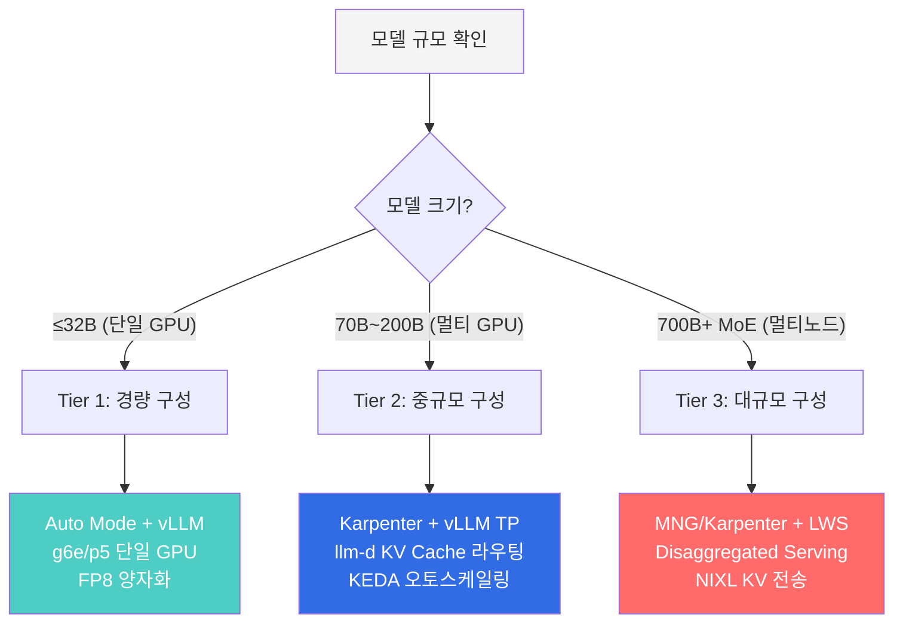
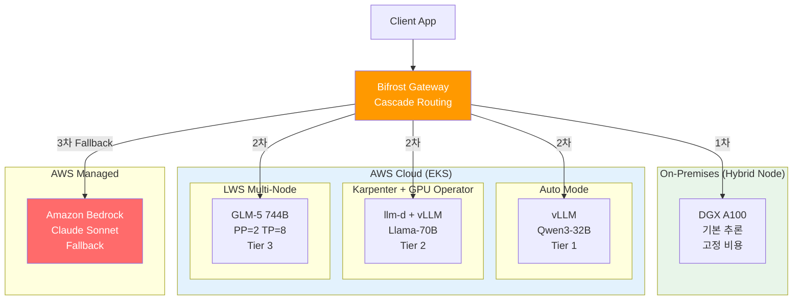

import DocCardList from '@theme/DocCardList';

## 개요

프로덕션 LLM 서비스에서 **Inference 비용은 전체 AI 운영 비용의 80-90%** 를 차지합니다 ([a16z "The Economics of AI"](https://a16z.com/navigating-the-high-cost-of-ai-compute/), [NVIDIA GTC 2024](https://www.nvidia.com/en-us/on-demand/), [SemiAnalysis](https://semianalysis.com/)). 학습은 1회성이지만 추론은 서비스가 살아있는 한 24/7 지속되기 때문입니다. GPU 시간이 곧 비용이며, p5.48xlarge(H100×8) 한 대의 On-Demand 가격은 시간당 $98입니다. 월 2대 운영 시 약 $141,580에 달합니다.

이 문서는 통신사 Agentic AI 플랫폼 구축 과정에서 축적된 교훈과 GLM-5(744B), Kimi K2.5(1T) 등 대형 MoE 모델 배포 사례를 기반으로, EKS 위에서 LLM Inference 성능을 극대화하는 아키텍처 패턴을 정리합니다.

## 다루는 내용

본 카테고리는 세 개의 심화 문서로 구성됩니다.

<DocCardList items={[
  {
    type: 'link',
    href: './kv-cache-optimization',
    label: 'KV Cache 최적화 (vLLM Deep Dive + Cache-Aware Routing)',
    description: 'vLLM PagedAttention·Continuous Batching·FP8 KV Cache 등 핵심 기술과 llm-d/Dynamo의 KV Cache-Aware Routing 비교'
  },
  {
    type: 'link',
    href: './disaggregated-serving',
    label: 'Disaggregated Serving + LWS 멀티노드',
    description: 'Prefill/Decode 분리 아키텍처, NIXL KV 전송, LeaderWorkerSet 기반 700B+ 대형 모델 멀티노드 배포'
  },
  {
    type: 'link',
    href: './cost-optimization',
    label: 'GPU 리소스·관측·Hybrid Node·실전 교훈',
    description: '2-Tier 오토스케일링, DCGM/vLLM 모니터링, Bifrost→Bedrock Cascade Fallback, Hybrid Node 온프레 통합, 대형 MoE 배포 실전 교훈'
  }
]} />

### 문서별 핵심 주제

1. **EKS GPU 인프라 전략** — Auto Mode vs Karpenter vs MNG 선택 기준 (본 문서)
2. **모델 서빙 엔진** — vLLM 핵심 기술과 GPU 메모리 설계 ([KV Cache 최적화](./kv-cache-optimization.md))
3. **KV Cache-Aware Routing** — llm-d와 NVIDIA Dynamo 비교 ([KV Cache 최적화](./kv-cache-optimization.md))
4. **Disaggregated Serving** — Prefill/Decode 분리 아키텍처 ([Disaggregated Serving](./disaggregated-serving.md))
5. **LWS 멀티노드 서빙** — LeaderWorkerSet 기반 700B+ 모델 배포 ([Disaggregated Serving](./disaggregated-serving.md))
6. **GPU 리소스 관리** — 2-Tier 오토스케일링과 DRA ([비용·관측성·Hybrid](./cost-optimization.md))
7. **Observability & Fallback** — GPU 모니터링, Bifrost→Bedrock 폴백 ([비용·관측성·Hybrid](./cost-optimization.md))
8. **Hybrid Node** — 온프레미스 GPU 팜과 EKS 통합 ([비용·관측성·Hybrid](./cost-optimization.md))
9. **실전 교훈** — 이미지 다운로드 실패 대응, 대형 MoE 배포 함정 ([비용·관측성·Hybrid](./cost-optimization.md))

## 핵심 성능 지표

| 지표 | 설명 | 최적화 목표 |
|------|------|-----------|
| **TTFT** (Time to First Token) | 첫 토큰 생성까지의 시간 | &lt; 2초 (대화형), &lt; 5초 (배치) |
| **TPS** (Tokens per Second) | 초당 토큰 생성 속도 | 모델별 상이 |
| **GPU Utilization** | GPU 연산 활용률 | &gt; 70% |
| **KV Cache Hit Rate** | KV 캐시 재사용 비율 | &gt; 60% (공유 프롬프트) |
| **P99 Latency** | 99 퍼센타일 응답 시간 | SLO 기준 준수 |

## EKS GPU 인프라 전략

### 3가지 배포 모델 비교

EKS에서 GPU 워크로드를 운영할 때, 노드 관리 방식에 따라 기능과 운영 복잡도가 크게 달라집니다.

| 기준 | EKS Auto Mode | Karpenter + GPU Operator | MNG + Cluster Autoscaler |
|------|:---:|:---:|:---:|
| **GPU 드라이버 관리** | AWS 자동 관리 | AMI 사전 설치 | AMI 사전 설치 |
| **MIG / Time-Slicing** | 불가 | 가능 | 가능 |
| **DRA 호환** | 미지원 | 미지원 | 유일한 선택지 |
| **DCGM 모니터링** | GPU Operator 설치 시 가능 | 완전 지원 | 완전 지원 |
| **운영 복잡도** | 낮음 | 중간 | 중간 |
| **적합 모델 크기** | 70B+ (GPU 전체 활용) | 7B~700B+ (MIG 분할 가능) | DRA 필요 워크로드 |

:::tip 선택 가이드
- **빠른 시작 / PoC**: Auto Mode — GPU 드라이버, Device Plugin 자동 관리
- **프로덕션 (GPU 세밀 제어)**: Karpenter + GPU Operator — MIG, Custom AMI 지원
- **DRA 필요 시**: MNG + Cluster Autoscaler — Karpenter/Auto Mode에서 DRA Pod를 skip하는 아키텍처적 한계
:::

### GPU 인스턴스 선택 매트릭스

| 인스턴스 | GPU | GPU 메모리 (총합) | 적합 모델 크기 | 시간당 비용 (On-Demand) |
|---------|-----|----------------|-------------|---------------------|
| g5.xlarge~48xlarge | A10G | 24~192GB | 7B 이하 | $1.01~$16.29 |
| g6e.xlarge~48xlarge | L40S | 48~384GB | 13B~70B | 비용 효율적 |
| p4d.24xlarge | A100 40GB × 8 | 320GB | 13B~70B | $32.77 |
| p5.48xlarge | H100 80GB × 8 | 640GB | 70B~700B+ | $98.32 |
| p5e.48xlarge | H200 141GB × 8 | 1,128GB | 100B+ | 최대 메모리 |

### Auto Mode GPU Operator 하이브리드 구성

Auto Mode에서도 GPU Operator를 설치할 수 있습니다. Device Plugin만 노드 레이블로 비활성화하고, DCGM Exporter, NFD, GFD는 정상 동작합니다.

```yaml
# GPU Operator 설치 (Auto Mode 호환)
helm install gpu-operator nvidia/gpu-operator \
  --namespace gpu-operator --create-namespace \
  --set driver.enabled=false \
  --set toolkit.enabled=false

# NodePool에 Device Plugin 비활성화 레이블 추가
# nvidia.com/gpu.deploy.device-plugin: "false"
```

이를 통해 Auto Mode의 편의성을 유지하면서 DCGM 세밀 메트릭(SM 활용률, NVLink 대역폭)을 수집할 수 있습니다. KAI Scheduler 등 ClusterPolicy 의존 프로젝트도 사용 가능합니다.

:::warning GPU Operator + Auto Mode 주의사항
`devicePlugin.enabled=true`로 설치하면 Auto Mode 내장 Device Plugin과 충돌하여 `allocatable=0`이 됩니다. **반드시 `devicePlugin.enabled=false`** 또는 노드 레이블로 비활성화해야 합니다.
:::

## 모델 규모별 권장 아키텍처

### 의사결정 플로우



### 3-Tier 권장 구성

| Tier | 모델 규모 | 인프라 | 서빙 엔진 | 라우팅 | 예시 |
|------|---------|--------|---------|--------|------|
| **Tier 1** | ≤32B | Auto Mode, g6e/p5 | vLLM (단일 GPU) | Round-Robin | Qwen3-32B FP8 |
| **Tier 2** | 70B~200B | Karpenter + GPU Operator | vLLM TP=4~8 | llm-d KV Cache-aware | Llama-3.3-70B |
| **Tier 3** | 700B+ MoE | MNG 또는 Karpenter + LWS | vLLM/SGLang PP+TP | Disaggregated + NIXL | GLM-5, Kimi K2.5 |

**모든 Tier 공통**: Bifrost Cascade Routing으로 Bedrock 폴백 구성 권장 (GPU 장애/Spot 중단 시 무중단 서비스)

### 하이브리드 아키텍처: 전체 그림



### 마이그레이션 경로

단계별 전환으로 운영 리스크를 최소화하면서 점진적으로 성능을 향상시킬 수 있습니다.

**Phase 1**: Auto Mode + vLLM + Bifrost→Bedrock 폴백 → PoC, 개발 환경

**Phase 1.5**: Auto Mode + GPU Operator + llm-d → 모니터링 강화, KV Cache 라우팅

**Phase 2**: Karpenter + llm-d Disaggregated + LWS 멀티노드 → MIG, Prefill/Decode 분리

**Phase 3**: Karpenter + Dynamo + Hybrid Node → 온프레미스 통합, 3-Tier Cascade

**Phase 4**: 전체 통합 → On-Prem→Cloud→Bedrock Cascade, SLO 기반 오토스케일링

## 참고 자료

### 공식 문서
- [Amazon EKS User Guide](https://docs.aws.amazon.com/eks/latest/userguide/) — EKS 클러스터 및 노드 관리
- [EKS Hybrid Nodes](https://docs.aws.amazon.com/eks/latest/userguide/hybrid-nodes.html) — 온프레미스 GPU 서버 EKS 통합
- [Amazon Bedrock Documentation](https://docs.aws.amazon.com/bedrock/) — 관리형 FM 서비스 (Cascade Fallback 대상)
- [SOCI (Seekable OCI)](https://docs.aws.amazon.com/AmazonECR/latest/userguide/container-images-soci.html) — 컨테이너 이미지 lazy-loading

### 논문·기술 블로그
- [a16z "The Economics of AI"](https://a16z.com/navigating-the-high-cost-of-ai-compute/) — AI 인프라 비용 구조
- [GenAI on EKS Starter Kit](https://github.com/aws-samples/sample-genai-on-eks-starter-kit) — Bifrost, vLLM, Langfuse 배포 자동화
- [Scalable Model Inference on Amazon EKS](https://github.com/aws-solutions-library-samples/guidance-for-scalable-model-inference-and-agentic-ai-on-amazon-eks) — llm-d, Karpenter, RAG 종합 아키텍처

### 관련 문서
- [EKS GPU 노드 전략](../gpu-infrastructure/eks-gpu-node-strategy.md) — Auto Mode, Karpenter, Hybrid Node 비교
- [GPU 리소스 관리](../gpu-infrastructure/gpu-resource-management.md) — GPU 스케일링, DRA, 비용 최적화
- [NVIDIA GPU 소프트웨어 스택](../gpu-infrastructure/nvidia-gpu-stack.md) — GPU Operator, DCGM, MIG, Dynamo
- [vLLM 기반 FM 배포 및 성능 최적화](../inference-frameworks/vllm-model-serving.md) — vLLM 상세 가이드
- [llm-d 기반 EKS 분산 추론](../inference-frameworks/llm-d-eks-automode.md) — llm-d 배포 가이드
- [MoE 모델 서빙 가이드](../inference-frameworks/moe-model-serving.md) — MoE 모델 배포
