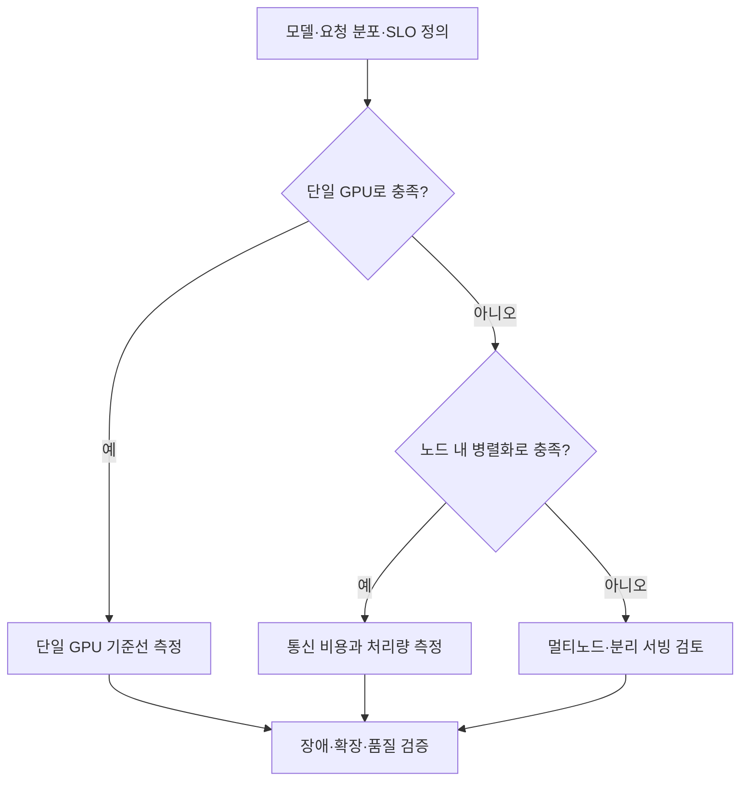

import DocCardList from '@theme/DocCardList';

## 개요

추론 지연, 처리량, GPU 메모리, 비용을 함께 측정하고 병목에 맞는 최적화 기법을 선택하는 문서 모음입니다. 먼저 [추론 인프라 개요](../index.md)에서 L0–L5 튜닝 계층을 확인한 뒤, 아래 문서에서 구현 조건과 검증 절차를 살펴보세요. 이 계층은 플랫폼 전체의 6개 런타임 레이어와 별도의 분석 관점입니다.

최적화 결과는 모델, 입력·출력 길이, 동시 요청 수, 하드웨어, 라우팅 정책에 따라 달라집니다. 이 페이지는 운영 환경의 성능이나 절감률을 보장하는 구성표가 아니라 상세 문서의 선택 기준을 제공합니다.

## 다루는 내용

이 카테고리의 전체 문서입니다. 게이트웨이 구성과 모델 선택 정책은 별도의 [추론 라우팅](../inference-routing/routing-strategy.md) 카테고리에서 다룹니다.

<DocCardList />

### 문서별 핵심 주제

- **캐시 재사용**: [KV Cache 최적화](./kv-cache-optimization.md) → [LMCache](./lmcache.md) → [캐시 히트 전략](./cache-hit-strategy.md)
- **지연과 처리량 분리**: [Disaggregated Serving](./disaggregated-serving.md)에서 Prefill/Decode 분리의 이점과 전송 비용을 비교합니다.
- **응답 재사용의 품질**: [Semantic Caching](./semantic-caching-strategy.md)에서 캐시 키, 테넌트 경계, 오응답 평가를 확인합니다.
- **용량과 복구**: [GPU 오토스케일링](./gpu-autoscaling-operations.md)에서 대기열, 콜드 스타트, 배포 실패 대응을 확인합니다.

## 핵심 성능 지표

서비스별 SLO와 동일한 요청 집합을 기준으로 전후를 비교합니다. 아래 지표에 공통으로 적용되는 보편적 목표값은 없습니다.

| 지표 | 확인할 내용 | 함께 기록할 조건 |
|------|-----------|----------------|
| **TTFT** | 요청 시작부터 첫 토큰까지의 지연 분포 | 대기 시간 포함 여부, 입력 길이, 동시성 |
| **출력 토큰 처리량** | 완료된 요청의 생성 토큰 수 / 측정 시간 | 클라이언트별 속도와 서버 전체 처리량 구분 |
| **GPU 메모리·사용률** | 메모리 여유, 연산·메모리 병목 | GPU 종류, 정밀도, 배치 설정 |
| **캐시 히트율** | 재사용 단위별 적중 수와 조회 수 | 토큰·요청 분모, 캐시 종류, cold/warm 구간 |
| **꼬리 지연·오류율** | p95/p99 응답 지연과 완료율 | 타임아웃·재시도·실패 요청 포함 |
| **품질·비용** | 평가 통과율과 성공 요청당 총비용 | 평가셋, GPU 대기 비용, 게이트웨이·저장소 비용 |

## EKS GPU 인프라 전략

### 3가지 배포 모델 비교

노드 관리 방식과 GPU 소프트웨어의 관리 주체를 먼저 구분합니다. GPU 개수나 모델 크기로 노드 관리 방식을 자동 결정하지 않습니다.

| 방식 | 관리 경계 | 상세 확인 |
|------|----------|----------|
| EKS Auto Mode | EKS가 GPU 드라이버와 Device Plugin을 관리 | 제공 기능과 사용자 설치 구성요소의 지원 범위 |
| Karpenter | NodePool 정책에 따라 노드를 프로비저닝 | 선택한 AMI, GPU 구성요소, 정적·동적 용량 구분 |
| Managed Node Group | 노드 그룹과 AMI를 기준으로 용량 관리 | AMI 사전 설치 구성요소와 별도 설치할 드라이버/플러그인 |

DRA 지원 여부는 Kubernetes 버전과 용량 프로비저닝 방식에 따라 확인합니다. 현재 [EKS NVIDIA 장치 관리 안내](https://docs.aws.amazon.com/eks/latest/userguide/device-management-nvidia.html)는 Auto Mode를 제외하고 Karpenter 정적 용량, MNG, 자체 관리 노드를 구분합니다. 세부 선택 기준은 [GPU 노드 전략](../gpu-infrastructure/eks-gpu-node-strategy.md)을 참고하세요.

### GPU 인스턴스 선택 매트릭스

| 결정 항목 | 검토 기준 |
|----------|----------|
| 메모리 | 가중치 정밀도, KV Cache, 동시성, 런타임 여유분 |
| 통신 | 단일 GPU·노드 내·노드 간 병렬화에 필요한 대역폭 |
| 가용성 | 목표 리전·AZ의 용량, 할당량, 대체 인스턴스 |
| 비용 | 조회 날짜·리전·구매 옵션을 명시한 견적과 실측 처리량 |

모델 파라미터 수만으로 GPU 수를 정하지 않습니다. [vLLM 서빙](../inference-frameworks/vllm-model-serving.md)에서 메모리 설정을, [GPU 리소스 관리](../gpu-infrastructure/gpu-resource-management.md)에서 할당 정책을 확인합니다.

### Auto Mode GPU Operator 하이브리드 구성

Auto Mode가 관리하는 구성요소를 별도 GPU Operator가 중복 관리하지 않도록 해야 합니다. AL2023 또는 Bottlerocket용 GPU Operator 설치 옵션을 Auto Mode에 그대로 적용하는 일반 설치 절차는 제공하지 않습니다.

[가속 AMI 안내](https://docs.aws.amazon.com/eks/latest/userguide/ml-eks-optimized-ami.html)의 GPU Operator 설정은 AMI별 사전 설치 구성요소에 따라 다릅니다. 관측성만 필요한 경우에도 대상 노드의 지원 범위를 확인하고 [NVIDIA GPU 스택](../gpu-infrastructure/nvidia-gpu-stack.md)의 구성요소별 설명을 참고하세요.

## 모델 규모별 권장 아키텍처

### 의사결정 플로우

```mermaid
flowchart TD
    accTitle: 추론 배포 방식 선택
    accDescr: 먼저 단일 GPU에서 메모리와 SLO를 확인하고, 필요할 때 노드 내 병렬화와 멀티노드를 검토한다.
    A[모델·요청 분포·SLO 정의] --> B{단일 GPU로 충족?}
    B -->|예| C[단일 GPU 기준선 측정]
    B -->|아니오| D{노드 내 병렬화로 충족?}
    D -->|예| E[통신 비용과 처리량 측정]
    D -->|아니오| F[멀티노드·분리 서빙 검토]
    C --> G[장애·확장·품질 검증]
    E --> G
    F --> G
```

### 3-Tier 권장 구성

다음은 검토 순서입니다. 특정 파라미터 수에 대응하는 고정 사양이 아닙니다.

| 단계 | 적용 조건 | 다음 문서 |
|------|----------|----------|
| 단일 GPU | 메모리와 SLO를 모두 충족 | [vLLM 서빙](../inference-frameworks/vllm-model-serving.md) |
| 노드 내 병렬화 | 단일 GPU의 메모리 또는 성능 한계 | [MoE 서빙](../inference-frameworks/moe-model-serving.md) |
| 멀티노드·분리 서빙 | 측정 결과 노드 내 구성이 부족 | [Disaggregated Serving](./disaggregated-serving.md) |

### 하이브리드 아키텍처: 전체 그림

EKS, 온프레미스, 관리형 모델 API를 함께 사용하는 경우 [티어드 게이트웨이](../inference-routing/tiered-gateway-architecture.md)에서 각 계층의 책임을 확인합니다. 폴백 대상의 API·도구 호출 호환성, 데이터 전송 정책, 할당량, 응답 품질을 검증해야 합니다. 라우팅 경로가 있다는 사실만으로 중단 없는 서비스를 보장하지 않습니다.

### 마이그레이션 경로

1. 단일 경로에서 성능·품질·비용 기준선을 기록합니다.
2. 확인된 병목에 맞춰 캐시, 라우팅, 배치 설정 중 하나를 변경합니다.
3. 동일한 평가셋과 부하 조건으로 회귀를 확인합니다.
4. 제한된 트래픽에서 검증한 뒤 확대하고, 기존 경로로 복구할 조건을 정합니다.

## 참고 자료

### 공식 문서

- [EKS NVIDIA 장치 관리](https://docs.aws.amazon.com/eks/latest/userguide/device-management-nvidia.html)
- [EKS 가속 AMI](https://docs.aws.amazon.com/eks/latest/userguide/ml-eks-optimized-ami.html)
- [EKS Compute and Autoscaling](https://docs.aws.amazon.com/eks/latest/best-practices/aiml-compute.html)

### 논문·기술 블로그

구현 프로젝트의 구성은 선택한 릴리스와 문서의 예제를 함께 확인합니다.

- [GenAI on EKS Starter Kit](https://github.com/aws-samples/sample-genai-on-eks-starter-kit)
- [Scalable Model Inference on Amazon EKS](https://github.com/aws-solutions-library-samples/guidance-for-scalable-model-inference-and-agentic-ai-on-amazon-eks)

### 관련 문서

- [서빙 최적화 모니터링](../../operations-mlops/observability/llm-serving-optimization-monitoring.md) — 측정 단위와 쿼리 검증
- [Prefix Cache 튜닝과 정확도](../../operations-mlops/observability/prefix-cache-tuning-accuracy-correlation.md) — 실험 설계와 품질 판정
- [라우팅 전략](../inference-routing/routing-strategy.md) — 모델 선택과 폴백 경계
