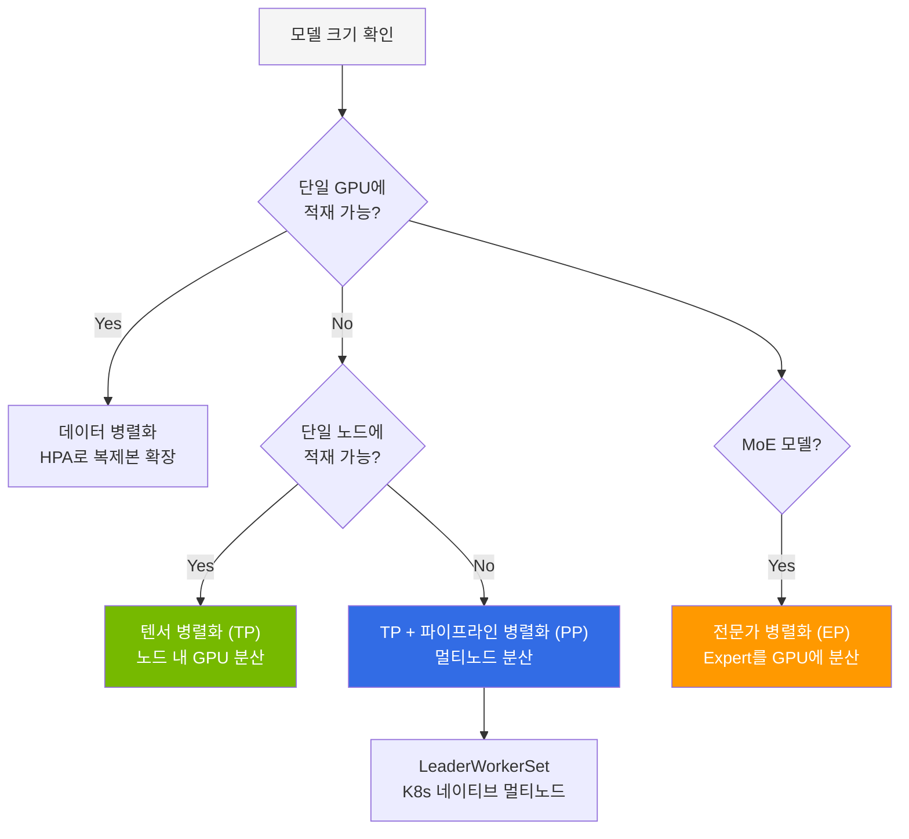
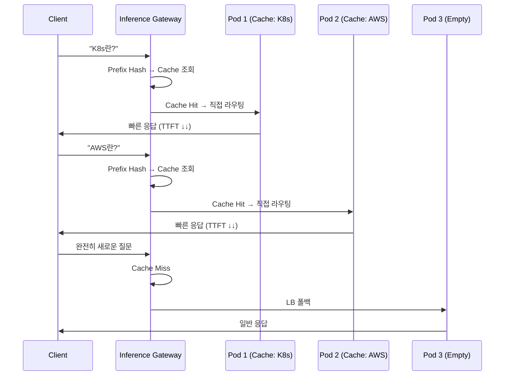
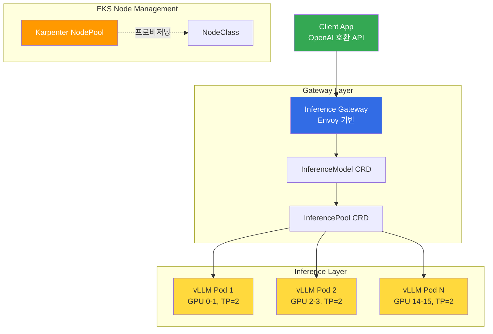

## 개요

LLM 추론 엔진의 성능은 대부분 KV Cache(Key-Value Cache)를 얼마나 효율적으로 관리하느냐에 달려 있습니다. 본 문서는 vLLM의 핵심 기술 스택과 GPU 메모리 설계 원리, 그리고 여러 Pod 간 KV Cache를 공유·재사용하는 **KV Cache-Aware Routing** 전략(llm-d vs NVIDIA Dynamo)을 다룹니다.

## vLLM Deep Dive

### 핵심 기술 스택

vLLM(v0.19.x)은 현재 가장 널리 사용되는 LLM 추론 엔진입니다. 핵심 기술과 성능 영향은 다음과 같습니다.

| 기술 | 성능 영향 | 설명 |
|------|---------|------|
| **PagedAttention** | KV Cache 메모리 60-80% 절감 | OS 가상 메모리 기법으로 KV 캐시를 비연속 블록 저장 |
| **Continuous Batching** | 처리량 2-24x 향상 | 반복(iteration) 수준에서 요청을 동적 추가/제거 |
| **FP8 KV Cache** | 메모리 2배 절감 | KV 캐시를 FP8 정밀도로 저장 (v0.6+) |
| **Prefix Caching** | 반복 프롬프트 400%+ 향상 | 공통 시스템 프롬프트의 KV 캐시 재사용 |
| **Speculative Decoding** | 속도 2-3x 향상 | 소형 드래프트 모델이 토큰 예측, 메인 모델이 검증 |
| **Chunked Prefill** | TTFT/처리량 균형 개선 | Prefill과 Decode를 동일 배치에서 혼합 처리 |

### GPU 메모리 계산

모델 배포 전 GPU 메모리를 정확히 계산해야 합니다.

```
필요 GPU 메모리 = 모델 가중치 + 비torch 메모리 + PyTorch 활성화 + (KV 캐시 × 배치 크기)
```

**정밀도별 메모리 요구사항:**

| 정밀도 | 파라미터당 바이트 | 70B 모델 | 32B 모델 |
|--------|---------------|---------|---------|
| FP32 | 4 | 280GB | 128GB |
| BF16/FP16 | 2 | 140GB | 64GB |
| INT8 | 1 | 70GB | 32GB |
| INT4 | 0.5 | 35GB | 16GB |

### 병렬화 전략 선택 기준



**모델 크기별 권장 구성:**

| 모델 예시 | 파라미터 | 정밀도 | GPU 구성 | 병렬화 |
|-----------|---------|--------|---------|--------|
| Qwen3-32B | 32B | FP8 | 1× H100 80GB | 없음 |
| Llama-3.3-70B | 70B | BF16 | 4× H100 (TP=4) | 텐서 병렬 |
| Kimi K2.5 | 1T MoE (32B active) | INT4 | 8× H100 (TP=8) | 텐서 + 전문가 병렬 |
| GLM-5 | 744B MoE (40B active) | FP8 | 16× H100 (PP=2, TP=8) | 파이프라인 + 텐서 병렬 |

### 핵심 성능 파라미터

```bash
vllm serve Qwen/Qwen3-32B-FP8 \
  --gpu-memory-utilization=0.95 \   # KV 캐시에 사전 할당할 VRAM 비율 (기본 0.9)
  --max-model-len=32768 \           # 최대 시퀀스 길이 (KV 캐시 크기에 직접 영향)
  --enable-prefix-caching \         # 공통 프리픽스 KV 캐시 재사용
  --kv-cache-dtype=fp8 \            # FP8 KV 캐시로 메모리 2배 절감
  --enable-auto-tool-choice \       # Tool calling 자동 지원
  --tool-call-parser=hermes         # Tool call 파서 선택
```

### 양자화 전략 비교

| 양자화 | 메모리 절감 | 품질 손실 | 추론 속도 | 권장 시나리오 |
|--------|----------|---------|---------|------------|
| **FP8** | 50% | 최소 | 빠름 | 프로덕션 기본 (품질 우선) |
| **AWQ** | 75% | 낮음 | 매우 빠름 | 비용 최적화 |
| **GPTQ** | 75% | 낮음 | 빠름 | 오프라인 양자화 |
| **GGUF** | 50-75% | 낮음~중간 | 빠름 | 다양한 정밀도 선택 |

## KV Cache-Aware Routing

### 기존 문제: Round-Robin의 한계

기존 vLLM 배포는 단순 Round-Robin 로드 밸런싱에 의존합니다. 동일한 시스템 프롬프트를 사용하는 요청이 매번 다른 Pod로 분산되면, 각 Pod에서 동일한 프리필 연산을 반복 수행합니다. 이는 GPU 연산 낭비이자 TTFT 증가의 원인입니다.

### 해결: KV Cache 상태 인식 라우팅

llm-d와 NVIDIA Dynamo는 각 vLLM Pod의 KV Cache 상태를 인식하여, 동일한 prefix를 가진 요청을 이미 해당 KV Cache를 보유한 Pod로 라우팅합니다.



**KV Cache-Aware Routing의 효과:**

| 시나리오 | TTFT 개선 | GPU 연산 절감 | 처리량 향상 |
|---------|----------|-------------|-----------|
| 동일 시스템 프롬프트 | 50-80% 감소 | 프리필 스킵 | 400%+ |
| RAG 반복 컨텍스트 | 30-60% 감소 | 부분 재사용 | 200%+ |
| 완전 랜덤 요청 | 변화 없음 | 없음 | LB 폴백 |

### llm-d vs NVIDIA Dynamo 비교

두 프로젝트 모두 KV Cache-aware 라우팅을 제공하지만 접근 방식이 다릅니다.

| 항목 | llm-d v0.5+ | NVIDIA Dynamo v1.0 |
|------|------------|-------------------|
| **주도** | Red Hat (Apache 2.0) | NVIDIA (Apache 2.0) |
| **KV Cache 인덱싱** | Prefix-aware 라우팅 | Flash Indexer (radix tree) |
| **KV Cache 전송** | NIXL (네트워크) | NIXL (NVLink/RDMA 초고속) |
| **라우팅** | Gateway API + Envoy EPP | Dynamo Router + 자체 EPP |
| **Pod 스케줄링** | K8s 기본 스케줄러 | KAI Scheduler (GPU-aware) |
| **오토스케일링** | HPA/KEDA 연동 | Planner (SLO 기반 profiling) |
| **KV Cache 계층화** | 메모리만 | 3-tier: GPU→CPU→SSD |
| **복잡도** | 낮음 | 높음 |
| **벤치마크 성능** | 경량, K8s 네이티브 | 7x (Flash Indexer + Planner) |

:::tip 선택 기준
- **소규모~중규모 (GPU ≤16)**: llm-d — 빠른 도입, K8s Gateway API 네이티브
- **대규모 (GPU 16+), 최대 처리량**: Dynamo — Flash Indexer, SLO 기반 오토스케일링
- **긴 컨텍스트 (128K+)**: Dynamo — 3-tier KV Cache (GPU→CPU→SSD)
- **점진적 전환**: llm-d로 시작 → 규모 확장 시 Dynamo로 전환 (둘 다 NIXL 사용)
:::

### Gateway 아키텍처: llm-d 배포 구성



## 참고 자료

### 공식 문서
- [vLLM 공식 문서](https://docs.vllm.ai) — 최적화 및 튜닝 가이드
- [vLLM GitHub](https://github.com/vllm-project/vllm) — v0.19.x 릴리스 노트
- [llm-d GitHub](https://github.com/llm-d/llm-d) — K8s 네이티브 분산 추론
- [NVIDIA Dynamo](https://developer.nvidia.com/dynamo) — 분산 추론 프레임워크

### 논문·기술 블로그
- [PagedAttention 논문 (SOSP 2023)](https://arxiv.org/abs/2309.06180) — "Efficient Memory Management for Large Language Model Serving with PagedAttention"
- [Flash Indexer Design (NVIDIA)](https://developer.nvidia.com/blog/introducing-nvidia-dynamo-a-low-latency-distributed-inference-framework-for-scaling-reasoning-ai-models/) — radix tree 기반 KV Cache 인덱싱
- [Red Hat llm-d Blog](https://llm-d.ai/blog) — KV Cache-aware 라우팅 설계

### 관련 문서
- [Disaggregated Serving + LWS 멀티노드](./disaggregated-serving.md) — Prefill/Decode 분리, NIXL KV 전송
- [GPU 리소스·관측·Hybrid Node·실전 교훈](./cost-optimization.md) — KEDA 스케일링, 모니터링
- [vLLM 기반 FM 배포 및 성능 최적화](../inference-frameworks/vllm-model-serving.md) — vLLM 상세 가이드
- [llm-d 기반 EKS 분산 추론](../inference-frameworks/llm-d-eks-automode.md) — llm-d 배포 가이드
- [NVIDIA GPU 소프트웨어 스택](../gpu-infrastructure/nvidia-gpu-stack.md) — GPU Operator, DCGM, Dynamo
