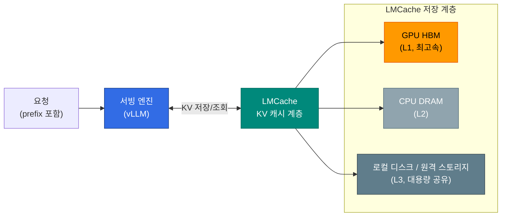

## 개요

**LMCache**는 LLM 추론의 KV 캐시(Key-Value Cache)를 GPU 메모리 너머의 CPU DRAM·로컬 디스크·원격 스토리지로 오프로딩하고, 여러 추론 인스턴스 간에 재사용할 수 있게 하는 KV 캐시 계층입니다. vLLM 같은 서빙 엔진과 통합되어, 단일 Pod의 GPU 메모리에 갇혀 있던 KV 캐시를 더 넓은 범위에서 공유합니다.

이 문서는 LMCache가 무엇이고 추론 인프라의 어느 위치에 끼는지를 설명합니다. KV 캐시 자체의 기본 동작(PagedAttention·Prefix Caching)은 [KV Cache 최적화](./kv-cache-optimization.md)를, 캐시 히트율을 높이는 전략은 [캐시 히트 전략](./cache-hit-strategy.md)을 참조하세요.

## 배경: 왜 KV 캐시를 오프로딩하나

vLLM의 in-GPU Prefix Caching은 동일 prefix를 공유하는 요청의 prefill 연산을 재사용합니다. 그러나 이 캐시에는 두 가지 제약이 있습니다.

- **용량 제약**: KV 캐시는 GPU 메모리(HBM)를 차지하므로, 컨텍스트가 길거나 동시 요청이 많으면 캐시가 밀려나(evict) 재연산이 발생합니다.
- **범위 제약**: in-GPU 캐시는 **한 Pod 안에서만** 유효합니다. 같은 prefix를 가진 요청이라도 다른 Pod로 라우팅되면 캐시를 재사용하지 못합니다.

LMCache는 KV 캐시를 GPU 밖 계층으로 옮겨 이 두 제약을 완화합니다. GPU에서 밀려난 KV 블록을 버리지 않고 CPU·디스크에 보관했다가 다시 불러오며, 외부 저장소를 공유하면 **여러 Pod가 동일 KV 캐시를 재사용**할 수 있습니다.

## LMCache의 위치

LMCache는 서빙 엔진과 라우팅 계층 사이에서 KV 캐시 저장·조회를 담당합니다. 추론 인프라 전체 구조에서의 위치는 [추론 인프라 개요](../inference-infrastructure-overview.md)의 레이어드 튜닝 모델 L5(캐시 계층)에 해당합니다.

KV 캐시는 접근 속도와 용량이 다른 계층에 단계적으로 저장됩니다. 가장 빠른 GPU HBM에서 밀려난 블록은 CPU DRAM으로, 다시 디스크·원격 스토리지로 내려가며, 재사용 시 역순으로 끌어올려집니다.

## 인접 기술과의 관계

LMCache는 단독으로 동작하지 않고 다른 추론 최적화 기술과 함께 쓰입니다.

| 기술 | 관계 | 비고 |
|------|------|------|
| **vLLM Prefix Cache** | LMCache가 GPU 밖으로 확장 | in-GPU 캐시 evict 시 LMCache가 받아 보관 |
| **NIXL** | KV 전송 경로 | Disaggregated Serving에서 prefill→decode KV 이동에 사용 ([Disaggregated Serving](./disaggregated-serving.md#nixl-공통-kv-cache-전송-엔진)) |
| **kvaware 라우팅** | LMCache 공유 캐시를 활용 | 캐시 보유 Pod로 라우팅해 적중률 향상 |

특히 **kvaware/prefixaware 라우팅**은 LMCache 같은 공유 KV 계층이 있을 때 효과가 커집니다. 어느 Pod가 어떤 KV 블록을 보유했는지를 라우터가 알면, 캐시를 가진 Pod로 요청을 보내 prefill을 건너뛸 수 있기 때문입니다. 이 라우팅 전략은 [KV Cache-Aware Routing](./kv-cache-optimization.md#kv-cache-aware-routing)에서, 라우터 옵션 비교(EPP·HyperPod·Dynamo)는 [라우팅 전략 — L2 옵션 비교](../inference-routing/routing-strategy.md#l2-옵션-비교-epp-vs-hyperpod-inference-operator-vs-dynamo)에서 다룹니다.

AWS 관리형 환경에서는 SageMaker HyperPod Inference Operator가 LMCache와 호환되는 KV 캐시 구성을 제공합니다. 상세는 [HyperPod Inference Operator — KV 캐시 구성](../inference-frameworks/hyperpod-inference-operator.md#kv-캐시-구성-l1l2-캐시와-라우팅-전략)을 참조하세요.

## 적용 고려사항

- **CPU 오프로딩의 트레이드오프**: GPU↔CPU 간 KV 전송은 PCIe 대역폭을 사용하므로, 재연산보다 전송이 느린 짧은 컨텍스트에서는 이득이 작습니다. 긴 컨텍스트·높은 prefix 공유율에서 효과가 큽니다.
- **공유 스토리지 일관성**: 여러 Pod가 외부 저장소를 공유할 때 KV 블록의 무결성과 모델·버전 일치가 보장되어야 합니다.
- **버전 호환성**: LMCache는 서빙 엔진과 긴밀히 결합하므로, vLLM·Inference Operator 등과의 호환 버전을 확인한 뒤 도입해야 합니다.

## 참고 자료

### 공식 문서
- [LMCache GitHub](https://github.com/LMCache/LMCache) — LMCache 오픈소스 프로젝트 저장소
- [vLLM Documentation](https://docs.vllm.ai/) — vLLM 서빙 엔진 및 KV 캐시 관리

### 논문 / 기술 블로그
- [CacheBlend (EuroSys 2025)](https://arxiv.org/abs/2405.16444) — non-prefix KV 캐시 재사용 연구
- [PagedAttention (SOSP 2023)](https://arxiv.org/abs/2309.06180) — vLLM KV 캐시 관리 기반 논문

### 관련 문서 (내부)
- [KV Cache 최적화](./kv-cache-optimization.md) — PagedAttention·Prefix Caching·KV Cache-Aware Routing
- [캐시 히트 전략](./cache-hit-strategy.md) — KV/Prompt/Semantic 3계층 캐시 통합 전략
- [Disaggregated Serving](./disaggregated-serving.md) — NIXL 기반 KV 전송과 Prefill/Decode 분리
