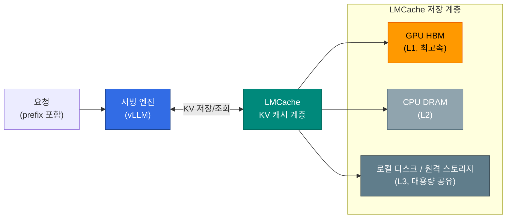

## 개요

**LMCache**는 LLM 추론의 KV 캐시(Key-Value Cache)를 GPU 메모리 너머의 CPU DRAM·로컬 디스크·원격 스토리지로 오프로딩하고, 여러 추론 인스턴스 간에 재사용할 수 있게 하는 KV 캐시 계층입니다. vLLM 같은 서빙 엔진과 통합되어, 단일 Pod의 GPU 메모리에 갇혀 있던 KV 캐시를 더 넓은 범위에서 공유합니다.

이 문서는 LMCache가 무엇이고 추론 인프라의 어느 위치에 끼는지를 설명합니다. KV 캐시 자체의 기본 동작(PagedAttention·Prefix Caching)은 [KV Cache 최적화](./kv-cache-optimization.md)를, 캐시 히트율을 높이는 전략은 [캐시 히트 전략](./cache-hit-strategy.md)을 참조하세요.

## 배경: 왜 KV 캐시를 오프로딩하나

vLLM의 in-GPU Prefix Caching은 동일 prefix를 공유하는 요청의 prefill 연산을 재사용합니다. 그러나 이 캐시에는 두 가지 제약이 있습니다.

- **용량 제약**: KV 캐시는 GPU 메모리(HBM)를 차지하므로, 컨텍스트가 길거나 동시 요청이 많으면 캐시가 밀려나(evict) 재연산이 발생합니다.
- **범위 제약**: in-GPU 캐시는 **한 Pod 안에서만** 유효합니다. 같은 prefix를 가진 요청이라도 다른 Pod로 라우팅되면 캐시를 재사용하지 못합니다.

LMCache는 KV 캐시를 GPU 밖 계층으로 옮겨 이 두 제약을 완화합니다. GPU에서 밀려난 KV 블록을 버리지 않고 CPU·디스크에 보관했다가 다시 불러오며, 외부 저장소를 공유하면 **여러 Pod가 동일 KV 캐시를 재사용**할 수 있습니다.

## LMCache의 위치

LMCache는 서빙 엔진과 라우팅 계층 사이에서 KV 캐시 저장·조회를 담당합니다. 추론 인프라 전체 구조에서의 위치는 [추론 인프라 개요](../index.md)의 레이어드 튜닝 모델 L5(캐시 계층)에 해당합니다.


```mermaid
flowchart LR
    REQ["요청<br/>(prefix 포함)"] --> ENGINE["서빙 엔진<br/>(vLLM)"]
    ENGINE <-->|KV 저장/조회| LM["LMCache<br/>KV 캐시 계층"]

    subgraph TIERS["LMCache 저장 계층"]
        direction TB
        GPU["GPU HBM<br/>(L1, 최고속)"]
        CPU["CPU DRAM<br/>(L2)"]
        DISK["로컬 디스크 / 원격 스토리지<br/>(L3, 대용량 공유)"]
    end

    LM --> GPU
    LM --> CPU
    LM --> DISK

    style ENGINE fill:#326ce5,stroke:#1a3f87,color:#fff
    style LM fill:#00897b,stroke:#00695c,color:#fff
    style GPU fill:#ff9900,stroke:#e65100,color:#000
    style CPU fill:#90a4ae,stroke:#546e7a,color:#fff
    style DISK fill:#607d8b,stroke:#37474f,color:#fff
```

KV 캐시는 접근 속도와 용량이 다른 계층에 단계적으로 저장됩니다. 가장 빠른 GPU HBM에서 밀려난 블록은 CPU DRAM으로, 다시 디스크·원격 스토리지로 내려가며, 재사용 시 역순으로 끌어올려집니다.

## vLLM 연동 설정

LMCache는 두 가지 실행 모드가 있고, **현재 권장은 MP(multiprocess) 모드**입니다. LMCache를 독립 서비스로 띄우고 vLLM 엔진이 ZMQ로 접속하는 구조로, 프로세스 격리·Pod 간 캐시 공유·GPU와 무관한 캐시 메모리 증설이 가능합니다. 기존 in-process 모드는 legacy로 분류되어 있습니다. 아래 플래그·설정 키는 2026-08 기준 공식 문서와 대조한 내용이며, LMCache가 MP 모드의 최소 버전을 명시하지 않고 최신 dev 브랜치를 권장하므로 도입 시점에 다시 확인하세요.

먼저 LMCache 서버를 기동합니다.

```bash
lmcache server \
  --l1-size-gb 100 \
  --eviction-policy LRU \
  --port 5555 \
  --http-port 8080
```

ZMQ 포트(기본 5555)로 vLLM 엔진이 접속합니다. HTTP 포트(`--http-port`, 기본 8080)는 관리·헬스체크용 FastAPI 프런트엔드이고, Prometheus 메트릭은 별도의 `--prometheus-port`(기본 9090)가 `/metrics`로 노출합니다.

vLLM 쪽은 커넥터와 접속 정보를 지정합니다.

```bash
vllm serve Qwen/Qwen3-8B \
  --port 8000 \
  --kv-transfer-config '{"kv_connector":"LMCacheMPConnector","kv_role":"kv_both","kv_connector_extra_config":{"lmcache.mp.host":"localhost","lmcache.mp.port":5555}}'
```

`lmcache.mp.server_urls`로 `"tcp://host1:6667,tcp://host2:6667"` 형태의 다중 서버를 지정할 수도 있습니다.

:::warning vLLM 버전에 따라 커넥터 해석이 달라집니다

vLLM 0.20.0 이상에서는 `kv_connector_extra_config`에 `"kv_connector_module_path":"lmcache.integration.vllm.lmcache_mp_connector"`를 함께 지정해야 LMCache가 배포하는 구현을 사용합니다. 생략하면 vLLM에 벤더링된 버전이 선택되며, LMCache 배포판이 최신 서버 프로토콜과 수정사항을 먼저 반영합니다.

vLLM 0.20.0 미만에서는 `LMCacheMPConnector`가 항상 vLLM 내장 커넥터로 해석되어, LMCache 배포판으로 우회할 방법이 없습니다.

:::

주요 서버 플래그는 다음과 같습니다.

| 플래그 | 기본값 | 역할 |
|--------|--------|------|
| `--l1-size-gb` | (필수) | L1 캐시 풀 크기 (GB) |
| `--eviction-policy` | (필수) | `LRU` / `IsolatedLRU` / `noop` |
| `--chunk-size` | 256 | KV 청크당 토큰 수 |
| `--hash-algorithm` | `blake3` | `builtin` / `sha256_cbor` / `blake3` |
| `--eviction-trigger-watermark` | 0.8 | 축출을 시작하는 메모리 사용률 |
| `--max-workers` | 1 | 워커 수 (`--max-gpu-workers`·`--max-cpu-workers`로 개별 지정) |

:::tip 해시 재현성이 필요한 경우

`--hash-algorithm builtin`을 쓸 때에만 프로세스 간 해시 재현성을 위해 `PYTHONHASHSEED`를 고정값으로 통일해야 합니다. 기본값 `blake3`에는 해당하지 않습니다.

:::

## 저장 백엔드 선택

MP 모드에서 L1은 LMCache 서버가 보유한 캐시 풀이고, 그 아래 L2 계층은 `--l2-adapter`에 JSON을 넘겨 붙입니다. 어댑터는 여러 개 지정해 캐스케이드로 구성할 수 있습니다.

```bash
lmcache server --l1-size-gb 100 --eviction-policy LRU \
  --l2-adapter '{"type": "nixl_store", "backend": "POSIX", "backend_params": {"file_path": "/data/ssd/l2"}, "pool_size": 64}'
```

주요 어댑터 `type`은 다음과 같습니다.

| 분류 | `type` 값 |
|------|-----------|
| 로컬 파일시스템·블록 | `fs`, `fs_native`, `nixl_store`, `nixl_store_dynamic`, `raw_block`, `dax` |
| 분산 KV 스토어 | `mooncake_store`, `aerospike` |
| Redis 계열 | `resp`, `valkey` |
| 객체·관리형 스토리지 | `s3`, `bigtable`, `hfbucket`, `sagemaker-hyperpod` |
| 확장·테스트 | `plugin`, `native_plugin`, `mock`, `fault_inject` |

백엔드 선택 기준은 성능만이 아니라 **공유 범위**입니다. 노드 로컬 파일시스템은 같은 노드의 Pod까지만 캐시를 공유하고, 스케일아웃 후에도 캐시를 재사용하려면 `mooncake_store`·`resp`·`s3` 같은 클러스터 범위 백엔드가 필요합니다. 저장 정책은 `--l2-store-policy`(`default`|`skip_l1`), 프리페치는 `--l2-prefetch-policy`(`default`|`retain`)로 제어하며, 백엔드별 필수 파라미터는 [MP Configuration Reference](https://docs.lmcache.ai/mp/configuration.html)를 참조하세요.

:::info 계층 명칭 주의

LMCache MP 모드의 L1·L2는 **LMCache 서버 내부의 계층 명칭**으로, 위 그림에서 표기한 L1(GPU HBM)·L2(CPU DRAM)·L3와는 다른 축입니다. 위 그림의 GPU HBM은 vLLM이 직접 관리하는 영역입니다.

:::

## K8s 배포 형태

공식 배포 가이드는 sidecar가 아니라 **DaemonSet + Deployment 패턴**을 권장합니다. 노드당 LMCache 서버 하나(DaemonSet)를 같은 노드의 여러 vLLM Pod(Deployment)가 공유하는 구조입니다.

| 항목 | 내용 |
|------|------|
| `hostNetwork: true` | 공식 DaemonSet 패턴이 사용. vLLM Pod은 Service DNS가 아니라 `status.hostIP`로 서버를 찾음 |
| `/dev/shm` 호스트 마운트 | 공식 예시는 양쪽 컨테이너에 마운트. **전송 경로에 딸린 조건**이며 아래 조합으로 제거 가능 |
| GPU 리소스 | DaemonSet에는 GPU를 요청하지 않음. 단 IPC 전송을 위해 컨테이너 런타임이 GPU 접근을 제공하므로 GPU 노드에만 스케줄해야 하며, GPU 없는 노드에서는 CUDA 초기화 오류로 크래시 |

### 전송 경로별 요구사항

`--supported-transfer-mode`가 서버에 어떤 전송 경로를 적재할지 결정합니다.

| 모드 | 경로 | 용도 |
|------|------|------|
| `auto` | 양쪽 적재 | 어느 디바이스 타입 워커든 접속 가능 |
| `lmcache_driven` (기본) | 서버 주도 — CUDA 디바이스는 IPC, CPU 디바이스는 SHM | GPU 직결 전송 |
| `engine_driven` | 엔진(워커) 주도 | CPU-only·비CUDA 가속기 워커 |

`--shm-name`은 SHM 풀 동작을 제어하며, 빈 문자열이면 pickle 기반 전송을 사용합니다. 공식 문서는 이 조합이 **`/dev/shm`을 쓸 수 없는 환경이나 Docker에서 `--ipc host` 없이 돌릴 때 동작**한다고 명시합니다.

:::warning 배포 전 admission 정책을 확인하세요

`hostNetwork: true`와 `/dev/shm` hostPath 마운트는 Pod Security Standards의 baseline·restricted 프로파일에서 금지되는 항목이며, Kyverno나 Validating Admission Policy로 동등한 제약을 걸어둔 클러스터에서도 차단됩니다. 즉 **요구 권한이 성능과 무관하게 채택 가능 여부를 결정**할 수 있습니다.

다만 위 표처럼 요구사항은 전송 경로에 따라 달라집니다. 정책이 엄격한 클러스터라면 `engine_driven` + pickle 전송으로 `/dev/shm` 의존을 먼저 제거해볼 수 있습니다. 대신 서버 주도 경로의 GPU 직결 전송 이점은 포기하게 되며, 그 성능 차이는 워크로드에 따라 직접 측정해야 합니다.

프로파일별 제약 내용은 [보안 & 거버넌스](../../../eks-best-practices/security-authn/index.md)의 워크로드 보안 절을 참조하세요.

:::

## 인접 기술과의 관계

LMCache는 단독으로 동작하지 않고 다른 추론 최적화 기술과 함께 쓰입니다.

| 기술 | 관계 | 비고 |
|------|------|------|
| **vLLM Prefix Cache** | LMCache가 GPU 밖으로 확장 | in-GPU 캐시 evict 시 LMCache가 받아 보관 |
| **NIXL** | KV 전송 경로 | Disaggregated Serving에서 prefill→decode KV 이동에 사용 ([Disaggregated Serving](./disaggregated-serving.md#nixl-공통-kv-cache-전송-엔진)) |
| **kvaware 라우팅** | LMCache 공유 캐시를 활용 | 캐시 보유 Pod로 라우팅해 적중률 향상 |

특히 **kvaware/prefixaware 라우팅**은 LMCache 같은 공유 KV 계층이 있을 때 효과가 커집니다. 어느 Pod가 어떤 KV 블록을 보유했는지를 라우터가 알면, 캐시를 가진 Pod로 요청을 보내 prefill을 건너뛸 수 있기 때문입니다. 이 라우팅 전략은 [KV Cache-Aware Routing](./kv-cache-optimization.md#kv-cache-aware-routing)에서, 라우터 옵션 비교(EPP·HyperPod·Dynamo)는 [라우팅 전략 — L2 옵션 비교](../inference-routing/routing-strategy.md#l2-옵션-비교-epp-vs-hyperpod-inference-operator-vs-dynamo)에서 다룹니다.

AWS 관리형 환경에서는 SageMaker HyperPod Inference Operator가 LMCache와 호환되는 KV 캐시 구성을 제공합니다. 상세는 [HyperPod Inference Operator — KV 캐시 구성](../inference-frameworks/hyperpod-inference-operator.md#kv-캐시-구성-l1l2-캐시와-라우팅-전략)을 참조하세요.

## 적용 고려사항

- **CPU 오프로딩의 트레이드오프**: GPU↔CPU 간 KV 전송은 PCIe 대역폭을 사용하므로, 재연산보다 전송이 느린 짧은 컨텍스트에서는 이득이 작습니다. 긴 컨텍스트·높은 prefix 공유율에서 효과가 큽니다.
- **공유 스토리지 일관성**: 여러 Pod가 외부 저장소를 공유할 때 KV 블록의 무결성과 모델·버전 일치가 보장되어야 합니다.
- **버전 호환성**: LMCache는 서빙 엔진과 긴밀히 결합하므로, vLLM·Inference Operator 등과의 호환 버전을 확인한 뒤 도입해야 합니다.

## 참고 자료

### 공식 문서
- [LMCache GitHub](https://github.com/LMCache/LMCache) — LMCache 오픈소스 프로젝트 저장소
- [LMCache MP Mode](https://docs.lmcache.ai/mp/index.html) — 권장 실행 모드 개요
- [MP Configuration Reference](https://docs.lmcache.ai/mp/configuration.html) — 서버 플래그·L2 어댑터 전체 레퍼런스
- [MP Deployment Guide](https://docs.lmcache.ai/mp/deployment.html) — K8s DaemonSet 배포 패턴
- [vLLM Documentation](https://docs.vllm.ai/) — vLLM 서빙 엔진 및 KV 캐시 관리

### 논문 / 기술 블로그
- [CacheBlend (EuroSys 2025)](https://arxiv.org/abs/2405.16444) — non-prefix KV 캐시 재사용 연구
- [PagedAttention (SOSP 2023)](https://arxiv.org/abs/2309.06180) — vLLM KV 캐시 관리 기반 논문

### 관련 문서 (내부)
- [KV Cache 최적화](./kv-cache-optimization.md) — PagedAttention·Prefix Caching·KV Cache-Aware Routing
- [캐시 히트 전략](./cache-hit-strategy.md) — KV/Prompt/Semantic 3계층 캐시 통합 전략
- [Semantic Caching 전략](./semantic-caching-strategy.md) — 게이트웨이 레벨 의미 기반 캐싱 설계 원칙
- [Disaggregated Serving](./disaggregated-serving.md) — NIXL 기반 KV 전송과 Prefill/Decode 분리
