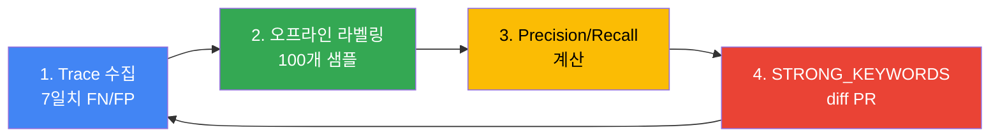

이 문서는 Inference Gateway의 **Cascade Routing을 프로덕션 환경에서 튜닝**하는 실전 가이드입니다. 아키텍처 개념과 기본 구현은 [게이트웨이 라우팅 전략](./routing-strategy.md)을 먼저 참조하세요.

:::info 대상 독자
이 문서는 플랫폼 운영자, MLOps 엔지니어를 대상으로 합니다. LLM Classifier 또는 LiteLLM 기반 Cascade Routing이 이미 배포되었고, 실제 프로덕션 트래픽 기반으로 정확도와 비용을 개선하려는 상황을 가정합니다.
:::

:::caution Verification pending
문서의 쿼리 계약·롤아웃 기준·Fallback 설계는 정적 검토를 거쳤지만 운영 검증은 대기 중입니다. 과거 초안의 기간·요청 수·성능 수치에 연결된 검증 자료가 없으므로 실측값으로 인용하지 않습니다. 운영자는 아래 증거 절차를 완료하고 결과를 검토해야 합니다.

[Issue #5](https://github.com/devfloor9/engineering-playbook/issues/5)
:::

---

## 튜닝 목표와 SLO 정의

비용·품질·가용성을 함께 평가합니다. 목표값은 워크로드 소유자가 사전에 정하고, 아래 예시 숫자는 승인된 SLO가 아닙니다.

### SLO 예시 (GLM-5 + Qwen3-4B 환경)

| 지표 | 정의 | 승인에 필요한 증거 |
|---|---|---|
| TTFT p95/p99 | 게이트웨이 요청 수신부터 첫 응답 토큰까지, 초 | 모델·입력 길이별 histogram, stream 완료 지연과 분리 |
| 요청당 비용 | 기간 내 배분 비용 / 같은 기간 최초 요청 수 | 재시도·Fallback·유휴 GPU를 포함한 비용 원장 |
| 분류 오류율 | 라벨이 있는 표본의 (FP + FN) / N | 라벨 규칙·표본 추출 seed·분모·신뢰구간 |
| 라우팅 불일치율 | classifier_result와 actual_tier 불일치 / 완료 요청 | fallback_reason 및 attempt별 실제 모델 |
| SLM 사용률 | 최종 weak 응답 / 최종 응답 | 실패·캐시·미완료를 별도 집계 |

### 측정 주기

실시간 오류·TTFT·fallback_reason을 관찰하고 일별 라벨 표본을 검토합니다. 비교군에는 동일 시간대·요청 종류·토큰 길이 분포를 적용합니다. 피드백이 있는 요청만으로 전체 오류율을 추정하지 않습니다.

### 성공 지표 계산 예시

아래 함수는 Langfuse SDK 객체가 아닌 정규화한 로컬 export를 입력받습니다. 비율은 0–1이며 비용 누락을 0달러로 바꾸지 않습니다.

```python
def calculate_metrics(rows):
    # Normalized local export: one row per initial request, not per attempt.
    labeled = [r for r in rows if r.get("required_tier") in {"weak", "strong"}
               and r.get("classifier_result") in {"weak", "strong"}]
    completed = [r for r in rows if r.get("actual_tier") in {"weak", "strong"}]
    known_cost = [r for r in rows if r.get("allocated_cost_usd") is not None]
    def ratio(n, denominator):
        return n / denominator if denominator else None
    return {
        "misroute_rate": ratio(sum(r["classifier_result"] != r["required_tier"]
                                   for r in labeled), len(labeled)),
        "label_coverage": ratio(len(labeled), len(rows)),
        "slm_usage_rate": ratio(sum(r["actual_tier"] == "weak" for r in completed),
                                len(completed)),
        "cost_coverage": ratio(len(known_cost), len(rows)),
        "cost_per_1k": (1000 * sum(r["allocated_cost_usd"] for r in rows) / len(rows)
                        if rows and len(known_cost) == len(rows) else None),
    }
```

## 분류 임계값 기준선 (v7 baseline)

v7은 비교용 휴리스틱의 이름입니다. 배포 버전이나 운영 검증 완료를 의미하지 않습니다.

### 검증할 분류 기준 {#실전-검증된-분류-기준}

기존 초안의 14일·42,000요청·비용·오류율은 원본 증거와 연결되지 않아 삭제했습니다. 재평가에서는 UTC 기간, 환경 식별자(비공개 기록), 설정 digest, 표본 manifest와 라벨 기준을 기록합니다. 공개 문서에는 승인된 집계만 포함합니다.

#### STRONG_KEYWORDS (17개)

키워드는 복잡도 후보 신호입니다. 특정 단어가 특정 모델을 반드시 요구한다는 증거는 아닙니다.

```python
STRONG_KEYWORDS = [
    "리팩터", "아키텍처", "설계", "분석", "최적화", "디버그", "마이그레이션",
    "refactor", "architect", "design", "analyze", "optimize", "debug",
    "migration", "complex", "performance", "security",
]
```

#### 문자 수 임계값 (500자) {#token_threshold-500자}

기존 `TOKEN_THRESHOLD`는 실제로 문자 수를 셌습니다. 예제는 `CHAR_THRESHOLD = 500`으로 명명합니다. 문자·UTF-8 byte·token 수를 혼용하지 않습니다. 토큰 제한은 배포 모델의 tokenizer와 chat template으로 별도 검사합니다.

#### TURN_THRESHOLD (5턴)

대화 턴은 user 메시지 수로 정의합니다. system·assistant·tool 메시지까지 세는 `len(messages)`와 구분합니다. 5는 검증 전 후보값입니다.

### v7 분류 로직 전체 코드

아래 코드는 텍스트 메시지만 지원합니다. 멀티모달 입력은 별도 계약이 필요하며 조용히 누락시키지 않습니다.

```python
CHAR_THRESHOLD = 500
TURN_THRESHOLD = 5

def classify_v7(messages: list[dict]) -> str:
    if any(not isinstance(m.get("content", ""), str) for m in messages):
        raise ValueError("Only text messages are supported by this example")
    content = " ".join(m.get("content", "") for m in messages)
    user_turns = sum(m.get("role") == "user" for m in messages)
    if any(kw in content.lower() for kw in STRONG_KEYWORDS):
        return "strong"
    if len(content) > CHAR_THRESHOLD or user_turns > TURN_THRESHOLD:
        return "strong"
    return "weak"
```

### 도출 과정 요약

변경 이력에는 버전·설정 hash·표본 hash·라벨 수·FN/FP·비용 coverage를 기록합니다. 검증되지 않은 버전별 성능 표는 기준선으로 사용하지 않습니다.

## Langfuse OTel trace 기반 misroute 탐지

분류 품질, 실제 실행 경로, 사용자 피드백은 서로 다른 관측값입니다. request_id로 결합하되 retry마다 새 요청으로 중복 계산하지 않습니다.

### Misroute 정의

| 유형 | 정확한 조건 |
|---|---|
| FN | classifier_result=weak, required_tier=strong |
| FP | classifier_result=strong, required_tier=weak |
| 라우팅 불일치 | classifier_result != actual_tier; 정상 Fallback도 포함 가능 |
| 검토 후보 | 낮은 피드백·재시도; 라벨 전에는 FN/FP 아님 |

### Langfuse 트레이스 태그 구조

Langfuse의 tags는 문자열 목록이며 dict가 아닙니다. 다음은 최신 OTel 기반 Python SDK의 계측 예시입니다. 운영 서버·SDK 버전을 고정하고 export 시 필드 매핑을 검증합니다. 실제 요청 본문과 자격 증명은 기록하지 않습니다.

```python
from langfuse import get_client, propagate_attributes

langfuse = get_client()
with propagate_attributes(tags=["classifier:v7"], metadata={
    "requestId": "synthetic-request-001",
    "classifierResult": "weak",
    "actualModelUsed": "qwen3-4b",
    "actualTier": "weak",
    "fallbackReason": "none",
    "classifierVersion": "v7",
}):
    with langfuse.start_as_current_observation(
        name="routing-decision", as_type="span"
    ):
        pass  # Synthetic instrumentation example; no model invocation.
# Short-lived scripts must flush before exit.
langfuse.flush()
```

metadata의 camelCase 필드를 export adapter가 request_id, classifier_result, actual_model_used, actual_tier, fallback_reason, classifier_version으로 각각 매핑합니다. propagate_attributes의 metadata는 짧은 문자열 값과 영숫자 key 제약을 따릅니다. 서버/SDK 버전에 따라 observation에서 trace로 집계되는 위치도 확인합니다.

### Misroute 탐지 쿼리 (Langfuse UI)

UI 필터는 후보 선택용입니다. 아래 SQL은 **Langfuse 내부 테이블이나 UI 쿼리 문법이 아니라**, export를 정규화한 SQLite/분석 DB의 읽기 계약입니다. OTel은 수집 형식이며 SQL 저장소를 정의하지 않습니다.

#### FN 탐지 (weak → strong 필요)

`classifier_result=weak`와 낮은 명명된 feedback score로 후보를 찾은 뒤 독립 라벨 `required_tier=strong`을 확인합니다. binary thumb-down은 0/1, 별점은 다른 척도이므로 score 이름과 척도를 고정합니다.

#### FP 탐지 (strong → weak 충분)

`classifier_result=strong`, `required_tier=weak`일 때만 FP로 집계합니다. 짧은 prompt나 빠른 TTFT만으로 약한 모델이 충분하다고 판정하지 않습니다.

### 정규화 export와 SQL 대조 {#python-스크립트로-자동-추출}

`export adapter`는 페이지를 모두 읽고 request_id별 마지막 실행 결과와 독립 라벨을 결합해야 합니다. 아래 스키마에 적재한 뒤 SQL 결과를 같은 로컬 데이터의 `calculate_metrics` 결과와 대조합니다. 중복·미라벨·누락 비용의 수를 별도 보고합니다.

```sql
-- One row per request; nullable labels/costs are intentional.
CREATE TABLE routing_evidence (
  request_id TEXT PRIMARY KEY, classifier_version TEXT NOT NULL,
  classifier_result TEXT NOT NULL CHECK (classifier_result IN ('weak','strong')),
  actual_tier TEXT CHECK (actual_tier IN ('weak','strong')),
  actual_model_used TEXT, fallback_reason TEXT,
  required_tier TEXT CHECK (required_tier IN ('weak','strong')),
  allocated_cost_usd REAL
);
SELECT classifier_version,
       COUNT(*) AS labeled_n,
       SUM(CASE WHEN classifier_result='weak' AND required_tier='strong'
                THEN 1 ELSE 0 END) AS fn,
       SUM(CASE WHEN classifier_result='strong' AND required_tier='weak'
                THEN 1 ELSE 0 END) AS fp,
       1.0 * SUM(CASE WHEN classifier_result<>required_tier THEN 1 ELSE 0 END)
         / NULLIF(COUNT(*), 0) AS misroute_rate
FROM routing_evidence
WHERE required_tier IN ('weak','strong')
GROUP BY classifier_version;
```

### Retry 패턴 기반 FN 탐지 (Advanced)

동일 세션의 요청을 UTC timestamp로 정렬하고 `total_seconds()`로 시간차를 계산합니다. 동일·유사 요청의 재시도는 후보일 뿐입니다. 세션 ID는 가명화하고 유사도 함수·임계값을 고정합니다. 재시도나 fallback_reason을 required_tier 라벨로 대체하지 않습니다.

## 키워드·길이·턴수 3-dim 튜닝 플레이북

### 주간 튜닝 사이클 (4단계)



### 1단계: Trace 수집

Langfuse Public API의 traces 조회는 GET과 public/secret key의 HTTP Basic 인증을 사용합니다. 다음은 읽기 전용 한 페이지 예시이며 `meta.totalPages`까지 반복해야 합니다. host·기간·page를 명시하고 trace API 응답을 SDK 속성 이름과 혼용하지 않습니다.

```bash
curl --fail-with-body --silent --show-error --get \
  "${LANGFUSE_HOST:?}/api/public/traces" \
  --user "${LANGFUSE_PUBLIC_KEY:?}:${LANGFUSE_SECRET_KEY:?}" \
  --data-urlencode "fromTimestamp=${FROM_UTC:?}" \
  --data-urlencode "toTimestamp=${TO_UTC:?}" \
  --data-urlencode "page=${PAGE:?}" \
  --data-urlencode "limit=100" > traces-page.json
```

공유 shell history·로그에 키를 남기지 않습니다. 승인된 환경의 secret injection을 사용합니다.

### 2단계: 오프라인 라벨링 (100개 샘플)

100개는 예시입니다. 고정 seed로 전체 트래픽에서 추출하고 cohort·언어·길이별 coverage를 기록합니다. 심각한 FN 탐색용 편향 표본은 별도 집계합니다. 라벨이 누락된 행은 분모에서 제외하되 누락률을 보고합니다.

### 3단계: Precision/Recall 계산

TP/FP/FN/TN을 원시 개수로 보관합니다. precision=TP/(TP+FP), recall=TP/(TP+FN), misroute=(FP+FN)/라벨 수입니다. 분모 0은 N/A로 표시하며 비율에 100을 곱한 뒤 다시 `%` 포맷을 적용하지 않습니다.

### 4단계: STRONG_KEYWORDS diff PR

PR에는 설정 diff, 사전 정의한 SLO, 라벨셋 hash, 표본 크기, 관측 기간, before/after 원시 개수와 신뢰구간, rollback 설정을 포함합니다. 실제 결과가 없는 값은 `pending`으로 둡니다.

## Canary 임계값 롤아웃

10% → 50% → 100%는 후보 단계입니다. 각 전환에는 최소 관찰 시간과 최소 표본 수를 모두 충족해야 하며 48시간 경과만으로 승인하지 않습니다.

### kgateway BackendRef Weight 기반 Canary

HTTPRoute backendRefs의 weight는 상대 비율입니다. 정확히 10% 요청이 도착하거나 사용자 세션이 고정된다는 보장은 없습니다. 교차 namespace parentRef는 Gateway listener의 allowedRoutes를 확인합니다. Accepted·ResolvedRefs와 실제 cohort 비율을 함께 확인합니다.

#### Phase 1: 10% Canary

적용 예시이며 이 검토에서는 실행하지 않았습니다. PromQL의 `cascade_*`는 정의가 필요한 애플리케이션 메트릭이며 Envoy 기본 메트릭이 아닙니다. TTFT histogram은 최초 토큰을 받은 요청만 관측하므로 첫 토큰 전 실패율도 함께 확인합니다.

```yaml
apiVersion: gateway.networking.k8s.io/v1
kind: HTTPRoute
metadata:
  name: llm-classifier-canary
  namespace: ai-inference
spec:
  parentRefs:
    - name: unified-gateway
      namespace: ai-gateway
  rules:
    - matches:
        - path:
            type: PathPrefix
            value: /v1/
      backendRefs:
        - name: llm-classifier-v7
          port: 8080
          weight: 90
        - name: llm-classifier-v8
          port: 8080
          weight: 10
```

```promql
# Application-owned counters/histograms; instrument these names explicitly.
100 * sum by (classifier_version) (
  rate(cascade_requests_total{outcome="error"}[5m])
) / sum by (classifier_version) (rate(cascade_requests_total[5m]))

histogram_quantile(0.95,
  sum by (le, classifier_version) (rate(cascade_ttft_seconds_bucket[5m]))
)
```

#### Phase 2: 50% 승인 조건 {#phase-2-50-에러율--2}

90:10을 50:50으로 바꾸기 전 control과 candidate의 오류·TTFT·FN/FP·비용 coverage·fallback 비율을 비교합니다. 실제 승격 기준은 사전 승인 기록을 따릅니다.

#### Phase 3: 100% 승인 조건 {#phase-3-100-에러율--2-p99--15s}

0:100 전환 전 라벨 품질·최소 표본·대표 시간대·rollback 리허설 증거를 확인합니다. 전체 응답 지연과 TTFT를 구분하여 승인합니다.

### Rollback 트리거

SLO 위반, 심각한 품질 저하, 비용·메트릭 누락, NaN/빈 series는 승격 중지 조건입니다. 사전 합의한 조건에서는 stable:canary를 100:0으로 복구하고 Gateway 반영 시간·기존 stream 잔존·성공 응답 회복을 기록합니다. 단일 Prometheus sample로 “5분 연속”을 판단하지 않습니다. 경보 `for: 5m` 또는 시간 구간 증거를 사용합니다.

## Spot 중단·Rate limit Fallback

Fallback은 요청의 품질·보안 정책, 남은 deadline, 실행 상태에 따라 결정합니다. Gateway와 Bifrost 양쪽에서 무제한 중첩 retry를 만들지 않습니다.

### Spot 중단 시 허용된 대체 경로 {#spot-중단-시-자동-downgrade}

Spot 경고를 받으면 신규 요청을 건강한 동급 용량으로 전환합니다. lower tier는 해당 요청이 허용할 때만 선택합니다. rate limit은 admission 제어이며 목적지가 아닙니다. 캐시는 tenant·권한·모델/프롬프트 버전·TTL이 일치할 때만 사용합니다.

#### kgateway Retry 설정

`gateway.envoyproxy.io/BackendTrafficPolicy`는 Envoy Gateway CRD이며 kgateway 설정이 아닙니다. 이를 삭제하고 배포된 kgateway 버전의 retry 정책/CRD 지원을 확인하도록 합니다. HTTPRoute weight만으로 failover 순서가 생기지 않습니다. 429는 Retry-After와 전체 deadline을 존중합니다.

#### LLM Classifier 내부 Fallback 로직

아래는 구현할 상태 전이 계약이며 실행 코드가 아닙니다. 부작용 있는 tool 호출은 중복 방지가 검증되지 않으면 재시도하지 않습니다.

```text
admit within quota and total deadline
  -> approved valid cache hit: return cached response
  -> healthy primary / equivalent backend
  -> retry eligible transient failure within shared attempt budget
  -> approved lower tier if quality/data policy allows
  -> approved cache if still valid and available
  -> explicit 429/503 (or stream error after headers)

401/403/invalid request: no downgrade or provider bypass
first response token sent: no transparent replay of the stream
record every attempt, model ID, reason, status, and elapsed time
```

### Rate Limit Fallback (외부 프로바이더)

프로바이더 전환은 데이터 경계·모델 기능·context 길이·tool schema가 호환되는 경우만 허용합니다. 다른 프로바이더를 구성했다는 사실만으로 자동 fallback이 생기지 않습니다.

#### LiteLLM Fallback 설정

LiteLLM은 primary와 fallback을 서로 다른 `model_name`으로 정의하고 fallback 목록이 그 이름을 참조해야 합니다. 동일 model_name의 두 deployment는 부하 분산 그룹입니다. Bedrock inference profile ID에 Anthropic API key를 연결하지 않습니다. 실제 모델 ID·인증·retry 설정은 고정한 LiteLLM 버전으로 검증합니다.

#### Bifrost Governance Routing Rules Fallback

Bifrost 공식 fallback 요청은 provider/model 쌍의 순서 목록을 사용합니다. governance rule 설정은 배포 버전 스키마와 대조해야 합니다. 이전의 추정 CEL/retry JSON은 제거했습니다. 429·연결 실패·deadline 소진·권한 실패·부분 stream을 각각 replay하여 실제 attempt 순서를 기록합니다.

## 비용 드리프트 모니터링·경보

비용 추정은 청구와 대조할 수 있는 원장에서 산출합니다. `up` 개수는 유료 노드 수나 유휴 비용을 나타내지 않습니다.

### AMP Recording Rule (시간당 비용)

`cascade_allocated_cost_usd_total`은 원장이 내보내는 누적 counter입니다. 각 비용 구간을 한 번만 배분하고 재시도·유휴 자원·공유 노드 이중 계산을 처리해야 합니다. 시간당 비용 gauge에 `increase()`를 적용하지 않습니다. AMP ruler 파일은 groups/rules 형식을 사용합니다. PrometheusRule CRD는 Operator용이며 AMP에 직접 적용하는 형식이 아닙니다.

```yaml
groups:
  - name: cascade_cost
    rules:
      - record: cascade:cost_usd_per_hour
        expr: sum(rate(cascade_allocated_cost_usd_total[1h])) * 3600
      - record: cascade:cost_per_request_usd
        expr: |
          (sum(increase(cascade_allocated_cost_usd_total[1h]))
           / sum(increase(cascade_requests_total[1h])))
          and (sum(increase(cascade_requests_total[1h])) > 0)
```

### Grafana 패널 (비용 추세)

Grafana 패널은 `cascade:cost_usd_per_hour`를 USD/hour, `cascade:cost_per_request_usd`를 USD/request로 표시합니다. 비용 수집 지연·누락과 요청량을 같이 표시하고 0 요청 구간은 N/A로 둡니다.

### 예산 80% 경보

아래 80달러는 예시 임계값입니다. `[24h]`는 달력의 하루가 아닌 rolling window입니다. 월 예산은 청구 시간대·월 경계와 맞춘 원장으로 확인합니다.

```yaml
groups:
  - name: cascade_budget
    rules:
      - alert: Rolling24HourBudget80Percent
        expr: sum(increase(cascade_allocated_cost_usd_total[24h])) > 80
        for: 5m
        labels:
          severity: warning
        annotations:
          summary: "Rolling 24-hour allocated cost exceeded example threshold"
```

### 비용 드리프트 탐지 (주간 비교)

주간 비용은 누적 비용 counter의 `increase(...[7d])`로 비교합니다. 이전 기간이 0이거나 coverage가 부족하면 비율 경보를 억제하고 데이터 부족으로 표시합니다. 비용 증가를 요청량·모델 믹스·토큰 길이 변화와 분리하여 해석합니다.

## 안티패턴과 실전 함정

아래 항목은 검토할 위험 시나리오입니다. 실제 장애 사례로 인용하려면 운영자가 날짜·버전·원인·대응·비식별 증거를 제공해야 합니다.

### 안티패턴 1: Bifrost custom provider 미활용

서로 다른 vLLM endpoint는 Bifrost의 별도 custom provider로 모델링하고 base_provider_type·base_url·허용 모델을 버전 스키마로 검증합니다. 경로 override가 host override도 허용한다고 추정하지 않습니다.

### 안티패턴 2: RouteLLM 프로덕션 배포 강행

RouteLLM을 포함한 어떤 라우터도 연구 결과만으로 운영 적합성을 확정하지 않습니다. 고정 dependency·이미지 크기·startup·품질·장애 시 fallback을 검증하며 특정 프로젝트가 항상 설치에 실패한다고 단정하지 않습니다.

### 안티패턴 3: model: "auto" 하드코딩 누락

OpenAI 호환 서버에 전달할 때는 선택한 backend의 served model ID를 명시합니다. `model`을 제거하면 유효한 요청이 되지 않을 수 있습니다. 명시 모델 요청과 auto 요청의 우선순위를 계약으로 정합니다.

```python
SERVED_MODELS = {"weak": "qwen3-4b", "strong": "glm-5"}

def backend_body(body, tier):
    return {**body, "model": SERVED_MODELS[tier]}
```

### 안티패턴 4: 한/영 혼용 키워드 누락

언어별 recall을 별도로 측정하고 혼용·띄어쓰기·대소문자·경계값을 로컬 fixture로 검증합니다. 키워드가 없다고 모든 요청이 weak가 되는 것은 아닙니다.

### 안티패턴 5: Canary 롤아웃 없이 v7 → v8 전환

승격·rollback 조건과 endpoint propagation을 검증하기 전 100%로 전환하지 않습니다. 10/50/100 비율은 서비스별 선택값입니다.

### 안티패턴 6: Misroute Rate만 보고 SLM 사용률 무시

SLM 사용률 자체를 목표로 품질을 낮추지 않습니다. 동일 라벨셋의 품질·요청당 비용·에러·TTFT를 함께 비교합니다.

## 운영자 승인 증거 절차 {#operator-acceptance-evidence}

1. 비공개 manifest에 UTC 기간, 리전, 클러스터/namespace 식별자, Langfuse 서버·SDK, classifier, kgateway, Bifrost, 모델/tokenizer, config digest를 고정합니다. 이 문서 검토는 배포·부하 시험·모델 호출을 수행하지 않았습니다.
2. 로컬 합성 fixture로 TP/FP/FN/TN 각 1개, 의도한 fallback, 라벨 없음, 중복 request_id, 비용 누락, 0요청을 확인합니다. 기본 4개 라벨의 오류율은 2/4입니다. SQL과 Python의 분모·결과가 같아야 합니다. 정적 fixture 성공은 Langfuse 실데이터 검증을 대신하지 않습니다.
3. 승인된 export에서 metadata→정규화 스키마 매핑과 pagination, attempt deduplication을 검증합니다. 수동 판정 집계와 SQL 결과·누락률을 대조합니다.
4. 운영자가 승인한 환경에서 각 cohort의 최소 표본 수와 관찰 시간, 오류·TTFT·분류 오류·비용 허용치를 사전 기록합니다. 10/50/100 각 단계의 control 비교와 rollback 시간선을 증거로 남깁니다. 지표 누락 시 승격하지 않습니다.
5. 429/Retry-After, 503, 연결 실패, 양쪽 backend 실패, cache miss/만료/권한 불일치, 부분 stream을 검증합니다. 기대 attempt 순서와 실제 trace가 일치해야 하고 중복 tool 실행·무단 모델/tenant 전환이 없어야 합니다.
6. 운영자는 비식별 결과·설정 hash·UTC 시각·판정 및 승인자를 기록합니다. 안티패턴 사례는 공개 가능한 실제 증거가 있을 때만 추가합니다. 모든 잔여 항목이 승인되기 전 검증 대기 배너를 유지합니다.

## 관련 문서 {#참고-자료}

### 아키텍처 및 전략

- [게이트웨이 라우팅 전략](./routing-strategy.md) - 2-Tier 아키텍처, Cascade/Semantic Router, LLM Classifier 개념
- [추론 게이트웨이 배포 가이드](../../reference-architecture/inference-gateway/setup/) - kgateway Helm 설치, HTTPRoute YAML, LLM Classifier 배포 코드

### 모니터링 및 비용

- [Agent 모니터링](../../operations-mlops/observability/agent-monitoring.md) - Langfuse 아키텍처, 핵심 메트릭, 알림 전략
- [모니터링 스택 구성 가이드](../../reference-architecture/integrations/monitoring-observability-setup.md) - Langfuse Helm, AMP/AMG, ServiceMonitor, Grafana 대시보드
- [코딩 도구 & 비용 분석](../../reference-architecture/integrations/coding-tools-cost-analysis.md) - Aider/Cline 연결, 비용 최적화 팁

### 프레임워크 및 모델

- [vLLM 모델 서빙](../../model-serving/inference-frameworks/vllm-model-serving.md) - vLLM 배포, PagedAttention, Multi-LoRA
- [Semantic Caching 전략](../inference-optimization/semantic-caching-strategy.md) - 3계층 캐시, 유사도 임계값, 관측성

---

## 참고 자료 {#참고-자료-1}

### 공식 문서

- [Langfuse Documentation](https://langfuse.com/docs)
- [LiteLLM Routing](https://docs.litellm.ai/docs/routing)
- [Bifrost Documentation](https://docs.getbifrost.ai)
- [Kubernetes Gateway API](https://gateway-api.sigs.k8s.io/)
- [Amazon Managed Prometheus](https://docs.aws.amazon.com/prometheus/)
- [Langfuse SDK instrumentation](https://langfuse.com/docs/observability/sdk/instrumentation) — OTel SDK contract
- [Langfuse API reference](https://api.reference.langfuse.com/) — traces, pagination, HTTP Basic authentication
- [Gateway API traffic splitting](https://gateway-api.sigs.k8s.io/guides/user-guides/traffic-splitting/) — relative weights
- [Prometheus functions](https://prometheus.io/docs/prometheus/latest/querying/functions/) — counters, rate, histograms
- [Bifrost fallbacks](https://docs.getbifrost.ai/features/retries-and-fallbacks) — provider/model fallback order

### 연구 자료

- [RouteLLM: Learning to Route LLMs with Preference Data (arXiv)](https://arxiv.org/abs/2406.18665)
- [A Unified Approach to Routing and Cascading for LLMs (ETH Zurich)](https://arxiv.org/abs/2410.10347)
- [LMSYS Chatbot Arena Leaderboard](https://arena.ai/leaderboard/text)
- [FrugalGPT: How to Use Large Language Models While Reducing Cost and Improving Performance](https://arxiv.org/abs/2305.05176)

### 관련 블로그

- [LLM Router Pattern: Model Switching](https://markaicode.com/llm-router-pattern-model-switching/)
- [Building Effective AI Agents (Anthropic)](https://www.anthropic.com/research/building-effective-agents)
