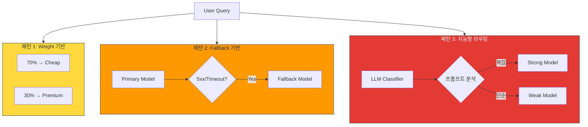
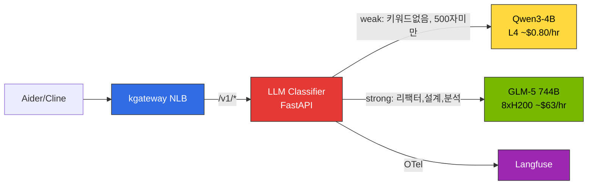
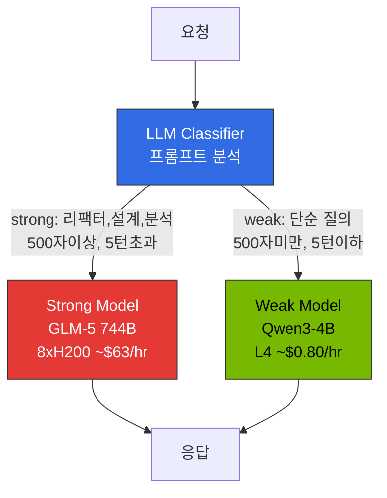

이 문서는 요청 복잡도를 분석해 적절한 모델로 자동 분배하는 **Request Cascading**의 구현 접근(LLM Classifier·LiteLLM·vLLM Semantic Router)과 선택 기준을 다룹니다. 2-Tier 게이트웨이 아키텍처와 전체 라우팅 전략은 [게이트웨이 라우팅 전략](./routing-strategy.md)을 참조하세요.

## Request Cascading: 지능형 모델 라우팅

### 개념

**Request Cascading**은 요청 복잡도를 자동 분석하여 적절한 모델로 라우팅하는 지능형 최적화 기법입니다. 간단한 질의는 저렴하고 빠른 모델로, 복잡한 reasoning은 강력한 모델로 자동 분배하여 비용과 지연을 동시에 개선합니다. IDE는 단일 엔드포인트만 사용하고, 모델 선택은 플랫폼 레벨에서 중앙 통제합니다.

### Cascading 패턴 3가지

| 패턴 | 설명 | 구현 | 사용 사례 |
|------|------|------|----------|
| **1. Weight 기반** | 고정 비율로 트래픽 분배 | kgateway `backendRef weight` | A/B 테스트, 점진적 모델 마이그레이션 |
| **2. Fallback 기반** | 오류 시 다른 모델로 자동 전환 | kgateway retry + 다중 backendRef | 가용성 향상, rate limit 회피 |
| **3. 지능형 라우팅** | 요청 분석 후 자동 모델 선택 | **LLM Classifier** / LiteLLM 커스텀 전략 / vLLM Semantic Router | 비용 최적화, 품질 유지 |



### Request Cascading 실전 구현

지능형 cascade routing은 요청 복잡도를 분석하여 적절한 모델로 자동 라우팅합니다. 자체 호스팅 환경에서 실제 검증된 접근 방법을 중심으로 설명합니다.

#### 접근 A: LLM Classifier (권장 — 실전 검증)

**LLM Classifier**는 Python FastAPI 기반의 경량 라우터로, 프롬프트 내용을 직접 분석하여 SLM/LLM을 자동 선택합니다. kgateway 뒤에서 ExtProc(External Processing) 또는 독립 서비스로 동작하며, 클라이언트는 단일 엔드포인트(`/v1`)만 사용합니다.



**분류 기준:**

| 기준 | weak (SLM) | strong (LLM) |
|------|-----------|-------------|
| **키워드** | 없음 | 리팩터, 아키텍처, 설계, 분석, 디버그, 최적화, 마이그레이션 등 |
| **입력 길이** | 500자 미만 | 500자 이상 |
| **대화 턴 수** | 5턴 이하 | 5턴 초과 |

**핵심 분류 로직:**

```python
STRONG_KEYWORDS = ["리팩터", "아키텍처", "설계", "분석", "최적화", "디버그",
                   "마이그레이션", "refactor", "architect", "design", "analyze",
                   "optimize", "debug", "migration", "complex"]
TOKEN_THRESHOLD = 500

def classify(messages: list[dict]) -> str:
    content = " ".join(m.get("content", "") for m in messages if m.get("content"))
    # 키워드 매칭
    if any(kw in content.lower() for kw in STRONG_KEYWORDS):
        return "strong"
    # 입력 길이
    if len(content) > TOKEN_THRESHOLD:
        return "strong"
    # 대화 턴 수
    if len(messages) > 5:
        return "strong"
    return "weak"
```

**장점**: 클라이언트 수정 불필요, 프롬프트 내용 직접 분석, Langfuse OTel 직접 전송, 배포 간단 (단일 Pod)
**단점**: 분류 정확도가 휴리스틱에 의존 (ML classifier로 점진적 개선 가능)

:::tip LLM Classifier가 최적인 이유
표준 OpenAI 호환 클라이언트(Aider, Cline 등)는 **단일 `base_url`만 설정**합니다. LLM Classifier는 이 단일 엔드포인트 뒤에서 프롬프트를 분석하고, 백엔드 vLLM 인스턴스로 직접 프록시합니다. 클라이언트는 모델 선택을 전혀 인식하지 못합니다.
:::

#### Bifrost 자체 호스팅 Cascade 한계

Bifrost를 자체 호스팅 vLLM cascade에 사용하려 했으나, 다음 한계로 인해 **LLM Classifier로 전환**했습니다:

| 한계 | 설명 |
|------|------|
| **provider/model 포맷 강제** | 요청 시 `openai/glm-5` 형태 필수. 표준 OpenAI 클라이언트(Aider 등)는 `model: "auto"` 같은 단일 모델명을 기대 |
| **provider당 단일 base_url** | 하나의 provider(예: `openai`)에 하나의 `network_config.base_url`만 설정 가능. SLM과 LLM이 다른 Service에 있으면 동일 provider로 라우팅 불가 |
| **프롬프트 내용 직접 매칭 제약** | 라우팅 룰은 프롬프트에서 파생된 `complexity_tier`(SIMPLE/MEDIUM/COMPLEX/REASONING)에는 접근하지만, 키워드·정규식 등 **원시 프롬프트 텍스트를 직접 매칭하는 세밀한 분기**는 어려움(자체 휴리스틱이 필요하면 별도 classifier가 더 유연) |
| **모델명 정규화 이슈** | 하이픈 제거 등 예측 불가능한 정규화로 vLLM `served-model-name`과 불일치 |

:::warning Bifrost는 외부 LLM 프로바이더 통합에 적합
Bifrost는 OpenAI/Anthropic/Bedrock 등 **외부 프로바이더 통합**과 **failover**에 최적화되어 있습니다. 자체 호스팅 vLLM 간의 지능형 cascade routing에는 LLM Classifier가 더 적합합니다.
:::

#### RouteLLM 평가 결과

[RouteLLM](https://github.com/lm-sys/RouteLLM)은 LMSYS가 개발한 오픈소스 라우팅 프레임워크로, Matrix Factorization 라우터가 Chatbot Arena 선호 데이터로 학습되었으며, MT Bench에서 GPT-4 호출 26%만으로 GPT-4 성능의 95%를 유지함이 논문(arXiv:2406.18665)으로 검증되었습니다.

그러나 K8s 배포 시 다음 이슈가 확인되었습니다:

- **의존성 충돌**: `torch`, `transformers`, `sentence-transformers` 등 대형 의존성 트리가 vLLM 환경과 충돌
- **컨테이너 크기**: 분류 모델 포함 시 이미지 크기 10GB+ (경량 라우터에 부적합)
- **배포 불안정**: pip dependency resolution 실패 빈도 높음
- **유지보수**: 연구 프로젝트 성격으로 프로덕션 지원 부재

**결론**: RouteLLM의 MF classifier **개념**은 유효하지만, 프로덕션 배포에는 **LLM Classifier**(경량 휴리스틱) 또는 **LiteLLM complexity routing**(외부 프로바이더 환경)을 권장합니다.

#### 접근 B: LiteLLM 다전략 / 커스텀 라우팅 (외부 프로바이더 환경)

LiteLLM은 **여러 내장 라우팅 전략**(`simple-shuffle`·`latency-based-routing`·`usage-based-routing-v2`·`least-busy`·`cost-based-routing`)을 제공합니다. "복잡도 기반"은 내장 전략이 아니므로, 복잡도 라우팅이 필요하면 앞단의 classifier로 모델을 선택하거나 `CustomRoutingStrategyBase`로 커스텀 전략을 구현합니다.

```yaml
model_list:
  - model_name: gpt-4-turbo
    litellm_params:
      model: gpt-4-turbo-preview
      api_key: os.environ/OPENAI_API_KEY
  - model_name: gpt-3.5-turbo
    litellm_params:
      model: gpt-3.5-turbo
      api_key: os.environ/OPENAI_API_KEY

router_settings:
  routing_strategy: cost-based-routing  # 내장 전략 (가장 저렴한 가용 모델 선택)
  # 복잡도 기반 분기가 필요하면 앞단 classifier가 model_name을 선택하거나
  # CustomRoutingStrategyBase 로 커스텀 전략을 등록
```

**장점**: 100+ 프로바이더, latency/usage/cost 기반 내장 전략, Langfuse 한 줄 연동, LangChain/LlamaIndex 통합
**단점**: 복잡도 라우팅은 직접 구현(앞단 classifier/커스텀 전략), Python 기반 낮은 throughput, 자체 호스팅 vLLM에서는 오버헤드
([LiteLLM routing 문서](https://docs.litellm.ai/docs/routing))

#### 접근 C: vLLM Semantic Router (vLLM 프로젝트)

[vLLM Semantic Router](https://github.com/vllm-project/semantic-router)는 `vllm`에서 import 하는 Python 클래스가 **아니라**, 게이트웨이 앞단(Envoy `ext-proc`)에 배치하는 **독립 실행형 라우팅 서비스**입니다. Rust/Candle 기반 경량 BERT 분류기가 프롬프트를 카테고리로 분류해 적절한 백엔드 모델을 선택합니다. 구성은 코드가 아니라 카테고리·모델 매핑을 담은 **설정 파일(YAML)** 로 합니다.

```yaml
# vLLM Semantic Router config (개념 예시 — 실제 스키마는 프로젝트 문서 참조)
categories:
  simple:
    description: "basic question, quick answer, definition"
    model: qwen3-4b
  complex:
    description: "explain in detail, analyze, step by step"
    model: glm-5-744b
similarity_threshold: 0.85
```

서비스는 OpenAI 호환 요청을 받아 분류 결과에 따라 백엔드로 프록시합니다(별도 Pod/서비스로 배포, ext-proc로 Envoy 계열 게이트웨이와 연동).

**장점**: vLLM 프로젝트 산하, 경량 분류(저지연), 게이트웨이 앞단 통합
**단점**: 독립 서비스 배포 필요, 카테고리 사전 정의 필요

### Cascade Routing 구현 방법 선택 가이드

| 환경 | 권장 접근 | 이유 |
|------|----------|------|
| **자체 호스팅 vLLM (Aider/Cline)** | **LLM Classifier** | 프롬프트 직접 분석, 단일 엔드포인트, 클라이언트 수정 불필요 |
| **외부 프로바이더 (OpenAI/Anthropic)** | **LiteLLM** | 100+ 프로바이더, latency/usage/cost 내장 전략 + 커스텀 전략 |
| **vLLM 단독 + 분류 서비스 가용** | **vLLM Semantic Router** | vLLM 프로젝트 라우터(독립 ext-proc 서비스), 경량 |
| **하이브리드 (외부 + 자체)** | **LLM Classifier + LiteLLM** | 자체는 Classifier, 외부는 LiteLLM |

### Cascade Routing 전략 (Fallback 기반)

복잡도에 따라 **cheap -> balanced -> frontier** 모델을 단계적으로 시도합니다.

**복잡도 분류 기준 (2026-04 기준):**

| 복잡도 | 조건 | 권장 모델 | 입력 토큰 비용 ($/1M) |
|--------|------|----------|-----------|
| **Simple** | 토큰 < 200, 키워드 없음 | Haiku 4.5 / GPT-4.1 nano | $1.00 / $0.10 |
| **Medium** | 토큰 200-1000, 코드 포함 | Sonnet 4.6 / Gemini 2.5 Flash | $3.00 / $0.30 |
| **Complex** | 토큰 1000+, reasoning 키워드 | Opus 4.7 / GPT-4.1 | $5.00 / $2.00 |

**Fallback 조건**: HTTP 5xx, Rate Limit 초과, Timeout, Quality Score < 0.7 (옵션)

### 비용 절감 효과 (2026-07 기준)

일 10,000 요청 시나리오 (Haiku 4.5 $1.00/$5.00, Sonnet 4.6 $3.00/$15.00, Opus 4.7 $5.00/$25.00 per 1M tokens):
- Simple (50%): Haiku 4.5 — 50 tok in, 100 tok out → $2.75/일
- Medium (30%): Sonnet 4.6 — 500 tok in, 500 tok out → $27.00/일
- Complex (15%): Opus 4.7 — 1500 tok in, 1000 tok out → $48.75/일
- Very Complex (5%): Opus 4.7 — 3000 tok in, 2000 tok out → $32.50/일

**총 비용: $111.00/일 ($3,330/월)**

모든 요청을 Opus 4.7로 처리 시 (평균 1K tok in/out): $300/일 ($9,000/월) 대비 **63% 절감**

**자체 호스팅 LLM Classifier 시나리오** (Spot 가격 기준, 2026-07):
- Qwen3-4B (70% weak, g6.xlarge L4 Spot ~$0.31/hr × 24hr × 30d) = 약 $223/월
- GLM-5 744B (30% strong, p5en.48xlarge 8xH200 Spot ~$16/hr × 24hr × 30d × 0.3) = 약 $3,456/월
- Langfuse + AMP/AMG = $200/월

**총 비용: 약 $3,879/월** (GLM-5 단독 상시 운영 약 $11,520/월 대비 **66% 절감**)

### 엔터프라이즈 모델 라우팅 패턴

**구현 위치 우선순위**: Gateway > IDE > 클라이언트

| 위치 | 장점 | 적합 환경 |
|------|------|----------|
| **Gateway (LLM Classifier)** | 프롬프트 분석, 중앙 통제, 클라이언트 무수정 | 자체 호스팅 **(권장)** |
| **Gateway (LiteLLM/Bifrost)** | 멀티 프로바이더, 정책 일관성 | 외부 프로바이더 |
| **IDE (Claude Code)** | 컨텍스트 인식 | 개발 도구 벤더 |
| **클라이언트 (SDK)** | 유연성 높음 | 프로토타입 |

**실전 권장**: 자체 호스팅 환경에서는 **kgateway → LLM Classifier → vLLM** 구조로 배포하여 중앙에서 라우팅. 개발자는 단일 엔드포인트(`/v1`)만 사용하고, 플랫폼 팀이 분류 정책을 관리합니다. 상세 배포 가이드는 [추론 게이트웨이 배포: LLM Classifier](../../reference-architecture/inference-gateway/setup/advanced-features#llm-classifier-배포)를 참조하세요.

---

## 연구 참조: RouteLLM

**RouteLLM**은 LMSYS가 개발한 오픈소스 LLM 라우팅 프레임워크입니다. 경량 분류 모델(Matrix Factorization)이 요청을 분석하여 strong/weak 모델을 자동으로 선택합니다.



| 항목 | RouteLLM (연구) | LLM Classifier (실전) |
|------|----------------|---------------------|
| **분류 방식** | Matrix Factorization 임베딩 | 키워드 + 토큰 길이 + 대화 턴 수 |
| **입력** | 사용자 프롬프트 + 대화 히스토리 | 동일 |
| **출력** | Strong/Weak + 신뢰도 점수 | Strong/Weak |
| **추가 지연** | < 10ms (MF 추론) | < 1ms (규칙 기반) |
| **의존성** | torch, transformers, sentence-transformers | FastAPI, httpx (경량) |
| **K8s 배포** | 불안정 (의존성 충돌) | 안정 (50MB 이미지) |

:::warning RouteLLM 프로덕션 배포 주의
RouteLLM은 연구 프로젝트로, K8s 프로덕션 배포는 권장하지 않습니다. 의존성 충돌과 대형 이미지 크기(10GB+)가 문제입니다. MF classifier **개념**은 유용하지만, 실전에서는 **LLM Classifier**(자체 호스팅) 또는 **LiteLLM complexity routing**(외부 프로바이더)을 권장합니다.
:::

상세 배포 코드는 [추론 게이트웨이 배포: LLM Classifier](../../reference-architecture/inference-gateway/setup/advanced-features#llm-classifier-배포)를 참조하세요.

---

## 참고 자료

### 공식 문서
- [LiteLLM Routing](https://docs.litellm.ai/docs/routing) — LiteLLM 내장 라우팅 전략과 커스텀 전략
- [vLLM Semantic Router](https://github.com/vllm-project/semantic-router) — vLLM 프로젝트 독립 실행형 라우팅 서비스
- [RouteLLM](https://github.com/lm-sys/RouteLLM) — LMSYS 오픈소스 LLM 라우팅 프레임워크

### 관련 문서 (내부)
- [게이트웨이 라우팅 전략](./routing-strategy.md) — 2-Tier 아키텍처, Gateway API Inference Extension, 솔루션 비교
- [Cascade Routing 튜닝](./cascade-routing-tuning.md) — 분류 임계값·키워드 튜닝, misroute 탐지, 비용 드리프트 경보
- [추론 게이트웨이 배포: 고급 기능](../../reference-architecture/inference-gateway/setup/advanced-features.md) — LLM Classifier 배포 코드
