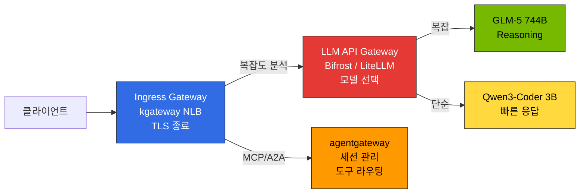
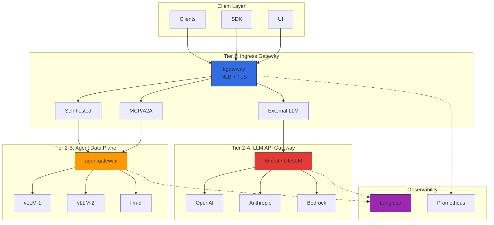
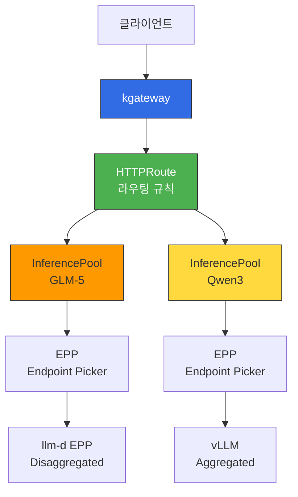
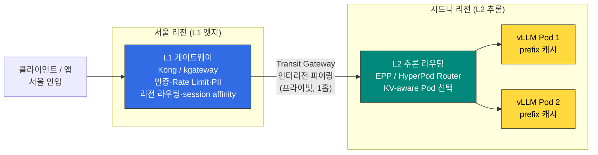

이 문서는 2-Tier 게이트웨이 아키텍처와 라우팅 전략(Cascade / Semantic Router / Hybrid)의 **설계 원칙**을 다룹니다. 실제 Helm 설치, HTTPRoute 매니페스트, OTel 연동 등 **배포 절차**는 [추론 게이트웨이 배포 가이드](../../reference-architecture/inference-gateway/setup/)를 참조하세요.

## 개요

대규모 AI 모델 서빙 환경에서는 **인프라 트래픽 관리**와 **LLM 프로바이더 추상화**를 분리해야 합니다. 단일 Gateway는 복잡성이 급증하고 각 레이어 최적화가 어렵습니다.

**2-Tier Gateway 아키텍처**:
- **L1 (Ingress Gateway)**: kgateway — Kubernetes Gateway API 표준, 트래픽 라우팅, mTLS, rate limiting
- **L2-A (Inference Gateway)**: Bifrost/LiteLLM — 프로바이더 통합, cascade routing, semantic caching
- **L2-B (Data Plane)**: agentgateway — MCP/A2A 프로토콜, stateful 세션 관리

각 티어는 독립적으로 관리되며, 인프라와 AI 워크로드를 분리합니다.

---

## 2-Tier Gateway 아키텍처

:::tip 게이트웨이 계층 정의는 별도 문서로 통일
플랫폼 전역의 게이트웨이 계층 용어·역할 정의는 [티어드 게이트웨이 아키텍처](./tiered-gateway-architecture.md)에 단일하게 정리되어 있습니다. 이 문서는 그중 **Tier 2-A(LLM API Gateway)** 의 라우팅 전략에 집중합니다. 클러스터 내 추론 Pod 라우팅(Tier 2 ① Inference Extension)은 아래 [Gateway API Inference Extension](#gateway-api-inference-extension) 섹션을 참조하세요.
:::

### Gateway 계층 구분

LLM 추론 플랫폼은 **3가지 서로 다른 Gateway 역할**을 명확히 구분해야 합니다. (전체 계층 정의는 [티어드 게이트웨이 아키텍처](./tiered-gateway-architecture.md) 참조)

| Gateway 유형 | 역할 | 구현체 | 위치 |
|-------------|------|-------|------|
| **Ingress Gateway** | 외부 트래픽 수신, TLS 종료, 경로 기반 라우팅 | kgateway (NLB 연동) | Tier 1 |
| **LLM API Gateway** | 모델 선택, 지능형 라우팅, 요청 캐스케이딩 (외부/내부 모델 추상화) | Bifrost / LiteLLM | Tier 2-A |
| **Agent Data Plane** | MCP/A2A 프로토콜, stateful 세션, 도구 라우팅 | agentgateway | Tier 2-B |

> **용어 주의**: 여기서 **Tier 2-A "LLM API Gateway"** 는 모델 API를 추상화하는 프로바이더 프록시(Bifrost/LiteLLM)입니다. 클러스터 내 추론 Pod로 라우팅하는 **Gateway API Inference Extension**(Tier 2 ①, 본 문서 후반부)과는 용도가 다릅니다.

**핵심 원칙:**
- **Ingress Gateway (kgateway)**: 네트워크 레벨 트래픽 제어만 담당. 모델 선택 로직은 포함하지 않음
- **LLM API Gateway (Bifrost/LiteLLM)**: 요청 복잡도 분석 → 적절한 모델 자동 선택 → 비용 최적화
- **Agent Data Plane (agentgateway)**: AI 전용 프로토콜 (MCP/A2A) 처리, stateful 세션 유지

### 전체 구조

### Tier별 역할 분리

| Tier | 컴포넌트 | 책임 | 프로토콜 |
|------|----------|------|----------|
| **Tier 1** (Ingress Gateway) | kgateway (Envoy 기반) | 트래픽 라우팅, mTLS, rate limiting, 네트워크 정책 | HTTP/HTTPS, gRPC |
| **Tier 2-A** (LLM API Gateway) | Bifrost / LiteLLM | 지능형 모델 선택, 비용 추적, request cascading, semantic caching | OpenAI-compatible API |
| **Tier 2-B** (Agent Data Plane) | agentgateway | MCP/A2A 세션 관리, 자체 추론 인프라 라우팅, Tool Poisoning 방지 | HTTP, JSON-RPC, MCP, A2A |

### 트래픽 플로우

**외부 LLM**: Client → kgateway → Bifrost/LiteLLM (Cascade + Cache) → OpenAI → 응답 + 비용 기록
**자체 vLLM**: Client → kgateway → agentgateway → vLLM → 응답

---

## kgateway (L1 Inference Gateway)

### Gateway API 기반 라우팅

kgateway는 Kubernetes Gateway API 표준을 구현하여 벤더 중립적인 설정이 가능합니다.

import { ComponentStructureTable } from '@site/src/components/InferenceGatewayTables';

<ComponentStructureTable />

Gateway API v1.6.0(2026-06 stable, UDPRoute/TCPRoute GA)이 현재 최신이며, kgateway 2.3.x는 Gateway API 1.3-1.5(v1.5.1 포함)를 공식 지원합니다. v1.6 지원은 향후 버전에서 추가될 예정입니다.

### Dynamic Routing 개념

| 라우팅 유형 | 기준 | 사용 사례 |
|------------|------|----------|
| **헤더 기반** | `x-model-id`, `x-provider` | 모델/프로바이더별 백엔드 선택 |
| **경로 기반** | `/v1/chat/completions`, `/v1/embeddings` | API 유형별 서비스 분리 |
| **가중치 기반** | backendRef weight | 카나리 배포, A/B 테스트 |
| **복합 조건** | 헤더 + 경로 + 티어 | 프리미엄/일반 고객별 백엔드 |

카나리 배포는 5-10% 트래픽으로 시작하여 점진적으로 증가시키며, 문제 발생 시 weight=0으로 즉시 롤백합니다.

### 로드 밸런싱 전략

| 전략 | 설명 | 적합 시나리오 |
|------|------|--------------|
| **Round Robin** | 순차적 분배 (기본값) | 균일한 모델 인스턴스 |
| **Random** | 무작위 분배 | 대규모 백엔드 풀 |
| **Consistent Hash** | 동일 키 → 동일 백엔드 | KV Cache 재활용, 세션 유지 |

Consistent Hash는 LLM 추론에서 특히 유용합니다. 동일 사용자의 요청을 같은 vLLM 인스턴스로 라우팅하면 prefix cache 적중률이 높아져 TTFT(Time to First Token)를 크게 개선할 수 있습니다.

### Topology-Aware Routing (Kubernetes 1.33+)

Kubernetes 1.33+의 topology-aware routing을 활용하면 동일 AZ 내 Pod 간 통신을 우선시하여 크로스 AZ 데이터 전송 비용을 절감합니다.

import { TopologyEffectsTable } from '@site/src/components/InferenceGatewayTables';

<TopologyEffectsTable />

### 장애 대응 개념

| 메커니즘 | 설명 | LLM 추론 고려사항 |
|----------|------|-------------------|
| **타임아웃** | 요청별 최대 처리 시간 제한 | LLM 긴 응답 생성 시 수십 초 소요. 충분한 타임아웃 필요 (120s+) |
| **재시도** | 5xx, 타임아웃, 연결 실패 시 자동 재시도 | 최대 3회 제한. 무한 재시도는 시스템 과부하 유발 |
| **서킷 브레이커** | 연속 실패 시 백엔드 일시 차단 | `maxEjectionPercent` 50% 이하로 설정하여 최소 절반의 백엔드 가용 보장 |

스트리밍 응답 시 `backendRequest` 타임아웃은 첫 바이트까지, `request`는 전체 요청 시간입니다. POST 재시도는 멱등성 보장 필요 (도구 호출 주의).

---

## LLM Gateway 솔루션 비교

### 주요 솔루션 비교 표

| 솔루션 | 언어 | 주요 특징 | Cascade Routing | 라이선스 | 적합 환경 |
|--------|------|-----------|-----------------|----------|-----------|
| **Bifrost** | Go | 고성능 게이트웨이, 조건부 라우팅 룰(`complexity_tier`·model·params·budget), failover | 라우팅 룰(`complexity_tier`) + 외부 classifier | Apache 2.0 | 고성능, 저비용, 셀프호스트 |
| **LiteLLM** | Python | 100+ 프로바이더, 다전략 라우팅(latency/usage/cost/least-busy) + 커스텀 전략 | 커스텀 라우팅 전략 / 외부 classifier | MIT | Python 생태계, 빠른 프로토타이핑 |
| **vLLM Semantic Router** | Python | vLLM 전용, 경량 임베딩 기반 라우팅 | 임베딩 유사도 기반 | Apache 2.0 | vLLM 단독 환경 |
| **Portkey** | TypeScript | SOC2 인증, semantic caching, Virtual Keys | 지원 | Proprietary + OSS | 엔터프라이즈, 규정 준수 |
| **Kong AI Gateway** | Lua/C | MCP 지원, 기존 Kong 인프라 활용 | 플러그인 | Apache 2.0 / Enterprise | 기존 Kong 사용자 |
| **Helicone** | Rust | Gateway + Observability 통합, 고성능 | 지원 | Apache 2.0 | 고성능 + 관측성 동시 필요 |
| **OpenRouter** | SaaS (호스티드) | 400+ 모델·70+ 프로바이더 통합 API, 프로바이더 폴백, OpenAI 호환 | 프로바이더 라우팅 지원 | SaaS (상용) | 멀티 프로바이더 빠른 통합, 프로토타이핑 |

:::note 셀프호스트 vs SaaS
위 표에서 Bifrost·LiteLLM·Helicone·vLLM Semantic Router는 **셀프호스트**(클러스터 내 배포)이고, **OpenRouter는 호스티드 SaaS**입니다. SaaS는 즉시 400+ 모델에 접근하고 프로바이더 폴백·빌링을 위임할 수 있어 빠른 통합·프로토타이핑에 유리합니다. 단, 프롬프트가 외부 서비스로 전송되므로 데이터 주권·규제 요건이 있는 환경에서는 [거버넌스 주의점](../../operations-mlops/governance/ai-gateway-guardrails.md#openrouter-등-saas-게이트웨이-데이터-주권)을 검토하세요.
:::

### Bifrost vs LiteLLM

**Bifrost**: Go 기반 고성능 게이트웨이로 Python 대비 낮은 메모리 사용과 빠른 throughput을 제공합니다(공개 벤치 기준 ~11 µs(<100 µs) 오버헤드 @ 5k RPS; "50x faster than LiteLLM"은 벤더 자체 head-to-head 벤치마크(공개, 단 제3자 검증 없음)의 수치(54x P99, 40x 오버헤드, 9.5x 처리량)를 요약한 태그라인). 성능 외에 **공급망·보안 관점**도 선택 요인이 됩니다. Python 기반 LLM 라우터(LiteLLM·LightLLM 등)는 광범위한 의존성 트리로 인해 보안 패치·취약점 대응 부담이 상대적으로 크며, 단일 정적 바이너리로 배포되는 Go 기반 Bifrost는 런타임 의존성과 공격 표면이 작습니다. 단, 이는 일반적 경향이며 실제 위험은 버전·구성별로 다르므로 도입 시점에 각 프로젝트의 보안 권고를 확인해야 합니다. 조건부 라우팅 룰은 헤더뿐 아니라 **프롬프트 내용에서 파생된 `complexity_tier`(SIMPLE/MEDIUM/COMPLEX/REASONING)**, `model`·`params`·budget 신호에 접근할 수 있어 프롬프트 기반 분기가 가능합니다. Helm Chart 배포, OpenAI 호환 API. ([Bifrost routing rules](https://docs.getbifrost.ai/providers/routing-rules))

**LiteLLM**: 100+ 프로바이더 지원, **다전략 라우팅**(`simple-shuffle`·`latency-based-routing`·`usage-based-routing-v2`·`least-busy`·`cost-based-routing`)과 `CustomRoutingStrategyBase` 기반 **커스텀 전략**을 지원합니다. Langfuse 한 줄 연동 (`success_callback: ["langfuse"]`), LangChain/LlamaIndex 직접 통합. 복잡도 기반 라우팅은 네이티브 전략이 아니므로 **앱/외부 classifier 또는 커스텀 전략**으로 구현합니다. 단, Python 기반으로 낮은 throughput, 높은 메모리 사용량. ([LiteLLM routing](https://docs.litellm.ai/docs/routing))

### 선택 기준

| 사용 사례 | 권장 솔루션 | 이유 |
|-----------|-----------|------|
| 지능형 cascade (편의성 우선) | **LiteLLM** | 다전략/커스텀 라우팅 + 100+ 프로바이더, Python 생태계 통합 |
| 지능형 cascade (성능 우선) | **Bifrost** | 라우팅 룰(`complexity_tier`) + 외부 classifier, Go 저오버헤드 |
| vLLM 단독 환경 | **vLLM Semantic Router** | vLLM 프로젝트 라우터(독립 ext-proc 서비스), 경량 분류 |
| 고성능, 저비용 셀프호스트 | **Bifrost** | Go 기반 저오버헤드(~수십 µs)·저메모리 |
| Python 생태계 (LangChain) | **LiteLLM** | 네이티브 통합, 100+ 프로바이더 |
| 엔터프라이즈 규정 준수 | **Portkey** | SOC2/HIPAA/GDPR, Semantic Cache |
| 고성능 + 관측성 통합 | **Helicone** | Rust 기반 All-in-one |

### 시나리오별 추천 조합

| 시나리오 | 추천 조합 | 이유 |
|----------|----------|------|
| **스타트업/PoC** | kgateway + LiteLLM | 저비용, 10분 배포, 100+ 프로바이더 빠른 통합 |
| **셀프호스트 중심 (성능)** | kgateway + Bifrost (CEL cascade) + agentgateway | 고성능, 외부+자체 풀 2-Tier |
| **엔터프라이즈 멀티 프로바이더** | kgateway + Portkey + Langfuse | 규정 준수, 250+ 프로바이더 |
| **하이브리드 (외부+자체)** | kgateway + Bifrost/LiteLLM + agentgateway | 외부는 Bifrost/LiteLLM, 자체는 agentgateway |
| **글로벌 배포** | Cloudflare AI Gateway + kgateway | Edge caching, DDoS 방어 |

---

## Request Cascading: 지능형 모델 라우팅

**Request Cascading**은 요청 복잡도를 자동 분석하여 적절한 모델로 라우팅하는 지능형 최적화 기법입니다. Weight 기반·Fallback 기반·지능형 라우팅 3가지 패턴과 구현 접근(LLM Classifier·LiteLLM·vLLM Semantic Router) 비교, RouteLLM 연구 참조, 비용 절감 효과는 [Request Cascading — 지능형 모델 라우팅](./request-cascading.md)에서 상세히 다룹니다.

임계값·키워드 튜닝과 misroute 탐지 운영은 [Cascade Routing 튜닝](./cascade-routing-tuning.md)을 참조하세요.

---

## Gateway API Inference Extension

Kubernetes Gateway API는 **Inference Extension**을 통해 LLM 추론을 쿠버네티스 네이티브 리소스로 관리할 수 있게 합니다.

### 핵심 CRD (Custom Resource Definitions)

| CRD | 소속 / 상태 | 역할 | 예시 |
|-----|------------|------|------|
| **InferencePool** | GIE, `inference.networking.k8s.io/v1` (GA) | 모델 서빙 Pod 그룹 (vLLM replicas) | `replicas: 3` → 3개 vLLM 인스턴스 |
| **InferenceObjective** | llm-d, `llm-d.ai/v1alpha2` (alpha) | 모델별 서빙 정책 정의 (criticality, 우선순위) | `criticality: high` → 전용 GPU 할당 |

> GA 정리 이후 **GIE는 InferencePool API + Endpoint Picker Protocol만** 보유하며, 정책 CRD(`InferenceObjective`, 구 `InferenceModel`)는 llm-d 프로젝트로 이전되었습니다. 상세 YAML 매니페스트는 [추론 게이트웨이 배포 가이드](../../reference-architecture/inference-gateway/setup/)를 참조하세요.

### Gateway API Inference Extension 통합

Gateway API Inference Extension은 **kgateway + llm-d EPP**와 연동하여 쿠버네티스 네이티브 추론 라우팅을 제공합니다:

**현재 상태**: **Gateway API Inference Extension은 2025년 9월 v1.0.0 GA 되었습니다**(이후 v1.4에서 alpha 라벨 제거, v1.5가 2026-04 최신). InferencePool은 `inference.networking.k8s.io/v1` API로 프로덕션 사용이 가능합니다. GA 시점에 GIE는 **InferencePool API + Endpoint Picker Protocol만** 보유하도록 정리되었고, 기존 `InferenceModel`은 **`InferenceObjective`로 개명되어 llm-d 프로젝트(`llm-d.ai/v1alpha2`, alpha)로 이전**되었습니다. 라우팅은 HTTPRoute에서 InferencePool을 백엔드로 참조하며, EPP(Endpoint Picker)가 엔드포인트를 선택합니다. 실전 배포는 [Reference Architecture](../../reference-architecture/) 가이드를 참조하세요.

### 두 개의 라우팅 레이어 — 반드시 구분

LLM 추론 플랫폼에서 "게이트웨이"는 **서로 다른 두 레이어**를 가리키며, 합칠 수 없습니다. 이 구분이 컴포넌트 선택의 출발점입니다.

| 레이어 | 결정 질문 | 신호 | 단위 | 구현체 |
|--------|----------|------|------|--------|
| **L1 — LLM 프록시 / 엣지** | "어느 프로바이더/모델/리전?" | 비용·예산·프로바이더 health·인증·PII·semantic 유사도 | 모델/프로바이더 target | Kong, Bifrost, LiteLLM, Portkey, (kgateway) |
| **L2 — 추론 라우팅 (KV-aware)** | "어느 GPU Pod?" | vLLM 내부 메트릭(KV cache util·prefix 위치·queue depth) | 개별 Pod | **EPP(GIE)**, HyperPod router, Dynamo, vLLM production-stack |

> GIE 공식 문서는 EPP 위에 **LiteLLM·Solo AI Gateway·Apigee 같은 상위 AI Gateway**를 두는 조합을 (강제 권고가 아닌) 통합 예로 소개한다. L1(across-model)과 L2(within-model)는 상호 보완이다.

:::note 라우팅 "결정"은 추론이 아니다 — KV-aware vs 컨텍스트 인지
L2의 KV-cache-aware(prefix-aware) 라우팅에서 **라우팅 결정 자체는 추론이 아니다.** prefix 블록 해시 + 인덱스 조회라는 기계적 연산이며 모델 forward pass가 없다. 반면 **컨텍스트 인지(시맨틱) 라우팅**은 인코더·분류 모델을 돌려 의도를 분류하므로 라우팅 경로에서 경량 추론이 발생한다. 어느 경우든 선택된 Pod가 수행하는 **최종 워크로드는 LLM 추론**이다. 상세 구분은 [KV Cache 최적화 — Cache-Aware Routing](../../model-serving/inference-optimization/kv-cache-optimization.md#kv-cache-aware-routing)을 참조.
:::

:::note 용어 매핑 — L1/L2 ↔ Tier 2 ①/②
이 L1/L2는 **"라우팅 결정 레이어"** 관점이고, [티어드 게이트웨이 아키텍처](./tiered-gateway-architecture.md)의 Tier는 **"플랫폼 배치 계층"** 관점입니다. 대응 관계는:
- **L1**(across-model 프록시) ≈ **Tier 1**(Ingress) + **Tier 2 ②**(LLM API Gateway)
- **L2**(within-model KV-aware) = **Tier 2 ①**(Inference Routing = Gateway API Inference Extension / EPP)
:::

### EPP(Endpoint Picker) 정확한 정의

**EPP = GIE가 정의한, Envoy `ext-proc`(External Processing) gRPC 프로토콜을 구현한 추론 스케줄러 서비스.** 게이트웨이(Envoy)가 매 요청마다 EPP를 호출해 "InferencePool 안의 어느 Pod로 보낼지"를 위임받는다.

**EPP를 EPP이게 만드는 3가지 사양:**
1. **ext-proc gRPC 구현** — ext-proc 스타일 external processing을 지원하는 게이트웨이가 EPP를 호스트할 수 있습니다 (Istio, kgateway, Envoy Gateway, GKE Gateway, agentgateway, NGINX Gateway Fabric 등)
2. **InferencePool selector로 개별 Pod 주소(`podIP:port`)를 다룸** — Kubernetes Service가 아니라 Pod 단위
3. **모델 서버 메트릭 기반 스케줄링** — 단순 LB가 아니라 KV-cache/load aware

**EPP 내부 파이프라인** (단일 함수가 아니라 레이어드 스케줄러):

| 레이어 | 역할 |
|--------|------|
| Data Layer | InferencePool Pod 목록 + vLLM 메트릭 수집·가공 |
| Routing Layer | InferenceObjective 룰, 모델명 rewrite, 가중치 분할 |
| Flow Control | priority·fairness·queueing (Saturation Detector 과부하 방어) |
| Scheduling Layer | **scorer + picker** — 실제 Pod 선택 |

- **scorer**: `prefix-cache-scorer`(프롬프트 block 단위 해싱 → indexer로 prefix 보유 Pod 추정) 외에 KV 캐시/부하 인지 scorer(load·queue-depth), LoRA affinity 등
- **picker**: scorer 점수 종합 → 최종 Pod 선택(picker 미지정 시 기본 `max-score-picker`)
- 결정 전달: `x-gateway-destination-endpoint` HTTP 헤더 + `dynamic_metadata`(둘 다 일치 필수), fallback 1개 지정 가능

**EPP가 아닌 것**: 게이트웨이가 아니다(라우팅 결정만, 프록시는 게이트웨이가 수행). 모델 라우터가 아니다(within-model Pod 선택만). 레퍼런스 구현은 **llm-d Router**이며 EPP 코드는 llm-d로 통합되었고, GIE에는 InferencePool API와 Endpoint Picker Protocol만 남는다. EPP 호스트 게이트웨이는 ext-proc 스타일 external processing을 지원하는 게이트웨이: **Istio, kgateway, Envoy Gateway, GKE Gateway, agentgateway, NGINX Gateway Fabric 등**.

### L2 옵션 비교: EPP vs HyperPod Inference Operator vs Dynamo

KV-aware routing(L2)을 무엇으로 구현하느냐의 비교다. 세 옵션 모두 **vLLM과 같은 리전·클러스터**에 위치해야 한다.

| 항목 | EPP(GIE) + Envoy 게이트웨이 | HyperPod Inference Operator | NVIDIA Dynamo |
|------|---------------------------|----------------------------|---------------|
| KV-aware 방식 | prefix-cache·kv-util scorer | kvaware/prefixaware (LMCache router) | KV router(Radix tree, KVPublisher/Indexer) |
| 관리 | self-managed (K8s 표준) | **AWS 관리형**(EKS add-on) | self-managed |
| 노드 자동복구 | NMA+Auto Repair 별도 | **딥헬스체크+스페어풀 통합** | 별도 |
| 분산추론 | llm-d 연계 | **DPD 관리형**(EFA/GPUDirect RDMA) | prefill/decode + 3-tier KV offload |
| 백엔드 엔진 | vLLM/TGI 등 | vLLM 전용(kvaware는 `/completions`만) | vLLM/SGLang/**TRT-LLM** |
| 비용 | EC2 단가 | EC2 대비 **+15~20% 프리미엄**(ml.p5 $66 vs p5 $55, us-east-1 2026-06) | EC2 단가 |
| 락인 | 없음(표준) | 중간(SageMaker CRD, 단 vLLM/K8s 표준 위) | 없음 |
| 적합 | 표준·벤더중립·MCP 통합 | 운영 최소·자동복구·governance | 극한 성능·다중 엔진 |

> **Kong은 L2(EPP)를 갖지 않는다.** Kong의 LB(consistent-hash·lowest-latency 등)는 **모델/프로바이더 레벨**이지 Pod 레벨 KV-aware 스케줄링이 아니며, Envoy 기반이 아니라 GIE/ext-proc/InferencePool을 구현하지 않는다. KV-aware가 필요하면 Kong은 L1(엣지)로 두고 L2는 EPP/HyperPod/Dynamo를 사용한다. (도입 시점 Kong 릴리스 노트 재확인 권장 — InferencePool은 게이트웨이 중립 표준이라 향후 지원 가능성 있음.)

:::caution Kong의 시맨틱 캐시 ≠ vLLM KV-cache-aware 라우팅
Kong AI Gateway의 `ai-semantic-cache` 플러그인은 **임베딩 코사인 유사도로 의미가 유사한 요청의 "전체 응답"을 재사용**하는 L1 응답 캐시입니다(중복 LLM 호출 자체를 제거). 이는 vLLM Pod의 prefix KV 캐시 위치를 인지해 Pod를 고르는 **L2 KV-cache-aware 라우팅과 다른 계층**입니다(세 캐시 계층 비교: [Semantic Caching 전략](../inference-optimization/semantic-caching-strategy.md#2-캐시-계층-구분)).

또한 Kong의 벡터 저장소는 **Kong 내부에 임베딩되는 것이 아니라 외부 Redis/Valkey/PGVector**에 연결하며(AWS에서는 IAM 인증 ElastiCache 등), 임베딩 자체도 외부 임베딩 API(OpenAI·Bedrock 등)를 호출해 생성합니다. AWS 통합은 Bedrock 프로바이더·`ai-aws-guardrails` 플러그인이 문서화되어 있으나, "AWS 관리형 KV 캐시"와의 직접 통합은 별도 개념입니다. (Kong 버전별 차이가 있으므로 적용 시점 [Kong AI Gateway 문서](https://developer.konghq.com/ai-gateway/) 확인 권장.)
:::

> **HyperPod의 관리형 DPD/KV-aware는 vLLM에 고정**된다. TensorRT-LLM 백엔드의 성능 천장이 필요하면 HyperPod EKS 위에 Dynamo를 직접 배포하고, HyperPod는 노드 복구·governance 레이어로만 활용하는 하이브리드가 가능하다.

### 멀티리전 주의 (예: 서울 수신 → 호주 추론)

L2(KV-aware)는 vLLM worker의 실시간 메트릭(수백 ms~초 신선도)에 의존하므로 **반드시 vLLM과 같은 리전·클러스터**에 있어야 한다. 서울의 게이트웨이가 호주 vLLM의 KV-aware를 대신할 수 없다(크로스리전 RTT ~130-150ms → 메트릭 stale, InferencePool은 같은 클러스터 Pod만 selector). 따라서:

- **서울 = L1**(Kong/Bifrost/kgateway): 프로바이더·리전 라우팅, 인증, $예산, PII, failover, **session affinity**(prefix 캐시 보존)
- **호주 = L2**(EPP/HyperPod router/Dynamo) + vLLM: KV-aware Pod 선택
- KV 캐시 이득은 **호주 클러스터 내부에서만** 발생(크로스리전 홉은 캐시로 단축 불가). 리전 간 egress 비용·TTFT 가산 유의.

위 구성에서 라우팅은 AWS VPC 레벨에서 동작합니다. 서울 L1이 "이 요청은 추론이니 시드니로" 라는 리전·세션 결정만 내리고, 실제 KV-aware Pod 선택은 시드니 L2가 클러스터 내부 메트릭으로 수행합니다. 두 클러스터는 단일 메시로 통합할 필요가 없으며, Transit Gateway 인터리전 피어링으로 프라이빗 라우팅 경로만 확보하면 됩니다(구체적인 라우팅 테이블·서브넷 구성은 워크로드별로 다르므로 본 문서 범위 밖). 멀티턴 prefix 재사용을 살리려면 L1이 동일 세션을 같은 시드니 엔드포인트로 일관되게 보내는 **session affinity**가 핵심입니다.

---

## Semantic Caching

Semantic Caching은 의미적으로 유사한 프롬프트를 감지하여 이전 응답을 재사용함으로써 LLM API 비용과 지연시간을 동시에 절감합니다. Gateway 레벨(Bifrost/LiteLLM/Portkey)에서 임베딩 유사도로 HIT/MISS를 판단하므로, KV Cache(vLLM) · Prompt Cache(프로바이더 관리형)와 독립적으로 조합할 수 있습니다.

**권장 기본 임계값**: 0.85 — 의미 동일·표현 차이 허용

설계 원칙(3계층 캐시 비교, 유사도 임계값 트레이드오프, 도구 비교 표, 캐시 키 설계, 관측성·실전 체크리스트)은 별도 문서에서 상세히 다룹니다.

- **설계 원칙**: [Semantic Caching 전략](../inference-optimization/semantic-caching-strategy.md)
- **실전 배포 예시**: [OpenClaw AI Gateway 배포](./openclaw-example.md) 의 LiteLLM + Redis 구성

---

## agentgateway 데이터 플레인

### 개요

**agentgateway**는 kgateway의 AI 워크로드 전용 데이터 플레인입니다. 기존 Envoy는 stateless HTTP/gRPC에 최적화되어 있지만, AI 에이전트는 stateful JSON-RPC 세션, MCP 프로토콜, Tool Poisoning 방지 등 특수 요구사항을 가집니다.

### Envoy vs agentgateway 비교

| 항목 | Envoy 데이터 플레인 | agentgateway |
|------|---------------------|---------------------------|
| **세션 관리** | Stateless, HTTP 쿠키 기반 | Stateful JSON-RPC 세션, 인메모리 세션 스토어 |
| **프로토콜** | HTTP/1.1, HTTP/2, gRPC | MCP (Model Context Protocol), A2A (Agent-to-Agent) |
| **보안** | mTLS, RBAC | Tool Poisoning 방지, per-session Authorization |
| **라우팅** | 경로/헤더 기반 | 세션 ID 기반, 도구 호출 검증 |
| **관측성** | HTTP 메트릭, Access Log | LLM 토큰 추적, 도구 호출 체인, 비용 |

### 핵심 기능

#### 핵심 기능

**1. Stateful JSON-RPC 세션 관리**: `X-MCP-Session-ID` 헤더 기반 세션 추적, Sticky Session 라우팅, 비활성 세션 자동 정리 (기본 30분)

**2. MCP/A2A 프로토콜 네이티브 지원**: `/mcp/v1` (MCP 프로토콜), `/a2a/v1` (A2A 에이전트 통신) 경로 지원

**3. Tool Poisoning 방지**: 허용 도구 목록, 위험 도구 차단 (`exec_shell`, `read_credentials`), 응답 크기 제한, 무결성 검증 (SHA-256)

**4. Per-session Authorization**: JWT 토큰 검증, 역할 기반 도구 접근, 세션 하이재킹 방지

:::info agentgateway 프로젝트 현황
agentgateway는 kgateway v2.2 계보에서 분리된 AI 전용 데이터 플레인입니다. 2026년 2~3월경 agentgateway v1.0부터 AI/에이전트 제어 평면 컨트롤러가 agentgateway 저장소로 이관되어 독립 릴리스 체계를 채택했습니다. 현재 활발하게 개발 중이며, MCP 프로토콜과 A2A 프로토콜의 빠른 발전에 맞춰 기능이 지속적으로 추가되고 있습니다.
:::

---

## 모니터링 & Observability

### 핵심 메트릭

AI 추론 게이트웨이에서 모니터링해야 하는 핵심 메트릭은 다음과 같습니다:

import { MonitoringMetricsTable } from '@site/src/components/InferenceGatewayTables';

<MonitoringMetricsTable />

| 메트릭 카테고리 | 주요 항목 | 의미 |
|----------------|----------|------|
| **레이턴시** | TTFT (Time to First Token) | 첫 번째 토큰 생성까지의 시간. 사용자 체감 응답성 |
| **처리량** | TPS (Tokens Per Second) | 초당 토큰 생성 수. 모델 서빙 효율성 |
| **에러율** | 5xx / 전체 요청 | 백엔드 장애 비율. 5% 초과 시 즉시 대응 |
| **캐시 적중률** | Cache Hit / 전체 요청 | Semantic Cache 효율성. 30% 이상 권장 |
| **비용** | 모델별 토큰 사용량 x 단가 | 실시간 비용 추적 |

### Langfuse OTel 연동

Bifrost/LiteLLM에서 Langfuse로 OTel trace를 전송하여 프롬프트/완료 내용, 토큰 사용량, 비용 분석, 도구 호출 체인을 추적합니다. Bifrost는 `otel` 플러그인, LiteLLM은 `success_callback: ["langfuse"]` 설정으로 활성화합니다. 상세 구성은 [모니터링 스택 설정](../../reference-architecture/integrations/monitoring-observability-setup.md)을 참조하세요.

### 알림 규칙 권장

| 알림 | 조건 | 심각도 |
|------|------|--------|
| 높은 에러율 | 5xx > 5% (5분간) | Critical |
| 높은 레이턴시 | P99 > 30초 (5분간) | Warning |
| 서킷 브레이커 활성화 | circuit_breaker_open == 1 | Critical |
| 캐시 적중률 급락 | Cache hit < 30% | Warning |
| 예산 초과 임박 | Budget > 80% | Warning |

---

## 관련 문서

### 실전 배포 가이드

실제 코드 예시와 YAML 매니페스트는 Reference Architecture 섹션을 참조하세요:

- [Request Cascading — 지능형 모델 라우팅](./request-cascading.md) - LLM Classifier·LiteLLM·vLLM Semantic Router 구현 접근 비교
- [추론 게이트웨이 배포 가이드](../../reference-architecture/inference-gateway/setup/) - kgateway, Bifrost, agentgateway 설치 및 YAML 매니페스트
- [OpenClaw AI Gateway 배포](./openclaw-example.md) - OpenClaw + Bifrost + Hubble 실전 배포
- [커스텀 모델 배포](../../reference-architecture/model-lifecycle/custom-model-deployment.md) - vLLM/llm-d 배포 가이드

### 비용 및 관측성

- [코딩 도구 & 비용 분석](../../reference-architecture/integrations/coding-tools-cost-analysis.md) - Aider/Cline 연결, NLB 통합 라우팅 패턴
- [모니터링 스택 설정](../../reference-architecture/integrations/monitoring-observability-setup.md) - Langfuse OTel 연동, Prometheus, Grafana 대시보드
- [LLMOps Observability](../../operations-mlops/observability/llmops-observability.md) - Langfuse/LangSmith 기반 LLM 관측성

### 관련 인프라

- [GPU 리소스 관리](../../model-serving/gpu-infrastructure/gpu-resource-management.md) - 동적 리소스 할당 전략
- [llm-d 분산 추론](../../model-serving/inference-frameworks/llm-d-eks-automode.md) - EKS Auto Mode 기반 분산 추론
- [Agent 모니터링](../../operations-mlops/observability/agent-monitoring.md) - Langfuse 통합 가이드

---

## 참고 자료

### 공식 문서

- [Kubernetes Gateway API](https://gateway-api.sigs.k8s.io/)
- [Gateway API Inference Extension (Proposal)](https://github.com/kubernetes-sigs/gateway-api/issues/2813)
- [kgateway 공식 문서](https://kgateway.dev/docs/)
- [agentgateway GitHub](https://github.com/agentgateway/agentgateway)
- [Bifrost 공식 문서](https://www.getmaxim.ai/bifrost/docs)
- [LiteLLM 공식 문서](https://docs.litellm.ai/)
- [LiteLLM Complexity Routing](https://docs.litellm.ai/docs/routing)
- [vLLM Semantic Router](https://github.com/vllm-project/semantic-router)

### LLM 프로바이더

- [OpenAI API Reference](https://platform.openai.com/docs/api-reference)
- [Anthropic Claude API](https://docs.anthropic.com/claude/reference)
- [AWS Bedrock](https://docs.aws.amazon.com/bedrock/)

### 관련 프로토콜

- [Model Context Protocol (MCP) Spec](https://modelcontextprotocol.io/specification)
- [Agent-to-Agent (A2A) Protocol](https://github.com/a2a-protocol/spec)

### 연구 자료 & 패턴

- [RouteLLM: Learning to Route LLMs with Preference Data (arXiv)](https://arxiv.org/abs/2406.18665)
- [LMSYS Chatbot Arena Leaderboard](https://chat.lmsys.org/?leaderboard)
- [LLM Router Pattern: Model Switching](https://markaicode.com/llm-router-pattern-model-switching/)
