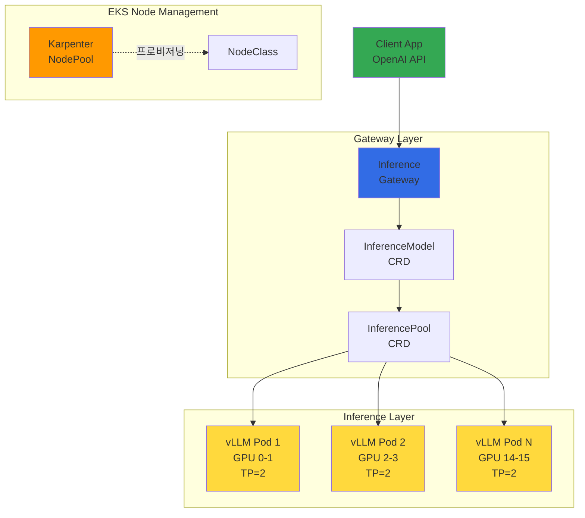
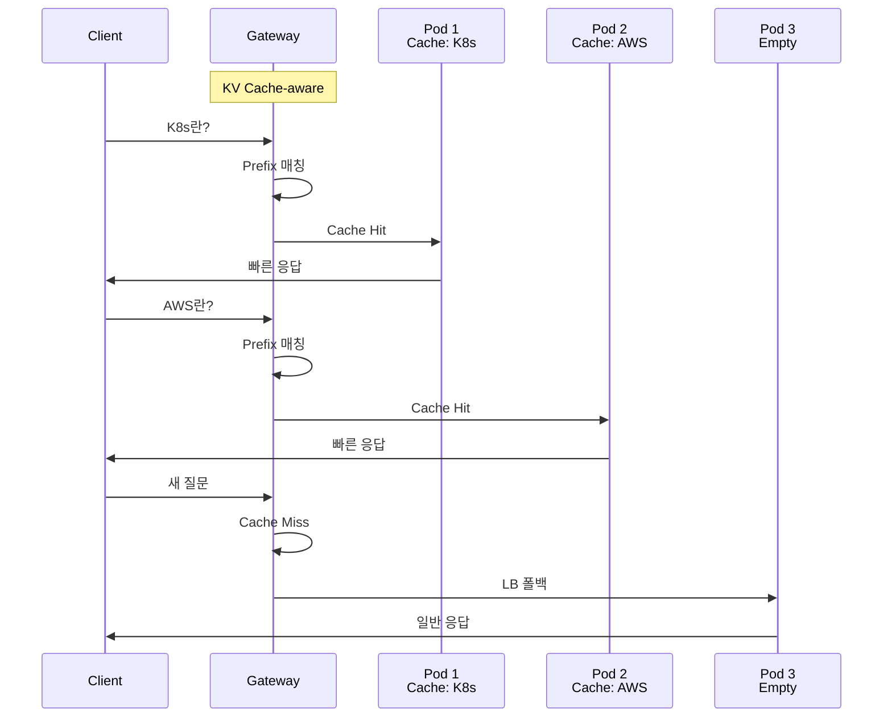
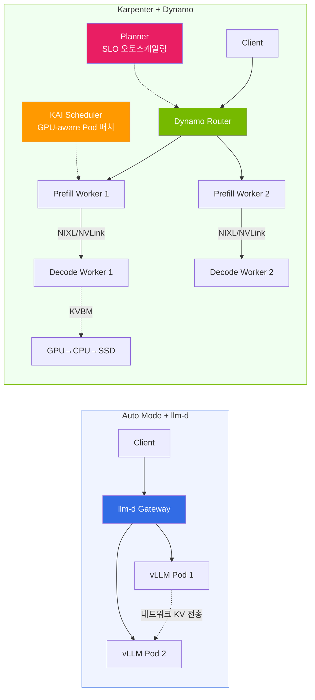

import { ComparisonTable, SpecificationTable } from '@site/src/components/tables';
import {
  WellLitPathTable,
  VllmComparisonTable,
  Qwen3SpecsTable,
  PrerequisitesTable,
  P5InstanceTable,
  P5eInstanceTable,
  GatewayCRDTable,
  DefaultDeploymentTable,
  KVCacheEffectsTable,
  MonitoringMetricsTable,
  ModelLoadingTable,
  CostOptimizationTable,
  TroubleshootingTable
} from '@site/src/components/LlmdTables';

# llm-d 기반 EKS 분산 추론 배포 가이드

> **현재 버전**: llm-d v0.5+ (2026.03). 본 문서의 배포 예시는 Intelligent Inference Scheduling well-lit path 기준입니다.

> **작성일**: 2026-02-10 | **수정일**: 2026-03-20 | **읽는 시간**: 약 10분

## 개요

llm-d는 Red Hat이 주도하는 Apache 2.0 라이선스의 Kubernetes 네이티브 분산 추론 스택입니다. vLLM 추론 엔진, Envoy 기반 Inference Gateway, 그리고 Kubernetes Gateway API를 결합하여 대규모 언어 모델의 지능적인 추론 라우팅을 제공합니다.

기존 vLLM 배포가 단순한 Round-Robin 로드 밸런싱에 의존하는 반면, llm-d는 KV Cache 상태를 인식하는 지능적 라우팅을 통해 동일한 prefix를 가진 요청을 이미 해당 KV Cache를 보유한 Pod로 전달합니다. 이를 통해 Time To First Token(TTFT)을 크게 단축하고 GPU 연산을 절약할 수 있습니다.

llm-d는 EKS의 다양한 노드 관리 방식에서 배포할 수 있으며, 모델 크기와 GPU 활용 전략에 따라 최적의 배포 방식이 달라집니다. 본 문서에서는 **EKS Auto Mode** 환경을 기본 배포 예시로 다루되, **Karpenter 자체 관리** 환경과의 차이점과 선택 기준도 함께 안내합니다.

:::warning llm-d Inference Gateway ≠ 범용 Gateway API 구현체
llm-d의 Envoy 기반 Inference Gateway는 **LLM 추론 요청 전용**으로 설계된 특수 목적 게이트웨이입니다. NGINX Ingress Controller를 대체하는 범용 Gateway API 구현체(AWS LBC v3, Cilium, Envoy Gateway 등)와는 **목적과 스코프가 다릅니다**.

- **llm-d Gateway**: InferenceModel/InferencePool CRD 기반, KV Cache-aware 라우팅, 추론 트래픽 전용
- **범용 Gateway API**: HTTPRoute/GRPCRoute 기반, TLS/인증/Rate Limiting, 클러스터 전체 트래픽 관리

프로덕션 환경에서는 범용 Gateway API 구현체가 클러스터 진입점을 담당하고, llm-d는 그 하위에서 AI 추론 트래픽을 최적화하는 구조를 권장합니다. 범용 Gateway API 구현체 선택은 [Gateway API 도입 가이드](/docs/infrastructure-optimization/gateway-api-adoption-guide)를 참조하세요.
:::

### 주요 목표

- **llm-d 아키텍처 이해**: Inference Gateway와 KV Cache-aware 라우팅의 동작 원리
- **배포 전략 선택**: Auto Mode vs Karpenter 환경별 장단점 비교
- **EKS Auto Mode GPU 구성**: p5.48xlarge 노드 자동 프로비저닝 설정
- **Qwen3-32B 배포**: helmfile 기반 통합 배포 및 검증
- **추론 테스트**: OpenAI 호환 API를 통한 추론 요청 및 스트리밍
- **운영 최적화**: 모니터링, 비용 최적화, 트러블슈팅

### llm-d의 3가지 Well-Lit Path

llm-d는 세 가지 검증된 배포 경로를 제공합니다.

<WellLitPathTable />

---

## 아키텍처

llm-d의 Intelligent Inference Scheduling 아키텍처는 다음과 같이 구성됩니다.



### llm-d vs 기존 vLLM 배포 비교

<VllmComparisonTable />

### Qwen3-32B 모델 선정 이유

<Qwen3SpecsTable />

:::info Qwen3-32B 선정 배경
Qwen3-32B는 llm-d의 공식 기본 모델이며, Apache 2.0 라이선스로 상업적 사용이 자유롭습니다. BF16 기준 약 65GB VRAM이 필요하여 TP=2 (2× GPU)로 H100 80GB에서 안정적으로 서빙할 수 있습니다.
:::

---

## 사전 요구사항

<PrerequisitesTable />

### 클라이언트 도구 설치

```bash
# eksctl 설치 (macOS)
brew install eksctl

# helmfile 설치
brew install helmfile

# yq 설치
brew install yq

# 버전 확인
eksctl version
kubectl version --client
helm version
helmfile --version
yq --version
```

:::warning p5.48xlarge 쿼터 확인
p5.48xlarge는 192 vCPU를 사용합니다. AWS Service Quotas에서 **Running On-Demand P instances** 한도가 최소 192 이상인지 확인하세요. 쿼터 증가 요청은 승인까지 1-3 영업일 소요될 수 있습니다.

```bash
# 현재 P 인스턴스 쿼터 확인
aws service-quotas get-service-quota \
  --service-code ec2 \
  --quota-code L-417A185B \
  --region us-west-2 \
  --query 'Quota.Value'
```

:::

---

## EKS Auto Mode 기반 배포

EKS Auto Mode는 GPU 워크로드 배포를 크게 단순화합니다. GPU 드라이버 설치, AMI 관리, GPU Operator 설정 등의 운영 부담 없이 llm-d를 빠르게 배포할 수 있습니다. 본 섹션에서는 Auto Mode의 특성을 먼저 이해한 후, 클러스터 생성부터 추론 테스트까지 전 과정을 안내합니다.

### Auto Mode의 장점과 제한사항

EKS Auto Mode는 GPU 워크로드에 대해 다음과 같은 장점과 제한사항을 가집니다.

**장점:**

- **GPU 드라이버 자동 관리**: NVIDIA GPU 드라이버를 AWS가 자동으로 설치하고 업데이트합니다. Device Plugin도 AWS가 관리합니다.
- **NodeClass 자동 선택**: `default` NodeClass를 사용하면 Auto Mode가 최적의 AMI와 드라이버 버전을 자동 선택합니다.
- **운영 단순화**: 드라이버 설치, CUDA 버전 관리, 드라이버 호환성 검증 등의 운영 부담이 제거됩니다.
- **GPU Operator 설치 가능**: GPU Operator는 Auto Mode에서도 설치할 수 있습니다. Device Plugin만 노드 레이블(`nvidia.com/gpu.deploy.device-plugin: "false"`)로 비활성화하고, DCGM Exporter, NFD, GFD 등 나머지 컴포넌트는 정상 동작합니다. KAI Scheduler 등 ClusterPolicy에 의존하는 프로젝트를 위해 GPU Operator 설치를 권장합니다.

**제한사항:**

- **MIG/Time-Slicing 불가**: Auto Mode의 NodeClass는 AWS 관리형(read-only)이므로 GPU 분할 설정이 불가능합니다. 소형 모델(7B~13B)에서 GPU 효율이 낮아질 수 있습니다.
- **커스텀 AMI 불가**: 특정 CUDA 버전이나 드라이버 핀이 필요한 경우 Auto Mode로는 대응할 수 없습니다.

:::tip GPU Operator + Auto Mode 하이브리드 구성
Auto Mode에서도 GPU Operator를 설치하면 DCGM Exporter로 세밀한 GPU 메트릭(SM 활용률, NVLink 대역폭 등)을 수집할 수 있습니다. [ai-on-eks PR #288](https://github.com/awslabs/ai-on-eks/pull/288) 패턴을 참조하세요:
- `driver.enabled: false`, `toolkit.enabled: false` (AMI 사전 설치)
- NodePool 레이블: `nvidia.com/gpu.deploy.device-plugin: "false"`
- DCGM Exporter, NFD, GFD, MIG Manager는 `enabled: true`
:::

**Auto Mode vs Karpenter + GPU Operator 비교:**

| 기준 | EKS Auto Mode | EKS Auto Mode + GPU Operator | Karpenter + GPU Operator |
|------|:---:|:---:|:---:|
| **적합한 모델 크기** | 70B+ (GPU 전체 활용) | 70B+ (GPU 전체 활용) | 7B~30B (MIG로 분할 가능) |
| **GPU 드라이버 관리** | AWS 자동 관리 | AWS 자동 관리 | AMI 사전 설치 (driver.enabled=false) |
| **Device Plugin** | AWS 관리 | 레이블로 비활성화 | GPU Operator 관리 |
| **DCGM 모니터링** | 기본 메트릭만 | DCGM Exporter 세밀 메트릭 | DCGM Exporter 세밀 메트릭 |
| **MIG / Time-Slicing** | 불가 | 불가 | 가능 |
| **KAI Scheduler** | 불가 | 가능 (ClusterPolicy 의존) | 가능 |
| **운영 복잡도** | 낮음 | 중간 | 중간 |
| **GPU 비용 효율** | 대형 모델에 최적 | 대형 모델에 최적 | 소형 모델에 최적 |

모델 크기별 상세 비용 분석은 [EKS GPU 노드 전략](./eks-gpu-node-strategy.md)을 참조하세요.

:::info Karpenter 배포 예시
Karpenter + GPU Operator 환경에서의 llm-d 배포는 본 문서의 Auto Mode 예시에서 다음 부분만 변경하면 됩니다:
1. **클러스터 생성**: `autoModeConfig` 대신 Karpenter를 직접 설치
2. **NodePool**: `nodeClassRef`를 `EC2NodeClass`로 변경 (커스텀 AMI, GPU Operator userData 포함)
3. **GPU Operator 설치**: `helm install gpu-operator nvidia/gpu-operator`

상세 구성은 [EKS GPU 노드 전략 — Karpenter + GPU Operator](./eks-gpu-node-strategy.md#4-karpenter--gpu-operator-최적의-조합)를 참조하세요.
:::

### 클러스터 생성

#### 클러스터 구성 파일

```yaml
# cluster-config.yaml
apiVersion: eksctl.io/v1alpha5
kind: ClusterConfig
metadata:
  name: llm-d-cluster
  region: us-west-2
  version: "1.33"
autoModeConfig:
  enabled: true
```

```bash
# 클러스터 생성 (약 15-20분 소요)
eksctl create cluster -f cluster-config.yaml

# 클러스터 상태 확인
kubectl get nodes
kubectl cluster-info
```

#### GPU NodePool 생성

EKS Auto Mode에서 p5.48xlarge 인스턴스를 자동 프로비저닝하기 위한 Karpenter NodePool을 생성합니다.

```yaml
# gpu-nodepool.yaml
apiVersion: karpenter.sh/v1
kind: NodePool
metadata:
  name: gpu-p5
spec:
  template:
    spec:
      requirements:
        - key: eks.amazonaws.com/instance-family
          operator: In
          values: ["p5"]
        - key: kubernetes.io/arch
          operator: In
          values: ["amd64"]
        - key: karpenter.sh/capacity-type
          operator: In
          values: ["on-demand"]
      nodeClassRef:
        group: eks.amazonaws.com
        kind: NodeClass
        name: default
      taints:
        - key: nvidia.com/gpu
          effect: NoSchedule
  limits:
    cpu: "384"
    memory: 4096Gi
    nvidia.com/gpu: "16"
  disruption:
    consolidationPolicy: WhenEmpty
    consolidateAfter: 30s
```

```bash
kubectl apply -f gpu-nodepool.yaml

# NodePool 상태 확인
kubectl get nodepool gpu-p5
```

#### p5/p5e 인스턴스 사양

<P5InstanceTable />

<P5eInstanceTable />

:::tip 인스턴스 선택 가이드
- **p5e.48xlarge (H200)**: 100B+ 파라미터 모델, 최대 메모리 활용
- **p5.48xlarge (H100)**: 70B+ 파라미터 모델, 최고 성능
- **g6e family (L40S)**: 13B-70B 모델, 비용 효율적 추론
:::

### llm-d 배포

#### 네임스페이스 및 시크릿 생성

```bash
export NAMESPACE=llm-d
kubectl create namespace ${NAMESPACE}

# HuggingFace 토큰 시크릿 생성
kubectl create secret generic llm-d-hf-token \
  --from-literal=HF_TOKEN=<your-huggingface-token> \
  -n ${NAMESPACE}

# 시크릿 생성 확인
kubectl get secret llm-d-hf-token -n ${NAMESPACE}
```

#### llm-d 저장소 클론

```bash
git clone https://github.com/llm-d/llm-d.git
cd llm-d/guides/inference-scheduling
```

디렉토리 구조:

```
guides/inference-scheduling/
├── helmfile.yaml          # 통합 배포 정의
├── values/
│   ├── vllm-values.yaml   # vLLM 서버 설정
│   ├── gateway-values.yaml # Gateway 설정
│   └── ...
└── README.md
```

#### Gateway API CRD 설치

llm-d는 Kubernetes Gateway API와 Inference Extension CRD를 사용합니다.

```bash
# Gateway API 표준 CRD 설치 (v1.2.0+)
kubectl apply -f https://github.com/kubernetes-sigs/gateway-api/releases/download/v1.2.0/standard-install.yaml

# Inference Extension CRD 설치 (InferencePool, InferenceModel)
kubectl apply -f https://github.com/kubernetes-sigs/gateway-api-inference-extension/releases/download/v0.3.0/manifests.yaml
```

:::info Gateway API v1.2.0+ 기능
Gateway API v1.2.0은 다음과 같은 향상된 기능을 제공합니다:
- **HTTPRoute 개선**: 더 유연한 라우팅 규칙
- **GRPCRoute 안정화**: gRPC 서비스 라우팅 지원
- **BackendTLSPolicy**: 백엔드 TLS 설정 표준화
- **Kubernetes 1.33+ 통합**: Topology-aware routing 지원
:::

설치되는 CRD:

<GatewayCRDTable />

```bash
# CRD 설치 확인
kubectl get crd | grep -E "gateway|inference"
```

#### Gateway 컨트롤 플레인 설치

```bash
# Istio 기반 Gateway 컨트롤 플레인 설치
helmfile apply -n ${NAMESPACE} -l component=gateway-control-plane
```

#### llm-d 전체 배포

```bash
# 전체 컴포넌트 배포 (vLLM + Gateway + InferencePool + InferenceModel)
helmfile apply -n ${NAMESPACE}
```

기본 배포 구성:

<DefaultDeploymentTable />

:::tip 리소스 조정
기본 설정은 8 replicas × 2 GPU = 16 GPU를 사용합니다. 테스트 목적이라면 `helmfile.yaml`에서 `replicaCount`를 줄여 비용을 절감할 수 있습니다. 예를 들어 4 replicas로 설정하면 단일 p5.48xlarge (8 GPU)로 운영 가능합니다.
:::

#### 배포 확인

```bash
# Helm 릴리즈 확인
helm list -n ${NAMESPACE}

# 전체 리소스 확인
kubectl get all -n ${NAMESPACE}

# InferencePool 상태 확인
kubectl get inferencepool -n ${NAMESPACE}

# InferenceModel 상태 확인
kubectl get inferencemodel -n ${NAMESPACE}

# vLLM Pod 상태 확인 (GPU 할당 포함)
kubectl get pods -n ${NAMESPACE} -o wide

# Pod가 Ready 상태가 될 때까지 대기 (모델 로딩에 5-10분 소요)
kubectl wait --for=condition=Ready pods -l app=vllm \
  -n ${NAMESPACE} --timeout=600s
```

:::warning 모델 로딩 시간
Qwen3-32B (BF16, ~65GB)는 HuggingFace Hub에서 최초 다운로드 시 네트워크 속도에 따라 10-20분이 소요될 수 있습니다. 이후 배포에서는 노드의 로컬 캐시를 활용하여 로딩 시간이 크게 단축됩니다.
:::

### 추론 요청 테스트

#### 포트 포워딩

```bash
# Inference Gateway 포트 포워딩
kubectl port-forward svc/inference-gateway -n ${NAMESPACE} 8080:8080
```

#### curl 기본 테스트

```bash
curl -s http://localhost:8080/v1/chat/completions \
  -H "Content-Type: application/json" \
  -d '{
    "model": "Qwen/Qwen3-32B",
    "messages": [
      {
        "role": "user",
        "content": "Kubernetes란 무엇인가요? 간단히 설명해주세요."
      }
    ],
    "max_tokens": 256,
    "temperature": 0.7
  }' | jq .
```

예상 응답 구조:

```json
{
  "id": "chatcmpl-...",
  "object": "chat.completion",
  "model": "Qwen/Qwen3-32B",
  "choices": [
    {
      "index": 0,
      "message": {
        "role": "assistant",
        "content": "Kubernetes는 컨테이너화된 애플리케이션의 배포, 스케일링..."
      },
      "finish_reason": "stop"
    }
  ],
  "usage": {
    "prompt_tokens": 15,
    "completion_tokens": 128,
    "total_tokens": 143
  }
}
```

#### Python 클라이언트

```python
from openai import OpenAI

client = OpenAI(
    base_url="http://localhost:8080/v1",
    api_key="not-needed"  # llm-d는 별도 인증 불필요
)

response = client.chat.completions.create(
    model="Qwen/Qwen3-32B",
    messages=[
        {"role": "system", "content": "당신은 클라우드 네이티브 전문가입니다."},
        {"role": "user", "content": "EKS Auto Mode의 장점을 3가지 설명해주세요."}
    ],
    max_tokens=512,
    temperature=0.7
)
print(response.choices[0].message.content)
```

#### 스트리밍 응답 테스트

```python
stream = client.chat.completions.create(
    model="Qwen/Qwen3-32B",
    messages=[
        {"role": "user", "content": "llm-d의 KV Cache-aware 라우팅이 어떻게 동작하나요?"}
    ],
    max_tokens=512,
    stream=True
)

for chunk in stream:
    if chunk.choices[0].delta.content:
        print(chunk.choices[0].delta.content, end="", flush=True)
print()
```

#### 모델 목록 확인

```bash
curl -s http://localhost:8080/v1/models | jq .
```

:::info OpenAI 호환 API
llm-d는 OpenAI 호환 API를 제공합니다. 기존 OpenAI SDK를 사용하는 애플리케이션에서 `base_url`만 변경하면 바로 사용할 수 있습니다. `/v1/chat/completions`, `/v1/completions`, `/v1/models` 엔드포인트를 지원합니다.
:::

---

## KV Cache-aware 라우팅

llm-d의 핵심 차별점은 KV Cache 상태를 인식하는 지능적 라우팅입니다.



### 라우팅 동작 원리

1. **요청 수신**: 클라이언트가 Inference Gateway로 추론 요청 전송
2. **Prefix 분석**: Gateway가 요청의 prompt prefix를 해시하여 식별
3. **Cache 조회**: 각 vLLM Pod의 KV Cache 상태를 확인하여 해당 prefix를 보유한 Pod 탐색
4. **지능적 라우팅**: Cache hit 시 해당 Pod로 라우팅, miss 시 부하 기반 로드 밸런싱
5. **응답 반환**: vLLM이 추론 결과를 Gateway를 통해 클라이언트에 반환

### KV Cache-aware 라우팅의 효과

<KVCacheEffectsTable />

:::tip Cache Hit Rate 극대화
동일한 시스템 프롬프트를 사용하는 애플리케이션에서 KV Cache-aware 라우팅의 효과가 극대화됩니다. 예를 들어 RAG 파이프라인에서 동일한 컨텍스트 문서를 반복 참조하는 경우, 해당 prefix의 KV Cache를 재사용하여 TTFT를 크게 단축할 수 있습니다.
:::

---

## llm-d v0.5+ 주요 기능

본 가이드는 Intelligent Inference Scheduling path를 다루었습니다. llm-d v0.5+에서 지원하는 추가 기능입니다.

| 기능 | 설명 | 상태 |
|------|------|:----:|
| **Prefill/Decode Disaggregation** | Prefill과 Decode를 별도 Pod 그룹으로 분리, 대규모 배치와 긴 컨텍스트 처리량 극대화 | GA |
| **Expert Parallelism** | MoE 모델(Mixtral, DeepSeek)의 Expert를 여러 노드에 분산 서빙 | GA |
| **LoRA 어댑터 핫스왑** | 단일 기본 모델에 여러 LoRA 어댑터를 동적 로드/언로드 | GA |
| **멀티 모델 서빙** | 하나의 클러스터에서 여러 모델을 InferenceModel CRD로 동시 서빙 | GA |
| **Gateway API Inference Extension** | InferencePool/InferenceModel CRD 기반 K8s 네이티브 라우팅 | GA |

### Disaggregated Serving

```yaml
# Prefill Pod 그룹
apiVersion: apps/v1
kind: Deployment
metadata:
  name: vllm-prefill
  namespace: llm-d
spec:
  replicas: 2
  template:
    spec:
      containers:
        - name: vllm
          image: vllm/vllm-openai:latest
          args:
            - "--model"
            - "Qwen/Qwen3-32B"
            - "--tensor-parallel-size"
            - "4"
            - "--disaggregated-prefill"   # Prefill 전용 모드
          resources:
            limits:
              nvidia.com/gpu: 4
---
# Decode Pod 그룹
apiVersion: apps/v1
kind: Deployment
metadata:
  name: vllm-decode
  namespace: llm-d
spec:
  replicas: 4
  template:
    spec:
      containers:
        - name: vllm
          image: vllm/vllm-openai:latest
          args:
            - "--model"
            - "Qwen/Qwen3-32B"
            - "--tensor-parallel-size"
            - "2"
            - "--disaggregated-decode"    # Decode 전용 모드
          resources:
            limits:
              nvidia.com/gpu: 2
```

:::info Disaggregated Serving의 이점
- **Prefill**: 프롬프트 처리에 GPU 컴퓨팅을 집중 (compute-bound)
- **Decode**: 토큰 생성에 GPU 메모리를 집중 (memory-bound)
- 각 단계를 독립적으로 스케일링하여 GPU 활용률 극대화
- llm-d도 Disaggregated Serving sidecar에서 **NIXL**을 사용하여 KV Cache 전송 가능 (NIXL은 Dynamo, llm-d, production-stack, aibrix 등 대부분의 프로젝트가 사용하는 공통 전송 엔진)
:::

### EKS Auto Mode에서의 Disaggregated Serving

EKS Auto Mode에서는 MIG 파티셔닝이 불가능하므로(NodeClass read-only), **인스턴스(노드) 단위로 Prefill/Decode 역할을 분리**합니다. GPU Operator는 설치 가능하지만 MIG 분할은 Karpenter 환경에서만 지원됩니다.

```
Prefill NodePool (compute-heavy):
  p5.48xlarge × N대 → Prefill Pod (각 TP=4, GPU 4개)
  → 프롬프트 처리에 집중

Decode NodePool (memory-heavy):
  p5.48xlarge × N대 → Decode Pod (각 TP=2, GPU 2개 × 4 Pod/노드)
  → 토큰 생성에 집중
```

**NodePool을 역할별로 분리**하고 taint/toleration으로 Pod 배치를 제어합니다.

```yaml
# Prefill 전용 NodePool
apiVersion: karpenter.sh/v1
kind: NodePool
metadata:
  name: gpu-prefill
spec:
  template:
    metadata:
      labels:
        llm-d-role: prefill
    spec:
      requirements:
        - key: eks.amazonaws.com/instance-family
          operator: In
          values: ["p5"]
      nodeClassRef:
        group: eks.amazonaws.com
        kind: NodeClass
        name: default
      taints:
        - key: llm-d-role
          value: prefill
          effect: NoSchedule
---
# Decode 전용 NodePool
apiVersion: karpenter.sh/v1
kind: NodePool
metadata:
  name: gpu-decode
spec:
  template:
    metadata:
      labels:
        llm-d-role: decode
    spec:
      requirements:
        - key: eks.amazonaws.com/instance-family
          operator: In
          values: ["p5"]
      nodeClassRef:
        group: eks.amazonaws.com
        kind: NodeClass
        name: default
      taints:
        - key: llm-d-role
          value: decode
          effect: NoSchedule
```

**Auto Mode vs Karpenter + GPU Operator 트레이드오프:**

| 항목 | Auto Mode (노드 분리) | Karpenter + GPU Operator (MIG 분리) |
|------|----------------------|-------------------------------------|
| **분리 단위** | 인스턴스(노드) | GPU 단위 (MIG 파티션) |
| **최소 비용** | p5 × 2대 (~$197/hr) | p5 × 1대 (~$98/hr) + MIG 분할 |
| **GPU 활용률** | Decode Pod TP=2 × 4개/노드로 최적화 가능 | MIG로 한 GPU 내 분할, 높은 활용률 |
| **운영 복잡도** | 낮음 | 중간 (GPU Operator + MIG 설정) |
| **스케일링** | Prefill/Decode 독립 스케일링 용이 | 노드 내 MIG 재설정 시 중단 발생 |

:::tip GPU 유휴 최소화
Decode Pod에 TP=2만 사용하면, p5.48xlarge(8 GPU) 한 노드에 Decode Pod 4개를 배치하여 GPU 활용률을 높일 수 있습니다. Prefill Pod도 TP=4로 한 노드에 2개 배치가 가능합니다.

**권장 전략**: Auto Mode로 먼저 검증한 후, 비용 최적화가 필요하면 Karpenter + GPU Operator + MIG로 전환하세요.
:::

---

## llm-d vs NVIDIA Dynamo

llm-d와 NVIDIA Dynamo는 모두 LLM 추론 라우팅/스케줄링을 제공하지만 접근 방식이 다릅니다. 상세 비교는 [NVIDIA GPU 스택 — llm-d vs Dynamo](./nvidia-gpu-stack.md#llm-d-vs-dynamo-선택-가이드)를 참조하세요.

| 항목 | llm-d | NVIDIA Dynamo |
|------|-------|---------------|
| **주도** | Red Hat (Apache 2.0) | NVIDIA (Apache 2.0) |
| **아키텍처** | Aggregated + Disaggregated | Aggregated + Disaggregated (동등 지원) |
| **KV Cache 전송** | NIXL (네트워크도 지원) | NIXL (NVLink/RDMA 초고속) |
| **KV Cache 인덱싱** | Prefix-aware 라우팅 | Flash Indexer (radix tree 기반) |
| **라우팅** | Gateway API + Envoy EPP | Dynamo Router + 자체 EPP (Gateway API 통합) |
| **Pod 스케줄링** | K8s 기본 스케줄러 (built-in 없음) | KAI Scheduler (GPU-aware Pod 배치) |
| **오토스케일링** | HPA/KEDA 연동 | Planner (SLO 기반: profiling → autoscale) + KEDA/HPA |
| **K8s 통합** | Gateway API 네이티브 (InferencePool/InferenceModel CRD) | Operator + CRD (DGDR) + Gateway API EPP |
| **GPU Operator 필요** | 선택사항 (Auto Mode 호환) | 필요 (KAI Scheduler의 ClusterPolicy 의존) |
| **복잡도** | 낮음 | 높음 |
| **강점** | K8s 네이티브, 경량, 빠른 도입 | Flash Indexer, KAI Scheduler, Planner SLO 오토스케일링 |

:::tip 선택 가이드
- **EKS Auto Mode + 빠른 시작**: llm-d (GPU Operator 선택사항, DCGM 모니터링 시 권장)
- **소규모~중규모 (GPU 16개 이하)**: llm-d
- **대규모 (GPU 16개+), 최대 처리량**: Dynamo (Flash Indexer + Planner SLO 오토스케일링)
- **긴 컨텍스트 (128K+)**: Dynamo (3-tier KV Cache: GPU→CPU→SSD)
- **K8s Gateway API 표준 준수**: llm-d

llm-d로 시작하여 규모가 커지면 Dynamo로 전환하는 것이 현실적입니다. 둘 다 NIXL을 KV 전송에 사용합니다. Dynamo 1.0은 llm-d를 내부 컴포넌트로 통합할 수 있어, 완전한 대안 관계라기보다 Dynamo가 llm-d를 포함하는 상위 집합으로 볼 수 있습니다.
:::

### Dynamo 전체 기능 활용: Karpenter 전환

GPU Operator는 Auto Mode에서도 설치 가능하지만(Device Plugin만 레이블로 비활성화), Dynamo의 **MIG 기반 GPU 분할**과 **최대 성능**을 위해서는 **Karpenter + GPU Operator** 환경이 권장됩니다. KAI Scheduler(GPU-aware Pod 배치)는 ClusterPolicy에 의존하므로 GPU Operator가 필수이며, Auto Mode에서도 GPU Operator를 설치하면 사용 가능합니다.

#### 왜 Karpenter가 필요한가

NIXL(NVIDIA Inference Xfer Library)은 Dynamo, llm-d, production-stack, aibrix 등 대부분의 프로젝트가 사용하는 공통 KV 전송 엔진입니다. GPU 간 직접 통신(NVLink/RDMA)으로 KV Cache를 초고속 전송합니다. GPUDirect RDMA를 최대한 활용하려면 GPU Operator가 제공하는 NCCL/EFA 설정이 필요하며, Auto Mode에서도 GPU Operator를 설치하면 이러한 구성이 가능합니다. 단, MIG 기반 GPU 분할이 필요한 경우 Karpenter로의 전환이 필요합니다.

KAI Scheduler는 GPU-aware K8s Pod 스케줄러로, GPU topology와 MIG 슬라이스를 인식하여 최적의 Pod 배치를 수행합니다 (오토스케일링과는 무관). ClusterPolicy에 의존하므로 GPU Operator 설치가 필수입니다. Auto Mode에서도 GPU Operator를 설치하면 KAI Scheduler를 사용할 수 있습니다. Dynamo의 오토스케일링은 별도의 **Planner** 컴포넌트가 담당합니다 — Profiling을 실행하고 그 결과를 Planner에 제공하면 SLO 목표에 따라 자동 스케일링합니다.

#### 전환 체크리스트

Dynamo 전체 기능을 활용하기 위한 전환 단계입니다.

- [ ] **Karpenter 기반 EKS 클러스터 생성**: 기존 클러스터에 Karpenter를 설치하거나, 새로운 Karpenter 기반 클러스터를 생성합니다. `EC2NodeClass`에서 커스텀 AMI와 GPU 드라이버 설정을 포함합니다.
- [ ] **GPU Operator 설치**: `helm install gpu-operator nvidia/gpu-operator --namespace gpu-operator --create-namespace --set driver.enabled=false --set toolkit.enabled=false` 명령으로 GPU Operator를 설치합니다 (AL2023/Bottlerocket AMI는 드라이버 사전 설치). DCGM Exporter, NFD, GFD, MIG Manager가 자동 배포됩니다.
- [ ] **DCGM Exporter 활성화**: GPU Operator 설치 시 기본 활성화됩니다. Prometheus ServiceMonitor를 구성하여 세밀한 GPU 메트릭(SM 활용률, NVLink 대역폭, 메모리 사용량 등)을 수집합니다.
- [ ] **MIG 설정 (필요 시)**: 소형 모델의 Prefill/Decode 분리 시 MIG 프로파일을 설정합니다. H100에서 `3g.40gb` 프로파일로 Prefill 전용, `1g.10gb`으로 Decode 전용 파티션을 구성할 수 있습니다.
- [ ] **Dynamo Platform 설치**: `helm install dynamo-platform nvidia/dynamo-platform --namespace dynamo-system --create-namespace` 명령으로 Dynamo Operator, KAI Scheduler, Planner, NIXL 런타임을 설치합니다.
- [ ] **DGDR CRD로 워크로드 배포**: `DynamoGraphDeploymentRequest` CRD를 사용하여 Aggregated 또는 Disaggregated 모드로 워크로드를 정의하고, NIXL을 통한 초고속 KV Cache 전송을 활성화합니다.
- [ ] **Planner 설정**: Profiling을 실행하고 결과를 Planner에 제공하여 SLO 기반 오토스케일링을 구성합니다.

#### 아키텍처 비교



#### 마이그레이션 경로

단계별 전환 경로를 통해 운영 리스크를 최소화하면서 점진적으로 성능을 향상시킬 수 있습니다.

**Phase 1: Auto Mode + llm-d (검증 및 프로토타이핑)**
- EKS Auto Mode에서 llm-d를 배포하여 KV Cache-aware 라우팅의 효과를 검증합니다.
- GPU Operator 없이 빠르게 시작하며, 모델 서빙 파이프라인과 모니터링 체계를 구축합니다.
- 적합 대상: PoC, 개발 환경, 소규모 프로덕션 (GPU 16개 이하)

**Phase 1.5: Auto Mode + GPU Operator + llm-d (모니터링 강화)**
- Auto Mode에 GPU Operator를 추가 설치합니다 (Device Plugin은 레이블로 비활성화).
- DCGM Exporter로 세밀한 GPU 메트릭을 수집하고, KAI Scheduler로 GPU-aware Pod 배치를 활성화합니다.
- 적합 대상: Auto Mode의 편의성을 유지하면서 모니터링/스케줄링을 강화하려는 환경

**Phase 2: Karpenter + llm-d Disaggregated (본격 운영)**
- Karpenter + GPU Operator로 전환하여 MIG 기반 GPU 분할을 활성화합니다.
- llm-d의 Disaggregated Serving + NIXL로 Prefill/Decode를 분리하여 처리량을 극대화합니다.
- 적합 대상: 중규모 프로덕션, 비용 최적화가 중요한 환경

**Phase 3: Karpenter + Dynamo (최대 성능, 대규모)**
- Dynamo Platform을 설치하여 Flash Indexer(radix tree KV 인덱싱)와 Planner(SLO 기반 오토스케일링)를 활성화합니다.
- KAI Scheduler로 GPU-aware Pod 배치, 3-tier KV Cache 관리(GPU→CPU→SSD)로 128K+ 긴 컨텍스트를 효율적으로 처리합니다.
- Dynamo 자체 EPP를 통해 Gateway API와 네이티브 통합합니다.
- 적합 대상: 대규모 프로덕션 (GPU 16개+), 최대 처리량/최저 레이턴시 요구

:::caution 전환 시 주의사항
Phase 1에서 Phase 2로 전환할 때 클러스터 재생성이 필요할 수 있습니다. Auto Mode와 Karpenter 자체 관리는 동일 클러스터에서 혼용이 가능합니다. Phase 1.5에서는 Auto Mode NodePool에 `nvidia.com/gpu.deploy.device-plugin: "false"` 레이블을 추가하여 Device Plugin 충돌을 방지합니다.
:::

---

## 모니터링 및 검증

### vLLM 메트릭 확인

```bash
# vLLM Pod의 메트릭 엔드포인트 접근
VLLM_POD=$(kubectl get pods -n ${NAMESPACE} -l app=vllm -o jsonpath='{.items[0].metadata.name}')
kubectl port-forward ${VLLM_POD} -n ${NAMESPACE} 9090:9090

# 메트릭 조회
curl -s http://localhost:9090/metrics | grep -E "vllm_"
```

### 주요 모니터링 메트릭

<MonitoringMetricsTable />

### GPU 활용률 확인

```bash
# 특정 vLLM Pod에서 nvidia-smi 실행
kubectl exec -it ${VLLM_POD} -n ${NAMESPACE} -- nvidia-smi

# 실시간 GPU 모니터링 (1초 간격)
kubectl exec -it ${VLLM_POD} -n ${NAMESPACE} -- nvidia-smi dmon -s u -d 1
```

### Gateway 로그 확인

```bash
# Inference Gateway 로그 확인
kubectl logs -f deployment/inference-gateway -n ${NAMESPACE}

# InferencePool 상태 상세 확인
kubectl describe inferencepool -n ${NAMESPACE}
```

### Prometheus ServiceMonitor 구성

```yaml
apiVersion: monitoring.coreos.com/v1
kind: ServiceMonitor
metadata:
  name: llm-d-vllm-monitor
  namespace: monitoring
spec:
  selector:
    matchLabels:
      app: vllm
  endpoints:
    - port: metrics
      path: /metrics
      interval: 15s
  namespaceSelector:
    matchNames:
      - llm-d
```

---

## 운영 고려사항

### S3 모델 캐싱

HuggingFace Hub에서 매번 모델을 다운로드하면 Cold Start 시간이 길어집니다. S3에 모델 가중치를 캐싱하여 로딩 시간을 단축할 수 있습니다.

```yaml
# vLLM 환경 변수에 S3 캐시 경로 추가
env:
  - name: VLLM_S3_MODEL_CACHE
    value: "s3://your-bucket/model-cache/qwen3-32b/"
```

<ModelLoadingTable />

### HPA (Horizontal Pod Autoscaler) 구성

vLLM 대기 요청 수 기반으로 자동 스케일링을 구성할 수 있습니다.

```yaml
apiVersion: autoscaling/v2
kind: HorizontalPodAutoscaler
metadata:
  name: vllm-hpa
  namespace: llm-d
spec:
  scaleTargetRef:
    apiVersion: apps/v1
    kind: Deployment
    name: vllm-deployment
  minReplicas: 2
  maxReplicas: 8
  metrics:
    - type: Pods
      pods:
        metric:
          name: vllm_num_requests_waiting
        target:
          type: AverageValue
          averageValue: "5"
  behavior:
    scaleUp:
      stabilizationWindowSeconds: 60
      policies:
        - type: Pods
          value: 2
          periodSeconds: 120
    scaleDown:
      stabilizationWindowSeconds: 300
      policies:
        - type: Pods
          value: 1
          periodSeconds: 180
```

:::info HPA와 Karpenter 연동
HPA가 vLLM replica를 증가시키면, 추가 GPU가 필요한 경우 Karpenter가 자동으로 새로운 p5.48xlarge 노드를 프로비저닝합니다. EKS Auto Mode에서는 이 과정이 완전히 자동화됩니다.
:::

### 비용 최적화

<CostOptimizationTable />

:::warning 비용 주의
p5.48xlarge는 시간당 약 $98.32 (us-west-2 On-Demand 기준)입니다. 2대 운영 시 **월 약 $141,580**입니다. 테스트 완료 후 반드시 리소스를 정리하세요.

```bash
# 리소스 정리
helmfile destroy -n ${NAMESPACE}
kubectl delete namespace ${NAMESPACE}
kubectl delete nodepool gpu-p5

# 클러스터 삭제 (필요 시)
eksctl delete cluster --name llm-d-cluster --region us-west-2
```

:::

---

## 트러블슈팅

### 일반적인 문제와 해결 방법

<TroubleshootingTable />

### 디버깅 명령어 모음

```bash
# Pod 상태 및 이벤트 확인
kubectl describe pod <pod-name> -n llm-d

# vLLM 로그 확인 (최근 100줄)
kubectl logs <vllm-pod> -n llm-d --tail=100

# GPU 상태 확인
kubectl exec -it <vllm-pod> -n llm-d -- nvidia-smi

# InferencePool 상태 상세 확인
kubectl describe inferencepool -n llm-d

# InferenceModel 상태 확인
kubectl describe inferencemodel -n llm-d

# Gateway 로그 확인
kubectl logs -f deployment/inference-gateway -n llm-d

# 노드 GPU 리소스 확인
kubectl get nodes -o custom-columns=\
  NAME:.metadata.name,\
  GPU:.status.allocatable.nvidia\\.com/gpu,\
  STATUS:.status.conditions[-1].type

# Karpenter 로그 확인 (노드 프로비저닝 문제)
kubectl logs -f deployment/karpenter -n kube-system
```

:::tip NCCL 디버깅
멀티 GPU 통신 문제가 발생하면 다음 환경 변수를 추가하여 상세 로그를 확인하세요:

```yaml
env:
  - name: NCCL_DEBUG
    value: "INFO"
  - name: NCCL_DEBUG_SUBSYS
    value: "ALL"
```

:::

---

## 다음 단계

### 관련 문서

- [EKS GPU 노드 전략](./eks-gpu-node-strategy.md) — Auto Mode vs Karpenter vs Hybrid Node, 모델 크기별 비용 분석
- [vLLM 기반 FM 배포 및 성능 최적화](./vllm-model-serving.md) — vLLM 기본 개념 및 배포
- [MoE 모델 서빙 가이드](./moe-model-serving.md) — Mixture of Experts 모델 서빙
- [Inference Gateway 및 동적 라우팅](../gateway-agents/inference-gateway-routing.md) — 추론 라우팅 전략
- [GPU 리소스 관리](./gpu-resource-management.md) — GPU 클러스터 리소스 관리, MIG/Time-Slicing 설정

---

## 참고 자료

- [llm-d GitHub](https://github.com/llm-d/llm-d)
- [llm-d Deployer (Helm Charts)](https://github.com/llm-d/llm-d-deployer)
- [EKS Auto Mode 문서](https://docs.aws.amazon.com/eks/latest/userguide/automode.html)
- [Gateway API Inference Extension](https://gateway-api.sigs.k8s.io/geps/gep-3567/)
- [vLLM 공식 문서](https://docs.vllm.ai/)
- [Qwen3-32B HuggingFace](https://huggingface.co/Qwen/Qwen3-32B)
- [Kubernetes Gateway API v1.4](https://gateway-api.sigs.k8s.io/)
