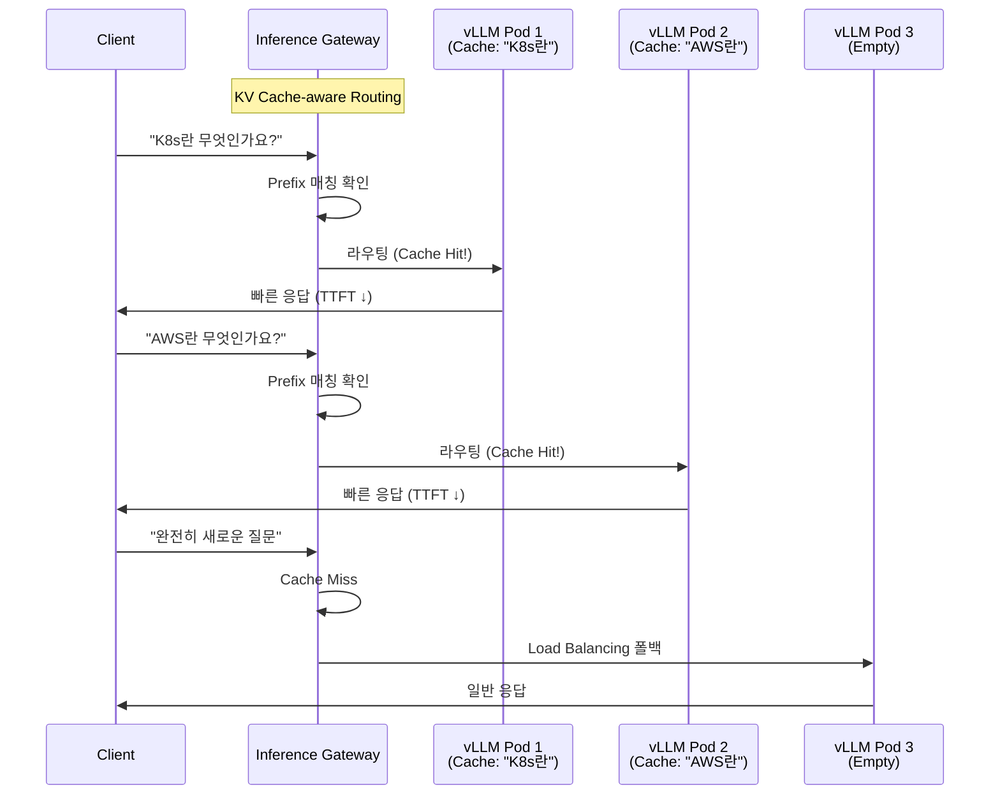

import { ComparisonTable, SpecificationTable } from '@site/src/components/tables';
import {
  WellLitPathTable,
  VllmComparisonTable,
  Qwen3SpecsTable,
  PrerequisitesTable,
  P5InstanceTable,
  P5eInstanceTable,
  GatewayCRDTable,
  DefaultDeploymentTable,
  KVCacheEffectsTable,
  MonitoringMetricsTable,
  ModelLoadingTable,
  CostOptimizationTable,
  TroubleshootingTable
} from '@site/src/components/LlmdTables';

# llm-d 기반 EKS Auto Mode 추론 배포 가이드

> **📌 현재 버전**: llm-d v0.4 (2025). 본 문서의 배포 예시는 Intelligent Inference Scheduling well-lit path 기준입니다.

> 📅 **작성일**: 2026-02-10 | **수정일**: 2026-02-14 | ⏱️ **읽는 시간**: 약 8분

## 개요

llm-d는 Red Hat이 주도하는 Apache 2.0 라이선스의 Kubernetes 네이티브 분산 추론 스택입니다. vLLM 추론 엔진, Envoy 기반 Inference Gateway, 그리고 Kubernetes Gateway API를 결합하여 대규모 언어 모델의 지능적인 추론 라우팅을 제공합니다.

기존 vLLM 배포가 단순한 Round-Robin 로드 밸런싱에 의존하는 반면, llm-d는 KV Cache 상태를 인식하는 지능적 라우팅을 통해 동일한 prefix를 가진 요청을 이미 해당 KV Cache를 보유한 Pod로 전달합니다. 이를 통해 Time To First Token(TTFT)을 크게 단축하고 GPU 연산을 절약할 수 있습니다.

본 문서에서는 Amazon EKS Auto Mode 환경에서 llm-d를 배포하고 Qwen3-32B 모델로 추론 서비스를 구성하는 전체 과정을 다룹니다. EKS Auto Mode는 Karpenter 기반 노드 자동 프로비저닝과 NVIDIA GPU 드라이버 자동 관리를 제공하여 GPU 인프라 구성의 복잡성을 크게 줄여줍니다.

:::warning llm-d Inference Gateway ≠ 범용 Gateway API 구현체
llm-d의 Envoy 기반 Inference Gateway는 **LLM 추론 요청 전용**으로 설계된 특수 목적 게이트웨이입니다. NGINX Ingress Controller를 대체하는 범용 Gateway API 구현체(AWS LBC v3, Cilium, Envoy Gateway 등)와는 **목적과 스코프가 다릅니다**.

- **llm-d Gateway**: InferenceModel/InferencePool CRD 기반, KV Cache-aware 라우팅, 추론 트래픽 전용
- **범용 Gateway API**: HTTPRoute/GRPCRoute 기반, TLS/인증/Rate Limiting, 클러스터 전체 트래픽 관리

프로덕션 환경에서는 범용 Gateway API 구현체가 클러스터 진입점을 담당하고, llm-d는 그 하위에서 AI 추론 트래픽을 최적화하는 구조를 권장합니다. 범용 Gateway API 구현체 선택은 [Gateway API 도입 가이드](/docs/infrastructure-optimization/gateway-api-adoption-guide)를 참조하세요.
:::

### 주요 목표

- **llm-d 아키텍처 이해**: Inference Gateway와 KV Cache-aware 라우팅의 동작 원리
- **EKS Auto Mode GPU 구성**: p5.48xlarge 노드 자동 프로비저닝 설정
- **Qwen3-32B 배포**: helmfile 기반 통합 배포 및 검증
- **추론 테스트**: OpenAI 호환 API를 통한 추론 요청 및 스트리밍
- **운영 최적화**: 모니터링, 비용 최적화, 트러블슈팅

### llm-d의 3가지 Well-Lit Path

llm-d는 세 가지 검증된 배포 경로를 제공합니다.

<WellLitPathTable />

---

## 아키텍처

llm-d의 Intelligent Inference Scheduling 아키텍처는 다음과 같이 구성됩니다.

```mermaid
flowchart TB
    subgraph "Client Layer"
        CLIENT[Client Application<br/>OpenAI Compatible API]
    end
    
    subgraph "Gateway Layer"
        GW[Inference Gateway<br/>Envoy-based]
        IM[InferenceModel CRD<br/>모델 ↔ Pool 매핑]
        IP[InferencePool CRD<br/>vLLM Pod 그룹 관리]
    end
    
    subgraph "Inference Layer"
        subgraph "vLLM Pod 1 — GPU 0,1"
            V1[vLLM Engine<br/>Qwen3-32B TP=2]
            KV1[KV Cache]
        end
        subgraph "vLLM Pod 2 — GPU 2,3"
            V2[vLLM Engine<br/>Qwen3-32B TP=2]
            KV2[KV Cache]
        end
        subgraph "vLLM Pod N — GPU 14,15"
            VN[vLLM Engine<br/>Qwen3-32B TP=2]
            KVN[KV Cache]
        end
    end
    
    subgraph "EKS Auto Mode"
        NP[Karpenter NodePool<br/>p5.48xlarge]
        NC[NodeClass default<br/>자동 GPU 드라이버]
    end
    
    CLIENT --> GW
    GW --> IM
    IM --> IP
    IP --> V1 & V2 & VN
    NP --> NC
    
    style CLIENT fill:#34a853,color:#fff
    style GW fill:#4286f4,color:#fff
    style NP fill:#fbbc04,color:#000
```



### llm-d vs 기존 vLLM 배포 비교

<VllmComparisonTable />

### Qwen3-32B 모델 선정 이유

<Qwen3SpecsTable />

:::info Qwen3-32B 선정 배경
Qwen3-32B는 llm-d의 공식 기본 모델이며, Apache 2.0 라이선스로 상업적 사용이 자유롭습니다. BF16 기준 약 65GB VRAM이 필요하여 TP=2 (2× GPU)로 H100 80GB에서 안정적으로 서빙할 수 있습니다.
:::

---

## 사전 요구사항

<PrerequisitesTable />

### 클라이언트 도구 설치

```bash
# eksctl 설치 (macOS)
brew install eksctl

# helmfile 설치
brew install helmfile

# yq 설치
brew install yq

# 버전 확인
eksctl version
kubectl version --client
helm version
helmfile --version
yq --version
```

:::warning p5.48xlarge 쿼터 확인
p5.48xlarge는 192 vCPU를 사용합니다. AWS Service Quotas에서 **Running On-Demand P instances** 한도가 최소 192 이상인지 확인하세요. 쿼터 증가 요청은 승인까지 1-3 영업일 소요될 수 있습니다.

```bash
# 현재 P 인스턴스 쿼터 확인
aws service-quotas get-service-quota \
  --service-code ec2 \
  --quota-code L-417A185B \
  --region us-west-2 \
  --query 'Quota.Value'
```

:::

---

## EKS Auto Mode 클러스터 생성

### 클러스터 구성 파일

```yaml
# cluster-config.yaml
apiVersion: eksctl.io/v1alpha5
kind: ClusterConfig
metadata:
  name: llm-d-cluster
  region: us-west-2
  version: "1.33"
autoModeConfig:
  enabled: true
```

```bash
# 클러스터 생성 (약 15-20분 소요)
eksctl create cluster -f cluster-config.yaml

# 클러스터 상태 확인
kubectl get nodes
kubectl cluster-info
```

### GPU NodePool 생성

EKS Auto Mode에서 p5.48xlarge 인스턴스를 자동 프로비저닝하기 위한 Karpenter NodePool을 생성합니다.

```yaml
# gpu-nodepool.yaml
apiVersion: karpenter.sh/v1
kind: NodePool
metadata:
  name: gpu-p5
spec:
  template:
    spec:
      requirements:
        - key: eks.amazonaws.com/instance-family
          operator: In
          values: ["p5"]
        - key: kubernetes.io/arch
          operator: In
          values: ["amd64"]
        - key: karpenter.sh/capacity-type
          operator: In
          values: ["on-demand"]
      nodeClassRef:
        group: eks.amazonaws.com
        kind: NodeClass
        name: default
      taints:
        - key: nvidia.com/gpu
          effect: NoSchedule
  limits:
    cpu: "384"
    memory: 4096Gi
    nvidia.com/gpu: "16"
  disruption:
    consolidationPolicy: WhenEmpty
    consolidateAfter: 30s
```

```bash
kubectl apply -f gpu-nodepool.yaml

# NodePool 상태 확인
kubectl get nodepool gpu-p5
```

:::info EKS Auto Mode의 GPU 지원
EKS Auto Mode는 NVIDIA GPU 드라이버를 자동으로 설치하고 관리합니다. 별도의 GPU Operator나 NVIDIA Device Plugin 설치가 필요 없습니다. NodeClass `default`를 사용하면 Auto Mode가 최적의 AMI와 드라이버 버전을 자동 선택합니다.
:::

### p5.48xlarge 인스턴스 사양

<P5InstanceTable />

### p5e.48xlarge 인스턴스 사양 (H200)

<P5eInstanceTable />

:::tip 인스턴스 선택 가이드
- **p5e.48xlarge (H200)**: 100B+ 파라미터 모델, 최대 메모리 활용
- **p5.48xlarge (H100)**: 70B+ 파라미터 모델, 최고 성능
- **g6e family (L40S)**: 13B-70B 모델, 비용 효율적 추론
:::

---

## llm-d 배포

### 5.1 네임스페이스 및 시크릿 생성

```bash
export NAMESPACE=llm-d
kubectl create namespace ${NAMESPACE}

# HuggingFace 토큰 시크릿 생성
kubectl create secret generic llm-d-hf-token \
  --from-literal=HF_TOKEN=<your-huggingface-token> \
  -n ${NAMESPACE}

# 시크릿 생성 확인
kubectl get secret llm-d-hf-token -n ${NAMESPACE}
```

### 5.2 llm-d 저장소 클론

```bash
git clone https://github.com/llm-d/llm-d.git
cd llm-d/guides/inference-scheduling
```

디렉토리 구조:

```
guides/inference-scheduling/
├── helmfile.yaml          # 통합 배포 정의
├── values/
│   ├── vllm-values.yaml   # vLLM 서버 설정
│   ├── gateway-values.yaml # Gateway 설정
│   └── ...
└── README.md
```

### 5.3 Gateway API CRD 설치

llm-d는 Kubernetes Gateway API와 Inference Extension CRD를 사용합니다.

```bash
# Gateway API 표준 CRD 설치 (v1.2.0+)
kubectl apply -f https://github.com/kubernetes-sigs/gateway-api/releases/download/v1.2.0/standard-install.yaml

# Inference Extension CRD 설치 (InferencePool, InferenceModel)
kubectl apply -f https://github.com/kubernetes-sigs/gateway-api-inference-extension/releases/download/v0.3.0/manifests.yaml
```

:::info Gateway API v1.2.0+ 기능
Gateway API v1.2.0은 다음과 같은 향상된 기능을 제공합니다:
- **HTTPRoute 개선**: 더 유연한 라우팅 규칙
- **GRPCRoute 안정화**: gRPC 서비스 라우팅 지원
- **BackendTLSPolicy**: 백엔드 TLS 설정 표준화
- **Kubernetes 1.33+ 통합**: Topology-aware routing 지원
:::

설치되는 CRD:

<GatewayCRDTable />

```bash
# CRD 설치 확인
kubectl get crd | grep -E "gateway|inference"
```

### 5.4 Gateway 컨트롤 플레인 설치

```bash
# Istio 기반 Gateway 컨트롤 플레인 설치
helmfile apply -n ${NAMESPACE} -l component=gateway-control-plane
```

### 5.5 llm-d 전체 배포

```bash
# 전체 컴포넌트 배포 (vLLM + Gateway + InferencePool + InferenceModel)
helmfile apply -n ${NAMESPACE}
```

기본 배포 구성:

<DefaultDeploymentTable />

:::tip 리소스 조정
기본 설정은 8 replicas × 2 GPU = 16 GPU를 사용합니다. 테스트 목적이라면 `helmfile.yaml`에서 `replicaCount`를 줄여 비용을 절감할 수 있습니다. 예를 들어 4 replicas로 설정하면 단일 p5.48xlarge (8 GPU)로 운영 가능합니다.
:::

### 5.6 배포 확인

```bash
# Helm 릴리즈 확인
helm list -n ${NAMESPACE}

# 전체 리소스 확인
kubectl get all -n ${NAMESPACE}

# InferencePool 상태 확인
kubectl get inferencepool -n ${NAMESPACE}

# InferenceModel 상태 확인
kubectl get inferencemodel -n ${NAMESPACE}

# vLLM Pod 상태 확인 (GPU 할당 포함)
kubectl get pods -n ${NAMESPACE} -o wide

# Pod가 Ready 상태가 될 때까지 대기 (모델 로딩에 5-10분 소요)
kubectl wait --for=condition=Ready pods -l app=vllm \
  -n ${NAMESPACE} --timeout=600s
```

:::warning 모델 로딩 시간
Qwen3-32B (BF16, ~65GB)는 HuggingFace Hub에서 최초 다운로드 시 네트워크 속도에 따라 10-20분이 소요될 수 있습니다. 이후 배포에서는 노드의 로컬 캐시를 활용하여 로딩 시간이 크게 단축됩니다.
:::

---

## 추론 요청 테스트

### 6.1 포트 포워딩

```bash
# Inference Gateway 포트 포워딩
kubectl port-forward svc/inference-gateway -n ${NAMESPACE} 8080:8080
```

### 6.2 curl 기본 테스트

```bash
curl -s http://localhost:8080/v1/chat/completions \
  -H "Content-Type: application/json" \
  -d '{
    "model": "Qwen/Qwen3-32B",
    "messages": [
      {
        "role": "user",
        "content": "Kubernetes란 무엇인가요? 간단히 설명해주세요."
      }
    ],
    "max_tokens": 256,
    "temperature": 0.7
  }' | jq .
```

예상 응답 구조:

```json
{
  "id": "chatcmpl-...",
  "object": "chat.completion",
  "model": "Qwen/Qwen3-32B",
  "choices": [
    {
      "index": 0,
      "message": {
        "role": "assistant",
        "content": "Kubernetes는 컨테이너화된 애플리케이션의 배포, 스케일링..."
      },
      "finish_reason": "stop"
    }
  ],
  "usage": {
    "prompt_tokens": 15,
    "completion_tokens": 128,
    "total_tokens": 143
  }
}
```

### 6.3 Python 클라이언트

```python
from openai import OpenAI

client = OpenAI(
    base_url="http://localhost:8080/v1",
    api_key="not-needed"  # llm-d는 별도 인증 불필요
)

response = client.chat.completions.create(
    model="Qwen/Qwen3-32B",
    messages=[
        {"role": "system", "content": "당신은 클라우드 네이티브 전문가입니다."},
        {"role": "user", "content": "EKS Auto Mode의 장점을 3가지 설명해주세요."}
    ],
    max_tokens=512,
    temperature=0.7
)
print(response.choices[0].message.content)
```

### 6.4 스트리밍 응답 테스트

```python
stream = client.chat.completions.create(
    model="Qwen/Qwen3-32B",
    messages=[
        {"role": "user", "content": "llm-d의 KV Cache-aware 라우팅이 어떻게 동작하나요?"}
    ],
    max_tokens=512,
    stream=True
)

for chunk in stream:
    if chunk.choices[0].delta.content:
        print(chunk.choices[0].delta.content, end="", flush=True)
print()
```

### 6.5 모델 목록 확인

```bash
curl -s http://localhost:8080/v1/models | jq .
```

:::info OpenAI 호환 API
llm-d는 OpenAI 호환 API를 제공합니다. 기존 OpenAI SDK를 사용하는 애플리케이션에서 `base_url`만 변경하면 바로 사용할 수 있습니다. `/v1/chat/completions`, `/v1/completions`, `/v1/models` 엔드포인트를 지원합니다.
:::

---

## KV Cache-aware 라우팅 이해

llm-d의 핵심 차별점은 KV Cache 상태를 인식하는 지능적 라우팅입니다.



### 라우팅 동작 원리

1. **요청 수신**: 클라이언트가 Inference Gateway로 추론 요청 전송
2. **Prefix 분석**: Gateway가 요청의 prompt prefix를 해시하여 식별
3. **Cache 조회**: 각 vLLM Pod의 KV Cache 상태를 확인하여 해당 prefix를 보유한 Pod 탐색
4. **지능적 라우팅**: Cache hit 시 해당 Pod로 라우팅, miss 시 부하 기반 로드 밸런싱
5. **응답 반환**: vLLM이 추론 결과를 Gateway를 통해 클라이언트에 반환

### KV Cache-aware 라우팅의 효과

<KVCacheEffectsTable />

:::tip Cache Hit Rate 극대화
동일한 시스템 프롬프트를 사용하는 애플리케이션에서 KV Cache-aware 라우팅의 효과가 극대화됩니다. 예를 들어 RAG 파이프라인에서 동일한 컨텍스트 문서를 반복 참조하는 경우, 해당 prefix의 KV Cache를 재사용하여 TTFT를 크게 단축할 수 있습니다.
:::

---

## 모니터링 및 검증

### 8.1 vLLM 메트릭 확인

```bash
# vLLM Pod의 메트릭 엔드포인트 접근
VLLM_POD=$(kubectl get pods -n ${NAMESPACE} -l app=vllm -o jsonpath='{.items[0].metadata.name}')
kubectl port-forward ${VLLM_POD} -n ${NAMESPACE} 9090:9090

# 메트릭 조회
curl -s http://localhost:9090/metrics | grep -E "vllm_"
```

### 주요 모니터링 메트릭

<MonitoringMetricsTable />

### 8.2 GPU 활용률 확인

```bash
# 특정 vLLM Pod에서 nvidia-smi 실행
kubectl exec -it ${VLLM_POD} -n ${NAMESPACE} -- nvidia-smi

# 실시간 GPU 모니터링 (1초 간격)
kubectl exec -it ${VLLM_POD} -n ${NAMESPACE} -- nvidia-smi dmon -s u -d 1
```

### 8.3 Gateway 로그 확인

```bash
# Inference Gateway 로그 확인
kubectl logs -f deployment/inference-gateway -n ${NAMESPACE}

# InferencePool 상태 상세 확인
kubectl describe inferencepool -n ${NAMESPACE}
```

### 8.4 Prometheus ServiceMonitor 구성

```yaml
apiVersion: monitoring.coreos.com/v1
kind: ServiceMonitor
metadata:
  name: llm-d-vllm-monitor
  namespace: monitoring
spec:
  selector:
    matchLabels:
      app: vllm
  endpoints:
    - port: metrics
      path: /metrics
      interval: 15s
  namespaceSelector:
    matchNames:
      - llm-d
```

---

## 운영 고려사항

### 9.1 S3 모델 캐싱

HuggingFace Hub에서 매번 모델을 다운로드하면 Cold Start 시간이 길어집니다. S3에 모델 가중치를 캐싱하여 로딩 시간을 단축할 수 있습니다.

```yaml
# vLLM 환경 변수에 S3 캐시 경로 추가
env:
  - name: VLLM_S3_MODEL_CACHE
    value: "s3://your-bucket/model-cache/qwen3-32b/"
```

<ModelLoadingTable />

### 9.2 HPA (Horizontal Pod Autoscaler) 구성

vLLM 대기 요청 수 기반으로 자동 스케일링을 구성할 수 있습니다.

```yaml
apiVersion: autoscaling/v2
kind: HorizontalPodAutoscaler
metadata:
  name: vllm-hpa
  namespace: llm-d
spec:
  scaleTargetRef:
    apiVersion: apps/v1
    kind: Deployment
    name: vllm-deployment
  minReplicas: 2
  maxReplicas: 8
  metrics:
    - type: Pods
      pods:
        metric:
          name: vllm_num_requests_waiting
        target:
          type: AverageValue
          averageValue: "5"
  behavior:
    scaleUp:
      stabilizationWindowSeconds: 60
      policies:
        - type: Pods
          value: 2
          periodSeconds: 120
    scaleDown:
      stabilizationWindowSeconds: 300
      policies:
        - type: Pods
          value: 1
          periodSeconds: 180
```

:::info HPA와 Karpenter 연동
HPA가 vLLM replica를 증가시키면, 추가 GPU가 필요한 경우 Karpenter가 자동으로 새로운 p5.48xlarge 노드를 프로비저닝합니다. EKS Auto Mode에서는 이 과정이 완전히 자동화됩니다.
:::

### 9.3 비용 최적화

<CostOptimizationTable />

:::warning 비용 주의
p5.48xlarge는 시간당 약 $98.32 (us-west-2 On-Demand 기준)입니다. 2대 운영 시 **월 약 $141,580**입니다. 테스트 완료 후 반드시 리소스를 정리하세요.

```bash
# 리소스 정리
helmfile destroy -n ${NAMESPACE}
kubectl delete namespace ${NAMESPACE}
kubectl delete nodepool gpu-p5

# 클러스터 삭제 (필요 시)
eksctl delete cluster --name llm-d-cluster --region us-west-2
```

:::

---

## 트러블슈팅

### 일반적인 문제와 해결 방법

<TroubleshootingTable />

### 디버깅 명령어 모음

```bash
# Pod 상태 및 이벤트 확인
kubectl describe pod <pod-name> -n llm-d

# vLLM 로그 확인 (최근 100줄)
kubectl logs <vllm-pod> -n llm-d --tail=100

# GPU 상태 확인
kubectl exec -it <vllm-pod> -n llm-d -- nvidia-smi

# InferencePool 상태 상세 확인
kubectl describe inferencepool -n llm-d

# InferenceModel 상태 확인
kubectl describe inferencemodel -n llm-d

# Gateway 로그 확인
kubectl logs -f deployment/inference-gateway -n llm-d

# 노드 GPU 리소스 확인
kubectl get nodes -o custom-columns=\
  NAME:.metadata.name,\
  GPU:.status.allocatable.nvidia\\.com/gpu,\
  STATUS:.status.conditions[-1].type

# Karpenter 로그 확인 (노드 프로비저닝 문제)
kubectl logs -f deployment/karpenter -n kube-system
```

:::tip NCCL 디버깅
멀티 GPU 통신 문제가 발생하면 다음 환경 변수를 추가하여 상세 로그를 확인하세요:

```yaml
env:
  - name: NCCL_DEBUG
    value: "INFO"
  - name: NCCL_DEBUG_SUBSYS
    value: "ALL"
```

:::

---

## 다음 단계

본 가이드에서는 llm-d의 Intelligent Inference Scheduling path를 다루었습니다. 다음 단계로 고급 기능을 탐색할 수 있습니다.

- **Prefill/Decode Disaggregation**: Prefill과 Decode 단계를 별도 Pod 그룹으로 분리하여 대규모 배치 처리와 긴 컨텍스트 워크로드의 처리량을 극대화
- **Expert Parallelism**: MoE 모델(Mixtral, DeepSeek 등)의 Expert를 여러 노드에 분산하여 초대규모 모델 서빙
- **LoRA 어댑터 핫스왑**: 단일 기본 모델에 여러 LoRA 어댑터를 동적으로 로드/언로드하여 다중 태스크 서빙
- **Prometheus + Grafana 대시보드**: vLLM 메트릭 기반 실시간 모니터링 대시보드 구성
- **멀티 모델 서빙**: 하나의 llm-d 클러스터에서 여러 모델을 InferenceModel CRD로 동시 서빙

### 관련 문서

- [vLLM 기반 FM 배포 및 성능 최적화](./vllm-model-serving.md) — vLLM 기본 개념 및 배포
- [MoE 모델 서빙 가이드](./moe-model-serving.md) — Mixture of Experts 모델 서빙
- [Inference Gateway 및 동적 라우팅](../gateway-agents/inference-gateway-routing.md) — 추론 라우팅 전략
- [GPU 리소스 관리](./gpu-resource-management.md) — GPU 클러스터 리소스 관리

---

## 참고 자료

- [llm-d GitHub](https://github.com/llm-d/llm-d)
- [llm-d Deployer (Helm Charts)](https://github.com/llm-d/llm-d-deployer)
- [EKS Auto Mode 문서](https://docs.aws.amazon.com/eks/latest/userguide/automode.html)
- [Gateway API Inference Extension](https://gateway-api.sigs.k8s.io/geps/gep-3567/)
- [vLLM 공식 문서](https://docs.vllm.ai/)
- [Qwen3-32B HuggingFace](https://huggingface.co/Qwen/Qwen3-32B)
- [Kubernetes Gateway API v1.4](https://gateway-api.sigs.k8s.io/)
