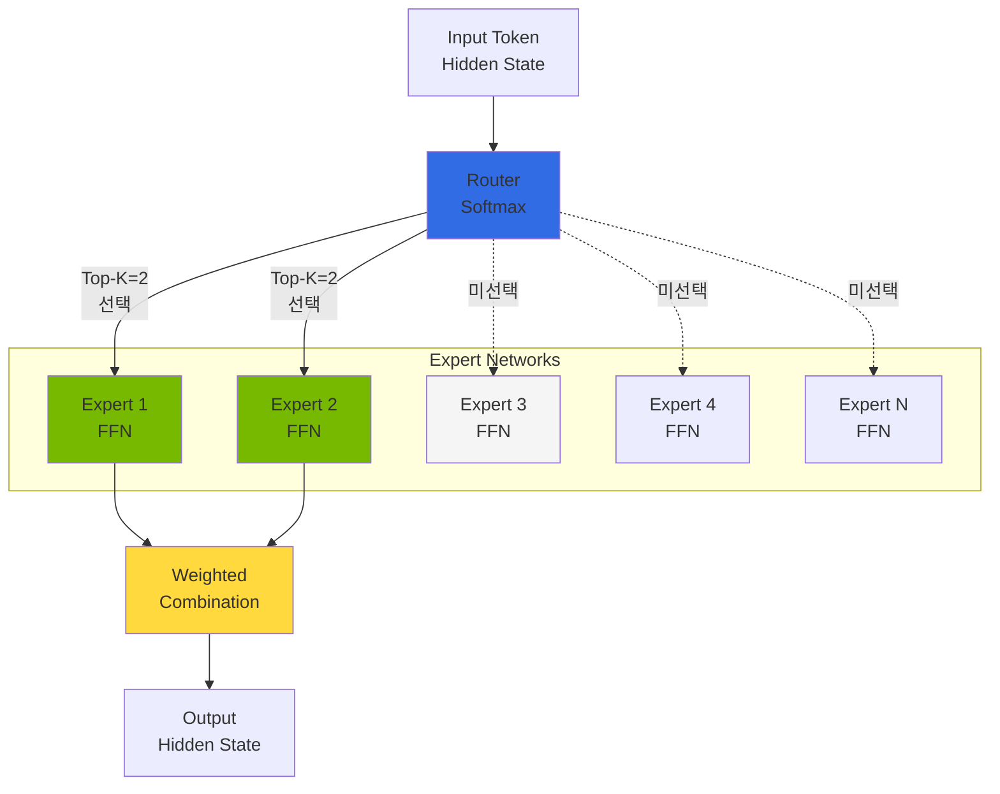
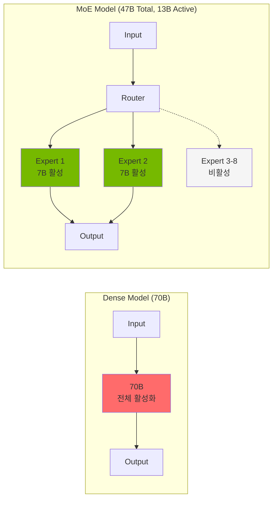
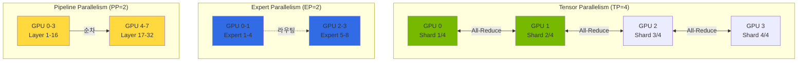
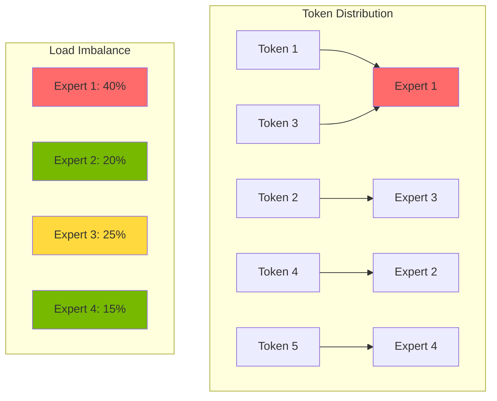
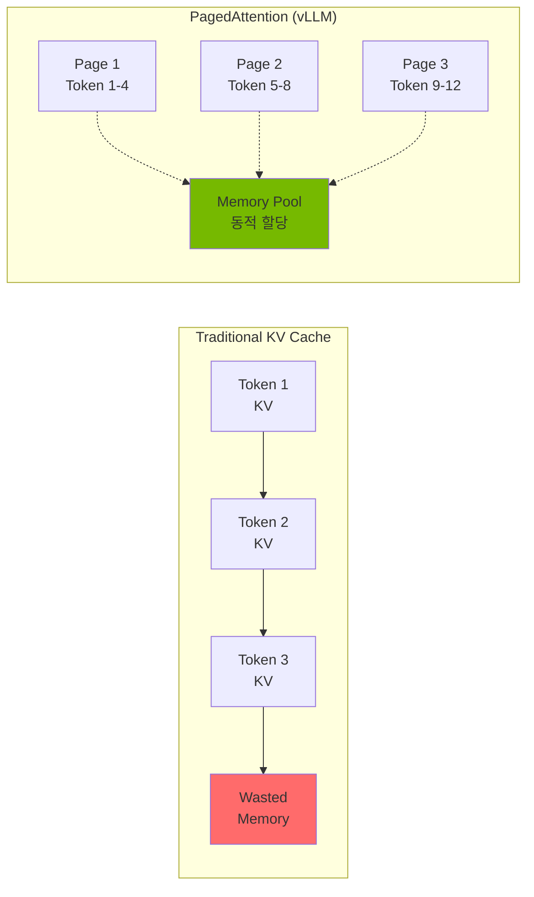
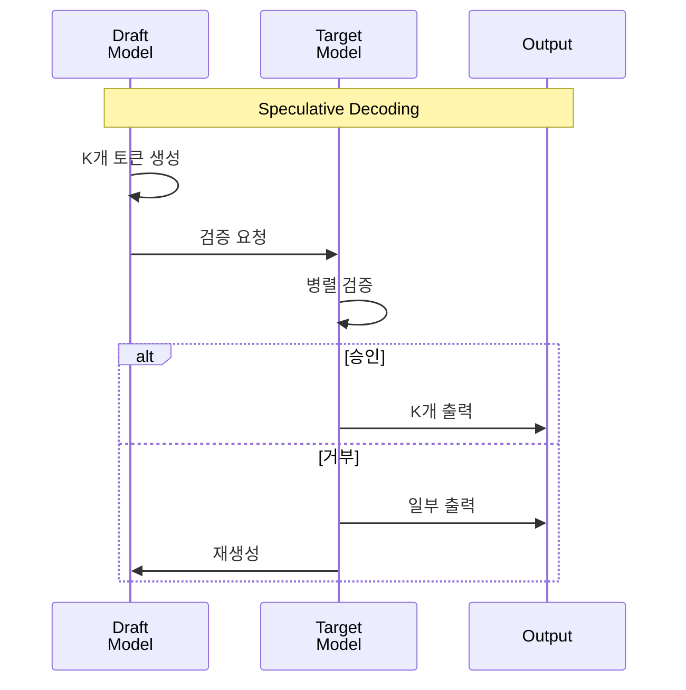

import { RoutingMechanisms, MoeVsDense, GpuMemoryRequirements, ParallelizationStrategies, TensorParallelismConfig, VllmVsTgi, KvCacheConfig, BatchOptimization, MonitoringMetrics, GpuVsTrainium2 } from '@site/src/components/MoeModelTables';

# MoE 모델 서빙 가이드

> **📌 현재 버전**: vLLM v0.6.3 / v0.7.x (2025-02 안정 버전), TGI 3.3.5 (Legacy - 참고용). 본 문서의 배포 예시는 최신 안정 버전 기준입니다.

> 📅 **작성일**: 2025-02-09 | **수정일**: 2026-03-17 | ⏱️ **읽는 시간**: 약 9분

## 개요

Mixture of Experts(MoE) 모델은 대규모 언어 모델의 효율성을 극대화하는 혁신적인 아키텍처입니다. 이 문서에서는 Amazon EKS 환경에서 Mixtral, DeepSeek-MoE, Qwen-MoE 등의 MoE 모델을 효율적으로 배포하고 운영하는 방법을 다룹니다.

### 주요 목표

- **MoE 아키텍처 이해**: Expert 네트워크와 라우팅 메커니즘의 동작 원리
- **효율적인 배포**: vLLM을 활용한 최적화된 MoE 모델 서빙 (TGI는 Legacy 참고용)
- **리소스 최적화**: GPU 메모리 관리 및 분산 배포 전략
- **성능 튜닝**: KV Cache, Speculative Decoding 등 고급 최적화 기법

---

## MoE 아키텍처 이해

### Expert 네트워크 구조

MoE 모델은 여러 개의 "Expert" 네트워크와 이를 선택하는 "Router(Gate)" 네트워크로 구성됩니다.



### 라우팅 메커니즘

MoE 모델의 핵심은 입력 토큰에 따라 적절한 Expert를 선택하는 라우팅 메커니즘입니다.

<RoutingMechanisms />

:::info 라우팅 동작 원리

1. **Gate 계산**: 입력 토큰의 hidden state를 Gate 네트워크에 통과
2. **Expert 선택**: Softmax 출력에서 Top-K Expert 선택
3. **병렬 처리**: 선택된 Expert들이 병렬로 입력 처리
4. **가중 합산**: Expert 출력을 Gate 가중치로 결합

:::

### MoE vs Dense 모델 비교

<MoeVsDense />



:::tip MoE 모델의 장점

- **연산 효율성**: 전체 파라미터의 일부만 활성화하여 추론 속도 향상
- **확장성**: Expert 추가로 모델 용량 확장 가능
- **전문화**: 각 Expert가 특정 도메인/태스크에 특화

:::

---

## MoE 모델 서빙 고려사항

### GPU 메모리 요구사항

MoE 모델은 활성화되는 파라미터는 적지만, 전체 Expert를 메모리에 로드해야 합니다.

<GpuMemoryRequirements />

:::info 최신 MoE 모델 메모리 최적화

**DeepSeek-V3**: Multi-head Latent Attention (MLA) 아키텍처를 사용하여 KV 캐시 메모리를 크게 절감합니다. 전통적인 MHA(Multi-Head Attention) 대비 약 40% 메모리 절감 효과가 있어, 실제 메모리 요구량은 표기된 값보다 낮을 수 있습니다.

**GLM-5** (2026년 2월 출시): 744B 총 파라미터 / 40B 활성, 256개 experts 중 8개 활성화. SWE-bench Verified 77.8%, Agentic Coding #1 (55.00), MIT 라이선스. FP8 양자화 버전은 ~744GB VRAM 필요 (2× p5.48xlarge, PP=2). HuggingFace: `zai-org/GLM-5-FP8`

**Kimi K2.5** (2026년 1월 출시): ~1T 총 파라미터 / 32B 활성, Modified DeepSeek V3 MoE 아키텍처. SWE-bench Verified 76.8%, HumanEval 99%, Agent Swarm 지원. INT4 양자화 버전은 ~500GB VRAM (1× p5.48xlarge, TP=8). HuggingFace: `moonshotai/Kimi-K2.5`

정확한 메모리 요구량은 배치 크기와 시퀀스 길이에 따라 달라지므로 프로파일링을 권장합니다.
:::

:::warning 메모리 계산 시 주의사항

- **KV Cache**: 배치 크기와 시퀀스 길이에 따라 추가 메모리 필요
- **Activation Memory**: 추론 중 중간 활성화 값 저장 공간
- **CUDA Context**: GPU당 약 1-2GB의 CUDA 오버헤드
- **Safety Margin**: 실제 운영 시 10-20% 여유 공간 확보 권장

:::

### 분산 배포 전략

대규모 MoE 모델은 단일 GPU에 로드할 수 없어 분산 배포가 필수입니다.



<ParallelizationStrategies />

### Expert 활성화 패턴

MoE 모델의 성능 최적화를 위해 Expert 활성화 패턴을 이해해야 합니다.



:::info Expert 로드 밸런싱

- **Auxiliary Loss**: 학습 시 Expert 간 균등 분배를 유도하는 보조 손실
- **Capacity Factor**: Expert당 처리 가능한 최대 토큰 수 제한
- **Token Dropping**: 용량 초과 시 토큰 드롭 (추론 시 비활성화 권장)

:::

---

## vLLM 기반 MoE 배포

### vLLM MoE 지원 기능

vLLM v0.6+ 버전은 MoE 모델에 대해 다음과 같은 최적화를 제공합니다:

- **Expert Parallelism**: 다중 GPU에 Expert 분산
- **Tensor Parallelism**: 레이어 내 텐서 분할
- **PagedAttention**: 효율적인 KV Cache 관리
- **Continuous Batching**: 동적 배치 처리
- **FP8 KV Cache**: 2배 메모리 절감 (v0.6+)
- **Improved Prefix Caching**: 400%+ 처리량 향상 (v0.6+)
- **Multi-LoRA Serving**: 단일 기본 모델에서 여러 LoRA 어댑터 동시 서빙 (v0.6+)
- **GGUF Quantization**: GGUF 형식 양자화 모델 지원 (v0.6+)

### Mixtral 8x7B Deployment YAML

```yaml
apiVersion: apps/v1
kind: Deployment
metadata:
  name: mixtral-8x7b-vllm
  namespace: inference
  labels:
    app: mixtral-8x7b
    serving-engine: vllm
spec:
  replicas: 1
  selector:
    matchLabels:
      app: mixtral-8x7b
  template:
    metadata:
      labels:
        app: mixtral-8x7b
        serving-engine: vllm
    spec:
      nodeSelector:
        node.kubernetes.io/instance-type: p4d.24xlarge
      tolerations:
        - key: nvidia.com/gpu
          operator: Exists
          effect: NoSchedule
      containers:
        - name: vllm
          image: vllm/vllm-openai:v0.6.3
          ports:
            - name: http
              containerPort: 8000
              protocol: TCP
          env:
            - name: HUGGING_FACE_HUB_TOKEN
              valueFrom:
                secretKeyRef:
                  name: hf-token
                  key: token
            - name: VLLM_ATTENTION_BACKEND
              value: "FLASH_ATTN"
          args:
            - "--model"
            - "mistralai/Mixtral-8x7B-Instruct-v0.1"
            - "--tensor-parallel-size"
            - "2"
            - "--max-model-len"
            - "32768"
            - "--gpu-memory-utilization"
            - "0.90"
            - "--enable-chunked-prefill"
            - "--max-num-batched-tokens"
            - "32768"
            - "--enable-prefix-caching"
            - "--kv-cache-dtype"
            - "fp8"
            - "--trust-remote-code"
            - "--dtype"
            - "bfloat16"
          resources:
            requests:
              nvidia.com/gpu: 2
              memory: "180Gi"
              cpu: "24"
            limits:
              nvidia.com/gpu: 2
              memory: "200Gi"
              cpu: "32"
          volumeMounts:
            - name: model-cache
              mountPath: /root/.cache/huggingface
            - name: shm
              mountPath: /dev/shm
          livenessProbe:
            httpGet:
              path: /health
              port: 8000
            initialDelaySeconds: 300
            periodSeconds: 30
            timeoutSeconds: 10
          readinessProbe:
            httpGet:
              path: /health
              port: 8000
            initialDelaySeconds: 120
            periodSeconds: 10
            timeoutSeconds: 5
      volumes:
        - name: model-cache
          persistentVolumeClaim:
            claimName: model-cache-pvc
        - name: shm
          emptyDir:
            medium: Memory
            sizeLimit: 16Gi
      terminationGracePeriodSeconds: 120
```

### Mixtral 8x22B 대규모 배포 (4 GPU)

```yaml
apiVersion: apps/v1
kind: Deployment
metadata:
  name: mixtral-8x22b-vllm
  namespace: inference
  labels:
    app: mixtral-8x22b
    serving-engine: vllm
spec:
  replicas: 1
  selector:
    matchLabels:
      app: mixtral-8x22b
  template:
    metadata:
      labels:
        app: mixtral-8x22b
        serving-engine: vllm
    spec:
      nodeSelector:
        node.kubernetes.io/instance-type: p5.48xlarge
      tolerations:
        - key: nvidia.com/gpu
          operator: Exists
          effect: NoSchedule
      containers:
        - name: vllm
          image: vllm/vllm-openai:v0.6.3
          ports:
            - name: http
              containerPort: 8000
          env:
            - name: HUGGING_FACE_HUB_TOKEN
              valueFrom:
                secretKeyRef:
                  name: hf-token
                  key: token
            - name: NCCL_DEBUG
              value: "INFO"
            - name: NCCL_IB_DISABLE
              value: "0"
          args:
            - "--model"
            - "mistralai/Mixtral-8x22B-Instruct-v0.1"
            - "--tensor-parallel-size"
            - "4"
            - "--max-model-len"
            - "65536"
            - "--gpu-memory-utilization"
            - "0.92"
            - "--enable-chunked-prefill"
            - "--max-num-batched-tokens"
            - "65536"
            - "--enable-prefix-caching"
            - "--kv-cache-dtype"
            - "fp8"
            - "--dtype"
            - "bfloat16"
            - "--enforce-eager"
          resources:
            requests:
              nvidia.com/gpu: 4
              memory: "400Gi"
              cpu: "48"
            limits:
              nvidia.com/gpu: 4
              memory: "500Gi"
              cpu: "64"
          volumeMounts:
            - name: model-cache
              mountPath: /root/.cache/huggingface
            - name: shm
              mountPath: /dev/shm
      volumes:
        - name: model-cache
          persistentVolumeClaim:
            claimName: model-cache-pvc
        - name: shm
          emptyDir:
            medium: Memory
            sizeLimit: 32Gi
```

### vLLM 텐서 병렬화 설정

텐서 병렬화(Tensor Parallelism)는 모델의 각 레이어를 여러 GPU에 분할합니다.

<TensorParallelismConfig />

:::tip 텐서 병렬화 최적화

- **NVLink 활용**: GPU 간 고속 통신을 위해 NVLink 지원 인스턴스 사용
- **TP 크기 선택**: 모델 크기와 GPU 메모리에 따라 최소 TP 크기 선택
- **통신 오버헤드**: TP 크기가 클수록 All-Reduce 통신 증가

:::

### vLLM Expert 병렬화 설정

Expert 병렬화(Expert Parallelism)는 MoE 모델의 Expert를 여러 GPU에 분산합니다.

```yaml
# Expert Parallelism 활성화 예제
args:
  - "--model"
  - "mistralai/Mixtral-8x7B-Instruct-v0.1"
  - "--tensor-parallel-size"
  - "2"
  # Expert Parallelism은 vLLM에서 자동으로 최적화됨
  # TP 내에서 Expert가 분산 배치됨
  - "--distributed-executor-backend"
  - "ray"  # 또는 "mp" (multiprocessing)
```

### 700B+ MoE 모델 멀티노드 배포 (GLM-5, Kimi K2.5)

GLM-5, Kimi K2.5와 같은 700B+ MoE 모델은 단일 노드에 로드할 수 없어 멀티노드 배포가 필수입니다. vLLM v0.6+에서는 **LeaderWorkerSet(LWS)** 기반 멀티노드 배포를 지원하며, Ray 없이도 Kubernetes 네이티브 방식으로 배포할 수 있습니다.

#### GLM-5 FP8 멀티노드 배포 (LeaderWorkerSet)

```yaml
apiVersion: leaderworkerset.x-k8s.io/v1
kind: LeaderWorkerSet
metadata:
  name: glm5-fp8-multinode
  namespace: inference
spec:
  replicas: 2  # 2개의 p5.48xlarge 노드
  leaderWorkerTemplate:
    leaderTemplate:
      metadata:
        labels:
          app: glm5-fp8
          role: leader
      spec:
        nodeSelector:
          node.kubernetes.io/instance-type: p5.48xlarge
        tolerations:
          - key: nvidia.com/gpu
            operator: Exists
            effect: NoSchedule
        containers:
          - name: vllm
            image: vllm/vllm-openai:v0.7.0
            ports:
              - name: http
                containerPort: 8000
            env:
              - name: HUGGING_FACE_HUB_TOKEN
                valueFrom:
                  secretKeyRef:
                    name: hf-token
                    key: token
              - name: NCCL_DEBUG
                value: "INFO"
              - name: NCCL_SOCKET_IFNAME
                value: "eth0"
            args:
              - "--model"
              - "zai-org/GLM-5-FP8"
              - "--tensor-parallel-size"
              - "8"
              - "--pipeline-parallel-size"
              - "2"
              - "--max-model-len"
              - "200000"
              - "--gpu-memory-utilization"
              - "0.92"
              - "--enable-chunked-prefill"
              - "--enable-prefix-caching"
              - "--kv-cache-dtype"
              - "fp8"
              - "--dtype"
              - "fp8"
              - "--distributed-executor-backend"
              - "mp"  # Multiprocessing (LWS 네이티브)
            resources:
              requests:
                nvidia.com/gpu: 8
                memory: "800Gi"
                cpu: "96"
              limits:
                nvidia.com/gpu: 8
                memory: "1000Gi"
                cpu: "192"
            volumeMounts:
              - name: model-cache
                mountPath: /root/.cache/huggingface
              - name: shm
                mountPath: /dev/shm
        volumes:
          - name: model-cache
            persistentVolumeClaim:
              claimName: model-cache-pvc
          - name: shm
            emptyDir:
              medium: Memory
              sizeLimit: 64Gi
    workerTemplate:
      metadata:
        labels:
          app: glm5-fp8
          role: worker
      spec:
        # Worker 스펙은 Leader와 동일
        nodeSelector:
          node.kubernetes.io/instance-type: p5.48xlarge
        tolerations:
          - key: nvidia.com/gpu
            operator: Exists
            effect: NoSchedule
        containers:
          - name: vllm-worker
            image: vllm/vllm-openai:v0.7.0
            env:
              - name: HUGGING_FACE_HUB_TOKEN
                valueFrom:
                  secretKeyRef:
                    name: hf-token
                    key: token
              - name: NCCL_DEBUG
                value: "INFO"
            resources:
              requests:
                nvidia.com/gpu: 8
                memory: "800Gi"
                cpu: "96"
              limits:
                nvidia.com/gpu: 8
                memory: "1000Gi"
                cpu: "192"
```

#### Kimi K2.5 INT4 단일노드 배포

Kimi K2.5는 INT4 양자화를 사용하면 단일 p5.48xlarge 노드에 배포 가능합니다.

```yaml
apiVersion: apps/v1
kind: Deployment
metadata:
  name: kimi-k25-int4
  namespace: inference
spec:
  replicas: 1
  selector:
    matchLabels:
      app: kimi-k25
  template:
    metadata:
      labels:
        app: kimi-k25
    spec:
      nodeSelector:
        node.kubernetes.io/instance-type: p5.48xlarge
      tolerations:
        - key: nvidia.com/gpu
          operator: Exists
          effect: NoSchedule
      containers:
        - name: vllm
          image: vllm/vllm-openai:v0.7.0
          ports:
            - name: http
              containerPort: 8000
          env:
            - name: HUGGING_FACE_HUB_TOKEN
              valueFrom:
                secretKeyRef:
                  name: hf-token
                  key: token
          args:
            - "--model"
            - "moonshotai/Kimi-K2.5"
            - "--quantization"
            - "awq"  # 또는 "gptq"
            - "--tensor-parallel-size"
            - "8"
            - "--max-model-len"
            - "256000"
            - "--gpu-memory-utilization"
            - "0.90"
            - "--enable-chunked-prefill"
            - "--enable-prefix-caching"
            - "--dtype"
            - "auto"
          resources:
            requests:
              nvidia.com/gpu: 8
              memory: "600Gi"
              cpu: "96"
            limits:
              nvidia.com/gpu: 8
              memory: "800Gi"
              cpu: "192"
          volumeMounts:
            - name: model-cache
              mountPath: /root/.cache/huggingface
            - name: shm
              mountPath: /dev/shm
      volumes:
        - name: model-cache
          persistentVolumeClaim:
            claimName: model-cache-pvc
        - name: shm
          emptyDir:
            medium: Memory
            sizeLimit: 64Gi
```

:::tip 700B+ MoE 모델 배포 권장사항

- **LeaderWorkerSet 사용**: Ray 의존성 없이 Kubernetes 네이티브 멀티노드 배포
- **Pipeline Parallelism**: PP=2 이상으로 레이어를 노드 간 분할
- **FP8 양자화**: 메모리 절감 (GLM-5 FP8 버전 권장)
- **Network 최적화**: NCCL 설정으로 노드 간 통신 최적화 (`NCCL_DEBUG=INFO`)
- **INT4/AWQ 양자화**: 단일 노드 배포가 가능한 경우 고려 (Kimi K2.5)

:::

:::warning 멀티노드 배포 주의사항

- **네트워크 대역폭**: 노드 간 All-Reduce 통신으로 인한 오버헤드 (EFA 권장)
- **로딩 시간**: 700B+ 모델은 초기 로딩에 20-30분 소요 가능
- **메모리 여유**: Safety margin 10-15% 확보 필요
- **LeaderWorkerSet CRD**: 클러스터에 LWS Operator 설치 필요

:::

---

## TGI 기반 MoE 배포

:::warning Legacy - TGI 기반 배포 (참고용)

**TGI 유지보수 모드 - 신규 배포 비권장**: Text Generation Inference(TGI)는 2025년부터 유지보수 모드에 진입했습니다. Hugging Face는 향후 vLLM, SGLang 등 다운스트림 추론 엔진 사용을 권장합니다. **신규 배포에는 vLLM을 사용하세요.** 기존 TGI 배포는 계속 동작하지만, 새로운 기능 업데이트나 최적화는 제공되지 않습니다.

### TGI에서 vLLM으로 마이그레이션

TGI를 사용 중이라면 다음 단계로 vLLM으로 마이그레이션할 수 있습니다:

1. **API 호환성**: vLLM은 OpenAI 호환 API를 제공하므로 클라이언트 코드 변경 최소화
2. **환경 변수 매핑**:
   - TGI `MODEL_ID` → vLLM `--model`
   - TGI `NUM_SHARD` → vLLM `--tensor-parallel-size`
   - TGI `MAX_TOTAL_TOKENS` → vLLM `--max-model-len`
3. **성능 향상**: vLLM의 PagedAttention과 Continuous Batching으로 2-3배 처리량 향상
4. **최신 기능**: FP8 KV Cache, Prefix Caching, Multi-LoRA 등 최신 최적화 기법 활용

### TGI MoE 지원 기능 (Legacy)

Text Generation Inference(TGI)는 Hugging Face에서 개발한 고성능 추론 서버입니다.

- **Flash Attention 2**: 메모리 효율적인 어텐션 연산
- **Paged Attention**: 동적 KV Cache 관리
- **Tensor Parallelism**: 다중 GPU 분산 추론
- **Quantization**: AWQ, GPTQ, EETQ 지원

### TGI Mixtral 8x7B Deployment YAML

```yaml
apiVersion: apps/v1
kind: Deployment
metadata:
  name: mixtral-8x7b-tgi
  namespace: inference
  labels:
    app: mixtral-8x7b
    serving-engine: tgi
spec:
  replicas: 1
  selector:
    matchLabels:
      app: mixtral-8x7b-tgi
  template:
    metadata:
      labels:
        app: mixtral-8x7b-tgi
        serving-engine: tgi
    spec:
      nodeSelector:
        node.kubernetes.io/instance-type: p4d.24xlarge
      tolerations:
        - key: nvidia.com/gpu
          operator: Exists
          effect: NoSchedule
      containers:
        - name: tgi
          image: ghcr.io/huggingface/text-generation-inference:3.3.5
          ports:
            - name: http
              containerPort: 8080
              protocol: TCP
          env:
            - name: HUGGING_FACE_HUB_TOKEN
              valueFrom:
                secretKeyRef:
                  name: hf-token
                  key: token
            - name: MODEL_ID
              value: "mistralai/Mixtral-8x7B-Instruct-v0.1"
            - name: NUM_SHARD
              value: "2"
            - name: MAX_INPUT_LENGTH
              value: "8192"
            - name: MAX_TOTAL_TOKENS
              value: "32768"
            - name: MAX_BATCH_PREFILL_TOKENS
              value: "32768"
            - name: DTYPE
              value: "bfloat16"
            - name: QUANTIZE
              value: ""  # 또는 "awq", "gptq"
            - name: TRUST_REMOTE_CODE
              value: "true"
          resources:
            requests:
              nvidia.com/gpu: 2
              memory: "180Gi"
              cpu: "24"
            limits:
              nvidia.com/gpu: 2
              memory: "200Gi"
              cpu: "32"
          volumeMounts:
            - name: model-cache
              mountPath: /data
            - name: shm
              mountPath: /dev/shm
          livenessProbe:
            httpGet:
              path: /health
              port: 8080
            initialDelaySeconds: 300
            periodSeconds: 30
          readinessProbe:
            httpGet:
              path: /health
              port: 8080
            initialDelaySeconds: 120
            periodSeconds: 10
      volumes:
        - name: model-cache
          persistentVolumeClaim:
            claimName: model-cache-pvc
        - name: shm
          emptyDir:
            medium: Memory
            sizeLimit: 16Gi
```

### TGI 양자화 배포 (AWQ)

메모리 효율을 위해 AWQ 양자화된 모델을 사용할 수 있습니다.

```yaml
apiVersion: apps/v1
kind: Deployment
metadata:
  name: mixtral-8x7b-tgi-awq
  namespace: inference
spec:
  replicas: 1
  selector:
    matchLabels:
      app: mixtral-8x7b-tgi-awq
  template:
    metadata:
      labels:
        app: mixtral-8x7b-tgi-awq
    spec:
      nodeSelector:
        node.kubernetes.io/instance-type: g5.48xlarge
      tolerations:
        - key: nvidia.com/gpu
          operator: Exists
          effect: NoSchedule
      containers:
        - name: tgi
          image: ghcr.io/huggingface/text-generation-inference:3.3.5
          ports:
            - name: http
              containerPort: 8080
          env:
            - name: HUGGING_FACE_HUB_TOKEN
              valueFrom:
                secretKeyRef:
                  name: hf-token
                  key: token
            - name: MODEL_ID
              value: "TheBloke/Mixtral-8x7B-Instruct-v0.1-AWQ"
            - name: NUM_SHARD
              value: "2"
            - name: MAX_INPUT_LENGTH
              value: "8192"
            - name: MAX_TOTAL_TOKENS
              value: "16384"
            - name: QUANTIZE
              value: "awq"
          resources:
            requests:
              nvidia.com/gpu: 2
              memory: "90Gi"
              cpu: "16"
            limits:
              nvidia.com/gpu: 2
              memory: "120Gi"
              cpu: "24"
```

### vLLM vs TGI 성능 비교

<VllmVsTgi />

:::

---

## AWS Trainium2 기반 MoE 배포

### Trainium2 개요

AWS Trainium2는 AWS가 설계한 2세대 ML 가속기로, 대규모 언어 모델 추론에 최적화되어 있습니다. GPU 대비 비용 효율적인 추론을 제공하며, NeuronX SDK를 통해 PyTorch 모델을 쉽게 배포할 수 있습니다.

**주요 특징:**
- **고성능**: 단일 trn2.48xlarge 인스턴스에서 Llama 3.1 405B 추론 가능
- **비용 효율**: GPU 대비 최대 50% 비용 절감
- **NeuronX SDK**: PyTorch 2.5+ 지원, 최소 코드 변경으로 모델 온보딩
- **NxD Inference**: 대규모 LLM 배포를 단순화하는 PyTorch 기반 라이브러리
- **FP8 양자화**: 메모리 효율성 향상
- **Flash Decoding**: Speculative Decoding 지원

### Trainium2 인스턴스 타입 및 비용 비교

<GpuVsTrainium2 />

### NeuronX SDK 설치

```bash
# Neuron SDK 2.21+ 설치
pip install neuronx-cc==2.* torch-neuronx torchvision

# NxD Inference 라이브러리 설치
pip install neuronx-distributed-inference

# Transformers NeuronX 설치
pip install transformers-neuronx
```

### Mixtral 8x7B Trainium2 배포

```yaml
apiVersion: apps/v1
kind: Deployment
metadata:
  name: mixtral-8x7b-trainium2
  namespace: inference
  labels:
    app: mixtral-8x7b
    accelerator: trainium2
spec:
  replicas: 1
  selector:
    matchLabels:
      app: mixtral-8x7b-trainium2
  template:
    metadata:
      labels:
        app: mixtral-8x7b-trainium2
    spec:
      nodeSelector:
        node.kubernetes.io/instance-type: trn2.48xlarge
      tolerations:
        - key: aws.amazon.com/neuron
          operator: Exists
          effect: NoSchedule
      containers:
        - name: neuron-inference
          image: public.ecr.aws/neuron/pytorch-inference-neuronx:2.1.2-neuronx-py310-sdk2.21.0-ubuntu20.04
          ports:
            - name: http
              containerPort: 8000
          env:
            - name: HUGGING_FACE_HUB_TOKEN
              valueFrom:
                secretKeyRef:
                  name: hf-token
                  key: token
            - name: NEURON_RT_NUM_CORES
              value: "16"
            - name: NEURON_CC_FLAGS
              value: "--model-type=transformer"
          command:
            - python
            - -m
            - neuronx_distributed_inference.serve
          args:
            - --model_id
            - mistralai/Mixtral-8x7B-Instruct-v0.1
            - --batch_size
            - "4"
            - --sequence_length
            - "2048"
            - --tp_degree
            - "8"
            - --amp
            - "fp16"
          resources:
            requests:
              aws.amazon.com/neuron: 16
              memory: "400Gi"
              cpu: "96"
            limits:
              aws.amazon.com/neuron: 16
              memory: "480Gi"
              cpu: "128"
          volumeMounts:
            - name: model-cache
              mountPath: /root/.cache/huggingface
            - name: neuron-cache
              mountPath: /var/tmp/neuron-compile-cache
      volumes:
        - name: model-cache
          persistentVolumeClaim:
            claimName: model-cache-pvc
        - name: neuron-cache
          emptyDir:
            sizeLimit: 50Gi
```

### NxD Inference Python 예제

```python
# neuron_inference.py
import torch
from transformers import AutoTokenizer
from neuronx_distributed_inference import NxDInference

# 모델 및 토크나이저 로드
model_id = "mistralai/Mixtral-8x7B-Instruct-v0.1"
tokenizer = AutoTokenizer.from_pretrained(model_id)

# NxD Inference 초기화
nxd_model = NxDInference(
    model_id=model_id,
    tp_degree=8,  # Tensor Parallelism
    batch_size=4,
    sequence_length=2048,
    amp="fp16",
    neuron_config={
        "enable_bucketing": True,
        "enable_saturate_infinity": True,
    }
)

# 추론 수행
prompt = "Explain Mixture of Experts architecture"
inputs = tokenizer(prompt, return_tensors="pt")

with torch.inference_mode():
    outputs = nxd_model.generate(
        input_ids=inputs.input_ids,
        max_new_tokens=512,
        temperature=0.7,
        top_p=0.9,
    )

response = tokenizer.decode(outputs[0], skip_special_tokens=True)
print(response)
```


:::tip Trainium2 사용 권장 시나리오

- **비용 최적화**: GPU 대비 50% 이상 비용 절감이 필요한 경우
- **대규모 배포**: 수십~수백 개의 추론 엔드포인트 운영
- **안정적인 워크로드**: 실험적 기능보다 안정성과 비용이 중요한 프로덕션 환경
- **AWS 네이티브**: AWS 생태계 내에서 완전 관리형 솔루션 선호

:::

:::warning Trainium2 제약사항

- **모델 지원**: 모든 모델이 지원되는 것은 아니며, NeuronX SDK 호환성 확인 필요
- **커스텀 커널**: 일부 커스텀 CUDA 커널은 Neuron으로 포팅 필요
- **디버깅**: GPU 대비 디버깅 도구가 제한적
- **리전 가용성**: 일부 AWS 리전에서만 사용 가능

:::

---

## Service 및 Ingress 설정

### MoE 모델 Service YAML

```yaml
apiVersion: v1
kind: Service
metadata:
  name: mixtral-8x7b-service
  namespace: inference
  labels:
    app: mixtral-8x7b
spec:
  type: ClusterIP
  ports:
    - name: http
      port: 8000
      targetPort: 8000
      protocol: TCP
  selector:
    app: mixtral-8x7b
---
apiVersion: v1
kind: Service
metadata:
  name: mixtral-8x7b-tgi-service
  namespace: inference
  labels:
    app: mixtral-8x7b-tgi
spec:
  type: ClusterIP
  ports:
    - name: http
      port: 8080
      targetPort: 8080
      protocol: TCP
  selector:
    app: mixtral-8x7b-tgi
```

### Gateway API HTTPRoute 설정

```yaml
apiVersion: gateway.networking.k8s.io/v1
kind: HTTPRoute
metadata:
  name: moe-model-route
  namespace: inference
spec:
  parentRefs:
    - name: inference-gateway
      namespace: kgateway-system
  hostnames:
    - "inference.example.com"
  rules:
    - matches:
        - path:
            type: PathPrefix
            value: /v1/mixtral
      backendRefs:
        - name: mixtral-8x7b-service
          port: 8000
      filters:
        - type: URLRewrite
          urlRewrite:
            path:
              type: ReplacePrefixMatch
              replacePrefixMatch: /v1
    - matches:
        - path:
            type: PathPrefix
            value: /v1/mixtral-tgi
      backendRefs:
        - name: mixtral-8x7b-tgi-service
          port: 8080
```

---

## 성능 최적화

### KV Cache 최적화

KV Cache는 추론 성능에 큰 영향을 미치는 핵심 요소입니다.



#### vLLM KV Cache 설정

```yaml
args:
  - "--model"
  - "mistralai/Mixtral-8x7B-Instruct-v0.1"
  # GPU 메모리 중 KV Cache에 할당할 비율
  - "--gpu-memory-utilization"
  - "0.90"
  # 최대 시퀀스 길이 (KV Cache 크기에 영향)
  - "--max-model-len"
  - "32768"
  # Chunked Prefill로 메모리 효율 향상
  - "--enable-chunked-prefill"
  # 배치당 최대 토큰 수
  - "--max-num-batched-tokens"
  - "32768"
```

<KvCacheConfig />

### Speculative Decoding

Speculative Decoding은 작은 드래프트 모델을 사용하여 추론 속도를 향상시킵니다.



#### vLLM Speculative Decoding 설정

```yaml
args:
  - "--model"
  - "mistralai/Mixtral-8x7B-Instruct-v0.1"
  - "--tensor-parallel-size"
  - "2"
  # Speculative Decoding 활성화
  - "--speculative-model"
  - "mistralai/Mistral-7B-Instruct-v0.2"
  # 드래프트 모델이 생성할 토큰 수
  - "--num-speculative-tokens"
  - "5"
  # 드래프트 모델 텐서 병렬 크기
  - "--speculative-draft-tensor-parallel-size"
  - "1"
```

:::info Speculative Decoding 효과

- **속도 향상**: 1.5x - 2.5x 처리량 증가 (워크로드에 따라 다름)
- **품질 유지**: 출력 품질은 동일 (검증 과정으로 보장)
- **추가 메모리**: 드래프트 모델을 위한 추가 GPU 메모리 필요

:::

### 배치 처리 최적화

효율적인 배치 처리는 GPU 활용률을 극대화합니다.

```yaml
args:
  - "--model"
  - "mistralai/Mixtral-8x7B-Instruct-v0.1"
  # Continuous Batching 관련 설정
  - "--max-num-seqs"
  - "256"  # 동시 처리 가능한 최대 시퀀스 수
  - "--max-num-batched-tokens"
  - "32768"  # 배치당 최대 토큰 수
  # Prefill과 Decode 분리
  - "--enable-chunked-prefill"
  - "--max-num-batched-tokens"
  - "32768"
```

<BatchOptimization />

---

## 모니터링 및 알림

### MoE 모델 전용 메트릭

```yaml
apiVersion: monitoring.coreos.com/v1
kind: ServiceMonitor
metadata:
  name: moe-model-monitor
  namespace: monitoring
spec:
  selector:
    matchLabels:
      app: mixtral-8x7b
  endpoints:
    - port: http
      path: /metrics
      interval: 15s
  namespaceSelector:
    matchNames:
      - inference
```

### 주요 모니터링 메트릭

<MonitoringMetrics />

### Prometheus 알림 규칙

```yaml
apiVersion: monitoring.coreos.com/v1
kind: PrometheusRule
metadata:
  name: moe-model-alerts
  namespace: monitoring
spec:
  groups:
    - name: moe-model-alerts
      rules:
        - alert: MoEModelHighLatency
          expr: |
            histogram_quantile(0.95, 
              rate(vllm:e2e_request_latency_seconds_bucket[5m])
            ) > 30
          for: 5m
          labels:
            severity: warning
          annotations:
            summary: "MoE 모델 응답 지연 (P95 > 30초)"
            description: "{{ $labels.model_name }} 모델의 P95 지연시간이 30초를 초과했습니다."
            
        - alert: MoEModelKVCacheFull
          expr: vllm:gpu_cache_usage_perc > 0.95
          for: 2m
          labels:
            severity: critical
          annotations:
            summary: "KV Cache 용량 부족"
            description: "KV Cache 사용률이 95%를 초과했습니다. 새 요청이 거부될 수 있습니다."
            
        - alert: MoEModelQueueBacklog
          expr: vllm:num_requests_waiting > 100
          for: 5m
          labels:
            severity: warning
          annotations:
            summary: "요청 대기열 증가"
            description: "대기 중인 요청이 100개를 초과했습니다. 스케일 아웃을 고려하세요."
```

---

## 트러블슈팅

### 일반적인 문제와 해결 방법

#### OOM (Out of Memory) 오류

```bash
# 증상: CUDA out of memory 오류
# 해결 방법:
# 1. gpu-memory-utilization 값 낮추기
--gpu-memory-utilization 0.85

# 2. max-model-len 줄이기
--max-model-len 16384

# 3. 텐서 병렬 크기 늘리기 (더 많은 GPU 사용)
--tensor-parallel-size 4
```

#### 느린 모델 로딩

```bash
# 증상: 모델 로딩에 10분 이상 소요
# 해결 방법:
# 1. 모델 캐시 PVC 사용
# 2. FSx for Lustre 사용으로 빠른 모델 로딩
# 3. 모델 사전 다운로드
```

#### Expert 로드 불균형

```bash
# 증상: 특정 GPU만 높은 사용률
# 해결 방법:
# 1. 배치 크기 증가로 토큰 분산 개선
--max-num-seqs 256

# 2. 다양한 입력으로 Expert 활성화 분산
```

:::warning 디버깅 팁

- **로그 레벨 조정**: `VLLM_LOGGING_LEVEL=DEBUG` 환경 변수로 상세 로그 확인
- **NCCL 디버그**: `NCCL_DEBUG=INFO`로 GPU 간 통신 문제 진단
- **메모리 프로파일링**: `nvidia-smi dmon`으로 실시간 GPU 메모리 모니터링

:::

---

## 요약

MoE 모델 서빙은 대규모 언어 모델의 효율적인 배포를 가능하게 합니다.

### 핵심 포인트

1. **아키텍처 이해**: Expert 네트워크와 라우팅 메커니즘의 동작 원리 파악
2. **메모리 계획**: 전체 Expert를 로드해야 하므로 충분한 GPU 메모리 확보
3. **분산 배포**: 텐서 병렬화와 Expert 병렬화를 적절히 조합
4. **추론 엔진 선택**: vLLM 권장 (최신 최적화 기법 및 활발한 업데이트)
5. **성능 최적화**: KV Cache, Speculative Decoding, 배치 처리 최적화 적용

### 다음 단계

- [GPU 리소스 관리](./gpu-resource-management.md) - GPU 클러스터 동적 리소스 할당
- [Inference Gateway 라우팅](../design-architecture/inference-gateway-routing.md) - 다중 모델 라우팅 전략
- [Agentic AI 플랫폼 아키텍처](../design-architecture/agentic-platform-architecture.md) - 전체 플랫폼 구성

---

## 참고 자료

- [vLLM 공식 문서](https://docs.vllm.ai/)
- [TGI 공식 문서](https://huggingface.co/docs/text-generation-inference)
- [Mixtral 모델 카드](https://huggingface.co/mistralai/Mixtral-8x7B-Instruct-v0.1)
- [MoE 아키텍처 논문](https://arxiv.org/abs/2101.03961)
- [PagedAttention 논문](https://arxiv.org/abs/2309.06180)
