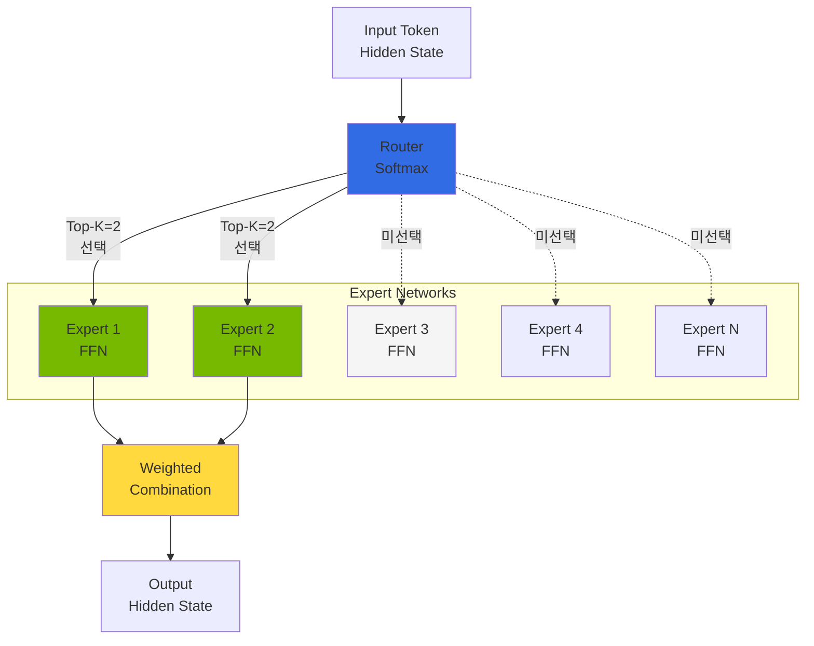
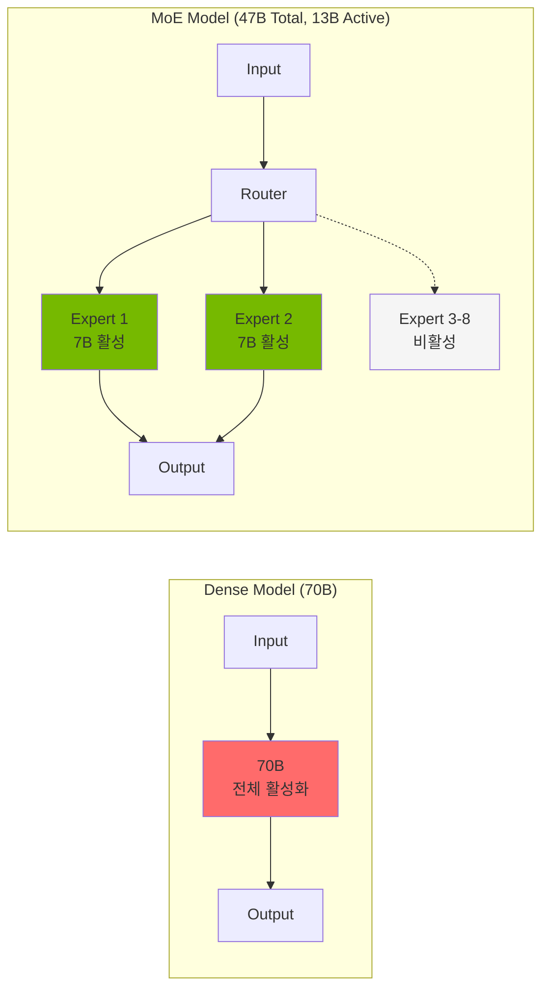
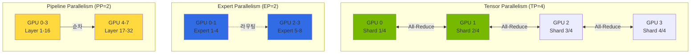
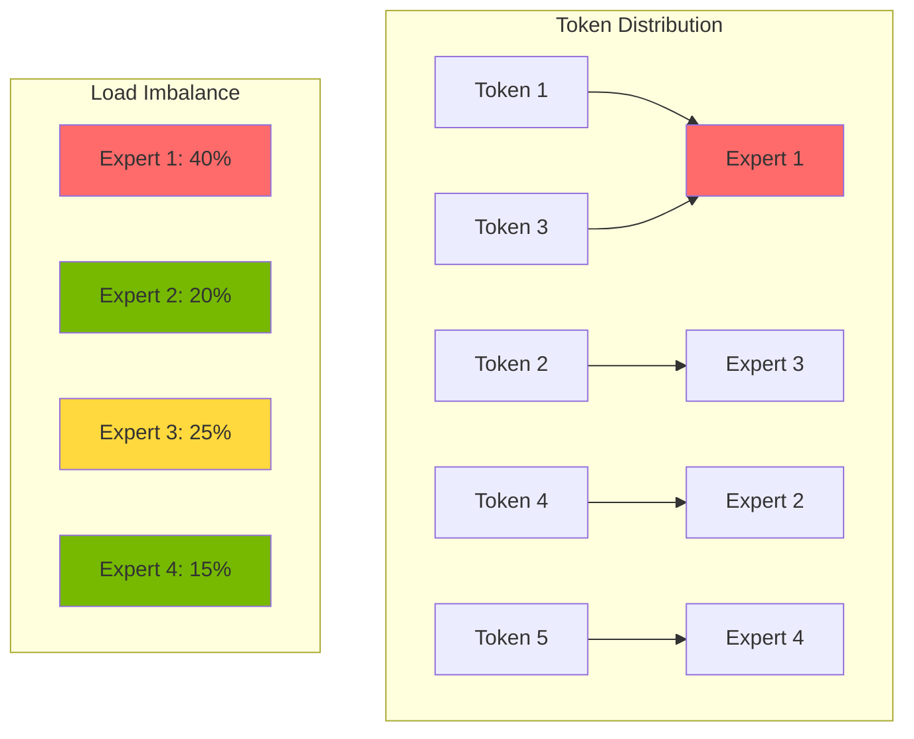
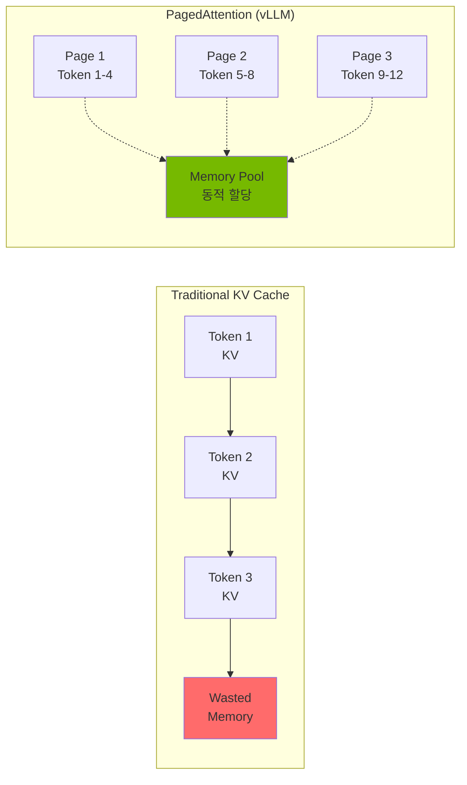
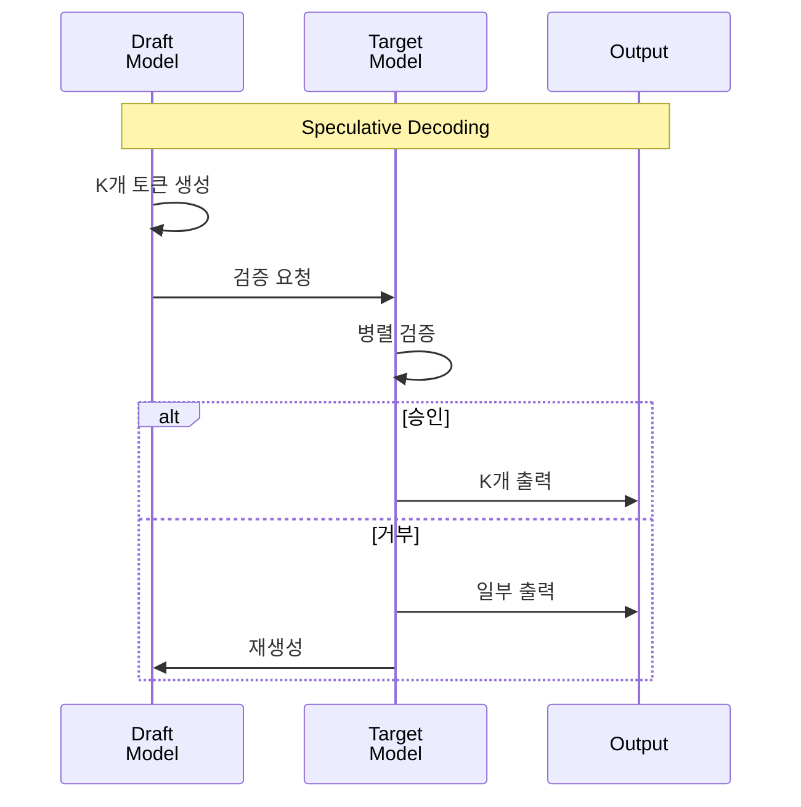

import { RoutingMechanisms, MoeVsDense, GpuMemoryRequirements, ParallelizationStrategies, TensorParallelismConfig, VllmVsTgi, KvCacheConfig, BatchOptimization, MonitoringMetrics, GpuVsTrainium2 } from '@site/src/components/MoeModelTables';

# MoE 모델 서빙 개념 가이드

> **현재 버전**: vLLM v0.18+ / v0.19.x (2026-04 기준)

> **작성일**: 2025-02-09 | **수정일**: 2026-04-06 | **읽는 시간**: 약 6분

## 개요

Mixture of Experts(MoE) 모델은 대규모 언어 모델의 효율성을 극대화하는 아키텍처입니다. 전체 파라미터 중 일부 Expert만 활성화하여 Dense 모델 대비 적은 연산으로 동등한 품질을 달성합니다.

이 문서에서는 MoE 아키텍처의 핵심 개념, 모델별 리소스 요구사항, 분산 배포 전략을 다룹니다.

:::tip 실전 배포 가이드
MoE 모델의 EKS 배포 YAML, helm 명령어, 멀티노드 구성 등 실전 배포는 [커스텀 모델 배포 가이드](../reference-architecture/custom-model-deployment.md)를 참조하세요.
:::

---

## MoE 아키텍처 이해

### Expert 네트워크 구조

MoE 모델은 여러 개의 "Expert" 네트워크와 이를 선택하는 "Router(Gate)" 네트워크로 구성됩니다.

### 라우팅 메커니즘

MoE 모델의 핵심은 입력 토큰에 따라 적절한 Expert를 선택하는 라우팅 메커니즘입니다.

<RoutingMechanisms />

:::info 라우팅 동작 원리

1. **Gate 계산**: 입력 토큰의 hidden state를 Gate 네트워크에 통과
2. **Expert 선택**: Softmax 출력에서 Top-K Expert 선택
3. **병렬 처리**: 선택된 Expert들이 병렬로 입력 처리
4. **가중 합산**: Expert 출력을 Gate 가중치로 결합

:::

### MoE vs Dense 모델 비교

<MoeVsDense />

:::tip MoE 모델의 장점

- **연산 효율성**: 전체 파라미터의 일부만 활성화하여 추론 속도 향상
- **확장성**: Expert 추가로 모델 용량 확장 가능
- **전문화**: 각 Expert가 특정 도메인/태스크에 특화

:::

---

## GPU 메모리 요구사항

MoE 모델은 활성화되는 파라미터는 적지만, 전체 Expert를 메모리에 로드해야 합니다.

<GpuMemoryRequirements />

:::info 최신 MoE 모델 메모리 최적화

**DeepSeek-V3**: Multi-head Latent Attention (MLA) 아키텍처를 사용하여 KV 캐시 메모리를 크게 절감합니다. 전통적인 MHA 대비 약 40% 메모리 절감 효과가 있어, 실제 메모리 요구량은 표기된 값보다 낮을 수 있습니다.

**GLM-5** (2026년 2월 출시): 744B 총 파라미터 / 40B 활성, 256개 experts 중 8개 활성화. SWE-bench Verified 77.8%, Agentic Coding #1 (55.00), MIT 라이선스. FP8 양자화 버전은 ~744GB VRAM 필요 (2x p5.48xlarge, PP=2). HuggingFace: `zai-org/GLM-5-FP8`

**Kimi K2.5** (2026년 1월 출시): ~1T 총 파라미터 / 32B 활성, Modified DeepSeek V3 MoE 아키텍처. SWE-bench Verified 76.8%, HumanEval 99%, Agent Swarm 지원. INT4 양자화 버전은 ~500GB VRAM (1x p5.48xlarge, TP=8). HuggingFace: `moonshotai/Kimi-K2.5`

정확한 메모리 요구량은 배치 크기와 시퀀스 길이에 따라 달라지므로 프로파일링을 권장합니다.
:::

:::warning 메모리 계산 시 주의사항

- **KV Cache**: 배치 크기와 시퀀스 길이에 따라 추가 메모리 필요
- **Activation Memory**: 추론 중 중간 활성화 값 저장 공간
- **CUDA Context**: GPU당 약 1-2GB의 CUDA 오버헤드
- **Safety Margin**: 실제 운영 시 10-20% 여유 공간 확보 권장

:::

---

## 분산 배포 전략

대규모 MoE 모델은 단일 GPU에 로드할 수 없어 분산 배포가 필수입니다.

<ParallelizationStrategies />

### Tensor Parallelism 구성

텐서 병렬화(Tensor Parallelism)는 모델의 각 레이어를 여러 GPU에 분할합니다.

<TensorParallelismConfig />

:::tip 텐서 병렬화 최적화

- **NVLink 활용**: GPU 간 고속 통신을 위해 NVLink 지원 인스턴스 사용
- **TP 크기 선택**: 모델 크기와 GPU 메모리에 따라 최소 TP 크기 선택
- **통신 오버헤드**: TP 크기가 클수록 All-Reduce 통신 증가

:::

### Expert Parallelism

Expert 병렬화(Expert Parallelism)는 MoE 모델의 Expert를 여러 GPU에 분산합니다. vLLM v0.6+에서는 TP 내에서 Expert가 자동으로 분산 배치됩니다.

### Expert 활성화 패턴

MoE 모델의 성능 최적화를 위해 Expert 활성화 패턴을 이해해야 합니다.

:::info Expert 로드 밸런싱

- **Auxiliary Loss**: 학습 시 Expert 간 균등 분배를 유도하는 보조 손실
- **Capacity Factor**: Expert당 처리 가능한 최대 토큰 수 제한
- **Token Dropping**: 용량 초과 시 토큰 드롭 (추론 시 비활성화 권장)

:::

### 700B+ MoE 모델 멀티노드 배포 개념

GLM-5, Kimi K2.5와 같은 700B+ MoE 모델은 단일 노드에 로드할 수 없어 멀티노드 배포가 필수입니다. vLLM v0.18+에서는 **LeaderWorkerSet(LWS)** 기반 멀티노드 배포를 지원합니다.

| 모델 | 총 파라미터 | 활성 파라미터 | 권장 구성 | VRAM 요구량 |
|------|-----------|------------|---------|-----------|
| GLM-5 FP8 | 744B | 40B | 2x p5.48xlarge, PP=2, TP=8 | ~744GB |
| Kimi K2.5 INT4 | ~1T | 32B | 1x p5.48xlarge, TP=8 | ~500GB |
| DeepSeek-V3 | 671B | 37B | 2x p5.48xlarge, PP=2, TP=8 | ~671GB |
| Mixtral 8x22B | 141B | 39B | 1x p5.48xlarge, TP=4 | ~282GB |
| Mixtral 8x7B | 47B | 13B | 1x p4d.24xlarge, TP=2 | ~94GB |

:::tip 700B+ MoE 모델 배포 권장사항

- **LeaderWorkerSet 사용**: Ray 의존성 없이 Kubernetes 네이티브 멀티노드 배포
- **Pipeline Parallelism**: PP=2 이상으로 레이어를 노드 간 분할
- **FP8 양자화**: 메모리 절감 (GLM-5 FP8 버전 권장)
- **Network 최적화**: NCCL 설정으로 노드 간 통신 최적화 (EFA 권장)
- **INT4/AWQ 양자화**: 단일 노드 배포가 가능한 경우 고려 (Kimi K2.5)

:::

:::warning 멀티노드 배포 주의사항

- **네트워크 대역폭**: 노드 간 All-Reduce 통신으로 인한 오버헤드 (EFA 권장)
- **로딩 시간**: 700B+ 모델은 초기 로딩에 20-30분 소요 가능
- **메모리 여유**: Safety margin 10-15% 확보 필요
- **LeaderWorkerSet CRD**: 클러스터에 LWS Operator 설치 필요

:::

---

## vLLM 기반 MoE 서빙 기능

vLLM v0.18+ 버전은 MoE 모델에 대해 다음과 같은 최적화를 제공합니다:

- **Expert Parallelism**: 다중 GPU에 Expert 분산
- **Tensor Parallelism**: 레이어 내 텐서 분할
- **PagedAttention**: 효율적인 KV Cache 관리
- **Continuous Batching**: 동적 배치 처리
- **FP8 KV Cache**: 2배 메모리 절감
- **Improved Prefix Caching**: 400%+ 처리량 향상
- **Multi-LoRA Serving**: 단일 기본 모델에서 여러 LoRA 어댑터 동시 서빙
- **GGUF Quantization**: GGUF 형식 양자화 모델 지원

:::warning TGI 유지보수 모드
Text Generation Inference(TGI)는 2025년부터 유지보수 모드에 진입했습니다. **신규 배포에는 vLLM을 사용하세요.** 기존 TGI에서 마이그레이션 시 vLLM은 OpenAI 호환 API를 제공하므로 클라이언트 코드 변경이 최소화됩니다.
:::

### vLLM vs TGI 성능 비교

<VllmVsTgi />

---

## AWS Trainium2 기반 MoE 추론

### Trainium2 개요

AWS Trainium2는 AWS가 설계한 2세대 ML 가속기로, GPU 대비 비용 효율적인 추론을 제공합니다.

**주요 특징:**
- **고성능**: 단일 trn2.48xlarge에서 Llama 3.1 405B 추론 가능
- **비용 효율**: GPU 대비 최대 50% 비용 절감
- **NeuronX SDK**: PyTorch 2.5+ 지원, 최소 코드 변경으로 모델 온보딩
- **NxD Inference**: 대규모 LLM 배포를 단순화하는 PyTorch 기반 라이브러리
- **FP8 양자화**: 메모리 효율성 향상
- **Flash Decoding**: Speculative Decoding 지원

### GPU vs Trainium2 비용 비교

<GpuVsTrainium2 />

:::tip Trainium2 사용 권장 시나리오

- **비용 최적화**: GPU 대비 50% 이상 비용 절감이 필요한 경우
- **대규모 배포**: 수십~수백 개의 추론 엔드포인트 운영
- **안정적인 워크로드**: 실험적 기능보다 안정성과 비용이 중요한 프로덕션 환경
- **AWS 네이티브**: AWS 생태계 내에서 완전 관리형 솔루션 선호

:::

:::warning Trainium2 제약사항

- **모델 지원**: 모든 모델이 지원되는 것은 아니며, NeuronX SDK 호환성 확인 필요
- **커스텀 커널**: 일부 커스텀 CUDA 커널은 Neuron으로 포팅 필요
- **디버깅**: GPU 대비 디버깅 도구가 제한적
- **리전 가용성**: 일부 AWS 리전에서만 사용 가능

:::

---

## 성능 최적화 개념

### KV Cache 최적화

KV Cache는 추론 성능에 큰 영향을 미치는 핵심 요소입니다.

<KvCacheConfig />

### Speculative Decoding

Speculative Decoding은 작은 드래프트 모델을 사용하여 추론 속도를 향상시킵니다.

:::info Speculative Decoding 효과

- **속도 향상**: 1.5x - 2.5x 처리량 증가 (워크로드에 따라 다름)
- **품질 유지**: 출력 품질은 동일 (검증 과정으로 보장)
- **추가 메모리**: 드래프트 모델을 위한 추가 GPU 메모리 필요

:::

### 배치 처리 최적화

<BatchOptimization />

---

## 모니터링 메트릭

### 주요 모니터링 메트릭

<MonitoringMetrics />

핵심 알림 기준:

| 메트릭 | 임계값 | 심각도 | 설명 |
|--------|--------|--------|------|
| P95 응답 지연 | > 30초 | Warning | MoE 모델 응답 지연 |
| KV Cache 사용률 | > 95% | Critical | 새 요청 거부 가능 |
| 대기 요청 수 | > 100 | Warning | 스케일 아웃 필요 |

---

## 요약

### 핵심 포인트

1. **아키텍처 이해**: Expert 네트워크와 라우팅 메커니즘의 동작 원리 파악
2. **메모리 계획**: 전체 Expert를 로드해야 하므로 충분한 GPU 메모리 확보
3. **분산 배포**: 텐서 병렬화와 Expert 병렬화를 적절히 조합
4. **추론 엔진 선택**: vLLM 권장 (최신 최적화 기법 및 활발한 업데이트)
5. **성능 최적화**: KV Cache, Speculative Decoding, 배치 처리 최적화 적용

### 다음 단계

- [GPU 리소스 관리](./gpu-resource-management.md) - GPU 클러스터 동적 리소스 할당
- [Inference Gateway 라우팅](../design-architecture/inference-gateway-routing.md) - 다중 모델 라우팅 전략
- [Agentic AI 플랫폼 아키텍처](../design-architecture/agentic-platform-architecture.md) - 전체 플랫폼 구성

---

## 참고 자료

- [vLLM 공식 문서](https://docs.vllm.ai/)
- [Mixtral 모델 카드](https://huggingface.co/mistralai/Mixtral-8x7B-Instruct-v0.1)
- [MoE 아키텍처 논문](https://arxiv.org/abs/2101.03961)
- [PagedAttention 논문](https://arxiv.org/abs/2309.06180)
