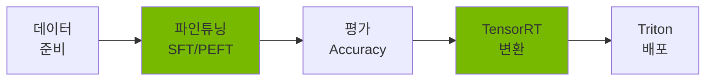
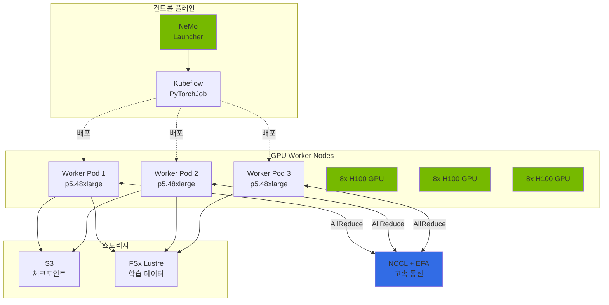
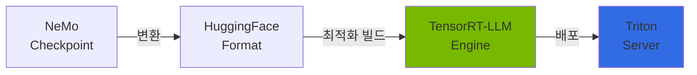
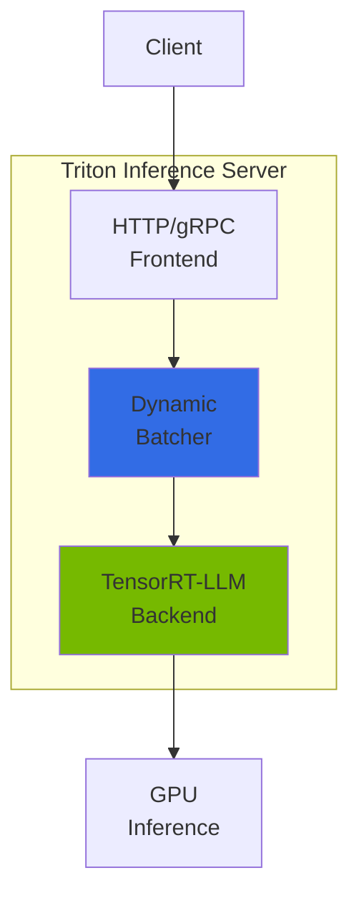
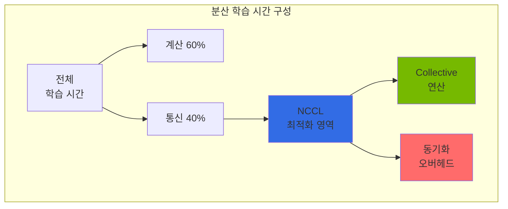
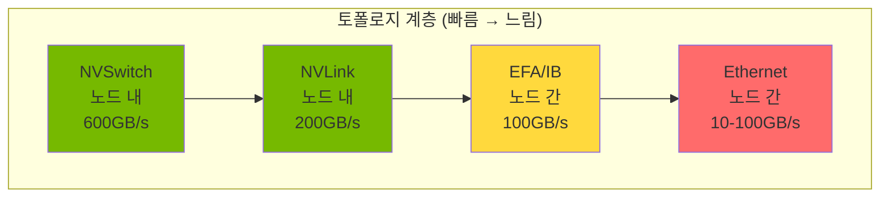

import { NemoComponents, GPURequirements, CheckpointSharding, MonitoringMetrics, NCCLImportance } from '@site/src/components/NemoTables';

# NeMo 프레임워크

> 📅 **작성일**: 2026-02-13 | **수정일**: 2026-04-05 | ⏱️ **읽는 시간**: 약 4분

NVIDIA NeMo는 대규모 언어 모델(LLM)의 학습, 파인튜닝, 최적화를 위한 엔드투엔드 프레임워크입니다. Kubernetes 환경에서 분산 학습과 효율적인 모델 배포를 지원합니다.

## 개요

### NeMo가 해결하는 문제

Agentic AI 플랫폼에서 범용 LLM(GPT-4, Claude 등)을 사용할 때 다음과 같은 한계가 있습니다:

- **도메인 지식 부족**: 특정 산업/기업의 전문 용어와 맥락 이해 부족
- **비용 문제**: 대규모 호출 시 API 비용 급증 (token-per-request 과금)
- **레이턴시**: 외부 API 호출로 인한 응답 지연
- **데이터 프라이버시**: 민감한 데이터를 외부 서비스로 전송 불가
- **온프레미스 요구사항**: 금융/의료 등 규제 산업의 자체 인프라 운영 필요

NeMo는 이러한 문제를 **도메인 특화 모델 파인튜닝**으로 해결합니다.

### NeMo 핵심 기능



<NemoComponents />

**주요 가치:**

- **효율적인 파인튜닝**: LoRA/QLoRA로 전체 파라미터의 0.1%만 학습
- **분산 학습**: Multi-node, Multi-GPU 자동 병렬화 (Tensor/Pipeline/Data Parallelism)
- **추론 최적화**: TensorRT-LLM 변환으로 2-4배 성능 향상
- **엔터프라이즈 지원**: 체크포인트 관리, 모니터링, 프로덕션 배포 파이프라인

---

## EKS 배포 아키텍처

### NeMo on EKS 구성



### 컨테이너 구성

**NeMo 컨테이너 이미지:**

```
nvcr.io/nvidia/nemo:25.02
├── PyTorch 2.5.1
├── CUDA 12.6
├── NCCL 2.23+
├── Megatron-LM (NeMo 통합)
├── TensorRT-LLM 0.13+
└── Triton Inference Server 2.50+
```

**주요 의존성:**

- **Kubeflow Training Operator**: PyTorchJob CRD로 분산 학습 오케스트레이션
- **GPU Operator**: NVIDIA 드라이버, Device Plugin, DCGM 자동 설치
- **EFA Device Plugin**: 노드 간 RDMA 통신 활성화
- **Karpenter**: GPU 노드 오토스케일링

<GPURequirements />

---

## 파인튜닝 가이드

### SFT (Supervised Fine-Tuning) 개념

**SFT란?**: 사전학습된 모델에 도메인별 instruction-response 데이터를 추가 학습시켜 특정 작업 성능을 향상시키는 방법입니다.

```
사전학습 모델 (범용) → SFT → 도메인 특화 모델
```

**언제 사용하는가?**

- 고객사 FAQ 챗봇: 특정 제품/서비스 관련 Q&A 학습
- 금융 보고서 생성: 금융 용어 및 포맷 학습
- 의료 진단 보조: 의학 용어 및 진단 패턴 학습

**데이터 형식:**

```json
{"input": "EKS Auto Mode란 무엇인가요?", "output": "EKS Auto Mode는 노드 프로비저닝, 스케일링, 보안 패치를 AWS가 자동으로 관리하는 완전 관리형 Kubernetes 컴퓨팅 옵션입니다."}
{"input": "Karpenter의 주요 기능은?", "output": "Karpenter는 자동 노드 프로비저닝, bin-packing 최적화, Spot 인스턴스 통합, drift 감지 기능을 제공합니다."}
```

### PEFT/LoRA: 효율적인 파인튜닝

**PEFT (Parameter-Efficient Fine-Tuning)**: 전체 모델 파라미터를 학습하는 대신 **일부 어댑터 레이어만 학습**하여 메모리와 시간을 절약하는 기법입니다.

**LoRA (Low-Rank Adaptation)**: PEFT의 대표적 방법으로, 원본 가중치는 동결(freeze)하고 **저차원 행렬 2개(A, B)만 학습**합니다.

```
원본 가중치 W (freeze) + LoRA 델타 (A × B) = 최종 가중치
```

**LoRA 핵심 파라미터:**

| 파라미터 | 설명 | 권장값 | 영향 |
|---------|------|--------|------|
| `r` (rank) | 저차원 행렬의 랭크 | 8-64 | 클수록 표현력 ↑, 메모리 ↑ |
| `alpha` | 스케일링 계수 | r과 동일 | LoRA 가중치 영향력 조절 |
| `dropout` | 드롭아웃 비율 | 0.1 | 과적합 방지 |
| `target_modules` | 학습할 레이어 | q_proj, v_proj | Attention 레이어 선택 |

**메모리 절감 효과:**

- **Full Fine-Tuning (7B 모델)**: ~120GB VRAM 필요 (A100 80GB × 2)
- **LoRA Fine-Tuning (7B 모델)**: ~24GB VRAM 필요 (A100 80GB × 1)
- **절감률**: ~80% 메모리 감소

### 파인튜닝 실행 예시

```python
# nemo_lora_finetune.py
from nemo.collections.llm import finetune
from nemo.collections.llm.peft import LoRA

# LoRA 설정
lora_config = LoRA(
    r=32,  # rank
    alpha=32,  # scaling
    dropout=0.1,
    target_modules=["q_proj", "v_proj", "k_proj", "o_proj"],
)

# 파인튜닝 실행
model = finetune(
    model_path="/models/llama-3.1-8b.nemo",
    data_path="/data/train.jsonl",
    peft_config=lora_config,
    trainer_config={
        "devices": 8,  # 8 GPU
        "max_epochs": 3,
        "precision": "bf16",  # BFloat16 (A100/H100)
    },
    output_path="/output/llama-3.1-8b-finetuned",
)
```

**상세 파이프라인**: 데이터 전처리, 멀티노드 분산 학습, 하이퍼파라미터 튜닝 등은 [커스텀 모델 파이프라인](../reference-architecture/custom-model-pipeline.md) 문서를 참조하세요.

---

## 체크포인트 관리

### S3 기반 체크포인트 저장

NeMo는 학습 중 주기적으로 **체크포인트(모델 상태 스냅샷)**를 저장합니다. 이를 통해:

- **학습 재개**: 장애 발생 시 마지막 체크포인트부터 재시작
- **최적 모델 선택**: 검증 손실이 가장 낮은 체크포인트 선택
- **버전 관리**: 여러 실험의 체크포인트 비교

**S3 저장 구조:**

```
s3://nemo-checkpoints/
└── llama-3.1-8b-finetune/
    ├── checkpoint-epoch=1-step=500/
    │   ├── model_weights.ckpt
    │   ├── optimizer_states.ckpt
    │   └── metadata.yaml
    ├── checkpoint-epoch=2-step=1000/
    └── checkpoint-epoch=3-step=1500/
```

### 대규모 모델 체크포인트 샤딩

70B 이상의 대규모 모델은 단일 체크포인트 파일이 수백 GB에 달합니다. NeMo는 **샤딩(sharding)**으로 이를 여러 파일로 분할 저장합니다.

<CheckpointSharding />

**샤딩 설정:**

```yaml
trainer:
  checkpoint:
    save_sharded_checkpoint: true
    shard_size_gb: 10  # 10GB 단위로 분할
    num_workers: 8  # 병렬 저장 워커 수
    compression: "gzip"  # 압축 (선택사항)
```

**샤딩 저장 구조:**

```
s3://checkpoints/llama-405b/
└── checkpoint-step=1000/
    ├── shard-00000-of-00040.ckpt  (10GB)
    ├── shard-00001-of-00040.ckpt  (10GB)
    ├── ...
    └── shard-00039-of-00040.ckpt  (10GB)
```

### 체크포인트 변환

```bash
# NeMo → HuggingFace 변환
python -m nemo.collections.llm.scripts.convert_nemo_to_hf \
  --input_path /checkpoints/llama-finetuned.nemo \
  --output_path /models/llama-finetuned-hf \
  --model_type llama
```

---

## TensorRT-LLM 변환

### TensorRT-LLM이란?

NVIDIA TensorRT-LLM은 LLM 추론을 위한 최적화 엔진입니다. PyTorch 모델을 **고도로 최적화된 실행 그래프**로 변환하여 추론 속도를 2-4배 향상시킵니다.



### 성능 향상 비교

| 최적화 기법 | 메모리 절감 | 속도 향상 | 설명 |
|------------|-----------|----------|------|
| **FP8 양자화** | 50% | 1.5-2x | BFloat16 → FP8 (H100 전용) |
| **PagedAttention** | 40% | - | KV Cache 동적 메모리 관리 |
| **In-flight Batching** | - | 2-3x | 연속 배치 처리 |
| **Kernel Fusion** | - | 1.3-1.5x | 연산 커널 융합 |
| **종합 효과** | **60-70%** | **2-4x** | 위 기법들의 복합 효과 |

### 변환 개념

```python
from tensorrt_llm import LLM

# HuggingFace 모델을 TensorRT-LLM 엔진으로 변환
llm = LLM(
    model="/models/llama-finetuned-hf",
    max_input_len=4096,
    max_output_len=2048,
    max_batch_size=64,
    dtype="fp8",  # FP8 양자화
    enable_paged_kv_cache=True,
    enable_chunked_context=True,
)

# 엔진 저장
llm.save("/engines/llama-finetuned-trt")
```

**변환 시간**: 7B 모델 기준 약 10-20분 (A100 1개)

---

## Triton Inference Server

### Triton과 NeMo의 관계

**Triton Inference Server**는 NVIDIA의 프로덕션 추론 서버로, TensorRT-LLM 엔진을 HTTP/gRPC API로 서빙합니다.

```
클라이언트 → Triton Server → TensorRT-LLM 백엔드 → GPU
```

### Triton 아키텍처 개념



**핵심 기능:**

- **동적 배칭**: 여러 요청을 자동으로 묶어 GPU 활용률 최적화
- **모델 앙상블**: 여러 모델을 파이프라인으로 연결 (예: Tokenizer → LLM → Detokenizer)
- **백엔드 지원**: TensorRT-LLM, PyTorch, ONNX, TensorFlow 등
- **메트릭 수집**: Prometheus 호환 메트릭 (처리량, 레이턴시, GPU 사용률)

### 모델 저장소 구조

```
/models/
└── llama-finetuned/
    ├── config.pbtxt  # Triton 설정 파일
    ├── 1/  # 버전 1
    │   └── model.plan  # TensorRT-LLM 엔진
    └── tokenizer/
        ├── tokenizer.json
        └── tokenizer_config.json
```

**config.pbtxt 핵심 설정:**

```protobuf
name: "llama-finetuned"
backend: "tensorrtllm"
max_batch_size: 64

parameters {
  key: "max_tokens_in_paged_kv_cache"
  value: { string_value: "8192" }
}

parameters {
  key: "batch_scheduler_policy"
  value: { string_value: "inflight_fused_batching" }
}
```

---

## NCCL 분산 통신

### NCCL의 역할

**NCCL (NVIDIA Collective Communication Library)**은 분산 GPU 학습에서 **multi-GPU 간 고속 통신**을 담당하는 핵심 라이브러리입니다.



**왜 중요한가?**

<NCCLImportance />

### Collective 연산 개념

#### 1. AllReduce (가장 중요)

모든 GPU의 데이터를 합산하고 결과를 모든 GPU에 배분합니다.

```
초기 상태:
GPU 0: [1, 2, 3]
GPU 1: [4, 5, 6]
GPU 2: [7, 8, 9]
GPU 3: [10, 11, 12]

AllReduce 후:
모든 GPU: [22, 26, 30]  # 각 원소별 합산
```

**사용 사례**: 분산 학습에서 각 GPU의 그래디언트를 평균화

#### 2. AllGather

모든 GPU의 데이터를 수집하여 각 GPU에 전체 데이터를 배분합니다.

```
초기 상태:
GPU 0: [1, 2]
GPU 1: [3, 4]

AllGather 후:
모든 GPU: [1, 2, 3, 4]
```

**사용 사례**: Tensor Parallelism에서 분산된 텐서를 모으기

#### 3. ReduceScatter

데이터를 먼저 합산한 후 각 GPU에 분할하여 배분합니다 (AllGather의 역연산).

```
초기 상태:
GPU 0: [1, 2, 3, 4]
GPU 1: [5, 6, 7, 8]

ReduceScatter 후:
GPU 0: [6, 8]   # (1+5), (2+6)
GPU 1: [10, 12] # (3+7), (4+8)
```

**사용 사례**: Pipeline Parallelism에서 중간 결과 전달

#### 4. Broadcast

한 GPU의 데이터를 모든 GPU에 복사합니다.

```
초기 상태:
GPU 0: [1, 2, 3]
GPU 1: [0, 0, 0]

Broadcast 후:
모든 GPU: [1, 2, 3]
```

**사용 사례**: 마스터 GPU에서 모델 체크포인트 배포

### 네트워크 토폴로지 최적화

NCCL은 GPU 간 물리적 연결 토폴로지를 자동으로 감지하고 최적의 경로를 선택합니다.



**토폴로지별 알고리즘 선택:**

- **NVSwitch (H100 노드)**: Tree 알고리즘 (병렬 브로드캐스트)
- **NVLink (A100 노드)**: Ring 알고리즘 (순환 전달)
- **EFA 노드 간**: Hierarchical 알고리즘 (노드 내 Ring → 노드 간 Tree)

### NCCL 튜닝 파라미터

```bash
# 핵심 NCCL 환경 변수

# 1. 알고리즘 선택
export NCCL_ALGO=Ring  # 또는 Tree

# 2. 프로토콜
export NCCL_PROTO=Simple  # Simple (throughput) 또는 LL (latency)

# 3. 채널 수 (중요!)
export NCCL_MIN_NCHANNELS=4
export NCCL_MAX_NCHANNELS=8  # 많을수록 대역폭 ↑, 오버헤드 ↑

# 4. EFA 설정 (AWS)
export FI_PROVIDER=efa
export FI_EFA_USE_DEVICE_RDMA=1
export NCCL_IB_DISABLE=0

# 5. 디버그
export NCCL_DEBUG=INFO  # 성능 문제 진단 시 유용
```

**채널 수 권장값:**

- **8 GPU 노드 내**: 4-8 채널
- **멀티노드 (16+ GPU)**: 8-16 채널
- **대규모 (64+ GPU)**: 16-32 채널

---

## 모니터링

### 주요 메트릭

<MonitoringMetrics />

**모니터링 스택**: Prometheus + Grafana + DCGM Exporter

상세 모니터링 설정은 [모니터링 및 관찰성 설정](../operations-mlops/monitoring-observability-setup.md)을 참조하세요.

---

## 관련 문서

- [GPU 리소스 관리](./gpu-resource-management.md) - Karpenter, KEDA, DRA 기반 GPU 오토스케일링
- [vLLM 모델 서빙](./vllm-model-serving.md) - 프로덕션 추론 서버
- [MoE 모델 서빙](./moe-model-serving.md) - Mixture of Experts 아키텍처
- [커스텀 모델 파이프라인](../reference-architecture/custom-model-pipeline.md) - 데이터 준비부터 배포까지 전체 파이프라인

:::tip 권장 사항

- **파인튜닝 시작 전**: 기본 모델로 베이스라인 성능을 측정하세요
- **LoRA 우선 사용**: 전체 파인튜닝 대비 메모리 80% 절감
- **TensorRT-LLM 필수**: 추론 성능 2-4배 향상
- **NCCL 튜닝**: 멀티노드 학습 시 채널 수와 알고리즘 최적화로 20-30% 성능 개선 가능

:::

:::warning 주의사항

- **GPU 비용**: 대규모 학습은 시간당 수십만원 비용 발생. Spot 인스턴스와 체크포인트 적극 활용
- **체크포인트 필수**: S3 등 영구 스토리지에 자동 저장 설정 (노드 장애 대비)
- **EFA 보안 그룹**: EFA 사용 시 모든 트래픽 허용 필요 (동일 보안 그룹 내)
- **메모리 오버플로**: OOM 발생 시 `micro_batch_size` 감소 또는 `gradient_checkpointing` 활성화

:::
