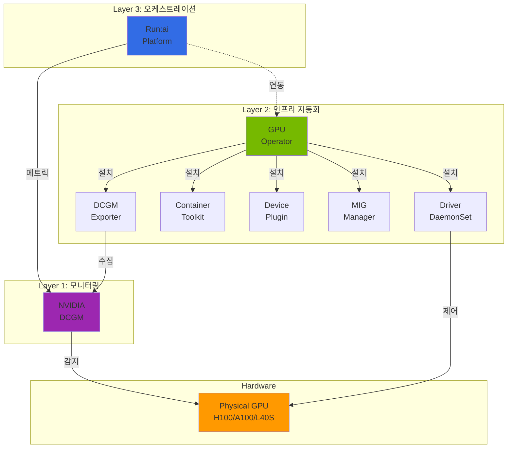
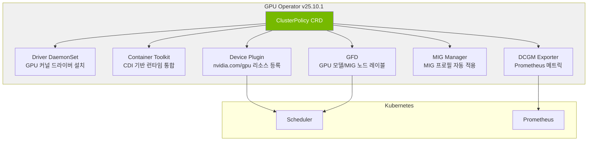
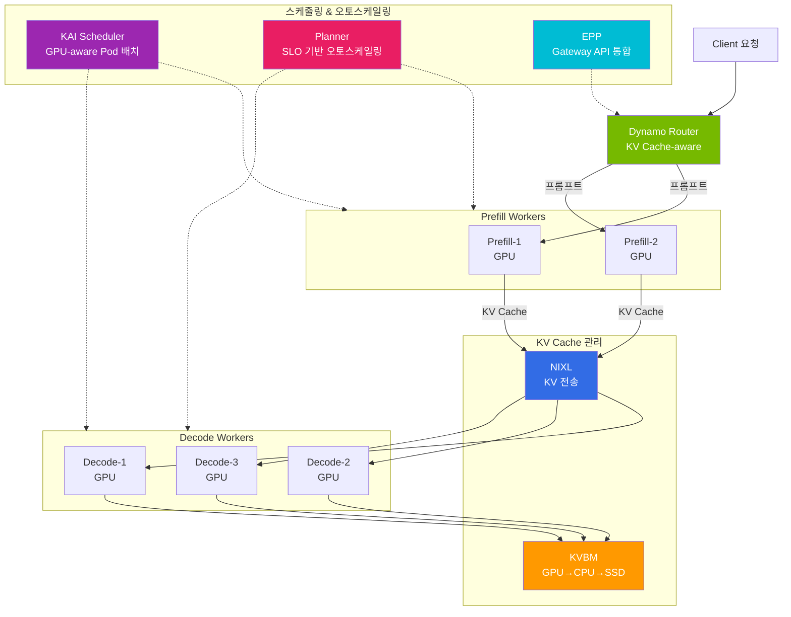

import Tabs from '@theme/Tabs';
import TabItem from '@theme/TabItem';
import { SpecificationTable, ComparisonTable } from '@site/src/components/tables';

# NVIDIA GPU 소프트웨어 스택

> 📅 **작성일**: 2026-03-20 | **수정일**: 2026-03-20 | ⏱️ **읽는 시간**: 약 10분


## 개요

NVIDIA GPU 소프트웨어 스택은 Kubernetes 환경에서 GPU를 효율적으로 운영하기 위한 3계층 구조로 구성됩니다. **GPU Operator**(드라이버 및 인프라 자동화)가 GPU를 Kubernetes에 연결하고, **DCGM**(Data Center GPU Manager)이 GPU 상태를 모니터링하며, **Run:ai**가 최상위에서 GPU 오케스트레이션을 담당합니다. 이 문서에서는 각 계층의 구성과 운영 방법, 그리고 MIG/Time-Slicing 파티셔닝 전략과 NVIDIA Dynamo 분산 추론 프레임워크를 다룹니다.

---

## GPU Operator 아키텍처

:::info GPU Operator 최신 버전 (v25.10.1, 2026.03 기준)

| 컴포넌트 | 버전 | 역할 |
|----------|------|------|
| GPU Operator | **v25.10.1** | 전체 GPU 스택 라이프사이클 관리 |
| NVIDIA Driver | **580.126.18** | GPU 커널 드라이버 |
| DCGM | **v4.5.2** | GPU 모니터링 엔진 |
| DCGM Exporter | **v4.5.2-4.8.1** | Prometheus 메트릭 노출 |
| Device Plugin | **v0.19.0** | K8s GPU 리소스 등록 |
| GFD (GPU Feature Discovery) | **v0.19.0** | GPU 노드 레이블링 |
| MIG Manager | **v0.13.1** | MIG 파티션 자동 관리 |
| Container Toolkit (CDI) | **v1.17.5** | 컨테이너 GPU 런타임 |

**v25.10.1 주요 신기능:**
- **Blackwell 아키텍처 지원**: B200/GB200 GPU 완전 지원
- **HPC Job Mapping**: GPU Job 단위 메트릭 수집 및 어카운팅
- **CDMM (Confidential Data & Model Management)**: Confidential Computing 환경 GPU 지원
- **CDI (Container Device Interface)**: 컨테이너 런타임 독립적 디바이스 관리
:::

### 3계층 아키텍처



각 계층의 역할:

- **GPU Operator** (오케스트레이터): GPU 스택 전체를 **ClusterPolicy CRD**로 번들링하는 오케스트레이션 레이어. Driver, Container Toolkit, Device Plugin, DCGM Exporter, NFD, GFD, MIG Manager 등 각 컴포넌트를 **독립적으로 enable/disable** 가능합니다. EKS Auto Mode에서도 설치 가능하며, Device Plugin만 노드 레이블로 비활성화하고 나머지 컴포넌트(DCGM Exporter, NFD, GFD 등)는 정상 동작합니다.
- **DCGM** (센서): GPU 상태를 읽는 모니터링 엔진. SM Utilization, Tensor Core Activity, Memory, Power, Temperature, ECC Errors 등을 수집합니다.
- **Run:ai** (관제탑): GPU Operator와 DCGM 위에서 동작하는 스케줄링/관리 레이어. Fractional GPU, Dynamic MIG, Gang Scheduling, Quota 관리를 제공합니다.

### 의존 관계

| 조합 | 가능 여부 | 사용 사례 |
|---|---|---|
| GPU Operator만 | 가능 | 기본 GPU 추론, MIG 수동 설정, DCGM 메트릭 |
| GPU Operator + Run:ai | 가능 | 엔터프라이즈 GPU 클러스터 관리 (권장) |
| DCGM만 (드라이버 수동설치) | 가능 | 베어메탈, 단일 서버 모니터링 |
| Run:ai만 (GPU Operator 없이) | **불가** | GPU Operator ClusterPolicy 필수 의존성 |
| EKS Auto Mode + Run:ai | **가능** | GPU Operator 설치 후 Device Plugin만 레이블로 비활성화 |

### EKS 환경별 GPU 관리 방식

| 노드 타입 | GPU 드라이버 | GPU Operator | MIG 지원 | Run:ai 지원 |
|---|---|---|---|---|
| Auto Mode | AWS 자동 설치 | 설치 가능 (Device Plugin 레이블 비활성화) | 불가 | 가능 (Device Plugin 레이블 비활성화) |
| Karpenter (Self-Managed) | GPU Operator 설치 | 완전 지원 | 완전 지원 | 완전 지원 |
| Managed Node Group | GPU Operator 설치 | 완전 지원 | 완전 지원 | 완전 지원 |
| Hybrid Node (온프레미스) | GPU Operator 필수 | 필수 구성 | 완전 지원 | 완전 지원 |

:::tip 노드 전략 상세 가이드
EKS Auto Mode와 Karpenter의 하이브리드 구성, GPU Operator 설치 방법, Hybrid Node GPU 팜 구성에 대한 상세 내용은 [EKS GPU 노드 전략](./eks-gpu-node-strategy.md)을 참조하세요.
:::

### GPU Operator 컴포넌트 상세

GPU Operator는 ClusterPolicy CRD를 통해 GPU 스택 전체를 선언적으로 관리합니다.



:::caution AMI별 GPU Driver 제약
- **AL2023 / Bottlerocket**: GPU 드라이버가 AMI에 사전 설치되어 GPU Operator의 `driver` 컴포넌트는 반드시 `enabled: false`로 설정해야 합니다.
- **AL2 (Custom AMI)**: GPU Operator가 드라이버를 직접 설치할 수 있습니다.
- **EKS Auto Mode**: AWS가 드라이버를 자동 관리하므로 `driver`와 `toolkit` 모두 `enabled: false`로 설정합니다.
:::

**Helm 설치 예시 (Karpenter + Self-Managed):**

```bash
# NVIDIA Helm 리포지토리 추가
helm repo add nvidia https://helm.ngc.nvidia.com/nvidia
helm repo update

# GPU Operator 설치 (AL2023/Bottlerocket — driver/toolkit 비활성화)
helm install gpu-operator nvidia/gpu-operator \
  --namespace gpu-operator --create-namespace \
  --set driver.enabled=false \
  --set toolkit.enabled=false \
  --set dcgmExporter.serviceMonitor.enabled=true \
  --set migManager.enabled=true \
  --set gfd.enabled=true \
  --set nfd.enabled=true
```

**ClusterPolicy CRD 예시 (Karpenter + Self-Managed):**

```yaml
apiVersion: nvidia.com/v1
kind: ClusterPolicy
metadata:
  name: cluster-policy
spec:
  operator:
    defaultRuntime: containerd
  driver:
    enabled: false          # AL2023/Bottlerocket: AMI에 사전 설치
  toolkit:
    enabled: false          # AL2023/Bottlerocket: AMI에 사전 설치
  devicePlugin:
    enabled: true
  dcgmExporter:
    enabled: true
    version: "4.5.2-4.8.1"
    serviceMonitor:
      enabled: true
  migManager:
    enabled: true
    config:
      name: default-mig-parted-config
  gfd:
    enabled: true
  nfd:
    enabled: true
  nodeStatusExporter:
    enabled: false
```

**EKS Auto Mode용 NodePool 레이블 (Device Plugin 비활성화):**

Auto Mode에서는 GPU Operator를 설치하되, Device Plugin만 노드 레이블로 비활성화합니다. KAI Scheduler 등 ClusterPolicy에 의존하는 프로젝트가 정상 동작하려면 GPU Operator 설치가 필요합니다.

```yaml
apiVersion: karpenter.sh/v1
kind: NodePool
metadata:
  name: gpu-auto-mode
spec:
  template:
    metadata:
      labels:
        nvidia.com/gpu.deploy.device-plugin: "false"  # Device Plugin 비활성화
    spec:
      requirements:
        - key: eks.amazonaws.com/instance-family
          operator: In
          values: ["p5", "p4d"]
      nodeClassRef:
        group: eks.amazonaws.com
        kind: NodeClass
        name: default
```

### EKS 환경별 GPU Operator 구성

| 환경 | GPU Operator | 드라이버 관리 | MIG | 제약사항 |
|------|-------------|-------------|-----|---------|
| EKS Auto Mode | 설치 가능 (Device Plugin 비활성화) | AWS 자동 (AMI 사전 설치) | 불가 | Device Plugin은 레이블로 비활성화, DCGM/NFD/GFD 정상 동작 |
| EKS + Karpenter | Helm 설치 | Operator 관리 | 완전 지원 | NodePool에 GPU AMI 지정 필요 |
| EKS Managed Node Group | Helm 설치 | Operator 관리 | 완전 지원 | 노드 그룹 단위 관리 |
| EKS Hybrid Nodes | Helm 설치 (필수) | Operator 필수 | 완전 지원 | 온프레미스 GPU 팜, 네트워크 설정 필요 |

---

## DCGM 모니터링

NVIDIA DCGM(Data Center GPU Manager)은 GPU 상태를 모니터링하고 Prometheus로 메트릭을 노출하는 핵심 컴포넌트입니다.

### 배포 방식 선택

DCGM Exporter는 DaemonSet 또는 Sidecar 방식으로 배포할 수 있습니다. 대부분의 프로덕션 환경에서는 DaemonSet 방식을 권장합니다.

<Tabs>
  <TabItem value="daemonset" label="DaemonSet (권장)" default>

| 항목 | 내용 |
|------|------|
| **리소스 효율** | 노드당 1개 인스턴스 -- 오버헤드 최소 |
| **관리** | 중앙 집중식, GPU Operator가 자동 관리 |
| **메트릭 범위** | 노드의 모든 GPU 메트릭 수집 |
| **보안** | DaemonSet에만 `SYS_ADMIN` 부여 |
| **적합 환경** | 프로덕션 환경 (대부분의 경우) |

  </TabItem>
  <TabItem value="sidecar" label="Sidecar (특수 용도)">

| 항목 | 내용 |
|------|------|
| **리소스 효율** | Pod당 1개 인스턴스 -- 오버헤드 높음 |
| **관리** | Pod 스펙에 포함, 개별 관리 |
| **메트릭 범위** | 해당 Pod의 GPU 메트릭만 수집 |
| **보안** | 모든 GPU Pod에 `SYS_ADMIN` 필요 |
| **적합 환경** | 멀티 테넌트 격리, Pod별 과금 추적 |

  </TabItem>
</Tabs>

**Sidecar가 유효한 시나리오:**
- **멀티 테넌트 과금**: 테넌트별 GPU 사용량을 Pod 단위로 정밀 추적해야 할 때
- **DaemonSet 설치 불가**: EKS Auto Mode 등 노드 접근이 제한된 환경
- **Pod 격리**: 특정 Pod의 GPU 메트릭만 독립적으로 모니터링해야 할 때

### DaemonSet 배포 (권장)

```yaml
apiVersion: apps/v1
kind: DaemonSet
metadata:
  name: dcgm-exporter
  namespace: gpu-monitoring
  labels:
    app: dcgm-exporter
spec:
  selector:
    matchLabels:
      app: dcgm-exporter
  template:
    metadata:
      labels:
        app: dcgm-exporter
    spec:
      nodeSelector:
        nvidia.com/gpu.present: "true"
      tolerations:
        - key: nvidia.com/gpu
          operator: Exists
          effect: NoSchedule
      containers:
        - name: dcgm-exporter
          image: nvcr.io/nvidia/k8s/dcgm-exporter:4.5.2-4.8.1-ubuntu22.04
          ports:
            - name: metrics
              containerPort: 9400
          env:
            - name: DCGM_EXPORTER_LISTEN
              value: ":9400"
            - name: DCGM_EXPORTER_KUBERNETES
              value: "true"
            - name: DCGM_EXPORTER_COLLECTORS
              value: "/etc/dcgm-exporter/dcp-metrics-included.csv"
          volumeMounts:
            - name: pod-resources
              mountPath: /var/lib/kubelet/pod-resources
              readOnly: true
          securityContext:
            runAsNonRoot: false
            runAsUser: 0
            capabilities:
              add: ["SYS_ADMIN"]
      volumes:
        - name: pod-resources
          hostPath:
            path: /var/lib/kubelet/pod-resources
```

:::info DCGM Exporter 3.3+ 기능
DCGM Exporter 3.3+는 다음과 같은 향상된 기능을 제공합니다:
- **H100/H200 지원**: 최신 GPU 메트릭 수집
- **향상된 메트릭**: 더 세밀한 GPU 상태 모니터링
- **성능 개선**: 낮은 오버헤드로 메트릭 수집
:::

### Sidecar 배포 (특수 용도)

Kubernetes 1.33+의 안정화된 Sidecar Containers를 사용하여 GPU 메트릭을 Pod 단위로 수집할 수 있습니다.

```yaml
apiVersion: v1
kind: Pod
metadata:
  name: vllm-with-monitoring
  namespace: ai-inference
spec:
  initContainers:
    # Sidecar로 실행되는 DCGM Exporter (특수 용도)
    - name: dcgm-sidecar
      image: nvcr.io/nvidia/k8s/dcgm-exporter:4.5.2-4.8.1-ubuntu22.04
      restartPolicy: Always  # K8s 1.33+ Sidecar 기능
      ports:
        - name: metrics
          containerPort: 9400
      securityContext:
        capabilities:
          add: ["SYS_ADMIN"]
      resources:
        requests:
          cpu: "100m"
          memory: "128Mi"
        limits:
          cpu: "200m"
          memory: "256Mi"
  containers:
    - name: vllm
      image: vllm/vllm-openai:latest
      resources:
        requests:
          nvidia.com/gpu: 2
        limits:
          nvidia.com/gpu: 2
```

### 주요 GPU 메트릭

DCGM Exporter가 수집하는 핵심 메트릭입니다.

<SpecificationTable
  headers={['메트릭 이름', '설명', '스케일링 활용']}
  rows={[
    { id: '1', cells: ['DCGM_FI_DEV_GPU_UTIL', 'GPU 코어 사용률 (%)', 'HPA 트리거 기준'] },
    { id: '2', cells: ['DCGM_FI_DEV_MEM_COPY_UTIL', '메모리 대역폭 사용률 (%)', '메모리 병목 감지'] },
    { id: '3', cells: ['DCGM_FI_DEV_FB_USED', '프레임버퍼 사용량 (MB)', 'OOM 방지'] },
    { id: '4', cells: ['DCGM_FI_DEV_FB_FREE', '프레임버퍼 여유량 (MB)', '용량 계획'] },
    { id: '5', cells: ['DCGM_FI_DEV_POWER_USAGE', '전력 사용량 (W)', '비용 모니터링'] },
    { id: '6', cells: ['DCGM_FI_DEV_SM_CLOCK', 'SM 클럭 속도 (MHz)', '성능 모니터링'] },
    { id: '7', cells: ['DCGM_FI_DEV_GPU_TEMP', 'GPU 온도 (C)', '열 관리'] }
  ]}
/>

### Prometheus ServiceMonitor

```yaml
apiVersion: monitoring.coreos.com/v1
kind: ServiceMonitor
metadata:
  name: dcgm-exporter
  namespace: gpu-monitoring
spec:
  selector:
    matchLabels:
      app: dcgm-exporter
  endpoints:
    - port: metrics
      interval: 15s
      path: /metrics
  namespaceSelector:
    matchNames:
      - gpu-monitoring
```

---

## GPU 파티셔닝 전략

### MIG (Multi-Instance GPU) 기반 파티셔닝

MIG는 H100, A100, H200 등 Ampere/Hopper/Blackwell 아키텍처 GPU를 최대 7개의 독립적인 GPU 인스턴스로 분할합니다. 각 MIG 인스턴스는 독립된 메모리, 캐시, SM(Streaming Multiprocessor)을 가지므로 워크로드 간 간섭 없이 안정적인 성능을 보장합니다.

GPU Operator의 MIG Manager가 ConfigMap 기반으로 MIG 프로필을 자동 관리합니다.

```yaml
# MIG 프로필 ConfigMap (mig-parted 형식)
apiVersion: v1
kind: ConfigMap
metadata:
  name: default-mig-parted-config
  namespace: gpu-operator
data:
  config.yaml: |
    version: v1
    mig-configs:
      # 7개 소형 인스턴스: 소형 모델 다중 서빙
      all-1g.5gb:
        - devices: all
          mig-enabled: true
          mig-devices:
            "1g.5gb": 7

      # 혼합 구성: 대형 + 소형 동시 운영
      mixed-balanced:
        - devices: all
          mig-enabled: true
          mig-devices:
            "3g.20gb": 1
            "2g.10gb": 1
            "1g.5gb": 2

      # 단일 대형 인스턴스: 70B+ 모델
      single-7g:
        - devices: all
          mig-enabled: true
          mig-devices:
            "7g.40gb": 1

---

# MIG 프로필 적용 (노드 레이블로 선택)
# kubectl label node gpu-node-01 nvidia.com/mig.config=mixed-balanced

---

# Pod에서 MIG 디바이스 사용
apiVersion: v1
kind: Pod
metadata:
  name: vllm-mig-inference
  namespace: ai-inference
spec:
  containers:
    - name: vllm
      image: vllm/vllm-openai:latest
      command: ["python", "-m", "vllm.entrypoints.openai.api_server"]
      args:
        - "--model"
        - "meta-llama/Llama-2-7b-hf"
        - "--gpu-memory-utilization"
        - "0.9"
      resources:
        requests:
          memory: "4Gi"
          cpu: "4"
          nvidia.com/mig-1g.5gb: 1   # MIG 프로필 지정
        limits:
          nvidia.com/mig-1g.5gb: 1
```

**A100 40GB MIG 프로필:**

<SpecificationTable
  headers={['프로필', '메모리', 'SM 수', '용도', '예상 처리량']}
  rows={[
    { id: '1', cells: ['1g.5gb', '5GB', '14', '소형 모델 (3B 이하)', '~20 tok/s'] },
    { id: '2', cells: ['1g.10gb', '10GB', '14', '소형 모델 (3B-7B)', '~25 tok/s'] },
    { id: '3', cells: ['2g.10gb', '10GB', '28', '중형 모델 (7B-13B)', '~50 tok/s'] },
    { id: '4', cells: ['3g.20gb', '20GB', '42', '중대형 모델 (13B-30B)', '~100 tok/s'] },
    { id: '5', cells: ['4g.20gb', '20GB', '56', '대형 모델 (13B-30B)', '~130 tok/s'] },
    { id: '6', cells: ['7g.40gb', '40GB', '84', '초대형 모델 (70B+)', '~200 tok/s'] }
  ]}
/>

### Time-Slicing 기반 파티셔닝

Time-Slicing은 시간 기반으로 GPU 컴퓨팅 시간을 분할하여 여러 Pod이 동일 GPU를 공유합니다. MIG와 달리 **모든 NVIDIA GPU에서 사용 가능**하지만, 워크로드 간 메모리 격리가 없으며 동시 실행 시 성능 저하가 발생합니다.

GPU Operator의 ClusterPolicy 또는 ConfigMap으로 Time-Slicing을 설정합니다.

```yaml
# Time-Slicing ConfigMap
apiVersion: v1
kind: ConfigMap
metadata:
  name: time-slicing-config
  namespace: gpu-operator
data:
  any: |-
    version: v1
    sharing:
      timeSlicing:
        renameByDefault: false
        failRequestsGreaterThanOne: false
        resources:
          - name: nvidia.com/gpu
            replicas: 4  # 각 GPU를 4개 Pod이 공유

---

# ClusterPolicy에서 Time-Slicing 활성화
apiVersion: nvidia.com/v1
kind: ClusterPolicy
metadata:
  name: cluster-policy
spec:
  devicePlugin:
    enabled: true
    config:
      name: time-slicing-config  # ConfigMap 참조
      default: any

---

# Pod에서 Time-Sliced GPU 사용 (일반 GPU 요청과 동일)
apiVersion: apps/v1
kind: Deployment
metadata:
  name: vllm-timeslice-replicas
  namespace: ai-inference
spec:
  replicas: 3  # 3개 Pod이 동일 GPU 공유
  selector:
    matchLabels:
      app: vllm-slice
  template:
    metadata:
      labels:
        app: vllm-slice
    spec:
      containers:
        - name: vllm
          image: vllm/vllm-openai:latest
          resources:
            requests:
              nvidia.com/gpu: 1  # Time-Slicing이 활성화되면 GPU 조각 할당
              memory: "8Gi"
              cpu: "2"
            limits:
              nvidia.com/gpu: 1
```

**Time-Slicing 성능 고려사항:**

:::warning Time-Slicing 성능 특성
- **컨텍스트 스위칭 오버헤드**: 약 1% 수준으로 미미합니다
- **동시 실행 성능 저하**: GPU 메모리와 컴퓨팅을 공유하므로 동시 워크로드 수에 따라 **50-100% 성능 저하** 발생
- **메모리 격리 없음**: MIG와 달리 워크로드 간 GPU 메모리가 격리되지 않아, 한 워크로드의 OOM이 다른 워크로드에 영향
:::

| 사용 사례 | 적합도 | 이유 |
|----------|:------:|------|
| 배치 추론, 비긴급 작업 | 적합 | 순차 실행으로 성능 영향 최소 |
| 개발/테스트 환경 | 적합 | GPU 비용 절감, 성능 보장 불필요 |
| 실시간 추론 (SLA 있음) | 부적합 | 동시 워크로드 시 지연 시간 예측 불가 |
| 고성능 학습 | 부적합 | GPU 메모리 전체 활용 필요 |

---

## NVIDIA Dynamo: 데이터센터 규모 추론 최적화

### 개요

**NVIDIA Dynamo**는 데이터센터 규모의 LLM 추론을 최적화하는 오픈소스 프레임워크입니다. vLLM, SGLang, TensorRT-LLM을 백엔드로 지원하며, SemiAnalysis InferenceX 벤치마크에서 기존 대비 **최대 7x 성능 향상**을 달성했습니다.

:::info Dynamo v1.0 (2026.03 GA)
- **지원 백엔드**: vLLM, SGLang, TensorRT-LLM
- **서빙 모드**: Aggregated + Disaggregated 모두 동등 지원
- **핵심 기술**: Flash Indexer (radix tree KV 인덱싱), NIXL (공통 KV 전송), KAI Scheduler (GPU-aware Pod 배치), Planner (SLO 기반 오토스케일링), EPP (Gateway API 통합)
- **배포 방식**: Kubernetes Operator + CRD 기반
- **라이선스**: Apache 2.0
:::

### 핵심 아키텍처

Dynamo는 **Aggregated Serving과 Disaggregated Serving 모두 동등하게 지원**합니다. Disaggregated 모드에서는 Prefill(프롬프트 처리)과 Decode(토큰 생성)를 분리하여 각 단계를 독립 스케일링합니다. 최신 릴리스에서는 **radix tree 기반 Flash Indexer**로 worker별 KV cache를 인덱싱하여 prefix 매칭을 최적화합니다.



### 핵심 컴포넌트

| 컴포넌트 | 역할 | 이점 |
|----------|------|------|
| **Disaggregated Serving** | Prefill/Decode 워커 분리 (Aggregated도 지원) | 각 단계별 독립 스케일링, GPU 활용 극대화 |
| **KV Cache Routing** | Prefix-aware 요청 라우팅 | KV Cache 히트율 향상, TTFT 단축 |
| **Flash Indexer** | Radix tree 기반 worker별 KV cache 인덱싱 | Prefix 매칭 최적화, KV 재사용률 극대화 |
| **KVBM (KV Block Manager)** | GPU → CPU → SSD 3-tier 캐시 | 메모리 효율 극대화, 대규모 컨텍스트 지원 |
| **NIXL** | NVIDIA Inference Transfer Library (공통 KV 전송 엔진) | GPU 간 KV Cache 초고속 전송 (NVLink/RDMA). Dynamo, llm-d, production-stack, aibrix 등 대부분의 프로젝트가 사용 |
| **KAI Scheduler** | GPU-aware K8s Pod 스케줄러 | GPU topology, MIG 슬라이스 인식 Pod 배치. ClusterPolicy 의존 |
| **Planner** | SLO 기반 오토스케일링 | Profiling 실행 → Planner에 결과 제공 → SLO 목표 기반 자동 스케일링 |
| **EPP (Endpoint Picker Protocol)** | Gateway API 통합 | Dynamo 자체 EPP 구현으로 K8s Gateway API와 네이티브 통합 |

### EKS 배포

Dynamo는 Kubernetes Operator 패턴으로 EKS에 배포합니다.

**설치 순서:**

```bash
# 1. 모니터링 스택 (Prometheus + Grafana)
helm install kube-prometheus-stack prometheus-community/kube-prometheus-stack \
  --namespace monitoring --create-namespace

# 2. GPU Operator (이미 설치되어 있으면 스킵)
helm install gpu-operator nvidia/gpu-operator \
  --namespace gpu-operator --create-namespace

# 3. Dynamo Platform (Operator + etcd + NATS)
helm install dynamo-platform nvidia/dynamo-platform \
  --namespace dynamo-system --create-namespace

# 4. Dynamo vLLM 워크로드 배포
kubectl apply -f dynamo-vllm-deployment.yaml
```

**DynamoGraphDeploymentRequest (DGDR) CRD 기반 배포:**

```yaml
apiVersion: dynamo.nvidia.com/v1alpha1
kind: DynamoGraphDeploymentRequest
metadata:
  name: llama-70b-disagg
  namespace: ai-inference
spec:
  graph:
    name: disaggregated-llm
    engine: vllm
    model: meta-llama/Llama-3.1-70B-Instruct
  serving:
    mode: disaggregated  # aggregated | disaggregated
    prefill:
      replicas: 2
      resources:
        nvidia.com/gpu: 4
    decode:
      replicas: 4
      resources:
        nvidia.com/gpu: 2
  routing:
    strategy: prefix-aware
    kvCacheRouting: true
  sla:
    maxTTFT: 500ms
    maxITL: 50ms
  autoscaling:
    enabled: true
    minReplicas: 2
    maxReplicas: 16
    targetUtilization: 70
```

### AIConfigurator

Dynamo의 **AIConfigurator**는 모델과 하드웨어 구성에 따라 최적의 Tensor Parallelism(TP), Pipeline Parallelism(PP) 설정을 자동으로 추천합니다.

| 기능 | 설명 |
|------|------|
| 자동 TP/PP 추천 | 모델 크기, GPU 메모리, 네트워크 토폴로지 기반 최적 병렬화 |
| Pareto Frontier | 처리량-지연 시간 트레이드오프 최적점 탐색 |
| 하드웨어 프로파일링 | GPU 간 대역폭, NVLink 토폴로지 자동 감지 |
| SLA 기반 최적화 | 목표 TTFT/ITL 기반 구성 추천 |

---

## llm-d vs Dynamo 선택 가이드

llm-d와 NVIDIA Dynamo는 모두 LLM 추론 라우팅/스케줄링을 담당하지만, **대안 관계**이며 함께 사용하기보다 선택해서 사용합니다.

### 기능 비교

| 항목 | llm-d | NVIDIA Dynamo |
|------|-------|---------------|
| **아키텍처** | Aggregated + Disaggregated | Aggregated + Disaggregated (동등 지원) |
| **KV Cache 라우팅** | Prefix-aware 라우팅 | Prefix-aware + Flash Indexer (radix tree) |
| **KV Cache 전송** | NIXL (네트워크도 지원) | NIXL (NVLink/RDMA 초고속 전송) |
| **라우팅** | Gateway API + Envoy EPP | Dynamo Router + 자체 EPP (Gateway API 통합) |
| **Pod 스케줄링** | K8s 기본 스케줄러 (built-in 없음) | KAI Scheduler (GPU-aware Pod 배치) |
| **오토스케일링** | HPA/KEDA 연동 | Planner (SLO 기반: profiling → autoscale) + KEDA/HPA |
| **vLLM 백엔드** | 지원 | 지원 (SGLang, TRT-LLM도 지원) |
| **Kubernetes 통합** | Gateway API 네이티브 | Operator + CRD (DGDR) + Gateway API EPP |
| **복잡도** | 낮음 -- 기존 vLLM에 라우터 추가 | 높음 -- 전체 서빙 스택 교체 |
| **성능 향상** | Prefix hit로 TTFT 단축 | Flash Indexer + Disaggregated로 최대 7x 처리량 |
| **성숙도** | v0.5+ | v1.0 GA (2026.03) |

### 왜 함께 쓰기 어려운가

둘 다 **요청을 어떤 백엔드로 보낼지 결정하는 라우터** 역할을 합니다. 라우팅 레이어에서 경쟁하므로 두 라우터를 직렬로 연결하는 것은 의미가 없습니다.

```text
llm-d 단독:    Client → llm-d Router → vLLM Workers (Aggregated 또는 Prefill/Decode 분리)
Dynamo 단독:   Client → Dynamo Router → Prefill Workers → (NIXL) → Decode Workers
```

:::info Dynamo + llm-d 통합 가능성
Dynamo 1.0은 llm-d를 내부 컴포넌트로 통합할 수 있습니다. 이 경우 llm-d는 독립 라우터가 아니라 Dynamo의 KV Cache-aware 라우팅 레이어로 동작합니다. 완전한 대안 관계라기보다 Dynamo가 llm-d를 포함하는 상위 집합으로 볼 수 있습니다.
:::

### 선택 기준

| 시나리오 | 추천 |
|----------|------|
| 기존 vLLM 배포에 라우팅만 추가 | **llm-d** |
| 소규모~중규모 (GPU 8개 이하) | **llm-d** |
| Gateway API 기반 K8s 네이티브 라우팅 | **llm-d** |
| 대규모 (GPU 16개+), 처리량 극대화 | **Dynamo** |
| NIXL 기반 GPU 간 초고속 KV 전송 필요 | **Dynamo** |
| 긴 컨텍스트 (128K+) 워크로드 | **Dynamo** (NIXL + 3-tier KV cache) |
| 빠른 도입, 낮은 운영 복잡도 | **llm-d** |

:::tip 마이그레이션 경로
llm-d로 시작해서 규모가 커지면 Dynamo로 전환하는 것이 현실적입니다. 둘 다 vLLM을 백엔드로 사용하고 NIXL을 KV 전송에 활용합니다. 핵심 차이는 Dynamo의 Flash Indexer(radix tree KV 인덱싱), KAI Scheduler(GPU-aware Pod 배치), Planner(SLO 기반 오토스케일링)입니다.
:::

---

## 요약

NVIDIA GPU 소프트웨어 스택은 GPU Operator(인프라 자동화), DCGM(모니터링), Run:ai(오케스트레이션)의 3계층으로 구성됩니다. MIG와 Time-Slicing을 통해 GPU를 효율적으로 파티셔닝할 수 있으며, NVIDIA Dynamo를 활용하면 데이터센터 규모의 LLM 추론을 최적화할 수 있습니다.

### 다음 단계

- [EKS GPU 리소스 관리](./gpu-resource-management.md) -- Karpenter, KEDA, DRA, 비용 최적화
- [EKS GPU 노드 전략](./eks-gpu-node-strategy.md) -- Auto Mode + Karpenter + Hybrid Node 구성
- [vLLM 모델 서빙](./vllm-model-serving.md) -- vLLM 기반 추론 엔진

---

## 참고 자료

- [NVIDIA GPU Operator Documentation](https://docs.nvidia.com/datacenter/cloud-native/gpu-operator/latest/)
- [NVIDIA DCGM Exporter](https://github.com/NVIDIA/dcgm-exporter)
- [NVIDIA Dynamo GitHub](https://github.com/ai-dynamo/dynamo)
- [Dynamo Architecture Overview](https://github.com/ai-dynamo/dynamo/blob/main/docs/architecture.md)
- [NIXL - NVIDIA Inference Transfer Library](https://github.com/ai-dynamo/nixl)
- [KAI Scheduler](https://github.com/NVIDIA/KAI-Scheduler)
