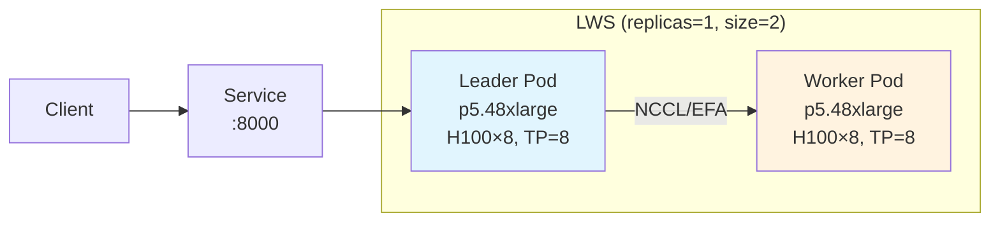

import ComparisonTable from '@site/src/components/tables/ComparisonTable';
import SpecificationTable from '@site/src/components/tables/SpecificationTable';

# vLLM 기반 Foundation Model 배포 및 성능 최적화

vLLM은 PagedAttention 알고리즘을 통해 KV 캐시 메모리 낭비를 60-80% 줄이고, 연속 배칭(Continuous Batching)으로 기존 대비 2-24배의 처리량 향상을 제공하는 고성능 LLM 추론 엔진이다. Meta, Mistral AI, Cohere, IBM 등 주요 기업들이 프로덕션 환경에서 활용하고 있으며, OpenAI 호환 API를 제공하여 기존 애플리케이션의 마이그레이션이 용이하다.

> **📌 현재 버전**: vLLM v0.6.3 / v0.7.x (2025-02 안정 버전). 본 문서의 코드 예시는 v0.6.x / v0.7.x 기준입니다.

본 문서에서는 Amazon EKS 환경에서 vLLM을 배포하고 운영하기 위한 실무 가이드를 제공한다. GPU 메모리 계산, 병렬화 전략 선택, Kubernetes 배포 패턴, 그리고 프로덕션 환경에서의 성능 튜닝 방법을 다룬다.

## 핵심 아키텍처 이해

### PagedAttention과 메모리 효율성

전통적인 LLM 서빙에서 가장 큰 병목은 KV 캐시 메모리 관리다. Transformer 아키텍처의 자기회귀적 특성으로 인해 각 요청은 이전 토큰들의 키-값 쌍을 저장해야 하며, 이 KV 캐시는 입력 시퀀스 길이와 동시 사용자 수에 비례하여 선형적으로 증가한다.

vLLM의 PagedAttention은 운영체제의 가상 메모리 관리에서 영감을 받아 KV 캐시를 비연속적인 블록으로 저장한다. 이를 통해 메모리 단편화를 제거하고, 동적으로 메모리를 할당하여 GPU 활용률을 극대화한다. 기존 방식에서 발생하던 60-80%의 메모리 낭비가 사라지며, 동일한 하드웨어에서 더 많은 동시 요청을 처리할 수 있다.

### 연속 배칭(Continuous Batching)

정적 배칭은 고정된 수의 요청이 모일 때까지 대기한 후 처리한다. 배치 크기가 32라면, 31번째 요청은 32번째 요청이 도착할 때까지 기다려야 한다. 요청이 불규칙하게 도착하면 GPU가 부분적으로만 활용되어 처리량이 저하된다.

vLLM의 연속 배칭은 배치 경계를 완전히 제거한다. 스케줄러가 반복(iteration) 수준에서 동작하여, 완료된 요청은 즉시 제거하고 새로운 요청을 동적으로 추가한다. 이를 통해 GPU가 항상 최대 용량으로 작동하며, 평균 지연 시간과 처리량 모두 개선된다.

## GPU 메모리 요구사항 계산

모델 배포 전 필요한 GPU 메모리를 정확히 계산해야 한다. 메모리 사용량은 모델 가중치, 활성화, KV 캐시의 세 가지 주요 구성요소로 나뉜다.

```
필요 GPU 메모리 = 모델 가중치 + 비torch 메모리 + PyTorch 활성화 피크 메모리 + (배치당 KV 캐시 메모리 × 배치 크기)
```

모델 가중치 메모리는 파라미터 수와 정밀도에 따라 결정된다.

<SpecificationTable
  headers={['정밀도', '파라미터당 바이트', '70B 모델 메모리']}
  rows={[
    { id: '1', cells: ['FP32', '4', '280GB'] },
    { id: '2', cells: ['FP16/BF16', '2', '140GB'] },
    { id: '3', cells: ['INT8', '1', '70GB'] },
    { id: '4', cells: ['INT4', '0.5', '35GB'] }
  ]}
/>

70B 파라미터 모델을 FP16으로 배포하려면 가중치만 140GB가 필요하다. 단일 GPU로는 불가능하며, 다중 GPU 텐서 병렬화가 필수다. 동일 모델을 INT4 양자화하면 35GB로 줄어들어 단일 A100 80GB나 H100에서 KV 캐시 여유 공간과 함께 배포 가능하다.

## 병렬화 전략

### 텐서 병렬화(Tensor Parallelism)

텐서 병렬화는 각 모델 레이어 내에서 파라미터를 여러 GPU에 분산한다. 단일 노드 내에서 대규모 모델을 배포할 때 가장 일반적인 전략이다.

적용 시점:

- 모델이 단일 GPU에 맞지 않을 때
- GPU당 메모리 압력을 줄여 KV 캐시 공간을 확보하고 처리량을 높이려 할 때

```python
from vllm import LLM

# 4개 GPU에 모델 분산
llm = LLM(model="meta-llama/Llama-3.3-70B-Instruct", tensor_parallel_size=4)
```

텐서 병렬화의 제약사항은 어텐션 헤드 수다. tensor_parallel_size는 모델의 어텐션 헤드 수의 약수여야 한다.

### 파이프라인 병렬화(Pipeline Parallelism)

파이프라인 병렬화는 모델 레이어를 여러 GPU에 순차적으로 분산한다. 토큰이 파이프라인을 통해 순차적으로 흐른다.

적용 시점:

- 텐서 병렬화를 최대로 활용했지만 추가 GPU가 필요할 때
- 다중 노드 배포가 필요할 때

```bash
# 4개 GPU를 텐서 병렬로, 2개 노드를 파이프라인 병렬로
vllm serve meta-llama/Llama-3.3-70B-Instruct \
  --tensor-parallel-size 4 \
  --pipeline-parallel-size 2
```

### 데이터 병렬화(Data Parallelism)

데이터 병렬화는 전체 모델 복제본을 여러 서버에 복제하여 독립적인 요청을 처리한다. Kubernetes의 HPA(Horizontal Pod Autoscaler)와 결합하여 탄력적으로 확장할 수 있다.

### 전문가 병렬화(Expert Parallelism)

MoE(Mixture-of-Experts) 모델을 위한 특수 전략이다. 토큰이 관련 "전문가"에만 라우팅되어 불필요한 계산을 줄인다. `--enable-expert-parallel` 플래그로 활성화한다.

## 지원 하드웨어 확장

vLLM v0.6+ 버전은 다양한 하드웨어 가속기를 지원합니다:

<ComparisonTable
  headers={['하드웨어', '지원 수준', '주요 용도']}
  rows={[
    { id: '1', cells: ['NVIDIA GPU (A100, H100, H200)', '완전 지원', '프로덕션 추론'], recommended: true },
    { id: '2', cells: ['AMD GPU (MI300X)', '지원', '대안 GPU 인프라'] },
    { id: '3', cells: ['Intel GPU (Gaudi 2/3)', '지원', '비용 효율적 추론'] },
    { id: '4', cells: ['Google TPU', '지원', 'GCP 환경'] },
    { id: '5', cells: ['AWS Trainium/Inferentia', '지원', 'AWS 네이티브 가속'] }
  ]}
/>

AWS EKS 환경에서는 NVIDIA GPU가 기본 선택이며, 비용 최적화를 위해 AWS Trainium2 인스턴스(`trn2.48xlarge`)도 고려할 수 있습니다.

### vLLM v0.6+ 주요 신기능

vLLM v0.6 이상 버전에서 추가된 주요 기능:

- **FP8 KV Cache**: KV 캐시 메모리를 2배 절감하여 더 긴 컨텍스트 또는 더 큰 배치 크기 지원
- **Improved Prefix Caching**: 공통 프리픽스 재사용으로 400%+ 처리량 향상
- **Multi-LoRA Serving**: 단일 기본 모델에서 여러 LoRA 어댑터 동시 서빙
- **GGUF Quantization**: GGUF 형식 양자화 모델 네이티브 지원
- **Enhanced Speculative Decoding**: 더 빠른 토큰 생성을 위한 개선된 추측적 디코딩

## Kubernetes 배포

### 기본 배포 구성

다음은 AWS EKS에서 vLLM을 배포하는 기본 구성이다. [GenAI on EKS Starter Kit](https://github.com/aws-samples/sample-genai-on-eks-starter-kit)의 패턴을 참고했다.

```yaml
apiVersion: apps/v1
kind: Deployment
metadata:
  name: qwen3-32b-fp8
  namespace: vllm
spec:
  replicas: 1
  selector:
    matchLabels:
      app: qwen3-32b-fp8
  template:
    metadata:
      labels:
        app: qwen3-32b-fp8
    spec:
      nodeSelector:
        karpenter.sh/instance-family: g6e
      containers:
        - name: vllm
          image: vllm/vllm-openai:v0.6.3
          command: ["vllm", "serve"]
          args:
            - Qwen/Qwen3-32B-FP8
            - --served-model-name=qwen3-32b-fp8
            - --trust-remote-code
            - --gpu-memory-utilization=0.95
            - --max-model-len=32768
            - --enable-auto-tool-choice
            - --tool-call-parser=hermes
            - --enable-prefix-caching
            - --kv-cache-dtype=fp8
          env:
            - name: HUGGING_FACE_HUB_TOKEN
              valueFrom:
                secretKeyRef:
                  name: hf-token
                  key: token
          ports:
            - name: http
              containerPort: 8000
          resources:
            requests:
              cpu: 3
              memory: 24Gi
              nvidia.com/gpu: 1
            limits:
              nvidia.com/gpu: 1
          volumeMounts:
            - name: huggingface-cache
              mountPath: /root/.cache/huggingface
            - name: shm
              mountPath: /dev/shm
      volumes:
        - name: huggingface-cache
          persistentVolumeClaim:
            claimName: huggingface-cache
        - name: shm
          emptyDir:
            medium: Memory
            sizeLimit: "16Gi"
      tolerations:
        - key: nvidia.com/gpu
          operator: Exists
          effect: NoSchedule
---
apiVersion: v1
kind: Service
metadata:
  name: qwen3-32b-fp8
  namespace: vllm
spec:
  selector:
    app: qwen3-32b-fp8
  ports:
    - name: http
      port: 8000
```

### 핵심 구성 파라미터

**gpu-memory-utilization**: KV 캐시에 사전 할당할 GPU VRAM 비율. 기본값 0.9, 최적 성능을 위해 0.95까지 설정 가능. OOM 없이 최대값을 찾아야 한다.

**max-model-len**: 지원할 최대 시퀀스 길이. KV 캐시 크기에 직접 영향을 미친다. 실제 워크로드에 맞게 조정한다.

**max-num-seqs**: 동시 처리할 최대 시퀀스 수. 기본값 256-1024. 메모리와 처리량의 트레이드오프.

**tensor-parallel-size**: 텐서 병렬화에 사용할 GPU 수.

### 다중 GPU 텐서 병렬 배포

70B 이상 대규모 모델은 다중 GPU 구성이 필수다.

```yaml
apiVersion: apps/v1
kind: Deployment
metadata:
  name: llama-70b-instruct
  namespace: vllm
spec:
  replicas: 1
  selector:
    matchLabels:
      app: llama-70b-instruct
  template:
    metadata:
      labels:
        app: llama-70b-instruct
    spec:
      nodeSelector:
        karpenter.sh/instance-family: p5
      hostNetwork: true
      hostIPC: true
      containers:
        - name: vllm
          image: vllm/vllm-openai:v0.6.3
          command: ["vllm", "serve"]
          args:
            - meta-llama/Llama-3.3-70B-Instruct
            - --tensor-parallel-size=4
            - --gpu-memory-utilization=0.90
            - --max-model-len=8192
            - --enable-prefix-caching
            - --kv-cache-dtype=fp8
          env:
            - name: HUGGING_FACE_HUB_TOKEN
              valueFrom:
                secretKeyRef:
                  name: hf-token
                  key: token
            - name: NCCL_DEBUG
              value: "INFO"
          resources:
            requests:
              nvidia.com/gpu: 4
            limits:
              nvidia.com/gpu: 4
          volumeMounts:
            - name: shm
              mountPath: /dev/shm
      volumes:
        - name: shm
          emptyDir:
            medium: Memory
            sizeLimit: "32Gi"
```

**중요**: 텐서 병렬 추론을 위해 `hostIPC: true`와 충분한 공유 메모리(`/dev/shm`)가 필요하다.

## 성능 최적화 전략

### 양자화(Quantization)

모델 품질과 메모리 효율성의 균형을 맞춘다.

```bash
# FP8 양자화 모델 사용
vllm serve Qwen/Qwen3-32B-FP8 --quantization fp8

# AWQ 양자화
vllm serve TheBloke/Llama-2-70B-AWQ --quantization awq

# GPTQ 양자화
vllm serve TheBloke/Llama-2-70B-GPTQ --quantization gptq

# GGUF 양자화 (vLLM v0.6+)
vllm serve --model TheBloke/Llama-2-70B-GGUF \
  --quantization gguf \
  --gguf-file llama-2-70b.Q4_K_M.gguf
```

**양자화 방식 비교:**

<ComparisonTable
  headers={['양자화', '메모리 절감', '품질 손실', '추론 속도', '지원 (vLLM v0.6+)']}
  rows={[
    { id: '1', cells: ['FP8', '50%', '최소', '빠름', '✅'], recommended: true },
    { id: '2', cells: ['AWQ', '75%', '낮음', '매우 빠름', '✅'] },
    { id: '3', cells: ['GPTQ', '75%', '낮음', '빠름', '✅'] },
    { id: '4', cells: ['GGUF', '50-75%', '낮음-중간', '빠름', '✅ (v0.6+)'] }
  ]}
/>

FP8은 품질 저하가 거의 없으면서 메모리를 절반으로 줄인다. INT4(AWQ, GPTQ, GGUF)는 복잡한 추론 작업에서 품질 저하가 발생할 수 있으므로 워크로드별 프로파일링이 필요하다.

### Multi-LoRA 서빙

vLLM은 단일 기본 모델에서 여러 LoRA 어댑터를 동시에 서빙할 수 있습니다:

```bash
vllm serve meta-llama/Llama-3.3-70B-Instruct \
  --enable-lora \
  --lora-modules customer-support=./lora-cs finance=./lora-fin \
  --max-loras 4
```

이를 통해 하나의 GPU 세트에서 도메인별 특화 모델을 효율적으로 운영할 수 있어 GPU 리소스를 크게 절약합니다.

### 프리픽스 캐싱(Prefix Caching)

표준화된 시스템 프롬프트나 반복되는 컨텍스트에서 400% 이상의 활용률 향상을 제공한다.

```bash
vllm serve model-name --enable-prefix-caching
```

시스템 프롬프트의 KV 캐시가 한 번 계산되어 공유되므로, 동일한 프리픽스를 가진 요청들은 중복 계산을 피할 수 있다. 적중률은 애플리케이션에 따라 다르다.

### 추측적 디코딩(Speculative Decoding)

예측 가능한 출력에서 2-3배 속도 향상을 제공한다. 작은 드래프트 모델이 토큰을 예측하고, 메인 모델이 검증한다.

```bash
vllm serve large-model \
  --speculative-model small-draft-model \
  --num-speculative-tokens 5
```

가변적인 프롬프트에서는 캐시 유지 오버헤드가 이점을 초과할 수 있다.

### Chunked Prefill

프리필(계산 집약적)과 디코드(메모리 집약적) 작업을 동일 배치에서 혼합하여 처리량과 지연 시간 모두 개선한다. vLLM V1에서 기본 활성화되어 있다.

```python
from vllm import LLM

llm = LLM(
    model="model-name",
    max_num_batched_tokens=2048  # 튜닝 가능
)
```

max_num_batched_tokens를 조정하여 TTFT(Time To First Token)와 처리량의 균형을 맞춘다.

## 모니터링 및 관찰성

### Prometheus 메트릭

vLLM은 다양한 Prometheus 메트릭을 노출한다.

```yaml
apiVersion: monitoring.coreos.com/v1
kind: ServiceMonitor
metadata:
  name: vllm-monitor
  namespace: vllm
spec:
  selector:
    matchLabels:
      app: vllm
  endpoints:
    - port: http
      path: /metrics
      interval: 15s
```

주요 모니터링 지표:

- `vllm:num_requests_running`: 현재 처리 중인 요청 수
- `vllm:num_requests_waiting`: 대기 중인 요청 수
- `vllm:gpu_cache_usage_perc`: GPU KV 캐시 사용률
- `vllm:num_preemptions_total`: 선점된 요청 수 (높으면 메모리 부족)
- `vllm:avg_prompt_throughput_toks_per_s`: 프롬프트 처리량 (tokens/sec)
- `vllm:avg_generation_throughput_toks_per_s`: 생성 처리량 (tokens/sec)
- `vllm:time_to_first_token_seconds`: 첫 토큰까지 시간 (TTFT)
- `vllm:time_per_output_token_seconds`: 출력 토큰당 시간 (TPOT)
- `vllm:e2e_request_latency_seconds`: 엔드투엔드 요청 지연 시간

### Grafana 대시보드 예제

```json
{
  "dashboard": {
    "title": "vLLM Performance Dashboard",
    "panels": [
      {
        "title": "Request Throughput",
        "targets": [{
          "expr": "rate(vllm:request_success_total[5m])",
          "legendFormat": "Requests/sec"
        }]
      },
      {
        "title": "GPU Cache Usage",
        "targets": [{
          "expr": "vllm:gpu_cache_usage_perc",
          "legendFormat": "Cache Usage %"
        }]
      },
      {
        "title": "Token Generation Speed",
        "targets": [{
          "expr": "vllm:avg_generation_throughput_toks_per_s",
          "legendFormat": "Tokens/sec"
        }]
      }
    ]
  }
}
```

### 선점(Preemption) 처리

KV 캐시 공간이 부족하면 vLLM이 요청을 선점하여 공간을 확보한다. 다음 경고가 자주 발생하면 조치가 필요하다.

```
WARNING Sequence group 0 is preempted by PreemptionMode.RECOMPUTE
```

대응 방안:

- `gpu_memory_utilization` 증가
- `max_num_seqs` 또는 `max_num_batched_tokens` 감소
- `tensor_parallel_size` 증가로 GPU당 메모리 확보
- `max_model_len` 감소

## 프로덕션 배포 체크리스트

배포 전 확인사항:

1. GPU 메모리 요구사항을 계산하고 적절한 인스턴스 타입 선택
2. 양자화 전략 결정 및 품질-효율성 트레이드오프 검증
3. 워크로드에 맞는 max_model_len 설정
4. 텐서 병렬화 필요 여부 및 GPU 수 결정
5. 공유 메모리(/dev/shm) 충분히 할당
6. Prometheus 메트릭 수집 및 대시보드 구성
7. HPA 설정으로 탄력적 확장 구성
8. PVC를 통한 모델 캐시 영속화

## 과거 대안 솔루션 (참고용)

:::info[과거 대안 (참고용)]

이전에는 HuggingFace TGI (Text Generation Inference), Ray Serve, ModelMesh 등의 대안이 고려되었습니다. 그러나 vLLM의 다음 특성들로 인해 현재는 대부분의 사용 사례를 vLLM이 커버합니다:

- **TGI 대비**: vLLM의 PagedAttention과 연속 배칭으로 2-24배 높은 처리량 제공
- **Ray Serve 대비**: 추가 오케스트레이션 레이어 없이 네이티브 Kubernetes 배포와 간단한 스케일링
- **ModelMesh 대비**: 더 나은 GPU 메모리 효율성과 OpenAI 호환 API로 즉각적인 마이그레이션 가능

vLLM v0.6+ 버전은 FP8 KV Cache, Multi-LoRA, Prefix Caching, Speculative Decoding 등 고급 기능을 통합하여 단일 솔루션으로 다양한 워크로드를 처리할 수 있습니다.

:::

## LWS 기반 멀티노드 대형 모델 서빙

### LWS (LeaderWorkerSet) 개요

[LeaderWorkerSet](https://github.com/kubernetes-sigs/lws)는 Kubernetes 네이티브 멀티노드 워크로드 패턴으로, leader-worker 토폴로지를 단일 CRD로 관리합니다. vLLM의 내장 분산 추론(NCCL)과 결합하면 **Ray 없이도 멀티노드 Pipeline Parallelism**을 구현할 수 있습니다.



### LWS vs Ray 비교

<ComparisonTable
  headers={['항목', 'LWS + vLLM', 'Ray + vLLM']}
  rows={[
    { id: '1', cells: ['의존성', 'LWS CRD만 설치', 'Ray Cluster (head + worker)'] },
    { id: '2', cells: ['복잡도', '낮음', '높음'] },
    { id: '3', cells: ['Pod 관리', 'K8s StatefulSet 기반', 'Ray 자체 스케줄러'] },
    { id: '4', cells: ['장애 복구', 'RecreateGroupOnPodRestart', 'Ray 재연결'] },
    { id: '5', cells: ['EKS Auto Mode', '✅ 호환', '✅ 호환'] }
  ]}
/>

### 배포 예제: GLM-5 744B (PP=2, TP=8)

```yaml
apiVersion: leaderworkerset.x-k8s.io/v1
kind: LeaderWorkerSet
metadata:
  name: vllm-glm5-fp8
  namespace: agentic-serving
spec:
  replicas: 1
  leaderWorkerTemplate:
    size: 2  # leader + worker = 2 pods (16 GPUs)
    restartPolicy: RecreateGroupOnPodRestart
    leaderTemplate:
      spec:
        tolerations:
          - key: nvidia.com/gpu
            operator: Exists
            effect: NoSchedule
        containers:
          - name: vllm
            image: vllm/vllm-openai:v0.18.1
            command: ["vllm", "serve"]
            args:
              - "zai-org/GLM-5-FP8"
              - "--tensor-parallel-size=8"
              - "--pipeline-parallel-size=2"
              - "--gpu-memory-utilization=0.92"
              - "--enable-prefix-caching"
            env:
              - name: VLLM_USE_DEEP_GEMM
                value: "1"
            resources:
              requests:
                nvidia.com/gpu: "8"
            volumeMounts:
              - name: model-cache
                mountPath: /models
              - name: dshm
                mountPath: /dev/shm
        volumes:
          - name: model-cache
            emptyDir:
              sizeLimit: 1Ti
          - name: dshm
            emptyDir:
              medium: Memory
              sizeLimit: 32Gi
    workerTemplate:
      spec:
        # leader와 동일한 container spec
        ...
```

### 모델 캐시 스토리지 전략

<ComparisonTable
  headers={['스토리지', '순차 읽기 처리량', '멀티노드 공유', 'Pod 재시작 시', '비용']}
  rows={[
    { id: '1', cells: ['NVMe emptyDir', '~3,500 MB/s', '❌ 노드별 개별', '재다운로드 필요', '무료 (인스턴스 포함)'], recommended: true },
    { id: '2', cells: ['EFS', '~100-300 MB/s', '✅ ReadWriteMany', '캐시 유지', '유료 (GB/월)'] },
    { id: '3', cells: ['S3 + init container', '~1,000 MB/s', '✅ (S3 공유)', 'init container 재실행', '저렴'] },
    { id: '4', cells: ['FSx for Lustre', '~1,000+ MB/s', '✅ ReadWriteMany', '캐시 유지', '고비용'] }
  ]}
/>

:::tip 대형 모델 권장 스토리지
GLM-5 (744GB), Kimi K2.5 (630GB) 같은 대형 모델은 **로컬 NVMe (emptyDir)**를 권장합니다. p5.48xlarge에 8×3.84TB NVMe SSD가 내장되어 있어 추가 비용 없이 최고 성능을 제공합니다. HuggingFace Hub에서 직접 다운로드하면 첫 기동 시 10-20분 소요되지만, NVMe 읽기 속도 덕분에 이후 로딩은 빠릅니다.
:::

## 코딩 특화 대형 모델 배포 가이드

### 2026년 코딩 특화 오픈소스 LLM 비교

<ComparisonTable
  headers={['모델', '파라미터', '아키텍처', 'SWE-bench', 'Agentic Coding', 'GPU 요구사항', '라이선스']}
  rows={[
    { id: '1', cells: ['GLM-5 (=5.1)', '744B (40B active)', 'MoE 256/8', '77.8%', '55.00 (#1)', '16×H100 (PP=2,TP=8)', 'MIT'], recommended: true },
    { id: '2', cells: ['Kimi K2.5', '1T (32B active)', 'MoE (DeepSeek V3)', '76.8%', '48.33', '8×H100 (TP=8)', 'Modified MIT'] },
    { id: '3', cells: ['DeepSeek V3.2', '671B (37B active)', 'MoE', '73.1%', '46.67', '8×H100', 'MIT'] },
    { id: '4', cells: ['Devstral 2', '123B', 'Dense', '72.2%', '43.33', '멀티 GPU', 'Modified MIT'] },
    { id: '5', cells: ['Qwen3-Coder', '480B (35B active)', 'MoE', '70.6%', '—', '멀티 GPU', 'Apache 2.0'] }
  ]}
/>

### GLM-5 배포 설정

```bash
# vLLM v0.18.1+ 필요
# VLLM_USE_DEEP_GEMM=1 환경변수 필수
vllm serve zai-org/GLM-5-FP8 \
  --tensor-parallel-size=8 \
  --pipeline-parallel-size=2 \
  --tool-call-parser=glm47 \
  --reasoning-parser=glm45 \
  --enable-auto-tool-choice \
  --gpu-memory-utilization=0.92 \
  --enable-prefix-caching \
  --kv-cache-dtype=fp8
```

### Kimi K2.5 배포 설정

```bash
vllm serve moonshotai/Kimi-K2.5 \
  --tensor-parallel-size=8 \
  --trust-remote-code \
  --gpu-memory-utilization=0.92 \
  --max-model-len=98304 \
  --enable-auto-tool-choice \
  --enable-prefix-caching
```

### Cascade Routing (GLM-5 → Kimi K2.5 Failback)

Bifrost 또는 LiteLLM Gateway에서 cascade routing을 설정하면, GLM-5가 응답 불가 시 자동으로 Kimi K2.5로 fallback합니다:

```yaml
routing:
  defaultModel: glm-5
  strategy: cascade
  cascadeOrder: [local-glm5, local-kimi-k25]
  fallbackConditions:
    - statusCode: [500, 502, 503, 504]
    - latencyMs: "> 30000"
```

## vLLM PP 멀티노드 제약 (V1 엔진, 2026.04)

GLM-5 (744B MoE) 배포 과정에서 vLLM V1 엔진의 Pipeline Parallelism (PP) 멀티노드 구성에서 교착 상태가 발생했습니다.

### 문제 상황

**구성**: LeaderWorkerSet (LWS) 기반 PP=2, TP=8 멀티노드 배포
- Leader Pod: p5.48xlarge, rank=0, 8 GPU (TP=8)
- Worker Pod: p5.48xlarge, rank=1, 8 GPU (TP=8)
- vLLM V1 엔진, multiproc_executor (non-Ray)

**증상**:
1. Leader Pod가 모델 로딩 완료
2. Worker Pod가 TCPStore 연결 시도
3. Leader가 Worker 응답 대기 중 timeout
4. Worker에서 `TCPStore Broken pipe` 에러 발생
5. Leader crash → Worker crash → 순환 재시작

**에러 로그**:
```
Leader Pod:
  INFO: Model weights loaded on rank 0
  WARNING: Waiting for worker rank 1... (timeout in 600s)
  ERROR: VLLM_ENGINE_READY_TIMEOUT_S expired. Worker not ready.

Worker Pod:
  INFO: Connecting to TCPStore at leader-0.svc:29500
  ERROR: [Errno 32] Broken pipe
  CRITICAL: Worker initialization failed
```

### 원인 분석

**Root Cause**: vLLM V1 엔진의 multiproc_executor는 NCCL TCPStore를 통해 멀티노드 동기화를 수행하는데, 대형 모델 로딩 시간이 `VLLM_ENGINE_READY_TIMEOUT_S` (기본 600초)를 초과하면 동기화 실패가 발생합니다.

**시도한 해결 방법 (모두 실패)**:
1. `VLLM_ENGINE_READY_TIMEOUT_S=3600` (1시간) 증가 → 여전히 timeout
2. `--enforce-eager` 추가 (CUDA graph 비활성화) → 동일 증상
3. S3에서 모델 사전 다운로드 → 로딩 시간 단축되었으나 TCPStore 여전히 실패
4. `--disable-custom-all-reduce` 추가 → Worker 연결 실패

**추정**: V1 엔진의 multiproc_executor + TCPStore 조합이 744B 급 대형 모델의 멀티노드 초기화 시퀀스를 안정적으로 처리하지 못하는 것으로 보입니다.

### 권장 해결 방안

#### 옵션 1: SGLang 사용 (검증 완료)

SGLang은 멀티노드 PP를 안정적으로 지원합니다.

```yaml
apiVersion: leaderworkerset.x-k8s.io/v1
kind: LeaderWorkerSet
metadata:
  name: sglang-glm5
spec:
  replicas: 1
  leaderWorkerTemplate:
    size: 2
    leaderTemplate:
      spec:
        containers:
        - name: sglang
          image: lmsysorg/sglang:latest
          command: ["python3", "-m", "sglang.launch_server"]
          args:
            - "--model-path"
            - "THUDM/glm-5-8b"
            - "--tp"
            - "8"
            - "--pp"
            - "2"
            - "--nnodes"
            - "2"
            - "--node-rank"
            - "0"
          resources:
            limits:
              nvidia.com/gpu: "8"
```

**결과**: GLM-5 멀티노드 배포 성공, 교착 없음.

#### 옵션 2: Ray 기반 vLLM 사용

Ray Cluster를 구성하여 vLLM의 Ray executor를 사용합니다.

```bash
# Ray head
vllm serve model-name \
  --tensor-parallel-size 8 \
  --pipeline-parallel-size 2 \
  --worker-use-ray

# Ray worker는 자동 연결
```

**단점**: Ray Cluster 운영 복잡도 증가 (head + worker 관리).

#### 옵션 3: 단일 노드에서 PP 제거

p5en.48xlarge (H200 141GB × 8 = 1,128GB)나 p6-b200.48xlarge (B200 192GB × 8 = 1,536GB)를 사용하면 PP=1로 GLM-5를 배포할 수 있습니다.

**제약**: EKS Auto Mode는 p5en/p6를 지원하지 않으므로 Standard Mode + Karpenter 필요.

### 추가 제약: VLLM_ENGINE_READY_TIMEOUT_S

대형 모델은 HuggingFace Hub에서 다운로드 시간이 10-20분 소요됩니다. 기본 timeout (600초 = 10분)은 네트워크 속도에 따라 부족할 수 있습니다.

**환경 변수 증가**:
```yaml
env:
  - name: VLLM_ENGINE_READY_TIMEOUT_S
    value: "3600"  # 1시간
```

**더 나은 해결책**: S3에서 모델 사전 다운로드 (다음 섹션 참조).

---

## S3 → NVMe 모델 캐시 패턴

대형 모델의 Cold Start 시간을 단축하기 위해 S3에서 로컬 NVMe로 모델을 사전 복사하는 패턴입니다.

### Init Container 기반 S3 다운로드

```yaml
apiVersion: v1
kind: Pod
metadata:
  name: vllm-glm5
  namespace: agentic-serving
spec:
  serviceAccountName: vllm-sa  # Pod Identity 또는 IRSA
  initContainers:
  - name: model-downloader
    image: public.ecr.aws/aws-cli/aws-cli:latest
    command: ["/bin/bash", "-c"]
    args:
    - |
      set -ex
      
      # s5cmd 설치 (병렬 다운로드)
      curl -sL https://github.com/peak/s5cmd/releases/download/v2.2.2/s5cmd_2.2.2_Linux-64bit.tar.gz | tar xz
      chmod +x s5cmd
      
      # S3에서 모델 다운로드 (병렬 스트림)
      ./s5cmd sync --numworkers 16 \
        s3://my-model-bucket/glm-5-fp8/ \
        /models/glm-5-fp8/
      
      echo "Model download complete: $(du -sh /models/glm-5-fp8)"
    volumeMounts:
    - name: model-cache
      mountPath: /models
  
  containers:
  - name: vllm
    image: vllm/vllm-openai:v0.18.1
    command: ["vllm", "serve"]
    args:
      - "/models/glm-5-fp8"  # 로컬 경로
      - "--tensor-parallel-size=8"
      - "--pipeline-parallel-size=2"
    volumeMounts:
    - name: model-cache
      mountPath: /models
    resources:
      limits:
        nvidia.com/gpu: "8"
  
  volumes:
  - name: model-cache
    emptyDir:
      medium: ""          # 로컬 NVMe 사용
      sizeLimit: 1Ti      # GLM-5는 ~800GB 필요
```

### S3 vs s5cmd 성능 비교

| 도구 | 스레드 | 처리량 | 744GB 다운로드 시간 |
|------|--------|--------|-------------------|
| `aws s3 sync` | 단일 스레드 | ~500 MB/s | 25분 |
| `s5cmd sync --numworkers 16` | 멀티 스레드 | ~2 GB/s | 6분 |

**권장**: 대형 모델은 s5cmd를 사용하여 다운로드 시간을 75% 단축하세요.

### IAM 권한 설정

**Pod Identity 사용 (권장, EKS 1.24+)**:
```yaml
apiVersion: v1
kind: ServiceAccount
metadata:
  name: vllm-sa
  namespace: agentic-serving
  annotations:
    eks.amazonaws.com/role-arn: arn:aws:iam::123456789012:role/VllmModelAccessRole
```

**IAM Policy**:
```json
{
  "Version": "2012-10-17",
  "Statement": [
    {
      "Effect": "Allow",
      "Action": [
        "s3:GetObject",
        "s3:ListBucket"
      ],
      "Resource": [
        "arn:aws:s3:::my-model-bucket",
        "arn:aws:s3:::my-model-bucket/*"
      ]
    }
  ]
}
```

**Node IAM Role 대안**:
Karpenter NodePool의 `instanceProfile`에 S3 읽기 권한을 추가할 수도 있으나, 보안상 Pod Identity를 권장합니다.

### 스토리지 옵션 비교

| 스토리지 | 읽기 속도 | 비용 | Pod 재시작 시 | 추천 용도 |
|---------|----------|------|--------------|----------|
| **NVMe emptyDir** | ~3,500 MB/s | 무료 | 재다운로드 | 개발/테스트, p5/p6 인스턴스 |
| **EBS gp3 (PVC)** | ~1,000 MB/s | $0.08/GB/월 | 캐시 유지 | 프로덕션 (재시작 빈번) |
| **EFS** | ~300 MB/s | $0.30/GB/월 | 캐시 유지 | 멀티 Pod 공유 필요 시 |
| **FSx for Lustre** | ~1,000+ MB/s | $0.14/GB/월 | 캐시 유지 | 대규모 훈련 클러스터 |

**권장**: p5.48xlarge는 8×3.84TB NVMe SSD가 내장되어 있으므로 emptyDir로 충분합니다. 추가 비용 없이 최고 성능을 제공합니다.

---

## 참고 자료

- [GenAI on EKS Starter Kit](https://github.com/aws-samples/sample-genai-on-eks-starter-kit): Bifrost, vLLM, Langfuse, Milvus 등 GenAI 컴포넌트 배포 자동화
- [Scalable Model Inference and Agentic AI on Amazon EKS](https://github.com/aws-solutions-library-samples/guidance-for-scalable-model-inference-and-agentic-ai-on-amazon-eks): llm-d, Karpenter, RAG 워크플로우 포함 종합 아키텍처
- [vLLM 공식 문서](https://docs.vllm.ai): 최적화 및 튜닝 가이드
- [vLLM Kubernetes 배포 가이드](https://docs.vllm.ai/en/stable/deployment/k8s.html)
- [SGLang 공식 문서](https://sgl-project.github.io/): vLLM 대안, 멀티노드 PP 안정성
