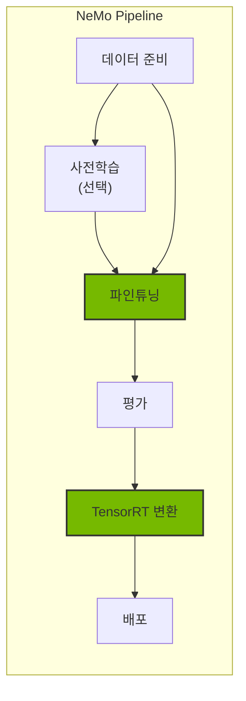
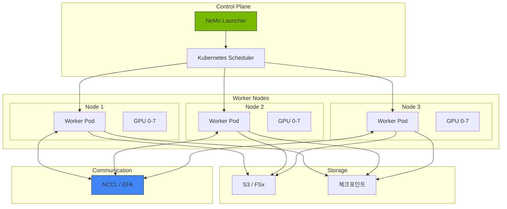
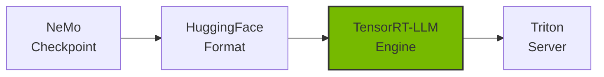
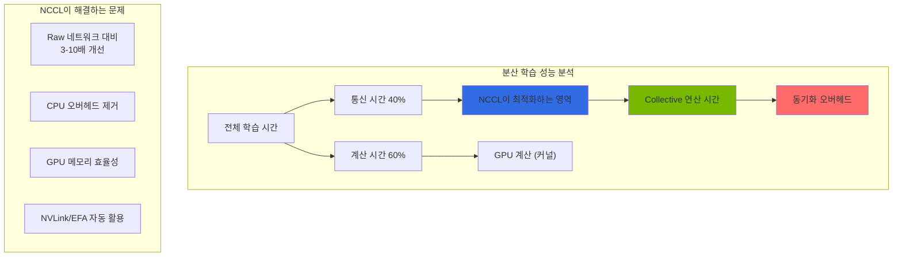
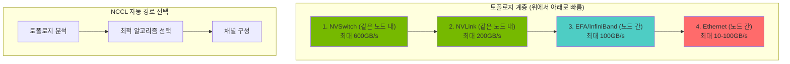

import { NemoComponents, GPURequirements, CheckpointSharding, MonitoringMetrics, NCCLImportance } from '@site/src/components/NemoTables';

# NeMo 프레임워크

> 📅 **작성일**: 2026-02-13 | ⏱️ **읽는 시간**: 약 26분

NVIDIA NeMo는 대규모 언어 모델(LLM)의 학습, 파인튜닝, 최적화를 위한 엔드투엔드 프레임워크입니다. Kubernetes 환경에서 분산 학습과 효율적인 모델 배포를 지원합니다.

## 개요

### NeMo가 필요한 이유

Agentic AI 플랫폼에서 도메인 특화 모델이 필요한 경우:

- **도메인 적응**: 특정 산업/분야에 맞는 모델 커스터마이징
- **성능 최적화**: TensorRT-LLM을 통한 추론 가속
- **비용 효율**: 작은 파인튜닝 모델로 대형 모델 대체
- **데이터 프라이버시**: 민감한 데이터로 온프레미스 학습



### NeMo 프레임워크 구성요소

<NemoComponents />

## EKS 배포 아키텍처

### 분산 학습 아키텍처



### GPU 노드 요구사항

<GPURequirements />

## NeMo 컨테이너 배포

### Helm 차트 설치

```bash
# NVIDIA NGC 레지스트리 인증
kubectl create secret docker-registry ngc-secret \
  --docker-server=nvcr.io \
  --docker-username='$oauthtoken' \
  --docker-password=${NGC_API_KEY} \
  --namespace=nemo

# NeMo Operator 설치
helm repo add nvidia https://helm.ngc.nvidia.com/nvidia
helm repo update

helm install nemo-operator nvidia/nemo-operator \
  --namespace nemo \
  --create-namespace \
  --set operator.image.repository=nvcr.io/nvidia/nemo-operator \
  --set operator.image.tag=24.07
```

### NeMo 학습 Job 정의

:::info 참고
아래 `NeMoTraining` CRD는 NeMo의 선언적 학습 정의 개념을 보여주는 예시입니다. 실제 배포 시에는 Kubeflow Training Operator의 PyTorchJob을 사용하여 분산 학습을 구성합니다.
:::

```yaml
# NeMo 학습 개념 예시 (실제로는 PyTorchJob 사용)
apiVersion: nemo.nvidia.com/v1alpha1
kind: NeMoTraining
metadata:
  name: llama-finetune
  namespace: nemo
spec:
  # 모델 설정
  model:
    name: "meta-llama/Llama-3.1-8B-Instruct"
    source: "huggingface"
  
  # 학습 설정
  training:
    type: "sft"  # supervised fine-tuning
    epochs: 3
    batchSize: 4
    gradientAccumulationSteps: 8
    learningRate: 2e-5
    
    # 분산 학습 설정
    distributed:
      tensorParallelism: 1
      pipelineParallelism: 1
      dataParallelism: 8
  
  # 데이터 설정
  data:
    trainDataset: "s3://nemo-data/train.jsonl"
    valDataset: "s3://nemo-data/val.jsonl"
    format: "jsonl"
  
  # 리소스 설정
  resources:
    nodes: 1
    gpusPerNode: 8
    gpuType: "nvidia.com/gpu"
    
  # 체크포인트 설정
  checkpoint:
    enabled: true
    path: "s3://nemo-checkpoints/llama-finetune"
    saveInterval: 500
    
  # 컨테이너 이미지
  image:
    repository: "nvcr.io/nvidia/nemo"
    tag: "24.07"
    pullSecrets:
      - name: ngc-secret
```

### PyTorchJob을 통한 분산 학습

```yaml
apiVersion: kubeflow.org/v1
kind: PyTorchJob
metadata:
  name: nemo-distributed-training
  namespace: nemo
spec:
  pytorchReplicaSpecs:
    Master:
      replicas: 1
      restartPolicy: OnFailure
      template:
        spec:
          containers:
          - name: pytorch
            image: nvcr.io/nvidia/nemo:24.07
            command:
            - python
            - -m
            - nemo.collections.llm.recipes.finetune
            - --config-path=/config
            - --config-name=llama_finetune
            env:
            - name: NCCL_DEBUG
              value: "INFO"
            - name: NCCL_IB_DISABLE
              value: "0"
            - name: FI_PROVIDER
              value: "efa"
            - name: FI_EFA_USE_DEVICE_RDMA
              value: "1"
            - name: NCCL_PROTO
              value: "simple"
            resources:
              limits:
                nvidia.com/gpu: 8
                vpc.amazonaws.com/efa: 4
            volumeMounts:
            - name: config
              mountPath: /config
            - name: data
              mountPath: /data
            - name: shm
              mountPath: /dev/shm
          volumes:
          - name: config
            configMap:
              name: nemo-config
          - name: data
            persistentVolumeClaim:
              claimName: training-data-pvc
          - name: shm
            emptyDir:
              medium: Memory
              sizeLimit: 64Gi
    Worker:
      replicas: 3
      restartPolicy: OnFailure
      template:
        spec:
          containers:
          - name: pytorch
            image: nvcr.io/nvidia/nemo:24.07
            # Worker 설정은 Master와 동일
```

## 파인튜닝 가이드

### SFT (Supervised Fine-Tuning)

```python
# nemo_sft_config.yaml
trainer:
  devices: 8
  num_nodes: 1
  accelerator: gpu
  precision: bf16
  max_epochs: 3
  val_check_interval: 500
  
model:
  # 기본 모델
  restore_from_path: /models/llama-3.1-8b.nemo
  
  # LoRA 설정 (효율적인 파인튜닝)
  peft:
    peft_scheme: "lora"
    lora_tuning:
      adapter_dim: 32
      alpha: 32
      dropout: 0.1
      target_modules:
        - "q_proj"
        - "v_proj"
        - "k_proj"
        - "o_proj"
  
  # 데이터 설정
  data:
    train_ds:
      file_path: /data/train.jsonl
      micro_batch_size: 4
      global_batch_size: 32
    validation_ds:
      file_path: /data/val.jsonl
      micro_batch_size: 4
      
  # 옵티마이저 설정
  optim:
    name: fused_adam
    lr: 2e-5
    weight_decay: 0.01
    betas:
      - 0.9
      - 0.98
```

### 데이터 형식

```json
{"input": "다음 질문에 답하세요: EKS란 무엇인가요?", "output": "Amazon EKS(Elastic Kubernetes Service)는 AWS에서 제공하는 관리형 Kubernetes 서비스입니다."}
{"input": "Karpenter의 주요 기능을 설명하세요.", "output": "Karpenter는 자동 노드 프로비저닝, 통합(consolidation), 드리프트 감지 기능을 제공하는 Kubernetes 노드 오토스케일러입니다."}
```

### PEFT/LoRA 파인튜닝

```python
from nemo.collections.llm import finetune
from nemo.collections.llm.peft import LoRA

# LoRA 설정
lora_config = LoRA(
    r=32,
    alpha=32,
    dropout=0.1,
    target_modules=["q_proj", "v_proj", "k_proj", "o_proj"],
)

# 파인튜닝 실행
model = finetune(
    model_path="/models/llama-3.1-8b.nemo",
    data_path="/data/train.jsonl",
    peft_config=lora_config,
    trainer_config={
        "devices": 8,
        "max_epochs": 3,
        "precision": "bf16",
    },
    output_path="/output/llama-2-7b-finetuned",
)
```

## 체크포인트 관리

### 대규모 모델 체크포인트 샤딩 (>70B)

70B 이상의 대규모 모델은 단일 체크포인트 파일이 수백 GB에 달할 수 있습니다. NeMo는 체크포인트 샤딩을 통해 이를 효율적으로 관리합니다:

```yaml
# 대규모 모델 체크포인트 샤딩 설정
trainer:
  checkpoint:
    # 샤딩 활성화
    save_sharded_checkpoint: true
    
    # 샤드 크기 (GB 단위)
    shard_size_gb: 10
    
    # 병렬 저장 워커 수
    num_workers: 8
    
    # 체크포인트 압축
    compression: "gzip"
```

**샤딩 전략:**

<CheckpointSharding />

```python
# 샤딩된 체크포인트 로드
from nemo.collections.nlp.models import MegatronGPTModel

# 자동으로 모든 샤드를 병렬 로드
model = MegatronGPTModel.restore_from(
    restore_path="s3://checkpoints/llama-405b/sharded",
    trainer=trainer,
)
```

### S3 체크포인트 저장

```yaml
apiVersion: v1
kind: ConfigMap
metadata:
  name: nemo-checkpoint-config
  namespace: nemo
data:
  checkpoint.yaml: |
    checkpoint:
      save_dir: "s3://nemo-checkpoints/${JOB_NAME}"
      save_top_k: 3
      save_last: true
      save_interval: 500
      
      # 자동 복구 설정
      resume:
        enabled: true
        resume_from_checkpoint: "auto"  # 최신 체크포인트에서 자동 복구
```

### 체크포인트 변환

```bash
# NeMo 체크포인트를 HuggingFace 형식으로 변환
python -m nemo.collections.llm.scripts.convert_nemo_to_hf \
  --input_path /checkpoints/llama-finetuned.nemo \
  --output_path /models/llama-finetuned-hf \
  --model_type llama
```

## TensorRT-LLM 변환 및 최적화

### 모델 변환 파이프라인



### TensorRT-LLM 변환 스크립트

```python
# convert_to_trt.py
# TensorRT-LLM 0.8+ API 사용
from tensorrt_llm import LLM

# 모델 변환 (from_pretrained API 사용)
llm = LLM(
    model="/models/llama-finetuned-hf",
    # 빌드 설정
    max_input_len=4096,
    max_output_len=2048,
    max_batch_size=64,
    
    # 양자화 설정
    dtype="fp8",  # FP8 양자화로 메모리 절약
    
    # 최적화 설정
    enable_paged_kv_cache=True,
    enable_chunked_context=True,
)

# 엔진 저장
llm.save("/engines/llama-finetuned-trt")
```

### Kubernetes Job으로 변환 실행

```yaml
apiVersion: batch/v1
kind: Job
metadata:
  name: trt-llm-conversion
  namespace: nemo
spec:
  template:
    spec:
      containers:
      - name: converter
        image: nvcr.io/nvidia/tritonserver:24.07-trtllm-python-py3
        command:
        - python
        - /scripts/convert_to_trt.py
        - --input=/models/llama-finetuned-hf
        - --output=/engines/llama-finetuned-trt
        - --quantization=fp8
        - --max-batch-size=64
        resources:
          limits:
            nvidia.com/gpu: 1
            memory: "80Gi"
        volumeMounts:
        - name: models
          mountPath: /models
        - name: engines
          mountPath: /engines
        - name: scripts
          mountPath: /scripts
      volumes:
      - name: models
        persistentVolumeClaim:
          claimName: models-pvc
      - name: engines
        persistentVolumeClaim:
          claimName: engines-pvc
      - name: scripts
        configMap:
          name: conversion-scripts
      restartPolicy: Never
```

## Triton Inference Server 배포

### TensorRT-LLM 백엔드 설정

```yaml
apiVersion: apps/v1
kind: Deployment
metadata:
  name: triton-trtllm
  namespace: inference
spec:
  replicas: 2
  selector:
    matchLabels:
      app: triton-trtllm
  template:
    metadata:
      labels:
        app: triton-trtllm
    spec:
      containers:
      - name: triton
        image: nvcr.io/nvidia/tritonserver:24.07-trtllm-python-py3
        args:
        - tritonserver
        - --model-repository=/models
        - --http-port=8000
        - --grpc-port=8001
        - --metrics-port=8002
        ports:
        - containerPort: 8000
          name: http
        - containerPort: 8001
          name: grpc
        - containerPort: 8002
          name: metrics
        resources:
          limits:
            nvidia.com/gpu: 1
            memory: "80Gi"
        volumeMounts:
        - name: model-repository
          mountPath: /models
      volumes:
      - name: model-repository
        persistentVolumeClaim:
          claimName: triton-models-pvc
```

### 모델 저장소 구조

```
/models/
└── llama-finetuned/
    ├── config.pbtxt
    ├── 1/
    │   └── model.plan
    └── tokenizer/
        ├── tokenizer.json
        └── tokenizer_config.json
```

### config.pbtxt 설정

```protobuf
name: "llama-finetuned"
backend: "tensorrtllm"
max_batch_size: 64

input [
  {
    name: "input_ids"
    data_type: TYPE_INT32
    dims: [-1]
  },
  {
    name: "input_lengths"
    data_type: TYPE_INT32
    dims: [1]
  }
]

output [
  {
    name: "output_ids"
    data_type: TYPE_INT32
    dims: [-1]
  }
]

instance_group [
  {
    count: 1
    kind: KIND_GPU
    gpus: [0]
  }
]

parameters {
  key: "max_tokens_in_paged_kv_cache"
  value: { string_value: "8192" }
}

parameters {
  key: "batch_scheduler_policy"
  value: { string_value: "inflight_fused_batching" }
}
```

## 모니터링 및 로깅

### 학습 메트릭 수집

```yaml
apiVersion: monitoring.coreos.com/v1
kind: ServiceMonitor
metadata:
  name: nemo-training-monitor
  namespace: nemo
spec:
  selector:
    matchLabels:
      app: nemo-training
  endpoints:
  - port: metrics
    interval: 30s
    path: /metrics
```

### 주요 모니터링 메트릭

<MonitoringMetrics />

---

## NCCL 심층 분석: 분산 학습 통신 최적화

### NCCL의 역할과 중요성

NCCL (**NVIDIA Collective Communication Library**)는 분산 GPU 학습에서 **multi-GPU 간 고속 통신**을 담당하는 핵심 라이브러리입니다. 딥러닝 모델의 성능은 NCCL의 최적화 정도에 직접적으로 영향을 미칩니다.



**분산 학습에서 NCCL이 중요한 이유:**

<NCCLImportance />

### 핵심 집합 연산 (Collective Operations)

#### 1. AllReduce - 가장 중요한 연산

AllReduce는 모든 GPU의 데이터를 합산하고 결과를 모든 GPU에 배분합니다:

```
초기 상태:
GPU 0: [1, 2, 3]
GPU 1: [4, 5, 6]
GPU 2: [7, 8, 9]
GPU 3: [10, 11, 12]

AllReduce 후:
GPU 0: [22, 26, 30]  # 1+4+7+10, 2+5+8+11, 3+6+9+12
GPU 1: [22, 26, 30]
GPU 2: [22, 26, 30]
GPU 3: [22, 26, 30]
```

**AllReduce 사용 예시 (분산 학습에서):**

```python
import torch
import torch.distributed as dist

# 분산 학습 초기화
dist.init_process_group("nccl")
rank = dist.get_rank()
world_size = dist.get_world_size()

# 각 GPU의 그래디언트 (서로 다름)
gradients = torch.randn(1024, device=f"cuda:{rank}")

# AllReduce: 모든 GPU의 그래디언트 합산 및 평균화
dist.all_reduce(gradients, op=dist.ReduceOp.SUM)
gradients /= world_size

# 이제 모든 GPU가 동일한 그래디언트를 가짐
# 모델 가중치 업데이트 시 동기화됨
```

#### 2. AllGather - 모든 데이터 수집

AllGather는 모든 GPU의 데이터를 수집하여 각 GPU에 전체 데이터를 배분합니다:

```
초기 상태:
GPU 0: [1, 2]
GPU 1: [3, 4]
GPU 2: [5, 6]
GPU 3: [7, 8]

AllGather 후:
GPU 0: [1, 2, 3, 4, 5, 6, 7, 8]
GPU 1: [1, 2, 3, 4, 5, 6, 7, 8]
GPU 2: [1, 2, 3, 4, 5, 6, 7, 8]
GPU 3: [1, 2, 3, 4, 5, 6, 7, 8]
```

**AllGather 사용 사례:**

```python
# 예시: 배치 정규화에서 모든 GPU의 통계 수집
local_batch_stats = compute_batch_stats(local_batch)

# AllGather로 모든 GPU의 통계 수집
all_batch_stats = [torch.empty_like(local_batch_stats) for _ in range(world_size)]
dist.all_gather(all_batch_stats, local_batch_stats)

# 전역 통계 계산
global_mean = torch.stack(all_batch_stats).mean(dim=0)
global_std = torch.stack(all_batch_stats).std(dim=0)
```

#### 3. ReduceScatter - AllGather의 역연산

ReduceScatter는 데이터를 먼저 합산한 후 각 GPU에 분할하여 배분합니다:

```
초기 상태:
GPU 0: [1, 2, 3, 4, 5, 6, 7, 8]
GPU 1: [9, 10, 11, 12, 13, 14, 15, 16]
GPU 2: [17, 18, 19, 20, 21, 22, 23, 24]
GPU 3: [25, 26, 27, 28, 29, 30, 31, 32]

ReduceScatter 합산 후 분할:
GPU 0: [52, 56]      # (1+9+17+25), (2+10+18+26)
GPU 1: [60, 64]      # (3+11+19+27), (4+12+20+28)
GPU 2: [68, 72]      # (5+13+21+29), (6+14+22+30)
GPU 3: [76, 80]      # (7+15+23+31), (8+16+24+32)
```

**ReduceScatter 사용 사례 (Model Parallelism):**

```python
# 모델 병렬화에서 계산 결과를 합산하고 분할
local_output = model_fragment(input_data)

# ReduceScatter: 모든 프래그먼트 합산 후 각 GPU에 분할
reduced_output = torch.empty(output_size // world_size, device=local_output.device)
dist.reduce_scatter(reduced_output, [local_output] * world_size)
```

#### 4. Broadcast - 데이터 배포

Broadcast는 한 GPU의 데이터를 모든 GPU에 복사합니다:

```
초기 상태:
GPU 0: [1, 2, 3, 4]
GPU 1: [0, 0, 0, 0]
GPU 2: [0, 0, 0, 0]
GPU 3: [0, 0, 0, 0]

Broadcast 후:
GPU 0: [1, 2, 3, 4]
GPU 1: [1, 2, 3, 4]
GPU 2: [1, 2, 3, 4]
GPU 3: [1, 2, 3, 4]
```

**Broadcast 사용 사례:**

```python
# 마스터 GPU에서 모델 체크포인트 브로드캐스트
model_state = load_checkpoint() if rank == 0 else None

# Broadcast: 마스터 GPU의 모델 상태를 모든 GPU에 배포
dist.broadcast_object_list([model_state], src=0)
model.load_state_dict(model_state)
```

### 네트워크 토폴로지 인식

NCCL은 GPU 간 물리적 연결 토폴로지를 자동으로 감지하고 최적의 경로를 선택합니다:



### NCCL 성능 튜닝 파라미터

```yaml
# NCCL 환경 변수 완벽 가이드

# 1. 알고리즘 선택
export NCCL_ALGO=Ring           # Ring (기본), Tree, CollNet
export NCCL_ALGO_ALL=Ring       # AllReduce 알고리즘 지정
export NCCL_ALGO_TREE=Tree      # Tree 알고리즘 강제

# 2. 프로토콜 선택
export NCCL_PROTO=Simple        # Simple (기본) 또는 LL (Low Latency)

# 3. 채널 설정 (매우 중요)
export NCCL_MIN_NCHANNELS=4     # 최소 채널 수 (기본 4)
export NCCL_MAX_NCHANNELS=8     # 최대 채널 수 (기본 32)

# 4. 버퍼 크기
export NCCL_BUFFSIZE=2097152    # 기본 2MB, 1MB-4MB 권장

# 5. 디버그 설정
export NCCL_DEBUG=INFO          # TRACE, DEBUG, INFO, WARN
export NCCL_DEBUG_FILE=/var/log/nccl-debug.txt
export NCCL_DEBUG_SUBSYS=ALL    # 모든 서브시스템 추적

# 6. 네트워크 인터페이스
export NCCL_SOCKET_IFNAME=eth0  # 사용할 네트워크 인터페이스
export NCCL_IB_DISABLE=0        # InfiniBand 사용

# 7. EFA 설정 (AWS)
export FI_PROVIDER=efa
export FI_EFA_USE_DEVICE_RDMA=1
export FI_EFA_FORK_SAFE=1

# 8. 커널 최적화
export NCCL_CHECKS_DISABLE=0    # 안전 검사 활성화 (프로덕션)
export NCCL_COMM_BLOCKING_WAIT=0
export NCCL_ASYNC_ERROR_HANDLING=1

# 9. P2P 설정
export NCCL_P2P_DISABLE=0       # GPU P2P 통신 활성화
export NCCL_P2P_LEVEL=SYS       # P2P 레벨: LOC (로컬), SYS (시스템)

# 10. 타임아웃 설정
export NCCL_COMM_WAIT_TIMEOUT=0 # 0 = 무한 대기
```

---

## 관련 문서

- [GPU 리소스 관리](./gpu-resource-management.md)
- [MoE 모델 서빙](./moe-model-serving.md)
- [Inference Gateway](./inference-gateway-routing.md)

:::tip 권장 사항

- 파인튜닝 전 기본 모델로 베이스라인 성능을 측정하세요
- LoRA/QLoRA를 사용하면 적은 GPU로도 대형 모델 파인튜닝이 가능합니다
- TensorRT-LLM 변환으로 추론 성능을 2-4배 향상시킬 수 있습니다
- NCCL 환경 변수를 적절히 설정하면 분산 학습 성능을 크게 개선할 수 있습니다
:::

:::warning 주의사항

- 대규모 학습은 상당한 GPU 비용이 발생합니다. Spot 인스턴스와 체크포인트를 활용하세요
- 분산 학습 시 NCCL 통신 오버헤드를 고려하여 노드 수를 결정하세요
- 체크포인트는 반드시 S3 등 영구 스토리지에 저장하세요
- EFA 사용 시 적절한 보안 그룹 설정이 필요합니다 (모든 트래픽 허용)
:::
