# NeMo 프레임워크

> 📅 **작성일**: 2025-02-05 | ⏱️ **읽는 시간**: 약 26분

NVIDIA NeMo는 대규모 언어 모델(LLM)의 학습, 파인튜닝, 최적화를 위한 엔드투엔드 프레임워크입니다. Kubernetes 환경에서 분산 학습과 효율적인 모델 배포를 지원합니다.

## 개요

### NeMo가 필요한 이유

Agentic AI 플랫폼에서 도메인 특화 모델이 필요한 경우:

- **도메인 적응**: 특정 산업/분야에 맞는 모델 커스터마이징
- **성능 최적화**: TensorRT-LLM을 통한 추론 가속
- **비용 효율**: 작은 파인튜닝 모델로 대형 모델 대체
- **데이터 프라이버시**: 민감한 데이터로 온프레미스 학습

```mermaid
graph LR
    subgraph "NeMo Pipeline"
        Data["데이터 준비"]
        Pretrain["사전학습<br/>(선택)"]
        Finetune["파인튜닝"]
        Eval["평가"]
        Export["TensorRT 변환"]
        Deploy["배포"]
    end
    
    Data --> Pretrain
    Pretrain --> Finetune
    Data --> Finetune
    Finetune --> Eval
    Eval --> Export
    Export --> Deploy
    
    style Finetune fill:#76b900,stroke:#333,stroke-width:2px
    style Export fill:#76b900,stroke:#333,stroke-width:2px
```



### NeMo 프레임워크 구성요소

| 컴포넌트 | 역할 | 주요 기능 |
| --- | --- | --- |
| NeMo Core | 기본 프레임워크 | 모델 정의, 학습 루프 |
| NeMo Curator | 데이터 처리 | 데이터 필터링, 중복 제거 |
| NeMo Aligner | 정렬 학습 | RLHF, DPO, SFT |
| NeMo Guardrails | 안전성 | 입출력 필터링 |

## EKS 배포 아키텍처

### 분산 학습 아키텍처


### GPU 노드 요구사항

| 모델 크기 | 최소 GPU | 권장 인스턴스 | 메모리 요구 |
| --- | --- | --- | --- |
| 7B | 1x A100 80GB | p4d.24xlarge | 80GB+ |
| 13B | 2x A100 80GB | p4d.24xlarge | 160GB+ |
| 70B | 8x A100 80GB | p4d.24xlarge | 640GB+ |
| 405B | 32x H100 | p5.48xlarge x4 | 2.5TB+ |

## NeMo 컨테이너 배포

### Helm 차트 설치

```bash
# NVIDIA NGC 레지스트리 인증
kubectl create secret docker-registry ngc-secret \
  --docker-server=nvcr.io \
  --docker-username='$oauthtoken' \
  --docker-password=${NGC_API_KEY} \
  --namespace=nemo

# NeMo Operator 설치
helm repo add nvidia https://helm.ngc.nvidia.com/nvidia
helm repo update

helm install nemo-operator nvidia/nemo-operator \
  --namespace nemo \
  --create-namespace \
  --set operator.image.repository=nvcr.io/nvidia/nemo-operator \
  --set operator.image.tag=24.07
```

### NeMo 학습 Job 정의

```yaml
apiVersion: nemo.nvidia.com/v1alpha1
kind: NeMoTraining
metadata:
  name: llama-finetune
  namespace: nemo
spec:
  # 모델 설정
  model:
    name: "meta-llama/Llama-2-7b-hf"
    source: "huggingface"
  
  # 학습 설정
  training:
    type: "sft"  # supervised fine-tuning
    epochs: 3
    batchSize: 4
    gradientAccumulationSteps: 8
    learningRate: 2e-5
    
    # 분산 학습 설정
    distributed:
      tensorParallelism: 1
      pipelineParallelism: 1
      dataParallelism: 8
  
  # 데이터 설정
  data:
    trainDataset: "s3://nemo-data/train.jsonl"
    valDataset: "s3://nemo-data/val.jsonl"
    format: "jsonl"
  
  # 리소스 설정
  resources:
    nodes: 1
    gpusPerNode: 8
    gpuType: "nvidia.com/gpu"
    
  # 체크포인트 설정
  checkpoint:
    enabled: true
    path: "s3://nemo-checkpoints/llama-finetune"
    saveInterval: 500
    
  # 컨테이너 이미지
  image:
    repository: "nvcr.io/nvidia/nemo"
    tag: "24.07"
    pullSecrets:
      - name: ngc-secret
```

### PyTorchJob을 통한 분산 학습

```yaml
apiVersion: kubeflow.org/v1
kind: PyTorchJob
metadata:
  name: nemo-distributed-training
  namespace: nemo
spec:
  pytorchReplicaSpecs:
    Master:
      replicas: 1
      restartPolicy: OnFailure
      template:
        spec:
          containers:
          - name: pytorch
            image: nvcr.io/nvidia/nemo:24.07
            command:
            - python
            - -m
            - nemo.collections.llm.recipes.finetune
            - --config-path=/config
            - --config-name=llama_finetune
            env:
            - name: NCCL_DEBUG
              value: "INFO"
            - name: NCCL_IB_DISABLE
              value: "0"
            resources:
              limits:
                nvidia.com/gpu: 8
                vpc.amazonaws.com/efa: 4
            volumeMounts:
            - name: config
              mountPath: /config
            - name: data
              mountPath: /data
            - name: shm
              mountPath: /dev/shm
          volumes:
          - name: config
            configMap:
              name: nemo-config
          - name: data
            persistentVolumeClaim:
              claimName: training-data-pvc
          - name: shm
            emptyDir:
              medium: Memory
              sizeLimit: 64Gi
    Worker:
      replicas: 3
      restartPolicy: OnFailure
      template:
        spec:
          containers:
          - name: pytorch
            image: nvcr.io/nvidia/nemo:24.07
            # Worker 설정은 Master와 동일
```

## 파인튜닝 가이드

### SFT (Supervised Fine-Tuning)

```python
# nemo_sft_config.yaml
trainer:
  devices: 8
  num_nodes: 1
  accelerator: gpu
  precision: bf16
  max_epochs: 3
  val_check_interval: 500
  
model:
  # 기본 모델
  restore_from_path: /models/llama-2-7b.nemo
  
  # LoRA 설정 (효율적인 파인튜닝)
  peft:
    peft_scheme: "lora"
    lora_tuning:
      adapter_dim: 32
      alpha: 32
      dropout: 0.1
      target_modules:
        - "q_proj"
        - "v_proj"
        - "k_proj"
        - "o_proj"
  
  # 데이터 설정
  data:
    train_ds:
      file_path: /data/train.jsonl
      micro_batch_size: 4
      global_batch_size: 32
    validation_ds:
      file_path: /data/val.jsonl
      micro_batch_size: 4
      
  # 옵티마이저 설정
  optim:
    name: fused_adam
    lr: 2e-5
    weight_decay: 0.01
    betas:
      - 0.9
      - 0.98
```

### 데이터 형식

```json
{"input": "다음 질문에 답하세요: EKS란 무엇인가요?", "output": "Amazon EKS(Elastic Kubernetes Service)는 AWS에서 제공하는 관리형 Kubernetes 서비스입니다."}
{"input": "Karpenter의 주요 기능을 설명하세요.", "output": "Karpenter는 자동 노드 프로비저닝, 통합(consolidation), 드리프트 감지 기능을 제공하는 Kubernetes 노드 오토스케일러입니다."}
```

### PEFT/LoRA 파인튜닝

```python
from nemo.collections.llm import finetune
from nemo.collections.llm.peft import LoRA

# LoRA 설정
lora_config = LoRA(
    r=32,
    alpha=32,
    dropout=0.1,
    target_modules=["q_proj", "v_proj", "k_proj", "o_proj"],
)

# 파인튜닝 실행
model = finetune(
    model_path="/models/llama-2-7b.nemo",
    data_path="/data/train.jsonl",
    peft_config=lora_config,
    trainer_config={
        "devices": 8,
        "max_epochs": 3,
        "precision": "bf16",
    },
    output_path="/output/llama-2-7b-finetuned",
)
```

## 체크포인트 관리

### S3 체크포인트 저장

```yaml
apiVersion: v1
kind: ConfigMap
metadata:
  name: nemo-checkpoint-config
  namespace: nemo
data:
  checkpoint.yaml: |
    checkpoint:
      save_dir: "s3://nemo-checkpoints/${JOB_NAME}"
      save_top_k: 3
      save_last: true
      save_interval: 500
      
      # 자동 복구 설정
      resume:
        enabled: true
        resume_from_checkpoint: "auto"  # 최신 체크포인트에서 자동 복구
```

### 체크포인트 변환

```bash
# NeMo 체크포인트를 HuggingFace 형식으로 변환
python -m nemo.collections.llm.scripts.convert_nemo_to_hf \
  --input_path /checkpoints/llama-finetuned.nemo \
  --output_path /models/llama-finetuned-hf \
  --model_type llama
```

## TensorRT-LLM 변환 및 최적화

### 모델 변환 파이프라인


### TensorRT-LLM 변환 스크립트

```python
# convert_to_trt.py
from tensorrt_llm import LLM, SamplingParams
from tensorrt_llm.builder import BuildConfig

# 빌드 설정
build_config = BuildConfig(
    max_input_len=4096,
    max_output_len=2048,
    max_batch_size=64,
    
    # 양자화 설정
    quantization="fp8",  # FP8 양자화로 메모리 절약
    
    # 최적화 설정
    use_paged_kv_cache=True,
    use_inflight_batching=True,
)

# 모델 변환
llm = LLM(
    model="/models/llama-finetuned-hf",
    build_config=build_config,
)

# 엔진 저장
llm.save("/engines/llama-finetuned-trt")
```

### Kubernetes Job으로 변환 실행

```yaml
apiVersion: batch/v1
kind: Job
metadata:
  name: trt-llm-conversion
  namespace: nemo
spec:
  template:
    spec:
      containers:
      - name: converter
        image: nvcr.io/nvidia/tritonserver:24.07-trtllm-python-py3
        command:
        - python
        - /scripts/convert_to_trt.py
        - --input=/models/llama-finetuned-hf
        - --output=/engines/llama-finetuned-trt
        - --quantization=fp8
        - --max-batch-size=64
        resources:
          limits:
            nvidia.com/gpu: 1
            memory: "80Gi"
        volumeMounts:
        - name: models
          mountPath: /models
        - name: engines
          mountPath: /engines
        - name: scripts
          mountPath: /scripts
      volumes:
      - name: models
        persistentVolumeClaim:
          claimName: models-pvc
      - name: engines
        persistentVolumeClaim:
          claimName: engines-pvc
      - name: scripts
        configMap:
          name: conversion-scripts
      restartPolicy: Never
```

## Triton Inference Server 배포

### TensorRT-LLM 백엔드 설정

```yaml
apiVersion: apps/v1
kind: Deployment
metadata:
  name: triton-trtllm
  namespace: inference
spec:
  replicas: 2
  selector:
    matchLabels:
      app: triton-trtllm
  template:
    metadata:
      labels:
        app: triton-trtllm
    spec:
      containers:
      - name: triton
        image: nvcr.io/nvidia/tritonserver:24.07-trtllm-python-py3
        args:
        - tritonserver
        - --model-repository=/models
        - --http-port=8000
        - --grpc-port=8001
        - --metrics-port=8002
        ports:
        - containerPort: 8000
          name: http
        - containerPort: 8001
          name: grpc
        - containerPort: 8002
          name: metrics
        resources:
          limits:
            nvidia.com/gpu: 1
            memory: "80Gi"
        volumeMounts:
        - name: model-repository
          mountPath: /models
      volumes:
      - name: model-repository
        persistentVolumeClaim:
          claimName: triton-models-pvc
```

### 모델 저장소 구조

```
/models/
└── llama-finetuned/
    ├── config.pbtxt
    ├── 1/
    │   └── model.plan
    └── tokenizer/
        ├── tokenizer.json
        └── tokenizer_config.json
```

### config.pbtxt 설정

```protobuf
name: "llama-finetuned"
backend: "tensorrtllm"
max_batch_size: 64

input [
  {
    name: "input_ids"
    data_type: TYPE_INT32
    dims: [-1]
  },
  {
    name: "input_lengths"
    data_type: TYPE_INT32
    dims: [1]
  }
]

output [
  {
    name: "output_ids"
    data_type: TYPE_INT32
    dims: [-1]
  }
]

instance_group [
  {
    count: 1
    kind: KIND_GPU
    gpus: [0]
  }
]

parameters {
  key: "max_tokens_in_paged_kv_cache"
  value: { string_value: "8192" }
}

parameters {
  key: "batch_scheduler_policy"
  value: { string_value: "inflight_fused_batching" }
}
```

## 모니터링 및 로깅

### 학습 메트릭 수집

```yaml
apiVersion: monitoring.coreos.com/v1
kind: ServiceMonitor
metadata:
  name: nemo-training-monitor
  namespace: nemo
spec:
  selector:
    matchLabels:
      app: nemo-training
  endpoints:
  - port: metrics
    interval: 30s
    path: /metrics
```

### 주요 모니터링 메트릭

| 메트릭 | 설명 | 임계값 |
| --- | --- | --- |
| training_loss | 학습 손실 | 지속적 감소 |
| validation_loss | 검증 손실 | 학습 손실과 유사 |
| gpu_utilization | GPU 사용률 | > 80% |
| gpu_memory_used | GPU 메모리 사용량 | < 95% |
| throughput_tokens_per_sec | 처리량 | 모니터링 |

## 관련 문서

- [GPU 리소스 관리](./gpu-resource-management.md)
- [MoE 모델 서빙](./moe-model-serving.md)
- [Inference Gateway](./inference-gateway-routing.md)

:::tip 권장 사항
- 파인튜닝 전 기본 모델로 베이스라인 성능을 측정하세요
- LoRA/QLoRA를 사용하면 적은 GPU로도 대형 모델 파인튜닝이 가능합니다
- TensorRT-LLM 변환으로 추론 성능을 2-4배 향상시킬 수 있습니다
:::

:::warning 주의사항
- 대규모 학습은 상당한 GPU 비용이 발생합니다. Spot 인스턴스와 체크포인트를 활용하세요
- 분산 학습 시 NCCL 통신 오버헤드를 고려하여 노드 수를 결정하세요
- 체크포인트는 반드시 S3 등 영구 스토리지에 저장하세요
:::
