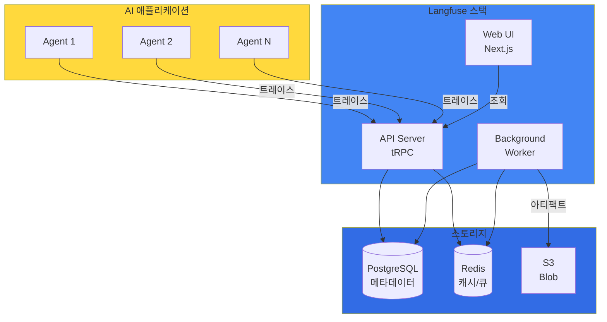
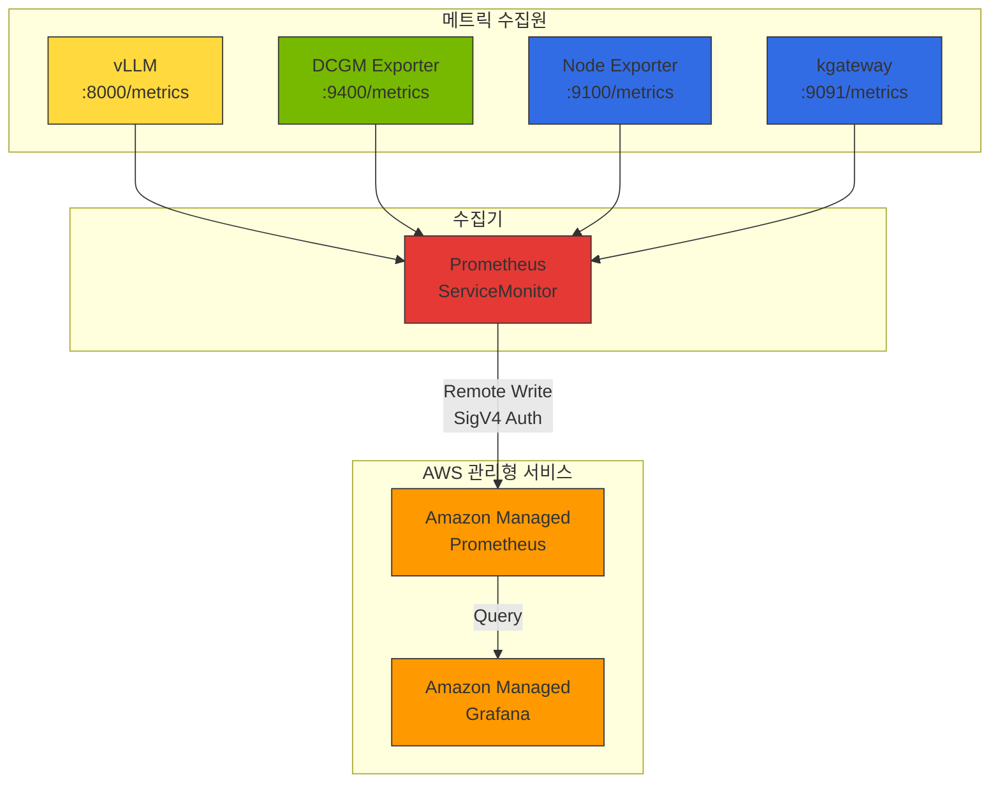
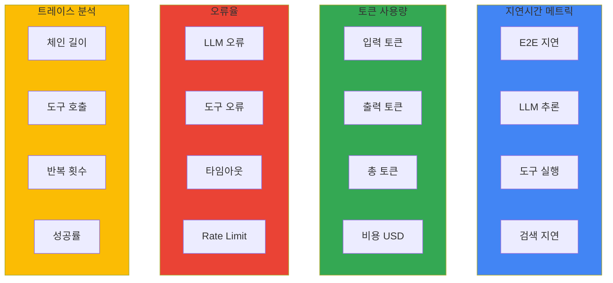

import {
  LangFuseVsLangSmithTable,
  LatencyMetricsTable,
  TokenUsageMetricsTable,
  ErrorRateMetricsTable,
  DailyChecksTable,
  WeeklyChecksTable,
  MaturityModelTable
} from '@site/src/components/AgentMonitoringTables';

# AI Agent 모니터링 및 운영

이 문서에서는 Agentic AI 애플리케이션의 모니터링 아키텍처, 핵심 메트릭 설계, 알림 전략을 개념 수준에서 다룹니다.

:::info 실전 배포 가이드
Langfuse Helm 배포, AMP/AMG 구성, ServiceMonitor YAML, Grafana 대시보드 JSON 등 실전 구성은 [모니터링 스택 구성 가이드](../reference-architecture/monitoring-observability-setup.md)를 참조하세요.
:::

## 개요

Agentic AI 애플리케이션은 복잡한 추론 체인과 다양한 도구 호출을 수행하기 때문에, 전통적인 APM(Application Performance Monitoring) 도구만으로는 충분한 가시성을 확보하기 어렵습니다. LLM 특화 관측성 도구인 Langfuse와 LangSmith는 다음과 같은 핵심 기능을 제공합니다:

- **트레이스 추적**: LLM 호출, 도구 실행, 에이전트 추론 과정의 전체 흐름 추적
- **토큰 사용량 분석**: 입력/출력 토큰 수 및 비용 계산
- **품질 평가**: 응답 품질 점수화 및 피드백 수집
- **디버깅**: 프롬프트 및 응답 내용 검토를 통한 문제 진단

:::info 대상 독자
이 문서는 플랫폼 운영자, MLOps 엔지니어, AI 개발자를 대상으로 합니다. Kubernetes와 Python에 대한 기본적인 이해가 필요합니다.
:::

---

## 모니터링 아키텍처

### Langfuse 아키텍처 개요

Langfuse v3.162.0 이상은 다음 컴포넌트로 구성됩니다:



### AMP/AMG 통합 데이터 흐름



### 모니터링 데이터 계층

| 계층 | 수집 도구 | 메트릭 패턴 | 확인 가능 항목 |
|------|----------|-----------|--------------|
| **LLM 추론** | Langfuse | trace, generation | 토큰 사용량, 비용, TTFT, 사용자별 패턴 |
| **모델 서버** | vLLM Prometheus | `vllm_*` | 요청 수, 배치 크기, KV cache 사용률, TPS |
| **GPU** | DCGM Exporter | `DCGM_FI_DEV_*` | GPU 활용도, 온도, 전력, 메모리 사용량 |
| **인프라** | Node Exporter | `node_*` | CPU, 메모리, 네트워크, 디스크 I/O |
| **게이트웨이** | kgateway | `envoy_*` | 요청 수, 레이턴시, 에러율, 업스트림 상태 |

---

## Langfuse vs LangSmith 비교

<LangFuseVsLangSmithTable />

:::tip 선택 가이드

- **Langfuse**: 데이터 주권이 중요하거나, 비용 최적화가 필요한 경우
- **LangSmith**: LangChain 기반 개발이 주력이고, 빠른 시작이 필요한 경우
:::

### AWS 네이티브 관측성: CloudWatch Generative AI Observability

Amazon CloudWatch Generative AI Observability는 LLM 및 AI 에이전트 모니터링을 위한 AWS 네이티브 솔루션입니다:

- **인프라 무관 모니터링**: Bedrock, EKS, ECS, 온프레미스 등 모든 환경의 AI 워크로드 지원
- **에이전트/도구 추적**: 에이전트, 지식 베이스, 도구 호출에 대한 기본 제공 뷰
- **엔드투엔드 트레이싱**: 전체 AI 스택에 걸친 추적
- **프레임워크 호환**: LangChain, LangGraph, CrewAI 등 외부 프레임워크 지원

Langfuse v3.x (Self-hosted 데이터 주권)와 CloudWatch Gen AI Observability(AWS 네이티브 통합)를 함께 사용하면 가장 포괄적인 관측성을 확보할 수 있습니다.

---

## 핵심 모니터링 메트릭

Agentic AI 애플리케이션에서 추적해야 할 핵심 메트릭을 정의합니다.

### 메트릭 카테고리



### Latency 메트릭

<LatencyMetricsTable />

### Token Usage 메트릭

<TokenUsageMetricsTable />

### Error Rate 메트릭

<ErrorRateMetricsTable />

---

## PromQL 쿼리 레퍼런스

### GPU 메트릭

```promql
# 전체 GPU 평균 활용도
avg(DCGM_FI_DEV_GPU_UTIL)

# 노드별 GPU 활용도
avg(DCGM_FI_DEV_GPU_UTIL) by (Hostname)

# GPU 메모리 사용률
avg(DCGM_FI_DEV_FB_USED / DCGM_FI_DEV_FB_FREE * 100) by (gpu)
```

### vLLM 메트릭

```promql
# 전체 TPS (초당 생성 토큰)
rate(vllm_generation_tokens_total[5m])

# 모델별 TPS
sum(rate(vllm_generation_tokens_total[5m])) by (model)

# TTFT P99 (Time to First Token)
histogram_quantile(0.99, rate(vllm_time_to_first_token_seconds_bucket[5m]))

# TTFT P95
histogram_quantile(0.95, rate(vllm_time_to_first_token_seconds_bucket[5m]))

# E2E 지연 P99
histogram_quantile(0.99, rate(vllm_e2e_request_latency_seconds_bucket[5m]))

# 배치 크기 평균
avg(vllm_num_requests_running)
```

### Gateway 메트릭

```promql
# 5xx 에러율 (%)
rate(envoy_http_downstream_rq_xx{envoy_response_code_class="5"}[5m]) 
/ 
rate(envoy_http_downstream_rq_total[5m]) * 100

# 업스트림 헬스 체크 실패율
sum(rate(envoy_cluster_upstream_cx_connect_fail[5m])) by (envoy_cluster_name)
```

### 비용 메트릭

```promql
# 일별 총 비용
sum(increase(llm_cost_dollars_total[24h]))

# 테넌트별 일별 비용
sum(increase(llm_cost_dollars_total[24h])) by (tenant_id)

# 모델별 비용 비율
sum(increase(llm_cost_dollars_total[24h])) by (model)
/ ignoring(model) group_left
sum(increase(llm_cost_dollars_total[24h]))

# 예산 대비 사용률 (월간)
sum(increase(llm_cost_dollars_total[30d])) by (tenant_id)
/ on(tenant_id) group_left
tenant_monthly_budget_usd
```

---

## 알림 전략

### 알림 임계값 설계

| 알림 | 조건 | 심각도 | 지속 시간 |
|------|------|--------|----------|
| **Agent High Latency** | P99 지연 > 10초 | Warning | 5분 |
| **Agent High Error Rate** | 에러율 > 5% | Critical | 5분 |
| **LLM Rate Limit** | Rate limit 에러 > 10건/5분 | Warning | 2분 |
| **Daily Cost Budget** | 일일 비용 > $100 | Warning | 즉시 |
| **GPU High Temperature** | GPU 온도 > 85도 | Warning | 5분 |
| **GPU Memory Full** | GPU 메모리 > 95% | Critical | 3분 |
| **vLLM High Latency** | P99 E2E 지연 > 30초 | Warning | 5분 |

### 알림 계층 구조

1. **인프라 계층**: GPU 온도, 메모리, 전력 이상
2. **모델 서버 계층**: vLLM 지연 증가, KV cache 부족
3. **애플리케이션 계층**: Agent 에러율, Rate limit
4. **비즈니스 계층**: 비용 초과, SLA 위반

:::tip 모니터링 베스트 프랙티스

1. **계층별 메트릭 연결**: LLM 요청 증가 -> GPU 활용도 상승 -> 인프라 부하 증가 상관관계 분석
2. **이상 탐지**: P99 지연이 갑자기 증가하면 GPU 온도나 메모리 사용량 동시 확인
3. **용량 계획**: 평균 GPU 활용도가 70% 이상이면 추가 GPU 노드 프로비저닝 고려
4. **비용 최적화**: TTFT가 낮은 모델을 우선 사용하여 사용자 경험 개선 + 처리량 증가
:::

---

## 비용 추적

### 비용 추적 개념

LLM 사용 비용을 다음 기준으로 추적합니다:

- **모델별**: 모델별 총 비용 및 요청 수, 가장 비용이 높은 모델 식별
- **테넌트별**: 테넌트/팀별 일일 토큰 사용량 및 예산 대비 사용률
- **시간별**: 피크 시간대 분석, 비용 추세

### 모델별 비용 참조 (2026-04 기준)[^1]

| Tier | 모델 | 입력 ($/1M tok) | 출력 ($/1M tok) | 특징 |
|------|------|----------------|----------------|------|
| **Frontier** | Claude Opus 4.7 | $15 | $75 | 최고 품질 추론 |
| **Frontier** | GPT-4.1 / o3 | $10 | $30 | 복잡한 reasoning |
| **Frontier** | Gemini 2.5 Pro | $1.25 | $5 | 멀티모달 강화 |
| **Balanced** | Claude Sonnet 4.6 | $3 | $15 | 품질-비용 균형 |
| **Balanced** | GPT-4.1 mini | $0.40 | $1.60 | 빠른 추론 |
| **Balanced** | Gemini 2.5 Flash | $0.10 | $0.40 | 높은 처리량 |
| **Fast/Cheap** | Claude Haiku 4.5 | $0.80 | $4 | 간단한 작업 |
| **Fast/Cheap** | GPT-4.1 nano / o4-mini | $0.15 | $0.60 | 초저비용 |
| **Fast/Cheap** | Gemini 2.5 Flash-Lite | $0.05 | $0.20 | 최소 지연 |
| **Open-weight** | DeepSeek V3.1 | Self-hosted | Self-hosted | 오픈 라이선스 |
| **Open-weight** | Llama 4 Scout | Self-hosted | Self-hosted | Meta 공식 |
| **Open-weight** | Qwen3-72B | Self-hosted | Self-hosted | Alibaba Cloud |

[^1]: 2026-04-17 기준. 최신 가격은 공식 pricing 페이지를 참조하세요: [OpenAI Pricing](https://openai.com/api/pricing/), [Anthropic Pricing](https://www.anthropic.com/pricing), [Google AI Pricing](https://ai.google.dev/pricing)

:::tip 비용 최적화 팁

1. **모델 선택 최적화**: 간단한 작업에는 저렴한 모델(GPT-4.1 nano, Haiku 4.5, Gemini 2.5 Flash-Lite) 사용
2. **프롬프트 최적화**: 불필요한 컨텍스트 제거로 입력 토큰 절감
3. **캐싱 활용**: 반복적인 쿼리에 대한 응답 캐싱 (Prompt Caching, Semantic Caching)
4. **Cascade Routing**: 저비용 모델 우선 시도 후 실패 시 고성능 모델로 Fallback — 66% 비용 절감 가능
5. **Open-weight 모델**: 자체 호스팅 시 DeepSeek V3.1, Llama 4, Qwen3로 고정 비용 전환
:::

---

## 운영 체크리스트

### 일일 점검 항목

<DailyChecksTable />

### 주간 점검 항목

<WeeklyChecksTable />

---

## 모니터링 성숙도 모델

<MaturityModelTable />

---

## 다음 단계

- [모니터링 스택 구성 가이드](../reference-architecture/monitoring-observability-setup.md) - AMP/AMG 배포, Langfuse Helm 설치, ServiceMonitor, Grafana 대시보드 실전 구성
- [LLMOps Observability 비교 가이드](./llmops-observability.md) - Langfuse vs LangSmith vs Helicone 심층 비교
- [Agentic AI Platform 아키텍처](../design-architecture/agentic-platform-architecture.md) - 전체 플랫폼 설계
- [RAG 평가 프레임워크](./ragas-evaluation.md) - Ragas를 활용한 품질 평가

## 참고 자료

- [Langfuse Documentation](https://langfuse.com/docs)
- [LangSmith Documentation](https://docs.smith.langchain.com/)
- [CloudWatch Generative AI Observability](https://aws.amazon.com/blogs/mt/launching-amazon-cloudwatch-generative-ai-observability-preview/)
- [OpenTelemetry Documentation](https://opentelemetry.io/docs/)
- [Prometheus Monitoring](https://prometheus.io/docs/)
