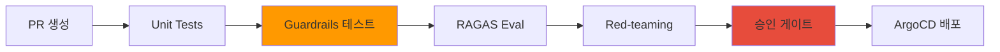
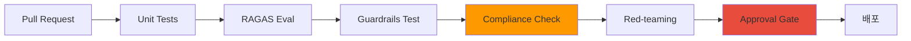

# 엔터프라이즈 컴플라이언스 프레임워크

AI 플랫폼을 엔터프라이즈 환경에서 운영할 때 반드시 준수해야 하는 컴플라이언스 프레임워크와 실전 매핑 가이드를 제공합니다.

## 왜 AI 컴플라이언스가 필요한가

### 기존 IT 컴플라이언스 vs AI 운영 컴플라이언스

:::info 핵심 차이점
기존 IT 컴플라이언스는 **정적인 시스템**을 다루지만, AI 컴플라이언스는 **비결정적이고 학습하는 시스템**을 다룹니다.
:::

| 영역 | 기존 IT 컴플라이언스 | AI 운영 컴플라이언스 |
|------|---------------------|---------------------|
| **예측 가능성** | 코드 → 동일 입력 = 동일 출력 | 모델 → 동일 입력도 출력 변동 가능 |
| **접근 제어** | DB/API 수준 | 모델 API + 프롬프트 + 출력 필터링 |
| **감사 추적** | 트랜잭션 로그 | 추론 트레이스 + 토큰 사용량 |
| **변경 관리** | 코드 배포 | 모델 버전 + LoRA 어댑터 + Playbook |
| **인시던트 대응** | 롤백 + Hotfix | 모델 스왑 + Guardrails 강화 |

### AI 고유 리스크

:::caution AI 특유의 컴플라이언스 리스크
- **환각(Hallucination)**: 모델이 사실이 아닌 정보를 생성
- **프롬프트 인젝션**: 악의적 입력으로 모델 동작 조작
- **PII 노출**: 학습 데이터에 포함된 개인정보 유출
- **모델 편향**: 특정 집단에 대한 차별적 출력
- **토큰 남용**: 비용 폭증 및 리소스 고갈
:::

이러한 리스크를 기존 컴플라이언스 프레임워크에 매핑하여 **실행 가능한 통제 방안**을 수립해야 합니다.

---

## SOC2 Trust Criteria ↔ AI 운영 매핑

SOC2(Service Organization Control 2)는 클라우드 서비스의 보안, 가용성, 기밀성을 검증하는 글로벌 표준입니다.

### SOC2 통제 매핑 테이블

| SOC2 통제 | Trust Criteria | AI 운영 구현 | 기술 스택 |
|-----------|----------------|-------------|----------|
| **CC6.1-6.8** | 논리적·물리적 접근 제어 | 모델 API 인증 + 데이터 접근 통제 | **Pod Identity + RBAC + API Key** |
| **CC7.1-7.4** | 시스템 모니터링 | 추론 요청 추적 + GPU 리소스 모니터링 | **LLM Tracing + AMP/AMG + DCGM** |
| **CC7.3** | 이상 탐지 및 인시던트 대응 | 자동 알림 + Playbook rollback | **PagerDuty + ArgoCD** |
| **CC8.1** | 변경 관리 | Playbook 버전 관리 + 승인 게이트 | **GitOps + Approval Gate** |

### CC6: 접근 제어 구현 예시

```yaml
# EKS Pod Identity + RBAC 기반 모델 API 접근 제어
apiVersion: v1
kind: ServiceAccount
metadata:
  name: model-api-sa
  annotations:
    eks.amazonaws.com/role-arn: arn:aws:iam::123456789012:role/ModelAPIAccessRole
---
apiVersion: rbac.authorization.k8s.io/v1
kind: Role
metadata:
  name: model-reader
rules:
- apiGroups: ["serving.kserve.io"]
  resources: ["inferenceservices"]
  verbs: ["get", "list"]
---
apiVersion: rbac.authorization.k8s.io/v1
kind: RoleBinding
metadata:
  name: model-reader-binding
subjects:
- kind: ServiceAccount
  name: model-api-sa
roleRef:
  kind: Role
  name: model-reader
  apiGroup: rbac.authorization.k8s.io
```

:::tip CC7.1-7.4 구현: LLM 트레이싱
모든 추론 요청을 감사 가능한 트레이스로 기록합니다. 구현 방법은 [Agent 모니터링](../operations-mlops/agent-monitoring.md) 및 [LLM 트레이싱 배포](../reference-architecture/monitoring-observability-setup.md)를 참조하세요.
:::

---

## ISO27001 Annex A ↔ AI 운영 매핑

ISO27001은 정보보안경영시스템(ISMS)의 국제 표준입니다. Annex A는 114개 통제 항목을 정의합니다.

### ISO27001 통제 매핑 테이블

| Annex A | 통제 영역 | AI 운영 구현 | 기술 스택 |
|---------|----------|-------------|----------|
| **A.8** | 자산 관리 | 모델 레지스트리 + LoRA 어댑터 관리 | **ECR + MLflow Model Registry** |
| **A.9** | 접근 통제 | API Key 관리 + RBAC + 멀티테넌트 격리 | **kgateway + Pod Identity** |
| **A.12** | 운영 보안 | 로깅 + 모니터링 + 백업 | **CloudTrail + AMP/AMG + S3** |
| **A.14** | 시스템 개발 보안 | Playbook CI/CD + 코드 리뷰 자동화 | **ArgoCD + Guardrails API** |
| **A.16** | 정보보안 인시던트 관리 | 자동 감지 + 자동 대응 | **알림 + Playbook rollback** |
| **A.17** | 업무 연속성 | 멀티 AZ 배포 + 오토스케일링 | **EKS + Karpenter** |

### A.14 구현: Playbook CI/CD 파이프라인



:::warning A.16 인시던트 관리: 자동 롤백 예시
```yaml
apiVersion: argoproj.io/v1alpha1
kind: Rollout
metadata:
  name: inference-api
spec:
  strategy:
    canary:
      analysis:
        templates:
        - templateName: hallucination-check
        args:
        - name: threshold
          value: "0.05"  # 환각률 5% 초과 시 자동 롤백
```
:::

---

## 금융 규제 매핑

### 전자금융감독규정 매핑

| 조항 | 내용 | AI 운영 매핑 | 구현 |
|------|------|-------------|------|
| **제15조** | 접근통제 및 권한 관리 | 모델 API 인증 + 감사 로그 | **API Key + CloudTrail** |
| **제17조** | 전자금융거래 정보 암호화 | 데이터 암호화 + TLS | **KMS + ALB TLS** |
| **제34조** | 거래한도 및 이체한도 설정 | 토큰 사용량 제한 + Rate Limiting | **kgateway rate-limit** |

#### 제34조 구현: 토큰 사용량 제한

```yaml
apiVersion: gateway.solo.io/v1
kind: RateLimitConfig
metadata:
  name: token-limit
spec:
  rateLimits:
  - actions:
    - genericKey:
        descriptorValue: "token-usage"
    limit:
      requestsPerUnit: 100000  # 10만 토큰/시간
      unit: HOUR
```

### ISMS-P (개인정보보호 인증) 매핑

| 항목 | 요구사항 | AI 운영 매핑 | 구현 |
|------|---------|-------------|------|
| **2.6** | 접근통제 | API Key + RBAC + 다단계 인증 | **Pod Identity + MFA** |
| **2.9** | 시스템 및 서비스 개발보안 | Playbook 버전 관리 + Guardrails | **Git + [Guardrails 스택](./ai-gateway-guardrails.md)** |
| **2.11** | 정보보안 사고 관리 | 자동 인시던트 탐지 및 대응 | **알림 + 자동 롤백** |

:::caution ISMS-P 관련 항목: PII 탐지 및 차단
Guardrails를 통한 PII 탐지/차단은 ISMS-P 개인정보 처리·접근통제 요건을 만족시키는 기술적 통제입니다.

**기술 구현은 [AI Gateway Guardrails](./ai-gateway-guardrails.md)를 참조하세요** — Microsoft Presidio 한국어 recognizer, Bedrock Guardrails ApplyGuardrail API, Guardrails AI `DetectPII` validator 등 구현 패턴과 kgateway/Bifrost 통합 예시를 제공합니다.
:::

---

## 자동 검증 CI/CD 파이프라인



### 파이프라인 단계별 설명

| 단계 | 목적 | 도구 | 실패 시 조치 |
|------|------|------|-------------|
| **Unit Tests** | 기능 정합성 검증 | pytest | PR 블록 |
| **RAGAS Eval** | RAG 정확도 검증 | RAGAS | 임계값 미달 시 PR 블록 |
| **Guardrails Test** | PII, 환각, 편향 검증 | Guardrails AI | 즉시 실패 |
| **Compliance Check** | SOC2/ISO27001 통제 확인 | 커스텀 스크립트 | 감사팀 알림 |
| **Red-teaming** | 적대적 프롬프트 테스트 | Garak | 보안팀 에스컬레이션 |
| **Approval Gate** | 수동 승인 | GitHub Actions | 승인 대기 |

:::tip Compliance Check 자동화 예시
```python
def check_compliance(playbook_path):
    """SOC2 CC8.1: 변경 관리 통제"""
    # 1. 승인자 확인
    approvers = get_pr_approvers()
    if len(approvers) < 2:
        raise Exception("최소 2명의 승인자 필요 (SOC2 CC8.1)")
    
    # 2. 변경 영향도 분석
    affected_models = analyze_affected_models(playbook_path)
    if "production" in affected_models:
        notify_audit_team(playbook_path)
    
    # 3. 감사 로그 기록
    log_to_cloudtrail(playbook_path, approvers)
```
:::

---

## 감사 데이터 보관 정책

### 데이터 분류별 보관 기준

| 데이터 | 보관 위치 | 보관 기간 | 접근 권한 | 법적 근거 |
|--------|----------|----------|----------|----------|
| **추론 트레이스** | LLM Tracing + S3 | 3년 | 감사팀, DevOps | ISO27001 A.12.4 |
| **API 호출 로그** | CloudTrail + S3 | 5년 | 보안팀, 감사팀 | 전자금융감독규정 제19조 |
| **모델 변경 이력** | Git + ECR | 영구 | DevOps, ML팀 | SOC2 CC8.1 |
| **GPU 메트릭** | AMP + S3 | 1년 | 운영팀 | 내부 정책 |
| **PII 탐지 로그** | CloudWatch + S3 | 3년 | 보안팀, 컴플라이언스팀 | ISMS-P 2.11 |

### S3 Lifecycle 정책 예시

```json
{
  "Rules": [
    {
      "Id": "inference-trace-lifecycle",
      "Status": "Enabled",
      "Transitions": [
        {
          "Days": 90,
          "StorageClass": "STANDARD_IA"
        },
        {
          "Days": 365,
          "StorageClass": "GLACIER"
        }
      ],
      "Expiration": {
        "Days": 1095
      }
    }
  ]
}
```

:::warning 감사 데이터 무결성 보장
- **S3 Object Lock**: 삭제 방지 (WORM 모드)
- **CloudTrail 검증**: `aws cloudtrail validate-logs`로 변조 검증
- **Immutable Trace**: LLM 트레이싱 시스템에서 트레이스는 생성 후 수정 불가 (Langfuse 등)
:::

---

## 실전 체크리스트

### SOC2 감사 대비

- [ ] CC6.1-6.8: Pod Identity + RBAC 설정 완료
- [ ] CC7.1-7.4: LLM 트레이싱 + AMP/AMG 모니터링 구축
- [ ] CC7.3: PagerDuty 알림 + 자동 롤백 설정
- [ ] CC8.1: GitOps + Approval Gate 적용

### ISO27001 인증 대비

- [ ] A.8: MLflow Model Registry 구축
- [ ] A.9: kgateway + API Key 관리 체계
- [ ] A.12: CloudTrail + S3 감사 로그 보관
- [ ] A.14: CI/CD 파이프라인 자동 검증
- [ ] A.16: 인시던트 대응 Playbook 작성
- [ ] A.17: 멀티 AZ + Karpenter 오토스케일링

### 금융 규제 준수

- [ ] 전자금융감독규정 제15조: API 접근 제어
- [ ] 전자금융감독규정 제17조: TLS + KMS 암호화
- [ ] 전자금융감독규정 제34조: Rate Limiting
- [ ] ISMS-P 2.6: MFA 적용
- [ ] ISMS-P 2.9: Guardrails API 통합
- [ ] ISMS-P 2.11: 자동 인시던트 대응

---

## 참고 자료

- [SOC2 Trust Services Criteria](https://www.aicpa-cima.com/resources/landing/trust-services-criteria)
- [ISO/IEC 27001:2022](https://www.iso.org/standard/82875.html)
- [전자금융감독규정 (금융위원회)](https://www.law.go.kr/)
- [ISMS-P 인증기준 (KISA)](https://isms.kisa.or.kr/)
- [Agent 모니터링 아키텍처](../operations-mlops/agent-monitoring.md)
- [LLMOps Observability 비교](../operations-mlops/llmops-observability.md)
- [AI Gateway Guardrails](./ai-gateway-guardrails.md) — 기술 구현 상세 (PII, Injection 방어, 도구 비교)
- [Guardrails AI Security](https://docs.guardrailsai.com/concepts/security/)
