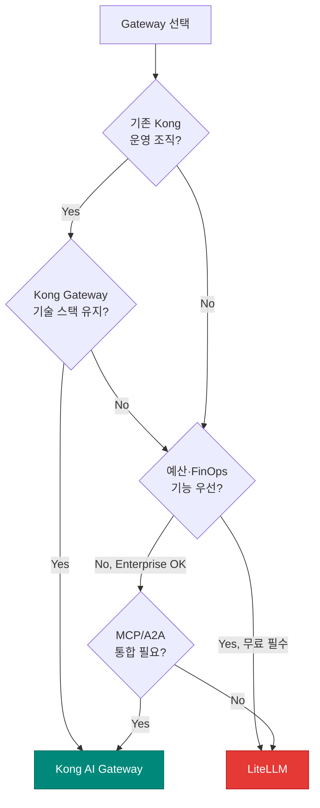
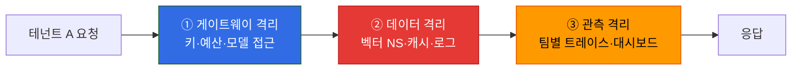

엔터프라이즈 LLM 플랫폼에서 멀티테넌시(multi-tenancy)는 조직·팀·사용자별 격리와 예산 통제를 구현하는 핵심 아키텍처입니다. 단일 LLM 인프라를 공유하면서도 **비용 책임 분리**, **데이터 격리**, **정책 차별화**를 보장해야 합니다. 이 문서는 LLM Gateway 레벨에서 멀티테넌시를 구현하는 두 가지 주요 접근(LiteLLM / Kong)과 격리 3단 모델을 다룹니다.

:::info 문서 위치
- **본 문서**: 게이트웨이 레벨 테넌시 계층 모델과 격리 전략
- [AI Gateway Guardrails](./ai-gateway-guardrails.md): 위협 모델, PII/Injection 방어 (보안 프레임)
- [LLM FinOps Chargeback](./llm-finops-chargeback.md): 비용 배분·청구 상세 (예산 집행 후단)
- [Inference Gateway 라우팅](../../model-serving/inference-routing/routing-strategy.md): L1/L2 Gateway 아키텍처
:::

---

## 1. 배경: 왜 Gateway 레벨 멀티테넌시가 필요한가

### 공유 인프라의 도전과제

대규모 조직에서 LLM 플랫폼은 여러 조직·팀·프로젝트가 **단일 추론 인프라**를 공유합니다. 이때 다음 문제를 해결해야 합니다.

| 도전과제 | 게이트웨이 멀티테넌시 솔루션 |
|---------|---------------------------|
| **비용 폭탄**: 한 팀의 과다 사용이 전체 예산 소진 | 팀별 예산 hard limit, 초과 시 차단 |
| **데이터 유출**: 테넌트 A의 프롬프트가 테넌트 B에 노출 | 캐시·로그 namespace 분리, 벡터 DB 격리 |
| **Noisy Neighbor**: 특정 사용자의 대량 요청이 다른 사용자 지연 유발 | Rate Limiting (QPM/TPM), 우선순위 큐 |
| **정책 차별화**: 금융팀은 엄격한 Guardrails, 연구팀은 완화 | 테넌트별 정책 프로파일 |

### Gateway 레벨 격리의 이점

**애플리케이션 레벨**에서 멀티테넌시를 구현하면 각 앱이 독립적으로 예산·정책을 구현해야 합니다. **Gateway 레벨**로 끌어올리면 다음 이점이 있습니다.

- **중앙 집중 제어**: 예산·rate limit·guardrails를 단일 지점에서 강제
- **감사 추적 통일**: 모든 테넌트의 LLM 호출을 단일 audit log에 기록
- **비용 투명성**: 실시간 토큰 사용량·비용을 테넌트별로 대시보드 제공
- **정책 일관성**: 동일 조직 내 모든 앱이 동일한 보안·규정 정책 준수

---

## 2. LiteLLM 테넌시 모델

LiteLLM Proxy는 **계층별 예산 및 Rate Limit 설정**을 지원하여 조직·팀·사용자·키 단위로 비용 통제를 구현합니다.

### 계층 구조와 예산 정책

LiteLLM은 다음 계층에서 예산과 속도 제한을 설정할 수 있습니다.

| 계층 | 설정 대상 | 예산·제한 적용 범위 | 예시 |
|------|----------|-------------------|------|
| **전역(Global Proxy)** | 프록시 전체 | 모든 요청 | 월 $50,000 상한 |
| **팀(Team)** | 팀 단위 | 팀 소속 모든 키 | Engineering 팀 $10,000 |
| **사용자(Internal User)** | 사용자 단위 | 사용자가 소유한 모든 키 | alice@example.com $1,000 |
| **가상 키(Virtual Key)** | 개별 API 키 | 해당 키만 | `sk-proj-abc123` $100 |

:::info 계층별 예산 우선순위
LiteLLM 공식 문서는 키가 팀에 속할 경우 **팀 예산이 적용되고 사용자의 개인 예산은 적용되지 않는다**고 명시합니다. 계층 간 예산 강제(상위가 하위를 cap)는 문서에서 "inward enforcement" 같은 명시적 용어로 설명되지 않지만, 키 생성 시 `max_budget` 상한 설정(`upperbound_key_generate_params`)과 팀·사용자별 지출 추적으로 계층별 제어가 가능합니다.
:::

### 비용 추적 메커니즘

LiteLLM은 비용을 다음과 같이 추적합니다.

- **키별 지출**: `LiteLLM_VerificationToken` 테이블에 토큰 사용량·비용 자동 기록
- **사용자별 집계**: 키 생성 시 사용자 연결 → 해당 사용자 지출에 합산
- **팀별 집계**: 팀 소속 키의 지출을 팀 총액으로 집계
- **리셋 주기**: `budget_duration`으로 일·주·월 단위 리셋 설정 가능

비동기 로깅으로 요청 경로 밖에서 처리되므로 latency 영향을 최소화합니다.

### Rate Limiting 전략

LiteLLM은 다음 Rate Limit을 지원합니다.

- **QPM (Queries Per Minute)**: 분당 요청 수 제한
- **TPM (Tokens Per Minute)**: 분당 토큰 수 제한 (입력+출력 합계)
- **RPM (Requests Per Minute)**: 분당 API 호출 수 제한

예산 검증은 Redis의 크로스 Pod 카운터에서 현재 지출을 읽어 수행합니다. `fail_closed_budget_enforcement: true` 옵션을 활성화하면 Redis·DB에서 지출을 검증할 수 없을 때 요청을 503으로 거부하는 **fail-closed** 동작을 강제할 수 있습니다 (기본값은 아니며 명시적 설정 필요).

---

## 3. Kong AI Gateway 테넌시 모델

Kong AI Gateway는 **Consumer/Consumer Group** 기반 정책으로 멀티테넌시를 구현하며, 토큰 인지(token-aware) Rate Limiting으로 비용 제어를 강화합니다.

### Consumer 기반 정책

Kong의 멀티테넌시는 다음 엔티티로 구성됩니다.

| 엔티티 | 역할 | 정책 적용 범위 |
|--------|------|---------------|
| **Consumer** | API 키·JWT로 식별되는 개별 클라이언트 | Consumer 단위 rate limit, ACL |
| **Consumer Group** | Consumer를 묶는 논리적 그룹 | 그룹 단위 정책 (예: Premium vs Free tier) |

Kong의 **AI Rate Limiting Advanced 플러그인**은 다음 차원으로 정책을 정의할 수 있습니다.

- Consumer / Consumer Group
- IP 주소
- HTTP 헤더
- 경로(path)
- 모델(예: `gpt-4o`, `claude-opus-5`)
- 프로바이더(예: OpenAI, Anthropic)

매치 조건은 **AND 로직**으로 결합 가능하여 "특정 Consumer + `gpt-4o` 모델" 같은 다차원 제어가 가능합니다.

### 토큰 인지 Rate Limiting

Kong의 가장 강력한 기능은 **토큰 단위 Rate Limiting**입니다. 전통적인 요청 수(QPM) 제한은 각 요청의 비용이 다른 LLM 환경에서 부정확합니다. Kong은 4가지 토큰 카운팅 전략을 지원합니다.

| 전략 | 계산 기준 | 사용 사례 |
|------|----------|----------|
| `total_tokens` | 프롬프트 + 완성 토큰 총합 | 일반 throughput 제어 |
| `prompt_tokens` | 입력 토큰만 | 입력 크기 기반 제한 |
| `completion_tokens` | 생성 토큰만 | 출력 비용 제어 |
| `cost` | (입력 토큰 × 입력 단가 + 출력 토큰 × 출력 단가) / 1M | 실제 달러 비용 기반 제한 |

:::warning 토큰 비용은 다음 요청에서 반영
LLM이 응답을 생성해야 토큰 수를 알 수 있으므로, 토큰 비용은 **다음 요청**에서 반영됩니다. 즉, 이미 예산을 초과한 요청은 완료되고 그 다음 요청이 차단됩니다. 이는 모든 토큰 인지 Rate Limiting의 근본적 제약입니다.
:::

### Kong과 LiteLLM의 본질적 차이

| 항목 | LiteLLM | Kong AI Gateway |
|------|---------|-----------------|
| **아키텍처** | LLM 프록시 (100+ 프로바이더 통합) | API Gateway + AI 플러그인 |
| **테넌시 단위** | Organization·Team·User·Key 계층 | Consumer·Consumer Group |
| **비용 추적** | 무료 OSS 코어에 포함 | 기본 rate limit 무료, 고급 AI 기능은 Enterprise/Konnect 전용 |
| **토큰 인지 제한** | TPM(tokens per minute) | 토큰 수·비용 기반 4전략 |
| **배포 형태** | Python 기반, self-host 또는 Cloud | Lua/C 기반, self-host 또는 Konnect SaaS |
| **기존 인프라** | LLM 중심 신규 구축 | 기존 Kong 운영 조직, LLM·MCP·A2A 트래픽 게이트웨이 공식 지원 |

---

## 4. 선택 기준: LiteLLM vs Kong (택일)

:::danger Kong + LiteLLM 조합 아키텍처 금지
이 두 솔루션은 **either/or 선택지**입니다. "Kong을 앞단에 두고 LiteLLM을 후단에" 같은 조합 아키텍처는 검증된 레퍼런스가 없으므로 **절대 서술 금지**입니다. 하나를 선택하여 단일 Gateway로 구성하세요.
:::

### 선택 결정 트리



### 선택 기준표

| 조건 | 권장 | 이유 |
|------|------|------|
| **기존 Kong 운영 조직** | Kong AI Gateway | 기존 인프라·운영 지식 재사용, LLM·MCP·A2A 트래픽 게이트웨이 지원 |
| **OSS-first, FinOps 무료** | LiteLLM | 예산·비용 추적이 무료 코어에 포함, 100+ 프로바이더 통합 |
| **Enterprise, 고급 AI 플러그인** | Kong Enterprise/Konnect | 토큰 기반 rate limiting, AI Proxy Advanced 필요 시 |
| **Python 생태계** | LiteLLM | LangChain·LlamaIndex 직접 통합, 빠른 프로토타이핑 |
| **고성능, 저메모리** | Kong | Lua/C 기반, 대규모 트래픽 처리 |

### 전환 비용 고려

두 솔루션 모두 **self-host 가능**하므로, 초기 선택 후 다른 솔루션으로 전환하는 비용은 **구성 작업 수준**입니다. 벤더 락인 리스크는 낮습니다. 다만 다음 항목은 재작업이 필요합니다.

- API 키 체계 (LiteLLM virtual key ↔ Kong Consumer 매핑)
- 정책 설정 마이그레이션 (YAML ↔ Kong declarative config)
- 대시보드·모니터링 스택 재구성

---

## 5. 격리 3단 모델

멀티테넌시는 **게이트웨이 격리**만으로 불충분합니다. 데이터와 관측성도 함께 격리해야 완전한 테넌트 분리가 보장됩니다.

### 격리 계층



### ① 게이트웨이 격리

| 격리 대상 | LiteLLM 구현 | Kong 구현 |
|----------|-------------|----------|
| **인증** | Virtual Key 발급·검증 | Consumer API Key·JWT |
| **예산 차단** | `max_budget` 초과 시 요청 거부 (budget_exceeded 오류) | `cost` rate limit 초과 시 429 |
| **모델 접근 제어** | 키별 허용 모델 목록 | Consumer ACL + 모델 정책 |
| **Rate Limiting** | QPM·TPM 제한 | 토큰 수·비용 기반 4전략 |

### ② 데이터 격리

**벡터 DB 네임스페이스 분리**: RAG 또는 Semantic Cache에서 사용하는 벡터 DB(Milvus, Qdrant, Redis)는 테넌트별 namespace로 분리해야 합니다.

```python
# pseudo-code: Milvus 테넌트별 컬렉션
collection_name = f"embeddings_{tenant_id}"
milvus_client.create_collection(collection_name)
```

**캐시 키 네임스페이스**: Semantic Cache의 캐시 키는 `tenant_id`를 prefix로 포함해야 합니다. 상세 설계는 [Semantic Caching 전략 — 캐시 키 설계와 멀티테넌시](../../model-serving/inference-optimization/semantic-caching-strategy.md#5-캐시-키-설계와-멀티테넌시)를 참조하세요.

```python
# pseudo-code: Redis 캐시 키 네임스페이스
cache_key = f"cache:{tenant_id}:{language}:{embedding_hash}"
```

**Row-level 격리**: 관계형 DB(PostgreSQL 등)에서 프롬프트·응답 로그를 저장할 때는 **Row-level Security (RLS)** 로 테넌트 간 격리를 강제합니다.

### ③ 관측 격리

**팀별 트레이스 라우팅**: Langfuse 또는 LangSmith에서 테넌트별로 트레이스를 분리하여 한 팀이 다른 팀의 프롬프트·응답을 볼 수 없도록 합니다.

```python
# pseudo-code: Langfuse 테넌트별 프로젝트
langfuse_context.update_current_observation(
    metadata={"tenant_id": tenant_id, "team": team_name}
)
```

**대시보드 권한**: Grafana·CloudWatch 대시보드는 팀별로 필터링된 뷰를 제공합니다. `tenant_id` 레이블로 메트릭을 분리하고, 대시보드 권한은 IAM 또는 Grafana 조직 단위로 제어합니다.

---

## 6. 예산 정책 매트릭스

테넌트가 예산을 초과했을 때 어떻게 대응할지는 **정책 선택**입니다. 하드 차단·소프트 알림·모델 다운그레이드 등 다양한 전략을 조합할 수 있습니다.

### 정책 패턴

| 정책 | 동작 | 사용 사례 | 구현 |
|------|------|----------|------|
| **하드 차단** | 예산 초과 시 즉시 403/429 반환 | 엄격한 비용 통제, 내부 부서별 예산 | `max_budget` 도달 시 Gateway 차단 |
| **소프트 알림** | 예산 80% 도달 시 경고 메일, 초과 시 계속 허용 | 연구팀·프로토타이핑, 사후 청구 | CloudWatch Alarm + SNS |
| **폴백 (다운그레이드)** | 예산 초과 시 저가 모델로 자동 전환 | SLA가 낮은 내부 도구, FAQ 챗봇 | Gateway Cascade Routing 정책 |
| **쓰로틀링** | 예산 초과 후 QPM을 절반으로 감축 | 점진적 제한, 완전 차단 회피 | Dynamic Rate Limit 조정 |

:::tip 폴백 전략과 Cascade Routing
"예산 초과 시 저가 모델로 다운그레이드"는 [Request Cascading — 지능형 모델 라우팅](../../model-serving/inference-routing/request-cascading.md)의 Budget-based Routing 패턴으로 구현합니다. 예: Premium 모델(`gpt-4o`) 예산 소진 시 자동으로 `gpt-4o-mini` 또는 자체 호스팅 vLLM으로 폴백.
:::

### 상세 메터링·Chargeback

예산 정책의 **후단**(예산 집행 후 청구·배분)은 별도 문서에서 다룹니다. 팀별 비용 배분, 부서 간 청구(chargeback), AWS Cost Allocation Tags 연동 등은 [LLM FinOps Chargeback](./llm-finops-chargeback.md)를 참조하세요.

---

## 7. 실전 체크리스트

### Gateway 설정

- [ ] 테넌트별 virtual key 또는 Consumer 발급
- [ ] 팀·사용자·키 계층별 예산·rate limit 설정
- [ ] 예산 초과 정책 결정 (하드 차단 / 소프트 알림 / 폴백)
- [ ] 토큰 인지 rate limiting 활성화 (Kong의 경우)

### 데이터 격리

- [ ] 벡터 DB namespace를 `tenant_id`로 분리
- [ ] Semantic Cache 키에 `tenant_id` prefix 포함
- [ ] Row-level Security (RLS) 활성화 (PostgreSQL 등)
- [ ] 크로스 테넌트 데이터 접근 단위 테스트 작성

### 관측성·감사

- [ ] Langfuse 트레이스에 `tenant_id` 태그
- [ ] 팀별 대시보드 필터 구성 (Grafana `tenant_id` 레이블)
- [ ] 예산 80% 도달 시 SNS·이메일 알림
- [ ] 감사 로그 최소 90일 보존 (테넌트별 비용·사용량)

### 보안

- [ ] Virtual key 또는 Consumer 인증 강제 (익명 접근 금지)
- [ ] PII 포함 프롬프트는 Guardrails로 redact 후 로깅
- [ ] 테넌트 간 키 공유 금지 (정책 문서화)

---

## 참고 자료

### 공식 문서

- [LiteLLM — Virtual Keys](https://docs.litellm.ai/docs/proxy/virtual_keys) — Virtual Key 발급·지출 추적
- [LiteLLM — Budgets, Rate Limits](https://docs.litellm.ai/docs/proxy/users) — 계층별 예산·속도 제한 설정
- [Kong AI Rate Limiting Advanced](https://developer.konghq.com/plugins/ai-rate-limiting-advanced/) — Consumer/Consumer Group 기반 토큰 인지 Rate Limiting
- [Kong AI Gateway](https://developer.konghq.com/ai-gateway/) — Kong AI Gateway 공식 문서

### 관련 문서 (내부)

- [AI Gateway Guardrails](./ai-gateway-guardrails.md) — PII·Injection 방어, 위협 모델
- [LLM FinOps Chargeback](./llm-finops-chargeback.md) — 토큰 메터링·showback/chargeback 방법론
- [Inference Gateway 라우팅 전략](../../model-serving/inference-routing/routing-strategy.md) — L1/L2 Gateway 아키텍처, LiteLLM·Kong 비교
- [Semantic Caching 전략](../../model-serving/inference-optimization/semantic-caching-strategy.md) — 테넌트 캐시 키 네임스페이스 설계
