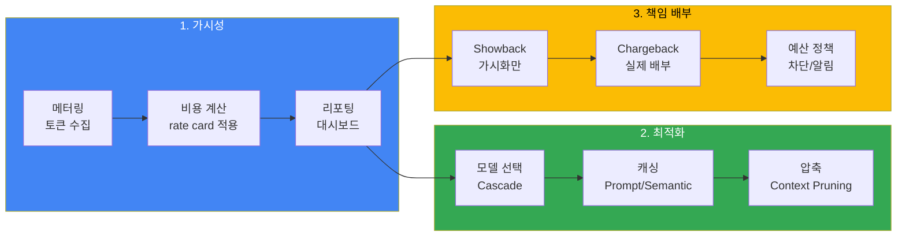
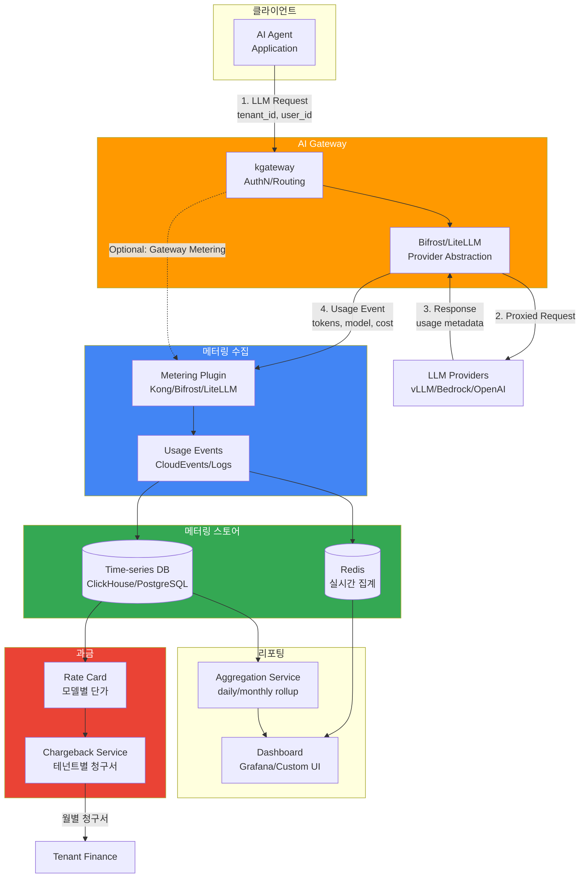
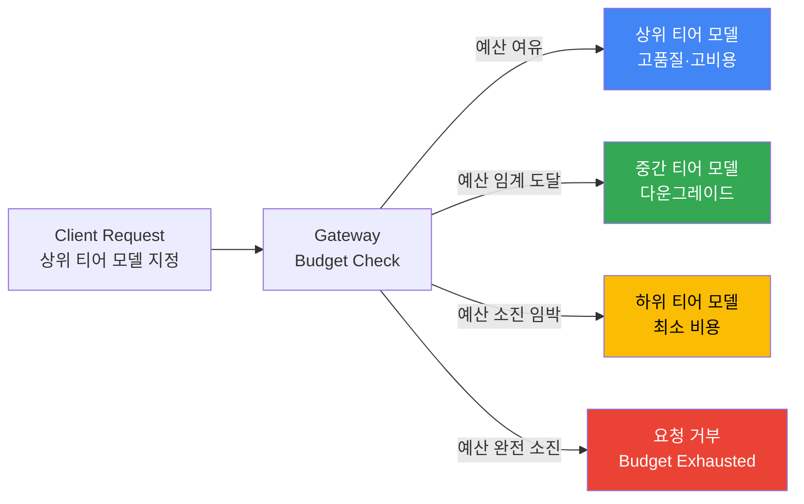

엔터프라이즈 LLM 플랫폼에서 FinOps(Financial Operations)는 **비용 가시성(Visibility)**, **최적화(Optimization)**, **배부(Chargeback)** 3요소로 구성됩니다. 이 문서는 토큰 메터링 파이프라인, 비용 단위 모델링, showback/chargeback 방법론, 예산 정책 설계를 다룹니다.

:::info 관련 문서
- **본 문서**: FinOps chargeback 방법론 (비용 배부 전략, 메터링 아키텍처)
- [Agent 모니터링](../observability/agent-monitoring.md): 비용 추적 PromQL 쿼리 (관측 구현 canonical)
- [Request Cascading](../../model-serving/inference-routing/request-cascading.md): 비용 절감 라우팅 전략
- [AI Gateway Guardrails](./ai-gateway-guardrails.md): 예산 초과 시 차단/폴백 정책
:::

---

## 1. 개요

### 1.1 FinOps가 필요한 이유

LLM 운영 비용은 전통적인 클라우드 인프라와 다른 특성을 가집니다:

| 특성 | 전통 인프라 | LLM 플랫폼 |
|------|------------|-----------|
| **비용 단위** | CPU·메모리·스토리지 시간당 | 입력/출력 토큰 개수 |
| **가변성** | 상대적으로 예측 가능 | 프롬프트 길이·턴 수에 따라 급변 |
| **비용 주체** | 인스턴스·서비스 | 모델·테넌트·세션·에이전트 |
| **누적 패턴** | 선형 증가 | 멀티턴 대화 시 지수적 증가 가능 |
| **최적화 여지** | 인스턴스 크기 조정 | 모델 선택, 프롬프트 압축, 캐싱 |

에이전틱 AI 애플리케이션은 툴 호출 루프와 컨텍스트 누적으로 인해 단일 요청당 토큰 소비가 **10배 이상** 증가할 수 있으며, 비용 예측이 어렵습니다.

### 1.2 FinOps 3요소



---

## 2. 비용 단위 모델링

### 2.1 토큰 플로우 모델

LLM 비용의 기본 단위는 **session-level cost** 입니다. 단일 세션(요청-응답 쌍 N개)의 총 비용은 다음 요소로 결정됩니다:

```
C_session = Σ (C_input * T_in + C_output * T_out) * (1 - R_cache)

여기서:
  C_input  = 입력 토큰 단가 ($/1M tokens)
  C_output = 출력 토큰 단가 ($/1M tokens, 일반적으로 입력 대비 2~5배)
  T_in     = 턴당 입력 토큰 수
  T_out    = 턴당 출력 토큰 수
  R_cache  = 캐시 히트율 (0~1, 프롬프트 캐싱·semantic 캐싱)
  Σ        = 세션 내 모든 LLM 호출 합계 (사용자 턴 + 에이전트 내부 루프)
```

### 2.2 에이전틱 고유 위험: 컨텍스트 복리 효과

**일반 채팅** (단일 턴):
- 턴 1: 사용자 프롬프트 500 토큰 → 모델 응답 200 토큰
- 총 비용: (500 * C_in + 200 * C_out) × 1회

**에이전틱 루프** (도구 호출 3회):
- 턴 1: 프롬프트 500 + 이전 컨텍스트 0 = 500 → 응답 200 (도구 호출 요청)
- 턴 2: 프롬프트 500 + 턴 1 컨텍스트 700 = 1,200 → 응답 300 (도구 호출 요청)
- 턴 3: 프롬프트 500 + 턴 1~2 컨텍스트 2,000 = 2,500 → 응답 300 (도구 호출 요청)
- 턴 4: 프롬프트 500 + 턴 1~3 컨텍스트 4,800 = 5,300 → 최종 응답 400
- **총 입력 토큰: 9,500 (단일 턴 대비 19배)**

:::warning 비용 폭주 리스크
멀티턴 에이전트 루프에서 컨텍스트는 매 턴마다 누적되어 토큰 소비가 **초선형(super-linear)**으로 증가합니다. 루프 깊이가 10회를 넘으면 단일 세션 비용이 $1 이상으로 증가할 수 있습니다 (Claude Opus 4.8 기준, 가정).
:::

### 2.3 비용 완화 전략

| 전략 | 효과 | 구현 위치 |
|------|------|----------|
| **Max iterations 제한** | 루프 횟수 상한 (예: 10회) | Agent 프레임워크 설정 |
| **중간 요약** | 긴 컨텍스트를 짧은 요약으로 대체 | Agent 루프 내 summarization 단계 |
| **컨텍스트 윈도우 예산** | 입력 토큰이 N 이상이면 가장 오래된 턴 제거 | Gateway 정책 또는 Agent 프레임워크 |
| **Prompt Caching** | 시스템 프롬프트·공통 컨텍스트 재사용 | 모델 API 레벨 (Claude, GPT-4.1, Gemini 지원) |
| **Semantic Caching** | 유사 쿼리 응답 재사용 | Gateway 레이어 |

---

## 3. 메터링 파이프라인 아키텍처

### 3.1 데이터 플로우



### 3.2 메터링 도구별 구현

#### LiteLLM Proxy

LiteLLM은 요청/응답 메타데이터에서 토큰 수와 비용을 자동 계산하여 `LiteLLM_SpendLogs` 테이블에 저장합니다.

**태그 기반 추적** (Enterprise):
```python
# 요청 본문에 tags 추가
{
  "model": "claude-sonnet-4.6",
  "messages": [...],
  "metadata": {
    "tags": ["team:data-science", "project:rag-bot", "env:prod"]
  }
}
```

**비용 조회 API**:
```bash
# 지출 로그 조회 (기간 필터, summarize=true 기본)
curl "https://litellm.example.com/spend/logs?start_date=2026-08-01&end_date=2026-08-31"

# 사용자별 일일 사용량 (모델·프로바이더·키 단위 분해)
curl "https://litellm.example.com/user/daily/activity?start_date=2026-08-01&end_date=2026-08-31"
```

**chargeback 리포트** (Enterprise — `group_by`는 `team`/`customer` 지원):
```bash
# 팀별 또는 고객별 기간 청구 리포트
curl "https://litellm.example.com/global/spend/report?start_date=2026-08-01&end_date=2026-08-31&group_by=customer"
```

:::tip LiteLLM Spend Tracking 상세
LiteLLM은 100개 이상 모델의 공식 단가를 내장한 model cost map을 유지하며, Bedrock 티어, Vertex AI PayGo 등 프로바이더별 가격 변동도 자동 반영합니다. 상세 문서: [LiteLLM Cost Tracking](https://docs.litellm.ai/docs/proxy/cost_tracking)
:::

#### Kong Metering & Billing Plugin

Kong의 [Metering & Billing 플러그인](https://developer.konghq.com/plugins/metering-and-billing/)은 Kong Gateway 3.14+ Enterprise 애드온(별도 구매)으로, API 요청과 AI 토큰 사용량을 **CloudEvents 형식의 불변(immutable) 사용량 이벤트**로 발행합니다.

동작 방식의 핵심은 다음과 같습니다.

- **과금 주체(subject) 해석**: 각 이벤트는 과금 대상 식별자를 포함하며, Consumer·Dev Portal 애플리케이션·요청 헤더(예: `x-customer-id`)에서 해석합니다. 주체를 해석할 수 없는 이벤트는 폐기됩니다.
- **이벤트 전달**: Konnect 또는 self-hosted OpenMeter의 ingest 엔드포인트로 배치 전달하며, 플러그인 자체는 stateless라 재시작 시 이벤트를 보존하지 않습니다.
- **메터링 전용**: 이 플러그인은 사용량 수집만 수행하고 한도 강제는 하지 않습니다. 예산 강제가 필요하면 AI Rate Limiting Advanced 플러그인과 조합합니다 ([AI Gateway 멀티테넌시](./ai-gateway-multi-tenancy.md) 참조).

---

## 4. Showback vs Chargeback

### 4.1 정의 및 차이

| 항목 | Showback | Chargeback |
|------|---------|-----------|
| **목적** | 비용 가시화·인식 제고 | 실제 비용 배부 (회계 처리) |
| **회계 처리** | 없음 (정보성) | 있음 (예산 차감, 청구서 발행) |
| **도입 난이도** | 낮음 (대시보드만) | 높음 (rate card, 청구 시스템 연동) |
| **정책 영향** | 조직 인식 변화 유도 | 예산 통제·리소스 할당 결정 |
| **도입 순서** | 1단계 | 2단계 (showback 이후) |

### 4.2 도입 단계별 전략

**Phase 1: Visibility** (1~3개월)
- 목표: 모든 LLM 사용량을 수집하여 대시보드에 표시
- 산출물: Grafana 대시보드 (테넌트별·모델별·일일 비용)
- 조직 반응: "우리 팀이 월 $2,000를 쓰고 있구나"

**Phase 2: Showback** (3~6개월)
- 목표: 팀/프로젝트별 비용을 월별 리포트로 배포 (회계 처리는 없음)
- 산출물: 월간 showback 리포트 (CSV/PDF), 이메일 발송
- 조직 반응: 비용 인식 개선, 자발적 최적화 시도 시작

**Phase 3: Soft Chargeback** (6~12개월)
- 목표: 실제 비용을 팀 예산에서 차감 (단, 초과 시에도 서비스 차단 없음)
- 산출물: 재무 시스템 연동, 월별 청구서 (soft limit)
- 조직 반응: 예산 계획·모델 선택 최적화 동기 부여

**Phase 4: Hard Chargeback** (12개월+)
- 목표: 예산 소진 시 요청 차단 또는 저가 모델 다운그레이드
- 산출물: Gateway 레벨 예산 정책 (hard limit)
- 조직 반응: 엄격한 비용 통제, 리소스 경쟁 발생 (정책 조율 필요)

:::warning Hard Chargeback 리스크
예산 소진 시 서비스를 즉시 차단하면 **비즈니스 크리티컬 워크로드**가 중단될 수 있습니다. 프로덕션 환경에서는 예산 초과 시 **저가 모델로 폴백** 또는 **알림 + 유예 기간** 정책을 권장합니다.
:::

---

## 5. 예산 정책 설계

### 5.1 정책 매트릭스

| 정책 유형 | 트리거 조건 | 조치 | UX 영향 | 리스크 |
|----------|-----------|------|---------|--------|
| **Soft Budget — 알림만** | 월 예산 80% 소진 | Slack/이메일 알림, 서비스 계속 | 없음 | 예산 초과 가능 |
| **Soft Budget — 시각적 경고** | 월 예산 90% 소진 | UI에 경고 배너, 서비스 계속 | 경고 메시지만 | 예산 초과 가능 |
| **Hard Budget — 차단** | 월 예산 100% 소진 | 요청 거부 (HTTP 429) | 서비스 중단 | 비즈니스 임팩트 |
| **Hard Budget — 폴백** | 월 예산 100% 소진 | 저가 모델로 다운그레이드 (예: Opus → Haiku) | 응답 품질 저하 가능 | 사용자 경험 저하 |
| **Dynamic Budget — 우선순위** | 월 예산 100% 소진 | 고우선순위 요청만 허용 (예: prod > dev) | 개발 환경 차단 | 개발 생산성 저하 |

### 5.2 폴백 전략 (Budget Cascade)

예산 초과 시 고가 모델을 저가 모델로 자동 전환하는 **Cascade Routing**을 구성하면 서비스 중단 없이 비용을 통제할 수 있습니다.



:::info 게이트웨이 기본 동작은 하드 차단
검증된 게이트웨이의 예산 초과 기본 동작은 **차단**입니다 — LiteLLM은 `budget_exceeded` 오류, Bifrost는 402 `budget_exceeded`를 반환합니다. 임계값 도달 시 저가 모델로 자동 다운그레이드하는 동작은 게이트웨이의 예산 기능이 아니라 **라우팅 정책**(fallback·cascade 구성)으로 별도 구현해야 하며, 지원 방식은 게이트웨이별로 다르므로 도입 전 해당 제품의 라우팅 문서를 확인해야 합니다.
:::

:::tip Cascade 라우팅 상세
Cascade Routing은 비용 절감뿐 아니라 가용성 확보(Self-hosted 장애 시 Bedrock 폴백)에도 활용됩니다. 상세 전략은 [Request Cascading](../../model-serving/inference-routing/request-cascading.md)을 참조하세요.
:::

### 5.3 우선순위 기반 예산 (Priority Budget)

환경·워크로드별로 예산 우선순위를 차등 적용합니다.

| 우선순위 | 환경 | 월 예산 할당 | 초과 시 조치 |
|----------|------|-------------|-------------|
| **P0 — Critical** | 프로덕션 고객 대면 | 70% | 계속 허용 (별도 알림) |
| **P1 — High** | 내부 프로덕션 도구 | 20% | 저가 모델 폴백 |
| **P2 — Medium** | 스테이징 환경 | 7% | 저가 모델 폴백 |
| **P3 — Low** | 개발·실험 | 3% | 차단 (429) |

---

## 6. FinOps FOCUS 스펙 매핑

### 6.1 FOCUS란?

[FOCUS](https://focus.finops.org/)(FinOps Open Cost & Usage Specification)는 Linux Foundation FinOps Foundation이 지원하는 오픈 스펙으로, AI·클라우드·SaaS 등 다양한 벤더의 청구 데이터를 정규화하여 FinOps 실무자의 복잡성을 줄이는 표준입니다.

**주요 클라우드 제공사 지원**: AWS, Azure, Google Cloud, Oracle, Alibaba, Tencent, Huawei 등이 FOCUS 형식 데이터 내보내기를 지원합니다 (v1.0~v1.4).

### 6.2 LLM 비용과 FOCUS 매핑 (가정)

FOCUS는 현재 GPU·컴퓨트 인스턴스 비용을 표준화하지만, **토큰 기반 LLM 과금은 아직 명시적 매핑이 없습니다** (2026-08 기준, 가정). 다음은 FOCUS 컬럼에 LLM 메터링을 매핑하는 제안입니다:

| FOCUS 컬럼 | LLM 메터링 매핑 (제안) | 예시 값 |
|-----------|----------------------|---------|
| `ServiceName` | LLM 서비스 이름 | "LLM Inference Platform" |
| `ResourceId` | 모델 리소스 ID | "claude-sonnet-4.6" |
| `UsageQuantity` | 입력+출력 토큰 합계 | 15000 |
| `PricingUnit` | 가격 단위 | "1M tokens" |
| `PricingQuantity` | 가격 적용 단위 수량 | 0.015 (= 15000 / 1M) |
| `BilledCost` | 청구 비용 | 0.045 USD |
| `Tags` | 테넌트·팀·프로젝트 태그 | `{"tenant": "abc", "team": "data-science"}` |

:::info 사실 경계
FOCUS v1.4 표준이 LLM 토큰 과금을 명시적으로 다루는지 여부는 공식 스펙 문서를 직접 확인해야 합니다. 위 매핑은 일반적인 `UsageQuantity` 개념을 토큰에 적용한 제안입니다.
:::

---

## 7. 비용 추적 PromQL (Canonical 참조)

비용 메트릭의 **PromQL 쿼리 구현**은 [Agent 모니터링 — 비용 추적](../observability/agent-monitoring.md#7-비용-추적) 섹션을 참조하세요. 여기서는 개념만 요약합니다.

### 7.1 추적 대상 메트릭

| 메트릭 | 정의 | 추적 기준 |
|--------|------|----------|
| `llm_cost_dollars_total` | 누적 LLM 비용 (counter) | 모델별, 테넌트별, 환경별 |
| `llm_tokens_input_total` | 누적 입력 토큰 (counter) | 모델별, 테넌트별 |
| `llm_tokens_output_total` | 누적 출력 토큰 (counter) | 모델별, 테넌트별 |
| `tenant_monthly_budget_usd` | 테넌트 월 예산 (gauge) | 테넌트별 |

### 7.2 주요 쿼리 (개념만 — 구현은 canonical 참조)

```prometheus
# 일별 총 비용
sum(increase(llm_cost_dollars_total[24h]))

# 테넌트별 일별 비용
sum(increase(llm_cost_dollars_total[24h])) by (tenant_id)

# 예산 대비 사용률 (월간)
sum(increase(llm_cost_dollars_total[30d])) by (tenant_id)
/ on(tenant_id) group_left
tenant_monthly_budget_usd
```

:::tip PromQL 상세 쿼리
실제 PromQL, ServiceMonitor 구성, Grafana 대시보드 JSON은 [Agent 모니터링](../observability/agent-monitoring.md)의 **비용 메트릭** 섹션을 참조하세요.
:::

---

## 8. 실전 체크리스트

### 8.1 메터링 파이프라인
- [ ] LiteLLM 또는 Kong Metering 플러그인 배포 완료
- [ ] 모든 LLM 요청에 `tenant_id`, `user_id` 메타데이터 부착
- [ ] 메터링 이벤트가 TSDB (ClickHouse/PostgreSQL)에 저장되는지 확인
- [ ] 실시간 집계를 위한 Redis 캐시 구성 (선택)

### 8.2 비용 가시성
- [ ] Grafana 대시보드에 테넌트별·모델별 일일 비용 표시
- [ ] 비용 추적 PromQL이 AMP에서 정상 동작하는지 검증
- [ ] 비용 급증 알림 (일일 예산 임계값 초과 시)

### 8.3 Rate Card
- [ ] 모델별 최신 공식 단가 (input/output) 확보
- [ ] LiteLLM model cost map 또는 커스텀 rate card 최신화
- [ ] Self-hosted 모델 비용 계산 방식 정의 (GPU 시간 또는 고정 비용)

### 8.4 Showback/Chargeback
- [ ] Phase 1 (Visibility) 완료: 대시보드 공유
- [ ] Phase 2 (Showback) 리포트 자동 생성 스크립트 (월별 CSV/PDF)
- [ ] Phase 3 (Soft Chargeback) 재무 시스템 연동 (해당 시)
- [ ] Phase 4 (Hard Chargeback) 예산 정책 Gateway 통합 (해당 시)

### 8.5 예산 정책
- [ ] 테넌트별 월 예산 설정 (초기값: 관측 데이터 기반 추정)
- [ ] 예산 정책 유형 결정 (알림만 / 폴백 / 차단)
- [ ] Cascade Routing 구성 (예산 초과 시 저가 모델 폴백)
- [ ] 우선순위별 예산 할당 (프로덕션 > 스테이징 > 개발)

### 8.6 최적화
- [ ] Prompt Caching 활성화 (Claude, GPT-4.1, Gemini 지원 모델)
- [ ] Semantic Caching 구성 (Gateway 레이어)
- [ ] 에이전트 루프 max iterations 제한 (예: 10회)
- [ ] 컨텍스트 윈도우 예산 정책 (예: 입력 토큰 > 10k 시 pruning)

---

## 9. 결론

LLM FinOps는 토큰 메터링, 비용 가시화, 예산 정책, chargeback 4단계로 구성됩니다. 에이전틱 AI 애플리케이션은 멀티턴 컨텍스트 누적으로 인해 비용이 초선형으로 증가하므로, **루프 제한**, **중간 요약**, **예산 기반 Cascade Routing**이 필수입니다.

도입 순서는 **Visibility (대시보드) → Showback (리포트) → Soft Chargeback (회계 연동) → Hard Chargeback (예산 차단)** 단계를 권장하며, Hard Chargeback은 프로덕션 워크로드 중단 리스크를 고려하여 **폴백 정책**과 함께 운영해야 합니다.

비용 추적 PromQL 구현은 [Agent 모니터링](../observability/agent-monitoring.md)을 참조하고, 비용 절감 라우팅 전략은 [Request Cascading](../../model-serving/inference-routing/request-cascading.md)을 참조하세요.

---

## 참고 자료

### 공식 문서
- [LiteLLM Cost Tracking](https://docs.litellm.ai/docs/proxy/cost_tracking) — 태그 기반 비용 추적, spend logging, chargeback API
- [Kong Metering & Billing Plugin](https://developer.konghq.com/plugins/metering-and-billing/) — CloudEvents 기반 사용량 메터링
- [FinOps Foundation FOCUS](https://focus.finops.org/) — 클라우드 비용 데이터 표준화 오픈 스펙
- [OpenAI Pricing](https://openai.com/api/pricing/) — GPT 모델 공식 단가
- [Anthropic Pricing](https://www.anthropic.com/pricing) — Claude 모델 공식 단가
- [Google AI Pricing](https://ai.google.dev/pricing) — Gemini 모델 공식 단가

### 관련 문서 (내부)
- [Agent 모니터링](../observability/agent-monitoring.md) — 비용 추적 PromQL 쿼리 canonical
- [Request Cascading](../../model-serving/inference-routing/request-cascading.md) — 비용 절감 라우팅 전략
- [AI Gateway Guardrails](./ai-gateway-guardrails.md) — 예산 초과 시 차단 정책
- [AI Gateway Multi-Tenancy](./ai-gateway-multi-tenancy.md) — 테넌트 격리 및 예산 정책 (병렬 작성 중)
