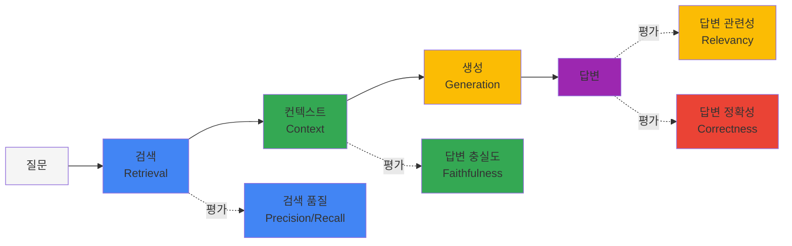
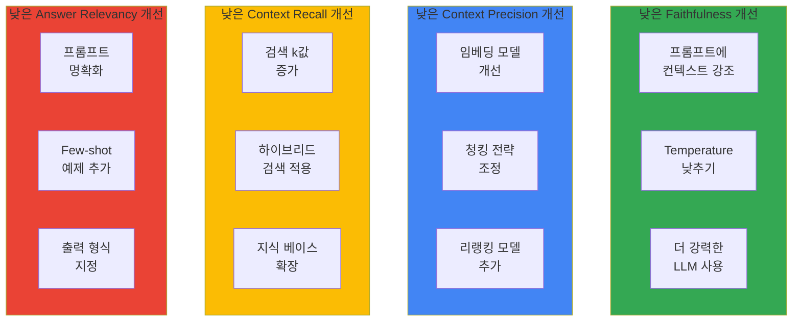

import { RagasVsBedrockComparison, RagasMetrics, CostOptimizationStrategies, CostComparison, ImprovementChecklist } from '@site/src/components/RagasTables';

Ragas(RAG Assessment)는 RAG(Retrieval-Augmented Generation) 파이프라인의 품질을 객관적으로 평가하기 위한 오픈소스 프레임워크입니다. Agentic AI 플랫폼에서 RAG 시스템의 성능을 측정하고 지속적으로 개선하는 데 필수적입니다.

## 1. 개요

### RAG 평가가 필요한 이유

RAG 시스템은 여러 컴포넌트(검색, 생성, 컨텍스트 처리)로 구성되어 있어 전체 품질을 측정하기 어렵습니다:



### Ragas vs AWS Bedrock RAG Evaluation

:::tip AWS Bedrock RAG Evaluation GA
AWS Bedrock RAG Evaluation은 **2025년 3월 GA**되었습니다. Bedrock 네이티브 통합으로 별도 설정 없이 RAG 평가를 수행할 수 있습니다.
:::

<RagasVsBedrockComparison />

**AWS Bedrock RAG Evaluation 메트릭:**

- **Context Relevance**: 검색된 컨텍스트가 질문과 관련있는지
- **Coverage**: 답변이 질문의 모든 측면을 다루는지
- **Correctness**: 답변이 정확한지 (ground truth 대비)
- **Faithfulness**: 답변이 컨텍스트에 충실한지

### Ragas 핵심 메트릭

<RagasMetrics />

:::note 이 페이지의 Ragas 기준 버전
Ragas **0.4.3**, Python **3.11**, `ragas.metrics.collections`의 `ascore()` API를 사용합니다. [공식 마이그레이션 가이드](https://docs.ragas.io/en/stable/howtos/migrations/migrate_from_v03_to_v04/)에 따라 메트릭 객체에 LLM·embeddings를 명시하고 `MetricResult.value`를 읽습니다. 기본·종합·CI·캐시 예제 모두 같은 API를 사용합니다.
:::

## 2. 설치 및 기본 설정

### Python 환경 설정

실행 파일과 고정 의존성은 저장소의 [examples/ragas-evaluation](https://github.com/devfloor9/engineering-playbook/tree/main/examples/ragas-evaluation)에 있습니다. 아래 설치 명령 이후의 Python 예제는 해당 디렉터리에서 실행합니다.

```bash
# Run from the repository root; Python 3.11 is the verified baseline.
python3.11 -m venv /tmp/ragas-evaluation-venv
source /tmp/ragas-evaluation-venv/bin/activate
python -m pip install -r examples/ragas-evaluation/requirements.txt
cd examples/ragas-evaluation
python test_smoke.py
```

`requirements.txt`는 Ragas 0.4.3, OpenAI 2.54.0, Instructor 1.17.0 및 검증한 전이 의존성을 고정합니다. Ragas 0.4.3이 import하는 VertexAI 모듈이 `langchain-community` 0.4.2에는 없어, 검증된 0.3.31을 사용합니다. 예제 자체는 LangChain wrapper를 사용하지 않습니다. 단순히 `ragas>=0.2`로 설치하면 이 구성을 재현할 수 없습니다.

`test_smoke.py`는 네트워크 연결을 차단하고 모의 HTTP 응답으로 실제 메트릭을 실행합니다. API 키와 유료 호출은 필요하지 않습니다. 이 검증은 모델 응답 품질이나 실제 서비스 접근 권한을 확인하지 않습니다.

### 기본 평가 코드

`ragas_eval.py`의 `make_metrics()`는 다음과 같이 evaluator를 구성합니다. LLM은 구조화된 판정을 생성하고, embeddings는 `AnswerRelevancy`의 질문 유사도 계산에 사용됩니다. 두 모델을 모두 명시해야 합니다.

```python
from openai import AsyncOpenAI
from ragas.embeddings import OpenAIEmbeddings
from ragas.llms import llm_factory
from ragas.metrics.collections import (
    Faithfulness, AnswerRelevancy, ContextPrecision, ContextRecall,
)

# The caller supplies an AsyncOpenAI client with an explicit API key and base URL.
def make_basic_metrics(client: AsyncOpenAI):
    llm = llm_factory("gpt-4o-mini", provider="openai", client=client, temperature=0)
    embeddings = OpenAIEmbeddings(client=client, model="text-embedding-3-small")
    return {
        "faithfulness": Faithfulness(llm=llm),
        "answer_relevancy": AnswerRelevancy(llm=llm, embeddings=embeddings, strictness=3),
        "context_precision": ContextPrecision(llm=llm),
        "context_recall": ContextRecall(llm=llm),
    }
```

아래 코드는 **유료 API 호출을 수행**합니다. 실행 전에 환경에 `OPENAI_API_KEY`를 설정하고 지정한 두 모델의 접근 권한을 확인하세요. 키를 소스 파일에 기록하지 마세요. `CASES`와 `demo_pipeline`은 모듈에 정의된 두 개의 고정 입력이며, 실제 RAG 시스템의 품질을 측정하는 데이터셋이 아닙니다.

```python
import asyncio
import os
from openai import AsyncOpenAI
from ragas_eval import (
    BASE_URL, CASES, collect_samples, demo_pipeline,
    make_metrics, quality_failures, score_samples,
)

async def main():
    samples = collect_samples(CASES, demo_pipeline)
    async with AsyncOpenAI(
        api_key=os.environ["OPENAI_API_KEY"], base_url=BASE_URL,
        timeout=60, max_retries=0,
    ) as client:
        report = await score_samples(samples, make_metrics(client))
    print(report["metrics"])
    failures = quality_failures(report)
    if failures:
        raise RuntimeError("; ".join(failures))

asyncio.run(main())
```

`score_samples()`는 각 메트릭에 필요한 필드만 `await metric.ascore(...)`로 전달합니다. 예외, NaN, 무한대, 비숫자 결과는 해당 점수를 `null`로 기록하고 오류 유형을 남깁니다. 하나라도 실패한 메트릭의 평균은 `null`이며 품질 게이트가 실패합니다. 정상 점수만 골라 평균 내거나 NaN을 0으로 바꾸지 않습니다. 노트북에서는 `asyncio.run(main())` 대신 `await main()`을 사용하세요.

## 3. 핵심 메트릭 상세 설명

### 1. Faithfulness (충실도)

`Faithfulness(llm=llm)`은 답변을 주장으로 나누고 검색된 컨텍스트가 각 주장을 뒷받침하는지 평가합니다. `ascore(user_input=..., response=..., retrieved_contexts=...)`에 필요한 값을 전달합니다. 0.4.3 구현에서는 생성된 주장이 없으면 NaN을 반환할 수 있으므로 결과의 유한성을 검사해야 합니다.

### 2. Answer Relevancy (답변 관련성)

`AnswerRelevancy(llm=llm, embeddings=embeddings, strictness=3)`는 답변에서 질문을 생성하고 원본 질문과 임베딩 유사도를 비교합니다. `ascore(user_input=..., response=...)`를 사용합니다. 사실의 정확성은 별도 메트릭으로 평가하며, NaN은 낮은 관련성 점수로 해석하지 말고 평가 실패로 처리하세요.

### 3. Context Precision (컨텍스트 정밀도)

이 예제의 `ContextPrecision(llm=llm)`은 **reference 답변을 사용하는** 메트릭입니다. `ascore(user_input=..., reference=..., retrieved_contexts=...)`로 검색 결과 순위에서 유용한 컨텍스트가 얼마나 앞에 있는지 평가합니다. 관련 문서 수를 전체 문서 수로 나누는 단순 비율과는 다릅니다.

### 4. Context Recall (컨텍스트 재현율)

`ContextRecall(llm=llm)`은 reference 답변의 주장 중 검색된 컨텍스트로 뒷받침되는 비율을 평가합니다. `ascore(user_input=..., retrieved_contexts=..., reference=...)`를 사용합니다. 따라서 reference가 누락되면 이 페이지의 평가 데이터 계약을 충족하지 못합니다.

공식 [메트릭 문서](https://docs.ragas.io/en/stable/concepts/metrics/available_metrics/faithfulness/)와 [0.4.3 구현](https://github.com/vibrantlabsai/ragas/tree/v0.4.3/src/ragas/metrics/collections)을 기준으로 합니다.

## 4. 종합 평가 파이프라인

### 전체 RAG 시스템 평가

파이프라인 어댑터 계약은 `pipeline(question: str) -> {"response": str, "retrieved_contexts": list[str]}`입니다. `collect_samples(cases, pipeline)`가 질문·reference와 결과를 결합합니다. 검색 순서를 유지하고 실제 생성기에 제공한 컨텍스트를 반환하세요. 아래 어댑터는 페이지에서 바로 실행할 수 있는 고정 데이터 예제입니다.

```python
from pathlib import Path
from ragas_eval import CASES, DEMO_DOCUMENTS, collect_samples, save_json

# A complete fixture adapter. Replace its body with your initialized RAG pipeline.
def pipeline(question: str) -> dict:
    context = DEMO_DOCUMENTS[question]
    return {"response": context, "retrieved_contexts": [context]}

# Only the question goes to the pipeline; reference answers stay with the evaluator.
samples = collect_samples(CASES, pipeline)
save_json(Path("samples.json"), samples)
```

```bash
# Paid evaluation, after setting OPENAI_API_KEY in the environment.
python ragas_eval.py --live --comprehensive --samples samples.json \
  --output results/evaluation.json
```

실제 시스템에서는 `pipeline()` 본문에서 초기화된 검색기·생성기를 호출하도록 바꾸고 `CASES`도 도메인 전문가가 검증한 질문·reference로 교체하세요. 어댑터는 동기 함수입니다. 비동기 파이프라인은 실행 결과를 같은 스키마의 JSON 배열로 저장해 `--samples`로 전달할 수 있습니다. 입력은 비어 있지 않아야 하며 각 샘플에 `user_input`, `response`, `retrieved_contexts`, `reference`가 모두 필요합니다. 어댑터·입력 검증 오류는 평가 시작 전에 실행을 실패시킵니다.

`--comprehensive`는 기본 네 메트릭에 `AnswerCorrectness(llm=llm, embeddings=embeddings, weights=[0.75, 0.25], beta=1.0)`를 추가합니다. 동일한 evaluator로 `user_input`, `response`, `reference`를 평가하며 설정은 결과 JSON에 기록됩니다. CLI는 `--live`와 API 키가 없으면 호출을 시작하지 않습니다.

### 평가 결과 분석

```python
import json
from pathlib import Path
from ragas_eval import quality_failures

report = json.loads(Path("results/evaluation.json").read_text(encoding="utf-8"))
for metric, score in report["metrics"].items():
    print(f"{metric}: {score:.3f}" if score is not None else f"{metric}: FAILED")
print(f"Failed samples: {report['failed_samples']}/{report['sample_count']}")
for failure in quality_failures(report):
    print(failure)
```

결과는 `metrics`(전체 샘플의 평균), `rows`(샘플별 점수·오류·캐시 여부), `failed_samples`, `sample_count`, `config`를 포함합니다. `null` 점수는 비교 대상에서 제외할 수 있는 정상값이 아닙니다. 해당 샘플의 오류를 해결한 후 다시 평가하세요. 기록되는 샘플에는 질문·답변·컨텍스트·reference가 포함되므로 테스트 데이터와 결과 파일의 공유 범위를 정하세요.

## 5. CI/CD 파이프라인 통합

### GitHub Actions 워크플로우

아래는 소비자가 별도로 추가할 수 있는 워크플로우 예시입니다. PR에서는 오프라인 검증만 수행하고, 수동 실행에서 `live`를 선택한 경우에만 저장소 secret으로 평가합니다. 예시의 유료 실행 대상은 고정 데이터이며 실제 회귀 평가에는 자체 `--samples` 파일을 연결하세요. Linux GitHub runner에서의 실행은 이 페이지의 로컬 검증 범위에 포함되지 않습니다.

```yaml
# Illustrative .github/workflows/rag-evaluation.yml; not installed by this guide.
name: Ragas Evaluation
on:
  pull_request:
    paths:
      - 'examples/ragas-evaluation/**'
  workflow_dispatch:
    inputs:
      live:
        description: 'Run paid evaluation of the bundled fixtures'
        type: boolean
        default: false
permissions:
  contents: read
jobs:
  evaluate:
    runs-on: ubuntu-latest
    defaults:
      run:
        working-directory: examples/ragas-evaluation
    steps:
      - uses: actions/checkout@v4
      - uses: actions/setup-python@v5
        with:
          python-version: '3.11'
      - name: Install the same pinned dependencies
        run: python -m pip install -r requirements.txt
      - name: Offline smoke checks
        run: python test_smoke.py
      - name: Evaluate and enforce quality gates
        if: github.event_name == 'workflow_dispatch' && inputs.live
        env:
          OPENAI_API_KEY: ${{ secrets.OPENAI_API_KEY }}
          RAGAS_DO_NOT_TRACK: 'true'
        run: python ragas_eval.py --live --comprehensive --output results/evaluation.json
      - name: Upload evaluation report even if quality gates fail
        if: always() && github.event_name == 'workflow_dispatch' && inputs.live
        uses: actions/upload-artifact@v4
        with:
          name: evaluation-results
          path: examples/ragas-evaluation/results/evaluation.json
```

### 품질 게이트 스크립트

CLI는 보고서를 먼저 저장하고 품질 게이트 실패 시 종료 코드 1을 반환합니다. 저장된 보고서는 다음처럼 같은 함수로 다시 검사할 수 있습니다.

```python
import json
from pathlib import Path
from ragas_eval import quality_failures

report = json.loads(Path("results/evaluation.json").read_text(encoding="utf-8"))
failures = quality_failures(report)
for failure in failures:
    print(failure)
raise SystemExit(1 if failures else 0)
```

예제 임계값은 faithfulness 0.8, answer relevancy 0.75, context precision·recall 각각 0.7입니다. Ragas 기본값이나 측정으로 확정된 기준이 아니므로 자체 평가셋으로 조정하세요. 누락·비유한 점수, 빈 결과, 불완전한 행 수, 행과 평균의 불일치도 실패합니다. 종합 평가의 answer correctness는 유효성을 검사하지만 이 예제에는 별도 점수 임계값이 없습니다.

## 6. Kubernetes Job으로 정기 평가

:::note 배포 개요
이 절의 Kubernetes 리소스는 사용자 정의 평가 이미지·설정·저장소 연동을 전제로 한 배포 개요입니다. 위 Python 예제가 ConfigMap, S3 출력, Milvus 연결을 자동 구현하지는 않습니다. 실행 가능한 Ragas 예제의 검증 범위는 로컬 smoke check까지입니다.
:::

### 평가 Job 정의

```yaml
apiVersion: batch/v1
kind: CronJob
metadata:
  name: rag-evaluation
  namespace: genai-platform
spec:
  schedule: "0 6 * * *"  # 매일 오전 6시
  jobTemplate:
    spec:
      template:
        spec:
          containers:
          - name: evaluator
            image: your-registry/rag-evaluator:latest
            env:
            - name: OPENAI_API_KEY
              valueFrom:
                secretKeyRef:
                  name: openai-credentials
                  key: api-key
            - name: MILVUS_HOST
              value: "milvus-proxy.ai-data.svc.cluster.local"
            - name: RESULTS_BUCKET
              value: "s3://rag-evaluation-results"
            command:
            - python
            - /app/evaluate.py
            - --config=/app/config/evaluation.yaml
            - --output=s3
            resources:
              requests:
                cpu: "1"
                memory: "2Gi"
              limits:
                cpu: "2"
                memory: "4Gi"
          restartPolicy: OnFailure
          serviceAccountName: rag-evaluator
```

### 평가 설정 ConfigMap

```yaml
apiVersion: v1
kind: ConfigMap
metadata:
  name: rag-evaluation-config
  namespace: genai-platform
data:
  evaluation.yaml: |
    evaluation:
      metrics:
        - faithfulness
        - answer_relevancy
        - context_precision
        - context_recall
      
      test_sets:
        - name: "general_knowledge"
          path: "s3://test-data/general.json"
          weight: 0.4
        - name: "technical_docs"
          path: "s3://test-data/technical.json"
          weight: 0.6
      
      quality_gates:
        faithfulness: 0.8
        answer_relevancy: 0.75
        context_precision: 0.7
        context_recall: 0.7
      
      alerts:
        slack_webhook: "https://hooks.slack.com/..."
        threshold_drop: 0.1  # 10% 이상 하락 시 알림
```

## 7. 평가 결과 해석 및 개선 가이드

### 비용 최적화 전략

RAG 평가는 LLM API 호출이 필요하므로 비용이 발생합니다. 다음 전략으로 비용을 최적화하세요:

<CostOptimizationStrategies />

캐시는 위 실행 모듈에서 제공하는 선택 기능입니다. 입력 순서를 유지하고, 같은 평가 안의 중복 입력도 재사용합니다. 키에는 질문·답변·검색 컨텍스트·reference, 메트릭 목록, 모델·endpoint·파라미터, 의존성 버전, 프롬프트 revision이 포함됩니다. 모든 메트릭이 성공한 샘플만 저장하며 실패·NaN 캐시 항목은 다시 계산합니다.

```bash
# The same metrics, configuration, sample format, and quality gates as above.
python ragas_eval.py --live --comprehensive --samples samples.json \
  --cache results/eval-cache.json --revision default-prompts-v1 \
  --output results/evaluation.json
```

모델 별칭이 가리키는 모델이나 프롬프트·메트릭 설정을 바꾸면 `--revision`을 변경하거나 캐시를 삭제하세요. 기존 모델의 점수를 재사용하면 변경 이후의 품질을 측정할 수 없습니다. 이 JSON 캐시는 단일 프로세스용이며 동시 실행 간 잠금이나 자동 만료 기능은 없습니다.

### AWS Bedrock RAG Evaluation 사용

AWS Bedrock RAG Evaluation을 사용하면 Bedrock 네이티브 통합으로 더 간편하게 평가할 수 있습니다:

```python
import boto3

bedrock = boto3.client('bedrock-agent-runtime')

# RAG 평가 실행
response = bedrock.evaluate_rag(
    evaluationJobName='rag-eval-2026-02-13',
    evaluationDatasetLocation={
        's3Uri': 's3://my-bucket/eval-dataset.jsonl'
    },
    evaluationMetrics=[
        'CONTEXT_RELEVANCE',
        'COVERAGE',
        'CORRECTNESS',
        'FAITHFULNESS'
    ],
    modelId='anthropic.claude-sonnet-4-5-20250929-v1:0',  # 또는 cross-region inference profile: us.anthropic.claude-sonnet-4-5-20250929-v1:0
    outputDataConfig={
        's3Uri': 's3://my-bucket/eval-results/'
    }
)

job_id = response['evaluationJobId']

# 평가 결과 조회
result = bedrock.get_evaluation_job(evaluationJobId=job_id)
print(f"Status: {result['status']}")
print(f"Metrics: {result['metrics']}")
```

**Bedrock RAG Evaluation 장점:**

- ✅ Bedrock 모델과 네이티브 통합
- ✅ S3 기반 대규모 배치 평가
- ✅ CloudWatch 자동 메트릭 게시
- ✅ IAM 기반 접근 제어
- ✅ 별도 인프라 불필요

**비용 비교 (1000개 평가 기준):**

<CostComparison />

### 메트릭별 개선 방향



### 개선 체크리스트

<ImprovementChecklist />

## 참고 자료

### 공식 문서
- [Ragas 0.4 migration guide](https://docs.ragas.io/en/stable/howtos/migrations/migrate_from_v03_to_v04/)
- [Ragas 0.4.3 collections source](https://github.com/vibrantlabsai/ragas/tree/v0.4.3/src/ragas/metrics/collections)
- [Ragas 0.4.3 LLM factory and imports](https://github.com/vibrantlabsai/ragas/blob/v0.4.3/src/ragas/llms/base.py)
- [Ragas 0.4.3 native OpenAI embeddings](https://github.com/vibrantlabsai/ragas/blob/v0.4.3/src/ragas/embeddings/openai_provider.py)
- [AWS Bedrock RAG Evaluation](https://docs.aws.amazon.com/bedrock/)

### 관련 문서
- [Milvus 벡터 데이터베이스](../data-infrastructure/milvus-vector-database.md)
- [Agent 모니터링](../observability/agent-monitoring.md)
- [Agentic AI 플랫폼 아키텍처](../../design-architecture/foundations/agentic-platform-architecture.md)

:::tip 권장 사항

- 평가 데이터셋은 최소 50개 이상의 다양한 질문을 포함하세요
- Ground truth는 도메인 전문가가 검증한 정답을 사용하세요
- 정기적인 평가를 통해 시간에 따른 품질 변화를 추적하세요
:::

:::warning 주의사항

- Ragas 평가는 LLM API 호출이 필요하므로 비용이 발생합니다
- 대규모 평가 시 배치 처리와 캐싱을 활용하세요
- 평가 결과는 사용된 LLM에 따라 달라질 수 있습니다
:::
