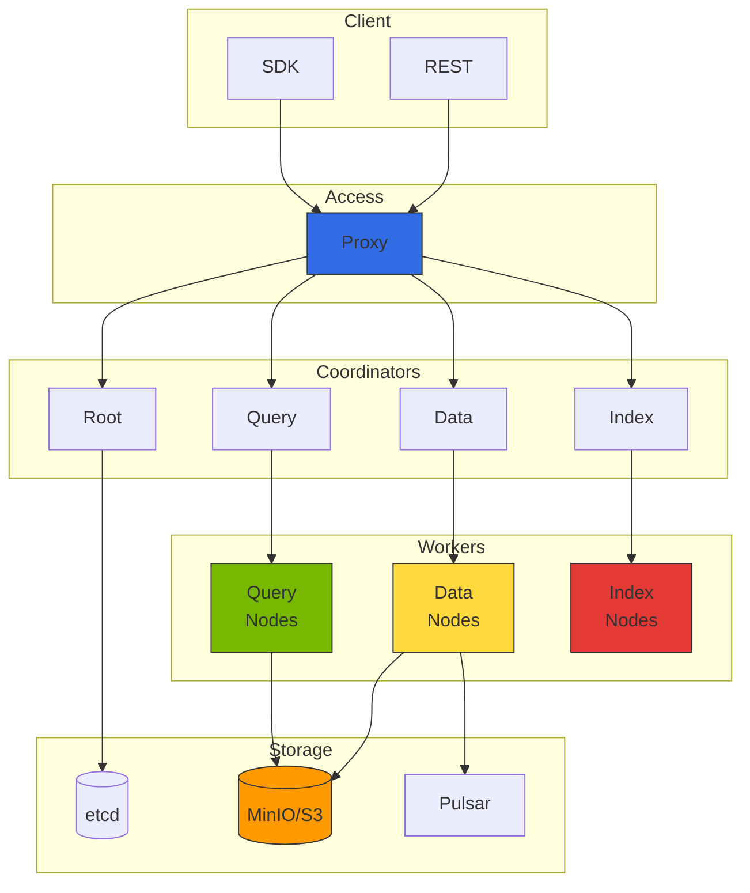

import {
  ComponentRolesTable,
  IndexComparisonTable,
  MonitoringMetricsTable,
  GPUInstanceTable,
  GPUIndexingPerformanceTable,
  StorageCostComparisonTable
} from '@site/src/components/MilvusTables';

# Milvus 벡터 데이터베이스 통합

> 📅 **작성일**: 2026-02-13 | **수정일**: 2026-02-14 | ⏱️ **읽는 시간**: 약 4분

Milvus v2.4.x는 대규모 벡터 유사도 검색을 위한 오픈소스 벡터 데이터베이스입니다. Agentic AI 플랫폼에서 RAG(Retrieval-Augmented Generation) 파이프라인의 핵심 컴포넌트로 활용됩니다.

## 개요

### Milvus가 필요한 이유

Agentic AI 시스템에서 벡터 데이터베이스는 다음과 같은 역할을 수행합니다:

- **지식 저장소**: 문서, FAQ, 제품 정보 등을 임베딩 벡터로 저장
- **의미 기반 검색**: 키워드가 아닌 의미적 유사성 기반 검색
- **컨텍스트 제공**: LLM에 관련 정보를 제공하여 환각(hallucination) 감소
- **장기 메모리**: Agent의 대화 히스토리 및 학습 내용 저장


## Milvus 클러스터 아키텍처

### 분산 아키텍처 구성요소



### 컴포넌트 역할

<ComponentRolesTable />

## EKS 배포 가이드

### 배포 개요

Milvus는 EKS에서 Helm 차트를 통해 배포할 수 있습니다. 프로덕션 환경에서는 다음 컴포넌트를 고려해야 합니다:

- **Cluster Mode**: 분산 아키텍처로 고가용성 제공
- **etcd**: 메타데이터 저장 (최소 3개 복제본 권장)
- **Storage**: MinIO 또는 Amazon S3/S3 Express One Zone
- **Message Queue**: Pulsar (이벤트 스트리밍)
- **Query/Data/Index Nodes**: 워크로드에 따라 스케일링

**권장 리소스 구성:**
- Proxy: 2+ replicas, 1-2 CPU, 2-4Gi 메모리
- Query Node: 3+ replicas, 2-4 CPU, 8-16Gi 메모리
- Data Node: 2+ replicas, 1-2 CPU, 4-8Gi 메모리
- Index Node: 2+ replicas, 2-4 CPU, 8-16Gi 메모리

### Amazon S3 통합

MinIO 대신 Amazon S3를 직접 사용하면 운영 부담을 줄일 수 있습니다. S3 Express One Zone을 사용하면 더 빠른 성능과 낮은 지연 시간을 제공합니다.

:::tip S3 Express One Zone 장점

- **10배 빠른 성능**: 표준 S3 대비 10배 빠른 데이터 액세스
- **일관된 밀리초 지연**: 단일 자리 밀리초 지연 시간
- **비용 효율**: 요청 비용 50% 절감
- **단일 AZ**: 동일 AZ 내 컴퓨팅 리소스와 함께 사용 시 최적

:::

**S3 통합 고려사항:**
- IRSA(IAM Roles for Service Accounts)를 사용한 권한 관리
- S3 버킷 정책: GetObject, PutObject, DeleteObject, ListBucket 권한 필요
- S3 Express One Zone: 단일 AZ 제한, 고성능 요구 시 권장

:::info 상세 배포 가이드
Milvus 배포 상세 절차, Helm values 설정, S3 IAM 정책 예제는 [Milvus 공식 Helm 차트 문서](https://milvus.io/docs/install_cluster-helm.md)를 참조하세요.
:::

## 인덱스 타입 선택 가이드

### 주요 인덱스 타입 비교

<IndexComparisonTable />

### SCANN 인덱스 (Milvus 2.4+)

Google의 Scalable Nearest Neighbors(SCANN) 인덱스는 Milvus 2.4에서 추가된 고성능 인덱스입니다:

```python
# SCANN 인덱스 생성
index_params = {
    "metric_type": "COSINE",
    "index_type": "SCANN",
    "params": {
        "nlist": 1024,  # 클러스터 수
        "with_raw_data": True,  # 원본 데이터 저장 여부
    }
}

collection.create_index(field_name="embedding", index_params=index_params)
collection.load()
```

**SCANN 장점:**
- HNSW와 유사한 검색 속도
- IVF 계열보다 높은 정확도
- 메모리 사용량이 HNSW보다 낮음
- 대규모 데이터셋에서 우수한 성능

### 인덱스 생성 예제

```python
from pymilvus import Collection, CollectionSchema, FieldSchema, DataType

# 컬렉션 스키마 정의
fields = [
    FieldSchema(name="id", dtype=DataType.INT64, is_primary=True, auto_id=True),
    FieldSchema(name="text", dtype=DataType.VARCHAR, max_length=65535),
    FieldSchema(name="embedding", dtype=DataType.FLOAT_VECTOR, dim=1536),
    FieldSchema(name="metadata", dtype=DataType.JSON),
]

schema = CollectionSchema(fields=fields, description="Document embeddings")
collection = Collection(name="documents", schema=schema)

# HNSW 인덱스 생성 (고성능 검색용)
index_params = {
    "metric_type": "COSINE",
    "index_type": "HNSW",
    "params": {
        "M": 16,           # 그래프 연결 수 (높을수록 정확, 메모리 증가)
        "efConstruction": 256  # 인덱스 빌드 품질 (높을수록 정확, 빌드 시간 증가)
    }
}

collection.create_index(field_name="embedding", index_params=index_params)
collection.load()
```

## LangChain/LlamaIndex 통합

### LangChain 통합 예제

```python
from langchain_community.vectorstores import Milvus
from langchain_openai import OpenAIEmbeddings
from langchain.text_splitter import RecursiveCharacterTextSplitter
from langchain_community.document_loaders import DirectoryLoader

# 문서 로드 및 분할
loader = DirectoryLoader("./documents", glob="**/*.md")
documents = loader.load()

text_splitter = RecursiveCharacterTextSplitter(
    chunk_size=1000,
    chunk_overlap=200,
    length_function=len,
)
splits = text_splitter.split_documents(documents)

# 임베딩 모델 설정
embeddings = OpenAIEmbeddings(model="text-embedding-3-small")

# Milvus 벡터 스토어 생성
vectorstore = Milvus.from_documents(
    documents=splits,
    embedding=embeddings,
    connection_args={
        "host": "milvus-proxy.ai-data.svc.cluster.local",
        "port": "19530",
    },
    collection_name="langchain_docs",
    drop_old=True,
)

# 유사도 검색
query = "Kubernetes에서 GPU 스케줄링하는 방법"
docs = vectorstore.similarity_search(query, k=5)

for doc in docs:
    print(f"Content: {doc.page_content[:200]}...")
    print(f"Metadata: {doc.metadata}")
    print("---")
```

### LlamaIndex 통합 예제

```python
from llama_index.core import VectorStoreIndex, SimpleDirectoryReader, Settings
from llama_index.vector_stores.milvus import MilvusVectorStore
from llama_index.embeddings.openai import OpenAIEmbedding

# 임베딩 모델 설정
Settings.embed_model = OpenAIEmbedding(model="text-embedding-3-small")

# Milvus 벡터 스토어 설정
vector_store = MilvusVectorStore(
    uri="http://milvus-proxy.ai-data.svc.cluster.local:19530",
    collection_name="llamaindex_docs",
    dim=1536,
    overwrite=True,
)

# 문서 로드 및 인덱싱
documents = SimpleDirectoryReader("./documents").load_data()
index = VectorStoreIndex.from_documents(
    documents,
    vector_store=vector_store,
)

# 쿼리 엔진 생성
query_engine = index.as_query_engine(similarity_top_k=5)

# 질의 수행
response = query_engine.query("Agentic AI 플랫폼 아키텍처 설명해줘")
print(response)
```

### RAG 파이프라인 전체 구성

```python
from langchain_openai import ChatOpenAI
from langchain.chains import RetrievalQA
from langchain.prompts import PromptTemplate

# LLM 설정
llm = ChatOpenAI(
    model="gpt-4o",
    temperature=0,
)

# 프롬프트 템플릿
prompt_template = """다음 컨텍스트를 사용하여 질문에 답변하세요.
컨텍스트에 답변이 없으면 "정보가 없습니다"라고 말하세요.

컨텍스트:
{context}

질문: {question}

답변:"""

PROMPT = PromptTemplate(
    template=prompt_template,
    input_variables=["context", "question"]
)

# RAG 체인 구성
qa_chain = RetrievalQA.from_chain_type(
    llm=llm,
    chain_type="stuff",
    retriever=vectorstore.as_retriever(
        search_type="mmr",  # Maximum Marginal Relevance
        search_kwargs={"k": 5, "fetch_k": 10}
    ),
    chain_type_kwargs={"prompt": PROMPT},
    return_source_documents=True,
)

# 질의 수행
result = qa_chain.invoke({"query": "GPU 리소스 관리 방법은?"})
print(f"Answer: {result['result']}")
print(f"Sources: {[doc.metadata for doc in result['source_documents']]}")
```

## 쿼리 최적화

### 검색 파라미터 튜닝

```python
# 검색 파라미터 설정
search_params = {
    "metric_type": "COSINE",
    "params": {
        "ef": 128,  # HNSW 검색 범위 (높을수록 정확, 느림)
    }
}

# 필터링과 함께 검색
results = collection.search(
    data=[query_embedding],
    anns_field="embedding",
    param=search_params,
    limit=10,
    expr='metadata["category"] == "kubernetes"',  # 메타데이터 필터
    output_fields=["text", "metadata"],
)
```

### 하이브리드 검색 (벡터 + 키워드)

```python
from pymilvus import AnnSearchRequest, RRFRanker

# 벡터 검색 요청
vector_search = AnnSearchRequest(
    data=[query_embedding],
    anns_field="embedding",
    param={"metric_type": "COSINE", "params": {"ef": 64}},
    limit=20
)

# 키워드 검색을 위한 BM25 스코어 (별도 필드 필요)
# Milvus 2.4+ 에서 지원

# RRF(Reciprocal Rank Fusion)로 결과 병합
results = collection.hybrid_search(
    reqs=[vector_search],
    ranker=RRFRanker(k=60),
    limit=10,
    output_fields=["text", "metadata"]
)
```

## 고가용성 및 백업

### 데이터 백업 전략

Milvus는 공식 백업 도구(`milvus-backup`)를 제공하여 컬렉션 데이터를 백업하고 복원할 수 있습니다.

**백업 고려사항:**
- 백업 대상: MinIO/S3 버킷으로 컬렉션 데이터 내보내기
- 백업 주기: 일일 또는 주간 백업 권장
- 백업 크기 제한: `maxSegmentGroupSize` 설정으로 청크 크기 제어
- 복원 전략: 동일 클러스터 또는 다른 클러스터로 복원 가능

### 재해 복구 구성

프로덕션 환경에서는 크로스 리전 복제를 통한 재해 복구 전략을 권장합니다.

**DR 전략:**
- **크로스 리전 S3 복제**: 백업 데이터를 다른 AWS 리전으로 자동 복제
- **복구 시간 목표(RTO)**: S3 복제 지연 + Milvus 클러스터 프로비저닝 시간
- **복구 시점 목표(RPO)**: 백업 주기에 따라 결정 (일반적으로 6-24시간)
- **자동화**: CronJob을 사용한 주기적 백업 및 동기화

:::info 상세 백업 가이드
백업 도구 설치, 설정 파일 작성, CronJob 구성 등 상세 절차는 [Milvus 백업 및 복원 가이드](https://milvus.io/docs/backup_and_restore.md)를 참조하세요.
:::

## 모니터링 및 메트릭

### Prometheus 메트릭 수집

Milvus는 Prometheus 형식의 메트릭을 `/metrics` 엔드포인트에서 제공합니다. ServiceMonitor를 사용하여 자동으로 메트릭을 수집할 수 있습니다.

**메트릭 수집 설정:**
- 엔드포인트: `/metrics` (기본 포트 9091)
- 수집 주기: 30초 권장
- 레이블: `app.kubernetes.io/name: milvus`로 필터링

### 주요 모니터링 메트릭

<MonitoringMetricsTable />

### Grafana 대시보드

**권장 시각화 패널:**
- Search Latency P99: `histogram_quantile(0.99, rate(milvus_proxy_search_latency_bucket[5m]))`
- Query Throughput: `sum(rate(milvus_proxy_search_vectors_count[5m]))`
- Memory Usage: `milvus_querynode_memory_used_bytes`
- Collection Size: `milvus_collection_num_entities`

:::info 상세 모니터링 가이드
ServiceMonitor YAML, Grafana 대시보드 JSON, 알람 규칙 설정은 [Milvus 모니터링 가이드](https://milvus.io/docs/monitor.md)를 참조하세요.
:::

---

## Kubernetes Operator 기반 배포

Milvus Operator를 사용하면 복잡한 분산 아키텍처를 선언적으로 관리할 수 있습니다.

### Milvus Operator 개요

**Operator 장점:**
- **선언적 관리**: Milvus CRD로 클러스터 구성 정의
- **자동 스케일링**: HPA와 연동하여 컴포넌트별 자동 스케일링
- **롤링 업데이트**: 무중단 업그레이드 지원
- **의존성 관리**: etcd, MinIO, Pulsar 자동 배포

**주요 컴포넌트 설정:**
- Cluster Mode 활성화
- etcd 복제본 수 (최소 3개)
- Storage 백엔드 (MinIO 또는 S3)
- Pulsar 메시지 큐 활성화
- 각 노드 타입별 replica 및 리소스 설정

### GPU 가속 인덱싱

Index Node에 GPU를 할당하면 인덱스 빌드 속도를 크게 향상시킬 수 있습니다.

**GPU 인덱싱 설정:**
- GPU 리소스 요청: `nvidia.com/gpu: 1`
- NodeSelector로 GPU 노드 지정
- Toleration으로 GPU taint 처리

**권장 GPU 인스턴스:**

<GPUInstanceTable />

**GPU 인덱싱 성능 비교:**

<GPUIndexingPerformanceTable />

:::info 상세 Operator 가이드
Milvus Operator 설치, CRD 스키마, GPU 설정 예제는 [Milvus Operator 문서](https://milvus.io/docs/install_cluster-milvusoperator.md)를 참조하세요.
:::

---

## 관련 문서

- [Agentic AI 플랫폼 아키텍처](../design-architecture/agentic-platform-architecture.md)
- [Agentic AI 기술 도전과제](../design-architecture/agentic-ai-challenges.md)
- [Ragas RAG 평가 프레임워크](../operations-mlops/ragas-evaluation.md)
- [Agent 모니터링](../operations-mlops/agent-monitoring.md)

:::info 권장 사항

- 프로덕션 환경에서는 최소 3개의 Query Node를 운영하세요
- 대규모 데이터셋(1억+ 벡터)에서는 DISKANN 인덱스를 고려하세요
- S3를 스토리지로 사용하면 운영 복잡도를 크게 줄일 수 있습니다
- S3 Express One Zone을 사용하면 10배 빠른 성능과 50% 저렴한 요청 비용을 제공합니다
- GPU를 사용한 인덱싱으로 빌드 시간을 크게 단축할 수 있습니다 (g5.xlarge 권장)
- Milvus v2.4.x는 SCANN 인덱스, 하이브리드 검색, 스칼라 필터링, 동적 스키마 등 고급 기능을 제공합니다
- Helm 차트 버전 4.1.x를 사용하여 Milvus 2.4.x를 배포하세요
:::

### 스토리지 비용 비교

<StorageCostComparisonTable />

**권장 사항:**
- **개발/테스트**: MinIO (간편한 설정)
- **프로덕션 (일반)**: S3 Standard (비용 효율)
- **프로덕션 (고성능)**: S3 Express One Zone (10배 빠른 성능)

:::warning 주의사항

- 인덱스 빌드는 CPU/메모리를 많이 사용하므로 별도 시간대에 수행하세요
- 컬렉션 삭제 시 데이터가 영구 삭제되므로 백업을 먼저 확인하세요
- GPU Index Node는 비용이 높으므로 필요한 경우에만 활성화하세요
- S3 Express One Zone은 단일 AZ에 제한되므로 고가용성 요구사항을 고려하세요
:::
