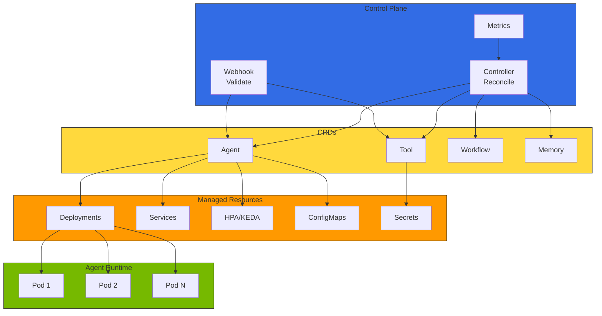
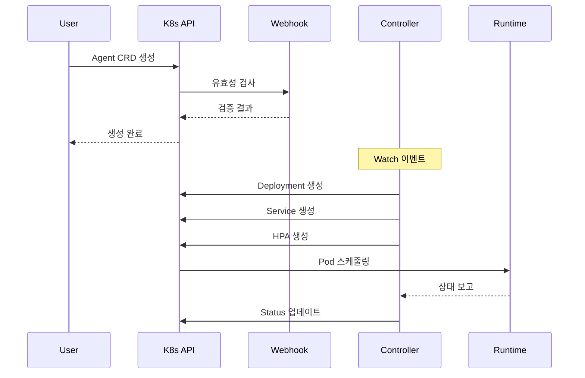
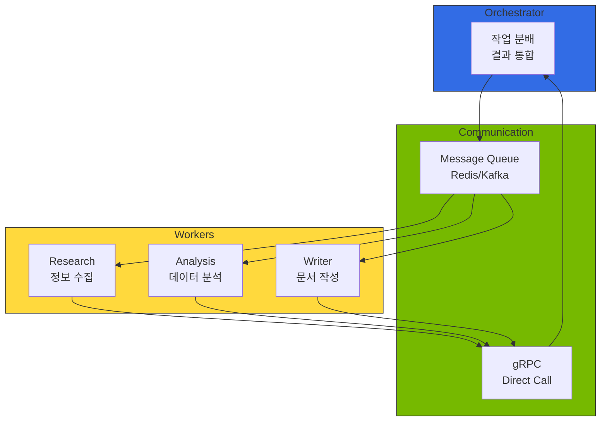
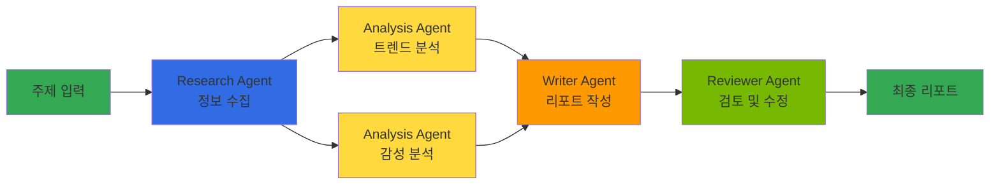

# Kagent - Kubernetes AI Agent 관리

다중 모델 생태계에서 AI 에이전트는 여러 LLM/SLM을 호출하고, MCP/A2A 프로토콜로 도구와 다른 에이전트에 연결되며, 트래픽에 따라 동적으로 스케일링되어야 합니다. Kubernetes의 **Operator 패턴**은 이러한 에이전트를 CRD로 선언적으로 정의하고 자동으로 라이프사이클을 관리하는 가장 자연스러운 방식입니다. Kagent는 이 패턴을 AI 에이전트에 적용한 참조 아키텍처입니다.

## 1. 개요

Kagent는 Custom Resource Definition(CRD)을 통해 에이전트, 도구, 워크플로우를 선언적으로 정의하고, Operator가 이를 자동으로 배포 및 관리합니다. Deployment, Service, ConfigMap을 직접 작성하는 대신 `Agent` CRD 하나로 모델 연결, 도구 바인딩, 스케일링 정책을 통합 관리할 수 있습니다.

:::warning Kagent 프로젝트 상태
Kagent는 현재 참조 아키텍처 및 디자인 패턴 단계이며, 공식 오픈소스 프로젝트가 아직 공개되지 않았습니다. 본 문서의 예제는 개념적 구현을 기반으로 합니다. 프로덕션 환경에서는 **Bedrock AgentCore**, **KubeAI**, **LangGraph Platform** 등 검증된 대안을 고려하세요.

Kagent 배포 가이드는 [Kagent 공식 문서](https://github.com/kagent-dev/kagent)를 참조하세요.
:::

### 대안 솔루션 비교

import { SolutionsComparisonTable } from '@site/src/components/KagentTables';

<SolutionsComparisonTable />

### 주요 기능

- **선언적 에이전트 관리**: YAML 기반 에이전트 정의 및 배포
- **도구 레지스트리**: 에이전트가 사용할 도구를 CRD로 중앙 관리
- **자동 스케일링**: HPA/KEDA 통합을 통한 동적 확장
- **멀티 에이전트 오케스트레이션**: 복잡한 워크플로우를 위한 에이전트 간 협업
- **관측성 통합**: Langfuse/LangSmith, OpenTelemetry와의 네이티브 연동

:::info 대상 독자
이 문서는 Kubernetes 관리자, 플랫폼 엔지니어, MLOps 엔지니어를 대상으로 합니다. Kubernetes 기본 개념(Pod, Deployment, CRD)에 대한 이해가 필요합니다.
:::

:::tip re:Invent 2025 관련 세션

**CNS421: Streamline Amazon EKS Operations with Agentic AI** — Kagent와 같은 AI 에이전트를 활용한 EKS 클러스터 자동 관리, 실시간 이슈 진단, 자동 복구 방법을 다루는 코드 토크 세션입니다.

**주요 내용:**
- **Model Context Protocol (MCP)**: AI 에이전트가 AWS 서비스와 통합하기 위한 표준 프로토콜
- **자동화된 인시던트 대응**: Pod 장애, 리소스 부족, 네트워크 문제 자동 진단 및 복구
- **AWS 서비스 통합**: CloudWatch, Systems Manager, EKS API와의 네이티브 연동

[세션 영상 보기](https://www.youtube.com/watch?v=4s-a0jY4kSE)
:::

---

## 2. Kagent 아키텍처

Kagent는 Kubernetes Operator 패턴을 따르며, Controller, CRD, Webhook으로 구성됩니다.



### 컴포넌트 설명

import { ComponentsTable } from '@site/src/components/KagentTables';

<ComponentsTable />

### 컴포넌트 상호작용



### 사전 요구사항

- Kubernetes 클러스터 (v1.25 이상)
- kubectl CLI 도구
- Helm v3 (Helm 설치 시)
- cert-manager (Webhook TLS 인증서 관리)

---

## 3. CRD 구조

### Agent CRD

Agent CRD는 AI 에이전트의 모든 설정을 선언적으로 정의합니다. 아래는 핵심 스펙 구조입니다:

```yaml
apiVersion: kagent.dev/v1alpha1
kind: Agent
metadata:
  name: customer-support-agent
  namespace: ai-agents
spec:
  # 에이전트 기본 정보
  displayName: "고객 지원 에이전트"
  description: "고객 문의에 응답하고 티켓을 생성하는 AI 에이전트"

  # 모델 설정
  model:
    provider: openai          # openai, anthropic, bedrock, vllm
    name: gpt-4-turbo
    endpoint: ""              # 커스텀 엔드포인트 (vLLM 등)
    temperature: 0.7
    maxTokens: 4096
    apiKeySecretRef:
      name: openai-api-key
      key: api-key

  # 시스템 프롬프트
  systemPrompt: |
    당신은 친절하고 전문적인 고객 지원 에이전트입니다.

  # 사용할 도구 목록
  tools:
    - name: search-knowledge-base
    - name: create-ticket

  # 메모리 설정
  memory:
    type: redis
    config:
      host: redis-master.ai-data.svc.cluster.local
      ttl: 3600
      maxHistory: 50

  # 스케일링 설정
  scaling:
    minReplicas: 2
    maxReplicas: 10
    metrics:
      - type: cpu
        target:
          averageUtilization: 70
    keda:
      enabled: true
      triggers:
        - type: prometheus
          metadata:
            metricName: agent_active_sessions
            threshold: "50"

  # 리소스 제한
  resources:
    requests:
      memory: "512Mi"
      cpu: "250m"
    limits:
      memory: "1Gi"
      cpu: "500m"

  # 관측성 설정
  observability:
    tracing:
      enabled: true
      provider: langfuse       # langfuse, langsmith, cloudwatch (상세: ../operations-mlops/observability/llmops-observability.md)
    metrics:
      enabled: true
      port: 9090
```

### Tool CRD

Tool CRD는 에이전트가 사용할 수 있는 도구를 정의합니다. 도구 유형은 `api`, `retrieval`, `code`, `human`이 있습니다.

**주요 필드:**

| 필드 | 설명 | 예시 |
|------|------|------|
| `spec.type` | 도구 유형 | `retrieval`, `api`, `code`, `human` |
| `spec.description` | LLM이 도구 선택 시 참조하는 설명 | "지식 베이스에서 문서 검색" |
| `spec.retrieval` | 벡터 스토어 연결 설정 | Milvus, Pinecone 등 |
| `spec.api` | REST API 호출 설정 | 엔드포인트, 인증, 타임아웃 |
| `spec.parameters` | 입력 파라미터 스키마 | name, type, required, enum |
| `spec.output` | 출력 스키마 | JSON Schema 형식 |

### Memory CRD

에이전트의 대화 컨텍스트와 상태를 저장하기 위한 메모리 설정입니다.

**주요 기능:**

| 기능 | 설명 |
|------|------|
| **세션 메모리** | Redis/PostgreSQL 기반 단기 대화 기록 (TTL 설정) |
| **대화 압축** | 임계값 초과 시 LLM으로 대화 요약 |
| **장기 메모리** | 벡터 스토어 기반 에이전트 경험 누적 |
| **메모리 유형** | `redis`, `postgres`, `in-memory` |

### Workflow CRD

Workflow CRD를 사용하여 멀티 에이전트 워크플로우를 정의합니다.

**핵심 구조:**

| 필드 | 설명 |
|------|------|
| `spec.input` | 워크플로우 입력 파라미터 정의 |
| `spec.steps` | 단계별 에이전트 실행 정의 (순차/병렬) |
| `spec.steps[].dependsOn` | 의존 단계 지정 (DAG 구성) |
| `spec.steps[].parallel` | 병렬 실행 여부 |
| `spec.output` | 워크플로우 최종 출력 매핑 |
| `spec.errorHandling` | 단계/워크플로우 실패 시 동작 |
| `spec.timeout` | 전체 워크플로우 타임아웃 |
| `spec.concurrency` | 동시 실행 제한 (queue/reject/replace) |

---

## 4. 멀티 에이전트 오케스트레이션

복잡한 작업을 여러 에이전트가 협업하여 처리하는 워크플로우를 정의합니다.

### 에이전트 간 통신 패턴



### 오케스트레이션 패턴

| 패턴 | 설명 | 적합한 경우 |
|------|------|-----------|
| **순차 파이프라인** | 단계별 순차 실행, 이전 단계 출력이 다음 입력 | 데이터 처리, ETL |
| **병렬 팬아웃** | 동일 입력을 여러 에이전트에 병렬 전달 | 다각도 분석, A/B 비교 |
| **DAG 워크플로우** | 의존성 기반 유향 비순환 그래프 실행 | 복잡한 리서치, 보고서 생성 |
| **루프** | 조건 충족까지 반복 실행 | 검토-수정 사이클, 품질 검증 |
| **라우팅** | 입력 내용에 따라 다른 에이전트로 분기 | 문의 분류, 전문 영역 분배 |

### 워크플로우 예시: 리서치 리포트



워크플로우 실행 상태는 `WorkflowRun` CRD를 통해 추적합니다:

| 상태 | 설명 |
|------|------|
| `Pending` | 실행 대기 중 |
| `Running` | 하나 이상의 단계가 실행 중 |
| `Succeeded` | 모든 단계 성공 완료 |
| `Failed` | 하나 이상의 단계 실패 (재시도 소진) |

---

## 5. Agent 라이프사이클 관리

### Operator가 관리하는 리소스

Agent CRD를 생성하면 Controller가 다음 리소스를 자동으로 생성/관리합니다:

```
Agent CRD 생성
  ├── Deployment (에이전트 Pod 관리)
  ├── Service (네트워크 접근)
  ├── HPA/KEDA ScaledObject (자동 스케일링)
  ├── ConfigMap (에이전트 설정)
  └── Secret 참조 (API 키, 인증 정보)
```

### 업데이트 전략

| 전략 | 설명 | 권장 시나리오 |
|------|------|-------------|
| **롤링 업데이트** | 기본 전략. Pod를 점진적으로 교체 | 일반적인 설정 변경 |
| **카나리 배포** | 별도 Agent CRD로 새 버전 테스트 | 모델 변경, 프롬프트 대규모 수정 |
| **블루-그린** | 두 버전을 동시 운영 후 트래픽 전환 | 무중단 마이그레이션 |

### 스케일링 전략

| 메트릭 | 설명 | 임계값 예시 |
|--------|------|-----------|
| CPU 사용률 | 기본 리소스 기반 스케일링 | 70% |
| 메모리 사용률 | 메모리 압박 시 스케일 아웃 | 80% |
| 활성 세션 수 | KEDA + Prometheus 커스텀 메트릭 | 50 세션/Pod |
| 요청 처리량 | 초당 요청 수 기반 | 100 RPS/Pod |

---

## 6. 관측성 통합

Agent 실행 트레이스는 Langfuse, LangSmith, CloudWatch Generative AI Observability 중 하나로 전송합니다. 각 도구의 비교는 [LLMOps Observability 비교](llmops-observability.md)를 참조하세요.

배포 가이드:
- **Langfuse**: [아키텍처](agent-monitoring.md), [Helm 배포](../../reference-architecture/integrations/monitoring-observability-setup.md)
- **LangSmith**: [LangSmith 공식 문서](https://docs.smith.langchain.com/)
- **CloudWatch**: [AWS Generative AI Observability](https://docs.aws.amazon.com/cloudwatch/)

### 핵심 알림 규칙

| 알림 | 조건 | 심각도 |
|------|------|--------|
| 에이전트 오류율 증가 | 오류율 > 5% (5분 지속) | Critical |
| 에이전트 응답 지연 | P99 > 30초 (5분 지속) | Warning |
| Pod 가용성 저하 | Ready Pod < 50% (5분 지속) | Critical |

---

## 7. 결론

Kagent를 활용하면 Kubernetes 환경에서 AI 에이전트를 선언적으로 관리할 수 있습니다. 주요 이점은 다음과 같습니다:

- **선언적 관리**: YAML 기반 에이전트 정의로 GitOps 워크플로우 지원
- **자동화된 운영**: Operator 패턴을 통한 자동 복구 및 스케일링
- **표준화**: CRD를 통한 에이전트 정의 표준화
- **확장성**: Kubernetes 네이티브 스케일링 메커니즘 활용
- **관측성**: 통합 모니터링 및 추적 지원

:::tip 다음 단계

- [Agentic AI Platform 아키텍처](../../design-architecture/foundations/agentic-platform-architecture.md) - 전체 플랫폼 설계
- [Agent 모니터링](agent-monitoring.md) - Langfuse/LangSmith 통합 가이드
- [GPU 리소스 관리](../../model-serving/gpu-infrastructure/gpu-resource-management.md) - 동적 리소스 할당

:::

---

## 참고 자료

### 공식 문서
- [Kagent 개념 및 디자인 패턴](https://github.com/kagent-dev/kagent)
- [KubeAI - Kubernetes AI Platform](https://github.com/substratusai/kubeai)
- [Bedrock AgentCore](https://docs.aws.amazon.com/bedrock/latest/userguide/agents-core.html)
- [LangGraph Platform](https://langchain-ai.github.io/langgraph/)
- [Kubernetes Operator Pattern](https://kubernetes.io/docs/concepts/extend-kubernetes/operator/)
- [KEDA Documentation](https://keda.sh/docs/)
- [re:Invent 2025 CNS421 - Streamline EKS Operations with Agentic AI](https://www.youtube.com/watch?v=4s-a0jY4kSE)

### 관련 문서
- [Agentic AI Platform 아키텍처](../../design-architecture/foundations/agentic-platform-architecture.md)
- [Agent 모니터링](./agent-monitoring.md)
- [GPU 리소스 관리](../../model-serving/gpu-infrastructure/gpu-resource-management.md)
