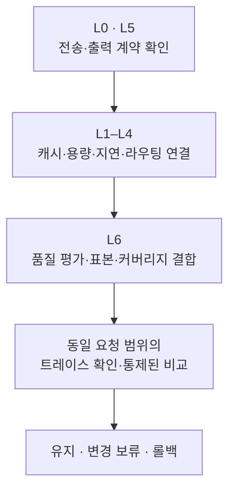

## 1. 개요 {#overview}

이 문서는 vLLM 기반 추론 풀의 캐시·용량·지연·라우팅 지표를 연결하여 조사할 원인을 좁히는 방법을 설명합니다. HTTP 성공, 응답 전달 완료, 출력 형식 충족, 내용의 정확도를 별도 결과로 관리합니다. 대상 독자는 추론 엔진과 게이트웨이의 메트릭·트레이스를 운영하는 플랫폼 팀입니다. 인프라 지표를 품질 점수로 대체하거나, 동시 발생만으로 원인을 확정하지 않습니다.

| 문서 | 범위 | 이 문서와의 관계 |
|---|---|---|
| [Agent 모니터링 및 운영](./agent-monitoring.md) | 트레이스·점수 저장과 운영 | 수집 기반 |
| [LLMOps Observability](./llmops-observability.md) | 도구 비교와 평가 파이프라인 | 도구 선택 |
| [캐시 히트율 전략](../../model-serving/inference-optimization/cache-hit-strategy.md) | 캐시 계층과 측정 전략 | 워크로드별 목표 설정의 배경 |
| [히트율 튜닝과 정확도 상관 검증](./prefix-cache-tuning-accuracy-correlation.md) | 데이터 계약·상관 분석·품질 게이트 | 튜닝 검증 절차 |

**검증 범위:** 엔진 정의는 vLLM `v0.26.0`의 고정 소스를 기준으로 합니다. EPP 지표 예시는 llm-d-router `v0.10.0` 기준입니다. 다른 이미지에서는 해당 릴리스의 `/metrics` HELP·TYPE·라벨과 설정을 먼저 대조합니다. 모든 수치와 임계값은 설명용 예시이며, 운영 실측이나 보장값이 아닙니다. 외부 KV 전송을 사용하는 구성은 로컬 캐시와 별도로 집계합니다.

## 2. 배경 {#background}

HTTP 200은 특히 스트리밍에서 전달 완료를 보장하지 않습니다. 응답 헤더 이후 오류나 연결 종료가 발생할 수 있습니다. vLLM의 OpenAI 호환 스트림은 오류 데이터 뒤에도 `[DONE]`을 보낼 수 있으므로, 종료 마커만으로 성공을 판정해서도 안 됩니다. 클라이언트 또는 게이트웨이에서 오류 이벤트, 각 choice의 종료 사유, 프로토콜 종료, 취소 여부를 함께 기록합니다([서빙 소스](https://github.com/vllm-project/vllm/blob/v0.26.0/vllm/entrypoints/openai/chat_completion/serving.py)).

Prefix caching은 동일한 토큰 prefix와 캐시 키에 대응하는 KV를 재사용하여 prefill 계산을 줄입니다. 캐시 미스는 품질 점수 하락을 의미하지 않습니다. 다만 설계상의 출력 보존을 모든 실행의 비트 단위 동일성으로 해석하면 안 됩니다. vLLM은 기본 설정에서 재현성을 보장하지 않으며, 배치 구성·커널·하드웨어·엔진 버전에 따라 결과가 달라질 수 있습니다. 비암호학적 캐시 해시의 충돌 위험도 별도 검토 대상입니다([캐시 설계](https://github.com/vllm-project/vllm/blob/v0.26.0/docs/design/prefix_caching.md), [재현성](https://github.com/vllm-project/vllm/blob/v0.26.0/docs/usage/reproducibility.md)).

Preemption은 실행 중인 요청을 대기 상태로 되돌려 나중에 재개하는 동작입니다. 용량 압박·추가 계산·지연의 신호이지만 그 횟수로 정확도를 측정할 수는 없습니다. 지연 증가가 클라이언트 취소나 불완전한 응답으로 이어졌는지는 요청별 트레이스로 확인합니다. 내용 품질에는 정답 기반 평가, 사람의 검토, 검증 가능한 도구 실행 결과, LLM-as-a-Judge 등 별도 평가가 필요합니다. Judge 점수 역시 오류와 편향이 있는 추정값입니다.

## 3. 7층 시맨틱 지표 체계 {#metric-layers}

| 층 | 질문 | 주요 신호 | 해석의 한계 |
|---|---|---|---|
| L0 계약·가용성 | 요청과 스트림이 완료됐는가 | HTTP 상태, 프로토콜 완료, 오류·취소, `up` | 내용 정확도는 측정하지 않음 |
| L1 캐시 효율 | prefix를 얼마나 재사용했는가 | `vllm:prefix_cache_hits_total`, `vllm:prefix_cache_queries_total`, 요청별 cached 토큰 | 낮은 비율의 원인은 별도 조사 |
| L2 용량 | 실행 수요를 수용하는가 | `vllm:kv_cache_usage_perc`, `vllm:num_preemptions_total`, running·waiting 요청 수 | 캐시 유틸만으로 축출이나 품질 저하 확정 불가 |
| L3 지연 | 사용자가 얼마나 기다렸는가 | TTFT, ITL, 요청별 TPOT, queue·e2e 지연 | 서로 다른 모집단의 percentile은 직접 차감 불가 |
| L4 라우팅 | 어떤 endpoint를 선택했는가 | EPP 시도·실패·지연, endpoint별 queue와 요청 분포 | scorer 실행이 적절한 선택을 증명하지 않음 |
| L5 출력 프록시 | 응답 계약 위반 가능성이 있는가 | `finished_reason`, 출력 길이, 재시도, 루프 횟수 | 짧은 출력·`length`가 항상 실패는 아님 |
| L6 품질 평가 | 정의된 과제를 충족했는가 | 계약 검사, 정답 평가, 사람·judge 점수와 커버리지 | 평가 기준·표본·평가자에 종속 |

TTFT(Time to First Token)는 요청 후 첫 토큰을 받을 때까지의 시간입니다. ITL(Inter-Token Latency)은 연속된 출력 토큰 사이의 간격이고, TPOT(Time per Output Token)는 요청 하나에서 출력 토큰을 생성하는 데 걸린 평균 시간입니다.

ITL 히스토그램에는 토큰 사이의 간격이 각각 들어가므로 긴 응답이 더 많은 표본을 만듭니다. 요청별 평균 TPOT 히스토그램에는 요청마다 평균값 하나가 들어갑니다. 두 히스토그램은 같은 요청 집합에서도 가중치가 다르므로 동일한 지표처럼 섞지 않습니다.

다음 화살표는 분석 순서이며 계층 사이의 인과관계를 뜻하지 않습니다.



## 4. 캐시 히트율 분해 {#cache-analysis}

### 4.1 네 개의 분해 축 {#cache-breakdown}

- **풀·모델:** 동일한 집계 범위의 hit rate 합을 query rate 합으로 나눕니다. Pod별 비율의 단순 평균은 요청량을 반영하지 않습니다. 같은 `model_name`을 쓰는 별도 풀은 풀 식별 라벨로 분리합니다.
- **Pod·엔진:** 로컬 캐시는 엔진 replica의 상태이며 노드 전체 공유 캐시가 아닙니다. 낮은 히트율과 새 Pod 생성, 요청 분포, 모델 revision, prefix 유사도를 비교합니다. 분산이 불균등하다는 사실만으로 라우팅 오류를 확정하지 않습니다.
- **테넌트:** 게이트웨이가 실제로 수집한 cached 토큰과 총 입력 토큰을 비교합니다. 누락된 usage는 0 hit와 구분합니다. sparse 카운터를 0으로 채우는 것은 exporter 계약상 시리즈 부재가 0임이 확인된 경우에만 허용합니다.
- **템플릿·버전:** prefix의 token ID, chat template, LoRA, 멀티모달 키, cache salt를 확인합니다. 버전 문자열 변경만으로 캐시가 무효화되지는 않습니다. 키나 토큰이 달라질 때 재사용 범위가 달라집니다.

엔진 기본 라벨은 `model_name`, `engine`입니다. 아래 PromQL은 수집 설정이 `cluster`, `namespace`, `pod`를 대상 라벨로 추가하고, `(cluster, namespace, pod, engine)`당 엔진 메트릭 수집원이 하나라고 가정합니다. HA 중복 수집은 제거하고, 여러 서버가 같은 Pod에 있으면 `instance` 등 식별 키를 추가합니다. `cluster`가 remote write의 external label에만 있다면 로컬 쿼리에는 없을 수 있습니다.

```promql
# Token-weighted hit ratio; no traffic remains undefined, not zero.
(
  sum by (cluster, namespace, pod, model_name, engine) (
    rate(vllm:prefix_cache_hits_total[5m])
  )
  /
  sum by (cluster, namespace, pod, model_name, engine) (
    rate(vllm:prefix_cache_queries_total[5m])
  )
)
and on (cluster, namespace, pod, model_name, engine)
(
  sum by (cluster, namespace, pod, model_name, engine) (
    rate(vllm:prefix_cache_queries_total[5m])
  ) > 0
)
```

`rate()`를 각 카운터에 먼저 적용한 뒤 합산해야 재시작에 따른 리셋을 처리할 수 있습니다. `v0.26.0`의 prefix 카운터는 요청 수나 블록 수가 아닌 **토큰 수**를 셉니다. 재개된 preempted 요청의 조회 통계는 별도 필드에 집계되므로 이 비율을 모든 재계산 작업의 비율로 해석하지 않습니다([통계 소스](https://github.com/vllm-project/vllm/blob/v0.26.0/vllm/v1/metrics/stats.py)).

### 4.2 비활성·누락·구조적 미스 {#cache-eligibility}

`vllm:cache_config_info`는 설정을 라벨로 내보내는 값 1의 gauge입니다. `model_name`은 없고 `engine`은 있으므로 위 수집 계약에서는 `(cluster, namespace, pod, engine)`으로 연결합니다. `enable_prefix_caching="False"`는 비활성 상태입니다. 설정 시리즈 자체가 없으면 비활성이 아니라 수집 실패·버전 차이 등을 포함한 **unknown**입니다.

구조적 미스는 요청별로 재사용 가능한 공유 prefix가 매칭 단위에 도달하지 못하는 경우 등을 뜻합니다. 평균·p50 프롬프트 길이와 물리적 `block_size`만으로 풀 전체를 분류하지 않습니다. 예를 들어 **합성 예시**에서 full-block 매칭만 지원하는 엔진의 단위가 32토큰이고 공유 prefix가 20토큰이면 완성된 공유 블록이 없습니다. 전체 프롬프트가 200토큰이어도 같은 문제가 발생합니다.

일반적인 full-block 설명에는 엔진별 예외가 있습니다. `v0.26.0`의 `prefix_match_unit`은 물리적 블록보다 작은 경계에서 매칭할 수 있도록 정의되지만, 상태 저장 빈도를 바꾸지는 않습니다. hybrid attention의 그룹별 제약도 확인해야 합니다. 따라서 `block_size`의 문자열 정규식이나 큰 블록 플래그로 경보를 제외하지 않습니다([CacheConfig](https://github.com/vllm-project/vllm/blob/v0.26.0/vllm/config/cache.py)).

### 4.3 cached prefill과 멀티턴 {#saved-prefill}

동일한 완료 요청 집합에서 다음 차이는 cached prefill 토큰의 초당 집계값입니다. 고정 소스는 요청별 `prompt_tokens - max(cached_tokens, 0)`를 prefill computed 히스토그램에 기록합니다. 이는 실제 GPU 연산량, preemption 재계산 총량, 현금 비용 절감의 측정값이 아닙니다. 외부 KV 전송이 있으면 로컬 캐시 카운터와 모집단도 다를 수 있습니다.

```promql
sum by (cluster, namespace, model_name) (
  rate(vllm:request_prompt_tokens_sum[5m])
)
-
sum by (cluster, namespace, model_name) (
  rate(vllm:request_prefill_kv_computed_tokens_sum[5m])
)
```

음수 결과는 조용히 0으로 보정하지 않고 수집 누락·버전·집계 범위를 조사합니다. 경제적 효과는 cached 토큰 절대량과 TTFT·처리량·사용 자원·실제 청구 범위를 함께 비교합니다. 자체 서빙의 GPU 비용과 provider가 청구하는 cached 토큰 할인은 별도 계약입니다.

멀티턴 append-only 입력은 재사용 기회를 늘릴 수 있지만, 턴마다 히트율이 단조 증가해야 하는 것은 아닙니다. 대상 replica, 축출, chat template 직렬화, 도구 메시지, context 절단, cache salt가 영향을 줍니다. 문자열의 유사성보다 최종 token ID prefix와 관련 캐시 키를 확인합니다.

### 4.4 판정 규칙의 평가 순서 {#cache-classification}

1. **unknown:** 대상·필수 시리즈·설정이 누락되거나 오래됐습니다.
2. **disabled:** prefix caching 비활성이 설정으로 확인됐습니다.
3. **idle:** 조회량이 평가에 필요한 하한보다 낮습니다.
4. **within-target:** 해당 워크로드의 효율 목표를 충족합니다. 품질 합격과 별개입니다.
5. **structural-miss hypothesis:** 요청별 공유 prefix와 실제 매칭 제약을 확인합니다.
6. **capacity / prompt / routing / reset hypotheses:** KV·대기열·배포·요청 구성을 함께 조사합니다. 원인은 동시에 존재할 수 있습니다.

### 4.5 요청 간 시간차와 블록 잔존 시간 {#cache-residency}

로컬 prefix 캐시는 고정 TTL 대신 free queue의 축출 정책을 사용합니다. 다음 지표는 `v0.26.0`에서 `--kv-cache-metrics`로 활성화하고 `--kv-cache-metrics-sample`로 표본율을 지정합니다. 기본값은 비활성·0.01이며 `--disable-log-stats`가 설정되어 있으면 동작하지 않습니다([ObservabilityConfig](https://github.com/vllm-project/vllm/blob/v0.26.0/vllm/config/observability.py)).

| 히스토그램 | 측정값 | 제한 |
|---|---|---|
| `vllm:kv_block_idle_before_evict_seconds` | 마지막 touch부터 축출까지 | 다음 요청에 보장되는 잔존 시간 아님 |
| `vllm:kv_block_reuse_gap_seconds` | 표본 블록의 touch 사이 간격 | 최근 간격만 ring buffer에 보관 |
| `vllm:kv_block_lifetime_seconds` | 할당부터 축출까지 | 현재 살아 있는 블록의 수명 분포 아님 |

세 분포 모두 **표본 블록의 축출 이벤트를 통해 관측값이 보고**됩니다. 관측 창의 장수 블록은 아직 포함되지 않을 수 있고, 재사용되지 않은 블록에는 reuse gap이 없습니다. 서로 다른 분포의 p95·p50 비교는 탐색 지표이지 개별 세션의 hit/miss 판정식이 아닙니다. 긴 lifetime·짧은 idle만으로 장기 decode 원인도 확정할 수 없습니다([수집 소스](https://github.com/vllm-project/vllm/blob/v0.26.0/vllm/v1/metrics/loggers.py)).

트레이스에서는 사용자 턴 간격과 애플리케이션 내부의 도구 호출 간격을 구분합니다. 요청 시작 간격에는 이전 응답 시간이 포함되므로, 다음 시작 시각에서 이전 완료 시각을 뺀 idle gap도 기록합니다. cached 비율 대 간격 산점도는 연관성을 보여주지만, 라우팅·부하·prefix 변화가 섞여 있어 그 경계가 TTL을 뜻하지 않습니다.

## 5. 용량·지연·라우팅 조합 {#capacity-latency-routing}

### 5.1 용량과 지연 {#capacity-latency}

높은 KV 유틸과 preemption·대기열 증가는 용량 압박 가설을 강화합니다. 낮은 KV 유틸도 축출 이력이나 순간 포화를 배제하지 않습니다. 예시 임계값 0.85와 0.60은 보편적인 경계가 아닙니다. replica 증설은 개별 엔진의 KV 저장 공간을 늘리지 않고, 라우팅에 따라 재사용 locality를 낮출 수도 있습니다. `gpu_memory_utilization`, 동시 요청 한도, KV dtype 등은 한 번에 하나씩 비교하고, FP8 변경에는 품질 검증을 포함합니다.

TTFT 증가와 히트율 하락이 겹치면 prefill·대기열·입력 길이·스케일 이벤트를 조사합니다. 히트율이 평탄하다고 큐잉이 원인이라고 확정하지 않습니다. 토큰화, 네트워크, 모델 연산 변화도 후보입니다. 엔진과 게이트웨이 지연의 측정 시작점이 다르므로 p95끼리 빼서 계층별 비용을 계산하지 않습니다.

### 5.2 라우팅 {#routing}

EPP(Endpoint Picker)는 같은 풀 내 endpoint 선택을 담당하며, 모델 선택을 수행하는 LLM API Gateway와 구분합니다. 최신 프로젝트 분리와 사용 이미지의 지표 계약을 확인합니다. 아래는 llm-d-router `v0.10.0`의 명칭입니다. `inference_pool_*`, `inference_extension_*`, `inference_objective_*` 등의 legacy alias를 새 이름과 더하면 중복 집계됩니다([공식 카탈로그](https://github.com/llm-d/llm-d-router/blob/v0.10.0/docs/metrics.md)).

| 지표 | 용도 | 함께 확인할 것 |
|---|---|---|
| `llm_d_epp_ready_endpoints` | 가용 endpoint 수 | Pod 수와 반드시 같지는 않음 |
| `llm_d_epp_average_kv_cache_utilization` | 풀 평균 KV 사용 | 엔진별 편차·수집 시각 |
| `llm_d_epp_per_endpoint_queue_size` | endpoint별 queue | `name`, `model_server_endpoint` 라벨과 요청 분포 |
| `llm_d_epp_scheduler_attempts_total` | 스케줄 시도와 상태 | 실패 원인·후보 endpoint |
| `llm_d_epp_scheduler_e2e_duration_seconds` | 스케줄 지연 | gateway·engine trace |
| `llm_d_epp_plugin_duration_seconds` | 플러그인 실행 시간 | `extension_point`, `plugin_type`, `plugin_name` |

플러그인 시리즈의 존재는 해당 플러그인이 실행됐다는 근거입니다. 부재는 미설정뿐 아니라 무트래픽·수집 누락·경로 미실행일 수 있습니다. 활성 설정, 호출 경로, cache index 신선도, 실제 선택 결과를 함께 확인합니다. 세션 affinity는 특정 엔진으로 부하를 집중시킬 수 있고, cache scorer가 트레이드오프를 적절하게 처리하는지도 검증해야 합니다.

## 6. 출력 품질 프록시 {#output-proxies}

`vllm:request_success_total`은 이름과 달리 종료 사유별 요청을 집계합니다. `v0.26.0`의 enum은 `stop`, `length`, `abort`, `error`, `repetition`입니다. 엔진 `finished_reason`과 API의 `finish_reason`을 구분합니다. 예를 들어 API의 `tool_calls`를 엔진 종료 라벨에서 찾지 않습니다([종료 사유 소스](https://github.com/vllm-project/vllm/blob/v0.26.0/vllm/v1/engine/__init__.py)).

```promql
# Share of each engine finish reason among finished requests.
(
  sum by (cluster, namespace, model_name, finished_reason) (
    rate(vllm:request_success_total[5m])
  )
  / on (cluster, namespace, model_name) group_left
  sum by (cluster, namespace, model_name) (
    rate(vllm:request_success_total[5m])
  )
)
and on (cluster, namespace, model_name)
(
  sum by (cluster, namespace, model_name) (
    rate(vllm:request_success_total[5m])
  ) > 0
)
```

| 프록시 | 조사할 현상 | 단정할 수 없는 것 |
|---|---|---|
| `length` 증가 | `max_tokens` 또는 모델 길이 한도, 부하 테스트 설정 | 모든 `length` 응답이 과제 실패라는 판정 |
| 짧은 출력·빈 본문 | 거부, reasoning-only, 유효한 tool call, 간결한 정답 | 5토큰 미만이면 무조건 빈 답이라는 판정 |
| `abort` 증가 | 클라이언트 취소·deadline·연결 종료 | 지연 또는 클라이언트 결함 하나로 원인 귀속 |
| backend 실패·재시도 | 시도 횟수와 논리 요청 수, retry·fallback trace | 실패율을 그대로 숨은 재시도율로 사용 |
| gateway 오류·엔진 오류 부재 | 인증·네트워크·라우팅 및 엔진 수집 상태 | 엔진 시리즈가 없거나 0이면 엔진 정상이라는 판정 |
| Agent 스텝 증가 | 반복 tool call, 진행 여부, 시간·토큰 예산 | `vllm:iteration_tokens_total`로 Agent 스텝 대체 |

`vllm:iteration_tokens_total`은 이름에 `total`이 있지만 엔진 스텝당 토큰 수의 **히스토그램**입니다. Agent 루프 횟수 카운터가 아닙니다. 출력 토큰 수는 본문·reasoning·tool argument의 포함 범위를 먼저 정의합니다.

## 7. 품질 게이트 {#quality-gates}

### 7.1 점수 스키마 {#score-schema}

아래 이름은 이 가이드가 제안하는 애플리케이션 점수이며 Langfuse 내장 점수나 vLLM 메트릭이 아닙니다. `unknown`, `skipped`, evaluator 오류를 실패 0과 구분하고, 평가 대상 수·완료 수·누락 수를 함께 저장합니다.

| 점수 | 값 | 판정 계약 |
|---|---|---|
| `answer_present` | 0/1 | 과제에 필요한 응답 본문 또는 유효한 tool call 존재. 최종 답과 중간 tool 호출은 분리 |
| `not_truncated` | 0/1 또는 미평가 | 전송 완료와 정상 종료 사유가 확인된 경우에만 1. `length`·오류·중단은 0. 정보 부재는 미평가 |
| `format_valid` | 0/1 | 약정한 JSON Schema 등으로 타입·필수 키·추가 조건 검증 |
| `contains_expected` | 0/1 | 명시된 키워드 검사. 부정문·환각·의미적 정확도를 보장하지 않음 |
| `judge_accuracy`, `judge_helpfulness` | 0–1 | 버전이 고정된 rubric과 평가 입력에 대한 judge 추정치 |
| `judge_accepted` | 0/1 | 예: accuracy ≥ 0.7 및 helpfulness ≥ 0.5. 과제별로 검증할 예시 기준 |

출력 길이가 `max_tokens`에 도달했다는 사실만으로 잘림 여부를 확정하지 않습니다. JSON 펜스 제거 등 전처리도 계약이 허용할 때만 수행합니다. 임의의 `<...>` 제거는 유효한 사용자 출력을 훼손할 수 있습니다.

Langfuse는 NUMERIC, BOOLEAN, CATEGORICAL 점수를 지원합니다. 최신 Metrics API v2에는 `scores-boolean`이 있으며, self-hosted v3의 지원 API는 별도 호환성 표를 확인해야 합니다. NUMERIC 0/1 사용은 선택 가능한 스키마 결정이지 BOOLEAN 집계 불가의 일반 규칙이 아닙니다. 필터 연산자도 endpoint 버전으로 확인합니다([Metrics API](https://langfuse.com/docs/metrics/features/metrics-api)).

점수는 정확한 trace·observation에 연결합니다. 재시도에는 동일한 score ID를 쓰되, evaluator 버전·rubric·평가 반복 ID까지 키에 포함합니다. 다른 버전의 재평가를 같은 ID로 덮어쓰면 감사 이력이 사라집니다. 내용과 근거에는 접근 제어·보존·비식별 정책을 적용합니다([Scores API](https://langfuse.com/docs/evaluation/evaluation-methods/scores-via-sdk)).

### 7.2 샘플링과 예산 {#sampling}

형식 검사처럼 같은 입력에 정해진 판정을 내리는 검사는 적용 가능한 대상 전체에 실행하고, judge 평가는 예산 안에서 일부 요청을 뽑아 실행합니다. 예를 들어 요청의 2%를 선택하면서 템플릿별 최대 평가 건수도 제한하면, 요청이 많은 템플릿은 먼저 한도에 도달합니다. 이후 요청은 평가에 포함될 기회가 달라지므로 채점된 요청 전체를 균일한 무작위 표본으로 볼 수 없습니다.

어떤 규칙으로 표본을 골랐는지와 각 요청의 포함 확률을 저장하세요. 결과를 비교할 때는 템플릿·시간대 등 표본 설계에 맞춰 집단을 나누거나 적절한 가중치를 적용합니다.

평가 자체의 호출·토큰·비용·오류·지연을 계량하고, evaluator 요청을 일반 사용자 평가에서 제외합니다. 결과 목록을 폴링하는 방식은 인제스트 지연을 고려한 watermark·겹치는 재수집 구간·멱등 저장이 필요합니다. 마지막 처리 시각과 평가 커버리지를 표시하여 높은 점수와 데이터 부재를 구별합니다. 평가 대상의 비신뢰 입력이 judge 지시로 실행되지 않도록 rubric과 분리합니다.

### 7.3 Delivered 대 Accepted {#delivered-accepted}

분모를 일치시키기 전에는 전체 HTTP 성공률에서 sampled judge 합격률을 빼지 않습니다.

| 비율 | 분모 | 의미 |
|---|---|---|
| HTTP 성공률 | 대상 논리 요청 전체 | 상태 코드 기준 |
| Delivered | 대상 논리 요청 전체 | 성공적으로 응답·스트림 전달이 완료된 요청 |
| 평가 커버리지 | 평가 대상 Delivered 요청 | 유효한 평가 결과가 있는 요청의 비율 |
| Accepted among evaluated | 유효한 필수 평가가 모두 있는 요청 | 정해진 계약 검사와 품질 기준을 통과한 비율 |

동일한 평가 cohort에서 전달·계약·품질 결과를 연결하거나, 표본 설계에 맞는 추정치와 신뢰구간을 제시합니다. 곱셈으로 전체 합격률을 추정할 때도 표본 대표성 등 가정을 명시합니다. 미채점 응답은 자동 합격이 아닙니다.

### 7.4 히트율 튜닝과 정확도 게이트 {#tuning-quality-gate}

라우팅·용량 조정은 모델 입력 보존을 의도하지만 수치 비결정성·타임아웃·트래픽 배분의 영향은 남습니다. FP8 KV, 프롬프트 재배열, 직렬화 변경, context 절단, 모델·티어 변경은 출력에 영향을 줄 수 있습니다. 히트율 상승만으로 승격하지 않습니다.

변경 전에 품질 허용 저하폭, 평가 단위, 표본 크기, 비교 기간, rollback 조건을 정합니다. 동시간대 카나리는 시간 변화의 영향을 줄이지만 무작위 배정이나 비교 가능한 집단을 자동으로 보장하지 않습니다. 차이가 통계적으로 유의하지 않다는 결과만으로 합격시키지 않고, 허용 저하폭을 배제할 수 있는 신뢰구간과 coverage를 확인합니다. 상세 절차는 [품질 검증 가이드](./prefix-cache-tuning-accuracy-correlation.md#comparison-design)를 참조합니다.

## 8. 판정 매트릭스 {#decision-matrix}

아래 조합은 원인 확정 규칙이 아니라 조사 우선순위입니다. 예시 임계값은 워크로드 기준으로 조정합니다.

| 관측 조합 | 가설 | 다음 확인·조치 |
|---|---|---|
| 필수 시리즈 부재 | 수집 실패·미지원·설정 차이 | scrape 상태와 버전 확인 |
| 캐시 활성 + 낮은 hit + 짧은 공유 prefix | 매칭 단위 제약 | token prefix·그룹별 매칭 확인 |
| 낮은 hit + 높은 KV·preemption·queue | 용량 압박 | 요청 길이·동시성 확인 후 레버 하나씩 비교 |
| 낮은 hit + 새 Pod 또는 새 prefix | cold cache·키 변화 | 생성 이력·warm-up·부하 분포 확인 |
| 테넌트 A hit 하락 + B 부하 증가 | 공유 자원 경합 | 같은 엔진 도달 여부와 축출·부하 확인 |
| endpoint별 hit·queue 편차 | locality·불균형·요청 구성 차이 | scorer·트레이스·모델 revision 확인 |
| TTFT 증가 | queue·prefill·토큰화·네트워크 | 요청별 구간과 부하 변화 확인 |
| `length`·`abort`·`repetition` 증가 | 응답 계약 위반 가능성 | 종료 원인·과제·클라이언트 기록 확인 |
| backend 시도 증가 + HTTP 정상 | retry·fallback | 논리 요청과 backend 시도 연결 |
| 템플릿 변경 후 품질 저하 | 프롬프트 회귀 등 | 비교 가능한 cohort 평가 후 보류·롤백 |
| Agent 스텝·비용 증가 | 수렴 실패 가능성 | 최대 스텝·시간·토큰·도구 권한의 제한 |
| 긴 idle gap + 낮은 cached 비율 | 축출·다른 replica·입력 변화 | 세션·대상 엔진·최종 입력을 함께 확인 |

## 9. 구현 로드맵 {#implementation-roadmap}

1. **데이터 계약:** 이미지 revision, 라벨, 단위, usage 매핑, 요청·시도·세션 ID를 정의합니다.
2. **엔진·전송 뷰:** cache ratio와 조회량, KV·queue·지연, 종료 사유와 스트림 완료를 연결합니다.
3. **라우팅 뷰:** endpoint 선택·플러그인 실행·index 신선도를 연결합니다.
4. **평가 뷰:** 점수·평가자 버전·커버리지·처리 지연을 함께 표시합니다. Langfuse는 저장 옵션이며 별도 평가 저장소도 가능합니다.
5. **규칙 검증:** counter reset, 무트래픽, missing series, disabled cache, 다중 namespace를 합성 fixture로 검사한 뒤 운영 임계값을 설정합니다.

배포 매니페스트와 Prometheus Operator 설정은 [모니터링 스택 구성 가이드](../../reference-architecture/integrations/monitoring-observability-setup.md)에서 다룹니다. 이 문서의 PromQL은 해석용 예시이며 즉시 적용할 배포 설정이 아닙니다.

## 10. 알람과 recording rule {#alerts}

recording rule에는 조회량과 비율을 함께 저장합니다. 예를 들어 위 hit ratio를 `llm:prefix_cache_hit_ratio:rate5m`, 같은 차원의 query rate를 `llm:prefix_cache_queries:rate5m`으로 기록했다고 가정하면 다음은 **지속적인 저히트율** 조건입니다. 이전 대비 급락을 계산하지 않으므로 cliff라는 이름을 쓰지 않습니다.

```promql
(
  llm:prefix_cache_hit_ratio:rate5m < 0.5
)
and on (cluster, namespace, pod, model_name, engine)
(
  llm:prefix_cache_queries:rate5m > 1
)
and on (cluster, namespace, pod, engine)
(
  max by (cluster, namespace, pod, engine) (
    vllm:cache_config_info{enable_prefix_caching="True"}
  ) == 1
)
```

0.5, 초당 조회 토큰 1, 지속 시간 10분은 모두 예시입니다. 시리즈가 사라지면 이 조건은 발화하지 않으므로 별도 수집·설정 누락 경보가 필요합니다.

| 경보 후보 | 필요한 조건 | 제한 |
|---|---|---|
| PrefixCacheLow | 활성·충분한 조회량·낮은 hit 지속 | 낮은 hit만으로 장애나 용량 부족 확정 불가 |
| KvPressure | KV·preemption·queue·지연의 조합 | 워크로드별 기준 필요 |
| CacheResetActivity | process 재시작과 Pod 생성·교체 이력 | `changes(kube_pod_start_time[1h])`는 이름·UID가 바뀐 새 시리즈를 세지 못함 |
| RoutingImbalance | endpoint별 부하·지연·요청 분포 | queue 차이만으로 잘못된 라우팅 판정 불가 |
| OutputContractRegression | 충분한 표본의 과제별 계약 실패 증가 | synthetic 부하와 사용자 트래픽 분리 |
| EvaluationCoverageLow | coverage 하락·backlog·watermark 지연 | 점수 없음과 품질 저하 구분 |
| QualityRegression | 사전 정의된 품질 저하 기준 | judge 버전·표본·신뢰구간 필요 |

동일 Pod의 컨테이너 재시작에는 `kube_pod_container_status_restarts_total` 증가량을 참고하고, Pod 교체는 생성·UID·Deployment 이벤트 이력으로 추적합니다. 블록 잔존 percentile 교차는 탐색 패널에 두며 보편적인 축출 경보로 사용하지 않습니다.

## 11. 결론 {#summary}

7층 관측 체계는 효율·전송·품질을 같은 요청 범위에서 연결합니다. 캐시 히트율과 preemption은 정확도 측정값이 아니며, 원인 확정에는 트레이스와 통제된 비교가 필요합니다. 품질 게이트는 점수뿐 아니라 평가 커버리지·누락·불확실성도 포함합니다. 튜닝은 효율 개선과 사전 정의한 품질 제약을 함께 충족할 때 승격합니다.

## 참고 자료 {#references}

### 공식 문서·고정 소스

- [vLLM v0.26.0 metrics logger](https://github.com/vllm-project/vllm/blob/v0.26.0/vllm/v1/metrics/loggers.py) — 지표명·라벨·타입·완료 요청 집계·축출 표본 보고
- [vLLM prefix caching](https://github.com/vllm-project/vllm/blob/v0.26.0/docs/design/prefix_caching.md) — 캐시 키·축출·격리 설계
- [vLLM CacheConfig](https://github.com/vllm-project/vllm/blob/v0.26.0/vllm/config/cache.py) — 매칭 단위·해시·KV 설정
- [vLLM reproducibility](https://github.com/vllm-project/vllm/blob/v0.26.0/docs/usage/reproducibility.md) — 재현성 조건과 한계
- [llm-d-router v0.10.0 metrics](https://github.com/llm-d/llm-d-router/blob/v0.10.0/docs/metrics.md) — EPP 최신 명칭과 legacy alias
- [Langfuse token usage contract](https://langfuse.com/docs/observability/features/token-and-cost-tracking) — 배타적인 usage bucket과 정규화
- [Langfuse Metrics API](https://langfuse.com/docs/metrics/features/metrics-api) — v2 집계 view와 self-hosted 호환성
- [Langfuse scores](https://langfuse.com/docs/evaluation/evaluation-methods/scores-via-sdk) — 타입·observation 연결·멱등 ID
- [Prometheus functions](https://github.com/prometheus/prometheus/blob/v3.5.0/docs/querying/functions.md) — rate·histogram 집계의 고정 소스
- [Prometheus operators](https://github.com/prometheus/prometheus/blob/v3.5.0/docs/querying/operators.md) — 벡터 매칭·비교·집합 연산의 고정 소스
- [kube-state-metrics Pod metrics](https://github.com/kubernetes/kube-state-metrics/blob/v2.15.0/docs/metrics/workload/pod-metrics.md) — 시작 시각·UID·컨테이너 재시작 지표 정의

### 논문·방법론

- [Judging LLM-as-a-Judge](https://arxiv.org/abs/2306.05685) — judge의 위치·장황함·자기선호 편향과 사람 평가 비교
- [Equivalence testing](https://lakens.github.io/statistical_inferences/09-equivalencetest.html) — 유의하지 않은 차이와 동등성 증거의 구분

### 관련 문서

- [히트율 튜닝과 정확도 상관 검증](./prefix-cache-tuning-accuracy-correlation.md) — 품질 게이트와 데이터 계약
- [Agent 모니터링 및 운영](./agent-monitoring.md) — 관측 데이터 저장·운영
- [라우팅 전략](../../model-serving/inference-routing/routing-strategy.md) — endpoint·모델 선택의 구분
- [모니터링 스택 구성 가이드](../../reference-architecture/integrations/monitoring-observability-setup.md) — 스택 구성과 배포
