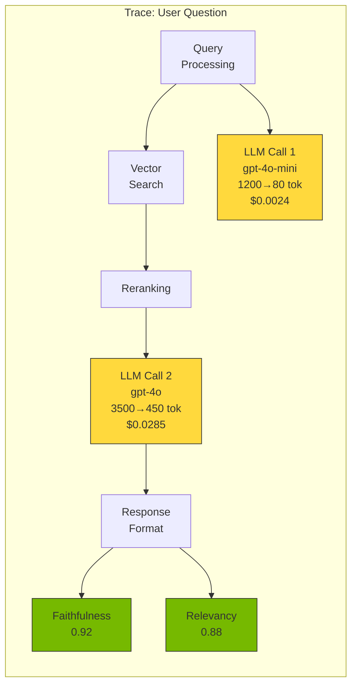
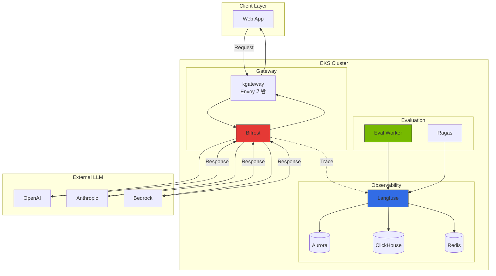
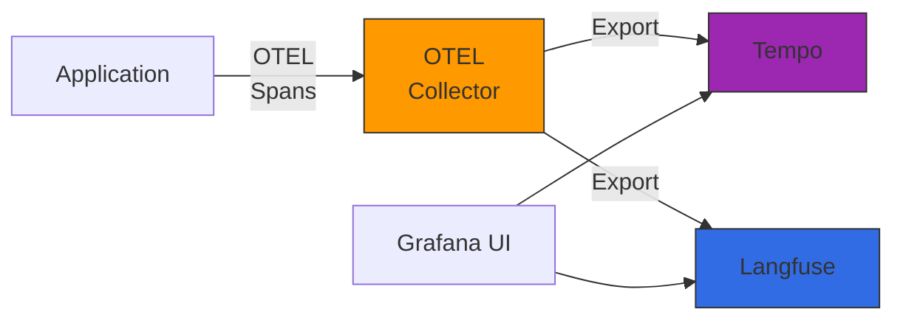

## 1. 개요

### 1.1 전통적 APM이 LLM 워크로드에서 부족한 이유

전통적인 Application Performance Monitoring (APM) 도구들은 LLM 기반 애플리케이션의 특수한 요구사항을 충족하지 못합니다:

- **토큰 비용 추적 불가**: 기존 APM은 CPU/메모리 사용량만 측정하며, LLM API 호출의 실제 비용인 입력/출력 토큰 수와 프로바이더별 가격을 추적하지 못합니다
- **프롬프트 품질 평가 부재**: HTTP 요청/응답 본문은 기록하지만, 프롬프트 템플릿 버전 관리, A/B 테스트, 품질 평가 메트릭이 없습니다
- **체인 추적의 한계**: LangChain/LlamaIndex 같은 프레임워크의 복잡한 체인(Chain)과 에이전트 워크플로우는 단순 HTTP trace로는 가시성 확보가 어렵습니다
- **의미론적 컨텍스트 부족**: 단순 latency/throughput만 측정할 뿐, "답변이 정확한가?", "환각(hallucination)이 발생했는가?"와 같은 의미론적 품질을 평가하지 못합니다

### 1.2 LLMOps Observability의 4가지 핵심 영역

1. **Tracing**: 전체 요청 라이프사이클 추적 (프롬프트 -> LLM -> 응답), 중첩된 체인/에이전트 단계별 가시성
2. **Evaluation**: 자동/수동 평가를 통한 응답 품질 측정 (정확도, 충실도, 관련성, 독성 등)
3. **Prompt Management**: 프롬프트 템플릿 버전 관리, A/B 테스트, 프로덕션 배포 파이프라인
4. **Cost Tracking**: 프로바이더별/모델별 토큰 비용 실시간 집계, 팀/프로젝트별 예산 관리

:::info 실전 배포 가이드
Langfuse Helm 배포, Redis/ClickHouse 구성, kgateway sub-path 라우팅, Bifrost OTel 연동 등 실전 구성은 [모니터링 스택 구성 가이드](../reference-architecture/integrations/monitoring-observability-setup.md)를 참조하세요.
:::

---

## 2. 핵심 개념

### 2.1 Trace 구조

### 2.2 주요 개념 정의

| 개념 | 설명 |
|------|------|
| **Trace** | 요청의 전체 라이프사이클을 나타내는 최상위 단위. 사용자 질문 -> 여러 LLM 호출 -> 최종 응답 |
| **Span** | Trace를 구성하는 개별 단계 (LLM 호출, 도구 호출, Vector 검색, 후처리) |
| **Generation** | LLM API 호출 세부 정보: 입출력 토큰, 모델명, 파라미터, 지연 시간, 비용 |
| **Score** | 응답 품질 평가 메트릭: 자동(LLM-as-Judge), 수동(사람 피드백) |
| **Session** | 대화형 애플리케이션에서 여러 Trace를 묶는 컨텍스트 |

---

## 3. 솔루션 비교

### 3.1 Langfuse

**오픈소스 LLMOps Observability 플랫폼** (MIT 라이선스, 완전한 셀프호스트 지원)

**핵심 기능**:
- **Tracing**: LangChain, LlamaIndex, OpenAI SDK 네이티브 통합, 중첩된 체인/에이전트 완전 가시성
- **Prompt Management**: 프롬프트 템플릿 버전 관리, A/B 테스트, 프로덕션/스테이징 환경 분리
- **Evaluation**: LLM-as-Judge, 규칙 기반 자동 평가, Annotation Queue 수동 평가, Dataset 관리
- **아키텍처**: PostgreSQL(메타데이터) + ClickHouse(분석) + Redis(캐시)

**장점**: 완전한 데이터 소유권, 무제한 확장, 강력한 평가 파이프라인, 비용 효율(셀프호스트)

**단점**: 운영 오버헤드(PG+CH+Redis 관리), 초기 설정 복잡도

### 3.2 LangSmith

**LangChain AI 제공 클라우드 기반 Observability 플랫폼**

**핵심 기능**:
- LangChain/LangGraph 제로 코드 통합
- Hub (프롬프트 마켓플레이스): 커뮤니티 공유, 버전 관리, Fork/Share
- Evaluator 라이브러리: 사전 정의된 평가자, 비교 모드
- Annotation Queue: 팀 협업, RLHF 데이터 소스

**장점**: LangChain 딥 인테그레이션, 관리형 서비스, 5분 내 통합

**단점**: LangChain 종속성, 클라우드 전용(엔터프라이즈만 셀프호스트), 트레이스당 과금

### 3.3 Helicone

**Rust 기반 고성능 LLM Gateway + Observability 통합 솔루션**

**핵심 기능**:
- Zero-Code 통합: OpenAI endpoint URL 변경만으로 자동 추적
- Gateway 기능 내장: Rate limiting, Caching, Retries, Load balancing
- 실시간 비용 대시보드

**장점**: 초고속 통합(URL 변경만), 고성능(Rust, 10ms 미만 지연), Gateway 기능 내장

**단점**: 프롬프트 관리/평가 파이프라인 부재, 중첩 Span 추적 제한적

### 3.4 솔루션 비교 테이블

| 기능 | Langfuse | LangSmith | Helicone |
|------|----------|-----------|----------|
| **라이선스** | MIT (오픈소스) | Proprietary | Proprietary (셀프호스트 가능) |
| **셀프호스트** | 완전 지원 | 엔터프라이즈만 | 지원 |
| **Tracing** | ★★★★★ | ★★★★★ | ★★★ |
| **Prompt Management** | ★★★★★ (버전, A/B) | ★★★★ (Hub) | ★★ (단순 저장) |
| **Evaluation** | ★★★★★ (Pipeline) | ★★★★★ | ★ (없음) |
| **Cost Tracking** | ★★★★★ | ★★★★ | ★★★★ |
| **LangChain 통합** | ★★★★ | ★★★★★ | ★★★ |
| **프레임워크 중립성** | ★★★★★ | ★★★ | ★★★★★ |
| **Gateway 기능** | 없음 | 없음 | ★★★★★ |
| **스케일 한계** | 무제한 (셀프호스트) | 플랜 제한 | 플랜 제한 |
| **데이터 주권** | ★★★★★ | ★★ | ★★★★ |

---

## 4. 하이브리드 아키텍처 추천

### 4.1 왜 단일 솔루션이 부족한가

엔터프라이즈 환경에서는 복합적 요구사항이 존재합니다:

1. **Gateway 분리 필요**: Rate limiting, Caching, Failover는 Observability와 독립적으로 관리
2. **멀티 프레임워크 지원**: LangChain, LlamaIndex, 커스텀 코드가 혼재
3. **데이터 주권과 비용**: 민감 데이터 클라우드 전송 불가, 대규모 트래픽 시 과금 급증
4. **고급 평가 파이프라인**: Ragas 같은 전문 프레임워크 통합, CI/CD 회귀 테스트 자동화

### 4.2 추천 조합: kgateway + Bifrost (Gateway) + Langfuse (Observability)

**이점**:
- **Gateway 책임 분리**: kgateway (Envoy 기반)가 트래픽 관리, 인증, Rate limiting 담당, Bifrost가 프로바이더 라우팅과 Caching 담당
- **Observability 전문화**: Langfuse가 Tracing, 평가, 프롬프트 관리 담당
- **완전한 셀프호스트**: 모든 구성 요소를 EKS에서 실행
- **확장성**: 각 계층을 독립적으로 스케일링

### 4.3 Helicone 단독 vs Bifrost+Langfuse 비교

| 측면 | Helicone 단독 | Bifrost + Langfuse |
|------|---------------|---------------------|
| **통합 복잡도** | 매우 낮음 (URL 변경만) | 중간 (SDK 통합 필요) |
| **프롬프트 관리** | 제한적 (저장만) | 강력 (버전, A/B 테스트) |
| **평가 파이프라인** | 없음 | 완전 지원 (Ragas 통합) |
| **체인 추적** | 제한적 | 완벽 (중첩 Span) |
| **확장성** | Gateway/Observability 결합 | 독립 스케일링 |
| **적합 시나리오** | MVP, 단순 API 호출 | 엔터프라이즈, 복잡한 체인 |

---

## 5. OpenTelemetry 통합 아키텍처

### 5.1 왜 OpenTelemetry를 통합하는가

Langfuse는 LLM 특화 Observability를 제공하지만, 전체 애플리케이션 컨텍스트는 기존 APM에서 관리합니다. OpenTelemetry를 사용하면:

- **통합 대시보드**: LLM Trace + 기존 APM Trace를 한 화면에서 조회
- **상관 관계 분석**: HTTP 요청 -> DB 쿼리 -> LLM 호출의 전체 흐름 추적
- **단일 계측 SDK**: OpenTelemetry만 사용하여 Langfuse와 기존 APM 동시 전송

### 5.2 OTel Semantic Conventions 매핑

| OTEL 속성 | Langfuse 필드 | 설명 |
|-----------|---------------|------|
| `llm.model` | `model` | 모델명 (gpt-4o, claude-3-opus 등) |
| `llm.input_tokens` | `usage.input` | 입력 토큰 수 |
| `llm.output_tokens` | `usage.output` | 출력 토큰 수 |
| `llm.temperature` | `modelParameters.temperature` | Temperature 파라미터 |
| `llm.request.prompt` | `input` | 프롬프트 |
| `llm.response.completion` | `output` | 응답 텍스트 |
| `llm.total_cost` | `calculatedTotalCost` | 계산된 비용 |

### 5.3 Grafana Tempo + Langfuse 조합

---

## 6. 평가 파이프라인 개념

### 6.1 평가 방식

Langfuse Evaluation은 세 가지 방식을 지원합니다:

1. **LLM-as-Judge**: 별도 LLM을 사용하여 응답 품질 평가 (Faithfulness, Relevancy 등)
2. **규칙 기반**: Python 함수로 커스텀 평가 로직 (정규식 매칭, 키워드 체크)
3. **수동 평가**: Annotation Queue에서 사람이 직접 평가 (RLHF 데이터 수집)

### 6.2 평가 메트릭

| 메트릭 | 범위 | 설명 | 평가 방법 |
|--------|------|------|-----------|
| **Faithfulness** | 0-1 | 응답이 제공된 컨텍스트에 충실한가? | LLM-as-Judge |
| **Answer Relevancy** | 0-1 | 응답이 질문과 관련이 있는가? | Ragas (임베딩 유사도) |
| **Context Precision** | 0-1 | 검색된 컨텍스트가 질문과 관련이 있는가? | Ragas |
| **Context Recall** | 0-1 | Ground Truth가 검색된 컨텍스트에 포함되어 있는가? | Ragas |
| **Toxicity** | 0-1 | 응답에 유해한 내용이 포함되어 있는가? | Detoxify 라이브러리 |
| **Latency** | ms | 응답 생성 지연 시간 | 자동 수집 |
| **Cost** | USD | 요청당 비용 | 자동 계산 |

### 6.3 Ragas 연동

Ragas는 RAG 시스템 전용 평가 프레임워크로, Langfuse와 통합하여 더 정교한 평가를 제공합니다. 자세한 내용은 [RAG Evaluation with Ragas](./ragas-evaluation.md) 문서를 참조하세요.

---

## 7. 시나리오별 추천

| 시나리오 | 추천 솔루션 | 이유 |
|----------|-------------|------|
| **LangChain/LangGraph 중심 개발** | LangSmith | LangChain 네이티브 통합, 코드 한 줄로 전체 체인 추적 |
| **데이터 주권 필수 (금융/의료)** | Langfuse (셀프호스트) | 모든 데이터를 자체 인프라에 저장, GDPR/HIPAA 컴플라이언스 |
| **빠른 시작 (MVP/PoC)** | Helicone | URL 변경만으로 즉시 추적, Gateway 기능 내장 |
| **프롬프트 엔지니어링 팀 운영** | Langfuse | 프롬프트 버전 관리, A/B 테스트, Dataset + 자동 평가 |
| **엔터프라이즈 하이브리드** | Bifrost + Langfuse | Gateway/Observability 책임 분리, 독립적 스케일링 |
| **풀스택 GenAI 플랫폼** | kgateway + Bifrost + Langfuse + Ragas | API 관리 + LLM 라우팅 + 추적 + 품질 평가 |
| **대규모 트래픽 (월 1000만+ 트레이스)** | Langfuse + ClickHouse 클러스터 | 수평 확장 가능, 비용 효율 |

---

## 8. 요약

1. **LLMOps Observability는 필수**: 전통적 APM은 LLM 워크로드의 토큰 비용, 프롬프트 품질, 체인 추적을 지원하지 못합니다.
2. **3대 솔루션**: Langfuse(오픈소스, 셀프호스트, 평가 파이프라인), LangSmith(LangChain 최적화, 관리형), Helicone(Proxy 기반, Gateway+Observability 통합)
3. **하이브리드 아키텍처 추천**: Bifrost(Gateway) + Langfuse(Observability) 조합이 엔터프라이즈 환경에 최적
4. **OpenTelemetry 통합**: 기존 APM과 LLMOps Observability를 통합 대시보드로 연결
5. **평가 파이프라인**: LLM-as-Judge, Ragas, Annotation Queue를 활용한 자동/수동 품질 평가

---

## 참고 자료

### 공식 문서
- [Langfuse Documentation](https://langfuse.com/docs)
- [LangSmith Documentation](https://docs.smith.langchain.com)
- [Helicone Documentation](https://docs.helicone.ai)
- [OpenTelemetry LLM Semantic Conventions](https://opentelemetry.io/docs/specs/semconv/gen-ai/)
- [Ragas Documentation](https://docs.ragas.io)

### 관련 문서
- [모니터링 스택 구성 가이드](../reference-architecture/integrations/monitoring-observability-setup.md)
- [Inference Gateway 라우팅](../reference-architecture/inference-gateway/routing-strategy.md)
- [RAG Evaluation with Ragas](./ragas-evaluation.md)
- [Agent 모니터링](./agent-monitoring.md)
