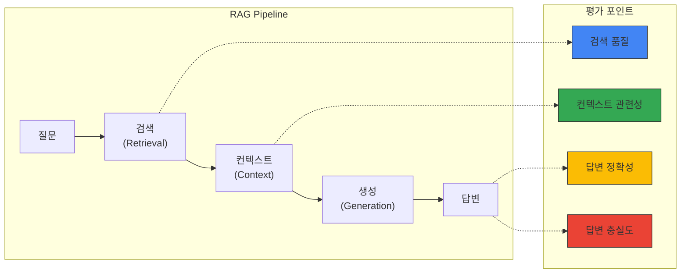
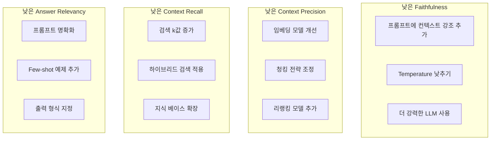

# Ragas RAG 평가 프레임워크

> 📅 **작성일**: 2025-02-05 | ⏱️ **읽는 시간**: 약 28분

Ragas(RAG Assessment)는 RAG(Retrieval-Augmented Generation) 파이프라인의 품질을 객관적으로 평가하기 위한 오픈소스 프레임워크입니다. Agentic AI 플랫폼에서 RAG 시스템의 성능을 측정하고 지속적으로 개선하는 데 필수적입니다.

## 개요

### RAG 평가가 필요한 이유

RAG 시스템은 여러 컴포넌트(검색, 생성, 컨텍스트 처리)로 구성되어 있어 전체 품질을 측정하기 어렵습니다:



### Ragas 핵심 메트릭

| 메트릭 | 측정 대상 | 설명 |
| --- | --- | --- |
| Faithfulness | 생성 품질 | 답변이 컨텍스트에 충실한지 |
| Answer Relevancy | 생성 품질 | 답변이 질문과 관련있는지 |
| Context Precision | 검색 품질 | 검색된 컨텍스트의 정밀도 |
| Context Recall | 검색 품질 | 필요한 정보가 검색되었는지 |
| Context Relevancy | 검색 품질 | 컨텍스트가 질문과 관련있는지 |
| Answer Correctness | 종합 품질 | 답변의 정확성 |

## 설치 및 기본 설정

### Python 환경 설정

```bash
# Ragas 설치
pip install ragas langchain-openai datasets

# 추가 의존성
pip install pandas numpy
```

### 기본 평가 코드

```python
from ragas import evaluate
from ragas.metrics import (
    faithfulness,
    answer_relevancy,
    context_precision,
    context_recall,
)
from datasets import Dataset

# 평가 데이터셋 준비
eval_data = {
    "question": [
        "Kubernetes에서 GPU 스케줄링은 어떻게 하나요?",
        "Karpenter의 주요 기능은 무엇인가요?",
    ],
    "answer": [
        "Kubernetes에서 GPU 스케줄링은 NVIDIA Device Plugin을 통해 수행됩니다...",
        "Karpenter는 자동 노드 프로비저닝, 통합(consolidation), 드리프트 감지 기능을 제공합니다...",
    ],
    "contexts": [
        ["GPU 스케줄링은 Device Plugin을 통해...", "NVIDIA GPU Operator는..."],
        ["Karpenter는 Kubernetes 노드 자동 스케일러로...", "NodePool CRD를 통해..."],
    ],
    "ground_truth": [
        "NVIDIA Device Plugin과 GPU Operator를 사용하여 GPU 리소스를 스케줄링합니다.",
        "Karpenter는 자동 노드 프로비저닝, 통합, 드리프트 감지, 중단 처리 기능을 제공합니다.",
    ],
}

dataset = Dataset.from_dict(eval_data)

# 평가 실행
results = evaluate(
    dataset,
    metrics=[
        faithfulness,
        answer_relevancy,
        context_precision,
        context_recall,
    ],
)

print(results)
```

## 핵심 메트릭 상세 설명

### 1. Faithfulness (충실도)

답변이 제공된 컨텍스트에 얼마나 충실한지 측정합니다. 환각(hallucination)을 감지하는 데 핵심적인 메트릭입니다.

```python
from ragas.metrics import faithfulness

# Faithfulness 계산 과정:
# 1. 답변을 개별 주장(claims)으로 분해
# 2. 각 주장이 컨텍스트에서 추론 가능한지 검증
# 3. 검증된 주장 수 / 전체 주장 수 = Faithfulness 점수

# 점수 해석:
# 1.0: 모든 주장이 컨텍스트에서 지원됨
# 0.5: 절반의 주장만 컨텍스트에서 지원됨
# 0.0: 어떤 주장도 컨텍스트에서 지원되지 않음 (심각한 환각)
```

### 2. Answer Relevancy (답변 관련성)

답변이 질문에 얼마나 관련있는지 측정합니다.

```python
from ragas.metrics import answer_relevancy

# Answer Relevancy 계산 과정:
# 1. 답변에서 역으로 질문을 생성
# 2. 생성된 질문과 원본 질문의 유사도 계산
# 3. 여러 번 반복하여 평균 계산

# 점수 해석:
# 높은 점수: 답변이 질문에 직접적으로 관련됨
# 낮은 점수: 답변이 질문과 동떨어진 내용을 포함
```

### 3. Context Precision (컨텍스트 정밀도)

검색된 컨텍스트 중 실제로 유용한 정보의 비율을 측정합니다.

```python
from ragas.metrics import context_precision

# Context Precision 계산:
# - Ground truth 답변을 생성하는 데 필요한 컨텍스트 식별
# - 상위 랭킹 컨텍스트에 유용한 정보가 있는지 확인
# - 높은 순위에 관련 컨텍스트가 있을수록 높은 점수
```

### 4. Context Recall (컨텍스트 재현율)

정답을 생성하는 데 필요한 정보가 검색된 컨텍스트에 포함되어 있는지 측정합니다.

```python
from ragas.metrics import context_recall

# Context Recall 계산:
# 1. Ground truth를 개별 문장으로 분해
# 2. 각 문장이 검색된 컨텍스트에서 추론 가능한지 확인
# 3. 추론 가능한 문장 수 / 전체 문장 수 = Recall 점수
```

## 종합 평가 파이프라인

### 전체 RAG 시스템 평가

```python
import os
from ragas import evaluate
from ragas.metrics import (
    faithfulness,
    answer_relevancy,
    context_precision,
    context_recall,
    context_relevancy,
    answer_correctness,
)
from datasets import Dataset
from langchain_openai import ChatOpenAI, OpenAIEmbeddings

# LLM 설정 (평가용)
os.environ["OPENAI_API_KEY"] = "your-api-key"

def evaluate_rag_pipeline(questions, rag_chain, ground_truths):
    """RAG 파이프라인 종합 평가"""
    
    answers = []
    contexts = []
    
    for question in questions:
        # RAG 체인 실행
        result = rag_chain.invoke({"query": question})
        answers.append(result["result"])
        contexts.append([doc.page_content for doc in result["source_documents"]])
    
    # 평가 데이터셋 구성
    eval_dataset = Dataset.from_dict({
        "question": questions,
        "answer": answers,
        "contexts": contexts,
        "ground_truth": ground_truths,
    })
    
    # 전체 메트릭으로 평가
    results = evaluate(
        eval_dataset,
        metrics=[
            faithfulness,
            answer_relevancy,
            context_precision,
            context_recall,
            context_relevancy,
            answer_correctness,
        ],
    )
    
    return results

# 사용 예시
questions = [
    "EKS에서 Karpenter를 설정하는 방법은?",
    "GPU 노드 자동 스케일링 구성 방법은?",
    "Inference Gateway의 동적 라우팅 설정은?",
]

ground_truths = [
    "Karpenter는 Helm 차트로 설치하고 NodePool CRD를 정의하여 설정합니다.",
    "DCGM Exporter 메트릭과 KEDA를 연동하여 GPU 사용률 기반 스케일링을 구성합니다.",
    "Gateway API의 HTTPRoute를 사용하여 가중치 기반 트래픽 분배를 설정합니다.",
]

# 평가 실행
results = evaluate_rag_pipeline(questions, rag_chain, ground_truths)
print(results.to_pandas())
```

### 평가 결과 분석

```python
import pandas as pd
import matplotlib.pyplot as plt

def analyze_evaluation_results(results):
    """평가 결과 분석 및 시각화"""
    
    df = results.to_pandas()
    
    # 메트릭별 평균 점수
    metrics_summary = df.mean(numeric_only=True)
    print("=== 메트릭별 평균 점수 ===")
    print(metrics_summary)
    
    # 문제 영역 식별
    print("\n=== 개선 필요 영역 ===")
    for metric, score in metrics_summary.items():
        if score < 0.7:
            print(f"⚠️ {metric}: {score:.2f} - 개선 필요")
        elif score < 0.85:
            print(f"📊 {metric}: {score:.2f} - 양호")
        else:
            print(f"✅ {metric}: {score:.2f} - 우수")
    
    # 시각화
    fig, ax = plt.subplots(figsize=(10, 6))
    metrics_summary.plot(kind='bar', ax=ax, color=['#4285f4', '#34a853', '#fbbc04', '#ea4335', '#9c27b0', '#00bcd4'])
    ax.set_ylabel('Score')
    ax.set_title('RAG Pipeline Evaluation Results')
    ax.set_ylim(0, 1)
    ax.axhline(y=0.7, color='r', linestyle='--', label='Minimum Threshold')
    ax.legend()
    plt.tight_layout()
    plt.savefig('rag_evaluation_results.png')
    
    return metrics_summary

# 분석 실행
summary = analyze_evaluation_results(results)
```

## CI/CD 파이프라인 통합

### GitHub Actions 워크플로우

```yaml
# .github/workflows/rag-evaluation.yml
name: RAG Pipeline Evaluation

on:
  push:
    paths:
      - 'src/rag/**'
      - 'data/knowledge_base/**'
  pull_request:
    paths:
      - 'src/rag/**'
  schedule:
    - cron: '0 0 * * *'  # 매일 자정

jobs:
  evaluate:
    runs-on: ubuntu-latest
    
    steps:
    - uses: actions/checkout@v4
    
    - name: Set up Python
      uses: actions/setup-python@v5
      with:
        python-version: '3.11'
    
    - name: Install dependencies
      run: |
        pip install ragas langchain-openai datasets pandas
    
    - name: Run RAG Evaluation
      env:
        OPENAI_API_KEY: ${{ secrets.OPENAI_API_KEY }}
      run: |
        python scripts/evaluate_rag.py --output results/evaluation.json
    
    - name: Check Quality Gates
      run: |
        python scripts/check_quality_gates.py results/evaluation.json
    
    - name: Upload Results
      uses: actions/upload-artifact@v4
      with:
        name: evaluation-results
        path: results/
    
    - name: Comment PR with Results
      if: github.event_name == 'pull_request'
      uses: actions/github-script@v7
      with:
        script: |
          const fs = require('fs');
          const results = JSON.parse(fs.readFileSync('results/evaluation.json'));
          
          let comment = '## RAG Evaluation Results\n\n';
          comment += '| Metric | Score | Status |\n';
          comment += '|--------|-------|--------|\n';
          
          for (const [metric, score] of Object.entries(results.metrics)) {
            const status = score >= 0.7 ? '✅' : '⚠️';
            comment += `| ${metric} | ${score.toFixed(2)} | ${status} |\n`;
          }
          
          github.rest.issues.createComment({
            issue_number: context.issue.number,
            owner: context.repo.owner,
            repo: context.repo.repo,
            body: comment
          });
```

### 품질 게이트 스크립트

```python
# scripts/check_quality_gates.py
import json
import sys

QUALITY_GATES = {
    "faithfulness": 0.8,
    "answer_relevancy": 0.75,
    "context_precision": 0.7,
    "context_recall": 0.7,
}

def check_quality_gates(results_file):
    with open(results_file) as f:
        results = json.load(f)
    
    failed_gates = []
    
    for metric, threshold in QUALITY_GATES.items():
        score = results["metrics"].get(metric, 0)
        if score < threshold:
            failed_gates.append({
                "metric": metric,
                "score": score,
                "threshold": threshold,
            })
    
    if failed_gates:
        print("❌ Quality gates failed:")
        for gate in failed_gates:
            print(f"  - {gate['metric']}: {gate['score']:.2f} < {gate['threshold']}")
        sys.exit(1)
    else:
        print("✅ All quality gates passed!")
        sys.exit(0)

if __name__ == "__main__":
    check_quality_gates(sys.argv[1])
```

## Kubernetes Job으로 정기 평가

### 평가 Job 정의

```yaml
apiVersion: batch/v1
kind: CronJob
metadata:
  name: rag-evaluation
  namespace: genai-platform
spec:
  schedule: "0 6 * * *"  # 매일 오전 6시
  jobTemplate:
    spec:
      template:
        spec:
          containers:
          - name: evaluator
            image: your-registry/rag-evaluator:latest
            env:
            - name: OPENAI_API_KEY
              valueFrom:
                secretKeyRef:
                  name: openai-credentials
                  key: api-key
            - name: MILVUS_HOST
              value: "milvus-proxy.milvus.svc.cluster.local"
            - name: RESULTS_BUCKET
              value: "s3://rag-evaluation-results"
            command:
            - python
            - /app/evaluate.py
            - --config=/app/config/evaluation.yaml
            - --output=s3
            resources:
              requests:
                cpu: "1"
                memory: "2Gi"
              limits:
                cpu: "2"
                memory: "4Gi"
          restartPolicy: OnFailure
          serviceAccountName: rag-evaluator
```

### 평가 설정 ConfigMap

```yaml
apiVersion: v1
kind: ConfigMap
metadata:
  name: rag-evaluation-config
  namespace: genai-platform
data:
  evaluation.yaml: |
    evaluation:
      metrics:
        - faithfulness
        - answer_relevancy
        - context_precision
        - context_recall
      
      test_sets:
        - name: "general_knowledge"
          path: "s3://test-data/general.json"
          weight: 0.4
        - name: "technical_docs"
          path: "s3://test-data/technical.json"
          weight: 0.6
      
      quality_gates:
        faithfulness: 0.8
        answer_relevancy: 0.75
        context_precision: 0.7
        context_recall: 0.7
      
      alerts:
        slack_webhook: "https://hooks.slack.com/..."
        threshold_drop: 0.1  # 10% 이상 하락 시 알림
```

## 평가 결과 해석 및 개선 가이드

### 메트릭별 개선 방향



### 개선 체크리스트

| 문제 | 가능한 원인 | 해결 방안 |
| --- | --- | --- |
| Faithfulness < 0.7 | LLM이 컨텍스트 무시 | 프롬프트에 "컨텍스트만 사용" 강조 |
| Context Precision < 0.6 | 검색 품질 낮음 | 임베딩 모델 업그레이드, 리랭킹 추가 |
| Context Recall < 0.6 | 관련 문서 누락 | k값 증가, 지식 베이스 보강 |
| Answer Relevancy < 0.7 | 답변이 산만함 | 프롬프트 구조화, 출력 형식 지정 |

## 관련 문서

- [Milvus 벡터 데이터베이스](./milvus-vector-database.md)
- [Agent 모니터링](./agent-monitoring.md)
- [Agentic AI 플랫폼 아키텍처](./agentic-platform-architecture.md)

:::tip 권장 사항
- 평가 데이터셋은 최소 50개 이상의 다양한 질문을 포함하세요
- Ground truth는 도메인 전문가가 검증한 정답을 사용하세요
- 정기적인 평가를 통해 시간에 따른 품질 변화를 추적하세요
:::

:::warning 주의사항
- Ragas 평가는 LLM API 호출이 필요하므로 비용이 발생합니다
- 대규모 평가 시 배치 처리와 캐싱을 활용하세요
- 평가 결과는 사용된 LLM에 따라 달라질 수 있습니다
:::
