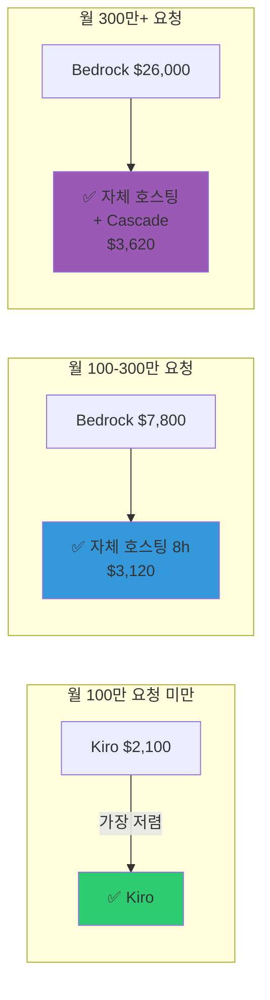
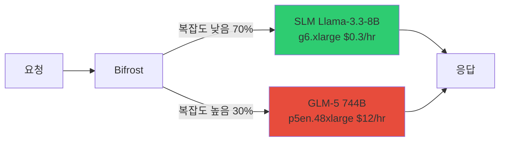
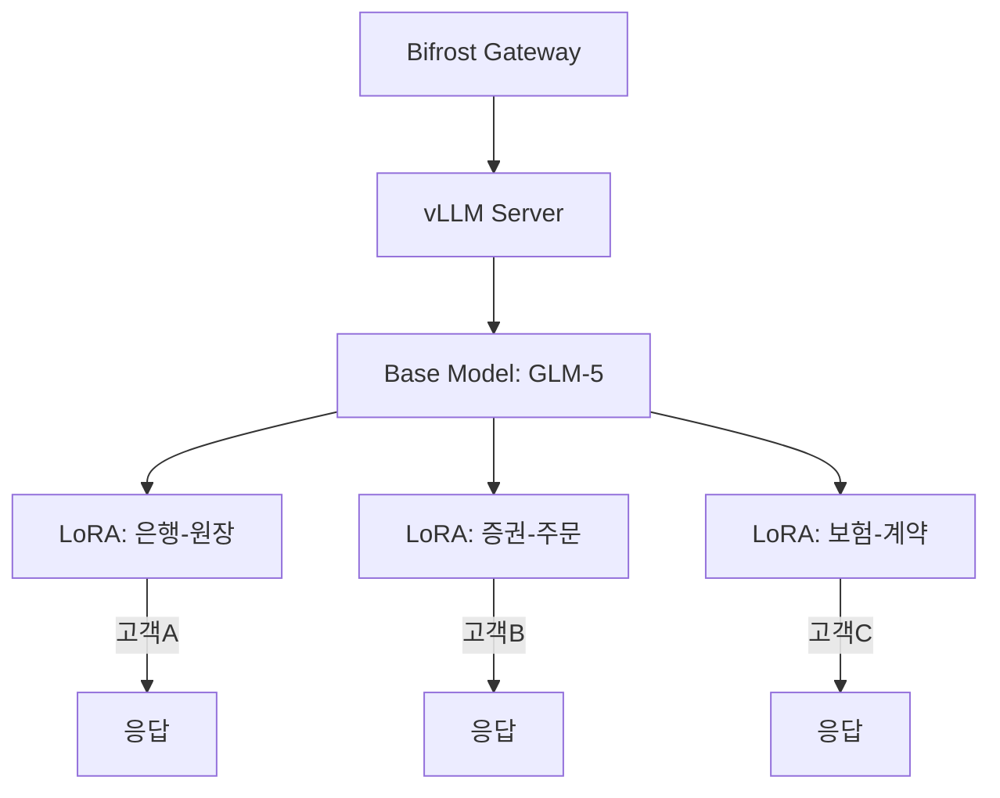

# 코딩 도구 연동 & 비용 분석

## 1. 개요

AI 코딩 도구를 엔터프라이즈 환경에서 활용하려면 **IDE 연동**, **비용 최적화**, **데이터 주권** 세 가지를 고려해야 합니다. 이 문서는 Aider, Cline, Continue.dev 등 주요 코딩 도구를 자체 호스팅 LLM과 연결하는 방법과, Bedrock vs Kiro vs 자체 호스팅의 비용 분석을 제공합니다.

### 왜 자체 호스팅 연동이 필요한가?

| 제약 | SaaS (Kiro, Copilot) | 자체 호스팅 |
|------|---------------------|-----------|
| **데이터 주권** | 코드가 외부 전송 | ✅ VPC 내 완전 격리 |
| **커스터마이징** | 제공 모델만 사용 | ✅ LoRA Fine-tuning |
| **비용 제어** | 토큰 단가 고정 | ✅ Cascade 66% 절감 |
| **Observability** | 제한적 | ✅ Langfuse 완전 제어 |

:::tip 핵심 전략
Bifrost Gateway를 경유하여 vLLM과 연결하면, Langfuse로 모든 요청을 추적하고, Cascade Routing으로 비용을 절감하며, Guardrails로 PII를 필터링할 수 있습니다.
:::

---

## 2. IDE/코딩 도구 연결

### 2.1 지원 도구 비교

| 도구 | model 필드 전달 | Bifrost 호환 | 설정 방법 |
|------|----------------|-------------|----------|
| **Cline** | 그대로 전달 | ✅ | Model ID: `openai/glm-5` |
| **Continue.dev** | 그대로 전달 | ✅ | model: `openai/glm-5` |
| **Aider** | LiteLLM prefix 제거 | ⚠️ double-prefix 필요 | `openai/openai/glm-5` |
| **Cursor** | 자체 검증 거부 | ❌ | 미지원 (슬래시 불가) |

:::warning Cursor 호환성 제한
Cursor는 모델명에 `/`를 허용하지 않아 Bifrost `provider/model` 포맷과 호환되지 않습니다. Aider 또는 Continue.dev를 권장합니다.
:::

### 2.2 Aider 연결 예시

[Aider](https://aider.chat)는 Git-aware 코드 수정 + 자동 커밋을 지원하는 오픈소스 CLI 도구입니다.

```bash
# Aider 설치
pip install aider-chat

# GLM-5 연결 (Bifrost 경유 → Langfuse 모니터링)
aider --model openai/openai/glm-5 \
  --openai-api-base http://[NLB_ENDPOINT]/v1 \
  --openai-api-key dummy
```

:::info Double-Prefix 트릭
Aider는 내부적으로 LiteLLM prefix를 제거합니다 (`openai/glm-5` → `glm-5`). Bifrost가 `provider/model` 포맷을 요구하므로, **double-prefix** (`openai/openai/glm-5`)를 사용하면 Aider의 prefix 제거 후 Bifrost가 정확히 `openai/glm-5`를 받습니다.
:::

#### Aider 권장 이유

1. **Git 통합**: 변경사항을 자동으로 커밋하고, diff 기반으로 수정 범위를 최소화
2. **CLI 기반**: CI/CD 파이프라인에서도 활용 가능
3. **OpenAI-Compatible**: 모든 OpenAI 호환 엔드포인트 지원
4. **Langfuse 연동**: Bifrost 경유 시 자동으로 모든 요청이 Langfuse에 기록됨

### 2.3 Continue.dev 설정 예시

Continue.dev는 VSCode/JetBrains용 AI 코딩 어시스턴트입니다.

```json
{
  "models": [
    {
      "title": "GLM-5 (Bifrost)",
      "provider": "openai",
      "model": "openai/glm-5",
      "apiBase": "http://[NLB_ENDPOINT]/v1",
      "apiKey": "dummy"
    }
  ]
}
```

Continue.dev는 `provider/model` 포맷을 그대로 전달하므로 double-prefix 불필요합니다.

### 2.4 Cline 설정 예시

Cline은 VSCode용 AI 코딩 도구입니다.

Settings → API Provider → OpenAI Compatible
- Base URL: `http://[NLB_ENDPOINT]/v1`
- Model: `openai/glm-5`
- API Key: `dummy`

Cline도 `provider/model` 포맷을 그대로 전달하므로 Bifrost와 바로 호환됩니다.

---

## 3. Bifrost Provider/Model 포맷

### 3.1 Bifrost 모델 이름 규칙

Bifrost는 `provider/model` 형식의 모델 이름을 사용합니다:

```
✅ 올바른 형식:
- openai/gpt-4o
- anthropic/claude-sonnet-4
- openai/glm-5

❌ 잘못된 형식:
- gpt-4o (프로바이더 누락)
- openai-gpt-4o (슬래시 대신 하이픈)
```

### 3.2 Bifrost Config 예시

```json
{
  "providers": {
    "openai": {
      "keys": [
        {
          "name": "glm5",
          "value": "dummy",
          "weight": 1.0,
          "models": ["glm-5", "glm5"]
        }
      ],
      "network_config": {
        "base_url": "http://vllm-service.ai-inference.svc:8000"
      }
    }
  }
}
```

:::caution Bifrost 모델명 정규화
Bifrost는 내부적으로 모델명의 하이픈을 제거합니다 (`glm-5` → `glm5`). vLLM의 `--served-model-name`을 Bifrost 정규화 결과와 일치시켜야 합니다:
- vLLM: `--served-model-name=glm5` (하이픈 없음)
- Bifrost config: `"models": ["glm-5", "glm5"]` (둘 다 포함)
:::

### 3.3 클라이언트 요청 예시

```python
from openai import OpenAI

client = OpenAI(
    base_url="http://[NLB_ENDPOINT]/v1",
    api_key="dummy"
)

response = client.chat.completions.create(
    model="openai/glm-5",  # 프로바이더 포함 필수
    messages=[{"role": "user", "content": "Write a Python function to check if a number is prime"}]
)
```

---

## 4. Kiro vs 자체 호스팅 비교

2026년 4월, [Kiro IDE에서 GLM-5를 네이티브 지원](https://kiro.dev/changelog/models/glm-5-now-available-in-kiro)하기 시작했습니다. Kiro가 오픈 웨이트 모델을 자체 인프라(us-east-1)에서 호스팅하여 0.5x credit으로 제공합니다.

### 기능 비교

| | **Kiro 호스팅** | **자체 호스팅 (EKS + vLLM)** |
|---|---|---|
| **인프라** | Kiro/AWS 관리 | 직접 운영 (EKS + GPU 노드) |
| **비용** | 사용량 과금 (0.5x credit) | GPU Spot ~$12/hr |
| **LoRA Fine-tuning** | ❌ 불가 | ✅ 도메인 특화 커스터마이징 |
| **데이터 주권** | Kiro 인프라 경유 | ✅ VPC 내 완전 격리 |
| **컴플라이언스** | Kiro 정책 의존 | ✅ SOC2/ISO27001 자체 통제 |
| **Observability** | Kiro 대시보드 | ✅ Langfuse + AMP/AMG 완전 제어 |
| **게이트웨이** | 없음 | ✅ Bifrost (guardrails, caching) |
| **Steering/Spec** | ✅ 네이티브 | 별도 구현 필요 |
| **커스텀 엔드포인트** | ❌ Kiro 모델 목록만 | ✅ 자유 설정 |
| **시작 난이도** | 즉시 | 높음 |

:::tip 자체 호스팅이 필요한 경우
- **FSI/규제 산업**: 데이터가 외부 서비스를 경유할 수 없는 환경 (VPC 격리 필수)
- **LoRA Fine-tuning**: COBOL→Java 전환, 사내 프레임워크 코드 생성 등 도메인 특화
- **멀티 고객 운영**: 고객별 LoRA 어댑터 핫스왑 + Bifrost 라우팅
- **완전한 Observability**: 모든 trace/metric을 자체 Langfuse + AMP로 수집
:::

:::info Kiro가 적합한 경우
- 인프라 구성 없이 GLM-5를 빠르게 프로토타이핑
- Kiro Steering/Spec 네이티브 워크플로우 활용
- GPU 인프라 운영 부담을 줄이려는 소규모 팀
:::

---

## 5. 비용 Threshold 분석: Bedrock vs Kiro vs 자체 호스팅

GLM-5를 사용하는 3가지 방법의 토큰당 비용을 비교합니다.

### 5.1 토큰당 비용 (2026.04 기준)

| | **Bedrock API** | **Kiro (0.5x credit)** | **자체 호스팅 (EKS)** |
|---|---|---|---|
| Input ($/1M tokens) | $1.00 | ~$0.80 (추정) | **가변** |
| Output ($/1M tokens) | $3.20 | ~$2.56 (추정) | **가변** |
| 평균 요청 비용 (1K in + 500 out) | **$0.0026** | **$0.0021** | **고정비 ÷ 요청량** |
| 월 구독료 | 없음 (종량제) | $20~200/월 | 없음 |
| 최소 비용 | $0 | $20/월 | $8,900/월 |
| LoRA Fine-tuning | ❌ | ❌ | ✅ |
| 데이터 주권 | △ VPC Endpoint | ❌ | ✅ VPC 격리 |

:::info Kiro 가격 추정 근거
Kiro는 GLM-5를 0.5x credit으로 제공합니다. Pro 플랜 $20/월 = 1,000 credits, 초과 시 $0.04/credit. 1 credit ≈ 1 요청(~1.5K tokens) 가정 시, 토큰당 비용은 Bedrock 대비 ~20% 저렴합니다.
:::

### 5.2 자체 호스팅 고정 비용

| 항목 | 24/7 운영 | 8시간/일 운영 |
|------|----------|-------------|
| p5en.48xlarge Spot | $8,640/월 | $2,880/월 |
| EKS + 스토리지 + 모니터링 | $243/월 | $243/월 |
| **합계** | **$8,900/월** | **$3,120/월** |

### 5.3 월 요청량별 비용 비교 (USD)

| 월 요청량 | 월 토큰 (M) | **Bedrock** | **Kiro** | **자체 호스팅 24/7** | **자체 호스팅 8h** | **자체+Cascade** |
|----------|------------|------------|---------|-------------------|------------------|----------------|
| 50,000 | 75M | $130 | $105 | $8,900 | $3,120 | $3,620 |
| 200,000 | 300M | $520 | $420 | $8,900 | $3,120 | $3,620 |
| 500,000 | 750M | $1,300 | $1,050 | $8,900 | $3,120 | $3,620 |
| 1,000,000 | 1.5B | $2,600 | $2,100 | $8,900 | **$3,120** | **$3,620** |
| 3,000,000 | 4.5B | **$7,800** | **$6,300** | $8,900 | **$3,120** | **$3,620** |
| 5,000,000 | 7.5B | **$13,000** | **$10,500** | $8,900 | **$3,120** | **$3,620** |
| 10,000,000 | 15B | **$26,000** | **$21,000** | $8,900 | **$3,120** | **$3,620** |

### 5.4 손익분기점

| 비교 | 손익분기 (월 요청) | 손익분기 (월 비용) |
|------|------------------|-----------------|
| Bedrock vs 자체 호스팅 24/7 | ~3,400,000 | ~$8,900 |
| Bedrock vs 자체 호스팅 8h | ~1,200,000 | ~$3,120 |
| Kiro vs 자체 호스팅 24/7 | ~4,200,000 | ~$8,900 |
| Kiro vs 자체 호스팅 8h | ~1,500,000 | ~$3,120 |
| Bedrock vs 자체+Cascade | ~1,400,000 | ~$3,620 |



---

## 6. 비용 최적화 옵션 (Bedrock/Kiro에서 불가능)

자체 호스팅에서만 가능한 비용 최적화 전략입니다.

### 6.1 최적화 옵션 비교

| 최적화 | 효과 | 설명 |
|--------|------|------|
| **8시간/일 운영** | 67% 절감 | CronJob으로 업무시간만 스케일업 ($8,900 → $3,120) |
| **Cascade Routing** | 70-80% 절감 | 간단한 요청은 SLM (8B)으로, 복잡한 요청만 GLM-5로 |
| **KV Cache Aware Routing** | TTFT 90% 단축 | llm-d prefix-cache aware 스케줄링, 동일 컨텍스트 재사용 |
| **Semantic Caching** | GPU 비용 0원 (캐시 히트) | Bifrost similarity threshold 0.85로 유사 요청 캐시 |
| **Spot Instance** | 84% 절감 | On-Demand $76/hr → Spot $12/hr |
| **Multi-LoRA 공유** | 인프라 비용 1/N | GLM-5 1대 + LoRA N개 = 고객 N명 서빙 |

### 6.2 Cascade Routing 아키텍처



#### Cascade 비용 분석

| | SLM 단독 | LLM 단독 | **Cascade (70:30)** |
|---|---|---|---|
| **월 비용** | $500 | $8,900 | **$3,020** |
| **정확도** | 70% | 95% | **92%** |
| **비용 절감** | - | - | **66%** |

:::tip ROI 계산
Cascade 도입 시 월 $5,880 절감 (연간 $70,560). 설정에 소요되는 시간은 1-2일 수준이므로, **즉시 도입할 가치**가 있습니다.
:::

:::caution Bifrost Cascade 한계
Bifrost의 현재 cascade routing은 **provider 단위**로 동작하며, 요청 복잡도 기반 자동 라우팅은 미지원입니다. 단순 weight 기반 분배 또는 fallback 조건(5xx, latency 초과)으로 동작합니다. 복잡도 기반 라우팅은 llm-d 또는 커스텀 로직으로 구현해야 합니다.
:::

### 6.3 Semantic Caching

Bifrost는 embedding 기반 semantic caching을 지원합니다.

```json
{
  "semantic_cache": {
    "enabled": true,
    "similarity_threshold": 0.85,
    "embedding_model": "text-embedding-3-small",
    "max_cache_size": 10000
  }
}
```

**효과:**
- 유사한 요청 (similarity >= 0.85)은 캐시에서 즉시 응답
- GPU 비용 $0
- 응답 지연 시간 < 50ms (vs 추론 2-10초)

### 6.4 KV Cache Aware Routing

llm-d를 사용하면 동일 컨텍스트를 재사용하는 요청을 같은 GPU로 라우팅하여 TTFT를 90% 단축할 수 있습니다.

```yaml
# llm-d Deployment
spec:
  replicas: 3
  template:
    spec:
      containers:
      - name: llm-d
        args:
          - --enable-prefix-caching
          - --scheduler-strategy=prefix-aware
```

**효과:**
- TTFT: 10초 → 1초 (prefix cache hit 시)
- GPU 비용 동일 (처리량 증가로 인스턴스 수 감소 가능)

참조: [llm-d EKS Auto Mode](../model-serving/llm-d-eks-automode.md)

### 6.5 Multi-LoRA 공유

하나의 GLM-5 인스턴스 위에 여러 LoRA 어댑터를 동시에 로드하여 고객별 맞춤 서빙이 가능합니다.



**효과:**
- 고객 3명 = GPU 인스턴스 1대
- 인프라 비용 1/3
- 각 고객은 도메인 특화 모델 사용

참조: [커스텀 모델 파이프라인](./custom-model-pipeline.md)

---

## 7. 선택 기준 요약

| 기준 | 권장 |
|------|------|
| 월 50만 요청 미만 + 빠른 시작 | **Kiro** (가장 저렴) |
| 월 50만~150만 + API 연동 | **Bedrock** (종량제, 인프라 불필요) |
| 월 150만+ (24/7) 또는 120만+ (8h) | **자체 호스팅** |
| Cascade 적용 시 월 140만+ | **자체 호스팅** (Bedrock 대비 절감) |
| LoRA/컴플라이언스 필요 | **자체 호스팅** (요청량 무관) |
| Steering/Spec 워크플로우 | **Kiro** |

:::tip 비용 최적화 전략 조합
**가장 비용 효율적인 자체 호스팅**: 8시간/일 운영 + Cascade Routing + Spot
- 월 비용: ~$3,620 (고정)
- 무제한 요청 처리 가능
- Bedrock 대비 손익분기: **월 ~140만 요청**
- 10M 요청/월 기준: Bedrock $26,000 vs 자체 호스팅 $3,620 → **86% 절감**
:::

---

## 8. 다음 단계

### Phase 1: 기본 연동 (1일)
- [ ] kgateway + Bifrost + Langfuse 배포
- [ ] Aider 연결 테스트
- [ ] Langfuse 대시보드 확인

### Phase 2: 비용 최적화 (1주)
- [ ] SLM 배포 (g6.xlarge)
- [ ] Bifrost Cascade 설정
- [ ] Semantic Caching 활성화

### Phase 3: 도메인 특화 (2-4주)
- [ ] LoRA Fine-tuning 데이터 수집
- [ ] QLoRA 학습 (NeMo/Unsloth)
- [ ] Multi-LoRA 배포

### Phase 4: 고급 최적화 (선택)
- [ ] llm-d prefix-cache aware routing
- [ ] 8시간/일 CronJob 스케줄링
- [ ] Multi-LoRA 고객별 라우팅

---

## 참고 자료

| 자료 | 링크 |
|------|------|
| Aider 공식 문서 | [aider.chat](https://aider.chat) |
| Continue.dev 문서 | [continue.dev](https://www.continue.dev/) |
| Bifrost Gateway | [getbifrost.ai](https://getbifrost.ai/) |
| Langfuse Observability | [langfuse.com](https://langfuse.com/) |
| Kiro 가격 정책 | [kiro.dev/pricing](https://kiro.dev/pricing) |
| 커스텀 모델 배포 가이드 | [custom-model-deployment.md](./custom-model-deployment.md) |
| 커스텀 모델 파이프라인 | [custom-model-pipeline.md](./custom-model-pipeline.md) |
| Inference Gateway | [inference-gateway-routing.md](../design-architecture/inference-gateway-routing.md) |
