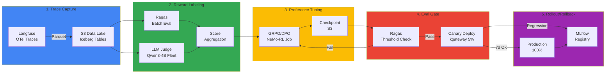
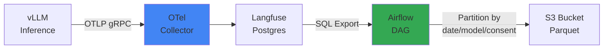

# Continuous Training Pipeline on EKS

## 개요

Continuous Training Pipeline은 프로덕션 추론 트레이스를 자동으로 학습 데이터로 전환하여 모델을 지속적으로 개선하는 **Self-Improving Agent Loop**의 구현 아키텍처입니다. Langfuse OTel 트레이스를 S3 Data Lake로 수집하고, Reward Labeler로 품질을 평가한 뒤, GRPO/DPO로 preference tuning을 수행합니다. 평가 통과 후 Canary 배포로 프로덕션에 점진 롤아웃합니다.

### 왜 Continuous Training인가

기존 학습 방식은 **정적 데이터셋**에 의존합니다. 하지만 프로덕션 사용자 피드백은 끊임없이 발생하며, 이를 반영하지 못하면 모델은 시간이 지날수록 **실제 사용 패턴과 괴리**됩니다.

| 문제 | 기존 방식 | Continuous Training |
|------|----------|---------------------|
| **데이터 수집** | 수동 라벨링 (월 1회) | 자동 trace 수집 (실시간) |
| **피드백 반영** | 3-6개월 | 1주일 |
| **품질 개선** | 신규 데이터셋 대기 | 사용자 피드백 즉시 반영 |
| **비용** | 라벨링 $10K/월 | Reward Model 자동화 |

:::tip 설계 문서 연계
이 문서는 [Self-Improving Agent Loop](../design-architecture/self-improving-agent-loop.md)의 5단계 아키텍처를 EKS에서 구현하는 방법을 다룹니다. 설계 배경과 전략적 의사결정은 설계 문서를 참조하세요.
:::

:::warning 실 운영 전 ADR 합의 필요
본 파이프라인을 실제 트래픽에 적용하려면 [ADR — Self-Improving Agent Loop 도입 의사결정](../_reference/adr-self-improving-loop.md)에 정의된 스코프·자동화 경계·데이터 게이트·롤백 기준이 조직 차원에서 합의돼야 합니다. Train/Deploy 단계는 수동 승인 경계로 운영하세요.
:::

### 5단계 파이프라인 흐름



**핵심 개념:**

1. **Trace → Dataset**: Langfuse 프로덕션 추론 로그를 학습 데이터로 전환
2. **Reward Labeling**: Ragas + LLM Judge로 trace 품질을 0-1점으로 스코어링
3. **GRPO/DPO**: 고득점 trace는 선호(preference), 저득점은 비선호로 학습
4. **Eval Gate**: 학습 후 품질 Threshold 검증
5. **Canary → 100%**: 점진적 트래픽 증가, 회귀 시 즉시 롤백

---

## 1. Trace → Dataset Materializer

### 1-1. Langfuse OTel → S3 Parquet

Langfuse는 OpenTelemetry 프로토콜로 추론 트레이스를 수집합니다. 이를 S3에 Parquet 형식으로 저장하여 대규모 배치 분석이 가능하도록 합니다.



#### Langfuse Trace Schema

```sql
-- Langfuse traces 테이블 구조 (PostgreSQL)
CREATE TABLE traces (
    id UUID PRIMARY KEY,
    timestamp TIMESTAMP,
    user_id TEXT,
    session_id TEXT,
    input TEXT,
    output TEXT,
    model TEXT,
    latency_ms INT,
    token_count INT,
    metadata JSONB,
    user_consent BOOLEAN  -- GDPR 동의 여부
);

-- 예시 데이터
{
  "id": "trace-12345",
  "timestamp": "2026-04-18T03:15:00Z",
  "user_id": "user-abc",
  "input": "EKS Auto Mode와 Karpenter의 차이점은?",
  "output": "EKS Auto Mode는 AWS 완전 관리형 노드 그룹이며...",
  "model": "glm-5-32b",
  "latency_ms": 850,
  "token_count": 512,
  "metadata": {
    "domain": "eks-documentation",
    "feedback_score": 4.5
  },
  "user_consent": true
}
```

#### S3 Partitioning 전략

```bash
s3://training-data-lake/
└── langfuse-traces/
    ├── date=2026-04-18/
    │   ├── model=glm-5-32b/
    │   │   ├── consent=true/
    │   │   │   └── traces-000001.parquet  (10k rows)
    │   │   └── consent=false/
    │   │       └── traces-000002.parquet
    │   └── model=qwen3-coder/
    │       └── consent=true/
    │           └── traces-000003.parquet
    └── date=2026-04-19/
        └── ...
```

**Partitioning 이유:**

- **날짜**: 시간 범위 쿼리 최적화 (예: 최근 7일 데이터)
- **모델**: 모델별 성능 추적, A/B 테스트 분리
- **동의**: GDPR/CCPA 규정 준수, 동의 없는 데이터 학습 제외

#### Apache Iceberg vs Hudi

| 특징 | Apache Iceberg | Apache Hudi |
|------|---------------|-------------|
| **스냅샷 격리** | 완벽한 ACID 트랜잭션 | 타임라인 기반 일관성 |
| **Schema 진화** | 자동 컬럼 추가/삭제 | 수동 마이그레이션 필요 |
| **쿼리 성능** | 파티션 가지치기 최적화 | COW/MOR 모드 선택 |
| **AWS 통합** | Glue Catalog 네이티브 | EMR 최적화 |
| **권장 용도** | 대규모 분석 쿼리 | 실시간 upsert 중심 |

:::tip Iceberg 권장
Continuous Training은 **읽기 중심 워크로드**(배치 학습)이므로 Iceberg를 권장합니다. Schema 변경(신규 메타데이터 필드 추가)이 빈번하므로 자동 Schema Evolution이 유리합니다.
:::

#### Airflow DAG 예시

```python
# dags/langfuse_to_s3.py
from airflow import DAG
from airflow.providers.postgres.hooks.postgres import PostgresHook
from airflow.providers.amazon.aws.hooks.s3 import S3Hook
from airflow.operators.python import PythonOperator
from datetime import datetime, timedelta
import pandas as pd
import pyarrow as pa
import pyarrow.parquet as pq

def export_langfuse_traces(**context):
    """Langfuse Postgres → S3 Parquet 변환"""
    
    # Langfuse DB 연결
    pg_hook = PostgresHook(postgres_conn_id='langfuse_db')
    
    # 어제 날짜 데이터 추출 (user_consent=true만)
    yesterday = context['ds']
    query = f"""
        SELECT 
            id, timestamp, user_id, session_id,
            input, output, model, latency_ms, token_count,
            metadata
        FROM traces
        WHERE DATE(timestamp) = '{yesterday}'
          AND user_consent = true
          AND output IS NOT NULL
        ORDER BY timestamp
    """
    
    df = pg_hook.get_pandas_df(query)
    
    # 모델별로 그룹화하여 Parquet 저장
    for model, group in df.groupby('model'):
        table = pa.Table.from_pandas(group)
        
        # S3 경로: s3://bucket/date=2026-04-18/model=glm-5-32b/consent=true/
        s3_key = f"langfuse-traces/date={yesterday}/model={model}/consent=true/traces-{context['ti'].xcom_pull()}.parquet"
        
        # S3 업로드
        s3_hook = S3Hook(aws_conn_id='aws_default')
        with s3_hook.get_conn().open(f"s3://training-data-lake/{s3_key}", 'wb') as f:
            pq.write_table(table, f, compression='snappy')
    
    return len(df)

with DAG(
    dag_id='langfuse_to_s3_daily',
    schedule_interval='0 6 * * *',  # 매일 오전 6시
    start_date=datetime(2026, 4, 1),
    catchup=False,
    default_args={
        'retries': 3,
        'retry_delay': timedelta(minutes=5),
    }
) as dag:
    
    export_task = PythonOperator(
        task_id='export_traces',
        python_callable=export_langfuse_traces,
    )
```

#### AWS Glue Catalog 등록

```python
# glue_iceberg_table.py
import boto3

glue = boto3.client('glue')

# Iceberg 테이블 정의
glue.create_table(
    DatabaseName='training_data',
    TableInput={
        'Name': 'langfuse_traces',
        'StorageDescriptor': {
            'Columns': [
                {'Name': 'id', 'Type': 'string'},
                {'Name': 'timestamp', 'Type': 'timestamp'},
                {'Name': 'user_id', 'Type': 'string'},
                {'Name': 'input', 'Type': 'string'},
                {'Name': 'output', 'Type': 'string'},
                {'Name': 'model', 'Type': 'string'},
                {'Name': 'latency_ms', 'Type': 'int'},
                {'Name': 'metadata', 'Type': 'struct<feedback_score:double,domain:string>'},
            ],
            'Location': 's3://training-data-lake/langfuse-traces/',
            'InputFormat': 'org.apache.iceberg.mr.hive.HiveIcebergInputFormat',
            'OutputFormat': 'org.apache.iceberg.mr.hive.HiveIcebergOutputFormat',
            'SerdeInfo': {
                'SerializationLibrary': 'org.apache.iceberg.mr.hive.HiveIcebergSerDe'
            }
        },
        'PartitionKeys': [
            {'Name': 'date', 'Type': 'date'},
            {'Name': 'model', 'Type': 'string'},
            {'Name': 'consent', 'Type': 'boolean'},
        ],
        'Parameters': {
            'table_type': 'ICEBERG',
            'format': 'parquet',
            'write.parquet.compression-codec': 'snappy',
        }
    }
)
```

---

## 2. Reward Labeler Fleet

### 2-1. Reward Labeling 개념

**Reward Labeling**은 각 trace의 품질을 0-1점 사이 점수로 평가하는 프로세스입니다. 이 점수는 GRPO/DPO 학습에서 **선호도(preference) 신호**로 사용됩니다.

```
고득점 trace (0.8-1.0) → 선호 예제 (학습 시 가중치 ↑)
저득점 trace (0.0-0.3) → 비선호 예제 (학습 시 가중치 ↓)
```

### 2-2. 평가 지표 조합

#### Ragas 메트릭

[Ragas 평가 프레임워크](../operations-mlops/ragas-evaluation.md)는 RAG 시스템의 품질을 객관적으로 측정합니다.

```python
from ragas.metrics import faithfulness, answer_relevancy, context_precision

# Ragas 배치 평가
scores = {
    'faithfulness': 0.92,      # 답변이 컨텍스트에 충실한가
    'answer_relevancy': 0.88,  # 답변이 질문과 관련있는가
    'context_precision': 0.85  # 검색된 컨텍스트가 정확한가
}

# 가중 평균으로 최종 Reward 계산
reward = (
    0.5 * scores['faithfulness'] +
    0.3 * scores['answer_relevancy'] +
    0.2 * scores['context_precision']
)
# → reward = 0.896
```

#### LLM-as-a-Judge

작은 모델(Qwen3-4B)을 judge로 활용하여 답변 품질을 평가합니다.

```python
# LLM Judge 프롬프트
JUDGE_PROMPT = """
다음 질문과 답변을 평가하세요.

**질문**: {question}
**답변**: {answer}

**평가 기준**:
1. 정확성: 기술적 오류가 없는가?
2. 완결성: 질문의 모든 측면을 다루는가?
3. 명확성: 이해하기 쉬운가?

점수를 0.0-1.0 사이로 출력하세요. JSON 형식으로만 응답하세요:
{{"score": 0.85, "reasoning": "..."}}
"""

# Qwen3-4B로 평가 (vLLM 배치 추론)
judge_response = vllm_client.chat.completions.create(
    model="qwen3-coder-4b",
    messages=[{"role": "user", "content": JUDGE_PROMPT.format(question=q, answer=a)}],
    temperature=0.1,
    max_tokens=200,
)

judge_score = json.loads(judge_response.choices[0].message.content)['score']
# → judge_score = 0.85
```

#### 최종 Reward 합산

```python
# Ragas + LLM Judge 조합
final_reward = (
    0.6 * ragas_reward +      # Ragas 가중치 60%
    0.4 * judge_score         # Judge 가중치 40%
)
```

### 2-3. KServe InferenceService 배포

Qwen3-4B Judge 모델을 KServe로 배포하여 고가용성 fleet을 구성합니다.

```yaml
# reward-labeler-inference.yaml
apiVersion: serving.kserve.io/v1beta1
kind: InferenceService
metadata:
  name: reward-labeler-qwen3
  namespace: training-pipeline
spec:
  predictor:
    minReplicas: 3
    maxReplicas: 10
    containers:
    - name: kserve-container
      image: vllm/vllm-openai:v0.18.2
      args:
      - --model=Qwen/Qwen3-Coder-4B-Instruct
      - --served-model-name=qwen3-judge
      - --tensor-parallel-size=1
      - --max-model-len=8192
      - --gpu-memory-utilization=0.9
      resources:
        requests:
          nvidia.com/gpu: 1
          memory: 16Gi
        limits:
          nvidia.com/gpu: 1
          memory: 24Gi
      env:
      - name: SERVED_MODEL_NAME
        value: "qwen3-judge"
---
apiVersion: keda.sh/v1alpha1
kind: ScaledObject
metadata:
  name: reward-labeler-scaler
  namespace: training-pipeline
spec:
  scaleTargetRef:
    name: reward-labeler-qwen3
  minReplicaCount: 3
  maxReplicaCount: 10
  triggers:
  - type: prometheus
    metadata:
      serverAddress: http://prometheus:9090
      metricName: vllm_requests_running
      threshold: "10"
      query: |
        avg(vllm_requests_running{model="qwen3-judge"})
```

**오토스케일링 전략:**

- **최소 3 replica**: 기본 처리량 보장
- **최대 10 replica**: 배치 평가 시 스파이크 대응
- **트리거**: vLLM 대기 요청 수 > 10 시 스케일아웃

### 2-4. 배치 평가 Job

```python
# batch_reward_labeling.py
import pandas as pd
from ragas import evaluate
from ragas.metrics import faithfulness, answer_relevancy, context_precision
import openai
import json
from concurrent.futures import ThreadPoolExecutor

# S3에서 최근 7일 trace 로드
df = pd.read_parquet(
    's3://training-data-lake/langfuse-traces/',
    filters=[
        ('date', '>=', '2026-04-11'),
        ('date', '<=', '2026-04-18'),
        ('model', '=', 'glm-5-32b'),
        ('consent', '=', True),
    ]
)

# Ragas 평가
ragas_results = evaluate(
    df,
    metrics=[faithfulness, answer_relevancy, context_precision]
)

# LLM Judge 평가 (병렬 처리)
def judge_single_trace(row):
    response = openai.ChatCompletion.create(
        model="qwen3-judge",
        messages=[{
            "role": "user",
            "content": JUDGE_PROMPT.format(
                question=row['input'],
                answer=row['output']
            )
        }],
        temperature=0.1,
        max_tokens=200,
        # KServe InferenceService 엔드포인트
        api_base="http://reward-labeler-qwen3.training-pipeline.svc.cluster.local:8000/v1"
    )
    return json.loads(response.choices[0].message.content)['score']

with ThreadPoolExecutor(max_workers=50) as executor:
    judge_scores = list(executor.map(judge_single_trace, df.to_dict('records')))

# 최종 Reward 계산
df['ragas_reward'] = (
    0.5 * ragas_results['faithfulness'] +
    0.3 * ragas_results['answer_relevancy'] +
    0.2 * ragas_results['context_precision']
)
df['judge_score'] = judge_scores
df['final_reward'] = 0.6 * df['ragas_reward'] + 0.4 * df['judge_score']

# S3에 레이블링된 데이터셋 저장
df.to_parquet('s3://training-data-lake/labeled-dataset/2026-04-18.parquet')
```

### 2-5. 비용 예시

| 리소스 | 스펙 | 시간당 비용 | 일일 비용 (10시간 가동) |
|--------|------|-----------|----------------------|
| **Qwen3-4B Judge Fleet** | g6.xlarge × 3 | $0.93 | $9.30 |
| **Ragas 평가 (Bedrock Claude)** | - | API 호출당 | $5-10 (1만 trace 기준) |
| **Airflow/Kubernetes** | 기존 인프라 | - | - |
| **총 비용** | - | - | **$15-20/일** |

연간 $5,000-7,000 수준으로 수동 라벨링($10K/월) 대비 **95% 절감** 효과.

---

## 3. GRPO/DPO 학습 Job

### 3-1. GRPO vs DPO 개념

#### GRPO (Group Relative Policy Optimization)

**GRPO**는 동일 프롬프트에 대한 여러 응답을 reward 기준으로 순위화하여 학습하는 방법입니다.

```
프롬프트: "EKS Auto Mode의 장점은?"

응답 A (reward=0.9): "AWS가 노드를 완전 관리하여 운영 부담이 감소합니다..."
응답 B (reward=0.6): "Auto Mode는 편리합니다..."
응답 C (reward=0.3): "잘 모르겠습니다."

학습: A > B > C 순위로 정책 최적화
```

**장점:**

- 절대 점수 대신 **상대 순위** 학습 → 라벨링 노이즈에 강건
- 한 프롬프트당 여러 응답 생성 → 데이터 효율적
- RLHF 대비 간단 (Reward Model 별도 학습 불필요)

#### DPO (Direct Preference Optimization)

**DPO**는 선호/비선호 쌍을 직접 학습하는 방법입니다.

```
프롬프트: "Karpenter의 주요 기능은?"

선호 (reward >= 0.7):
"Karpenter는 자동 노드 프로비저닝, bin-packing 최적화..."

비선호 (reward < 0.5):
"Karpenter는 스케일링 도구입니다." (너무 짧음)

학습: 선호 응답의 확률 ↑, 비선호 응답의 확률 ↓
```

**장점:**

- RLHF처럼 별도 Value Function 없이 **단일 Loss로 학습**
- 안정적인 학습 (PPO 대비 하이퍼파라미터 튜닝 간단)
- 프로덕션 적용 사례 많음 (Llama 3.1, Claude 3 등)

#### 선택 기준

| 상황 | 권장 방법 | 이유 |
|------|----------|------|
| **다양한 응답 생성 가능** | GRPO | 순위 학습으로 데이터 효율 ↑ |
| **명확한 선호/비선호 구분** | DPO | 단순하고 안정적 |
| **라벨링 노이즈 많음** | GRPO | 상대 순위는 절대 점수보다 강건 |
| **빠른 프로토타이핑** | DPO | 하이퍼파라미터 튜닝 간단 |

### 3-2. NeMo-RL 기반 GRPO 학습

[NeMo Framework](../model-serving/inference-frameworks/nemo-framework.md)는 NVIDIA의 대규모 모델 학습 프레임워크입니다.

```python
# nemo_grpo_training.py
from nemo.collections.llm import GRPO, GPTModel
from nemo.collections.nlp.data import PreferenceDataset

# 학습 데이터 로드
dataset = PreferenceDataset(
    data_path='s3://training-data-lake/labeled-dataset/',
    reward_column='final_reward',
    min_reward_threshold=0.5,  # 0.5 이하는 제외
)

# 기본 모델 로드
model = GPTModel.from_pretrained('glm-5-32b')

# GRPO 설정
grpo_config = GRPO(
    num_iterations=1000,
    batch_size=32,
    learning_rate=1e-5,
    kl_coeff=0.1,  # KL divergence 페널티 (원본 모델과 너무 멀어지지 않도록)
    cliprange=0.2,
    vf_coeff=0.5,
)

# 분산 학습 실행
trainer = Trainer(
    devices=8,  # H100 8개
    num_nodes=3,  # 3 노드 = 24 GPU
    precision='bf16',
    strategy='fsdp',  # Fully Sharded Data Parallel
)

trainer.fit(model, grpo_config, dataset)
```

### 3-3. TRL 기반 DPO 학습

[TRL (Transformer Reinforcement Learning)](https://github.com/huggingface/trl)은 HuggingFace의 RLHF 라이브러리입니다.

```python
# trl_dpo_training.py
from trl import DPOTrainer, DPOConfig
from transformers import AutoModelForCausalLM, AutoTokenizer
from datasets import load_dataset

# 모델 로드
model = AutoModelForCausalLM.from_pretrained('glm-5-32b', torch_dtype='bfloat16')
tokenizer = AutoTokenizer.from_pretrained('glm-5-32b')

# 선호/비선호 데이터셋 준비
def format_dpo_dataset(example):
    """Reward 기준으로 선호/비선호 구분"""
    if example['final_reward'] >= 0.7:
        return {
            'prompt': example['input'],
            'chosen': example['output'],
            'rejected': None,  # 비선호 예제는 별도 매칭
        }
    else:
        return None

dataset = load_dataset('parquet', data_files='s3://training-data-lake/labeled-dataset/*.parquet')
dpo_dataset = dataset.map(format_dpo_dataset).filter(lambda x: x is not None)

# DPO 학습 설정
training_args = DPOConfig(
    output_dir='/output/glm-5-dpo',
    per_device_train_batch_size=4,
    gradient_accumulation_steps=8,
    learning_rate=5e-7,
    max_length=4096,
    beta=0.1,  # DPO temperature (높을수록 선호도 차이 강조)
    num_train_epochs=1,
    bf16=True,
    logging_steps=10,
    save_strategy='steps',
    save_steps=100,
)

# 학습 실행
trainer = DPOTrainer(
    model=model,
    args=training_args,
    train_dataset=dpo_dataset,
    tokenizer=tokenizer,
)

trainer.train()
```

### 3-4. Kubernetes Job YAML

```yaml
# grpo-training-job.yaml
apiVersion: batch/v1
kind: Job
metadata:
  name: grpo-training-glm5
  namespace: training-pipeline
spec:
  parallelism: 3  # 3 노드 병렬 실행
  completions: 1
  template:
    metadata:
      labels:
        app: grpo-training
        karpenter.sh/capacity-type: spot  # Spot 인스턴스 활용
    spec:
      nodeSelector:
        node.kubernetes.io/instance-type: p5en.48xlarge  # H200 8개
      tolerations:
      - key: nvidia.com/gpu
        operator: Exists
        effect: NoSchedule
      - key: karpenter.sh/capacity-type
        operator: Equal
        value: spot
        effect: NoSchedule
      
      volumes:
      - name: checkpoint-storage
        persistentVolumeClaim:
          claimName: training-checkpoints
      
      containers:
      - name: nemo-trainer
        image: nvcr.io/nvidia/nemo:26.02
        command:
        - python
        - /workspace/nemo_grpo_training.py
        args:
        - --data-path=s3://training-data-lake/labeled-dataset/
        - --output-path=/checkpoints/grpo-run-001
        - --num-nodes=3
        - --devices=8
        volumeMounts:
        - name: checkpoint-storage
          mountPath: /checkpoints
        resources:
          requests:
            nvidia.com/gpu: 8
            memory: 1600Gi  # H200 141GB × 8 + 오버헤드
          limits:
            nvidia.com/gpu: 8
            memory: 1600Gi
        env:
        - name: NCCL_DEBUG
          value: "INFO"
        - name: NCCL_MIN_NCHANNELS
          value: "16"
        - name: FI_PROVIDER
          value: "efa"
        - name: FI_EFA_USE_DEVICE_RDMA
          value: "1"
      
      restartPolicy: OnFailure
---
# Karpenter NodePool - Spot 인스턴스
apiVersion: karpenter.sh/v1
kind: NodePool
metadata:
  name: training-spot-pool
spec:
  disruption:
    consolidationPolicy: WhenEmpty
    consolidateAfter: 5m
  template:
    spec:
      requirements:
      - key: karpenter.sh/capacity-type
        operator: In
        values: ["spot"]
      - key: node.kubernetes.io/instance-type
        operator: In
        values: ["p5en.48xlarge"]
      - key: topology.kubernetes.io/zone
        operator: In
        values: ["us-east-2a", "us-east-2b"]
      
      nodeClassRef:
        name: training-gpu-class
      
      taints:
      - key: nvidia.com/gpu
        effect: NoSchedule
      - key: karpenter.sh/capacity-type
        value: spot
        effect: NoSchedule
```

#### Volcano 배치 스케줄링

[Volcano](https://volcano.sh/)는 AI/ML 워크로드를 위한 배치 스케줄러입니다. Gang Scheduling으로 모든 노드가 준비될 때까지 대기했다가 동시에 실행합니다.

```yaml
# volcano-job.yaml
apiVersion: batch.volcano.sh/v1alpha1
kind: Job
metadata:
  name: grpo-training-volcano
spec:
  minAvailable: 3  # 3개 노드 모두 준비될 때까지 대기
  schedulerName: volcano
  queue: training-queue
  tasks:
  - name: trainer
    replicas: 3
    template:
      spec:
        # (위와 동일한 컨테이너 스펙)
```

**Gang Scheduling의 필요성:**

```
일반 Kubernetes:
  노드1: 즉시 시작 → 다른 노드 대기 중 → GPU 유휴
  노드2: 5분 후 시작
  노드3: 10분 후 시작
  → 노드1의 GPU는 10분간 낭비

Volcano Gang Scheduling:
  노드1, 2, 3: 모두 준비될 때까지 대기
  → 10분 후 동시 시작 → 모든 GPU 즉시 활용
```

### 3-5. 비용 예시

| 리소스 | 스펙 | 시간당 비용 | 학습 시간 (1 epoch) | 총 비용 |
|--------|------|-----------|-------------------|---------|
| **p5en.48xlarge Spot** | H200 8개 × 3 노드 | $10-15/GPU-hr | 4-6시간 | **$960-2,160** |
| **FSx Lustre (학습 데이터)** | 1.2 MB/s/TiB | $0.14/GB-월 | - | ~$50 |
| **S3 체크포인트 저장** | - | $0.023/GB | - | ~$10 |
| **iteration당 총 비용** | - | - | - | **$1,020-2,220** |

:::warning 비용 디스클레이머
p5en Spot 가격은 수요에 따라 변동됩니다. Spot 중단(interruption) 대비 체크포인트 자동 저장 필수. 연간 24회 iteration 가정 시 $24K-53K 수준.
:::

---

## 4. Eval Gate

### 4-1. Threshold 검증

학습된 모델은 배포 전 품질 기준선(threshold)을 통과해야 합니다.

```python
# eval_gate.py
from ragas import evaluate
from ragas.metrics import faithfulness, answer_relevancy

# 테스트 데이터셋 (프로덕션 대표 샘플 500개)
test_dataset = load_test_dataset('s3://training-data-lake/test-dataset.parquet')

# 신규 모델 평가
new_model_results = evaluate(
    test_dataset,
    model='glm-5-dpo-checkpoint-1000',
    metrics=[faithfulness, answer_relevancy]
)

# 기준선 모델 평가
baseline_results = evaluate(
    test_dataset,
    model='glm-5-baseline',
    metrics=[faithfulness, answer_relevancy]
)

# Threshold 검증
THRESHOLDS = {
    'faithfulness': 0.85,
    'answer_relevancy': 0.80,
}

REGRESSION_TOLERANCE = {
    'faithfulness': 0.03,  # 3%p 이상 하락 시 실패
    'p99_latency_ms': 0.10,  # 10% 이상 증가 시 실패
}

def check_eval_gate(new, baseline, thresholds, regression):
    failures = []
    
    # 절대 Threshold 검증
    for metric, threshold in thresholds.items():
        if new[metric] < threshold:
            failures.append(f"{metric}: {new[metric]:.3f} < {threshold}")
    
    # 회귀 검증
    if baseline['faithfulness'] - new['faithfulness'] > regression['faithfulness']:
        failures.append(f"Faithfulness regression: {baseline['faithfulness']:.3f} → {new['faithfulness']:.3f}")
    
    if (new['p99_latency_ms'] - baseline['p99_latency_ms']) / baseline['p99_latency_ms'] > regression['p99_latency_ms']:
        failures.append(f"Latency regression: {baseline['p99_latency_ms']:.0f}ms → {new['p99_latency_ms']:.0f}ms")
    
    if failures:
        print("❌ Eval Gate FAILED:")
        for f in failures:
            print(f"  - {f}")
        return False
    else:
        print("✅ Eval Gate PASSED")
        return True

passed = check_eval_gate(new_model_results, baseline_results, THRESHOLDS, REGRESSION_TOLERANCE)
```

### 4-2. Canary Deployment (kgateway)

[Gateway API](https://gateway-api.sigs.k8s.io/)의 HTTPRoute를 사용하여 트래픽을 점진적으로 전환합니다.

#### Stage 1: 5% Canary

```yaml
# canary-5-percent.yaml
apiVersion: gateway.networking.k8s.io/v1
kind: HTTPRoute
metadata:
  name: model-serving-canary
  namespace: model-serving
spec:
  parentRefs:
  - name: inference-gateway
    namespace: kgateway-system
  
  hostnames:
  - "api.example.com"
  
  rules:
  - matches:
    - path:
        type: PathPrefix
        value: /v1/chat/completions
    
    backendRefs:
    # 기존 stable 버전 (95%)
    - name: vllm-glm5-stable
      port: 8000
      weight: 95
    
    # 신규 canary 버전 (5%)
    - name: vllm-glm5-canary
      port: 8000
      weight: 5
```

#### Stage 2: 25% (24시간 후 문제 없으면)

```yaml
# canary-25-percent.yaml
backendRefs:
- name: vllm-glm5-stable
  port: 8000
  weight: 75
- name: vllm-glm5-canary
  port: 8000
  weight: 25
```

#### Stage 3: 100% (7일 후 최종 승격)

```yaml
# canary-100-percent.yaml
backendRefs:
- name: vllm-glm5-canary
  port: 8000
  weight: 100
```

### 4-3. Canary 모니터링

```yaml
# canary-monitor-rules.yaml
apiVersion: v1
kind: ConfigMap
metadata:
  name: prometheus-canary-rules
  namespace: monitoring
data:
  canary-alerts.yml: |
    groups:
    - name: canary-monitoring
      interval: 30s
      rules:
      # Faithfulness 회귀 감지
      - alert: CanaryFaithfulnessDrop
        expr: |
          (
            avg_over_time(langfuse_trace_faithfulness{model="glm5-canary"}[1h])
            -
            avg_over_time(langfuse_trace_faithfulness{model="glm5-stable"}[1h])
          ) < -0.03
        for: 10m
        annotations:
          summary: "Canary 모델 faithfulness 3%p 이상 하락"
          description: "Canary: {{ $value | humanize }}pp drop"
      
      # P99 레이턴시 회귀
      - alert: CanaryLatencyRegression
        expr: |
          (
            histogram_quantile(0.99, vllm_request_duration_seconds{model="glm5-canary"})
            /
            histogram_quantile(0.99, vllm_request_duration_seconds{model="glm5-stable"})
          ) > 1.10
        for: 5m
        annotations:
          summary: "Canary 모델 P99 레이턴시 10% 이상 증가"
      
      # 에러율 증가
      - alert: CanaryErrorRateHigh
        expr: |
          rate(vllm_request_errors_total{model="glm5-canary"}[5m])
          >
          rate(vllm_request_errors_total{model="glm5-stable"}[5m]) * 2
        for: 5m
        annotations:
          summary: "Canary 모델 에러율 2배 이상 증가"
```

### 4-4. CI 통합 (Argo Workflows)

```yaml
# canary-deployment-workflow.yaml
apiVersion: argoproj.io/v1alpha1
kind: Workflow
metadata:
  generateName: canary-deployment-
  namespace: training-pipeline
spec:
  entrypoint: canary-pipeline
  
  templates:
  - name: canary-pipeline
    steps:
    # Step 1: Eval Gate
    - - name: eval-gate
        template: run-eval-gate
    
    # Step 2: Canary 5%
    - - name: deploy-canary-5
        template: apply-canary-weight
        arguments:
          parameters:
          - name: weight
            value: "5"
        when: "{{steps.eval-gate.outputs.result}} == passed"
    
    # Step 3: 24시간 대기 + 모니터링
    - - name: monitor-24h
        template: monitor-canary
        arguments:
          parameters:
          - name: duration
            value: "24h"
    
    # Step 4: Canary 25%
    - - name: deploy-canary-25
        template: apply-canary-weight
        arguments:
          parameters:
          - name: weight
            value: "25"
        when: "{{steps.monitor-24h.outputs.result}} == healthy"
    
    # Step 5: 7일 대기
    - - name: monitor-7d
        template: monitor-canary
        arguments:
          parameters:
          - name: duration
            value: "168h"
    
    # Step 6: 100% 승격
    - - name: promote-to-production
        template: apply-canary-weight
        arguments:
          parameters:
          - name: weight
            value: "100"
        when: "{{steps.monitor-7d.outputs.result}} == healthy"
  
  - name: run-eval-gate
    script:
      image: python:3.11
      command: [python]
      source: |
        # (위 eval_gate.py 코드)
        passed = check_eval_gate(...)
        print("passed" if passed else "failed")
  
  - name: apply-canary-weight
    inputs:
      parameters:
      - name: weight
    resource:
      action: apply
      manifest: |
        apiVersion: gateway.networking.k8s.io/v1
        kind: HTTPRoute
        metadata:
          name: model-serving-canary
        spec:
          rules:
          - backendRefs:
            - name: vllm-glm5-stable
              weight: {{100 - inputs.parameters.weight}}
            - name: vllm-glm5-canary
              weight: {{inputs.parameters.weight}}
  
  - name: monitor-canary
    inputs:
      parameters:
      - name: duration
    script:
      image: curlimages/curl:latest
      command: [sh]
      source: |
        # Prometheus에서 canary 메트릭 조회
        sleep {{inputs.parameters.duration}}
        
        # Faithfulness 확인
        faithfulness_drop=$(curl -s 'http://prometheus:9090/api/v1/query?query=...')
        if [ "$faithfulness_drop" -lt "-0.03" ]; then
          echo "unhealthy"
          exit 1
        fi
        
        echo "healthy"
```

---

## 5. Registry & Rollback

### 5-1. MLflow Model Registry

[MLflow](https://mlflow.org/)는 모델 버전 관리와 라이프사이클을 추적합니다.

```python
# mlflow_registry.py
import mlflow
from mlflow.tracking import MlflowClient

mlflow.set_tracking_uri("http://mlflow-server.mlflow.svc.cluster.local:5000")
client = MlflowClient()

# 신규 모델 등록
model_uri = "s3://training-checkpoints/grpo-run-001/checkpoint-1000"

with mlflow.start_run(run_name="grpo-iteration-001"):
    # 메트릭 로깅
    mlflow.log_metrics({
        "faithfulness": 0.92,
        "answer_relevancy": 0.88,
        "p99_latency_ms": 850,
        "training_loss": 0.15,
    })
    
    # 모델 등록
    mlflow.register_model(
        model_uri=model_uri,
        name="glm-5-grpo",
        tags={
            "iteration": "001",
            "training_date": "2026-04-18",
            "base_model": "glm-5-32b",
            "method": "GRPO",
            "eval_gate_status": "passed",
        }
    )

# Stage 전환 (None → Staging → Production)
client.transition_model_version_stage(
    name="glm-5-grpo",
    version=1,
    stage="Staging",  # Canary 배포 중
)

# 7일 후 Production 승격
client.transition_model_version_stage(
    name="glm-5-grpo",
    version=1,
    stage="Production",
)

# 이전 버전 Archive
client.transition_model_version_stage(
    name="glm-5-grpo",
    version=0,  # 이전 baseline 모델
    stage="Archived",
)
```

### 5-2. Agent Versioning 연계

[Agent Versioning](../../aidlc/enterprise/agent-versioning/index.md)은 에이전트 코드와 모델 버전을 동기화합니다.

```yaml
# agent-version-manifest.yaml
apiVersion: v1
kind: ConfigMap
metadata:
  name: agent-version-config
  namespace: agentic-platform
data:
  versions.yaml: |
    agents:
      - name: code-assistant
        version: v2.3.0
        model:
          name: glm-5-grpo
          version: 1
          registry: mlflow
          stage: Production
        tools:
          - mcp-github
          - mcp-jira
        prompt_version: v2.3.0
      
      - name: docs-writer
        version: v1.5.0
        model:
          name: glm-5-grpo
          version: 0  # 아직 이전 버전 사용
          registry: mlflow
          stage: Production
```

### 5-3. Bedrock Agents 하이브리드 동기

하이브리드 아키텍처(EKS + Bedrock)에서는 EKS 모델 업데이트를 Bedrock Agent에도 반영해야 합니다.

```python
# sync_to_bedrock.py
import boto3

bedrock = boto3.client('bedrock-agent')

# EKS 신규 모델 정보
eks_model_version = "glm-5-grpo-v1"
eks_endpoint = "http://vllm-glm5-canary.model-serving.svc.cluster.local:8000"

# Bedrock Agent 업데이트
bedrock.update_agent(
    agentId='AGENT123',
    agentName='code-assistant',
    foundationModel='anthropic.claude-3-sonnet-20240229-v1:0',  # fallback 모델
    instruction=f"""
    Use the custom EKS model for code generation tasks:
    - Model: {eks_model_version}
    - Endpoint: {eks_endpoint}
    
    Fallback to Claude Sonnet if EKS model is unavailable.
    """,
)
```

### 5-4. Rollback YAML

회귀 발견 시 즉시 이전 stable 버전으로 롤백합니다.

```yaml
# rollback-to-stable.yaml
apiVersion: gateway.networking.k8s.io/v1
kind: HTTPRoute
metadata:
  name: model-serving-rollback
  namespace: model-serving
spec:
  rules:
  - backendRefs:
    # Canary 제거, 100% stable로 복구
    - name: vllm-glm5-stable
      port: 8000
      weight: 100
---
# Canary Deployment 정지
apiVersion: apps/v1
kind: Deployment
metadata:
  name: vllm-glm5-canary
  namespace: model-serving
spec:
  replicas: 0  # 즉시 스케일다운
```

**Rollback 자동화 (Argo Rollouts):**

```yaml
apiVersion: argoproj.io/v1alpha1
kind: Rollout
metadata:
  name: vllm-glm5
  namespace: model-serving
spec:
  replicas: 3
  strategy:
    canary:
      steps:
      - setWeight: 5
      - pause: {duration: 24h}
      - setWeight: 25
      - pause: {duration: 168h}
      - setWeight: 100
      
      # 자동 롤백 조건
      analysis:
        templates:
        - templateName: canary-quality-check
        args:
        - name: service-name
          value: vllm-glm5-canary
  
  revisionHistoryLimit: 5  # 최근 5개 버전 유지
```

### 5-5. Checkpoint 보존 정책

S3 체크포인트는 lifecycle 정책으로 비용 최적화합니다.

```json
{
  "Rules": [
    {
      "Id": "archive-old-checkpoints",
      "Status": "Enabled",
      "Prefix": "training-checkpoints/",
      "Transitions": [
        {
          "Days": 30,
          "StorageClass": "GLACIER_IR"
        },
        {
          "Days": 90,
          "StorageClass": "DEEP_ARCHIVE"
        }
      ],
      "Expiration": {
        "Days": 365
      }
    },
    {
      "Id": "keep-production-checkpoints",
      "Status": "Enabled",
      "Prefix": "training-checkpoints/production/",
      "Transitions": [],
      "Expiration": null
    }
  ]
}
```

**보존 전략:**

- **최근 30일**: S3 Standard (즉시 접근)
- **30-90일**: Glacier Instant Retrieval (드문 액세스)
- **90-365일**: Glacier Deep Archive (장기 보관)
- **Production 체크포인트**: 영구 보존

---

## 6. 관측·비용 KPI

### 6-1. GPU-hours per Quality Improvement

**KPI 정의**: Faithfulness 0.01 상승당 소요된 GPU 시간과 비용

```python
# kpi_calculation.py
import pandas as pd

# 학습 이력
training_runs = pd.DataFrame([
    {'iteration': 1, 'gpu_hours': 96, 'cost_usd': 1200, 'faithfulness_delta': 0.02},
    {'iteration': 2, 'gpu_hours': 120, 'cost_usd': 1500, 'faithfulness_delta': 0.015},
    {'iteration': 3, 'gpu_hours': 144, 'cost_usd': 1800, 'faithfulness_delta': 0.01},
])

# KPI 계산
training_runs['gpu_hours_per_0.01_improvement'] = training_runs['gpu_hours'] / (training_runs['faithfulness_delta'] * 100)
training_runs['cost_per_0.01_improvement'] = training_runs['cost_usd'] / (training_runs['faithfulness_delta'] * 100)

print(training_runs)
```

**결과 예시:**

| iteration | gpu_hours | cost_usd | faithfulness_delta | gpu_hours_per_0.01 | cost_per_0.01 |
|-----------|-----------|----------|-------------------|-------------------|--------------|
| 1 | 96 | $1,200 | 0.020 | 48 | $600 |
| 2 | 120 | $1,500 | 0.015 | 80 | $1,000 |
| 3 | 144 | $1,800 | 0.010 | 144 | $1,800 |

**해석**: 초기에는 빠른 개선이 가능하지만, iteration이 진행될수록 **수익체감(diminishing returns)** 발생. 비용 대비 효율이 떨어지면 학습 중단 고려.

### 6-2. AMP Recording Rule

Prometheus Recording Rule로 KPI를 사전 계산하여 대시보드 쿼리 성능을 최적화합니다.

```yaml
# amp-recording-rules.yaml
apiVersion: v1
kind: ConfigMap
metadata:
  name: continuous-training-recording-rules
  namespace: monitoring
data:
  rules.yml: |
    groups:
    - name: continuous-training-kpi
      interval: 1m
      rules:
      # 모델별 평균 Faithfulness (1시간 윈도우)
      - record: model:faithfulness:avg1h
        expr: |
          avg_over_time(langfuse_trace_faithfulness[1h])
      
      # Canary vs Stable Faithfulness 차이
      - record: canary:faithfulness:delta
        expr: |
          model:faithfulness:avg1h{model="glm5-canary"}
          -
          model:faithfulness:avg1h{model="glm5-stable"}
      
      # GPU 사용 시간 (누적)
      - record: training:gpu_hours:total
        expr: |
          sum(
            rate(container_gpu_allocation{namespace="training-pipeline"}[5m])
          ) * 3600
      
      # 학습 비용 추정 (GPU-hour × $12.5)
      - record: training:cost_usd:total
        expr: |
          training:gpu_hours:total * 12.5
      
      # Quality Improvement per Dollar
      - record: training:improvement_per_dollar
        expr: |
          increase(model:faithfulness:avg1h[7d])
          /
          increase(training:cost_usd:total[7d])
```

### 6-3. Grafana 대시보드

```json
{
  "dashboard": {
    "title": "Continuous Training KPI",
    "panels": [
      {
        "title": "Faithfulness Trend (7d)",
        "targets": [
          {
            "expr": "model:faithfulness:avg1h{model=\"glm5-canary\"}"
          },
          {
            "expr": "model:faithfulness:avg1h{model=\"glm5-stable\"}"
          }
        ],
        "type": "graph"
      },
      {
        "title": "Training Cost per Week",
        "targets": [
          {
            "expr": "increase(training:cost_usd:total[7d])"
          }
        ],
        "type": "stat"
      },
      {
        "title": "Quality Improvement per $1000",
        "targets": [
          {
            "expr": "training:improvement_per_dollar * 1000"
          }
        ],
        "type": "gauge",
        "thresholds": [
          {"value": 0, "color": "red"},
          {"value": 0.005, "color": "yellow"},
          {"value": 0.01, "color": "green"}
        ]
      },
      {
        "title": "Canary Deployment Timeline",
        "targets": [
          {
            "expr": "sum(rate(vllm_request_success_total{model=\"glm5-canary\"}[5m])) / sum(rate(vllm_request_success_total[5m]))"
          }
        ],
        "type": "graph",
        "annotations": [
          {"text": "Canary 5%", "time": "2026-04-18T06:00:00Z"},
          {"text": "Canary 25%", "time": "2026-04-19T06:00:00Z"},
          {"text": "Production 100%", "time": "2026-04-25T06:00:00Z"}
        ]
      }
    ]
  }
}
```

### 6-4. 주간/월간 Cadence 권장

| 주기 | 액션 | 목표 |
|------|------|------|
| **주간** | Trace 수집 → Reward Labeling | 최소 5,000개 고품질 trace 확보 |
| **격주** | GRPO/DPO 학습 iteration | Faithfulness +0.01 개선 |
| **월간** | 전체 평가 + Canary 배포 | 프로덕션 품질 1% 개선 |
| **분기** | 비용 대비 ROI 분석 | 학습 중단/지속 의사결정 |

**권장 시작 주기:**

- **초기 3개월**: 격주 iteration (빠른 개선)
- **성숙기 (6개월+)**: 월간 iteration (안정화)

### 6-5. 손익 분기 분석

```python
# roi_analysis.py
# 가정: 모델 품질 1% 개선 → 사용자 만족도 5% 증가 → 이탈률 2% 감소

# 현재 지표
monthly_revenue = 100_000  # $100K/월
churn_rate = 0.10  # 10% 월간 이탈률
ltv_per_user = 5_000  # 사용자 생애 가치 $5K

# 학습 비용
training_cost_per_iteration = 2_000
iterations_per_month = 2
monthly_training_cost = training_cost_per_iteration * iterations_per_month  # $4K

# 품질 개선 효과
quality_improvement_per_month = 0.01  # 1% faithfulness 증가
churn_reduction = quality_improvement_per_month * 2  # 2% 이탈률 감소

# 매출 증대
retained_users = (monthly_revenue / ltv_per_user) * churn_reduction
revenue_increase = retained_users * ltv_per_user

print(f"월간 학습 비용: ${monthly_training_cost:,}")
print(f"월간 매출 증대: ${revenue_increase:,.0f}")
print(f"순익: ${revenue_increase - monthly_training_cost:,.0f}")
print(f"ROI: {(revenue_increase / monthly_training_cost - 1) * 100:.1f}%")
```

**출력 예시:**

```
월간 학습 비용: $4,000
월간 매출 증대: $20,000
순익: $16,000
ROI: 400%
```

---

## 요약

Continuous Training Pipeline은 5단계 워크플로우로 프로덕션 피드백을 자동으로 모델 개선에 반영합니다:

1. **Trace → Dataset**: Langfuse OTel → S3 Iceberg (날짜/모델/동의 파티셔닝)
2. **Reward Labeling**: Ragas + Qwen3-4B Judge Fleet (KServe + KEDA)
3. **GRPO/DPO 학습**: NeMo-RL 또는 TRL (Karpenter Spot p5en.48xlarge × 3 노드)
4. **Eval Gate**: Threshold 검증 + Canary 5% → 25% → 100% (kgateway)
5. **Registry & Rollback**: MLflow + Agent Versioning + 자동 롤백

**핵심 포인트:**

- **비용 효율**: Spot 인스턴스 + 격주 iteration → $4K/월 수준
- **품질 개선**: 월 1% faithfulness 증가 목표
- **안전성**: Eval Gate + 점진 Canary + 자동 롤백
- **ROI**: 학습 비용 대비 400% 매출 증대 가능

### 다음 단계

- [Self-Improving Agent Loop](../design-architecture/self-improving-agent-loop.md) - 설계 아키텍처 및 전략
- [커스텀 모델 파이프라인](./custom-model-pipeline.md) - SFT 학습 전제 조건
- [Cascade Routing Tuning](./cascade-routing-tuning.md) - 배포 후 라우팅 최적화
- [Agent Versioning](../../aidlc/enterprise/agent-versioning/index.md) - 모델·코드·프롬프트 동기화

---

## 참고 자료

| 자료 | 링크 |
|------|------|
| **GRPO Paper** | [arxiv.org/abs/2402.03300](https://arxiv.org/abs/2402.03300) |
| **DPO Paper** | [arxiv.org/abs/2305.18290](https://arxiv.org/abs/2305.18290) |
| **NeMo Framework** | [docs.nvidia.com/nemo-framework](https://docs.nvidia.com/nemo-framework/user-guide/latest/) |
| **TRL Library** | [github.com/huggingface/trl](https://github.com/huggingface/trl) |
| **Apache Iceberg** | [iceberg.apache.org](https://iceberg.apache.org/) |
| **Karpenter** | [karpenter.sh](https://karpenter.sh/) |
| **Volcano Scheduler** | [volcano.sh](https://volcano.sh/) |
| **Gateway API** | [gateway-api.sigs.k8s.io](https://gateway-api.sigs.k8s.io/) |
| **MLflow** | [mlflow.org](https://mlflow.org/) |
| **Ragas** | [docs.ragas.io](https://docs.ragas.io/) |

:::tip 프로덕션 체크리스트

- [ ] Langfuse OTel trace 수집 활성화 (user_consent 필드 추가)
- [ ] S3 Data Lake + Glue Iceberg 테이블 구성
- [ ] Reward Labeler Fleet (Qwen3-4B KServe + KEDA) 배포
- [ ] NeMo-RL 또는 TRL 학습 환경 구성 (Karpenter Spot 노드풀)
- [ ] Eval Gate Threshold 정의 (faithfulness >= 0.85)
- [ ] Canary Deployment HTTPRoute + 모니터링 알람 설정
- [ ] MLflow Registry + Agent Versioning 연동
- [ ] Rollback 자동화 (Argo Rollouts)
- [ ] 비용 KPI 대시보드 (Grafana) 구축
- [ ] 격주/월간 iteration 일정 수립

:::
