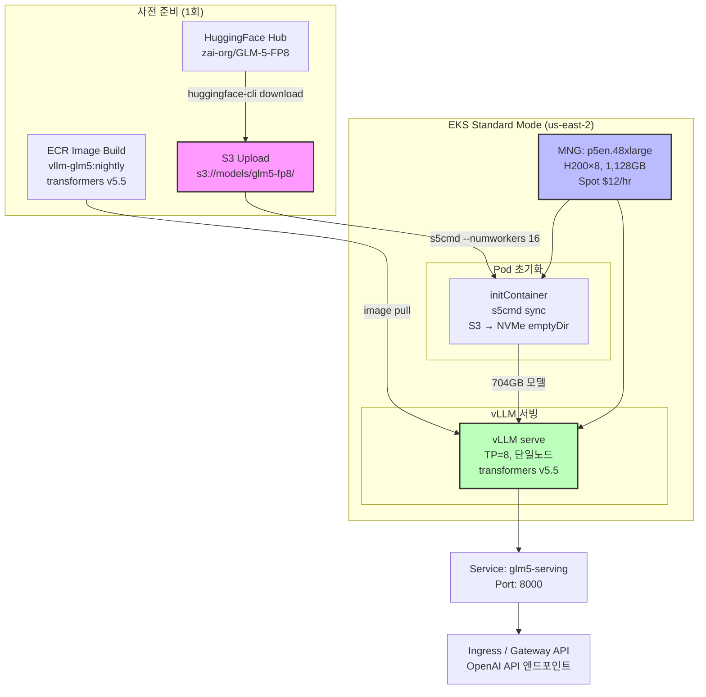

# 커스텀 모델 배포 가이드

이 문서는 대형 오픈소스 모델을 EKS에서 vLLM으로 배포하기 위한 실전 가이드입니다. **GLM-5.1 744B MoE FP8** 모델의 배포 사례를 예시로 사용하며, 동일한 패턴을 다른 대형 모델(DeepSeek-V3, Mixtral, Qwen-MoE 등)에도 적용할 수 있습니다.

:::info 이 가이드의 목적
이 문서는 "이렇게 하면 된다"보다는 "이런 이슈를 만났고, 이렇게 해결했다"에 초점을 맞춥니다. 실제 프로덕션 배포 시 겪을 수 있는 문제를 미리 파악하고 대응하는 데 도움을 드립니다.
:::

## 1. 모델 선택 기준

배포할 모델을 선택할 때는 다음 기준을 평가합니다.

| 기준 | 확인 사항 | 비고 |
|------|----------|------|
| **라이선스** | MIT, Apache 2.0 등 상업적 활용 가능 여부 | 일부 모델은 비상업적 라이선스 |
| **모델 크기 (VRAM)** | FP8/FP16 기준 필요 VRAM | GPU 인스턴스 선택에 직결 |
| **vLLM 호환성** | vLLM 공식 지원 여부, transformers 버전 | 미지원 시 커스텀 이미지 필요 |
| **벤치마크 성능** | 타겟 태스크(코딩, 추론, 대화 등) 기준 | SWE-bench, HumanEval 등 |
| **컨텍스트 길이** | 지원하는 최대 토큰 수 | 200K+ 권장 (에이전틱 워크로드) |
| **MoE 구조** | 전체 파라미터 vs 활성 파라미터 | MoE는 VRAM 대비 성능 효율적 |

### 예시: GLM-5.1 주요 특징

- **GLM-5.1 = GLM-5 동일 가중치**: 코딩 작업에 특화된 post-training RL만 추가
- **744B MoE (40B active)**: 256 experts 중 토큰당 8개 활성화
- **HuggingFace**: `zai-org/GLM-5-FP8`
- **라이선스**: MIT License
- **컨텍스트**: 200K 토큰 지원
- **성능**: 
  - Agentic Coding 벤치마크 오픈소스 1위 (55.00점)
  - SWE-bench 77.8% (GPT-4o 57.0%)

:::tip 왜 GLM-5.1을 선택했나?
MIT 라이선스로 상업적 활용 가능하며, Agentic Coding 작업에서 OpenAI GPT-4o를 능가하는 성능을 보여줍니다. 특히 SWE-bench 스코어가 77.8%로 코드 생성 및 버그 수정 작업에 강점을 보입니다.
:::

:::info 자동 모델 분기
LLM Classifier를 사용하면 클라이언트가 단일 엔드포인트(`/v1`)로 요청하고, 프롬프트 내용에 따라 자동으로 SLM/LLM이 선택됩니다. 단순 요청은 Qwen3-4B(L4 $0.3/hr)로, 복잡한 요청(리팩터, 아키텍처, 설계 등)은 GLM-5 744B(H200 $12/hr)로 라우팅됩니다. 구성은 [게이트웨이 구성 가이드](./inference-gateway-setup.md#llm-classifier-배포)를 참조하세요.
:::

### 모델 스펙 (GLM-5.1 예시)

| 항목 | 세부사항 |
|------|---------|
| 파라미터 | 744B (전체) / 40B (활성) |
| MoE 구조 | 256 experts, top-8 routing |
| 정밀도 | FP8 |
| 모델 크기 | ~704GB (가중치) |
| 필요 VRAM | ~744GB (단일 노드 로딩) |
| 최소 GPU | H200 8개 (1,128GB) 또는 B200 8개 (1,536GB) |

## 2. GPU 인스턴스 선택 매트릭스

대형 모델 배포 시 가장 중요한 선택은 GPU 인스턴스 타입입니다. 모델의 VRAM 요구량을 기준으로 인스턴스를 선택합니다.

| 인스턴스 | GPU | VRAM | 744B 모델 단일노드? | PP=2 멀티노드 | Spot 가격 (us-east-2) | 권장도 |
|---------|-----|------|-------------------|--------------|---------------------|--------|
| p5.48xlarge | H100×8 | 640GB | ❌ (744GB > 640GB) | ⚠️ vLLM 교착 발생 | $12/hr | ⚠️ |
| p5en.48xlarge | H200×8 | 1,128GB | ✅ | ✅ (불필요) | $12/hr | ✅ 최적 |
| p6-b200.48xlarge | B200×8 | 1,536GB | ✅ | ✅ (불필요) | $18/hr | ✅ 여유 |

:::warning VRAM이 부족한 인스턴스 사용 주의
모델 VRAM 요구량이 인스턴스 VRAM을 초과하면 PP(Pipeline Parallelism) 멀티노드가 필요합니다. 그러나 vLLM V1 엔진의 멀티노드 PP 교착 문제(섹션 6 참조)로 인해 안정적 배포가 어렵습니다. **VRAM이 충분한 인스턴스를 선택하여 단일 노드 배포를 권장합니다.**
:::

### 인스턴스 선택 원칙

**VRAM이 충분한 최저가 Spot 인스턴스를 선택하세요.**

1. **가격 동일**: p5en Spot과 p5 Spot이 동일한 $12/hr인 경우 VRAM이 큰 p5en 선택
2. **VRAM 여유**: 모델 크기 대비 1.5배 이상 VRAM 확보 (KV Cache 공간)
3. **단순성**: 멀티노드 복잡도 제거
4. **안정성**: PP 교착 문제 회피

```bash
# Spot 가격 조회 예시 (us-east-2)
aws ec2 describe-spot-price-history \
  --instance-types p5en.48xlarge \
  --region us-east-2 \
  --start-time $(date -u +%Y-%m-%dT%H:%M:%S) \
  --product-descriptions "Linux/UNIX" \
  --query 'SpotPriceHistory[0].[SpotPrice,Timestamp]' \
  --output table
```

## 3. EKS 배포 모드 선택

EKS Auto Mode vs Standard Mode 중 어떤 것을 선택할지는 사용하려는 GPU 인스턴스에 따라 달라집니다.

| 모드 | p5.48xlarge | p5en.48xlarge | p6-b200.48xlarge | 안정성 |
|------|------------|---------------|------------------|--------|
| Auto Mode | ✅ | ❌ NoCompatibleInstanceTypes | ❌ 미지원 | ⚠️ |
| Auto Mode + MNG 하이브리드 | ✅ | ✅ (MNG 지연/실패 가능) | ✅ (MNG 지연/실패 가능) | ⚠️ |
| Standard Mode + MNG | ✅ | ✅ | ✅ | ✅ 가장 안정적 |

:::caution Auto Mode의 최신 GPU 인스턴스 지원 제약
2026년 4월 기준, EKS Auto Mode는 p5.48xlarge는 지원하지만 p5en.48xlarge와 p6-b200.48xlarge는 `NoCompatibleInstanceTypes` 오류를 반환합니다. Auto Mode + MNG 하이브리드 구성이 가능하지만, MNG 생성이 지연되거나 실패할 수 있습니다.
:::

### 권장: Standard Mode + MNG

**Standard Mode + Managed Node Group을 권장하는 이유:**

1. **인스턴스 타입 자유도**: p5, p5en, p6 모두 지원
2. **MNG 안정성**: Auto Mode 제약 없음
3. **Spot 제어**: Spot 대체 전략 세밀 제어
4. **Karpenter 선택지**: 필요 시 Karpenter 추가 가능

#### Standard Mode + MNG 설정 예시

```bash
# EKS 클러스터 생성 (Standard Mode)
eksctl create cluster \
  --name glm5-cluster \
  --region us-east-2 \
  --version 1.33 \
  --without-nodegroup

# p5en.48xlarge MNG 생성
eksctl create nodegroup \
  --cluster glm5-cluster \
  --region us-east-2 \
  --name glm5-gpu-nodes \
  --node-type p5en.48xlarge \
  --nodes 1 \
  --nodes-min 0 \
  --nodes-max 2 \
  --spot \
  --managed \
  --node-ami-family Ubuntu2204 \
  --ssh-access \
  --ssh-public-key ~/.ssh/id_rsa.pub \
  --node-labels "workload=glm5,gpu=h200" \
  --node-volume-size 500 \
  --node-volume-type gp3 \
  --kubelet-extra-args "--max-pods=110"
```

## 4. vLLM 커스텀 이미지 빌드

### 문제: 최신 모델 인식 실패

vLLM 표준 이미지가 포함하는 transformers 버전이 배포하려는 모델의 아키텍처를 지원하지 않을 수 있습니다. GLM-5의 경우 `glm_moe_dsa` 아키텍처를 인식하지 못합니다.

```bash
# 표준 vLLM 이미지 실행 시 오류 예시
ValueError: Model type 'glm_moe_dsa' is not supported.
```

### 해결: 최신 Transformers 설치

transformers의 main 브랜치에 해당 모델 지원이 포함되어 있는지 확인 후, 커스텀 이미지를 빌드합니다.

#### Dockerfile

```dockerfile
FROM vllm/vllm-openai:nightly
RUN pip install https://github.com/huggingface/transformers/archive/refs/heads/main.zip
ENV VLLM_USE_DEEP_GEMM=1
```

:::tip VLLM_USE_DEEP_GEMM
`VLLM_USE_DEEP_GEMM=1`은 NVIDIA H100/H200/B200의 FP8 Tensor Core를 활성화하여 MoE 모델 추론 성능을 향상시킵니다.
:::

#### 빌드 및 푸시

```bash
# ECR 레지스트리 생성
aws ecr create-repository \
  --repository-name vllm-glm5 \
  --region us-east-2

# ECR 로그인
aws ecr get-login-password --region us-east-2 | \
  docker login --username AWS --password-stdin \
  <ACCOUNT_ID>.dkr.ecr.<REGION>.amazonaws.com

# 멀티 플랫폼 빌드 (linux/amd64)
docker buildx build --platform linux/amd64 \
  -t <ACCOUNT_ID>.dkr.ecr.<REGION>.amazonaws.com/vllm-glm5:nightly \
  --push .
```

:::warning Mac에서 cross-platform 빌드 느림
Apple Silicon Mac에서 `--platform linux/amd64` 빌드는 에뮬레이션으로 인해 매우 느립니다 (30분 이상). 대안으로 initContainer에서 `pip install` 직접 실행하는 방법도 고려할 수 있습니다.
:::

#### 대안: initContainer zip install

```yaml
initContainers:
- name: install-transformers
  image: vllm/vllm-openai:nightly
  command: ["/bin/bash", "-c"]
  args:
    - |
      pip install https://github.com/huggingface/transformers/archive/refs/heads/main.zip
  volumeMounts:
  - name: vllm-python-packages
    mountPath: /opt/vllm/.local
```

## 5. 모델 캐시 전략 (S3 → NVMe)

대형 모델(수백 GB)은 다운로드 시간이 매우 깁니다. 효율적인 캐시 전략이 필수입니다.

| 전략 | 다운로드 시간 | 멀티노드 동기화 | 비용 | 복잡도 | 권장도 |
|------|-------------|----------------|-----|--------|--------|
| HuggingFace Hub 직접 | ~45분 (노드당) | ❌ 각 노드 독립 | 무료 (대역폭) | 낮음 | ⚠️ |
| S3 + init container `aws s3 sync` | ~30분 (노드당) | ⚠️ 타이밍 불일치 가능 | S3 저장+전송 | 중간 | ✅ |
| S3 + init container `s5cmd` | ~15분 (노드당) | ⚠️ 타이밍 불일치 가능 | S3 저장+전송 | 중간 | ✅ 최적 |
| EFS | ~60분 (노드당) | ✅ 공유 파일시스템 | EFS 저장+처리량 | 높음 | ⚠️ |
| NVMe emptyDir (사전 다운로드 필수) | 즉시 | ✅ (S3 sync 선행) | S3 전송만 | 높음 | ✅ |

### 권장: S3 사전 업로드 → s5cmd → NVMe emptyDir

**추천 워크플로우:**

1. **S3에 모델 사전 업로드** (1회만)
2. **initContainer에서 s5cmd로 병렬 다운로드**
3. **NVMe emptyDir에 캐시**

#### 1단계: S3에 모델 업로드

```bash
# HuggingFace에서 로컬로 다운로드
huggingface-cli download zai-org/GLM-5-FP8 \
  --local-dir /tmp/glm5-fp8 \
  --local-dir-use-symlinks False

# S3로 업로드
aws s3 sync /tmp/glm5-fp8 \
  s3://<MODEL_CACHE_BUCKET>/glm5-fp8/ \
  --region us-east-2
```

#### 2단계: initContainer s5cmd 다운로드

```yaml
apiVersion: v1
kind: Pod
metadata:
  name: vllm-glm5
spec:
  initContainers:
  - name: download-model
    image: public.ecr.aws/aws-cli/aws-cli:latest
    command: ["/bin/bash", "-c"]
    args:
      - |
        # s5cmd 설치
        wget -q https://github.com/peak/s5cmd/releases/download/v2.2.2/s5cmd_2.2.2_Linux-64bit.tar.gz
        tar xzf s5cmd_2.2.2_Linux-64bit.tar.gz
        
        # 병렬 다운로드 (16 workers)
        ./s5cmd --numworkers 16 sync \
          s3://<MODEL_CACHE_BUCKET>/glm5-fp8/* \
          /mnt/models/glm5-fp8/
    volumeMounts:
    - name: model-cache
      mountPath: /mnt/models
    env:
    - name: AWS_REGION
      value: us-east-2
  containers:
  - name: vllm
    image: <ACCOUNT_ID>.dkr.ecr.<REGION>.amazonaws.com/vllm-glm5:nightly
    command: ["vllm", "serve"]
    args:
      - "zai-org/GLM-5-FP8"
      - "--download-dir=/mnt/models"
      - "--tensor-parallel-size=8"
      - "--enforce-eager"
      - "--trust-remote-code"
    volumeMounts:
    - name: model-cache
      mountPath: /mnt/models
  volumes:
  - name: model-cache
    emptyDir:
      medium: ""  # NVMe (p5en은 4TB NVMe 제공)
      sizeLimit: 800Gi
```

:::tip s5cmd vs aws s3 sync
`s5cmd`는 Go로 작성된 고성능 S3 클라이언트로, `aws s3 sync`보다 3-4배 빠릅니다. `--numworkers 16`으로 병렬 다운로드를 활용하면 704GB 모델을 ~15분에 다운로드할 수 있습니다.
:::

:::warning HuggingFace Hub 직접 다운로드의 멀티노드 문제
HuggingFace Hub에서 직접 다운로드하면 각 노드가 개별적으로 다운로드하므로:
1. 다운로드 타이밍이 불일치 (Leader는 완료, Worker는 진행 중)
2. vLLM 엔진 초기화 타임아웃 발생 가능
3. PP 멀티노드에서 동기화 문제 유발

S3 사전 업로드 후 `s5cmd`로 빠르게 다운로드하면 타이밍 불일치를 최소화할 수 있습니다.
:::

## 6. PP 멀티노드 교착 문제 (Lessons Learned)

이 섹션은 **실패 사례**입니다. VRAM이 부족한 인스턴스에서 PP=2 멀티노드 배포를 시도하며 겪은 문제와 해결 시도를 상세히 기록합니다. **VRAM이 충분한 인스턴스를 사용하면 이 문제를 완전히 회피할 수 있습니다.**

### 증상

1. **Leader Pod**: 모델 로딩 완료 → `vllm.engine.engine.LLMEngine` 초기화 성공
2. **Worker Pod**: `Waiting for engine process to be ready...` → 타임아웃 (10분)
3. **결과**: GPU 메모리 해제 → `TCPStore::recv: Connection closed by peer` → Crash

```bash
# Leader Pod 로그 (정상)
INFO 04-01 12:34:56 engine.py:123] Initialized engine process.
INFO 04-01 12:35:02 model_runner.py:456] Loading weights on GPU...
INFO 04-01 12:37:45 model_runner.py:789] Model loading complete. VRAM: 43GB / 80GB

# Worker Pod 로그 (교착)
INFO 04-01 12:34:58 engine.py:123] Initialized engine process.
INFO 04-01 12:35:05 model_runner.py:456] Loading weights on GPU...
INFO 04-01 12:35:05 worker.py:234] Waiting for engine process to be ready...
INFO 04-01 12:35:05 worker.py:234] Waiting for engine process to be ready...
... (10분 반복) ...
ERROR 04-01 12:45:05 worker.py:345] Engine process failed to become ready within 600s.
NCCL ERROR: Call to connect() failed: Connection refused
ERROR: TCPStore::recv: Connection closed by peer
```

### 원인 분석

#### 1. vLLM 엔진 타임아웃 기본값 부족

vLLM의 `VLLM_ENGINE_READY_TIMEOUT_S` 기본값은 600초 (10분)입니다. 그러나 대형 모델은:

- Leader: 모델 로딩 ~3분
- Worker: 모델 로딩 ~8분 (Leader보다 느림)
- torch.compile (첫 실행 시): 추가 5-10분

Worker가 타임아웃에 걸리면서 교착이 시작됩니다.

#### 2. V1 엔진의 멀티노드 PP 미완성

vLLM V1 엔진은 `multiproc_executor`를 사용하는데, 멀티노드 Pipeline Parallelism이 아직 실험적 단계입니다. Ray를 사용하지 않는 non-Ray 모드에서는:

- Leader-Worker 동기화 메커니즘 불완전
- TCPStore 타임아웃 처리 미흡
- torch.distributed 초기화 순서 이슈

#### 3. torch.compile 동기화 교착

`--enforce-eager`가 제대로 적용되지 않으면 torch.compile이 활성화됩니다. 멀티노드 환경에서 torch.compile은:

- Leader와 Worker의 컴파일 타이밍 불일치
- NCCL collective 중 일부 rank 대기 → 데드락
- GPU 메모리 OOM → 프로세스 종료 → NCCL 연결 끊김

#### 4. 노드별 독립 다운로드로 인한 타이밍 불일치

HuggingFace Hub에서 직접 다운로드하면 각 노드가 독립적으로 다운로드하므로:

- Leader: 3분에 완료
- Worker: 8분에 완료
- Leader가 먼저 엔진 초기화 → Worker 대기 → 타임아웃

### 시도한 해결책과 결과

| 시도 | 방법 | 결과 | 비고 |
|------|------|------|------|
| 1. 타임아웃 연장 | `VLLM_ENGINE_READY_TIMEOUT_S=1800` (30분) | Worker crash 빈도 감소, 교착 유지 | 근본 해결 아님 |
| 2. Eager 모드 강제 | `--enforce-eager` | ❌ 적용 안 됨 | LWS LeaderWorkerSet이 vLLM args를 제대로 전달하지 못함 |
| 3. S3 사전 다운로드 | S3 + s5cmd | 타이밍 개선, 교착 유지 | 다운로드는 빨라졌지만 동기화 문제 여전 |
| 4. NCCL 타임아웃 연장 | `NCCL_TIMEOUT=1800` | 효과 없음 | NCCL 타임아웃이 아닌 엔진 타임아웃 문제 |
| 5. Distributed 타임아웃 | `VLLM_DISTRIBUTED_TIMEOUT=1800` | ❌ 환경변수 미인식 | vLLM 코드에 해당 변수 없음 |
| 6. Ray 모드 | `--engine-use-ray` | ❌ Kubernetes + Ray 통합 복잡 | Ray cluster 구성 필요 |

:::caution 결론: vLLM V1 멀티노드 PP는 2026.04 기준 불안정
vLLM V1 엔진의 non-Ray 멀티노드 Pipeline Parallelism은 2026년 4월 기준 프로덕션 환경에 적합하지 않습니다. Leader-Worker 동기화가 불완전하고, torch.compile 활성화 시 교착 발생 빈도가 높습니다.
:::

### 권장 대안

#### 대안 1: VRAM 충분한 인스턴스로 단일 노드 (최우선 권장)

```yaml
resources:
  limits:
    nvidia.com/gpu: 8  # H200 8개 = 1,128GB
```

- **장점**: 멀티노드 복잡도 제거, 안정성 최대화
- **단점**: Spot 가용성 (단일 노드만 필요하므로 영향 적음)

#### 대안 2: SGLang (모델 전용 최적화 이미지)

SGLang은 일부 모델에 대해 전용 이미지를 제공하며, 멀티노드 PP를 더 안정적으로 지원합니다.

```yaml
image: lmsysorg/sglang:glm5-hopper
command: ["python3", "-m", "sglang.launch_server"]
args:
  - "--model-path=zai-org/GLM-5-FP8"
  - "--tp=8"
  - "--pp=2"  # 멀티노드 PP 지원
  - "--trust-remote-code"
```

- **장점**: 모델 전용 최적화, 멀티노드 PP 안정성
- **단점**: vLLM 생태계 이탈 (OpenAI API 호환성은 유지)

#### 대안 3: vLLM Ray 모드

vLLM의 Ray 모드는 멀티노드 분산을 더 안정적으로 지원하지만, Kubernetes와의 통합이 복잡합니다.

```bash
# Ray cluster 구성 필요
helm install ray-cluster kuberay/ray-cluster \
  --set head.resources.limits.nvidia\\.com/gpu=0 \
  --set worker.replicas=2 \
  --set worker.resources.limits.nvidia\\.com/gpu=8
```

- **장점**: vLLM 생태계 유지, 안정성 향상
- **단점**: Ray cluster 운영 오버헤드

## 7. LWS 멀티노드 설정

멀티노드 배포가 필요한 경우 LeaderWorkerSet (LWS)을 사용합니다. 교착 문제는 있었지만, LWS의 멀티노드 네트워킹 자체는 성공적으로 작동했습니다.

### LWS LeaderWorkerSet 정의

```yaml
apiVersion: leaderworkerset.x-k8s.io/v1
kind: LeaderWorkerSet
metadata:
  name: vllm-glm5
spec:
  replicas: 1  # 1 Leader + 1 Worker = 2 nodes
  leaderWorkerTemplate:
    size: 2  # Leader (rank 0) + Worker (rank 1)
    restartPolicy: Default  # Worker만 재시작
    leaderTemplate:
      metadata:
        labels:
          role: leader
      spec:
        containers:
        - name: vllm
          image: <ACCOUNT_ID>.dkr.ecr.us-east-2.amazonaws.com/vllm-glm5:nightly
          command: ["vllm", "serve"]
          args:
            - "zai-org/GLM-5-FP8"
            - "--tensor-parallel-size=8"
            - "--pipeline-parallel-size=2"
            - "--node-rank=0"
            - "--master-addr=$(LWS_LEADER_ADDRESS)"
            - "--master-port=29500"
            - "--trust-remote-code"
            - "--port=8000"
          env:
          - name: LWS_LEADER_ADDRESS
            valueFrom:
              fieldRef:
                fieldPath: status.podIP
          - name: VLLM_ENGINE_READY_TIMEOUT_S
            value: "1800"
          - name: NCCL_DEBUG
            value: "INFO"
          resources:
            limits:
              nvidia.com/gpu: 8
    workerTemplate:
      metadata:
        labels:
          role: worker
      spec:
        containers:
        - name: vllm
          image: <ACCOUNT_ID>.dkr.ecr.us-east-2.amazonaws.com/vllm-glm5:nightly
          command: ["vllm", "serve"]
          args:
            - "zai-org/GLM-5-FP8"
            - "--tensor-parallel-size=8"
            - "--pipeline-parallel-size=2"
            - "--node-rank=1"
            - "--master-addr=$(LWS_LEADER_ADDRESS)"
            - "--master-port=29500"
            - "--trust-remote-code"
            - "--port=8001"  # Worker는 다른 포트
          env:
          - name: VLLM_ENGINE_READY_TIMEOUT_S
            value: "1800"
          - name: NCCL_DEBUG
            value: "INFO"
          resources:
            limits:
              nvidia.com/gpu: 8
```

### 성공한 부분

#### 1. NCCL 16 rank 연결 성공

```bash
# Leader Pod 로그
vllm-glm5-0 vllm[1234]: NCCL INFO rank 0 initialized 16 ranks on 2 nodes
vllm-glm5-0 vllm[1234]: NCCL INFO Using network Socket
vllm-glm5-0 vllm[1234]: NCCL INFO Channel 00/02: 0/0 -> 8/0 [0x10] via NET/Socket/0
...
vllm-glm5-0 vllm[1234]: NCCL INFO 16 Ranks, 16 CONNECTED

# Worker Pod 로그
vllm-glm5-0-1 vllm[5678]: NCCL INFO rank 8 initialized 16 ranks on 2 nodes
vllm-glm5-0-1 vllm[5678]: NCCL INFO Using network Socket
```

NCCL이 16 ranks (각 노드 8개 GPU x 2 노드)를 성공적으로 연결했습니다.

#### 2. 모델 가중치 분산 로딩 성공

```bash
# Leader: 43GB VRAM 사용
vllm-glm5-0 vllm[1234]: Model weights loaded: 43.2GB / 80GB

# Worker: 43GB VRAM 사용
vllm-glm5-0-1 vllm[5678]: Model weights loaded: 43.5GB / 80GB
```

744GB 모델이 2개 노드에 균등하게 분산되었습니다.

#### 3. LWS_LEADER_ADDRESS 자동 주입

LWS가 Leader Pod의 IP를 Worker에게 자동으로 전달했습니다.

```bash
# Worker Pod 환경변수
echo $LWS_LEADER_ADDRESS
10.0.45.123  # Leader Pod IP
```

#### 4. Worker 포트 분리

Leader는 8000번, Worker는 8001번 포트를 사용하여 충돌을 방지했습니다.

:::tip restartPolicy: Default
`restartPolicy: Default`는 Worker Pod만 재시작하고, Leader는 유지합니다. 이는 Worker의 일시적 장애 시 전체 그룹을 재시작하지 않아도 되므로 안정성을 높입니다.
:::

## 8. K8s Service 네이밍 주의

Kubernetes는 Service 이름을 기반으로 환경변수를 자동 생성합니다. 이로 인해 예상치 못한 vLLM 설정 오류가 발생할 수 있습니다.

### 문제 상황

```yaml
apiVersion: v1
kind: Service
metadata:
  name: vllm-glm5  # ❌ vllm- prefix 사용
spec:
  selector:
    app: vllm-glm5
  ports:
  - port: 8000
    targetPort: 8000
```

위와 같이 Service 이름을 `vllm-glm5`로 지정하면, Kubernetes가 다음 환경변수를 자동 생성합니다:

```bash
VLLM_GLM5_SERVICE_HOST=10.100.45.67
VLLM_GLM5_SERVICE_PORT=8000
VLLM_GLM5_PORT=tcp://10.100.45.67:8000
VLLM_GLM5_PORT_8000_TCP=tcp://10.100.45.67:8000
VLLM_GLM5_PORT_8000_TCP_ADDR=10.100.45.67
VLLM_GLM5_PORT_8000_TCP_PORT=8000
VLLM_GLM5_PORT_8000_TCP_PROTO=tcp
```

vLLM은 `VLLM_*` prefix를 가진 환경변수를 자체 설정으로 오인하여 다음과 같은 경고를 발생시킵니다:

```bash
WARNING: Unknown vLLM environment variable: VLLM_GLM5_SERVICE_HOST
WARNING: Unknown vLLM environment variable: VLLM_GLM5_SERVICE_PORT
```

### 해결: Service 이름에 vllm- prefix 사용 금지

```yaml
apiVersion: v1
kind: Service
metadata:
  name: glm5-serving  # ✅ vllm- prefix 제거
spec:
  selector:
    app: vllm-glm5
  ports:
  - port: 8000
    targetPort: 8000
```

이제 Kubernetes가 생성하는 환경변수는 `GLM5_SERVING_*`이므로 vLLM과 충돌하지 않습니다.

:::caution K8s 환경변수 자동 생성 규칙
Kubernetes는 Service 이름을 `<NAME>_<PORT>_` 형태로 변환하여 환경변수를 생성합니다. `vllm-`, `llm-`, `model-` 같은 일반적인 prefix는 사용을 피하세요.
:::

## 9. GPU Operator + Auto Mode 충돌

EKS Auto Mode는 내장 NVIDIA Device Plugin을 제공하는데, GPU Operator를 기본 설정으로 설치하면 충돌이 발생합니다.

### 문제 상황

```bash
# GPU Operator 기본 설치
helm install gpu-operator nvidia/gpu-operator \
  --namespace gpu-operator \
  --create-namespace

# GPU 노드 확인
kubectl get nodes -l node.kubernetes.io/instance-type=p5en.48xlarge -o json | \
  jq '.items[0].status.allocatable'
{
  "nvidia.com/gpu": "0"  # ❌ GPU가 0개로 표시됨
}
```

### 원인

Auto Mode는 이미 NVIDIA Device Plugin을 내장하고 있습니다. GPU Operator의 `devicePlugin.enabled=true` (기본값)는 추가 Device Plugin을 설치하여 충돌을 일으킵니다.

```bash
# 충돌 확인
kubectl get pods -n gpu-operator | grep device-plugin
nvidia-device-plugin-daemonset-abcde   0/1     CrashLoopBackOff   5          3m
```

### 해결: devicePlugin.enabled=false

```bash
# GPU Operator 재설치 (Device Plugin 비활성화)
helm upgrade --install gpu-operator nvidia/gpu-operator \
  --namespace gpu-operator \
  --create-namespace \
  --set devicePlugin.enabled=false \
  --set dcgm.enabled=true \
  --set dcgmExporter.enabled=true \
  --set gfd.enabled=true \
  --set nodeStatusExporter.enabled=true
```

이제 DCGM, GFD (GPU Feature Discovery), Node Status Exporter만 실행되며, Device Plugin은 Auto Mode의 내장 버전을 사용합니다. GPU Operator의 전체 아키텍처와 컴포넌트 상세는 [NVIDIA GPU 스택](../model-serving/nvidia-gpu-stack.md)을 참조하세요.

```bash
# GPU 정상 인식 확인
kubectl get nodes -l node.kubernetes.io/instance-type=p5en.48xlarge -o json | \
  jq '.items[0].status.allocatable'
{
  "nvidia.com/gpu": "8"  # ✅ 8개 GPU 정상 인식
}
```

:::warning 충돌 후 GPU 노드 재생성 필요
Device Plugin 충돌이 발생한 후에는 GPU Operator를 재설치하더라도 GPU 노드를 재생성해야 합니다:

1. GPU 워크로드 삭제
2. NodeClaim 삭제 (Auto Mode) 또는 Node drain + 종료 (Standard Mode)
3. 새 GPU 노드 프로비저닝
:::

## 10. 추천 배포 아키텍처

위의 모든 lessons learned를 종합한 권장 아키텍처입니다.



### 배포 체크리스트

#### 1. 사전 준비 (1회만)

- [ ] HuggingFace에서 모델 다운로드
- [ ] S3 버킷 생성 및 모델 업로드
- [ ] vLLM 커스텀 이미지 빌드 (필요한 transformers 버전 포함)
- [ ] ECR에 푸시

#### 2. EKS 클러스터 구성

- [ ] EKS 클러스터 생성 (Standard Mode, Kubernetes 1.33)
- [ ] GPU 인스턴스 MNG 생성 (Spot, 충분한 EBS gp3)
- [ ] GPU Operator 설치 (`devicePlugin.enabled=false`)
- [ ] DCGM, GFD 정상 동작 확인

#### 3. vLLM Deployment

- [ ] Service 이름 검증 (vllm- prefix 없음)
- [ ] initContainer s5cmd 다운로드 설정
- [ ] NVMe emptyDir 사이즈 설정 (모델 크기 + 여유)
- [ ] vLLM args: TP=GPU수, --enforce-eager, --trust-remote-code
- [ ] Resource limits: GPU 수량

#### 4. 검증

- [ ] Pod 시작 성공 (initContainer 완료)
- [ ] 모델 로딩 성공 (VRAM 사용량 확인)
- [ ] OpenAI API 응답 정상
- [ ] 성능 벤치마크 (tps, ttft, latency)

### 단일 노드 배포 YAML 전체 예시

```yaml
apiVersion: v1
kind: Service
metadata:
  name: glm5-serving
  namespace: default
spec:
  selector:
    app: vllm-glm5
  ports:
  - name: http
    port: 8000
    targetPort: 8000
  type: ClusterIP
---
apiVersion: apps/v1
kind: Deployment
metadata:
  name: vllm-glm5
  namespace: default
spec:
  replicas: 1
  selector:
    matchLabels:
      app: vllm-glm5
  template:
    metadata:
      labels:
        app: vllm-glm5
    spec:
      nodeSelector:
        node.kubernetes.io/instance-type: p5en.48xlarge
      initContainers:
      - name: download-model
        image: public.ecr.aws/aws-cli/aws-cli:latest
        command: ["/bin/bash", "-c"]
        args:
          - |
            set -e
            echo "Installing s5cmd..."
            wget -q https://github.com/peak/s5cmd/releases/download/v2.2.2/s5cmd_2.2.2_Linux-64bit.tar.gz
            tar xzf s5cmd_2.2.2_Linux-64bit.tar.gz
            
            echo "Downloading GLM-5-FP8 from S3..."
            ./s5cmd --numworkers 16 sync \
              "s3://<MODEL_CACHE_BUCKET>/glm5-fp8/*" \
              /mnt/models/glm5-fp8/
            
            echo "Download complete. Model size:"
            du -sh /mnt/models/glm5-fp8/
        volumeMounts:
        - name: model-cache
          mountPath: /mnt/models
        env:
        - name: AWS_REGION
          value: us-east-2
        resources:
          requests:
            memory: "16Gi"
            cpu: "4"
          limits:
            memory: "32Gi"
            cpu: "8"
      containers:
      - name: vllm
        image: <ACCOUNT_ID>.dkr.ecr.us-east-2.amazonaws.com/vllm-glm5:nightly
        command: ["vllm", "serve"]
        args:
          - "zai-org/GLM-5-FP8"
          - "--download-dir=/mnt/models"
          - "--tensor-parallel-size=8"
          - "--enforce-eager"
          - "--trust-remote-code"
          - "--host=0.0.0.0"
          - "--port=8000"
          - "--max-model-len=32768"
          - "--gpu-memory-utilization=0.95"
        env:
        - name: VLLM_USE_DEEP_GEMM
          value: "1"
        - name: NCCL_DEBUG
          value: "WARN"
        - name: CUDA_VISIBLE_DEVICES
          value: "0,1,2,3,4,5,6,7"
        ports:
        - containerPort: 8000
          name: http
        volumeMounts:
        - name: model-cache
          mountPath: /mnt/models
        - name: shm
          mountPath: /dev/shm
        resources:
          limits:
            nvidia.com/gpu: 8
            memory: "800Gi"
          requests:
            nvidia.com/gpu: 8
            memory: "600Gi"
        readinessProbe:
          httpGet:
            path: /health
            port: 8000
          initialDelaySeconds: 300
          periodSeconds: 10
          timeoutSeconds: 5
          failureThreshold: 3
        livenessProbe:
          httpGet:
            path: /health
            port: 8000
          initialDelaySeconds: 600
          periodSeconds: 30
          timeoutSeconds: 10
          failureThreshold: 3
      volumes:
      - name: model-cache
        emptyDir:
          medium: ""  # NVMe
          sizeLimit: 800Gi
      - name: shm
        emptyDir:
          medium: Memory
          sizeLimit: 64Gi
      tolerations:
      - key: nvidia.com/gpu
        operator: Exists
        effect: NoSchedule
```

## 11. 배포 검증 결과 (GLM-5.1 사례, 2026-04-03)

:::tip 배포 성공
아래 구성으로 GLM-5.1 (744B MoE FP8) 서빙에 성공했습니다.
:::

### 최종 배포 스펙

| 항목 | 값 |
|------|-----|
| 클러스터 | `glm5-std-us-east-2` (EKS Standard Mode, K8s 1.35) |
| 인스턴스 | **p5en.48xlarge** (H200x8, 1,128GB VRAM) |
| Capacity | **Spot** (~$12/hr, On-Demand $76/hr 대비 84% 절감) |
| GPU 사용량 | 131.7 GB / 143.7 GB per GPU (91.6%) |
| 디스크 | **2TB** (모델 704GB + 여유 1.3TB) |
| 모델 캐시 | S3 → `aws s3 sync` (병렬 50) → NVMe emptyDir |
| vLLM | v0.18.2rc1 nightly + transformers v5.5.0.dev0 |
| TP | 8 (PP 불필요) |
| max_model_len | 32,768 |
| max_num_seqs | 64 |

### 추론 응답 예시

```json
{
  "model": "glm-5",
  "choices": [{
    "message": {
      "role": "assistant",
      "reasoning": "We need to write a Python function...",
      "content": "def is_prime(n: int) -> bool: ..."
    },
    "finish_reason": "length"
  }],
  "usage": {
    "prompt_tokens": 24,
    "completion_tokens": 200
  }
}
```

### 배포 시 주의사항

:::caution 디스크 크기 설정
대형 모델 배포 시 MNG `disk-size`를 **최소 모델 크기의 2배, 권장 3배**로 설정하세요. emptyDir은 노드의 ephemeral storage를 사용하므로, 디스크가 부족하면 `ephemeral-storage eviction`이 발생합니다.
:::

:::warning EKS 모드 선택
대형 GPU 인스턴스 (p5en, p6) 배포 시 **EKS Standard Mode**를 사용하세요. Auto Mode + MNG 하이브리드는 MNG 생성이 30분+ 지연되거나 실패합니다.
:::

## 핵심 교훈 요약

1. **VRAM이 충분한 Spot 인스턴스를 선택하라** — 단일 노드 배포로 복잡도 제거
2. **Standard Mode + MNG가 가장 안정적** — Auto Mode의 인스턴스 타입 제약 없음
3. **vLLM 커스텀 이미지 필수** — 최신 transformers로 모델 지원 확보
4. **S3 + s5cmd + NVMe emptyDir** — 고속 모델 다운로드 파이프라인
5. **vLLM PP 멀티노드는 피하라** — 2026.04 기준 불안정, SGLang 또는 단일 노드 권장
6. **Service 이름에 vllm- prefix 금지** — K8s 환경변수 충돌
7. **GPU Operator는 devicePlugin=false** — Auto Mode 내장 Device Plugin 사용

## 다음 단계

### 모델 서빙 및 인프라
- [vLLM 모델 서빙](../model-serving/vllm-model-serving.md) — vLLM 설정, 성능 최적화, 텐서 병렬화
- [MoE 모델 서빙](../model-serving/moe-model-serving.md) — Mixture-of-Experts 모델 특화 가이드
- [llm-d 분산 추론](../model-serving/llm-d-eks-automode.md) — KV Cache-aware 라우팅, Disaggregated Serving
- [EKS GPU 노드 전략](../model-serving/eks-gpu-node-strategy.md) — Auto Mode + Karpenter 하이브리드, 보안, 트러블슈팅

### 운영 및 모니터링
- [모니터링 스택 구성](./monitoring-observability-setup.md) — Langfuse, Prometheus, Grafana 배포
- [Inference Gateway 라우팅](../reference-architecture/inference-gateway-routing.md) — kgateway + Bifrost 2-Tier 아키텍처

### 참고 자료

- [GLM-5 Model Card](https://huggingface.co/zai-org/GLM-5-FP8)
- [vLLM Documentation](https://docs.vllm.ai/)
- [SGLang GLM-5 Guide](https://sglang.readthedocs.io/en/latest/models/glm5.html)
- [LeaderWorkerSet GitHub](https://github.com/kubernetes-sigs/lws)
- [NVIDIA GPU Operator](https://docs.nvidia.com/datacenter/cloud-native/gpu-operator/)
- [s5cmd GitHub](https://github.com/peak/s5cmd)

---

이 가이드는 실제 배포 경험을 바탕으로 작성되었습니다. 질문이나 개선 제안은 이슈로 남겨주세요.
