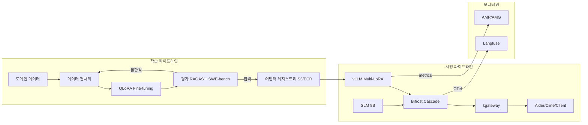
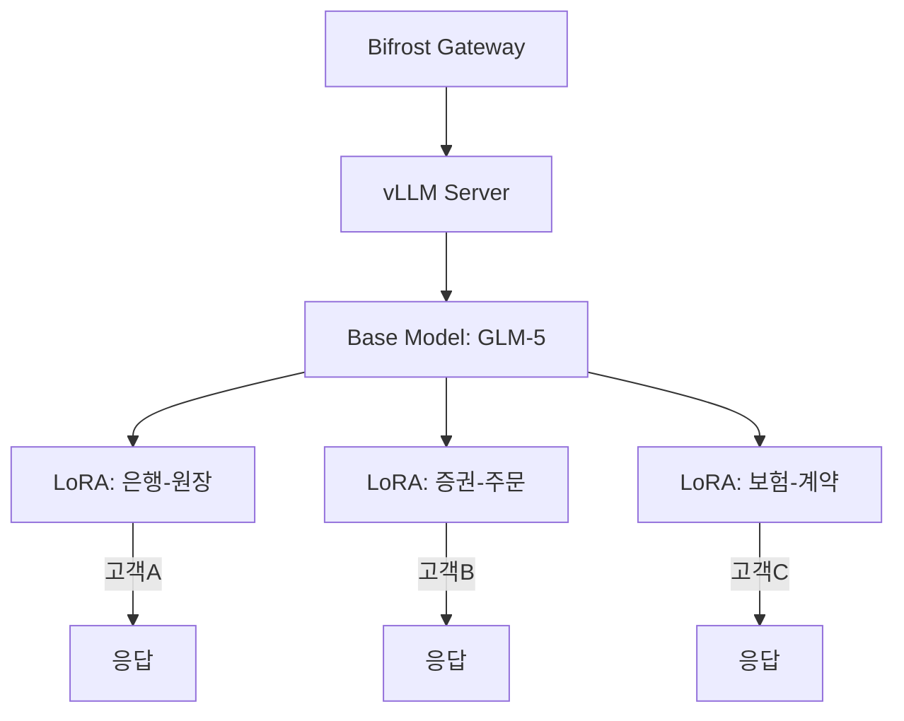
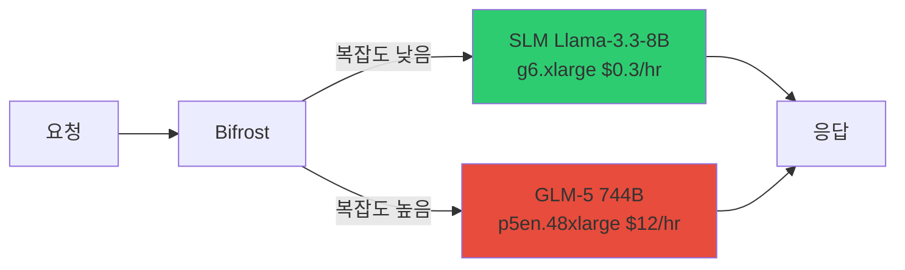
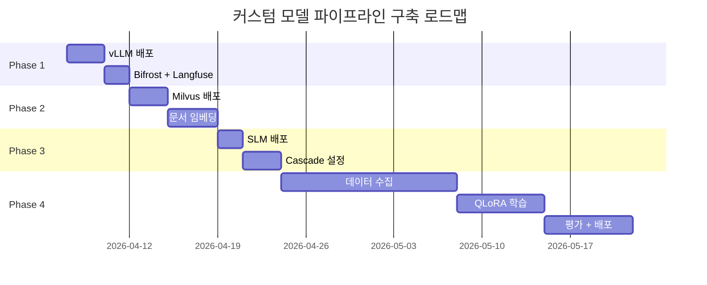

# 커스텀 모델 파이프라인 구축 가이드

## 1. 개요

### 왜 커스텀 모델 파이프라인이 필요한가

SaaS 기반 AI 코딩 도구(예: Kiro, GitHub Copilot)는 빠르게 시작할 수 있지만, 엔터프라이즈 환경에서는 근본적인 한계에 부딪힙니다.

| 제약 | SaaS (Kiro 등) | 자체 호스팅 파이프라인 |
|------|----------------|---------------------|
| **LoRA Fine-tuning** | 불가능 | 도메인별 어댑터 학습 가능 |
| **데이터 주권** | 코드가 외부 전송 | VPC 내부에서 완결 |
| **모델 선택** | 제공 모델만 사용 | 오픈소스 모델 자유 선택 |
| **비용 제어** | 토큰 단가 고정 | SLM Cascade로 66% 절감 가능 |
| **고객별 최적화** | 범용 모델 공유 | Multi-LoRA로 고객별 특화 |

:::info 핵심 전략
**Base Model + LoRA 어댑터** 패턴으로 하나의 GPU 위에 여러 도메인 전문 모델을 동시에 서빙합니다. 기본 모델 가중치를 공유하므로 GPU 메모리 효율이 극대화됩니다.
:::

### 파이프라인 전체 흐름



학습 파이프라인에서 도메인 데이터를 QLoRA로 학습하고, 평가를 통과한 어댑터만 레지스트리에 등록합니다. 서빙 파이프라인에서는 vLLM Multi-LoRA로 여러 어댑터를 동시에 로드하고, Bifrost Cascade를 통해 SLM/LLM 간 비용 최적화 라우팅을 수행합니다.

:::tip 관련 문서
- [운영 & 거버넌스](../operations-mlops/index.md) - 전체 운영 아키텍처
- [커스텀 모델 배포 가이드](./custom-model-deployment.md) - Kiro vs 자체 호스팅 비교 포함
:::

---

## 2. LoRA 학습·배포 파이프라인 (도메인 특화)

이 섹션은 도메인 특화 전략에서 LoRA Fine-tuning과 Multi-LoRA 핫스왑 배포를 실제로 구현하는 방법을 다룹니다. 도메인 특화의 전략적 배경과 의사결정 기준은 [도메인 특화 (LoRA + RAG)](../operations-mlops/domain-customization.md)를 참조하세요.

---

## 2-1. LoRA Fine-tuning 파이프라인

### 2-1-1. QLoRA GPU 절감

**QLoRA**(Quantized LoRA)는 기본 모델을 INT4로 양자화한 상태에서 LoRA 어댑터만 학습하는 기법입니다. Full Fine-tuning 대비 GPU 요구사항을 극적으로 줄여줍니다.

| 모델 | Full Fine-tuning | LoRA | QLoRA |
|------|-----------------|------|-------|
| **Llama-3.3-70B** | H100x32 (비현실적) | H100x8 | **H100x4** |
| **VRAM** | 280 GB | 80 GB | **40 GB** |
| **학습 시간** | - | 5일 | **2-3일** |
| **비용** | - | $8,000 | **$2,000** |

:::warning INT4 양자화 정밀도
QLoRA는 학습 중 기본 모델 가중치를 INT4로 유지하므로, 극히 정밀한 수치 연산이 필요한 태스크(예: 금융 계산)에서는 LoRA(FP16) 대비 미세한 정확도 차이가 발생할 수 있습니다. 도메인 평가 단계에서 반드시 검증하세요.
:::

### 2-1-2. 학습 데이터 형식

학습 데이터는 JSONL 형식의 입력-출력 쌍으로 준비합니다.

```json
{
  "input": "COBOL: PERFORM CALC-INTEREST USING WS-PRINCIPAL WS-RATE.",
  "output": "Java: @Transactional public BigDecimal calcInterest(BigDecimal principal, BigDecimal rate) { return principal.multiply(rate).setScale(2, RoundingMode.HALF_UP); }"
}
```

**데이터 수집 전략:**

| 소스 | 변환 방법 | 예상 데이터량 |
|------|----------|-------------|
| 레거시 COBOL 코드 | COBOL → Java 변환 쌍 생성 | 10,000+ 모듈 |
| 사내 프레임워크 | 프레임워크 패턴 → 코드 쌍 | 5,000+ 패턴 |
| 코드 리뷰 히스토리 | 수정 전 → 수정 후 쌍 | 20,000+ 커밋 |
| 기술 문서 | 문서 → 구현 코드 쌍 | 3,000+ 페이지 |

:::tip 데이터 품질이 모델 품질을 결정합니다
데이터 양보다 **품질**이 중요합니다. 시니어 개발자가 검수한 1,000개의 고품질 쌍이, 자동 생성된 10,000개보다 효과적입니다. 최소 500개의 검수된 쌍에서 시작하세요.
:::

### 2-1-3. 학습 프레임워크

#### NeMo Framework (NVIDIA)

대규모 모델 학습에 최적화된 NVIDIA의 공식 프레임워크입니다. Multi-GPU, Multi-Node 분산 학습을 네이티브로 지원합니다.

```bash
python train_lora.py \
  --config-path=conf \
  --config-name=llama3_70b_lora \
  model.data.train_ds.file_path=cobol_to_java.jsonl \
  model.peft.lora_tuning.adapter_dim=16
```

:::info NeMo 설정 핵심 파라미터
- `adapter_dim` (rank): 16이 일반적. 복잡한 도메인은 32~64까지 증가 가능
- `adapter_dropout`: 0.05 권장 (과적합 방지)
- `target_modules`: attention layer (`q_proj`, `k_proj`, `v_proj`, `o_proj`)
:::

#### Unsloth (2배 빠른 학습)

단일 노드에서 LoRA/QLoRA 학습 속도를 2배 이상 높여주는 오픈소스 라이브러리입니다. 메모리 사용량도 50%까지 절감합니다.

```python
from unsloth import FastLanguageModel

model, tokenizer = FastLanguageModel.from_pretrained(
    model_name="meta-llama/Llama-3.3-70B-Instruct",
    max_seq_length=4096,
    load_in_4bit=True,  # QLoRA: INT4 양자화
)

model = FastLanguageModel.get_peft_model(
    model,
    r=16,                # LoRA rank
    lora_alpha=32,       # LoRA scaling factor
    target_modules=["q_proj", "k_proj", "v_proj"],
)

trainer = SFTTrainer(
    model=model,
    train_dataset=dataset,
    max_seq_length=4096,
)
trainer.train()
```

| 프레임워크 | 장점 | 적합한 경우 |
|-----------|------|-----------|
| **NeMo** | Multi-Node 분산 학습, NVIDIA 공식 지원 | H100 클러스터 보유 시, 대규모 학습 |
| **Unsloth** | 2배 빠른 학습, 메모리 절감, 간편한 API | 단일 노드, 빠른 프로토타이핑 |

### 2-1-4. 체크포인트 관리

학습된 LoRA 어댑터는 S3에 저장하고, MLflow로 버전을 관리합니다.

```bash
# 어댑터 저장 구조
s3://model-registry/
  └── lora-adapters/
      ├── bank-ledger/
      │   ├── v1.0/adapter_model.safetensors
      │   ├── v1.1/adapter_model.safetensors
      │   └── latest -> v1.1
      ├── stock-order/
      │   └── v1.0/adapter_model.safetensors
      └── insurance-contract/
          └── v1.0/adapter_model.safetensors
```

:::tip MLflow 연동
MLflow에 학습 메트릭(loss, accuracy)과 어댑터 경로를 함께 기록하면, 어떤 데이터셋과 하이퍼파라미터 조합이 최적인지 추적할 수 있습니다.
:::

- 참조: [NeMo Framework 체크포인트 관리](../model-serving/inference-frameworks/nemo-framework.md)

---

## 2-2. Multi-LoRA 핫스왑 배포

### 2-2-1. 아키텍처

vLLM의 Multi-LoRA 기능을 활용하면, 하나의 기본 모델 위에 여러 LoRA 어댑터를 동시에 로드하여 고객별 맞춤 서빙이 가능합니다.



:::info Multi-LoRA 메모리 효율
기본 모델(예: 70B)은 한 번만 GPU 메모리에 로드됩니다. 각 LoRA 어댑터는 rank 16 기준 약 **100-200MB** 수준으로, 10개의 어댑터를 동시에 로드해도 추가 메모리는 2GB 미만입니다.
:::

### 2-2-2. vLLM Multi-LoRA 설정

```bash
vllm serve meta-llama/Llama-3.3-70B-Instruct \
  --enable-lora \
  --lora-modules \
    bank-ledger=/models/lora/bank \
    stock-order=/models/lora/stock \
    insurance-contract=/models/lora/insurance \
  --max-lora-rank 16
```

**주요 옵션:**

| 옵션 | 설명 | 기본값 |
|------|------|--------|
| `--enable-lora` | Multi-LoRA 활성화 | `false` |
| `--lora-modules` | `이름=경로` 형태로 어댑터 등록 | - |
| `--max-lora-rank` | 최대 LoRA rank | 16 |
| `--max-loras` | 동시 로드 가능한 최대 어댑터 수 | 1 |
| `--max-cpu-loras` | CPU 메모리에 캐시할 어댑터 수 | - |

:::caution 핫스왑 주의사항
vLLM은 요청 시점에 어댑터를 GPU 메모리로 로드합니다. `--max-loras`보다 많은 어댑터를 사용하면 **스왑 레이턴시**(수백ms)가 발생합니다. 자주 사용하는 어댑터 수에 맞게 `--max-loras`를 설정하세요.
:::

### 2-2-3. 요청 시 어댑터 지정

OpenAI 호환 API로 요청하며, `extra_body`에 LoRA 이름을 지정합니다.

```python
response = client.chat.completions.create(
    model="meta-llama/Llama-3.3-70B-Instruct",
    messages=[{"role": "user", "content": "COBOL 원장 코드를 Java로 변환해줘"}],
    extra_body={"lora_name": "bank-ledger"}
)
```

### 2-2-4. 고객별 라우팅 (Bifrost + X-Customer-Domain 헤더)

kgateway의 HTTPRoute를 사용하여 HTTP 헤더 기반으로 고객별 LoRA 어댑터를 라우팅합니다.

```yaml
# kgateway HTTPRoute - 고객별 LoRA 라우팅
apiVersion: gateway.networking.k8s.io/v1
kind: HTTPRoute
metadata:
  name: lora-routing
spec:
  rules:
  - matches:
    - headers:
      - name: X-Customer-Domain
        value: bank
    backendRefs:
    - name: vllm-svc
      port: 8000
```

:::tip 라우팅 흐름
클라이언트(Aider/Cline) → `X-Customer-Domain: bank` 헤더 설정 → kgateway → Bifrost → vLLM (`lora_name=bank-ledger` 자동 매핑)
:::

### 2-2-5. 고객별 추론 추적 및 비용 청구

각 고객의 추론 요청을 LLM 트레이싱 시스템으로 추적하여 LoRA 어댑터별 성능을 모니터링하고 월별 비용을 청구합니다.

```python
from langfuse import Langfuse

langfuse = Langfuse()

trace = langfuse.trace(
    name="inference",
    user_id="customer-bank-A",
    metadata={
        "lora": "bank-ledger",
        "model": "glm-5-32b",
        "domain": "ledger"
    }
)
```

**월별 비용 청구 예시:**

| 고객 | 요청 수 | 토큰 수 | GPU 시간 | 비용 |
|------|---------|---------|----------|------|
| **A은행** | 100,000 | 500M | 50시간 | $2,500 |
| **B증권** | 50,000 | 250M | 25시간 | $1,250 |
| **C보험** | 30,000 | 150M | 15시간 | $750 |

구현 방법은 [Agent 모니터링](../operations-mlops/agent-monitoring.md) 및 [LLM 트레이싱 배포](./monitoring-observability-setup.md)를 참조하세요.

---

## 3. SLM Cascade Routing (비용 최적화)

### 3.1 Cascade 아키텍처

모든 요청을 대형 모델(LLM)로 보내는 것은 비용 낭비입니다. 요청의 70%는 소형 모델(SLM)로도 충분히 처리 가능합니다.



### 3.2 비용 분석

| | SLM 단독 | LLM 단독 | **Cascade (70:30)** |
|---|---|---|---|
| **월 비용** | $500 | $8,900 | **$3,020** |
| **정확도** | 70% | 95% | **92%** |
| **비용 절감** | - | - | **66%** |

:::tip ROI 계산
Cascade 도입 시 월 $5,880 절감 (연간 $70,560). 설정에 소요되는 시간은 1-2일 수준이므로, **즉시 도입할 가치**가 있습니다.
:::

### 3.3 Bifrost Cascade Config

```json
{
  "providers": {
    "openai": {
      "keys": [
        {
          "name": "slm",
          "value": "dummy",
          "weight": 0.7,
          "models": ["llama-8b"]
        },
        {
          "name": "llm",
          "value": "dummy",
          "weight": 0.3,
          "models": ["glm5"]
        }
      ],
      "network_config": {
        "base_url": "http://glm5-serving:8000"
      }
    }
  }
}
```

:::caution Bifrost Cascade 한계
Bifrost의 현재 cascade routing은 **provider 단위**로 동작하며, 요청 복잡도 기반 자동 라우팅은 미지원입니다. 단순 weight 기반 분배 또는 fallback 조건(5xx, latency 초과)으로 동작합니다. 복잡도 기반 라우팅은 llm-d 또는 커스텀 로직으로 구현해야 합니다.
:::

### 3.4 SLM 배포 YAML

```yaml
apiVersion: apps/v1
kind: Deployment
metadata:
  name: vllm-slm
  namespace: agentic-serving
spec:
  replicas: 1
  selector:
    matchLabels:
      app: vllm-slm
  template:
    metadata:
      labels:
        app: vllm-slm
    spec:
      nodeSelector:
        node.kubernetes.io/instance-type: g6.xlarge
      containers:
      - name: vllm
        image: vllm/vllm-openai:latest
        command: ["vllm", "serve"]
        args:
          - "meta-llama/Llama-3.3-8B-Instruct"
          - "--served-model-name=llama-8b"
          - "--tensor-parallel-size=1"
          - "--max-model-len=32768"
          - "--host=0.0.0.0"
          - "--port=8000"
        resources:
          limits:
            nvidia.com/gpu: 1
        ports:
        - containerPort: 8000
          name: http
      tolerations:
      - key: nvidia.com/gpu
        operator: Exists
        effect: NoSchedule
---
apiVersion: v1
kind: Service
metadata:
  name: vllm-slm-svc
  namespace: agentic-serving
spec:
  selector:
    app: vllm-slm
  ports:
  - port: 8000
    targetPort: 8000
    protocol: TCP
```

:::info g6.xlarge 인스턴스 스펙
- GPU: NVIDIA L4 1개 (24GB VRAM)
- 비용: ~$0.31/hr (On-Demand), ~$0.09/hr (Spot)
- 8B 모델 서빙에 충분한 사양
:::

- 참조: [비용 Threshold 분석](./custom-model-deployment.md#비용-threshold-분석)

---

## 4. 평가 파이프라인

### 4.1 LoRA 어댑터 평가 매트릭스

학습된 어댑터는 배포 전 반드시 다중 평가를 통과해야 합니다.

| 평가 방법 | 목적 | 도구 | 자동화 |
|----------|------|------|--------|
| **RAGAS** | RAG 정확도 (faithfulness, relevancy) | ragas | CI/CD 통합 |
| **SWE-bench** | 코딩 퀄리티 (실제 이슈 해결력) | swe-bench | CI/CD 통합 |
| **도메인 전문가 리뷰** | 비즈니스 정합성 검증 | Langfuse Annotation | 수동 |
| **Red-teaming** | 보안/안전성 (prompt injection 등) | Garak | CI/CD 통합 |

:::warning 평가 기준선 (Threshold)
어댑터 배포를 위한 최소 기준:
- RAGAS Faithfulness: >= 0.85
- SWE-bench Resolved: >= 30%
- 도메인 전문가 승인: 3명 중 2명 이상
- Garak 보안 테스트: 0 critical findings
:::

### 4.2 LoRA A/B 테스트

새로운 어댑터 버전을 배포하기 전, LLM 트레이싱 시스템의 태그 기능을 활용한 A/B 테스트로 성능을 비교합니다. 요청 메타데이터에 `lora` 버전을 태그로 기록하면 대시보드에서 어댑터별 성능을 비교할 수 있습니다.

구현 예시는 [Agent 모니터링 - A/B 테스트](../operations-mlops/agent-monitoring.md)를 참조하세요.

**A/B 테스트 비교 항목:**

| 메트릭 | 측정 방법 | 의미 |
|--------|----------|------|
| 정확도 | SWE-bench / 도메인 테스트 | 코드 변환 정확성 |
| 레이턴시 | LLM 트레이싱 p50/p95 | 응답 속도 |
| 토큰 효율 | output_tokens / input_tokens | 답변 간결성 |
| 사용자 만족도 | Annotation Score | 실제 사용자 평가 |

- 참조: [RAGAS 평가 프레임워크](../operations-mlops/ragas-evaluation.md)
- 참조: [LLMOps Observability 평가 파이프라인](../operations-mlops/llmops-observability.md)

---

## 5. Phase별 구축 로드맵

| Phase | 기간 | 구성 | 비용 (USD) | 주요 액션 |
|-------|------|------|-----------|----------|
| **1** | 즉시 | Base Model + Steering | $8,900/월 (GPU) | vLLM 배포, Bifrost + Langfuse 연동 |
| **2** | 1-2주 | + VectorRAG | +인프라 | Milvus 배포, 내부 문서 임베딩 |
| **3** | 2-4주 | + SLM Cascade | +$500/월 | SLM 배포, Bifrost cascade 설정 |
| **4** | 1-2개월 | + LoRA Fine-tuning | +$2K (1회) | 학습 데이터 수집 → QLoRA → 평가 → Multi-LoRA 배포 |



:::tip 투자 대비 효과 (ROI)
Phase 4까지 완료 시:
- **COBOL→Java 전환**: 10,000 모듈 x 1.5시간 절감 = **15,000시간 절감** (~$750K)
- **LoRA 학습 비용**: $2,000 (1회)
- **월 운영 비용 절감**: $5,880 (Cascade 도입 효과)
- **ROI: 375배**
:::

---

## 참고 자료

| 자료 | 링크 |
|------|------|
| LoRA Paper (Hu et al., 2021) | [arxiv.org/abs/2106.09685](https://arxiv.org/abs/2106.09685) |
| QLoRA Paper (Dettmers et al., 2023) | [arxiv.org/abs/2305.14314](https://arxiv.org/abs/2305.14314) |
| vLLM Multi-LoRA | [docs.vllm.ai/en/latest/models/lora.html](https://docs.vllm.ai/en/latest/models/lora.html) |
| Unsloth Fast Training | [github.com/unslothai/unsloth](https://github.com/unslothai/unsloth) |
| NeMo Framework | [docs.nvidia.com/nemo-framework](https://docs.nvidia.com/nemo-framework/user-guide/latest/) |
| RAGAS Evaluation | [docs.ragas.io](https://docs.ragas.io/) |
| Bifrost AI Gateway | [docs.getbifrost.ai](https://docs.getbifrost.ai/) |
| Agent 모니터링 | [agent-monitoring.md](../operations-mlops/agent-monitoring.md) |
| LLM 트레이싱 배포 | [monitoring-observability-setup.md](./monitoring-observability-setup.md) |
| 커스텀 모델 배포 가이드 | [custom-model-deployment.md](./custom-model-deployment.md) |
