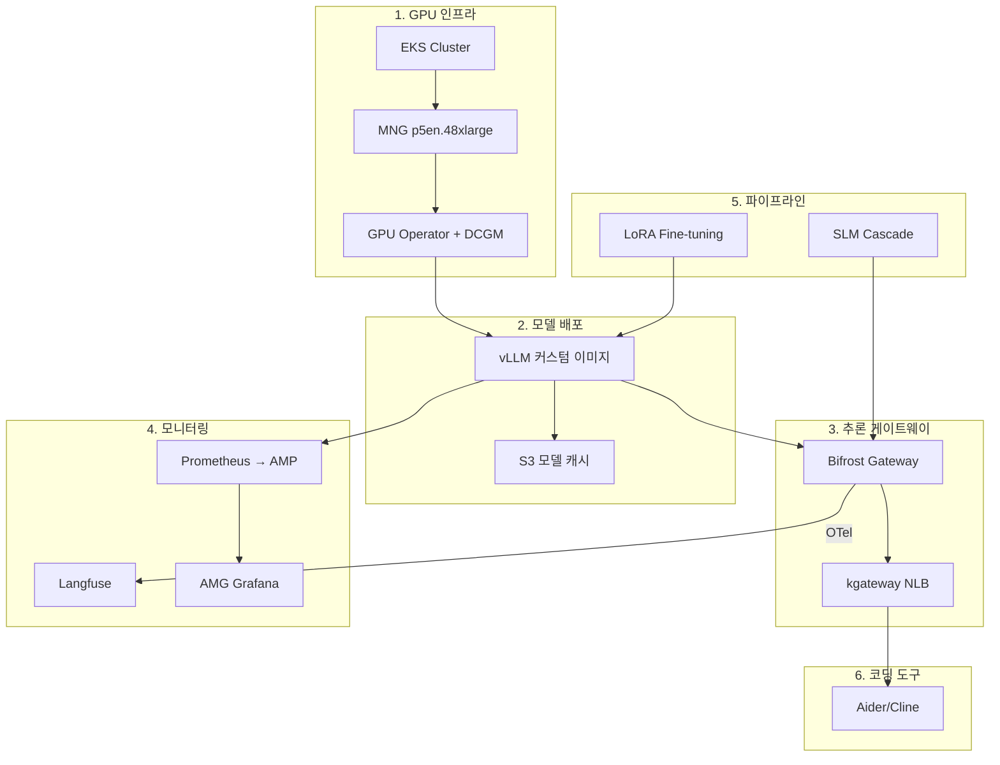
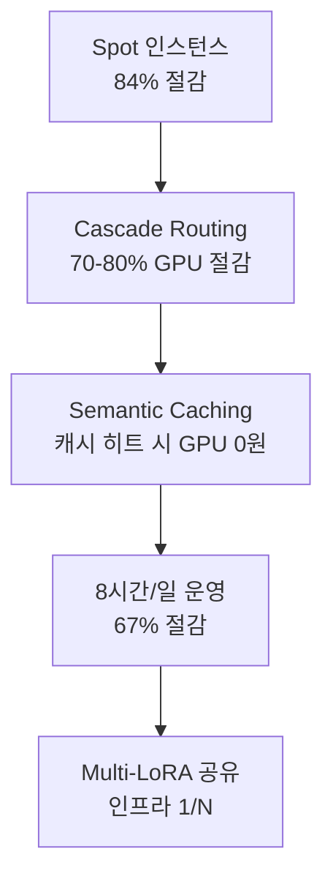

import DocCardList from '@theme/DocCardList';

# Reference Architecture

이 섹션은 Agentic AI Platform의 **실전 배포 및 구성 가이드**를 제공합니다. 개념과 설계 원칙은 [Documentation 섹션](../design-architecture/agentic-platform-architecture.md)에서 다루며, 이곳에서는 실제 클러스터에 배포하고 운영하기 위한 구체적인 설정, YAML 매니페스트, 검증 절차를 다룹니다.

:::info Documentation vs Reference Architecture
| 구분 | Documentation | Reference Architecture |
|------|--------------|----------------------|
| **초점** | 아키텍처 개념, 설계 원칙, 기술 비교 | 실전 배포 절차, 매니페스트, 검증 |
| **독자** | 의사결정자, 아키텍트 | 플랫폼 엔지니어, DevOps |
| **산출물** | 아키텍처 문서, 의사결정 기록 | 배포 가능한 YAML, 스크립트, 체크리스트 |
| **업데이트 주기** | 설계 변경 시 | 배포/운영 경험 축적 시 |
:::

## 전체 아키텍처 개요

아래 다이어그램은 Reference Architecture의 6개 영역과 배포 순서를 보여줍니다.

## 배포 순서

Reference Architecture는 아래 순서대로 구성합니다. 각 단계는 이전 단계의 산출물에 의존하므로 **순서를 지켜야** 합니다.

### Phase 1: GPU 인프라 구성

EKS 클러스터와 GPU 노드 그룹을 구성합니다. Auto Mode와 Standard Mode의 차이, GPU Operator 설치 시 주의사항을 포함합니다.

| 항목 | 세부사항 |
|------|---------|
| EKS 버전 | 1.32+ (권장 1.33) |
| 노드 그룹 | MNG p5en.48xlarge (Spot) |
| GPU Operator | `devicePlugin.enabled=false` (Auto Mode 충돌 방지) |
| 모니터링 에이전트 | DCGM Exporter, GFD, Node Status Exporter |

### Phase 2: 모델 배포

대형 오픈소스 모델을 vLLM으로 서빙합니다. 커스텀 이미지 빌드, S3 모델 캐시, 멀티노드 배포 시 주의사항을 다룹니다.

| 항목 | 세부사항 |
|------|---------|
| 서빙 엔진 | vLLM (커스텀 이미지) |
| 모델 캐시 | S3 → s5cmd → NVMe emptyDir |
| 병렬화 | Tensor Parallelism (단일 노드 권장) |
| 검증 | OpenAI-compatible API 엔드포인트 |

### Phase 3: 추론 게이트웨이

Bifrost + kgateway 기반 추론 게이트웨이를 구성합니다. Cascade Routing, Semantic Caching, Guardrails를 포함합니다.

| 항목 | 세부사항 |
|------|---------|
| L7 게이트웨이 | kgateway (Gateway API) |
| AI 게이트웨이 | Bifrost (LLM 라우팅, 캐싱, guardrails) |
| 로드밸런서 | NLB (TCP/TLS) |
| 라우팅 전략 | Cascade (SLM → LLM), 모델별 가중치 |

### Phase 4: 모니터링 및 Observability

Prometheus + AMP + AMG + Langfuse 기반 모니터링 스택을 구성합니다.

| 항목 | 세부사항 |
|------|---------|
| 메트릭 수집 | Prometheus → AMP (Pod Identity 인증) |
| 대시보드 | AMG Grafana (SigV4 `ec2_iam_role`) |
| LLM Observability | Langfuse (OTel traces, 비용 추적) |
| GPU 메트릭 | DCGM Exporter (GPU 사용률, VRAM, 온도) |

### Phase 5: 파이프라인

LoRA Fine-tuning 및 Cascade Routing 파이프라인을 구성합니다.

| 항목 | 세부사항 |
|------|---------|
| Fine-tuning | LoRA 어댑터 학습 → S3 저장 → vLLM 핫로드 |
| Cascade Routing | SLM (8B) → LLM (744B) 비용 최적화 |
| 평가 | Ragas + 커스텀 벤치마크 |

### Phase 6: 코딩 도구 연동

Aider, Cline 등 AI 코딩 도구를 자체 호스팅 모델에 연결합니다.

| 항목 | 세부사항 |
|------|---------|
| 코딩 도구 | Aider, Cline, Continue.dev |
| 프로토콜 | OpenAI-compatible API |
| 연결 경로 | 코딩 도구 → NLB → kgateway → Bifrost → vLLM |
| 모니터링 | Bifrost OTel → Langfuse (요청별 추적) |

## 문서 목록

<DocCardList />

## 핵심 설계 원칙

Reference Architecture는 다음 원칙을 따릅니다.

### 1. 단일 노드 우선 (Single-Node First)

멀티노드 분산은 복잡도와 장애 가능성을 크게 높입니다. VRAM이 충분한 인스턴스(p5en, p6)를 선택하여 **단일 노드에서 Tensor Parallelism만으로 서빙**하는 것을 최우선으로 합니다.

### 2. Spot 인스턴스 활용

GPU Spot 인스턴스는 On-Demand 대비 80-85% 저렴합니다. 추론 워크로드는 상태가 없으므로 Spot 회수 시 새 인스턴스에서 즉시 재시작할 수 있습니다. 모델 가중치는 S3에서 빠르게 복원합니다.

### 3. 표준 도구 체인

가능한 한 CNCF 및 Kubernetes 생태계의 표준 도구를 사용합니다.

| 영역 | 표준 도구 | 대안 |
|------|----------|------|
| GPU 스케줄링 | Karpenter / MNG | Auto Mode NodePool |
| 모델 서빙 | vLLM | SGLang, llm-d |
| AI 게이트웨이 | Bifrost | LiteLLM, OpenClaw |
| 메트릭 | Prometheus + AMP | CloudWatch |
| LLM Observability | Langfuse | Helicone, LangSmith |
| 분산 학습 | LeaderWorkerSet (LWS) | KubeRay |

### 4. 비용 최적화 계층화

비용 최적화는 단일 기법이 아닌 **계층적 접근**을 사용합니다.

## 사전 요구사항

Reference Architecture를 배포하기 위한 사전 요구사항입니다.

### AWS 계정 및 권한

- EKS 클러스터 생성 권한 (IAM, VPC, EC2, EKS)
- GPU 인스턴스 Spot 할당량 (p5en.48xlarge: vCPU 192개 이상)
- S3 버킷 생성 권한
- AMP/AMG 생성 권한 (모니터링 구성 시)
- ECR 레지스트리 생성 권한 (커스텀 이미지 빌드 시)

### 도구

| 도구 | 최소 버전 | 용도 |
|------|----------|------|
| `eksctl` | 0.200+ | EKS 클러스터 관리 |
| `kubectl` | 1.32+ | Kubernetes 리소스 관리 |
| `helm` | 3.16+ | 차트 배포 |
| `aws` CLI | 2.22+ | AWS 리소스 관리 |
| `docker` | 27+ | 커스텀 이미지 빌드 |
| `s5cmd` | 2.2+ | 고속 S3 동기화 |

### 네트워크

- 퍼블릭 서브넷: NLB 배포용 (코딩 도구 외부 접근 시)
- 프라이빗 서브넷: GPU 노드, vLLM, Bifrost 배포용
- NAT Gateway: S3, ECR, HuggingFace Hub 접근용
- VPC 엔드포인트 (권장): S3, ECR, AMP

## 다음 단계

개념과 아키텍처 설계에 대해서는 다음 문서를 참조하세요:

- [Agentic AI Platform 아키텍처](../design-architecture/agentic-platform-architecture.md) — 전체 설계 원칙과 컴포넌트 구조
- [GPU 리소스 관리](../model-serving/gpu-resource-management.md) — Karpenter, KEDA, DRA 기반 GPU 오토스케일링
- [vLLM 모델 서빙](../model-serving/vllm-model-serving.md) — vLLM 아키텍처와 최적화 기법
- [Inference Gateway 라우팅](../gateway-agents/inference-gateway-routing.md) — kgateway + AI 게이트웨이 설계

---

:::tip 피드백
이 Reference Architecture는 실전 배포 경험을 바탕으로 지속적으로 업데이트됩니다. 개선 제안이나 추가 사례가 있다면 이슈로 남겨주세요.
:::
