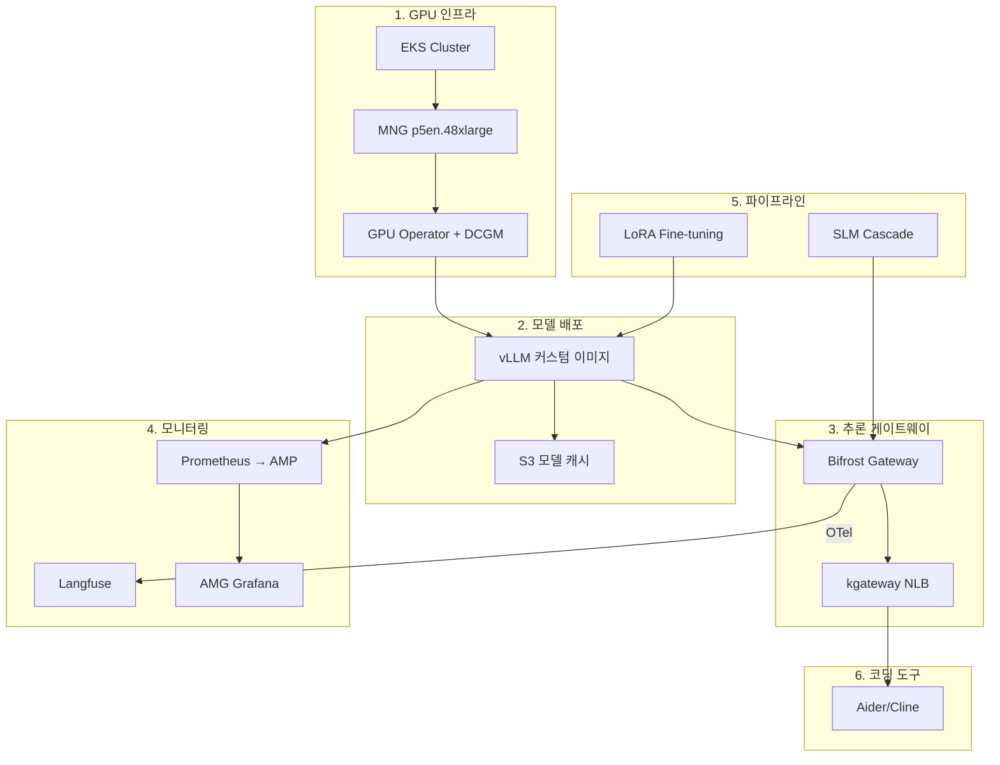
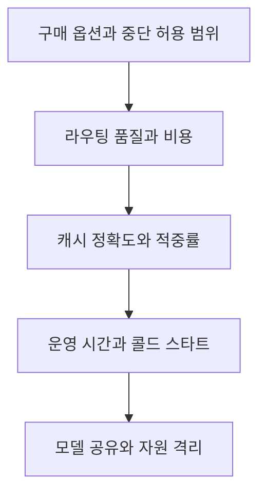

import DocCardList from '@theme/DocCardList';
import Figure from '@site/src/components/Figure';

Agentic AI Platform을 배포하고 운영하는 플랫폼 엔지니어를 위한 구현 가이드입니다. 필요한 영역의 문서를 먼저 선택한 뒤, 환경별 요구사항과 검증 절차를 확인하세요. 설계 결정의 배경은 [플랫폼 아키텍처](../design-architecture/foundations/agentic-platform-architecture.md)에서 다룹니다.

:::info Documentation vs Reference Architecture
| 구분 | Documentation | Reference Architecture |
|------|--------------|----------------------|
| **초점** | 아키텍처 개념, 설계 원칙, 기술 비교 | 실전 배포 절차, 매니페스트, 검증 |
| **독자** | 의사결정자, 아키텍트 | 플랫폼 엔지니어, DevOps |
| **산출물** | 아키텍처 문서, 의사결정 기록 | 배포 가능한 YAML, 스크립트, 체크리스트 |
| **업데이트 주기** | 설계 변경 시 | 배포/운영 경험 축적 시 |
:::

## 문서 목록

<DocCardList />

## 사전 요구사항

Reference Architecture를 배포하기 위한 사전 요구사항입니다.

### AWS 계정 및 권한

- EKS 클러스터 생성 권한 (IAM, VPC, EC2, EKS)
- GPU 인스턴스 Spot 할당량 (p5en.48xlarge: vCPU 192개 이상)
- S3 버킷 생성 권한
- AMP/AMG 생성 권한 (모니터링 구성 시)
- ECR 레지스트리 생성 권한 (커스텀 이미지 빌드 시)

### 도구

배포 문서에 지정된 도구 버전과 클러스터 호환성을 확인합니다. 설치된 버전은 검증 기록에 남깁니다.

| 도구 | 용도 |
|------|------|
| `eksctl`, `aws` CLI | 클러스터 및 AWS 리소스 관리 |
| `kubectl`, `helm` | Kubernetes 리소스와 차트 관리 |
| 컨테이너 빌드 도구 | 커스텀 이미지 빌드 |
| `s5cmd` | 예제에서 사용하는 S3 모델 파일 전송 |

### 네트워크

- 퍼블릭 서브넷: NLB 배포용 (코딩 도구 외부 접근 시)
- 프라이빗 서브넷: GPU 노드, vLLM, Bifrost 배포용
- NAT Gateway: S3, ECR, HuggingFace Hub 접근용
- VPC 엔드포인트 (권장): S3, ECR, AMP

## 플랫폼 아키텍처

플랫폼의 6개 런타임 레이어와 3개 공통 플레인, Knowledge Feature Store, 모델 서빙·파인튜닝 경로를 보여줍니다. 아래 배포 순서의 6개 영역은 구현 단계이며, 런타임 레이어 번호와 대응하지 않습니다.

<Figure title="플랫폼 전체 구조" description="요청 처리 경로와 공통 제어 영역을 보여주는 원본 아키텍처 그림입니다. 큰 화면에서 세부 연결을 확인하려면 아래 원본 링크를 사용하세요." source={<a href="https://app.diagrams.net/?src=about#Uhttps%3A%2F%2Fraw.githubusercontent.com%2Fdevfloor9%2Fengineering-playbook%2Fmain%2Fstatic%2FAgentic%2520AI%2520Platform(with%2520Ontology%2520and%2520fine%2520tunning%2520feature).drawio">원본 그림 열기</a>}>
<iframe
  src="https://viewer.diagrams.net/?highlight=0000ff&nav=1&title=Agentic%20AI%20Platform&url=https%3A%2F%2Fraw.githubusercontent.com%2Fdevfloor9%2Fengineering-playbook%2Fmain%2Fstatic%2FAgentic%2520AI%2520Platform(with%2520Ontology%2520and%2520fine%2520tunning%2520feature).drawio"
  width="100%"
  height="480"
  title="Agentic AI Platform Architecture"
  loading="lazy"
/>
</Figure>

:::tip draw.io에서 편집
[draw.io에서 열기](https://app.diagrams.net/?src=about#Uhttps%3A%2F%2Fraw.githubusercontent.com%2Fdevfloor9%2Fengineering-playbook%2Fmain%2Fstatic%2FAgentic%2520AI%2520Platform(with%2520Ontology%2520and%2520fine%2520tunning%2520feature).drawio) — 로그인 없이 바로 열람·편집할 수 있습니다. 편집 후 File → Save As로 사본을 저장합니다.
:::

---

## 전체 아키텍처 개요

아래 다이어그램은 Reference Architecture의 6개 영역과 배포 순서를 보여줍니다.

```mermaid
graph TB
    subgraph "1. GPU 인프라"
        EKS[EKS Cluster] --> MNG[MNG p5en.48xlarge]
        MNG --> GPU[GPU Operator + DCGM]
    end
    subgraph "2. 모델 배포"
        GPU --> VLLM[vLLM 커스텀 이미지]
        VLLM --> S3[S3 모델 캐시]
    end
    subgraph "3. 추론 게이트웨이"
        VLLM --> BF[Bifrost Gateway]
        BF --> KGW[kgateway NLB]
    end
    subgraph "4. 모니터링"
        VLLM --> PROM[Prometheus → AMP]
        BF -->|OTel| LF[Langfuse]
        PROM --> AMG[AMG Grafana]
    end
    subgraph "5. 파이프라인"
        LORA[LoRA Fine-tuning] --> VLLM
        SLM[SLM Cascade] --> BF
    end
    subgraph "6. 코딩 도구"
        KGW --> AIDER[Aider/Cline]
    end
```

## 배포 순서

Reference Architecture는 아래 순서대로 구성합니다. 각 단계는 이전 단계의 산출물에 의존하므로 **순서를 지켜야** 합니다.

### Phase 1: GPU 인프라 구성

EKS 클러스터와 GPU 노드 그룹을 구성합니다. Auto Mode와 Standard Mode의 차이, GPU Operator 설치 시 주의사항을 포함합니다.

| 항목 | 세부사항 |
|------|---------|
| EKS 버전 | 선택한 배포 가이드와 애드온이 지원하는 버전 |
| 노드 그룹 | 모델 메모리·SLO·용량을 확인한 MNG 또는 NodePool |
| GPU Operator | AMI에 사전 설치된 구성요소를 확인하고 중복 관리를 피함 |
| 모니터링 에이전트 | DCGM Exporter, GFD, Node Status Exporter |

### Phase 2: 모델 배포

대형 오픈소스 모델을 vLLM으로 서빙합니다. 커스텀 이미지 빌드, S3 모델 캐시, 멀티노드 배포 시 주의사항을 다룹니다.

| 항목 | 세부사항 |
|------|---------|
| 서빙 엔진 | vLLM (커스텀 이미지) |
| 모델 캐시 | S3 → s5cmd → NVMe emptyDir |
| 병렬화 | Tensor Parallelism (단일 노드 권장) |
| 검증 | OpenAI-compatible API 엔드포인트 |

### Phase 3: 추론 게이트웨이

kgateway + Bifrost/LiteLLM 기반 2-Tier 추론 게이트웨이를 구성합니다. Complexity-based Cascade Routing, Semantic Caching, Guardrails를 포함합니다.

| 항목 | 세부사항 |
|------|---------|
| L1 게이트웨이 | kgateway (Gateway API, mTLS, rate limiting) |
| L2-A 게이트웨이 | Bifrost (CEL Rules 조건부 라우팅, failover) 또는 LiteLLM (complexity-based routing 네이티브) |
| 로드밸런서 | NLB (TCP/TLS) |
| 라우팅 전략 | Complexity-based Cascade (SLM → LLM), Hybrid Routing, Fallback |

### Phase 4: 모니터링 및 Observability

Prometheus + AMP + AMG + Langfuse 기반 모니터링 스택을 구성합니다.

| 항목 | 세부사항 |
|------|---------|
| 메트릭 수집 | Prometheus → AMP (Pod Identity 인증) |
| 대시보드 | AMG Grafana (SigV4 `ec2_iam_role`) |
| LLM Observability | Langfuse (OTel traces, 비용 추적) |
| GPU 메트릭 | DCGM Exporter (GPU 사용률, VRAM, 온도) |

### Phase 5: 파이프라인

LoRA Fine-tuning 및 Cascade Routing 파이프라인을 구성합니다.

| 항목 | 세부사항 |
|------|---------|
| Fine-tuning | LoRA 어댑터 학습 → S3 저장 → vLLM 핫로드 |
| Cascade Routing | SLM (8B) → LLM (744B) 비용 최적화 |
| 평가 | Ragas + 커스텀 벤치마크 |

### Phase 6: 코딩 도구 연동

Aider, Cline 등 AI 코딩 도구를 자체 호스팅 모델에 연결합니다.

| 항목 | 세부사항 |
|------|---------|
| 코딩 도구 | Aider, Cline, Continue.dev |
| 프로토콜 | OpenAI-compatible API |
| 연결 경로 | 코딩 도구 → NLB → kgateway → Bifrost/LiteLLM → vLLM |
| 모니터링 | Bifrost/LiteLLM OTel → Langfuse (요청별 추적) |

## 설계 원칙 {#핵심-설계-원칙}

Reference Architecture는 다음 원칙을 따릅니다.

### 1. 단일 노드 우선 (Single-Node First)

멀티노드 분산은 복잡도와 장애 가능성을 크게 높입니다. VRAM이 충분한 인스턴스(p5en, p6)를 선택하여 **단일 노드에서 Tensor Parallelism만으로 서빙**하는 것을 최우선으로 합니다.

### 2. Spot 인스턴스 활용

Spot 사용 여부는 가격뿐 아니라 중단 시 서비스가 견딜 수 있는 시간을 기준으로 결정합니다. 추론 서버도 이미지·가중치 로드, 엔진 초기화, 진행 중인 요청 처리가 필요하므로 즉시 복구를 가정할 수 없습니다. 대체 용량, 준비된 복제본, 드레인·재시도 정책과 실제 콜드 스타트를 검증하세요. [EKS Compute and Autoscaling](https://docs.aws.amazon.com/eks/latest/best-practices/aiml-compute.html)의 실시간 워크로드 고려사항을 함께 확인합니다.

### 3. 표준 도구 체인

가능한 한 CNCF 및 Kubernetes 생태계의 표준 도구를 사용합니다.

| 영역 | 표준 도구 | 대안 |
|------|----------|------|
| GPU 스케줄링 | Karpenter / MNG | Auto Mode NodePool |
| 모델 서빙 | vLLM | SGLang, llm-d |
| AI 게이트웨이 | Bifrost / LiteLLM | OpenClaw, Helicone |
| 메트릭 | Prometheus + AMP | CloudWatch |
| LLM Observability | Langfuse | Helicone, LangSmith |
| 분산 학습 | LeaderWorkerSet (LWS) | KubeRay |

### 4. 비용 최적화 계층화

각 기법의 효과는 트래픽, 캐시 적중률, 품질 기준, 운영 시간에 따라 달라집니다. 절감률을 단순 합산하지 말고 성공 요청당 총비용과 SLO를 같은 조건에서 비교합니다.

```mermaid
graph TD
    accTitle: 비용 최적화 검토 순서
    accDescr: 구매 옵션, 라우팅, 캐시, 운영 시간, 모델 공유를 검토하고 각 변경의 비용과 품질을 측정한다.
    A[구매 옵션과 중단 허용 범위] --> B[라우팅 품질과 비용]
    B --> C[캐시 정확도와 적중률]
    C --> D[운영 시간과 콜드 스타트]
    D --> E[모델 공유와 자원 격리]
```

## 다음 단계

개념과 아키텍처 설계에 대해서는 다음 문서를 참조하세요:

- [Agentic AI Platform 아키텍처](../design-architecture/foundations/agentic-platform-architecture.md) — 전체 설계 원칙과 컴포넌트 구조
- [GPU 리소스 관리](../model-serving/gpu-infrastructure/gpu-resource-management.md) — Karpenter, KEDA, DRA 기반 GPU 오토스케일링
- [vLLM 모델 서빙](../model-serving/inference-frameworks/vllm-model-serving.md) — vLLM 아키텍처와 최적화 기법
- [Inference Gateway 라우팅 전략](../model-serving/inference-routing/routing-strategy.md) — 2-Tier 아키텍처와 Cascade/Semantic/Hybrid Routing 설계

---

:::tip 피드백
예제의 검증 환경과 실제 운영 환경은 다를 수 있습니다. 재현 조건과 검증 결과를 함께 기록하고, 수정이 필요한 내용은 이슈로 남겨주세요.
:::
