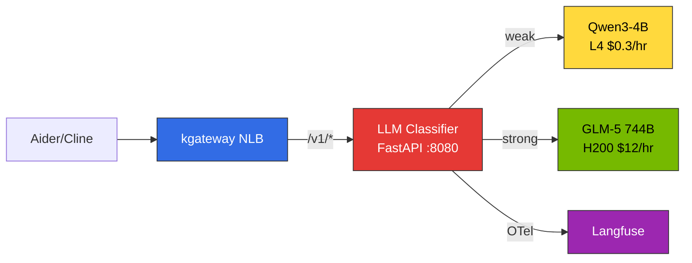
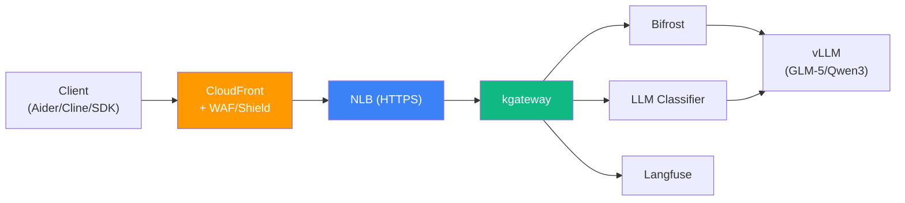
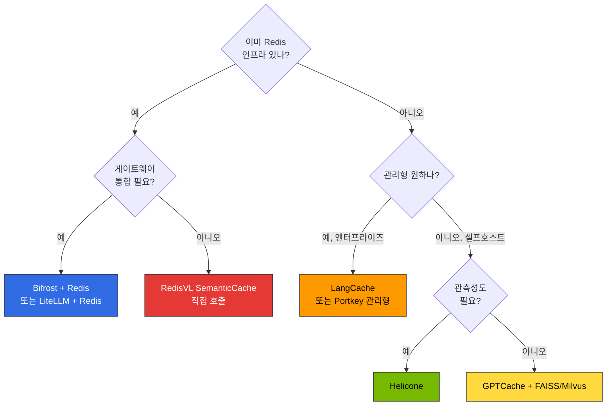

import { useColorMode } from '@docusaurus/theme-common';
import { useEffect, useRef } from 'react';

export const InferencePipelineDiagram = () => {
  const { colorMode } = useColorMode();
  const iframeRef = useRef(null);
  useEffect(() => {
    if (iframeRef.current && iframeRef.current.contentWindow) {
      iframeRef.current.contentWindow.postMessage(
        { type: 'theme-change', theme: colorMode },
        '*'
      );
    }
  }, [colorMode]);
  return (
    <iframe
      ref={iframeRef}
      src={`/engineering-playbook/agentic-platform-architecture.html?theme=${colorMode}`}
      style={{width: '100%', height: '1600px', border: 'none', borderRadius: '12px'}}
      title="프로덕션 추론 파이프라인 아키텍처"
      loading="lazy"
    />
  );
};

# 추론 게이트웨이 구성 가이드

이 문서는 kgateway + Bifrost 기반 추론 게이트웨이의 **실전 배포 절차**를 다룹니다. 아키텍처 개념과 라우팅 전략(Cascade, Semantic Router, 2-Tier 구조)은 [추론 게이트웨이 라우팅](./inference-gateway-routing.md)을 참조하세요.

## 프로덕션 추론 파이프라인 참조 아키텍처

EKS Auto Mode 기반 프로덕션 추론 파이프라인의 전체 요청 흐름입니다. CloudFront(WAF/Shield) → NLB → kgateway ExtProc가 프롬프트를 분석하여 LLM 라우팅을 결정하고, Bifrost 거버넌스 레이어와 llm-d KV Cache-aware 라우팅을 거쳐 최적의 모델에 요청을 전달합니다.

<InferencePipelineDiagram />

---

## 1. kgateway 설치 및 기본 리소스 구성

### 1.1 Gateway API CRD 설치

```bash
# Gateway API 표준 CRD 설치 (v1.2.0+)
kubectl apply -f https://github.com/kubernetes-sigs/gateway-api/releases/download/v1.2.0/standard-install.yaml

# 실험적 기능 포함 설치 (HTTPRoute 필터 등)
kubectl apply -f https://github.com/kubernetes-sigs/gateway-api/releases/download/v1.2.0/experimental-install.yaml
```

### 1.2 kgateway v2.2.2 Helm 설치

```bash
# Helm 저장소 추가
helm repo add kgateway oci://ghcr.io/kgateway-dev/charts
helm repo update

# 네임스페이스 생성
kubectl create namespace kgateway-system

# kgateway v2.2.2 설치
helm install kgateway kgateway/kgateway \
  --namespace kgateway-system \
  --version v2.2.2 \
  --set controller.replicaCount=2 \
  --set controller.resources.requests.cpu=500m \
  --set controller.resources.requests.memory=512Mi \
  --set controller.resources.limits.cpu=1000m \
  --set controller.resources.limits.memory=1Gi \
  --set metrics.enabled=true \
  --set metrics.port=9091
```

### 1.3 GatewayClass 정의

```yaml
apiVersion: gateway.networking.k8s.io/v1
kind: GatewayClass
metadata:
  name: kgateway
spec:
  controllerName: kgateway.dev/kgateway-controller
  description: "Kgateway for AI inference routing"
  parametersRef:
    group: kgateway.dev
    kind: GatewayClassConfig
    name: kgateway-config
---
apiVersion: kgateway.dev/v1alpha1
kind: GatewayClassConfig
metadata:
  name: kgateway-config
spec:
  proxy:
    replicas: 3
    resources:
      requests:
        cpu: "1"
        memory: "2Gi"
      limits:
        cpu: "2"
        memory: "4Gi"
  connectionSettings:
    maxConnections: 10000
    connectTimeout: 10s
    idleTimeout: 60s
```

### 1.4 Gateway 리소스 (단일 NLB 통합)

:::danger 프로덕션 환경 필수
아래는 개발/테스트용 기본 구성입니다. **프로덕션 환경에서는 반드시 [섹션 9: CloudFront + WAF/Shield](#cloudfront-waf)를 적용**하여 NLB를 직접 노출하지 마세요. 인증 없이 퍼블릭으로 SG를 오픈하면 회사 정책에 의해 자동 차단됩니다.
:::

```yaml
apiVersion: gateway.networking.k8s.io/v1
kind: Gateway
metadata:
  name: unified-gateway
  namespace: ai-gateway
  annotations:
    service.beta.kubernetes.io/aws-load-balancer-type: "external"
    service.beta.kubernetes.io/aws-load-balancer-nlb-target-type: "ip"
    service.beta.kubernetes.io/aws-load-balancer-scheme: "internet-facing"
spec:
  gatewayClassName: kgateway
  listeners:
    - name: http
      protocol: HTTP
      port: 80
      allowedRoutes:
        namespaces:
          from: All
```

### 1.5 ReferenceGrant (크로스 네임스페이스 접근)

HTTPRoute가 다른 네임스페이스의 Service를 참조하려면 ReferenceGrant가 필요합니다.

```yaml
# ai-inference 네임스페이스의 Service 접근 허용
apiVersion: gateway.networking.k8s.io/v1beta1
kind: ReferenceGrant
metadata:
  name: allow-gateway-to-services
  namespace: ai-inference
spec:
  from:
    - group: gateway.networking.k8s.io
      kind: HTTPRoute
      namespace: ai-gateway
  to:
    - group: ""
      kind: Service
---
# observability 네임스페이스의 Langfuse Service 접근 허용
apiVersion: gateway.networking.k8s.io/v1beta1
kind: ReferenceGrant
metadata:
  name: allow-gateway-to-langfuse
  namespace: observability
spec:
  from:
    - group: gateway.networking.k8s.io
      kind: HTTPRoute
      namespace: ai-gateway
  to:
    - group: ""
      kind: Service
```

---

## 2. HTTPRoute 설정

단일 NLB 엔드포인트 뒤에서 여러 서비스를 경로 기반으로 라우팅합니다.

### 2.1 vLLM 직접 라우팅

Bifrost 없이 kgateway에서 vLLM으로 직접 라우팅하는 패턴입니다. 단일 모델만 사용하는 경우 가장 단순합니다.

```yaml
apiVersion: gateway.networking.k8s.io/v1
kind: HTTPRoute
metadata:
  name: vllm-route
  namespace: ai-inference
spec:
  parentRefs:
    - name: unified-gateway
      namespace: ai-gateway
  hostnames:
    - "api.example.com"
  rules:
    - matches:
        - path:
            type: PathPrefix
            value: /v1/
      backendRefs:
        - name: vllm-service
          port: 8000
```

### 2.2 Bifrost 경유 라우팅

멀티 프로바이더 통합, Cascade Routing, OTel 모니터링이 필요한 경우 Bifrost를 경유합니다.

```yaml
apiVersion: gateway.networking.k8s.io/v1
kind: HTTPRoute
metadata:
  name: bifrost-route
  namespace: ai-gateway
spec:
  parentRefs:
    - name: unified-gateway
      namespace: ai-gateway
  hostnames:
    - "api.example.com"
  rules:
    - matches:
        - path:
            type: PathPrefix
            value: /v1/
      backendRefs:
        - name: bifrost-service
          namespace: ai-external
          port: 8080
```

### 2.3 Langfuse Sub-path 라우팅 (URLRewrite)

Langfuse (Next.js)는 `/`에서 서빙하므로, `/langfuse` prefix로 접근하려면 URLRewrite가 필요합니다. Langfuse 아키텍처 및 배포 상세는 [Langfuse 배포 가이드](./monitoring-observability-setup.md)를 참조하세요.

```yaml
apiVersion: gateway.networking.k8s.io/v1
kind: HTTPRoute
metadata:
  name: langfuse-route
  namespace: observability
spec:
  parentRefs:
    - name: unified-gateway
      namespace: ai-gateway
  hostnames:
    - "api.example.com"
  rules:
    # /langfuse → / prefix 제거
    - matches:
        - path:
            type: PathPrefix
            value: /langfuse/
      filters:
        - type: URLRewrite
          urlRewrite:
            path:
              type: ReplacePrefixMatch
              replacePrefixMatch: /
      backendRefs:
        - name: langfuse-web
          port: 3000
    # Next.js static assets
    - matches:
        - path:
            type: PathPrefix
            value: /_next
      backendRefs:
        - name: langfuse-web
          port: 3000
    # Langfuse auth API
    - matches:
        - path:
            type: PathPrefix
            value: /api/auth
      backendRefs:
        - name: langfuse-web
          port: 3000
    # Langfuse public API
    - matches:
        - path:
            type: PathPrefix
            value: /api/public
      backendRefs:
        - name: langfuse-web
          port: 3000
    # Favicon 등 static files
    - matches:
        - path:
            type: PathPrefix
            value: /icon.svg
      backendRefs:
        - name: langfuse-web
          port: 3000
```

### 2.4 OTel URLRewrite (Bifrost → Langfuse)

Bifrost OTel 플러그인은 `collector_url`의 base path만 사용하므로, kgateway에서 전체 OTLP 경로로 변환합니다. OTel 연동 상세는 [Langfuse OTel 설정](./monitoring-observability-setup.md#opentelemetry-연동)을 참조하세요.

```yaml
apiVersion: gateway.networking.k8s.io/v1
kind: HTTPRoute
metadata:
  name: langfuse-otel-route
  namespace: observability
spec:
  parentRefs:
    - name: unified-gateway
      namespace: ai-gateway
  hostnames:
    - "api.example.com"
  rules:
    - matches:
        - path:
            type: PathPrefix
            value: /api/public/otel
      filters:
        - type: URLRewrite
          urlRewrite:
            path:
              type: ReplacePrefixMatch
              replacePrefixMatch: /api/public/otel/v1/traces
      backendRefs:
        - name: langfuse-web
          port: 3000
```

### 2.5 라우팅 엔드포인트 구조 요약

```
http://<NLB_ENDPOINT>/v1/*           → vLLM 또는 Bifrost (추론 API)
http://<NLB_ENDPOINT>/langfuse/*     → Langfuse (Observability UI)
http://<NLB_ENDPOINT>/_next/*        → Langfuse (Static Assets)
http://<NLB_ENDPOINT>/api/public/*   → Langfuse (API + OTel)
https://<AMG_ENDPOINT>               → Grafana (별도 관리형)
```

:::tip 설정 변경 즉시 반영
Gateway API CRD 기반 라우팅은 Pod 재시작 없이 실시간으로 반영됩니다. HTTPRoute 또는 Gateway 리소스를 수정하면 kgateway 컨트롤러가 자동으로 감지하여 즉시 적용합니다.
:::

---

## 3. Bifrost Gateway Mode 구성

### 3.1 config.json 구조

Bifrost Gateway Mode는 선언적 config.json으로 설정합니다. 실제 동작이 확인된 포맷입니다.

```json
{
  "$schema": "https://www.getbifrost.ai/schema",
  "providers": {
    "openai": {
      "keys": [
        {
          "name": "local-vllm",
          "value": "dummy",
          "weight": 1.0,
          "models": ["glm-5"]
        }
      ],
      "network_config": {
        "base_url": "http://glm5-serving.agentic-serving.svc.cluster.local:8000"
      }
    }
  },
  "plugins": [
    {
      "enabled": true,
      "name": "otel",
      "config": {
        "service_name": "bifrost",
        "trace_type": "otel",
        "protocol": "http",
        "collector_url": "http://langfuse-web.langfuse.svc.cluster.local:3000/api/public/otel/v1/traces",
        "headers": {
          "Authorization": "Basic <BASE64(pk:sk)>",
          "x-langfuse-ingestion-version": "4"
        }
      }
    }
  ]
}
```

### 3.2 주요 설정 항목

#### providers (Map 구조)

- `providers`는 **map** (배열이 아님). key는 Bifrost 빌트인 provider 이름 (`openai`, `anthropic` 등)
- `keys`는 **배열**, `models`로 사용 가능한 모델 제한
- 요청 시 모델명은 `provider/model` 포맷 (예: `openai/glm-5`)

:::danger providers 포맷 주의
`"providers": [...]` (배열)로 작성하면 UI에서 설정이 보이지 않습니다. 반드시 `"providers": {...}` (map)으로 작성하세요.
:::

#### OTel 플러그인

- `trace_type`은 반드시 `"otel"` 사용 (`"genai_extension"` 사용 시 Langfuse에 trace 미도착)
- `collector_url`은 Langfuse OTLP 전체 경로: `/api/public/otel/v1/traces`
- Authorization 헤더: `Basic <BASE64(public_key:secret_key)>` 포맷

---

## 4. Bifrost K8s 배포 패턴 (PVC + initContainer)

Bifrost는 `-app-dir` 경로에서 config.json + SQLite를 관리합니다. PVC와 initContainer를 사용하여 선언적 배포를 구현합니다.

### 4.1 PVC + ConfigMap + Deployment

```yaml
apiVersion: v1
kind: PersistentVolumeClaim
metadata:
  name: bifrost-data
  namespace: ai-external
spec:
  accessModes:
    - ReadWriteOnce
  resources:
    requests:
      storage: 1Gi
---
apiVersion: v1
kind: ConfigMap
metadata:
  name: bifrost-gateway-config
  namespace: ai-external
data:
  config.json: |
    {
      "$schema": "https://www.getbifrost.ai/schema",
      "providers": {
        "openai": {
          "keys": [{"name": "local-vllm", "value": "dummy", "weight": 1.0, "models": ["glm-5"]}],
          "network_config": {"base_url": "http://vllm-service:8000"}
        }
      },
      "plugins": [{
        "enabled": true,
        "name": "otel",
        "config": {
          "service_name": "bifrost",
          "trace_type": "otel",
          "protocol": "http",
          "collector_url": "http://langfuse-web.langfuse.svc.cluster.local:3000/api/public/otel/v1/traces",
          "headers": {
            "Authorization": "Basic <BASE64(pk:sk)>",
            "x-langfuse-ingestion-version": "4"
          }
        }
      }]
    }
---
apiVersion: apps/v1
kind: Deployment
metadata:
  name: bifrost
  namespace: ai-external
spec:
  replicas: 3
  selector:
    matchLabels:
      app: bifrost
  template:
    metadata:
      labels:
        app: bifrost
    spec:
      securityContext:
        fsGroup: 1000
      initContainers:
      - name: setup
        image: busybox
        command:
          - sh
          - -c
          - |
            cp /config/config.json /app/data/config.json
            chown 1000:1000 /app/data/config.json
        volumeMounts:
        - name: bifrost-data
          mountPath: /app/data
        - name: gateway-config
          mountPath: /config
      containers:
      - name: bifrost
        image: bifrost/bifrost:v2.0.0
        args: ["-app-dir", "/app/data"]
        ports:
        - containerPort: 8080
          name: http
        volumeMounts:
        - name: bifrost-data
          mountPath: /app/data
        resources:
          requests:
            cpu: 500m
            memory: 512Mi
          limits:
            cpu: 1000m
            memory: 1Gi
      volumes:
      - name: bifrost-data
        persistentVolumeClaim:
          claimName: bifrost-data
      - name: gateway-config
        configMap:
          name: bifrost-gateway-config
---
apiVersion: v1
kind: Service
metadata:
  name: bifrost-service
  namespace: ai-external
spec:
  selector:
    app: bifrost
  ports:
    - port: 8080
      targetPort: 8080
  type: ClusterIP
```

:::warning fsGroup: 1000 필수
Bifrost 컨테이너는 UID 1000으로 실행됩니다. `securityContext.fsGroup: 1000`을 설정하지 않으면 PVC 쓰기 권한 오류가 발생합니다.
:::

---

## 5. Bifrost provider/model 포맷 및 IDE 호환성

Bifrost는 `provider/model` 형식의 모델 이름을 사용합니다.

### 5.1 올바른 모델명 형식

```
openai/gpt-4o           (프로바이더/모델)
anthropic/claude-sonnet-4
openai/glm-5            (자체 vLLM도 openai provider 사용)

gpt-4o                   (프로바이더 누락 — 오류)
openai-gpt-4o            (슬래시 대신 하이픈 — 오류)
```

### 5.2 IDE/코딩 도구 호환성

| 도구 | model 필드 전달 | Bifrost 호환 | 설정 방법 |
|------|----------------|-------------|----------|
| **Cline** | 그대로 전달 | ✅ | Model ID: `openai/glm-5` |
| **Continue.dev** | 그대로 전달 | ✅ | model: `openai/glm-5` |
| **Aider** | LiteLLM prefix 제거 | ⚠️ double-prefix 필요 | `openai/openai/glm-5` |
| **Cursor** | 자체 검증 거부 | ❌ | 모델명 `/` 포함 거부 |

### 5.3 Aider 연결 예시

```bash
# double-prefix 트릭: LiteLLM이 첫 번째 openai/를 제거 → Bifrost에 openai/glm-5 전달
aider --model openai/openai/glm-5 \
  --openai-api-base http://<NLB_ENDPOINT>/v1 \
  --openai-api-key dummy \
  --no-auto-commits
```

### 5.4 Continue.dev 설정 예시

```json
{
  "models": [
    {
      "title": "GLM-5 (Bifrost)",
      "provider": "openai",
      "model": "openai/glm-5",
      "apiBase": "http://<NLB_ENDPOINT>/v1",
      "apiKey": "dummy"
    }
  ]
}
```

### 5.5 Cline 설정 예시

Settings -> API Provider -> OpenAI Compatible
- Base URL: `http://<NLB_ENDPOINT>/v1`
- Model: `openai/glm-5`
- API Key: `dummy`

### 5.6 Python 클라이언트 예시

```python
from openai import OpenAI

client = OpenAI(
    base_url="http://<NLB_ENDPOINT>/v1",
    api_key="dummy"
)

response = client.chat.completions.create(
    model="openai/glm-5",  # provider/model 포맷 필수
    messages=[{"role": "user", "content": "Hello"}]
)
```

:::info 엔드포인트 비식별화
프로덕션 환경에서는 NLB 엔드포인트를 도메인 네임(예: `api.your-company.com`)으로 매핑하여 사용하세요. 직접 IP 주소나 AWS 자동 생성 DNS 이름을 노출하지 마세요.
:::

---

## 6. SQLite 초기화 절차 (config.json 변경 시)

Bifrost는 config.json을 시작 시 1회 읽어 SQLite에 저장합니다. 이후에는 SQLite를 사용하므로, config.json 변경 시 SQLite를 재생성해야 합니다.

### 변경 절차

```bash
# 1. ConfigMap 업데이트
kubectl apply -f bifrost-gateway-config.yaml

# 2. Pod 삭제 (PVC 데이터의 config.db 자동 초기화)
kubectl delete pod -l app=bifrost -n ai-external

# 3. initContainer가 새 config.json 복사 → Bifrost가 SQLite 재생성
kubectl get pods -n ai-external -l app=bifrost -w
```

:::caution kgateway CRD 변경과의 차이
kgateway는 CRD 변경 시 **자동 반영** (Pod 재시작 불필요)되지만, Bifrost는 ConfigMap 변경 시 **Pod 재시작 필요**합니다. 이 차이를 운영 시 반드시 숙지하세요.
:::

---

## 7. 트러블슈팅

### 7.1 404 Not Found

**증상**: `http://<NLB_ENDPOINT>/v1/chat/completions` 요청 시 404

**진단**:
```bash
# HTTPRoute 상태 확인
kubectl get httproute -A

# Gateway 상태 확인
kubectl get gateway -n ai-gateway -o yaml

# kgateway 로그 확인
kubectl logs -n kgateway-system -l app=kgateway --tail=50
```

**일반적 원인**:
- HTTPRoute의 `parentRefs.namespace`가 Gateway 네임스페이스와 불일치
- ReferenceGrant가 누락되어 크로스 네임스페이스 접근 불가
- `hostnames` 필드가 요청의 Host 헤더와 불일치

### 7.2 Bifrost provider/model 에러

**증상**: `Provider not found` 또는 `Model not found` 에러

**원인과 해결**:

| 에러 메시지 | 원인 | 해결 |
|------------|------|------|
| `Provider not found: vllm` | 빌트인 provider 이름 미사용 | `openai`, `anthropic` 등 빌트인 이름 사용 |
| `Model not found: glm-5` | provider prefix 누락 | 요청 시 `openai/glm-5` 형태로 전송 |
| UI에서 설정 미표시 | providers가 배열로 작성됨 | `"providers": [...]` -> `"providers": {...}` (map) |
| OTel trace 미도착 | trace_type 오류 | `"genai_extension"` -> `"otel"` |
| Langfuse 403/401 | Authorization 포맷 오류 | `Basic <BASE64(public_key:secret_key)>` 확인 |

### 7.3 Bifrost 모델명 정규화 문제

**증상**: `openai/glm-5`로 요청했지만 vLLM에서 `model not found`

**원인**: Bifrost는 모델명에서 하이픈을 제거하여 정규화합니다 (`glm-5` -> `glm5`).

**해결**: vLLM의 `--served-model-name`을 정규화된 이름과 일치시킵니다.

```bash
# vLLM 서버 시작 시
vllm serve zai-org/GLM-5-FP8 \
  --served-model-name=glm5 \  # 하이픈 없는 이름
  --tensor-parallel-size=8
```

:::info Bifrost 모델 alias 기능
Bifrost에서 모델 alias 기능이 [#1058](https://github.com/maximhq/bifrost/issues/1058)로 요청되어 있으나, 2026.04 기준 미구현 상태입니다.
:::

### 7.4 Langfuse Sub-path 404

**증상**: `/langfuse/` 접속 시 페이지는 로드되지만 CSS/JS 등 정적 자산이 404

**원인**: Next.js 정적 자산 경로 (`/_next/*`)가 Langfuse로 라우팅되지 않음

**해결**: 섹션 2.3의 HTTPRoute에서 `/_next`, `/api/auth`, `/api/public`, `/icon.svg` 경로도 Langfuse로 라우팅 추가

### 7.5 OTel Trace가 Langfuse에 도착하지 않음

**진단 순서**:

```bash
# 1. Bifrost 로그에서 OTel 전송 확인
kubectl logs -l app=bifrost -n ai-external --tail=30 | grep -i otel

# 2. Langfuse 로그에서 OTLP 수신 확인 (네임스페이스는 환경에 따라 조정)
kubectl logs -l app=langfuse-web -n observability --tail=30 | grep -i otlp

# 3. kgateway URLRewrite 동작 확인
kubectl logs -n kgateway-system -l app=kgateway --tail=30 | grep "otel"
```

**체크리스트**:

| 확인 항목 | 올바른 값 |
|----------|----------|
| `trace_type` | `"otel"` (not `"genai_extension"`) |
| `collector_url` | 전체 경로 포함 (`/api/public/otel/v1/traces`) |
| Authorization | `Basic <BASE64(public_key:secret_key)>` |
| kgateway URLRewrite | `/api/public/otel` -> `/api/public/otel/v1/traces` (경유 시) |
| ReferenceGrant | observability 네임스페이스에 생성됨 |

상세 설정은 [Langfuse OTel 연동](./monitoring-observability-setup.md#opentelemetry-연동)을 참조하세요.

---

## 8. LLM Classifier 배포 {#llm-classifier-배포}

### 8.1 아키텍처 개요

LLM Classifier는 kgateway 뒤에서 동작하는 **Python FastAPI 기반 경량 라우터**입니다. 클라이언트(Aider, Cline 등)의 OpenAI 호환 요청을 받아 프롬프트 내용을 분석하고, weak(SLM) 또는 strong(LLM) 백엔드로 자동 프록시합니다.



**핵심 특징:**
- 클라이언트는 `model: "auto"` (또는 임의 모델명)로 요청 — 모델 선택을 인식하지 못함
- 키워드 매칭 + 토큰 길이 + 대화 턴 수 기반 분류
- Langfuse OTel SDK로 직접 trace 전송
- 50MB 미만 컨테이너 이미지 (FastAPI + httpx)

### 8.2 분류 로직 (extproc_http.py)

```python
"""LLM Classifier — 프롬프트 기반 자동 모델 라우팅"""
import os, httpx
from fastapi import FastAPI, Request
from fastapi.responses import StreamingResponse

app = FastAPI()

# --- 분류 설정 ---
STRONG_KEYWORDS = [
    "리팩터", "아키텍처", "설계", "분석", "최적화", "디버그", "마이그레이션",
    "refactor", "architect", "design", "analyze", "optimize", "debug",
    "migration", "complex", "performance", "security", "review",
]
TOKEN_THRESHOLD = 500
TURN_THRESHOLD = 5

# --- 백엔드 설정 ---
WEAK_URL = os.getenv("WEAK_BACKEND", "http://qwen3-serving:8000")
STRONG_URL = os.getenv("STRONG_BACKEND", "http://glm5-serving:8000")

def classify(messages: list[dict]) -> str:
    """프롬프트 내용 분석 → weak / strong 결정"""
    content = " ".join(
        m.get("content", "") for m in messages if m.get("content")
    )
    lower = content.lower()
    # 1. 키워드 매칭
    if any(kw in lower for kw in STRONG_KEYWORDS):
        return "strong"
    # 2. 입력 길이
    if len(content) > TOKEN_THRESHOLD:
        return "strong"
    # 3. 대화 턴 수
    if len(messages) > TURN_THRESHOLD:
        return "strong"
    return "weak"

@app.api_route("/v1/{path:path}", methods=["POST"])
async def proxy(path: str, request: Request):
    body = await request.json()
    messages = body.get("messages", [])
    tier = classify(messages)
    backend = STRONG_URL if tier == "strong" else WEAK_URL
    target = f"{backend}/v1/{path}"

    async with httpx.AsyncClient(timeout=300) as client:
        if body.get("stream"):
            req = client.build_request("POST", target, json=body)
            resp = await client.send(req, stream=True)
            return StreamingResponse(
                resp.aiter_bytes(),
                status_code=resp.status_code,
                headers=dict(resp.headers),
            )
        resp = await client.post(target, json=body)
        return resp.json()
```

:::tip Langfuse OTel 연동
위 코드에 OpenTelemetry SDK를 추가하면 분류 결정 + 백엔드 응답 시간을 Langfuse에 직접 기록할 수 있습니다. `opentelemetry-sdk`, `opentelemetry-exporter-otlp` 패키지를 설치하고 `OTEL_EXPORTER_OTLP_ENDPOINT`를 Langfuse OTLP 엔드포인트로 설정하세요.
:::

### 8.3 Dockerfile

```dockerfile
FROM python:3.11-slim
RUN pip install --no-cache-dir fastapi uvicorn httpx
COPY extproc_http.py /app/
WORKDIR /app
CMD ["uvicorn", "extproc_http:app", "--host", "0.0.0.0", "--port", "8080", "--workers", "2"]
```

```bash
# 빌드 및 ECR 푸시
docker buildx build --platform linux/amd64 \
  -t <ACCOUNT_ID>.dkr.ecr.us-east-2.amazonaws.com/llm-classifier:latest \
  --push .
```

### 8.4 K8s Deployment + Service

```yaml
apiVersion: apps/v1
kind: Deployment
metadata:
  name: llm-classifier
  namespace: ai-inference
spec:
  replicas: 2
  selector:
    matchLabels:
      app: llm-classifier
  template:
    metadata:
      labels:
        app: llm-classifier
    spec:
      containers:
      - name: classifier
        image: <ACCOUNT_ID>.dkr.ecr.us-east-2.amazonaws.com/llm-classifier:latest
        ports:
        - containerPort: 8080
          name: http
        env:
        - name: WEAK_BACKEND
          value: "http://qwen3-serving.ai-inference.svc.cluster.local:8000"
        - name: STRONG_BACKEND
          value: "http://glm5-serving.ai-inference.svc.cluster.local:8000"
        resources:
          requests:
            cpu: 250m
            memory: 256Mi
          limits:
            cpu: 500m
            memory: 512Mi
        readinessProbe:
          httpGet:
            path: /docs
            port: 8080
          initialDelaySeconds: 5
          periodSeconds: 10
        livenessProbe:
          httpGet:
            path: /docs
            port: 8080
          initialDelaySeconds: 10
          periodSeconds: 30
---
apiVersion: v1
kind: Service
metadata:
  name: llm-classifier
  namespace: ai-inference
spec:
  selector:
    app: llm-classifier
  ports:
  - name: http
    port: 8080
    targetPort: 8080
  type: ClusterIP
```

### 8.5 kgateway HTTPRoute 설정

kgateway에서 `/v1/*` 경로를 LLM Classifier로 라우팅합니다. 기존 vLLM 직접 라우팅(섹션 2.1) 또는 Bifrost 경유 라우팅(섹션 2.2) 대신 사용합니다.

```yaml
apiVersion: gateway.networking.k8s.io/v1
kind: HTTPRoute
metadata:
  name: llm-classifier-route
  namespace: ai-inference
spec:
  parentRefs:
    - name: unified-gateway
      namespace: ai-gateway
  rules:
    - matches:
        - path:
            type: PathPrefix
            value: /v1/
      backendRefs:
        - name: llm-classifier
          port: 8080
      timeouts:
        request: 300s
        backendRequest: 300s
```

:::caution 타임아웃 설정
LLM 추론은 수십 초가 소요될 수 있습니다. `timeouts.request`와 `backendRequest`를 충분히 설정하세요 (GLM-5 744B 기준 최소 120s, 권장 300s).
:::

### 8.6 Aider/Cline 연결

LLM Classifier를 사용하면 **모든 클라이언트가 단일 엔드포인트**로 접속합니다. 모델명은 임의값이 가능합니다 (Classifier가 무시하고 프롬프트 기반으로 분류).

#### Aider

```bash
# LLM Classifier 자동 분기 — double-prefix 불필요
OPENAI_API_BASE="http://<NLB_ENDPOINT>/v1" \
OPENAI_API_KEY="dummy" \
aider --model openai/auto
```

#### Cline

Settings -> API Provider -> OpenAI Compatible
- Base URL: `http://<NLB_ENDPOINT>/v1`
- Model: `auto`
- API Key: `dummy`

#### Python 클라이언트

```python
from openai import OpenAI

client = OpenAI(
    base_url="http://<NLB_ENDPOINT>/v1",
    api_key="dummy"
)

# 단순 요청 → Qwen3-4B (자동)
response = client.chat.completions.create(
    model="auto",
    messages=[{"role": "user", "content": "Hello"}]
)

# 복잡한 요청 → GLM-5 744B (자동)
response = client.chat.completions.create(
    model="auto",
    messages=[{"role": "user", "content": "이 코드를 리팩터링하고 아키텍처를 분석해줘"}]
)
```

:::info Bifrost 대비 장점
Bifrost 경유 시 필요했던 `provider/model` 포맷 (`openai/glm-5`)과 Aider double-prefix 트릭 (`openai/openai/glm-5`)이 **완전히 불필요**합니다. 모든 클라이언트가 동일한 `model: "auto"`로 접속하면 됩니다.
:::

### 8.7 라우팅 엔드포인트 구조 (LLM Classifier 포함)

```
http://<NLB_ENDPOINT>/v1/*           → LLM Classifier → Qwen3-4B 또는 GLM-5 (자동 분기)
http://<NLB_ENDPOINT>/langfuse/*     → Langfuse (Observability UI)
http://<NLB_ENDPOINT>/_next/*        → Langfuse (Static Assets)
http://<NLB_ENDPOINT>/api/public/*   → Langfuse (API + OTel)
https://<AMG_ENDPOINT>               → Grafana (별도 관리형)
```

---

## 9. CloudFront + WAF/Shield 보안 레이어 {#cloudfront-waf}

프로덕션 환경에서는 NLB를 직접 노출하지 않고, **CloudFront + WAF/Shield**를 앞단에 구성하여 DDoS 방어, 요청 필터링, TLS 종단을 수행합니다.

### 아키텍처



### 9.1 NLB TLS 리스너 구성

기존 HTTP Gateway를 HTTPS로 전환합니다. ACM 인증서가 필요합니다.

```bash
# 1. ACM 인증서 요청 (NLB 리전 — us-east-2)
aws acm request-certificate \
  --domain-name "api.your-company.com" \
  --validation-method DNS \
  --region us-east-2

# 2. DNS 검증 완료 후 ARN 확인
export NLB_CERT_ARN=$(aws acm list-certificates --region us-east-2 \
  --query "CertificateSummaryList[?DomainName=='api.your-company.com'].CertificateArn" \
  --output text)
```

Gateway 리소스를 HTTPS로 업데이트:

```yaml
apiVersion: gateway.networking.k8s.io/v1
kind: Gateway
metadata:
  name: unified-gateway
  namespace: ai-gateway
  annotations:
    service.beta.kubernetes.io/aws-load-balancer-type: "external"
    service.beta.kubernetes.io/aws-load-balancer-nlb-target-type: "ip"
    service.beta.kubernetes.io/aws-load-balancer-scheme: "internet-facing"
    # TLS 종단
    service.beta.kubernetes.io/aws-load-balancer-ssl-cert: "${NLB_CERT_ARN}"
    service.beta.kubernetes.io/aws-load-balancer-ssl-ports: "443"
    # SG 제한: CloudFront IP 대역만 허용
    service.beta.kubernetes.io/aws-load-balancer-security-groups: "${CF_RESTRICTED_SG_ID}"
spec:
  gatewayClassName: kgateway
  listeners:
    - name: https
      protocol: HTTPS
      port: 443
      tls:
        mode: Terminate
        certificateRefs:
          - name: nlb-tls-cert
      allowedRoutes:
        namespaces:
          from: All
```

:::warning NLB Security Group 제한
NLB의 Security Group은 **CloudFront Managed Prefix List만 허용**해야 합니다. `0.0.0.0/0` 오픈은 회사 정책에 의해 자동 차단됩니다.

```bash
# CloudFront Managed Prefix List 확인
aws ec2 describe-managed-prefix-lists \
  --filters "Name=prefix-list-name,Values=com.amazonaws.global.cloudfront.origin-facing" \
  --query "PrefixLists[0].PrefixListId" --output text

# SG에 CloudFront prefix list만 허용
aws ec2 authorize-security-group-ingress \
  --group-id ${CF_RESTRICTED_SG_ID} \
  --ip-permissions "IpProtocol=tcp,FromPort=443,ToPort=443,PrefixListIds=[{PrefixListId=${CF_PREFIX_LIST_ID}}]"
```
:::

### 9.2 WAF WebACL 생성

```bash
# WAF WebACL 생성 (CloudFront용은 반드시 us-east-1)
aws wafv2 create-web-acl \
  --name "inference-gateway-waf" \
  --scope CLOUDFRONT \
  --region us-east-1 \
  --default-action '{"Allow":{}}' \
  --rules '[
    {
      "Name": "AWSManagedRulesCommonRuleSet",
      "Priority": 1,
      "Statement": {
        "ManagedRuleGroupStatement": {
          "VendorName": "AWS",
          "Name": "AWSManagedRulesCommonRuleSet"
        }
      },
      "OverrideAction": {"None":{}},
      "VisibilityConfig": {
        "SampledRequestsEnabled": true,
        "CloudWatchMetricsEnabled": true,
        "MetricName": "CommonRuleSet"
      }
    },
    {
      "Name": "RateLimit",
      "Priority": 2,
      "Statement": {
        "RateBasedStatement": {
          "Limit": 2000,
          "AggregateKeyType": "IP"
        }
      },
      "Action": {"Block":{}},
      "VisibilityConfig": {
        "SampledRequestsEnabled": true,
        "CloudWatchMetricsEnabled": true,
        "MetricName": "RateLimit"
      }
    },
    {
      "Name": "AWSManagedRulesKnownBadInputsRuleSet",
      "Priority": 3,
      "Statement": {
        "ManagedRuleGroupStatement": {
          "VendorName": "AWS",
          "Name": "AWSManagedRulesKnownBadInputsRuleSet"
        }
      },
      "OverrideAction": {"None":{}},
      "VisibilityConfig": {
        "SampledRequestsEnabled": true,
        "CloudWatchMetricsEnabled": true,
        "MetricName": "KnownBadInputs"
      }
    }
  ]' \
  --visibility-config '{
    "SampledRequestsEnabled": true,
    "CloudWatchMetricsEnabled": true,
    "MetricName": "InferenceGatewayWAF"
  }'
```

WAF 규칙 구성:

| 규칙 | 용도 | 설정 |
|------|------|------|
| **AWSManagedRulesCommonRuleSet** | SQL Injection, XSS, 일반 공격 방어 | AWS 관리형 |
| **RateLimit** | IP당 요청 제한 | 2,000 req/5min (조정 가능) |
| **KnownBadInputsRuleSet** | Log4j, 알려진 악성 패턴 차단 | AWS 관리형 |

### 9.3 CloudFront 배포 생성

```bash
# NLB DNS 이름 확인
export NLB_DNS=$(kubectl get gateway unified-gateway -n ai-gateway \
  -o jsonpath='{.status.addresses[0].value}')

# CloudFront 배포 생성
aws cloudfront create-distribution \
  --distribution-config "{
    \"CallerReference\": \"inference-gateway-$(date +%s)\",
    \"Origins\": {
      \"Quantity\": 1,
      \"Items\": [{
        \"Id\": \"nlb-origin\",
        \"DomainName\": \"${NLB_DNS}\",
        \"CustomOriginConfig\": {
          \"HTTPPort\": 80,
          \"HTTPSPort\": 443,
          \"OriginProtocolPolicy\": \"https-only\",
          \"OriginSslProtocols\": {\"Quantity\": 1, \"Items\": [\"TLSv1.2\"]}
        }
      }]
    },
    \"DefaultCacheBehavior\": {
      \"TargetOriginId\": \"nlb-origin\",
      \"ViewerProtocolPolicy\": \"https-only\",
      \"AllowedMethods\": {
        \"Quantity\": 7,
        \"Items\": [\"GET\",\"HEAD\",\"OPTIONS\",\"PUT\",\"POST\",\"PATCH\",\"DELETE\"],
        \"CachedMethods\": {\"Quantity\": 2, \"Items\": [\"GET\",\"HEAD\"]}
      },
      \"CachePolicyId\": \"4135ea2d-6df8-44a3-9df3-4b5a84be39ad\",
      \"OriginRequestPolicyId\": \"216adef6-5c7f-47e4-b989-5492eafa07d3\",
      \"Compress\": true,
      \"ForwardedValues\": {
        \"QueryString\": true,
        \"Cookies\": {\"Forward\": \"none\"},
        \"Headers\": {
          \"Quantity\": 3,
          \"Items\": [\"Authorization\", \"Content-Type\", \"X-Api-Key\"]
        }
      }
    },
    \"Enabled\": true,
    \"WebACLId\": \"${WAF_ACL_ARN}\",
    \"Comment\": \"Inference Gateway - kgateway + Bifrost\",
    \"PriceClass\": \"PriceClass_200\",
    \"ViewerCertificate\": {
      \"CloudFrontDefaultCertificate\": true
    }
  }"
```

:::tip 캐시 정책
LLM 추론 API(`/v1/chat/completions`)는 **POST 요청**이므로 CloudFront에서 캐시되지 않습니다. `CachingDisabled` 정책(`4135ea2d-...`)을 사용하고, `AllOriginRequestPolicy`(`216adef6-...`)로 모든 헤더를 Origin에 전달합니다. Langfuse 정적 자산(`/_next/*`)만 캐시 혜택을 받습니다.
:::

### 9.4 Shield Standard

CloudFront 배포에는 **AWS Shield Standard가 자동으로 적용**됩니다 (추가 비용 없음). L3/L4 DDoS 방어가 포함됩니다.

대규모 서비스의 경우 Shield Advanced($3,000/월) 업그레이드를 고려하세요:
- L7 DDoS 방어
- AWS DDoS Response Team(DRT) 지원
- WAF 비용 면제
- 비용 보호 (DDoS로 인한 스케일링 비용 환불)

### 9.5 클라이언트 엔드포인트 변경

배포 완료 후 CloudFront 도메인으로 접근합니다:

```bash
# CloudFront 도메인 확인
export CF_DOMAIN=$(aws cloudfront list-distributions \
  --query "DistributionList.Items[?Comment=='Inference Gateway - kgateway + Bifrost'].DomainName" \
  --output text)

echo "Endpoint: https://${CF_DOMAIN}/v1"
```

**IDE/클라이언트 설정 변경**:

```bash
# Aider
OPENAI_API_BASE="https://${CF_DOMAIN}/v1" \
OPENAI_API_KEY="dummy" \
aider --model openai/auto

# Python SDK
from openai import OpenAI
client = OpenAI(
    base_url=f"https://{CF_DOMAIN}/v1",
    api_key="dummy"
)
```

### 9.6 검증

```bash
# 1. CloudFront → NLB → kgateway 경로 확인
curl -s https://${CF_DOMAIN}/v1/models | jq .

# 2. WAF 동작 확인 (SQL Injection 패턴 차단)
curl -s -o /dev/null -w "%{http_code}" \
  "https://${CF_DOMAIN}/v1/models?id=1%20OR%201=1"
# 예상: 403 (WAF 차단)

# 3. Rate Limit 확인 (2000 req/5min 초과)
for i in $(seq 1 100); do
  curl -s -o /dev/null -w "%{http_code}\n" \
    https://${CF_DOMAIN}/v1/models &
done

# 4. NLB 직접 접근 차단 확인 (SG가 CF prefix만 허용)
curl -s -o /dev/null -w "%{http_code}" \
  "https://${NLB_DNS}/v1/models"
# 예상: timeout (직접 접근 불가)
```

### 9.7 연결 경로 요약

```
변경 전: Client → NLB (HTTP, 퍼블릭) → kgateway → Bifrost → vLLM
변경 후: Client → CloudFront (HTTPS, WAF/Shield) → NLB (HTTPS, CF만 허용) → kgateway → Bifrost → vLLM
```

| 구간 | 프로토콜 | 보안 |
|------|---------|------|
| Client → CloudFront | HTTPS (TLS 1.2+) | WAF 규칙 + Shield Standard + Rate Limit |
| CloudFront → NLB | HTTPS (TLS 1.2) | SG: CloudFront Prefix List만 허용 |
| NLB → kgateway | HTTP (클러스터 내부) | VPC 내부 통신, NetworkPolicy |
| kgateway → Bifrost/vLLM | HTTP (클러스터 내부) | Service 간 통신 |

---

## 10. Semantic Caching 구현 옵션 (Advanced) {#semantic-caching-구현-옵션-advanced}

:::info 개념 및 설계 원칙
Semantic Caching의 개념, 유사도 임계값 설계, 캐시 키 구조, 관측성 전략은 [Semantic Caching 전략](../design-architecture/semantic-caching-strategy.md)을 참조하세요. 이 섹션은 실제 구현을 위한 도구 비교와 배포 설정을 다룹니다.
:::

### 10.1 구현 도구 비교 (2026-04 기준)

공식 문서와 레포지토리 기준으로 정리한 주요 옵션입니다. 기능이 빠르게 변경되므로 배포 시점에 공식 문서를 다시 확인하세요.

| 도구 | 라이선스 | 백엔드 | 주요 장점 | 한계 | 공식 자료 |
|------|----------|--------|---------|------|----------|
| **GPTCache** | OSS (MIT) | Redis / Milvus / FAISS / SQLite | 다양한 백엔드, 어댑터 풍부, 초기부터 Semantic Cache에 특화 | 2024 이후 릴리스 빈도 감소, LangChain/LiteLLM에 비해 커뮤니티 주도 | [GitHub](https://github.com/zilliztech/GPTCache) |
| **Redis Semantic Cache (RedisVL)** | OSS (MIT) | Redis Stack / Redis 8+ | 기존 Redis 인프라 재사용, `SemanticCache` 클래스 네이티브 제공, 벡터 검색 내장 | 임베딩 파이프라인과 TTL 정책은 애플리케이션이 직접 구성 | [RedisVL — Semantic Cache](https://redis.io/docs/latest/develop/ai/redisvl/user_guide/semantic_caching/) |
| **Portkey** | SaaS + Self-host (OSS Gateway, Apache 2.0) | 내장 스토어 / Redis | 게이트웨이 일체형 (라우팅/가드레일/캐시 통합), Virtual Keys로 멀티테넌트 | 고급 기능은 관리형 플랜 의존, 셀프호스트 구성 복잡 | [Portkey Semantic Cache](https://docs.portkey.ai/docs/product/ai-gateway/cache-simple-and-semantic) |
| **Helicone** | OSS (Apache 2.0) / SaaS | ClickHouse(관측성) + Redis/S3(캐시) | 관측성·로깅과 캐시 통합, Rust 게이트웨이로 저지연 | 셀프호스트 풀스택은 의존성 많음, 캐시 기본은 exact-match (Semantic은 고급 기능) | [Helicone Caching](https://docs.helicone.ai/features/advanced-usage/caching) |
| **Bifrost + Redis** | OSS (Apache 2.0) + OSS Redis | Redis | Go 기반 저지연, CEL Rules로 캐시 키 커스터마이징, 기존 Bifrost 배포 재사용 | Semantic Cache 자체는 프러그인/사이드카로 직접 구성 필요 | [Bifrost 문서](https://www.getmaxim.ai/bifrost/docs) |
| **LangCache (Redis Labs)** | 관리형 SaaS (Redis Enterprise) | Redis Enterprise | 완전관리형, 임베딩 모델·거버넌스 포함 (2025 하반기 GA) | Enterprise 전용, 리전 제약, 비용 | [Redis LangCache](https://redis.io/langcache/) |

### 10.2 도구 선택 결정 트리



### 10.3 시나리오별 추천

| 시나리오 | 추천 조합 | 이유 |
|----------|----------|------|
| **기존 EKS + Redis 운영** | Bifrost + Redis + RedisVL | 신규 벤더 도입 없이 기존 인프라 재사용 |
| **관리형 + 규정 준수** | Portkey 관리형 또는 LangCache | SOC2/HIPAA 등 인증, 운영 부담 최소 |
| **관측성 우선** | Helicone | 캐시·라우팅·로그를 단일 제품에서 |
| **초기 PoC / 프로토타입** | LiteLLM + Redis (`cache: true`) | 설정 1-2줄로 활성, 빠른 검증 |
| **오픈소스 강한 제약** | GPTCache + Milvus | 벤더 락인 없음, 백엔드 선택 자유 |

### 10.4 Gateway별 통합 패턴

#### LiteLLM

기본 활성화 (exact-match):

```yaml
# litellm_config.yaml
litellm_settings:
  cache: true
  cache_params:
    type: "redis"
    host: "redis-service.default.svc.cluster.local"
    port: 6379
```

Semantic Cache 활성화:

```yaml
litellm_settings:
  cache: true
  cache_params:
    type: "redis-semantic-cache"
    host: "redis-service.default.svc.cluster.local"
    port: 6379
    similarity_threshold: 0.85
    embedding_model: "text-embedding-3-small"
```

자세한 옵션은 [LiteLLM Caching 문서](https://docs.litellm.ai/docs/proxy/caching) 참조.

#### Bifrost + RedisVL 사이드카

Bifrost 자체는 exact-match 캐시만 지원하므로, Semantic Cache는 다음 두 가지 방법으로 구현합니다.

**방법 A: Python 프록시 앞단** — RedisVL `SemanticCache` 클래스를 사용한 경량 FastAPI 프록시를 Bifrost 앞에 배치

```python
from redisvl.extensions.session_manager import SemanticCache
from fastapi import FastAPI, Request
import httpx

app = FastAPI()

cache = SemanticCache(
    name="llm_cache",
    redis_url="redis://redis-service:6379",
    distance_threshold=0.15,  # 1 - similarity (0.85 similarity = 0.15 distance)
)

@app.post("/v1/{path:path}")
async def proxy(path: str, request: Request):
    body = await request.json()
    query = body["messages"][-1]["content"]
    
    # Semantic Cache 조회
    cached = cache.check(prompt=query)
    if cached:
        return {"choices": [{"message": {"content": cached[0]["response"]}}]}
    
    # MISS → Bifrost 호출
    async with httpx.AsyncClient() as client:
        resp = await client.post(f"http://bifrost:8080/v1/{path}", json=body)
        result = resp.json()
    
    # 응답 저장
    cache.store(prompt=query, response=result["choices"][0]["message"]["content"])
    return result
```

**방법 B: CEL Rules 헤더 기반 분기** — Bifrost CEL Rules로 `x-cache-enabled: true` 헤더가 있는 요청만 Redis 경유

```json
{
  "plugins": [
    {
      "enabled": true,
      "name": "cel_rules",
      "config": {
        "rules": [
          {
            "condition": "request.header['x-cache-enabled'] == 'true'",
            "action": "route",
            "target": "redis-semantic-proxy"
          }
        ]
      }
    }
  ]
}
```

#### Portkey

Portkey는 게이트웨이 일체형으로 캐시를 내장 지원합니다.

```typescript
import Portkey from "portkey-ai";

const portkey = new Portkey({
  apiKey: "YOUR_PORTKEY_API_KEY",
  config: {
    cache: {
      mode: "semantic",
      max_age: 3600,  // TTL 1시간
    },
    strategy: {
      mode: "fallback",
      targets: [
        { provider: "openai", model: "gpt-4o" },
        { provider: "anthropic", model: "claude-sonnet-4" },
      ],
    },
  },
});

const response = await portkey.chat.completions.create({
  messages: [{ role: "user", content: "Hello" }],
  model: "gpt-4o",
});
```

Virtual Keys와 결합하여 테넌트별 캐시 정책 분리도 가능합니다. 상세는 [Portkey Semantic Cache 문서](https://docs.portkey.ai/docs/product/ai-gateway/cache-simple-and-semantic) 참조.

#### Helicone

Helicone은 요청 헤더로 캐시를 제어합니다.

```bash
curl https://oai.helicone.ai/v1/chat/completions \
  -H "Authorization: Bearer YOUR_OPENAI_KEY" \
  -H "Helicone-Auth: Bearer YOUR_HELICONE_KEY" \
  -H "Helicone-Cache-Enabled: true" \
  -H "Helicone-Cache-Seed: prod-v1" \
  -d '{
    "model": "gpt-4o",
    "messages": [{"role": "user", "content": "Hello"}]
  }'
```

Semantic 모드는 고급 기능으로, [Helicone Caching 문서](https://docs.helicone.ai/features/advanced-usage/caching)에서 확인하세요.

### 10.5 캐시 키 설계 예시 (YAML)

실제 구현에서 캐시 키를 생성하는 의사 코드 예시입니다.

```yaml
# 캐시 키 생성 로직 (의사 코드)
cache_key_components:
  model_id: "glm-5"                      # 모델 종류
  system_prompt_hash: "a3f2e1b"          # 시스템 프롬프트 SHA256 (8자)
  tenant_id: "org-12345"                 # 조직/테넌트
  language: "ko"                         # 언어
  tool_set_hash: "c9d8e7f"               # 에이전트 도구 집합 해시
  embedding: [0.12, -0.34, ...]         # 사용자 질의 임베딩 (벡터 DB 저장)

# Redis key 포맷
redis_key: "cache:org-12345:ko:glm-5:a3f2e1b:c9d8e7f"
# 벡터 DB에서 embedding 유사도 검색 → 임계값 이상 HIT 시 redis_key로 응답 조회
```

### 10.6 배포 전 점검 사항

- [ ] 임계값 초기값 0.90 설정 (보수적 시작)
- [ ] TTL 정책 문서화 (도메인별 차등 적용)
- [ ] Guardrails(PII redaction) 가 캐시 **앞**에 배치되었는지 확인
- [ ] Langfuse 트레이스에 `cache_hit`, `similarity_score` 태그 추가
- [ ] Redis 장애 시 fail-open 시나리오 검증
- [ ] A/B 테스트로 점진적 롤아웃 (트래픽 10% → 50% → 100%)

---

## 참고 자료

- [Semantic Caching 전략](../design-architecture/semantic-caching-strategy.md) - 개념, 임계값 설계, 관측성, 도메인별 패턴
- [추론 게이트웨이 라우팅](./inference-gateway-routing.md) - kgateway 아키텍처 및 라우팅 전략 상세
- [Langfuse 배포 가이드](./monitoring-observability-setup.md) - Helm 설치, OTel 연동, Redis/ClickHouse 구성
- [Agent 모니터링](../operations-mlops/agent-monitoring.md) - Langfuse 아키텍처 및 컴포넌트
- [Kubernetes Gateway API 공식 문서](https://gateway-api.sigs.k8s.io/)
- [kgateway 공식 문서](https://kgateway.dev/docs/)
- [Bifrost 공식 문서](https://bifrost.dev/docs)
