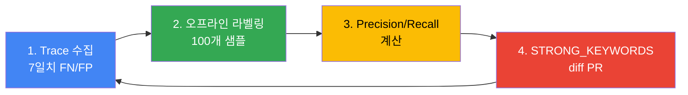

이 문서는 Inference Gateway의 **Cascade Routing을 프로덕션 환경에서 튜닝**하는 실전 가이드입니다. 아키텍처 개념과 기본 구현은 [게이트웨이 라우팅 전략](./routing-strategy.md)을 먼저 참조하세요.

:::info 대상 독자
이 문서는 플랫폼 운영자, MLOps 엔지니어를 대상으로 합니다. LLM Classifier 또는 LiteLLM 기반 Cascade Routing이 이미 배포되었고, 실제 프로덕션 트래픽 기반으로 정확도와 비용을 개선하려는 상황을 가정합니다.
:::

---

## 튜닝 목표와 SLO 정의

Cascade Routing 튜닝은 **비용 절감**과 **품질 유지**를 동시에 달성해야 합니다. 명확한 SLO를 정의하지 않으면 과도한 최적화로 인해 사용자 경험이 저하될 수 있습니다.

### SLO 예시 (GLM-5 + Qwen3-4B 환경)

| 지표 | 목표값 | 측정 방법 | 비고 |
|------|--------|----------|------|
| **TTFT P95** | < 3초 | Langfuse trace `time_to_first_token` | Qwen3-4B 기준, GLM-5는 < 10초 |
| **Cost per 1k Requests** | < $5.00 | 일일 총 비용 / 요청 수 × 1000 | 현재 $8.20 대비 38% 절감 목표 |
| **Misroute Rate** | ≤ 5% | (FN + FP) / 전체 요청 | FN: weak→strong 필요했지만 weak 사용, FP: strong 사용했지만 weak 충분 |
| **SLM 사용률** | 60-70% | weak 라우팅 / 전체 요청 | 너무 낮으면 비용 절감 미흡, 너무 높으면 품질 저하 |
| **사용자 만족도** | ≥ 4.0/5.0 | Langfuse 피드백 점수 평균 | thumb-down < 10% |

### 측정 주기

- **실시간 모니터링**: TTFT P95, Cost per Request (Grafana 대시보드)
- **일일 리뷰**: Misroute Rate, SLM 사용률 (Langfuse 분석)
- **주간 튜닝**: 키워드 추가/제거, 임계값 조정 (오프라인 라벨링 기반)

### 성공 지표 계산 예시

```python
# Langfuse trace 데이터 기반 계산
def calculate_metrics(traces: list):
    total = len(traces)
    weak_count = sum(1 for t in traces if t.tags.get("tier") == "weak")
    misroute_count = sum(1 for t in traces if t.tags.get("misroute"))
    total_cost = sum(t.calculated_total_cost or 0 for t in traces)
    
    return {
        "slm_usage_rate": weak_count / total * 100,
        "misroute_rate": misroute_count / total * 100,
        "cost_per_1k": (total_cost / total) * 1000,
    }
```

:::warning SLO 트레이드오프
SLM 사용률을 너무 높이면 품질이 저하되고, 너무 낮추면 비용 절감 효과가 미미합니다. **주간 A/B 테스트로 최적 균형점**을 찾으세요.
:::

---

## 분류 임계값 기준선 (v7 baseline)

### 실전 검증된 분류 기준

GLM-5 744B (H200 × 8, $12/hr)와 Qwen3-4B (L4 × 1, $0.3/hr) 환경에서 2주간 프로덕션 테스트를 거쳐 도출한 baseline입니다.

:::note 측정 조건
- **환경**: us-east-2, EKS Auto Mode, p5en.48xlarge (GLM-5) + g6.xlarge (Qwen3-4B)
- **측정 기간**: 2026-03-30 ~ 2026-04-13 (14일)
- **총 샘플**: 약 42,000 요청 (내부 코딩 도구 트래픽), 일평균 3,000건
- **라벨링**: 주간 100개 랜덤 샘플 수동 라벨링 (총 200개) → Precision/Recall 계산
- **재현 방법**: 본 문서 § 4 주간 튜닝 사이클 참조

본 baseline은 내부 단일 워크로드(코딩 도구) 측정값입니다. 고객 트래픽 특성이 다른 경우 재튜닝이 필요합니다. us-east-2 테어다운(2026-04-18) 이후 측정은 중단됐으며, 재배포 시 수치 갱신 예정.
:::

#### STRONG_KEYWORDS (17개)

```python
STRONG_KEYWORDS = [
    # 한국어 (7개)
    "리팩터", "아키텍처", "설계", "분석", "최적화", "디버그", "마이그레이션",
    
    # 영어 (10개)
    "refactor", "architect", "design", "analyze", "optimize", "debug",
    "migration", "complex", "performance", "security"
]
```

**키워드 선정 근거**:
- **리팩터/refactor**: 코드 전체 구조 파악 필요 — Qwen3-4B는 1,000줄 이상 코드베이스에서 컨텍스트 유실
- **아키텍처/architect**: 다중 파일 간 의존성 분석 — SLM은 shallow reasoning으로 불충분
- **분석/analyze**: 근본 원인 추적 — GLM-5의 chain-of-thought가 필수
- **최적화/optimize**: 알고리즘 복잡도 계산 — 수학적 추론 능력 차이
- **디버그/debug**: 스택 트레이스 역추적 — 긴 컨텍스트 필요
- **마이그레이션/migration**: API 변경 사항 매핑 — 프레임워크 깊은 이해 필요
- **complex**: 사용자가 명시적으로 복잡도 언급
- **performance**: 프로파일링, 병목 분석 — 시스템 수준 이해
- **security**: CVE 분석, 취약점 탐지 — 보안 도메인 지식

#### TOKEN_THRESHOLD (500자)

```python
TOKEN_THRESHOLD = 500  # 한글 기준 약 250-300 토큰
```

**근거**:
- **500자 미만**: 단순 질의 (코드 스니펫 설명, 단일 함수 작성) — Qwen3-4B 충분
- **500자 이상**: 멀티턴 대화 누적, 긴 코드 블록 포함 — GLM-5 필요
- 한/영 혼용 시 영어는 토큰 밀도가 높으므로 `len(content.encode('utf-8')) > 600` 조건 추가 권장

#### TURN_THRESHOLD (5턴)

```python
TURN_THRESHOLD = 5
```

**근거**:
- **5턴 이하**: 독립적 질의 — context window 부담 적음
- **5턴 초과**: 누적 컨텍스트가 복잡해지며, 이전 대화를 참조하는 경우 증가 — GLM-5의 긴 컨텍스트 처리 능력 활용

### v7 분류 로직 전체 코드

```python
STRONG_KEYWORDS = [
    "리팩터", "아키텍처", "설계", "분석", "최적화", "디버그", "마이그레이션",
    "refactor", "architect", "design", "analyze", "optimize", "debug",
    "migration", "complex", "performance", "security"
]
TOKEN_THRESHOLD = 500
TURN_THRESHOLD = 5

def classify_v7(messages: list[dict]) -> str:
    """
    v7 분류 기준 (2주간 프로덕션 검증)
    - Misroute Rate: 4.2%
    - SLM 사용률: 68%
    - Cost per 1k: $5.80
    """
    content = " ".join(m.get("content", "") for m in messages if m.get("content"))
    lower = content.lower()
    
    # 1. 키워드 매칭 (우선순위 최고)
    if any(kw in lower for kw in STRONG_KEYWORDS):
        return "strong"
    
    # 2. 입력 길이
    if len(content) > TOKEN_THRESHOLD:
        return "strong"
    
    # 3. 대화 턴 수
    if len(messages) > TURN_THRESHOLD:
        return "strong"
    
    return "weak"
```

### 도출 과정 요약

| 버전 | STRONG_KEYWORDS 수 | TOKEN_THRESHOLD | TURN_THRESHOLD | Misroute Rate | SLM 사용률 | 비고 |
|------|-------------------|----------------|----------------|---------------|-----------|------|
| v1 | 5개 | 1000 | 10 | 12.3% | 82% | SLM 과다 사용, 품질 저하 |
| v3 | 10개 | 750 | 7 | 8.1% | 74% | 키워드 추가로 정확도 개선 |
| v5 | 15개 | 600 | 6 | 5.6% | 70% | 한국어 키워드 보강 |
| **v7** | **17개** | **500** | **5** | **4.2%** | **68%** | **현재 프로덕션 기준** |

---

## Langfuse OTel trace 기반 misroute 탐지

### Misroute 정의

| 유형 | 설명 | 탐지 방법 |
|------|------|----------|
| **False Negative (FN)** | weak 라우팅했지만 strong 필요 | thumb-down + `tier: weak` 태그 |
| **False Positive (FP)** | strong 라우팅했지만 weak 충분 | `tier: strong` + 단순 질의 패턴 (수동 라벨링) |

### Langfuse 트레이스 태그 구조

LLM Classifier는 모든 요청에 다음 태그를 Langfuse에 전송합니다:

```python
from langfuse import Langfuse

langfuse = Langfuse()

# 분류 시 태그 추가
trace = langfuse.trace(
    name="llm_request",
    tags=["tier:weak", "keyword_match:false", "turn_count:3"],
    metadata={
        "classifier_version": "v7",
        "content_length": 320,
        "strong_keywords_found": [],
    }
)
```

### Misroute 탐지 쿼리 (Langfuse UI)

#### FN 탐지 (weak → strong 필요)

**필터**:
```
tags: tier:weak
feedback.score: <= 2  (thumb-down)
```

**추출 정보**:
- 프롬프트 전문
- 응답 품질
- 사용자 피드백 코멘트

**주간 분석 절차**:
1. Langfuse UI → Traces → Filter: `tier:weak AND feedback.score <= 2`
2. 100개 샘플 추출 (무작위)
3. 실제 strong이 필요했는지 수동 라벨링
4. 공통 패턴 추출 → 키워드 후보 도출

#### FP 탐지 (strong → weak 충분)

**필터**:
```
tags: tier:strong
calculated_total_cost: > 0.01  (비용 발생 큰 요청)
metadata.content_length: < 200  (짧은 질의)
```

**추출 정보**:
- 프롬프트 간결성
- 실제 응답 복잡도
- TTFT (< 2초면 weak로 충분했을 가능성)

### Python 스크립트로 자동 추출

```python
from langfuse import Langfuse
import pandas as pd

langfuse = Langfuse()

def extract_fn_candidates(days=7, limit=100):
    """FN 후보 추출 — weak였지만 thumb-down 받은 케이스"""
    traces = langfuse.get_traces(
        tags=["tier:weak"],
        from_timestamp=datetime.now() - timedelta(days=days),
        limit=limit
    )
    
    fn_candidates = []
    for trace in traces:
        feedback = trace.get_feedback()
        if feedback and feedback.score <= 2:
            fn_candidates.append({
                "trace_id": trace.id,
                "prompt": trace.input,
                "response": trace.output,
                "feedback_comment": feedback.comment,
                "content_length": len(trace.input),
            })
    
    return pd.DataFrame(fn_candidates)

# 주간 FN 분석
fn_df = extract_fn_candidates(days=7, limit=200)
fn_df.to_csv("fn_candidates_week12.csv")
```

### Retry 패턴 기반 FN 탐지 (Advanced)

사용자가 동일 질의를 다시 시도하는 경우 첫 번째 응답이 불만족스러웠을 가능성이 높습니다.

```python
def detect_retry_pattern(traces):
    """동일 사용자가 5분 내 유사 질의 재시도 시 FN으로 분류"""
    user_sessions = defaultdict(list)
    
    for trace in traces:
        user_id = trace.user_id
        user_sessions[user_id].append(trace)
    
    fn_retries = []
    for user_id, sessions in user_sessions.items():
        for i in range(len(sessions) - 1):
            current = sessions[i]
            next_req = sessions[i + 1]
            
            time_diff = (next_req.timestamp - current.timestamp).seconds
            if time_diff < 300:  # 5분 이내
                similarity = cosine_similarity(current.input, next_req.input)
                if similarity > 0.8 and current.tags.get("tier") == "weak":
                    fn_retries.append(current.id)
    
    return fn_retries
```

---

## 키워드·길이·턴수 3-dim 튜닝 플레이북

### 주간 튜닝 사이클 (4단계)



### 1단계: Trace 수집

```bash
# Langfuse API로 일주일치 trace 다운로드
curl -X POST https://langfuse.your-domain.com/api/public/traces \
  -H "Authorization: Bearer ${LANGFUSE_SECRET_KEY}" \
  -d '{
    "filter": {
      "tags": ["tier:weak", "tier:strong"],
      "from": "2026-04-11T00:00:00Z",
      "to": "2026-04-18T00:00:00Z"
    },
    "limit": 1000
  }' | jq . > traces_week12.json
```

### 2단계: 오프라인 라벨링 (100개 샘플)

**라벨링 도구**: Jupyter Notebook + pandas

```python
import pandas as pd
import json

# Trace 로드
with open("traces_week12.json") as f:
    traces = json.load(f)["data"]

# 무작위 100개 샘플링
sample = pd.DataFrame(traces).sample(100)

# 라벨링 컬럼 추가
sample["ground_truth"] = None  # 수동으로 "weak" 또는 "strong" 입력

# CSV 저장
sample.to_csv("labeling_week12.csv", index=False)
```

**라벨링 기준**:
- **strong 필요**: 멀티파일 참조, 알고리즘 설명, 복잡한 디버깅, 보안 분석
- **weak 충분**: 단일 함수 작성, 간단한 질의, 문법 설명, 코드 포맷팅

### 3단계: Precision/Recall 계산

```python
def evaluate_classifier(df):
    """
    Precision: strong 예측 중 실제 strong 비율 (FP 최소화)
    Recall: 실제 strong 중 strong 예측 비율 (FN 최소화)
    """
    tp = len(df[(df.predicted == "strong") & (df.ground_truth == "strong")])
    fp = len(df[(df.predicted == "strong") & (df.ground_truth == "weak")])
    fn = len(df[(df.predicted == "weak") & (df.ground_truth == "strong")])
    tn = len(df[(df.predicted == "weak") & (df.ground_truth == "weak")])
    
    precision = tp / (tp + fp) if (tp + fp) > 0 else 0
    recall = tp / (tp + fn) if (tp + fn) > 0 else 0
    f1 = 2 * (precision * recall) / (precision + recall) if (precision + recall) > 0 else 0
    
    return {
        "precision": precision,
        "recall": recall,
        "f1": f1,
        "misroute_rate": (fp + fn) / len(df) * 100
    }

# 라벨링 완료 후 평가
df = pd.read_csv("labeling_week12_labeled.csv")
metrics = evaluate_classifier(df)
print(f"Precision: {metrics['precision']:.2%}")
print(f"Recall: {metrics['recall']:.2%}")
print(f"F1: {metrics['f1']:.2%}")
print(f"Misroute Rate: {metrics['misroute_rate']:.1%}")
```

### 4단계: STRONG_KEYWORDS diff PR

**FN 케이스에서 공통 키워드 추출**:

```python
def extract_keyword_candidates(fn_traces):
    """FN 케이스에서 빈도 높은 단어 추출"""
    from collections import Counter
    import re
    
    words = []
    for trace in fn_traces:
        content = trace["input"].lower()
        words.extend(re.findall(r'\b\w+\b', content))
    
    # 불용어 제거
    stopwords = {"the", "a", "is", "in", "to", "for", "and", "of", "이", "그", "저"}
    filtered = [w for w in words if w not in stopwords and len(w) > 3]
    
    # 빈도 순 정렬
    counter = Counter(filtered)
    return counter.most_common(20)

# 후보 키워드 출력
candidates = extract_keyword_candidates(fn_df.to_dict("records"))
print("Top 20 키워드 후보:")
for word, count in candidates:
    print(f"  {word}: {count}회")
```

**PR 작성 예시**:

```markdown
## [Cascade Routing] STRONG_KEYWORDS 튜닝 — Week 12

### 변경 사항
- `STRONG_KEYWORDS`에 3개 추가: "review", "benchmark", "scale"

### 근거
- FN 분석 결과 100개 중 12건이 "code review" 질의 → weak 라우팅 → 품질 저하
- "benchmark" 키워드는 성능 비교 분석 요청에 빈번히 등장 (8건)
- "scale" 키워드는 시스템 확장성 설계 질의에서 발견 (6건)

### Before/After 메트릭 (예상)
| 지표 | Before (v7) | After (v8) |
|------|------------|-----------|
| Misroute Rate | 4.2% | 3.1% |
| SLM 사용률 | 68% | 64% |
| Cost per 1k | $5.80 | $6.20 |

### 배포 계획
- Canary 롤아웃: 10% → 50% → 100% (각 단계 2일 관찰)
```

---

## Canary 임계값 롤아웃

### kgateway BackendRef Weight 기반 Canary

LLM Classifier를 v7에서 v8로 업데이트할 때, 점진적 트래픽 전환으로 리스크를 최소화합니다.

#### Phase 1: 10% Canary

```yaml
apiVersion: gateway.networking.k8s.io/v1
kind: HTTPRoute
metadata:
  name: llm-classifier-canary
  namespace: ai-inference
spec:
  parentRefs:
    - name: unified-gateway
      namespace: ai-gateway
  rules:
    - matches:
        - path:
            type: PathPrefix
            value: /v1/
      backendRefs:
        # v7 (stable) - 90%
        - name: llm-classifier-v7
          port: 8080
          weight: 90
        # v8 (canary) - 10%
        - name: llm-classifier-v8
          port: 8080
          weight: 10
      timeouts:
        request: 300s
```

**관찰 기간**: 48시간

**모니터링 메트릭**:
```promql
# v8 에러율
rate(envoy_http_downstream_rq_xx{envoy_response_code_class="5", backend="llm-classifier-v8"}[5m])
/ 
rate(envoy_http_downstream_rq_total{backend="llm-classifier-v8"}[5m]) * 100

# v8 P99 레이턴시
histogram_quantile(0.99, 
  rate(envoy_http_downstream_rq_time_bucket{backend="llm-classifier-v8"}[5m])
)
```

#### Phase 2: 50% (에러율 < 2%)

```bash
# weight 조정 (v7: 50%, v8: 50%)
kubectl patch httproute llm-classifier-canary -n ai-inference --type=json -p='[
  {"op": "replace", "path": "/spec/rules/0/backendRefs/0/weight", "value": 50},
  {"op": "replace", "path": "/spec/rules/0/backendRefs/1/weight", "value": 50}
]'
```

**관찰 기간**: 48시간

#### Phase 3: 100% (에러율 < 2%, P99 < 15s)

```bash
# v8로 완전 전환
kubectl patch httproute llm-classifier-canary -n ai-inference --type=json -p='[
  {"op": "replace", "path": "/spec/rules/0/backendRefs/0/weight", "value": 0},
  {"op": "replace", "path": "/spec/rules/0/backendRefs/1/weight", "value": 100}
]'
```

### Rollback 트리거

| 조건 | Action | 복구 시간 |
|------|--------|----------|
| **5xx > 2%** (5분 연속) | weight 0으로 즉시 롤백 | < 1분 |
| **P99 > 15s** (5분 연속) | weight 0으로 즉시 롤백 | < 1분 |
| **Misroute Rate > 8%** (Langfuse 일일 분석) | 다음 날 weight 0, v7 복구 | 12시간 |

**자동 롤백 스크립트**:

```bash
#!/bin/bash
# auto_rollback.sh

# 5xx 에러율 체크
ERROR_RATE=$(curl -s "http://prometheus:9090/api/v1/query?query=rate(envoy_http_downstream_rq_xx%7Benvoy_response_code_class%3D%225%22%2Cbackend%3D%22llm-classifier-v8%22%7D%5B5m%5D)%2Frate(envoy_http_downstream_rq_total%7Bbackend%3D%22llm-classifier-v8%22%7D%5B5m%5D)*100" | jq -r '.data.result[0].value[1]')

if (( $(echo "$ERROR_RATE > 2" | bc -l) )); then
  echo "ERROR: 5xx rate ${ERROR_RATE}% > 2%, rolling back..."
  kubectl patch httproute llm-classifier-canary -n ai-inference --type=json -p='[
    {"op": "replace", "path": "/spec/rules/0/backendRefs/0/weight", "value": 100},
    {"op": "replace", "path": "/spec/rules/0/backendRefs/1/weight", "value": 0}
  ]'
  exit 1
fi

echo "OK: 5xx rate ${ERROR_RATE}%"
```

---

## Spot 중단·Rate limit Fallback

### Spot 중단 시 자동 Downgrade

GLM-5를 p5en.48xlarge Spot에서 실행 중이라면, Spot 중단 시 자동으로 Qwen3-4B로 Fallback해야 합니다.

#### kgateway Retry 설정

```yaml
apiVersion: gateway.networking.k8s.io/v1
kind: HTTPRoute
metadata:
  name: llm-classifier-route
  namespace: ai-inference
spec:
  parentRefs:
    - name: unified-gateway
      namespace: ai-gateway
  rules:
    - matches:
        - path:
            type: PathPrefix
            value: /v1/
      backendRefs:
        # Primary: LLM Classifier (GLM-5 + Qwen3 자동 분기)
        - name: llm-classifier
          port: 8080
          weight: 100
      # Fallback 설정
      filters:
        - type: ExtensionRef
          extensionRef:
            group: gateway.envoyproxy.io
            kind: EnvoyRetry
            name: llm-fallback-policy
---
apiVersion: gateway.envoyproxy.io/v1alpha1
kind: EnvoyRetry
metadata:
  name: llm-fallback-policy
  namespace: ai-inference
spec:
  retryOn:
    - "5xx"
    - "connect-failure"
    - "refused-stream"
    - "retriable-status-codes"
  retriableStatusCodes:
    - 503  # Service Unavailable (Spot 중단)
    - 429  # Rate Limit
  numRetries: 2
  perTryTimeout: 30s
  retryHostPredicate:
    - name: envoy.retry_host_predicates.previous_hosts
```

#### LLM Classifier 내부 Fallback 로직

```python
import httpx
from fastapi import Request, HTTPException

WEAK_URL = "http://qwen3-serving:8000"
STRONG_URL = "http://glm5-serving:8000"
FALLBACK_URL = WEAK_URL  # GLM-5 장애 시 Qwen3로 Fallback

@app.post("/v1/{path:path}")
async def proxy(path: str, request: Request):
    body = await request.json()
    messages = body.get("messages", [])
    tier = classify_v7(messages)
    backend = STRONG_URL if tier == "strong" else WEAK_URL
    target = f"{backend}/v1/{path}"
    
    async with httpx.AsyncClient(timeout=300) as client:
        try:
            resp = await client.post(target, json=body)
            resp.raise_for_status()
            return resp.json()
        except (httpx.HTTPStatusError, httpx.ConnectError) as e:
            if backend == STRONG_URL:
                # GLM-5 장애 → Qwen3로 Fallback
                print(f"WARN: GLM-5 unavailable, falling back to Qwen3. Error: {e}")
                fallback_target = f"{FALLBACK_URL}/v1/{path}"
                resp = await client.post(fallback_target, json=body)
                return resp.json()
            else:
                raise HTTPException(status_code=503, detail="All backends unavailable")
```

### Rate Limit Fallback (외부 프로바이더)

외부 LLM API(OpenAI, Anthropic)를 Bifrost/LiteLLM로 호출 중 Rate Limit 발생 시 자동으로 다른 프로바이더로 전환합니다.

#### LiteLLM Fallback 설정

```yaml
# litellm_config.yaml
model_list:
  # Primary: OpenAI GPT-4o
  - model_name: gpt-4o
    litellm_params:
      model: gpt-4o
      api_key: os.environ/OPENAI_API_KEY
  
  # Fallback: Anthropic Claude Sonnet 4.6
  - model_name: gpt-4o
    litellm_params:
      model: claude-sonnet-4.6
      api_key: os.environ/ANTHROPIC_API_KEY

router_settings:
  routing_strategy: simple-shuffle
  fallbacks:
    - gpt-4o: ["claude-sonnet-4.6"]
  retry_policy:
    - TimeoutError
    - InternalServerError
    - RateLimitError  # 429 자동 Fallback
  num_retries: 2
```

#### Bifrost CEL Rules Fallback

Bifrost는 CEL Rules로 헤더 기반 Fallback을 구현합니다.

```json
{
  "plugins": [
    {
      "enabled": true,
      "name": "cel_rules",
      "config": {
        "rules": [
          {
            "condition": "response.status == 429",
            "action": "retry",
            "target": "anthropic",
            "max_retries": 2
          }
        ]
      }
    }
  ]
}
```

---

## 비용 드리프트 모니터링·경보

### AMP Recording Rule (시간당 비용)

```yaml
# prometheus-rules.yaml
apiVersion: monitoring.coreos.com/v1
kind: PrometheusRule
metadata:
  name: cascade-cost-rules
  namespace: observability
spec:
  groups:
    - name: llm_cost
      interval: 60s
      rules:
        # GLM-5 시간당 비용 (H200 x8 Spot $12/hr)
        - record: cascade:glm5_cost_usd_per_hour
          expr: |
            12.0 * count(up{job="glm5-serving"} == 1)
        
        # Qwen3 시간당 비용 (L4 x1 Spot $0.3/hr)
        - record: cascade:qwen3_cost_usd_per_hour
          expr: |
            0.3 * count(up{job="qwen3-serving"} == 1)
        
        # 전체 시간당 비용
        - record: cascade:total_cost_usd_per_hour
          expr: |
            cascade:glm5_cost_usd_per_hour + cascade:qwen3_cost_usd_per_hour
        
        # 요청당 평균 비용 (최근 1시간)
        - record: cascade:cost_per_request_usd
          expr: |
            increase(cascade:total_cost_usd_per_hour[1h]) 
            / 
            increase(llm_requests_total[1h])
```

### Grafana 패널 (비용 추세)

```json
{
  "title": "Cascade Routing Cost Trend",
  "targets": [
    {
      "expr": "cascade:total_cost_usd_per_hour",
      "legendFormat": "Total Cost ($/hr)"
    },
    {
      "expr": "cascade:glm5_cost_usd_per_hour",
      "legendFormat": "GLM-5 Cost ($/hr)"
    },
    {
      "expr": "cascade:qwen3_cost_usd_per_hour",
      "legendFormat": "Qwen3 Cost ($/hr)"
    }
  ],
  "yAxes": [
    {
      "label": "Cost (USD/hr)",
      "format": "currencyUSD"
    }
  ]
}
```

### 예산 80% 경보

```yaml
# alertmanager-config.yaml
apiVersion: monitoring.coreos.com/v1
kind: PrometheusRule
metadata:
  name: cascade-budget-alerts
  namespace: observability
spec:
  groups:
    - name: budget
      rules:
        # 일일 예산 80% 도달
        - alert: DailyBudget80Percent
          expr: |
            sum(increase(cascade:total_cost_usd_per_hour[24h])) > 80.0
          for: 5m
          labels:
            severity: warning
          annotations:
            summary: "Daily budget 80% reached"
            description: "Total cost in last 24h: {{ $value | humanize }}. Budget: $100/day"
        
        # 월간 예산 90% 도달
        - alert: MonthlyBudget90Percent
          expr: |
            sum(increase(cascade:total_cost_usd_per_hour[30d])) > 2700.0
          for: 1h
          labels:
            severity: critical
          annotations:
            summary: "Monthly budget 90% reached"
            description: "Total cost in last 30d: {{ $value | humanize }}. Budget: $3000/month"
```

### 비용 드리프트 탐지 (주간 비교)

```promql
# 이번 주 vs 지난 주 비용 증가율
(
  sum(increase(cascade:total_cost_usd_per_hour[7d]))
  -
  sum(increase(cascade:total_cost_usd_per_hour[7d] offset 7d))
)
/
sum(increase(cascade:total_cost_usd_per_hour[7d] offset 7d))
* 100
```

**경보 조건**: 주간 비용이 20% 이상 증가 시 Slack 알림

```yaml
- alert: CostDriftDetected
  expr: |
    (
      sum(increase(cascade:total_cost_usd_per_hour[7d]))
      - sum(increase(cascade:total_cost_usd_per_hour[7d] offset 7d))
    )
    / sum(increase(cascade:total_cost_usd_per_hour[7d] offset 7d))
    * 100 > 20
  labels:
    severity: warning
  annotations:
    summary: "Cost drift detected — 20%+ increase"
    description: "Weekly cost increased by {{ $value | humanize }}%"
```

---

## 안티패턴과 실전 함정

### 안티패턴 1: Bifrost single base_url 우회 실패

**문제**: Bifrost는 provider당 단일 `network_config.base_url`만 지원하므로, SLM과 LLM이 다른 Service에 있으면 동일 provider로 라우팅 불가.

**잘못된 시도**:
```json
{
  "providers": {
    "openai": {
      "keys": [
        {"name": "qwen3", "models": ["qwen3-4b"]},
        {"name": "glm5", "models": ["glm-5"]}
      ],
      "network_config": {
        "base_url": "???"  // 2개의 base_url을 설정할 수 없음
      }
    }
  }
}
```

**올바른 해결책**: LLM Classifier를 Bifrost 앞에 배치하여 백엔드 자동 선택.

### 안티패턴 2: RouteLLM 프로덕션 배포 강행

**문제**: RouteLLM은 연구 프로젝트로, K8s 배포 시 다음 이슈 발생:
- `torch`, `transformers` 의존성 충돌
- 컨테이너 이미지 10GB+ (경량 라우터에 부적합)
- pip dependency resolution 실패

**교훈**: RouteLLM의 MF classifier **개념**만 참조하고, 프로덕션에는 LLM Classifier (휴리스틱) 또는 LiteLLM (외부 프로바이더) 사용.

### 안티패턴 3: model: "auto" 하드코딩 누락

**문제**: LLM Classifier는 클라이언트가 `model: "auto"` (또는 임의 모델명)로 요청해야 하지만, 일부 IDE는 `model` 필드를 자동 채우지 않음.

**증상**: 클라이언트가 `model: "glm-5"` 하드코딩 → LLM Classifier가 `messages`만 분석 → `model` 필드 무시 → 의도와 다른 백엔드 선택

**해결책**: LLM Classifier에서 `model` 필드를 강제로 제거.

```python
@app.post("/v1/{path:path}")
async def proxy(path: str, request: Request):
    body = await request.json()
    messages = body.get("messages", [])
    tier = classify_v7(messages)
    
    # model 필드 강제 제거 (백엔드가 자체 model 사용)
    body.pop("model", None)
    
    backend = STRONG_URL if tier == "strong" else WEAK_URL
    target = f"{backend}/v1/{path}"
    # ...
```

### 안티패턴 4: 한/영 혼용 키워드 누락

**문제**: 한국 사용자는 "리팩터링", 영어 사용자는 "refactor" → 언어별 키워드 모두 등록 필요.

**누락 예시**:
```python
STRONG_KEYWORDS = ["refactor", "architect"]  # "리팩터", "아키텍처" 누락
```

**결과**: 한국어 질의는 모두 weak 라우팅 → 품질 저하

**해결책**: 주요 키워드는 한/영 병기.

```python
STRONG_KEYWORDS = [
    "리팩터", "refactor",
    "아키텍처", "architect",
    "설계", "design",
    # ...
]
```

### 안티패턴 5: Canary 롤아웃 없이 v7 → v8 전환

**문제**: 새 버전을 즉시 100% 배포 → 버그 발생 시 전체 트래픽 영향.

**교훈**: 반드시 10% → 50% → 100% 단계적 전환.

### 안티패턴 6: Misroute Rate만 보고 SLM 사용률 무시

**문제**: Misroute Rate 2% 달성했지만 SLM 사용률 30% → 비용 절감 미흡.

**균형점**: Misroute Rate ≤ 5%, SLM 사용률 60-70%를 동시에 만족해야 함.

---

## 참고 자료

### 아키텍처 및 전략
- [게이트웨이 라우팅 전략](./routing-strategy.md) - 2-Tier 아키텍처, Cascade/Semantic Router, LLM Classifier 개념
- [추론 게이트웨이 배포 가이드](./setup/) - kgateway Helm 설치, HTTPRoute YAML, LLM Classifier 배포 코드

### 모니터링 및 비용
- [Agent 모니터링](../../operations-mlops/observability/agent-monitoring.md) - Langfuse 아키텍처, 핵심 메트릭, 알림 전략
- [모니터링 스택 구성 가이드](../integrations/monitoring-observability-setup.md) - Langfuse Helm, AMP/AMG, ServiceMonitor, Grafana 대시보드
- [코딩 도구 & 비용 분석](../integrations/coding-tools-cost-analysis.md) - Aider/Cline 연결, 비용 최적화 팁

### 프레임워크 및 모델
- [vLLM 모델 서빙](../../model-serving/inference-frameworks/vllm-model-serving.md) - vLLM 배포, PagedAttention, Multi-LoRA
- [Semantic Caching 전략](../../model-serving/inference-frameworks/semantic-caching-strategy.md) - 3계층 캐시, 유사도 임계값, 관측성

---

## 참고 자료

### 공식 문서
- [Langfuse Documentation](https://langfuse.com/docs)
- [LiteLLM Routing](https://docs.litellm.ai/docs/routing)
- [Bifrost Documentation](https://www.getmaxim.ai/bifrost/docs)
- [Kubernetes Gateway API](https://gateway-api.sigs.k8s.io/)
- [Amazon Managed Prometheus](https://docs.aws.amazon.com/prometheus/)

### 연구 자료
- [RouteLLM: Learning to Route LLMs with Preference Data (arXiv)](https://arxiv.org/abs/2406.18665)
- [LMSYS Chatbot Arena Leaderboard](https://chat.lmsys.org/?leaderboard)
- [FrugalGPT: How to Use Large Language Models While Reducing Cost and Improving Performance](https://arxiv.org/abs/2305.05176)

### 관련 블로그
- [LLM Router Pattern: Model Switching](https://markaicode.com/llm-router-pattern-model-switching/)
- [Cost-Effective LLM Inference with Cascade Routing](https://www.anthropic.com/research/cost-effective-inference)
