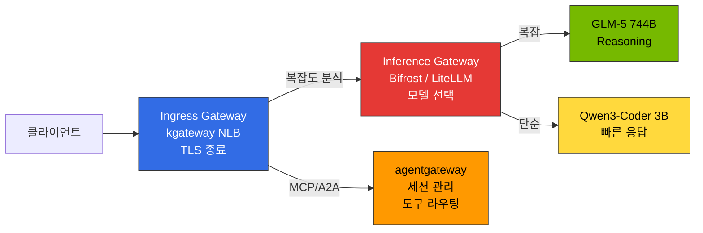
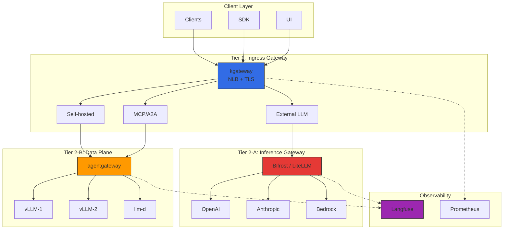
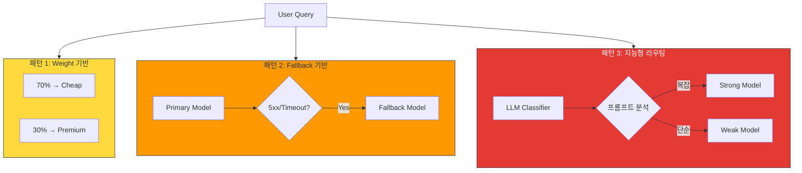
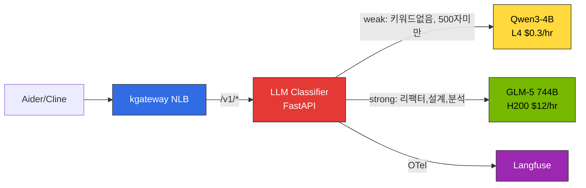
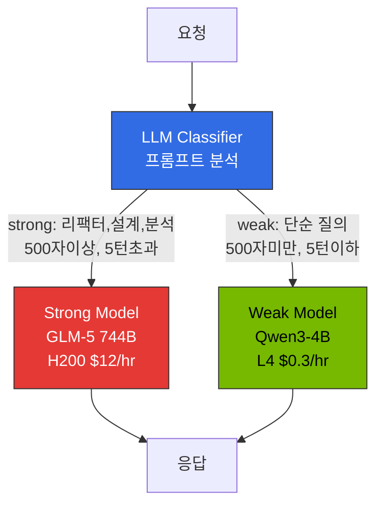
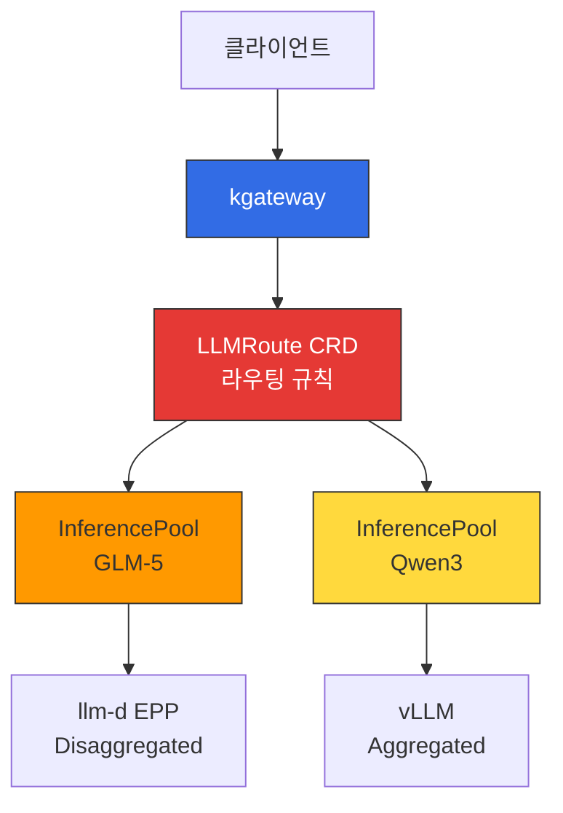

# 추론 게이트웨이 & LLM Gateway 라우팅 전략

> 작성일: 2025-02-05 | 수정일: 2026-04-17 | 읽는 시간: 약 15분

이 문서는 2-Tier 게이트웨이 아키텍처와 라우팅 전략(Cascade / Semantic Router / Hybrid)의 **설계 원칙**을 다룹니다. 실제 Helm 설치, HTTPRoute 매니페스트, OTel 연동 등 **배포 절차**는 [추론 게이트웨이 배포 가이드](./inference-gateway-setup/)를 참조하세요.

## 개요

대규모 AI 모델 서빙 환경에서는 **인프라 트래픽 관리**와 **LLM 프로바이더 추상화**를 분리해야 합니다. 단일 Gateway는 복잡성이 급증하고 각 레이어 최적화가 어렵습니다.

**2-Tier Gateway 아키텍처**:
- **L1 (Ingress Gateway)**: kgateway — Kubernetes Gateway API 표준, 트래픽 라우팅, mTLS, rate limiting
- **L2-A (Inference Gateway)**: Bifrost/LiteLLM — 프로바이더 통합, cascade routing, semantic caching
- **L2-B (Data Plane)**: agentgateway — MCP/A2A 프로토콜, stateful 세션 관리

각 티어는 독립적으로 관리되며, 인프라와 AI 워크로드를 분리합니다.

---

## 2-Tier Gateway 아키텍처

### Gateway 계층 구분

LLM 추론 플랫폼은 **3가지 서로 다른 Gateway 역할**을 명확히 구분해야 합니다:

| Gateway 유형 | 역할 | 구현체 | 위치 |
|-------------|------|-------|------|
| **Ingress Gateway** | 외부 트래픽 수신, TLS 종료, 경로 기반 라우팅 | kgateway (NLB 연동) | Tier 1 |
| **Inference Gateway** | 모델 선택, 지능형 라우팅, 요청 캐스케이딩 | Bifrost / LiteLLM | Tier 2-A |
| **Data Plane** | MCP/A2A 프로토콜, stateful 세션, 도구 라우팅 | agentgateway | Tier 2-B |



**핵심 원칙:**
- **Ingress Gateway (kgateway)**: 네트워크 레벨 트래픽 제어만 담당. 모델 선택 로직은 포함하지 않음
- **Inference Gateway (Bifrost/LiteLLM)**: 요청 복잡도 분석 → 적절한 모델 자동 선택 → 비용 최적화
- **Data Plane (agentgateway)**: AI 전용 프로토콜 (MCP/A2A) 처리, stateful 세션 유지

### 전체 구조



### Tier별 역할 분리

| Tier | 컴포넌트 | 책임 | 프로토콜 |
|------|----------|------|----------|
| **Tier 1** | kgateway (Envoy 기반) | 트래픽 라우팅, mTLS, rate limiting, 네트워크 정책 | HTTP/HTTPS, gRPC |
| **Tier 2-A** | Bifrost / LiteLLM | 지능형 모델 선택, 비용 추적, request cascading, semantic caching | OpenAI-compatible API |
| **Tier 2-B** | agentgateway | MCP/A2A 세션 관리, 자체 추론 인프라 라우팅, Tool Poisoning 방지 | HTTP, JSON-RPC, MCP, A2A |

### 트래픽 플로우

**외부 LLM**: Client → kgateway → Bifrost/LiteLLM (Cascade + Cache) → OpenAI → 응답 + 비용 기록
**자체 vLLM**: Client → kgateway → agentgateway → vLLM → 응답

---

## kgateway (L1 Inference Gateway)

### Gateway API 기반 라우팅

kgateway는 Kubernetes Gateway API 표준을 구현하여 벤더 중립적인 설정이 가능합니다.

import { ComponentStructureTable } from '@site/src/components/InferenceGatewayTables';

<ComponentStructureTable />

Gateway API v1.2.0+는 HTTPRoute 개선, GRPCRoute 안정화, BackendTLSPolicy를 제공하며 kgateway v2.0+는 이를 완전히 지원합니다.

### Dynamic Routing 개념

| 라우팅 유형 | 기준 | 사용 사례 |
|------------|------|----------|
| **헤더 기반** | `x-model-id`, `x-provider` | 모델/프로바이더별 백엔드 선택 |
| **경로 기반** | `/v1/chat/completions`, `/v1/embeddings` | API 유형별 서비스 분리 |
| **가중치 기반** | backendRef weight | 카나리 배포, A/B 테스트 |
| **복합 조건** | 헤더 + 경로 + 티어 | 프리미엄/일반 고객별 백엔드 |

카나리 배포는 5-10% 트래픽으로 시작하여 점진적으로 증가시키며, 문제 발생 시 weight=0으로 즉시 롤백합니다.

### 로드 밸런싱 전략

| 전략 | 설명 | 적합 시나리오 |
|------|------|--------------|
| **Round Robin** | 순차적 분배 (기본값) | 균일한 모델 인스턴스 |
| **Random** | 무작위 분배 | 대규모 백엔드 풀 |
| **Consistent Hash** | 동일 키 → 동일 백엔드 | KV Cache 재활용, 세션 유지 |

Consistent Hash는 LLM 추론에서 특히 유용합니다. 동일 사용자의 요청을 같은 vLLM 인스턴스로 라우팅하면 prefix cache 적중률이 높아져 TTFT(Time to First Token)를 크게 개선할 수 있습니다.

### Topology-Aware Routing (Kubernetes 1.33+)

Kubernetes 1.33+의 topology-aware routing을 활용하면 동일 AZ 내 Pod 간 통신을 우선시하여 크로스 AZ 데이터 전송 비용을 절감합니다.

import { TopologyEffectsTable } from '@site/src/components/InferenceGatewayTables';

<TopologyEffectsTable />

### 장애 대응 개념

| 메커니즘 | 설명 | LLM 추론 고려사항 |
|----------|------|-------------------|
| **타임아웃** | 요청별 최대 처리 시간 제한 | LLM 긴 응답 생성 시 수십 초 소요. 충분한 타임아웃 필요 (120s+) |
| **재시도** | 5xx, 타임아웃, 연결 실패 시 자동 재시도 | 최대 3회 제한. 무한 재시도는 시스템 과부하 유발 |
| **서킷 브레이커** | 연속 실패 시 백엔드 일시 차단 | `maxEjectionPercent` 50% 이하로 설정하여 최소 절반의 백엔드 가용 보장 |

스트리밍 응답 시 `backendRequest` 타임아웃은 첫 바이트까지, `request`는 전체 요청 시간입니다. POST 재시도는 멱등성 보장 필요 (도구 호출 주의).

---

## LLM Gateway 솔루션 비교

### 주요 솔루션 비교 표

| 솔루션 | 언어 | 주요 특징 | Cascade Routing | 라이선스 | 적합 환경 |
|--------|------|-----------|-----------------|----------|-----------|
| **Bifrost** | Go/Rust | 50x faster, CEL Rules 조건부 라우팅, failover | CEL Rules + 외부 classifier | Apache 2.0 | 고성능, 저비용, 셀프호스트 |
| **LiteLLM** | Python | 100+ 프로바이더, complexity-based routing 네이티브 | `routing_strategy: complexity-based` | MIT | Python 생태계, 빠른 프로토타이핑 |
| **vLLM Semantic Router** | Python | vLLM 전용, 경량 임베딩 기반 라우팅 | 임베딩 유사도 기반 | Apache 2.0 | vLLM 단독 환경 |
| **Portkey** | TypeScript | SOC2 인증, semantic caching, Virtual Keys | 지원 | Proprietary + OSS | 엔터프라이즈, 규정 준수 |
| **Kong AI Gateway** | Lua/C | MCP 지원, 기존 Kong 인프라 활용 | 플러그인 | Apache 2.0 / Enterprise | 기존 Kong 사용자 |
| **Helicone** | Rust | Gateway + Observability 통합, 고성능 | 지원 | Apache 2.0 | 고성능 + 관측성 동시 필요 |

### Bifrost vs LiteLLM

**Bifrost**: Go/Rust 구현으로 Python 대비 50배 빠른 throughput, 1/10 메모리 사용. CEL Rules로 조건부 라우팅 (헤더 기반 cascade, failover) 구현 가능. Helm Chart 배포, OpenAI 호환 API. 프록시 레이턴시 100us 미만. 지능형 cascade는 App에서 complexity score 계산 → `x-complexity-score` 헤더 → CEL rule 분기 패턴 또는 Go Plugin으로 구현.

**LiteLLM**: 100+ 프로바이더 지원, **complexity-based routing 네이티브** (`routing_strategy: complexity-based` 설정 1줄로 활성화), Langfuse 한 줄 연동 (`success_callback: ["langfuse"]`), LangChain/LlamaIndex 직접 통합. 단, Python 기반으로 낮은 throughput, 높은 메모리 사용량.

### 선택 기준

| 사용 사례 | 권장 솔루션 | 이유 |
|-----------|-----------|------|
| 지능형 cascade (편의성 우선) | **LiteLLM** | Complexity-based routing 네이티브, 설정 1줄 |
| 지능형 cascade (성능 우선) | **Bifrost** | CEL Rules + 외부 classifier, 50x 빠름 |
| vLLM 단독 환경 | **vLLM Semantic Router** | vLLM 네이티브, 경량 라우팅 |
| 고성능, 저비용 셀프호스트 | **Bifrost** | 50x 빠른 처리, 저메모리 |
| Python 생태계 (LangChain) | **LiteLLM** | 네이티브 통합, 100+ 프로바이더 |
| 엔터프라이즈 규정 준수 | **Portkey** | SOC2/HIPAA/GDPR, Semantic Cache |
| 고성능 + 관측성 통합 | **Helicone** | Rust 기반 All-in-one |

### 시나리오별 추천 조합

| 시나리오 | 추천 조합 | 이유 |
|----------|----------|------|
| **스타트업/PoC** | kgateway + LiteLLM | 저비용, 10분 배포, complexity routing 1줄 |
| **셀프호스트 중심 (성능)** | kgateway + Bifrost (CEL cascade) + agentgateway | 고성능, 외부+자체 풀 2-Tier |
| **엔터프라이즈 멀티 프로바이더** | kgateway + Portkey + Langfuse | 규정 준수, 250+ 프로바이더 |
| **하이브리드 (외부+자체)** | kgateway + Bifrost/LiteLLM + agentgateway | 외부는 Bifrost/LiteLLM, 자체는 agentgateway |
| **글로벌 배포** | Cloudflare AI Gateway + kgateway | Edge caching, DDoS 방어 |

---

## Request Cascading: 지능형 모델 라우팅

### 개념

**Request Cascading**은 요청 복잡도를 자동 분석하여 적절한 모델로 라우팅하는 지능형 최적화 기법입니다. 간단한 질의는 저렴하고 빠른 모델로, 복잡한 reasoning은 강력한 모델로 자동 분배하여 비용과 지연을 동시에 개선합니다. IDE는 단일 엔드포인트만 사용하고, 모델 선택은 플랫폼 레벨에서 중앙 통제합니다.

### Cascading 패턴 3가지

| 패턴 | 설명 | 구현 | 사용 사례 |
|------|------|------|----------|
| **1. Weight 기반** | 고정 비율로 트래픽 분배 | kgateway `backendRef weight` | A/B 테스트, 점진적 모델 마이그레이션 |
| **2. Fallback 기반** | 오류 시 다른 모델로 자동 전환 | kgateway retry + 다중 backendRef | 가용성 향상, rate limit 회피 |
| **3. 지능형 라우팅** | 요청 분석 후 자동 모델 선택 | **LLM Classifier** / LiteLLM / vLLM Semantic Router | 비용 최적화, 품질 유지 |



### Request Cascading 실전 구현

지능형 cascade routing은 요청 복잡도를 분석하여 적절한 모델로 자동 라우팅합니다. 자체 호스팅 환경에서 실제 검증된 접근 방법을 중심으로 설명합니다.

#### 접근 A: LLM Classifier (권장 — 실전 검증)

**LLM Classifier**는 Python FastAPI 기반의 경량 라우터로, 프롬프트 내용을 직접 분석하여 SLM/LLM을 자동 선택합니다. kgateway 뒤에서 ExtProc(External Processing) 또는 독립 서비스로 동작하며, 클라이언트는 단일 엔드포인트(`/v1`)만 사용합니다.



**분류 기준:**

| 기준 | weak (SLM) | strong (LLM) |
|------|-----------|-------------|
| **키워드** | 없음 | 리팩터, 아키텍처, 설계, 분석, 디버그, 최적화, 마이그레이션 등 |
| **입력 길이** | 500자 미만 | 500자 이상 |
| **대화 턴 수** | 5턴 이하 | 5턴 초과 |

**핵심 분류 로직:**

```python
STRONG_KEYWORDS = ["리팩터", "아키텍처", "설계", "분석", "최적화", "디버그",
                   "마이그레이션", "refactor", "architect", "design", "analyze",
                   "optimize", "debug", "migration", "complex"]
TOKEN_THRESHOLD = 500

def classify(messages: list[dict]) -> str:
    content = " ".join(m.get("content", "") for m in messages if m.get("content"))
    # 키워드 매칭
    if any(kw in content.lower() for kw in STRONG_KEYWORDS):
        return "strong"
    # 입력 길이
    if len(content) > TOKEN_THRESHOLD:
        return "strong"
    # 대화 턴 수
    if len(messages) > 5:
        return "strong"
    return "weak"
```

**장점**: 클라이언트 수정 불필요, 프롬프트 내용 직접 분석, Langfuse OTel 직접 전송, 배포 간단 (단일 Pod)
**단점**: 분류 정확도가 휴리스틱에 의존 (ML classifier로 점진적 개선 가능)

:::tip LLM Classifier가 최적인 이유
표준 OpenAI 호환 클라이언트(Aider, Cline 등)는 **단일 `base_url`만 설정**합니다. LLM Classifier는 이 단일 엔드포인트 뒤에서 프롬프트를 분석하고, 백엔드 vLLM 인스턴스로 직접 프록시합니다. 클라이언트는 모델 선택을 전혀 인식하지 못합니다.
:::

#### Bifrost 자체 호스팅 Cascade 한계

Bifrost를 자체 호스팅 vLLM cascade에 사용하려 했으나, 다음 한계로 인해 **LLM Classifier로 전환**했습니다:

| 한계 | 설명 |
|------|------|
| **provider/model 포맷 강제** | 요청 시 `openai/glm-5` 형태 필수. 표준 OpenAI 클라이언트(Aider 등)는 `model: "auto"` 같은 단일 모델명을 기대 |
| **provider당 단일 base_url** | 하나의 provider(예: `openai`)에 하나의 `network_config.base_url`만 설정 가능. SLM과 LLM이 다른 Service에 있으면 동일 provider로 라우팅 불가 |
| **CEL에서 프롬프트 접근 불가** | CEL Rules는 `request.headers`만 접근 가능. 요청 body(프롬프트 내용)를 분석하여 라우팅하는 것이 불가능 |
| **모델명 정규화 이슈** | 하이픈 제거 등 예측 불가능한 정규화로 vLLM `served-model-name`과 불일치 |

:::warning Bifrost는 외부 LLM 프로바이더 통합에 적합
Bifrost는 OpenAI/Anthropic/Bedrock 등 **외부 프로바이더 통합**과 **failover**에 최적화되어 있습니다. 자체 호스팅 vLLM 간의 지능형 cascade routing에는 LLM Classifier가 더 적합합니다.
:::

#### RouteLLM 평가 결과

[RouteLLM](https://github.com/lm-sys/RouteLLM)은 LMSYS가 개발한 오픈소스 라우팅 프레임워크로, Matrix Factorization 기반 분류 모델이 학술적으로 검증되었습니다 (LMSYS Chatbot Arena 데이터 기반 90%+ 정확도).

그러나 K8s 배포 시 다음 이슈가 확인되었습니다:

- **의존성 충돌**: `torch`, `transformers`, `sentence-transformers` 등 대형 의존성 트리가 vLLM 환경과 충돌
- **컨테이너 크기**: 분류 모델 포함 시 이미지 크기 10GB+ (경량 라우터에 부적합)
- **배포 불안정**: pip dependency resolution 실패 빈도 높음
- **유지보수**: 연구 프로젝트 성격으로 프로덕션 지원 부재

**결론**: RouteLLM의 MF classifier **개념**은 유효하지만, 프로덕션 배포에는 **LLM Classifier**(경량 휴리스틱) 또는 **LiteLLM complexity routing**(외부 프로바이더 환경)을 권장합니다.

#### 접근 B: LiteLLM 네이티브 (외부 프로바이더 환경)

LiteLLM은 **complexity-based routing**을 네이티브로 지원합니다. 설정 파일에 1줄만 추가하면 자동으로 요청 복잡도를 분석하여 모델을 선택합니다.

```yaml
model_list:
  - model_name: gpt-4-turbo
    litellm_params:
      model: gpt-4-turbo-preview
      api_key: os.environ/OPENAI_API_KEY
  - model_name: gpt-3.5-turbo
    litellm_params:
      model: gpt-3.5-turbo
      api_key: os.environ/OPENAI_API_KEY

router_settings:
  routing_strategy: complexity-based  # 이 1줄로 활성화
  complexity_threshold: 0.7           # 0.7 이상 → 강력한 모델
```

**장점**: 설정 1줄로 활성화, 프롬프트 길이·코드 포함 여부·추론 키워드 자동 분석, 100+ 프로바이더 지원
**단점**: Python 기반 낮은 throughput, 복잡도 알고리즘 커스터마이징 불가, 자체 호스팅 vLLM에서는 오버헤드

#### 접근 C: vLLM Semantic Router (vLLM 전용)

vLLM 환경에서는 **vLLM Semantic Router**를 사용하여 경량 임베딩 기반 라우팅을 수행할 수 있습니다. 사전 정의된 "카테고리"에 임베딩을 매칭하여 모델을 선택합니다.

```python
# vLLM Semantic Router 설정
from vllm import SemanticRouter

router = SemanticRouter(
    categories={
        "simple": ["basic question", "quick answer", "definition"],
        "complex": ["explain in detail", "analyze", "step by step"]
    },
    models={
        "simple": "qwen3-4b",
        "complex": "glm-5-744b"
    },
    threshold=0.85
)

# 자동 라우팅
response = router.route(prompt="Explain the architecture...")  # → glm-5-744b
```

**장점**: vLLM 네이티브, 경량 임베딩 사용 (추론 지연 < 5ms), 설정 간단
**단점**: vLLM 전용, 카테고리 사전 정의 필요

### Cascade Routing 구현 방법 선택 가이드

| 환경 | 권장 접근 | 이유 |
|------|----------|------|
| **자체 호스팅 vLLM (Aider/Cline)** | **LLM Classifier** | 프롬프트 직접 분석, 단일 엔드포인트, 클라이언트 수정 불필요 |
| **외부 프로바이더 (OpenAI/Anthropic)** | **LiteLLM** | 100+ 프로바이더 네이티브, complexity routing 1줄 |
| **vLLM 단독 + 임베딩 가용** | **vLLM Semantic Router** | vLLM 네이티브, 경량 |
| **하이브리드 (외부 + 자체)** | **LLM Classifier + LiteLLM** | 자체는 Classifier, 외부는 LiteLLM |

### Cascade Routing 전략 (Fallback 기반)

복잡도에 따라 **cheap -> balanced -> frontier** 모델을 단계적으로 시도합니다.

**복잡도 분류 기준 (2026-04 기준):**

| 복잡도 | 조건 | 권장 모델 | 토큰당 비용 |
|--------|------|----------|-----------|
| **Simple** | 토큰 < 200, 키워드 없음 | Haiku 4.5 / GPT-4.1 nano | $0.80-$0.15/M |
| **Medium** | 토큰 200-1000, 코드 포함 | Sonnet 4.6 / Gemini 2.5 Flash | $3-$0.10/M |
| **Complex** | 토큰 1000+, reasoning 키워드 | Opus 4.7 / GPT-4.1 | $15-$10/M |

**Fallback 조건**: HTTP 5xx, Rate Limit 초과, Timeout, Quality Score < 0.7 (옵션)

### 비용 절감 효과 (2026-04 기준)

일 10,000 요청 시나리오:
- Simple (50%): Haiku 4.5 — 50 tok in, 100 tok out → $0.50/일
- Medium (30%): Sonnet 4.6 — 500 tok in, 500 tok out → $2.70/일
- Complex (15%): Opus 4.7 — 1500 tok in, 1000 tok out → $3.38/일
- Very Complex (5%): Opus 4.7 — 3000 tok in, 2000 tok out → $3.00/일

**총 비용: $9.58/일 ($287/월)**

모든 요청을 Opus 4.7로 처리 시: $45/일 ($1,350/월) 대비 **79% 절감**

**자체 호스팅 LLM Classifier 시나리오** (2026-04 기준):
- Qwen3-4B (70% weak, L4 $0.3/hr × 24hr × 30d) = $216/월
- GLM-5 744B (30% strong, H200 $12/hr × 24hr × 30d × 0.3) = $2,592/월
- Langfuse + AMP/AMG = $200/월

**총 비용: $3,008/월** (GLM-5 단독 $8,900/월 대비 **66% 절감**)

### 엔터프라이즈 모델 라우팅 패턴

**구현 위치 우선순위**: Gateway > IDE > 클라이언트

| 위치 | 장점 | 적합 환경 |
|------|------|----------|
| **Gateway (LLM Classifier)** | 프롬프트 분석, 중앙 통제, 클라이언트 무수정 | 자체 호스팅 **(권장)** |
| **Gateway (LiteLLM/Bifrost)** | 멀티 프로바이더, 정책 일관성 | 외부 프로바이더 |
| **IDE (Claude Code)** | 컨텍스트 인식 | 개발 도구 벤더 |
| **클라이언트 (SDK)** | 유연성 높음 | 프로토타입 |

**실전 권장**: 자체 호스팅 환경에서는 **kgateway → LLM Classifier → vLLM** 구조로 배포하여 중앙에서 라우팅. 개발자는 단일 엔드포인트(`/v1`)만 사용하고, 플랫폼 팀이 분류 정책을 관리합니다. 상세 배포 가이드는 [추론 게이트웨이 배포: LLM Classifier](./inference-gateway-setup/advanced-features#llm-classifier-배포)를 참조하세요.

---

## 연구 참조: RouteLLM

**RouteLLM**은 LMSYS가 개발한 오픈소스 LLM 라우팅 프레임워크입니다. 경량 분류 모델(Matrix Factorization)이 요청을 분석하여 strong/weak 모델을 자동으로 선택합니다.



| 항목 | RouteLLM (연구) | LLM Classifier (실전) |
|------|----------------|---------------------|
| **분류 방식** | Matrix Factorization 임베딩 | 키워드 + 토큰 길이 + 대화 턴 수 |
| **입력** | 사용자 프롬프트 + 대화 히스토리 | 동일 |
| **출력** | Strong/Weak + 신뢰도 점수 | Strong/Weak |
| **추가 지연** | < 10ms (MF 추론) | < 1ms (규칙 기반) |
| **의존성** | torch, transformers, sentence-transformers | FastAPI, httpx (경량) |
| **K8s 배포** | 불안정 (의존성 충돌) | 안정 (50MB 이미지) |

:::warning RouteLLM 프로덕션 배포 주의
RouteLLM은 연구 프로젝트로, K8s 프로덕션 배포는 권장하지 않습니다. 의존성 충돌과 대형 이미지 크기(10GB+)가 문제입니다. MF classifier **개념**은 유용하지만, 실전에서는 **LLM Classifier**(자체 호스팅) 또는 **LiteLLM complexity routing**(외부 프로바이더)을 권장합니다.
:::

상세 배포 코드는 [추론 게이트웨이 배포: LLM Classifier](./inference-gateway-setup/advanced-features#llm-classifier-배포)를 참조하세요.

---

## Gateway API Inference Extension

Kubernetes Gateway API는 **Inference Extension**을 통해 LLM 추론을 쿠버네티스 네이티브 리소스로 관리할 수 있게 합니다.

### 핵심 CRD (Custom Resource Definitions)

| CRD | 역할 | 예시 |
|-----|------|------|
| **InferenceModel** | 모델별 서빙 정책 정의 (criticality, 라우팅 규칙) | `criticality: high` → 전용 GPU 할당 |
| **InferencePool** | 모델 서빙 Pod 그룹 (vLLM replicas) | `replicas: 3` → 3개 vLLM 인스턴스 |
| **LLMRoute** | 요청을 InferenceModel로 라우팅하는 규칙 | `x-model-id: glm-5` → GLM-5 Pool |

상세 YAML 매니페스트는 [추론 게이트웨이 배포 가이드](./inference-gateway-setup/)를 참조하세요.

### Gateway API Inference Extension 통합

Gateway API Inference Extension은 **kgateway + llm-d EPP**와 연동하여 쿠버네티스 네이티브 추론 라우팅을 제공합니다:



**현재 상태**: CNCF 프로젝트로 활발히 개발 중입니다. Kubernetes 1.34+에서 alpha 제공 예정이며, 현재 프로덕션 사용은 권장하지 않습니다. 실전 배포는 [Reference Architecture](../reference-architecture/) 가이드를 참조하세요.

---

## Semantic Caching

Semantic Caching은 의미적으로 유사한 프롬프트를 감지하여 이전 응답을 재사용함으로써 LLM API 비용과 지연시간을 동시에 절감합니다. Gateway 레벨(Bifrost/LiteLLM/Portkey)에서 임베딩 유사도로 HIT/MISS를 판단하므로, KV Cache(vLLM) · Prompt Cache(프로바이더 관리형)와 독립적으로 조합할 수 있습니다.

**권장 기본 임계값**: 0.85 — 의미 동일·표현 차이 허용

설계 원칙(3계층 캐시 비교, 유사도 임계값 트레이드오프, 도구 비교 표, 캐시 키 설계, 관측성·실전 체크리스트)은 별도 문서에서 상세히 다룹니다.

- **설계 원칙**: [Semantic Caching 전략](../model-serving/inference-frameworks/semantic-caching-strategy.md)
- **실전 배포 예시**: [OpenClaw AI Gateway 배포](./openclaw-ai-gateway.mdx) 의 LiteLLM + Redis 구성

---

## agentgateway 데이터 플레인

### 개요

**agentgateway**는 kgateway의 AI 워크로드 전용 데이터 플레인입니다. 기존 Envoy는 stateless HTTP/gRPC에 최적화되어 있지만, AI 에이전트는 stateful JSON-RPC 세션, MCP 프로토콜, Tool Poisoning 방지 등 특수 요구사항을 가집니다.

### Envoy vs agentgateway 비교

| 항목 | Envoy 데이터 플레인 | agentgateway |
|------|---------------------|---------------------------|
| **세션 관리** | Stateless, HTTP 쿠키 기반 | Stateful JSON-RPC 세션, 인메모리 세션 스토어 |
| **프로토콜** | HTTP/1.1, HTTP/2, gRPC | MCP (Model Context Protocol), A2A (Agent-to-Agent) |
| **보안** | mTLS, RBAC | Tool Poisoning 방지, per-session Authorization |
| **라우팅** | 경로/헤더 기반 | 세션 ID 기반, 도구 호출 검증 |
| **관측성** | HTTP 메트릭, Access Log | LLM 토큰 추적, 도구 호출 체인, 비용 |

### 핵심 기능

#### 핵심 기능

**1. Stateful JSON-RPC 세션 관리**: `X-MCP-Session-ID` 헤더 기반 세션 추적, Sticky Session 라우팅, 비활성 세션 자동 정리 (기본 30분)

**2. MCP/A2A 프로토콜 네이티브 지원**: `/mcp/v1` (MCP 프로토콜), `/a2a/v1` (A2A 에이전트 통신) 경로 지원

**3. Tool Poisoning 방지**: 허용 도구 목록, 위험 도구 차단 (`exec_shell`, `read_credentials`), 응답 크기 제한, 무결성 검증 (SHA-256)

**4. Per-session Authorization**: JWT 토큰 검증, 역할 기반 도구 접근, 세션 하이재킹 방지

:::info agentgateway 프로젝트 현황
agentgateway는 2025년 말 kgateway 프로젝트에서 분리된 AI 전용 데이터 플레인으로, 현재 활발하게 개발 중입니다. MCP 프로토콜과 A2A 프로토콜의 빠른 발전에 맞춰 기능이 지속적으로 추가되고 있습니다.
:::

---

## 모니터링 & Observability

### 핵심 메트릭

AI 추론 게이트웨이에서 모니터링해야 하는 핵심 메트릭은 다음과 같습니다:

import { MonitoringMetricsTable } from '@site/src/components/InferenceGatewayTables';

<MonitoringMetricsTable />

| 메트릭 카테고리 | 주요 항목 | 의미 |
|----------------|----------|------|
| **레이턴시** | TTFT (Time to First Token) | 첫 번째 토큰 생성까지의 시간. 사용자 체감 응답성 |
| **처리량** | TPS (Tokens Per Second) | 초당 토큰 생성 수. 모델 서빙 효율성 |
| **에러율** | 5xx / 전체 요청 | 백엔드 장애 비율. 5% 초과 시 즉시 대응 |
| **캐시 적중률** | Cache Hit / 전체 요청 | Semantic Cache 효율성. 30% 이상 권장 |
| **비용** | 모델별 토큰 사용량 x 단가 | 실시간 비용 추적 |

### Langfuse OTel 연동

Bifrost/LiteLLM에서 Langfuse로 OTel trace를 전송하여 프롬프트/완료 내용, 토큰 사용량, 비용 분석, 도구 호출 체인을 추적합니다. Bifrost는 `otel` 플러그인, LiteLLM은 `success_callback: ["langfuse"]` 설정으로 활성화합니다. 상세 구성은 [모니터링 스택 설정](../reference-architecture/integrations/monitoring-observability-setup.md)을 참조하세요.

### 알림 규칙 권장

| 알림 | 조건 | 심각도 |
|------|------|--------|
| 높은 에러율 | 5xx > 5% (5분간) | Critical |
| 높은 레이턴시 | P99 > 30초 (5분간) | Warning |
| 서킷 브레이커 활성화 | circuit_breaker_open == 1 | Critical |
| 캐시 적중률 급락 | Cache hit < 30% | Warning |
| 예산 초과 임박 | Budget > 80% | Warning |

---

## 관련 문서

### 실전 배포 가이드

실제 코드 예시와 YAML 매니페스트는 Reference Architecture 섹션을 참조하세요:

- [추론 게이트웨이 배포 가이드](./inference-gateway-setup/) - kgateway, Bifrost, agentgateway 설치 및 YAML 매니페스트
- [OpenClaw AI Gateway 배포](../reference-architecture/inference-gateway/openclaw-example.mdx) - OpenClaw + Bifrost + Hubble 실전 배포
- [커스텀 모델 배포](../reference-architecture/model-lifecycle/custom-model-deployment.md) - vLLM/llm-d 배포 가이드

### 비용 및 관측성

- [코딩 도구 & 비용 분석](../reference-architecture/integrations/coding-tools-cost-analysis.md) - Aider/Cline 연결, NLB 통합 라우팅 패턴
- [모니터링 스택 설정](../reference-architecture/integrations/monitoring-observability-setup.md) - Langfuse OTel 연동, Prometheus, Grafana 대시보드
- [LLMOps Observability](../operations-mlops/observability/llmops-observability.md) - Langfuse/LangSmith 기반 LLM 관측성

### 관련 인프라

- [GPU 리소스 관리](../model-serving/gpu-infrastructure/gpu-resource-management.md) - 동적 리소스 할당 전략
- [llm-d 분산 추론](../model-serving/inference-frameworks/llm-d-eks-automode.md) - EKS Auto Mode 기반 분산 추론
- [Agent 모니터링](../operations-mlops/observability/agent-monitoring.md) - Langfuse 통합 가이드

---

## 참고 자료

### 공식 문서

- [Kubernetes Gateway API](https://gateway-api.sigs.k8s.io/)
- [Gateway API Inference Extension (Proposal)](https://github.com/kubernetes-sigs/gateway-api/issues/2813)
- [kgateway 공식 문서](https://kgateway.dev/docs/)
- [agentgateway GitHub](https://github.com/kgateway-dev/agentgateway)
- [Bifrost 공식 문서](https://www.getmaxim.ai/bifrost/docs)
- [LiteLLM 공식 문서](https://docs.litellm.ai/)
- [LiteLLM Complexity Routing](https://docs.litellm.ai/docs/routing)
- [vLLM Semantic Router](https://github.com/vllm-project/semantic-router)

### LLM 프로바이더

- [OpenAI API Reference](https://platform.openai.com/docs/api-reference)
- [Anthropic Claude API](https://docs.anthropic.com/claude/reference)
- [AWS Bedrock](https://docs.aws.amazon.com/bedrock/)

### 관련 프로토콜

- [Model Context Protocol (MCP) Spec](https://modelcontextprotocol.io/specification)
- [Agent-to-Agent (A2A) Protocol](https://github.com/a2a-protocol/spec)

### 연구 자료 & 패턴

- [RouteLLM: Learning to Route LLMs with Preference Data (arXiv)](https://arxiv.org/abs/2406.18665)
- [LMSYS Chatbot Arena Leaderboard](https://chat.lmsys.org/?leaderboard)
- [LLM Router Pattern: Model Switching](https://markaicode.com/llm-router-pattern-model-switching/)
