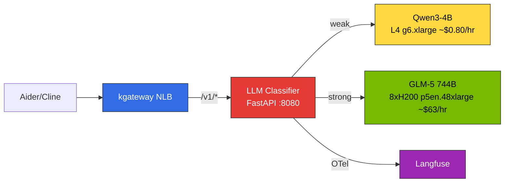
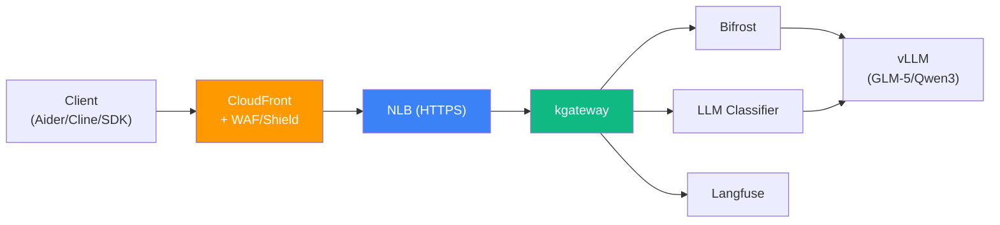
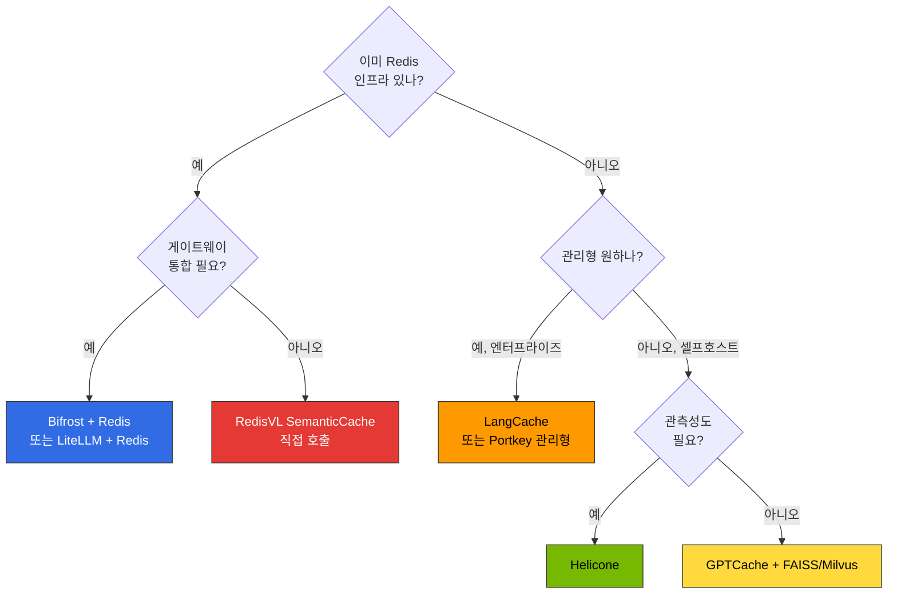

이 문서는 프로덕션 환경을 위한 고급 구성을 다룹니다. 프롬프트 기반 자동 라우팅(LLM Classifier), 보안 레이어(CloudFront + WAF/Shield), 비용 최적화(Semantic Caching)를 추가하여 완전한 추론 파이프라인을 완성합니다.

:::tip 소요 시간
**학습**: 45분 | **배포**: 60-90분
:::

:::info 사전 요구 사항
이 문서의 구성 요소는 [기본 배포](./basic-deployment.md)가 완료된 환경을 전제로 합니다. kgateway, HTTPRoute, Bifrost가 정상 동작하는지 먼저 확인하세요.
:::

---

## LLM Classifier 배포 {#llm-classifier-배포}

### 1.1 아키텍처 개요

LLM Classifier는 kgateway 뒤에서 동작하는 **Python FastAPI 기반 경량 라우터**입니다. 클라이언트(Aider, Cline 등)의 OpenAI 호환 요청을 받아 프롬프트 내용을 분석하고, weak(SLM) 또는 strong(LLM) 백엔드로 자동 프록시합니다.



**핵심 특징:**
- 클라이언트는 `model: "auto"` (또는 임의 모델명)로 요청 — 모델 선택을 인식하지 못함
- 키워드 매칭 + 토큰 길이 + 대화 턴 수 기반 분류
- Langfuse OTel SDK로 직접 trace 전송
- 50MB 미만 컨테이너 이미지 (FastAPI + httpx)

### 1.2 분류 로직 (extproc_http.py)

```python
"""LLM Classifier — 프롬프트 기반 자동 모델 라우팅"""
import os, httpx
from fastapi import FastAPI, Request
from fastapi.responses import StreamingResponse

app = FastAPI()

# --- 분류 설정 ---
STRONG_KEYWORDS = [
    "리팩터", "아키텍처", "설계", "분석", "최적화", "디버그", "마이그레이션",
    "refactor", "architect", "design", "analyze", "optimize", "debug",
    "migration", "complex", "performance", "security", "review",
]
TOKEN_THRESHOLD = 500
TURN_THRESHOLD = 5

# --- 백엔드 설정 ---
WEAK_URL = os.getenv("WEAK_BACKEND", "http://qwen3-serving:8000")
STRONG_URL = os.getenv("STRONG_BACKEND", "http://glm5-serving:8000")

def classify(messages: list[dict]) -> str:
    """프롬프트 내용 분석 → weak / strong 결정"""
    content = " ".join(
        m.get("content", "") for m in messages if m.get("content")
    )
    lower = content.lower()
    # 1. 키워드 매칭
    if any(kw in lower for kw in STRONG_KEYWORDS):
        return "strong"
    # 2. 입력 길이
    if len(content) > TOKEN_THRESHOLD:
        return "strong"
    # 3. 대화 턴 수
    if len(messages) > TURN_THRESHOLD:
        return "strong"
    return "weak"

@app.api_route("/v1/{path:path}", methods=["POST"])
async def proxy(path: str, request: Request):
    body = await request.json()
    messages = body.get("messages", [])
    tier = classify(messages)
    backend = STRONG_URL if tier == "strong" else WEAK_URL
    target = f"{backend}/v1/{path}"

    async with httpx.AsyncClient(timeout=300) as client:
        if body.get("stream"):
            req = client.build_request("POST", target, json=body)
            resp = await client.send(req, stream=True)
            return StreamingResponse(
                resp.aiter_bytes(),
                status_code=resp.status_code,
                headers=dict(resp.headers),
            )
        resp = await client.post(target, json=body)
        return resp.json()
```

:::tip Langfuse OTel 연동
위 코드에 OpenTelemetry SDK를 추가하면 분류 결정 + 백엔드 응답 시간을 Langfuse에 직접 기록할 수 있습니다. `opentelemetry-sdk`, `opentelemetry-exporter-otlp` 패키지를 설치하고 `OTEL_EXPORTER_OTLP_ENDPOINT`를 Langfuse OTLP 엔드포인트로 설정하세요.
:::

### 1.3 Dockerfile

```dockerfile
FROM python:3.11-slim
RUN pip install --no-cache-dir fastapi uvicorn httpx
COPY extproc_http.py /app/
WORKDIR /app
CMD ["uvicorn", "extproc_http:app", "--host", "0.0.0.0", "--port", "8080", "--workers", "2"]
```

```bash
# 빌드 및 ECR 푸시
docker buildx build --platform linux/amd64 \
  -t <ACCOUNT_ID>.dkr.ecr.us-east-2.amazonaws.com/llm-classifier:latest \
  --push .
```

### 1.4 K8s Deployment + Service

```yaml
apiVersion: apps/v1
kind: Deployment
metadata:
  name: llm-classifier
  namespace: ai-inference
spec:
  replicas: 2
  selector:
    matchLabels:
      app: llm-classifier
  template:
    metadata:
      labels:
        app: llm-classifier
    spec:
      containers:
      - name: classifier
        image: <ACCOUNT_ID>.dkr.ecr.us-east-2.amazonaws.com/llm-classifier:latest
        ports:
        - containerPort: 8080
          name: http
        env:
        - name: WEAK_BACKEND
          value: "http://qwen3-serving.ai-inference.svc.cluster.local:8000"
        - name: STRONG_BACKEND
          value: "http://glm5-serving.ai-inference.svc.cluster.local:8000"
        resources:
          requests:
            cpu: 250m
            memory: 256Mi
          limits:
            cpu: 500m
            memory: 512Mi
        readinessProbe:
          httpGet:
            path: /docs
            port: 8080
          initialDelaySeconds: 5
          periodSeconds: 10
        livenessProbe:
          httpGet:
            path: /docs
            port: 8080
          initialDelaySeconds: 10
          periodSeconds: 30
---
apiVersion: v1
kind: Service
metadata:
  name: llm-classifier
  namespace: ai-inference
spec:
  selector:
    app: llm-classifier
  ports:
  - name: http
    port: 8080
    targetPort: 8080
  type: ClusterIP
```

### 1.5 kgateway HTTPRoute 설정

kgateway에서 `/v1/*` 경로를 LLM Classifier로 라우팅합니다. 기본 배포의 vLLM 직접 라우팅 또는 Bifrost 경유 라우팅 대신 사용합니다.

```yaml
apiVersion: gateway.networking.k8s.io/v1
kind: HTTPRoute
metadata:
  name: llm-classifier-route
  namespace: ai-inference
spec:
  parentRefs:
    - name: unified-gateway
      namespace: ai-gateway
  rules:
    - matches:
        - path:
            type: PathPrefix
            value: /v1/
      backendRefs:
        - name: llm-classifier
          port: 8080
      timeouts:
        request: 300s
        backendRequest: 300s
```

:::caution 타임아웃 설정
LLM 추론은 수십 초가 소요될 수 있습니다. `timeouts.request`와 `backendRequest`를 충분히 설정하세요 (GLM-5 744B 기준 최소 120s, 권장 300s).
:::

### 1.6 Aider/Cline 연결

LLM Classifier를 사용하면 **모든 클라이언트가 단일 엔드포인트**로 접속합니다. 모델명은 임의값이 가능합니다 (Classifier가 무시하고 프롬프트 기반으로 분류).

#### Aider

```bash
# LLM Classifier 자동 분기 — double-prefix 불필요
OPENAI_API_BASE="http://<NLB_ENDPOINT>/v1" \
OPENAI_API_KEY="dummy" \
aider --model openai/auto
```

#### Cline

Settings -> API Provider -> OpenAI Compatible
- Base URL: `http://<NLB_ENDPOINT>/v1`
- Model: `auto`
- API Key: `dummy`

#### Python 클라이언트

```python
from openai import OpenAI

client = OpenAI(
    base_url="http://<NLB_ENDPOINT>/v1",
    api_key="dummy"
)

# 단순 요청 → Qwen3-4B (자동)
response = client.chat.completions.create(
    model="auto",
    messages=[{"role": "user", "content": "Hello"}]
)

# 복잡한 요청 → GLM-5 744B (자동)
response = client.chat.completions.create(
    model="auto",
    messages=[{"role": "user", "content": "이 코드를 리팩터링하고 아키텍처를 분석해줘"}]
)
```

:::info Bifrost 대비 장점
Bifrost 경유 시 필요했던 `provider/model` 포맷 (`openai/glm-5`)과 Aider double-prefix 트릭 (`openai/openai/glm-5`)이 **완전히 불필요**합니다. 모든 클라이언트가 동일한 `model: "auto"`로 접속하면 됩니다.
:::

### 1.7 라우팅 엔드포인트 구조 (LLM Classifier 포함)

```
http://<NLB_ENDPOINT>/v1/*           → LLM Classifier → Qwen3-4B 또는 GLM-5 (자동 분기)
http://<NLB_ENDPOINT>/langfuse/*     → Langfuse (Observability UI)
http://<NLB_ENDPOINT>/_next/*        → Langfuse (Static Assets)
http://<NLB_ENDPOINT>/api/public/*   → Langfuse (API + OTel)
https://<AMG_ENDPOINT>               → Grafana (별도 관리형)
```

---

## 2. Gateway API Inference Extension (InferencePool + EPP) {#inference-extension}

LLM Classifier·Bifrost가 "어느 **모델**인가"(L1, across-model)를 정한다면, **Gateway API Inference Extension(GIE)** 은 "어느 **Pod**인가"(L2, within-model)를 vLLM 실시간 메트릭(KV cache 위치·부하)으로 결정합니다. kgateway(Envoy 기반)가 매 요청마다 **EPP(Endpoint Picker)** 에 `ext-proc`로 위임해 InferencePool 내 최적 Pod를 고릅니다. 레이어 정의·선택 기준은 [라우팅 전략 — 두 개의 라우팅 레이어](../../../model-serving/inference-routing/routing-strategy.md#두-개의-라우팅-레이어--반드시-구분)를 참조하세요.

:::info 버전·상태
GIE는 2025-09 v1.0.0 GA되었고 InferencePool은 `inference.networking.k8s.io/v1`입니다. EPP 코드는 llm-d로 통합되었으며 정책 CRD(`InferenceObjective`)는 llm-d(`llm-d.ai/v1alpha2`, alpha)에 있습니다. GIE 저장소는 InferencePool API + Endpoint Picker Protocol을 담당합니다. ([GIE 문서](https://gateway-api-inference-extension.sigs.k8s.io/))
:::

### 2.1 CRD 설치

InferencePool 등 GIE CRD는 릴리스 매니페스트로 설치합니다.

```bash
# 최신 릴리스 태그 확인: github.com/kubernetes-sigs/gateway-api-inference-extension/releases
export IGW_RELEASE=v1.5.0
kubectl apply -f https://github.com/kubernetes-sigs/gateway-api-inference-extension/releases/download/${IGW_RELEASE}/manifests.yaml
```

### 2.2 InferencePool + EPP 배포 (Helm)

GIE 공식 Helm 차트가 **EPP와 InferencePool을 함께 설치**합니다. `modelServers.matchLabels`로 vLLM Pod를 선택합니다.

```bash
export IGW_CHART_VERSION=${IGW_RELEASE}
export POOL_NAME=glm5-pool

helm install ${POOL_NAME} \
  oci://registry.k8s.io/gateway-api-inference-extension/charts/inferencepool \
  --version ${IGW_CHART_VERSION} \
  --namespace ai-inference \
  --set inferencePool.modelServers.matchLabels.app=glm5-serving \
  --set provider.name=none   # kgateway/Envoy 계열은 none; GKE/Istio 등은 해당 provider 지정
```

:::note provider.name
`provider.name`은 게이트웨이 구현체에 맞춥니다. kgateway는 Envoy 계열이므로 별도 provider 통합 없이 `none`으로 두고 InferencePool/EPP만 배포한 뒤, 아래 HTTPRoute에서 InferencePool을 backend로 참조합니다. 정확한 값과 옵션은 [GIE Getting Started](https://gateway-api-inference-extension.sigs.k8s.io/guides/)에서 배포 시점 기준으로 확인하세요.
:::

차트가 생성하는 InferencePool은 다음 형태입니다(직접 작성 시 참고 — 필드는 `inference.networking.k8s.io/v1` 기준):

```yaml
apiVersion: inference.networking.k8s.io/v1
kind: InferencePool
metadata:
  name: glm5-pool
  namespace: ai-inference
spec:
  selector:
    matchLabels:
      app: glm5-serving       # vLLM Pod 레이블
  targetPorts:
    - number: 8000            # vLLM 컨테이너 포트 (targetPortNumber 아님)
  endpointPickerRef:           # EPP 서비스 참조 (extensionRef 아님)
    name: glm5-pool-epp
    port:
      number: 9002
    failureMode: FailClose     # FailOpen | FailClose(기본)
```

### 2.3 HTTPRoute → InferencePool

HTTPRoute의 `backendRefs`가 Service가 아니라 **InferencePool**(group `inference.networking.k8s.io`)을 가리키도록 합니다. 기본 배포의 vLLM 직접 라우팅 대신 사용합니다.

```yaml
apiVersion: gateway.networking.k8s.io/v1
kind: HTTPRoute
metadata:
  name: inferencepool-route
  namespace: ai-inference
spec:
  parentRefs:
    - name: unified-gateway
      namespace: ai-gateway
  rules:
    - matches:
        - path:
            type: PathPrefix
            value: /v1/
      backendRefs:
        - group: inference.networking.k8s.io
          kind: InferencePool
          name: glm5-pool
      timeouts:
        request: 300s
        backendRequest: 300s
```

### 2.4 검증

```bash
# InferencePool 상태 — Accepted=True, ResolvedRefs=True 확인
kubectl get inferencepool glm5-pool -n ai-inference -o yaml

# EPP Pod/Service 확인
kubectl get pods,svc -n ai-inference -l app.kubernetes.io/name=inferencepool

# 라우팅 테스트 (EPP가 KV-aware로 Pod 선택)
curl -s http://<NLB_ENDPOINT>/v1/models | jq .
```

:::tip L1과 함께 쓰기
across-model 거버넌스(예산·멀티프로바이더·semantic cache)가 필요하면 L1(Bifrost/LiteLLM/LLM Classifier)을 앞단에, KV-aware Pod 선택은 이 InferencePool+EPP(L2)를 뒤에 두어 `L1 → InferencePool(EPP) → vLLM`으로 조합합니다. 단일 self-hosted 모델만 서빙한다면 L1 없이 `kgateway → InferencePool(EPP) → vLLM`만으로 충분합니다.
:::

---

## 3. CloudFront + WAF/Shield 보안 레이어 {#cloudfront-waf}

프로덕션 환경에서는 NLB를 직접 노출하지 않고, **CloudFront + WAF/Shield**를 앞단에 구성하여 DDoS 방어, 요청 필터링, TLS 종단을 수행합니다.

### 아키텍처



### 3.1 NLB TLS 리스너 구성

기존 HTTP Gateway를 HTTPS로 전환합니다. ACM 인증서가 필요합니다.

```bash
# 1. ACM 인증서 요청 (NLB 리전 — us-east-2)
aws acm request-certificate \
  --domain-name "api.your-company.com" \
  --validation-method DNS \
  --region us-east-2

# 2. DNS 검증 완료 후 ARN 확인
export NLB_CERT_ARN=$(aws acm list-certificates --region us-east-2 \
  --query "CertificateSummaryList[?DomainName=='api.your-company.com'].CertificateArn" \
  --output text)
```

Gateway 리소스를 HTTPS로 업데이트:

```yaml
apiVersion: gateway.networking.k8s.io/v1
kind: Gateway
metadata:
  name: unified-gateway
  namespace: ai-gateway
  annotations:
    service.beta.kubernetes.io/aws-load-balancer-type: "external"
    service.beta.kubernetes.io/aws-load-balancer-nlb-target-type: "ip"
    service.beta.kubernetes.io/aws-load-balancer-scheme: "internet-facing"
    # TLS 종단
    service.beta.kubernetes.io/aws-load-balancer-ssl-cert: "${NLB_CERT_ARN}"
    service.beta.kubernetes.io/aws-load-balancer-ssl-ports: "443"
    # SG 제한: CloudFront IP 대역만 허용
    service.beta.kubernetes.io/aws-load-balancer-security-groups: "${CF_RESTRICTED_SG_ID}"
spec:
  gatewayClassName: kgateway
  listeners:
    - name: https
      protocol: HTTPS
      port: 443
      tls:
        mode: Terminate
        certificateRefs:
          - name: nlb-tls-cert
      allowedRoutes:
        namespaces:
          from: All
```

:::warning NLB Security Group 제한
NLB의 Security Group은 **CloudFront Managed Prefix List만 허용**해야 합니다. `0.0.0.0/0` 오픈은 회사 정책에 의해 자동 차단됩니다.

```bash
# CloudFront Managed Prefix List 확인
aws ec2 describe-managed-prefix-lists \
  --filters "Name=prefix-list-name,Values=com.amazonaws.global.cloudfront.origin-facing" \
  --query "PrefixLists[0].PrefixListId" --output text

# SG에 CloudFront prefix list만 허용
aws ec2 authorize-security-group-ingress \
  --group-id ${CF_RESTRICTED_SG_ID} \
  --ip-permissions "IpProtocol=tcp,FromPort=443,ToPort=443,PrefixListIds=[{PrefixListId=${CF_PREFIX_LIST_ID}}]"
```
:::

### 3.2 WAF WebACL 생성

```bash
# WAF WebACL 생성 (CloudFront용은 반드시 us-east-1)
aws wafv2 create-web-acl \
  --name "inference-gateway-waf" \
  --scope CLOUDFRONT \
  --region us-east-1 \
  --default-action '{"Allow":{}}' \
  --rules '[
    {
      "Name": "AWSManagedRulesCommonRuleSet",
      "Priority": 1,
      "Statement": {
        "ManagedRuleGroupStatement": {
          "VendorName": "AWS",
          "Name": "AWSManagedRulesCommonRuleSet"
        }
      },
      "OverrideAction": {"None":{}},
      "VisibilityConfig": {
        "SampledRequestsEnabled": true,
        "CloudWatchMetricsEnabled": true,
        "MetricName": "CommonRuleSet"
      }
    },
    {
      "Name": "RateLimit",
      "Priority": 2,
      "Statement": {
        "RateBasedStatement": {
          "Limit": 2000,
          "AggregateKeyType": "IP"
        }
      },
      "Action": {"Block":{}},
      "VisibilityConfig": {
        "SampledRequestsEnabled": true,
        "CloudWatchMetricsEnabled": true,
        "MetricName": "RateLimit"
      }
    },
    {
      "Name": "AWSManagedRulesKnownBadInputsRuleSet",
      "Priority": 3,
      "Statement": {
        "ManagedRuleGroupStatement": {
          "VendorName": "AWS",
          "Name": "AWSManagedRulesKnownBadInputsRuleSet"
        }
      },
      "OverrideAction": {"None":{}},
      "VisibilityConfig": {
        "SampledRequestsEnabled": true,
        "CloudWatchMetricsEnabled": true,
        "MetricName": "KnownBadInputs"
      }
    }
  ]' \
  --visibility-config '{
    "SampledRequestsEnabled": true,
    "CloudWatchMetricsEnabled": true,
    "MetricName": "InferenceGatewayWAF"
  }'
```

WAF 규칙 구성:

| 규칙 | 용도 | 설정 |
|------|------|------|
| **AWSManagedRulesCommonRuleSet** | SQL Injection, XSS, 일반 공격 방어 | AWS 관리형 |
| **RateLimit** | IP당 요청 제한 | 2,000 req/5min (조정 가능) |
| **KnownBadInputsRuleSet** | Log4j, 알려진 악성 패턴 차단 | AWS 관리형 |

### 3.3 CloudFront 배포 생성

```bash
# NLB DNS 이름 확인
export NLB_DNS=$(kubectl get gateway unified-gateway -n ai-gateway \
  -o jsonpath='{.status.addresses[0].value}')

# CloudFront 배포 생성
aws cloudfront create-distribution \
  --distribution-config "{
    \"CallerReference\": \"inference-gateway-$(date +%s)\",
    \"Origins\": {
      \"Quantity\": 1,
      \"Items\": [{
        \"Id\": \"nlb-origin\",
        \"DomainName\": \"${NLB_DNS}\",
        \"CustomOriginConfig\": {
          \"HTTPPort\": 80,
          \"HTTPSPort\": 443,
          \"OriginProtocolPolicy\": \"https-only\",
          \"OriginSslProtocols\": {\"Quantity\": 1, \"Items\": [\"TLSv1.2\"]}
        }
      }]
    },
    \"DefaultCacheBehavior\": {
      \"TargetOriginId\": \"nlb-origin\",
      \"ViewerProtocolPolicy\": \"https-only\",
      \"AllowedMethods\": {
        \"Quantity\": 7,
        \"Items\": [\"GET\",\"HEAD\",\"OPTIONS\",\"PUT\",\"POST\",\"PATCH\",\"DELETE\"],
        \"CachedMethods\": {\"Quantity\": 2, \"Items\": [\"GET\",\"HEAD\"]}
      },
      \"CachePolicyId\": \"4135ea2d-6df8-44a3-9df3-4b5a84be39ad\",
      \"OriginRequestPolicyId\": \"216adef6-5c7f-47e4-b989-5492eafa07d3\",
      \"Compress\": true
    },
    \"Enabled\": true,
    \"WebACLId\": \"${WAF_ACL_ARN}\",
    \"Comment\": \"Inference Gateway - kgateway + Bifrost\",
    \"PriceClass\": \"PriceClass_200\",
    \"ViewerCertificate\": {
      \"CloudFrontDefaultCertificate\": true
    }
  }"
```

:::tip 캐시 정책 (관리형 정책 사용 — ForwardedValues와 혼용 불가)
LLM 추론 API(`/v1/chat/completions`)는 **POST 요청**이므로 CloudFront에서 캐시되지 않습니다. 관리형 `CachingDisabled` 캐시 정책(`4135ea2d-6df8-44a3-9df3-4b5a84be39ad`)과 관리형 `AllViewer` origin request 정책(`216adef6-5c7f-47e4-b989-5492eafa07d3`)을 사용하면 모든 헤더·쿼리·쿠키가 Origin에 전달됩니다.

**주의**: `CachePolicyId`와 레거시 `ForwardedValues`는 **동시에 지정할 수 없습니다**(CloudFront API가 거부). 관리형 정책을 쓰면 `ForwardedValues` 블록은 넣지 않습니다. Langfuse 정적 자산(`/_next/*`)만 캐시 혜택을 받습니다.
:::

### 3.4 Shield Standard

CloudFront 배포에는 **AWS Shield Standard가 자동으로 적용**됩니다 (추가 비용 없음). L3/L4 DDoS 방어가 포함됩니다.

대규모 서비스의 경우 Shield Advanced($3,000/월) 업그레이드를 고려하세요:
- L7 DDoS 방어
- AWS DDoS Response Team(DRT) 지원
- WAF 비용 면제
- 비용 보호 (DDoS로 인한 스케일링 비용 환불)

### 3.5 클라이언트 엔드포인트 변경

배포 완료 후 CloudFront 도메인으로 접근합니다:

```bash
# CloudFront 도메인 확인
export CF_DOMAIN=$(aws cloudfront list-distributions \
  --query "DistributionList.Items[?Comment=='Inference Gateway - kgateway + Bifrost'].DomainName" \
  --output text)

echo "Endpoint: https://${CF_DOMAIN}/v1"
```

**IDE/클라이언트 설정 변경**:

```bash
# Aider
OPENAI_API_BASE="https://${CF_DOMAIN}/v1" \
OPENAI_API_KEY="dummy" \
aider --model openai/auto

# Python SDK
from openai import OpenAI
client = OpenAI(
    base_url=f"https://{CF_DOMAIN}/v1",
    api_key="dummy"
)
```

### 3.6 검증

```bash
# 1. CloudFront → NLB → kgateway 경로 확인
curl -s https://${CF_DOMAIN}/v1/models | jq .

# 2. WAF 동작 확인 (SQL Injection 패턴 차단)
curl -s -o /dev/null -w "%{http_code}" \
  "https://${CF_DOMAIN}/v1/models?id=1%20OR%201=1"
# 예상: 403 (WAF 차단)

# 3. Rate Limit 확인 (2000 req/5min 초과)
for i in $(seq 1 100); do
  curl -s -o /dev/null -w "%{http_code}\n" \
    https://${CF_DOMAIN}/v1/models &
done

# 4. NLB 직접 접근 차단 확인 (SG가 CF prefix만 허용)
curl -s -o /dev/null -w "%{http_code}" \
  "https://${NLB_DNS}/v1/models"
# 예상: timeout (직접 접근 불가)
```

### 3.7 연결 경로 요약

```
변경 전: Client → NLB (HTTP, 퍼블릭) → kgateway → Bifrost → vLLM
변경 후: Client → CloudFront (HTTPS, WAF/Shield) → NLB (HTTPS, CF만 허용) → kgateway → Bifrost → vLLM
```

| 구간 | 프로토콜 | 보안 |
|------|---------|------|
| Client → CloudFront | HTTPS (TLS 1.2+) | WAF 규칙 + Shield Standard + Rate Limit |
| CloudFront → NLB | HTTPS (TLS 1.2) | SG: CloudFront Prefix List만 허용 |
| NLB → kgateway | HTTP (클러스터 내부) | VPC 내부 통신, NetworkPolicy |
| kgateway → Bifrost/vLLM | HTTP (클러스터 내부) | Service 간 통신 |

---

## 4. Semantic Caching 구현 옵션 (Advanced) {#semantic-caching-구현-옵션-advanced}

:::info 개념 및 설계 원칙
Semantic Caching의 개념, 유사도 임계값 설계, 캐시 키 구조, 관측성 전략은 [Semantic Caching 전략](../../../model-serving/inference-optimization/semantic-caching-strategy.md)을 참조하세요. 이 섹션은 실제 구현을 위한 도구 비교와 배포 설정을 다룹니다.
:::

### 4.1 구현 도구 비교 (2026-04 기준)

공식 문서와 레포지토리 기준으로 정리한 주요 옵션입니다. 기능이 빠르게 변경되므로 배포 시점에 공식 문서를 다시 확인하세요.

| 도구 | 라이선스 | 백엔드 | 주요 장점 | 한계 | 공식 자료 |
|------|----------|--------|---------|------|----------|
| **GPTCache** | OSS (MIT) | Redis / Milvus / FAISS / SQLite | 다양한 백엔드, 어댑터 풍부, 초기부터 Semantic Cache에 특화 | 2024 이후 릴리스 빈도 감소, LangChain/LiteLLM에 비해 커뮤니티 주도 | [GitHub](https://github.com/zilliztech/GPTCache) |
| **Redis Semantic Cache (RedisVL)** | OSS (MIT) | Redis Stack / Redis 8+ | 기존 Redis 인프라 재사용, `SemanticCache` 클래스 네이티브 제공, 벡터 검색 내장 | 임베딩 파이프라인과 TTL 정책은 애플리케이션이 직접 구성 | [RedisVL — Semantic Cache](https://redis.io/docs/latest/develop/ai/redisvl/user_guide/semantic_caching/) |
| **Portkey** | SaaS + Self-host (OSS Gateway, Apache 2.0) | 내장 스토어 / Redis | 게이트웨이 일체형 (라우팅/가드레일/캐시 통합), Virtual Keys로 멀티테넌트 | 고급 기능은 관리형 플랜 의존, 셀프호스트 구성 복잡 | [Portkey Semantic Cache](https://docs.portkey.ai/docs/product/ai-gateway/cache-simple-and-semantic) |
| **Helicone** | OSS (Apache 2.0) / SaaS | ClickHouse(관측성) + Redis/S3(캐시) | 관측성·로깅과 캐시 통합, Rust 게이트웨이로 저지연 | 셀프호스트 풀스택은 의존성 많음, 캐시 기본은 exact-match (Semantic은 고급 기능) | [Helicone Caching](https://docs.helicone.ai/features/advanced-usage/caching) |
| **Bifrost** | OSS (Apache 2.0) | Redis | Go 기반 저지연, 라우팅 룰로 캐시 키 커스터마이징, 기존 Bifrost 배포 재사용, 네이티브 semantic_cache 플러그인 (direct + semantic 모드) | v1.5.0+ 필요, vector store 설정(Redis/Weaviate/Qdrant/Pinecone) | [Bifrost Semantic Caching](https://docs.getbifrost.ai/features/semantic-caching) |
| **LangCache (Redis)** | 관리형 SaaS (Redis Cloud) | Redis Cloud | 완전관리형, 임베딩 모델·거버넌스 포함, Free 30MB 데이터베이스 포함 | Public Preview (2025-09~, 2026-07 현재 GA 아님), 리전 제약 | [Redis LangCache](https://redis.io/docs/latest/develop/ai/context-engine/langcache/) |

### 4.2 도구 선택 결정 트리



### 4.3 시나리오별 추천

| 시나리오 | 추천 조합 | 이유 |
|----------|----------|------|
| **기존 EKS + Redis 운영** | Bifrost + Redis + RedisVL | 신규 벤더 도입 없이 기존 인프라 재사용 |
| **관리형 + 규정 준수** | Portkey 관리형 또는 LangCache | SOC2/HIPAA 등 인증, 운영 부담 최소 |
| **관측성 우선** | Helicone | 캐시·라우팅·로그를 단일 제품에서 |
| **초기 PoC / 프로토타입** | LiteLLM + Redis (`cache: true`) | 설정 1-2줄로 활성, 빠른 검증 |
| **오픈소스 강한 제약** | GPTCache + Milvus | 벤더 락인 없음, 백엔드 선택 자유 |

### 4.4 Gateway별 통합 패턴

#### LiteLLM

기본 활성화 (exact-match):

```yaml
# litellm_config.yaml
litellm_settings:
  cache: true
  cache_params:
    type: "redis"
    host: "redis-service.default.svc.cluster.local"
    port: 6379
```

Semantic Cache 활성화:

```yaml
litellm_settings:
  cache: true
  cache_params:
    type: "redis-semantic"          # 시맨틱 캐시 타입 (basic 캐시는 "redis")
    similarity_threshold: 0.85       # 유사도 임계값
    redis_semantic_cache_embedding_model: "text-embedding-3-small"  # model_list에 정의된 임베딩 모델명
    host: "redis-service.default.svc.cluster.local"
    port: 6379
```

:::note 임베딩 모델 사전 정의
`redis_semantic_cache_embedding_model` 값은 `model_list`에 등록된 임베딩 모델 이름이어야 합니다. 정확한 파라미터는 [LiteLLM Caching 문서](https://docs.litellm.ai/docs/proxy/caching)에서 배포 시점 기준으로 확인하세요.
:::

자세한 옵션은 [LiteLLM Caching 문서](https://docs.litellm.ai/docs/proxy/caching) 참조.

#### Bifrost 네이티브 Semantic Cache

Bifrost v1.5.0+는 네이티브 `semantic_cache` 플러그인을 제공하여 direct(hash, exact-match) 모드와 semantic(임베딩 유사도) 모드를 모두 지원합니다. 별도 프록시나 사이드카 없이 config.json 설정만으로 활성화할 수 있습니다.

**config.json 설정 예시 (Redis 백엔드)**:

```json
{
  "plugins": [
    {
      "enabled": true,
      "name": "semantic_cache",
      "config": {
        "provider": "openai",
        "embedding_model": "text-embedding-3-small",
        "dimension": 1536,
        "threshold": 0.8,
        "vector_store": {
          "type": "redis",
          "url": "redis://redis-service:6379"
        }
      }
    }
  ]
}
```

**주요 설정 항목**:
- `provider`: 임베딩 모델 제공자 (openai, anthropic, bedrock 등)
- `embedding_model`: 임베딩 모델명
- `dimension`: 임베딩 차원 (text-embedding-3-small은 1536). `dimension: 1`로 설정 시 exact-match 전용 모드
- `threshold`: 유사도 임계값 (0.8 = 80% 이상 유사 시 캐시 히트)
- `vector_store.type`: redis, weaviate, qdrant, pinecone, valkey 지원

Web UI에서도 Settings → Caching에서 토글로 활성화 가능합니다.

**Exact-match 전용 모드** (임베딩 불필요, 속도 우선):
```json
{
  "plugins": [
    {
      "enabled": true,
      "name": "semantic_cache",
      "config": {
        "dimension": 1,
        "vector_store": {
          "type": "redis",
          "url": "redis://redis-service:6379"
        }
      }
    }
  ]
}
```

상세 설정은 [Bifrost Semantic Caching 문서](https://docs.getbifrost.ai/features/semantic-caching)를 참조하세요.

#### Portkey

Portkey는 게이트웨이 일체형으로 캐시를 내장 지원합니다.

```typescript
import Portkey from "portkey-ai";

const portkey = new Portkey({
  apiKey: "YOUR_PORTKEY_API_KEY",
  config: {
    cache: {
      mode: "semantic",
      max_age: 3600,  // TTL 1시간
    },
    strategy: {
      mode: "fallback",
      targets: [
        { provider: "openai", model: "gpt-4o" },
        { provider: "anthropic", model: "claude-sonnet-4" },
      ],
    },
  },
});

const response = await portkey.chat.completions.create({
  messages: [{ role: "user", content: "Hello" }],
  model: "gpt-4o",
});
```

Virtual Keys와 결합하여 테넌트별 캐시 정책 분리도 가능합니다. 상세는 [Portkey Semantic Cache 문서](https://docs.portkey.ai/docs/product/ai-gateway/cache-simple-and-semantic) 참조.

#### Helicone

Helicone은 요청 헤더로 캐시를 제어합니다.

```bash
curl https://oai.helicone.ai/v1/chat/completions \
  -H "Authorization: Bearer YOUR_OPENAI_KEY" \
  -H "Helicone-Auth: Bearer YOUR_HELICONE_KEY" \
  -H "Helicone-Cache-Enabled: true" \
  -H "Helicone-Cache-Seed: prod-v1" \
  -d '{
    "model": "gpt-4o",
    "messages": [{"role": "user", "content": "Hello"}]
  }'
```

Semantic 모드는 고급 기능으로, [Helicone Caching 문서](https://docs.helicone.ai/features/advanced-usage/caching)에서 확인하세요.

### 4.5 캐시 키 설계 예시 (YAML)

실제 구현에서 캐시 키를 생성하는 의사 코드 예시입니다.

```yaml
# 캐시 키 생성 로직 (의사 코드)
cache_key_components:
  model_id: "glm-5"                      # 모델 종류
  system_prompt_hash: "a3f2e1b"          # 시스템 프롬프트 SHA256 (8자)
  tenant_id: "org-12345"                 # 조직/테넌트
  language: "ko"                         # 언어
  tool_set_hash: "c9d8e7f"               # 에이전트 도구 집합 해시
  embedding: [0.12, -0.34, ...]         # 사용자 질의 임베딩 (벡터 DB 저장)

# Redis key 포맷
redis_key: "cache:org-12345:ko:glm-5:a3f2e1b:c9d8e7f"
# 벡터 DB에서 embedding 유사도 검색 → 임계값 이상 HIT 시 redis_key로 응답 조회
```

### 4.6 배포 전 점검 사항

- [ ] 임계값 초기값 0.90 설정 (보수적 시작)
- [ ] TTL 정책 문서화 (도메인별 차등 적용)
- [ ] Guardrails(PII redaction) 가 캐시 **앞**에 배치되었는지 확인
- [ ] Langfuse 트레이스에 `cache_hit`, `similarity_score` 태그 추가
- [ ] Redis 장애 시 fail-open 시나리오 검증
- [ ] A/B 테스트로 점진적 롤아웃 (트래픽 10% → 50% → 100%)

---

## 다음 단계

고급 기능 구성이 완료되었습니다. 다음 단계로 진행하세요:

1. **문제 해결**: 배포 중 오류가 발생했다면 [트러블슈팅 가이드](./troubleshooting-guide.md)를 참조하세요.
2. **모니터링 강화**: [Langfuse 배포 가이드](../../integrations/monitoring-observability-setup.md)를 참조하여 OTel 연동과 대시보드를 완성하세요.
3. **운영 프로세스**: [Agent 모니터링](../../../operations-mlops/observability/agent-monitoring.md)을 참조하여 프로덕션 운영 체계를 수립하세요.

---

## 참고 자료

- [트러블슈팅 가이드](./troubleshooting-guide.md) - LLM Classifier·Semantic Caching 등 고급 기능 오류 진단과 해결
- [기본 배포](./basic-deployment.md) - kgateway, HTTPRoute, Bifrost 기본 구성
- [Semantic Caching 전략](../../../model-serving/inference-optimization/semantic-caching-strategy.md) - 개념, 임계값 설계, 관측성, 도메인별 패턴
- [추론 게이트웨이 라우팅](../../../model-serving/inference-routing/routing-strategy.md) - kgateway 아키텍처 및 라우팅 전략
- [Langfuse 배포 가이드](../../integrations/monitoring-observability-setup.md) - Helm 설치, OTel 연동, Redis/ClickHouse 구성
- [Agent 모니터링](../../../operations-mlops/observability/agent-monitoring.md) - Langfuse 아키텍처 및 컴포넌트
