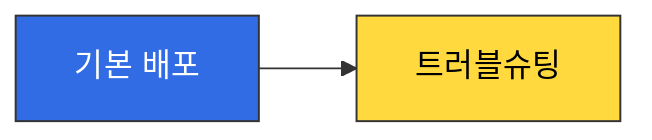
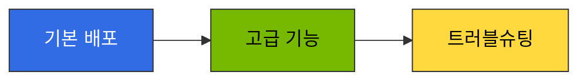

import { useColorMode } from '@docusaurus/theme-common';
import { useEffect, useRef } from 'react';

export const InferencePipelineDiagram = () => {
  const { colorMode } = useColorMode();
  const iframeRef = useRef(null);
  useEffect(() => {
    if (iframeRef.current && iframeRef.current.contentWindow) {
      iframeRef.current.contentWindow.postMessage(
        { type: 'theme-change', theme: colorMode },
        '*'
      );
    }
  }, [colorMode]);
  return (
    <iframe
      ref={iframeRef}
      src={`/engineering-playbook/agentic-platform-architecture.html?theme=${colorMode}`}
      style={{width: '100%', height: '1600px', border: 'none', borderRadius: '12px'}}
      title="프로덕션 추론 파이프라인 아키텍처"
      loading="lazy"
    />
  );
};

이 문서는 kgateway + Bifrost 기반 추론 게이트웨이의 **실전 배포 절차**를 다룹니다. 아키텍처 개념과 라우팅 전략(Cascade, Semantic Router, 2-Tier 구조)은 [추론 게이트웨이 라우팅](../routing-strategy.md)을 참조하세요.

:::info 가이드 구성
이 가이드는 3개 문서로 구성됩니다. 순차적으로 학습하거나, 필요한 섹션만 선택하여 참조하세요.
:::

## 프로덕션 추론 파이프라인 참조 아키텍처

EKS Auto Mode 기반 프로덕션 추론 파이프라인의 전체 요청 흐름입니다. CloudFront(WAF/Shield) → NLB → kgateway ExtProc가 프롬프트를 분석하여 LLM 라우팅을 결정하고, Bifrost 거버넌스 레이어와 llm-d KV Cache-aware 라우팅을 거쳐 최적의 모델에 요청을 전달합니다.

<InferencePipelineDiagram />

---

## 배포 단계 개요

## 배포 단계 개요

### [기본 배포](./basic-deployment.md) (필수)

단일 NLB 엔드포인트 뒤에서 kgateway + HTTPRoute + Bifrost를 구성하여 기본 추론 파이프라인을 완성합니다.

**포함 내용:**
- kgateway 설치 및 Gateway API CRD 구성
- GatewayClass, Gateway, HTTPRoute 리소스 정의
- ReferenceGrant를 통한 크로스 네임스페이스 접근
- Bifrost Gateway Mode 구성 (config.json + PVC)
- provider/model 포맷 및 IDE 호환성 (Aider, Cline, Continue.dev)
- SQLite 초기화 절차 (config.json 변경 시)

**학습 시간:** 30분 | **배포 시간:** 45분

---

### [고급 기능](./advanced-features.md) (선택)

프롬프트 기반 자동 라우팅, 프로덕션 보안 레이어, Semantic Caching을 추가하여 비용 최적화와 보안을 강화합니다.

**포함 내용:**
- LLM Classifier 배포 (프롬프트 기반 SLM/LLM 자동 분기)
- CloudFront + WAF/Shield 보안 레이어
- Semantic Caching 구현 옵션 (GPTCache, RedisVL, Portkey, Helicone)

**학습 시간:** 45분 | **배포 시간:** 60-90분

---

### [트러블슈팅](./troubleshooting-guide.md) (참조)

배포 및 운영 중 발생하는 일반적인 문제와 해결 방법을 다룹니다.

**포함 내용:**
- 404 Not Found (HTTPRoute/Gateway 설정 오류)
- Bifrost provider/model 에러
- Bifrost 모델명 정규화 문제
- Langfuse Sub-path 404
- OTel Trace 미도착

**참조 빈도:** 배포 시 또는 문제 발생 시

---

## 학습 경로

### 빠른 시작 (개발/테스트 환경)

1. [기본 배포](./basic-deployment.md)로 kgateway + Bifrost 구성
2. 문제 발생 시 [트러블슈팅](./troubleshooting-guide.md) 참조

**소요 시간:** 1-2시간

---

### 프로덕션 구성 (완전한 파이프라인)

1. [기본 배포](./basic-deployment.md)로 기본 인프라 구성
2. [고급 기능](./advanced-features.md)에서 LLM Classifier + CloudFront/WAF + Semantic Caching 추가
3. 운영 중 [트러블슈팅](./troubleshooting-guide.md) 참조

**소요 시간:** 3-4시간

---

## 사전 준비 사항

모든 배포 단계를 진행하기 전에 다음을 확인하세요.

### 필수 요구 사항

- [x] EKS 클러스터 (K8s 1.32+, DRA 1.35 GA)
- [x] kubectl 설치 및 클러스터 접근 권한
- [x] Helm 3.x 설치
- [x] vLLM 또는 llm-d 기반 모델 서빙 Pod 배포 완료

### 권장 사항

- AWS Load Balancer Controller 설치 (NLB 자동 생성)
- Langfuse 배포 완료 ([Langfuse 배포 가이드](../../integrations/monitoring-observability-setup.md) 참조)
- 프로덕션 환경: ACM 인증서 발급 (CloudFront + TLS용)

---

## 다음 단계

- **시작하기**: [기본 배포](./basic-deployment.md)로 이동하여 kgateway 설치를 시작하세요.
- **아키텍처 이해**: 배포 전 [추론 게이트웨이 라우팅](../routing-strategy.md)을 읽고 전체 구조를 파악하세요.
- **모니터링 준비**: [Langfuse 배포 가이드](../../integrations/monitoring-observability-setup.md)를 참조하여 관측성 스택을 구성하세요.

---

## 참고 자료

- [추론 게이트웨이 라우팅](../routing-strategy.md) - kgateway 아키텍처 및 라우팅 전략 상세
- [Langfuse 배포 가이드](../../integrations/monitoring-observability-setup.md) - Helm 설치, OTel 연동, Redis/ClickHouse 구성
- [Agent 모니터링](../../../operations-mlops/observability/agent-monitoring.md) - Langfuse 아키텍처 및 컴포넌트
- [Kubernetes Gateway API 공식 문서](https://gateway-api.sigs.k8s.io/)
- [kgateway 공식 문서](https://kgateway.dev/docs/)
- [Bifrost 공식 문서](https://bifrost.dev/docs)
