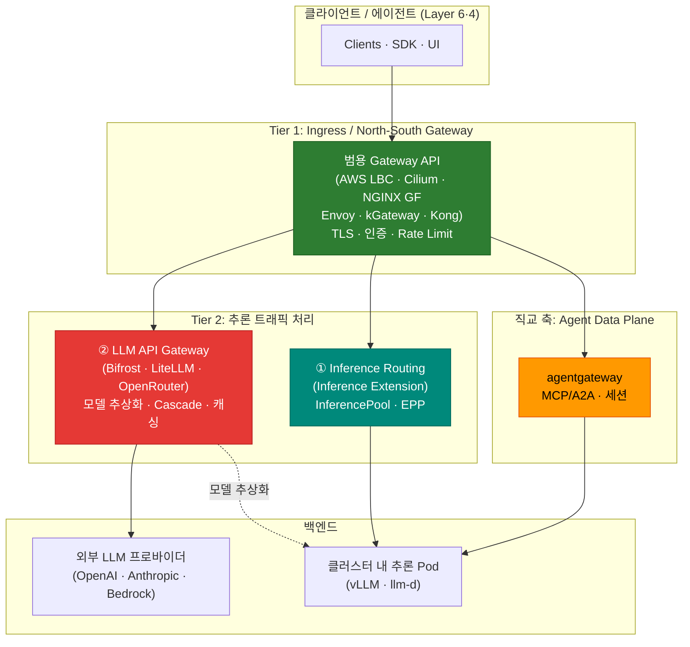

import Tabs from '@theme/Tabs';
import TabItem from '@theme/TabItem';

> 📅 **작성일**: 2026-06-17 | **수정일**: 2026-06-17 | ⏱️ **읽는 시간**: 약 9분

## 개요

Agentic AI 플랫폼의 게이트웨이 계층은 서로 다른 책임을 가진 여러 컴포넌트로 구성됩니다. 그동안 "추론 게이트웨이(Inference Gateway)"라는 용어가 **클러스터 내 추론 Pod 라우팅**과 **외부 LLM 프로바이더 프록시**라는 두 가지 다른 대상을 동시에 가리켜 혼동이 있었습니다. 이 문서는 게이트웨이 계층의 **용어와 역할을 단일하게 정의**하고, 각 계층을 어떤 솔루션으로 채울지 판단 기준을 제공합니다.

이 문서는 **정의와 지도(map)** 에 집중합니다. 각 계층의 상세 비교·배포 절차는 본문 링크로 연결되는 전용 문서를 참조하세요.

:::info 이 문서의 위치
게이트웨이 계층은 [플랫폼 아키텍처](../../design-architecture/foundations/agentic-platform-architecture.md)의 **Layer 5 (Gateway & Routing)** 에 해당합니다. 요청 흐름은 Layer 6(진입) → Layer 5(게이트웨이) → Layer 4(Agent)로 내려가며, Agent가 추론을 요청하면 다시 Layer 5를 거쳐 Layer 2(모델 서빙)를 호출합니다.
:::

## 게이트웨이 계층 정의

플랫폼 전역에서 다음 용어를 사용합니다. "추론 게이트웨이"라는 모호한 표현 대신, 클러스터 내 라우팅과 LLM API 프록시를 **명시적으로 구분**합니다.

| 계층 | 명칭 | 역할 | 대표 구현체 |
|------|------|------|-------------|
| **Tier 1** | Ingress / North-South Gateway | 외부 트래픽 수신, TLS 종료, 경로 라우팅, 인증, Rate Limiting | AWS LBC · Cilium · NGINX GF · Envoy Gateway · kGateway · Kong |
| **Tier 2 ①** | Inference Routing (in-cluster) | 클러스터 내 추론 Pod 그룹으로 라우팅, KV 캐시·부하 인지 엔드포인트 선택 | Gateway API **Inference Extension** (InferencePool · EPP) |
| **Tier 2 ②** | LLM API Gateway (provider proxy) | 외부/내부 모델 추상화, 모델 선택·Cascade, 비용 추적, Semantic Caching | Bifrost · LiteLLM · OpenRouter · Portkey · Helicone · Kong AI Gateway |
| **직교 축** | Agent Data Plane | MCP/A2A 프로토콜, stateful 세션, 도구 라우팅 | agentgateway |

:::tip 핵심 구분 — Tier 2 ① vs ②
- **Tier 2 ① Inference Routing**은 **클러스터 내부**에서 동작합니다. HTTPRoute가 InferencePool을 백엔드로 참조하고, EPP(Endpoint Picker)가 KV 캐시·부하를 고려해 vLLM/llm-d Pod 엔드포인트를 고릅니다. 자체 호스팅 모델 인프라를 다룹니다.
- **Tier 2 ② LLM API Gateway**는 **모델 API를 추상화**합니다. OpenAI 호환 API로 외부 프로바이더(OpenAI·Anthropic·Bedrock)나 자체 모델을 단일 인터페이스로 노출하고, 복잡도 기반 Cascade·비용 추적·캐싱을 수행합니다.
- 둘은 **배타적이지 않습니다.** 자체 호스팅 추론은 ①로, 외부 프로바이더 통합은 ②로 처리하는 하이브리드 구성이 일반적입니다.
:::

`Agent Data Plane`(agentgateway)은 Tier가 아니라 **직교하는 축**입니다. HTTP 트래픽이 아닌 AI 전용 프로토콜(MCP/A2A)과 stateful 세션을 다루므로, Tier 1~2와 같은 선형 계층으로 묶지 않습니다.

## 전체 구조

## 각 계층을 무엇으로 채우나

각 계층의 솔루션 선정·상세 비교·배포 절차는 전용 문서에서 다룹니다. 이 표는 **어디를 읽어야 하는지**에 대한 지도입니다.

| 계층 | 무엇으로 채우나 | 상세 참조 |
|------|----------------|-----------|
| **Tier 1** Ingress | 6개 범용 Gateway API 구현체 비교·선정 | [Gateway API 도입 가이드](/docs/eks-best-practices/networking-performance/gateway-api-adoption-guide) (EKS Best Practices) |
| **Tier 2 ①** Inference Routing | Gateway API Inference Extension (InferencePool·EPP) | [라우팅 전략 — Gateway API Inference Extension](./routing-strategy.md#gateway-api-inference-extension) |
| **Tier 2 ②** LLM API Gateway | Bifrost·LiteLLM·OpenRouter 등 비교 및 Cascade/Semantic 전략 | [라우팅 전략 — LLM Gateway 솔루션 비교](./routing-strategy.md#llm-gateway-솔루션-비교) · [배포 가이드](./setup/) |
| **Agent Data Plane** | agentgateway (MCP/A2A) | [라우팅 전략 — agentgateway 데이터 플레인](./routing-strategy.md#agentgateway-데이터-플레인) |

:::note Tier 1과 Tier 2의 관계
**Tier 1(범용 게이트웨이)** 은 EKS 네트워킹 관점에서 깊이 다루며, NGINX Ingress 은퇴 대응을 포함한 North-South 트래픽 전반을 책임집니다. **Tier 2** 는 그 위에서 추론 트래픽에 특화된 라우팅을 담당합니다. 대부분의 Agentic 플랫폼은 Tier 1과 Tier 2를 **함께** 구성하며, 두 계층을 어떤 솔루션 조합으로 채울지가 설계의 핵심입니다.
:::

## 트래픽 플로우 예시

- **외부 LLM 호출**: Client → Tier 1(kgateway) → Tier 2 ②(Bifrost/LiteLLM, Cascade·캐시) → 외부 프로바이더 → 응답 + 비용 기록
- **자체 호스팅 추론**: Client → Tier 1(kgateway) → Tier 2 ①(InferencePool·EPP) → vLLM/llm-d Pod → 응답
- **에이전트 도구 호출**: Client → Tier 1(kgateway) → Agent Data Plane(agentgateway, MCP/A2A) → 도구·세션

## 참고 자료

### 공식 문서
- [Kubernetes Gateway API](https://gateway-api.sigs.k8s.io/) — Tier 1 범용 게이트웨이 표준
- [Gateway API Inference Extension](https://gateway-api-inference-extension.sigs.k8s.io/) — Tier 2 ① 클러스터 내 추론 라우팅(InferencePool·EPP)

### 관련 문서 (내부)
- [추론 게이트웨이 & LLM Gateway 라우팅 전략](./routing-strategy.md) — Tier 2 솔루션 비교·Cascade·Semantic 전략
- [Inference Gateway 배포 가이드](./setup/) — Tier 2 배포 절차(Helm·HTTPRoute·OTel)
- [Gateway API 도입 가이드](/docs/eks-best-practices/networking-performance/gateway-api-adoption-guide) — Tier 1 범용 게이트웨이 6종 비교·선정
- [플랫폼 아키텍처](../../design-architecture/foundations/agentic-platform-architecture.md) — Layer 5(Gateway & Routing) 정의
