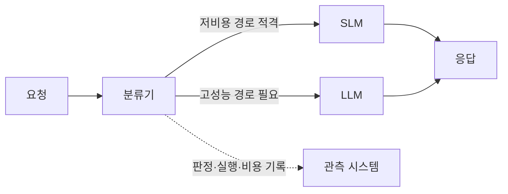
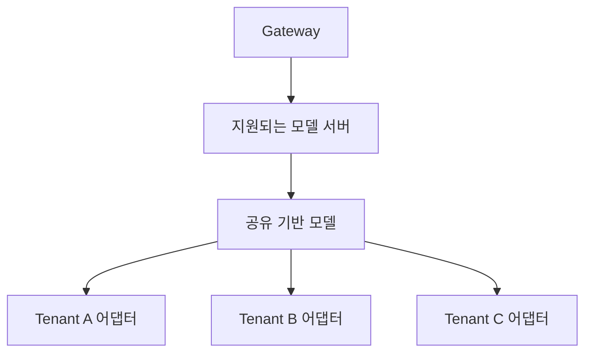

## 개요

AI 코딩 도구를 엔터프라이즈 환경에서 활용하려면 **IDE 연동**, **비용 최적화**, **데이터 주권** 세 가지를 고려해야 합니다. 이 문서는 Aider, Cline, Continue.dev 등 주요 코딩 도구를 자체 호스팅 LLM과 연결하는 방법과, Bedrock vs Kiro vs 자체 호스팅의 비용 분석을 제공합니다.

### 왜 자체 호스팅 연동이 필요한가?

| 제약 | SaaS (Kiro, Copilot) | 자체 호스팅 |
|------|---------------------|-----------|
| **데이터 주권** | 서비스별 데이터 처리·계약 확인 | VPC·외부 호출·접근 정책을 직접 검증 |
| **커스터마이징** | 제공 모델만 사용 | ✅ LoRA Fine-tuning |
| **비용 제어** | 구독·사용량 등 서비스별 과금 | 실제 용량·라우팅·청구량으로 검증 |
| **Observability** | 제한적 | ✅ Langfuse 완전 제어 |

:::tip 핵심 전략
**LLM Classifier**를 kgateway 뒤에 배포하면, 클라이언트는 단일 엔드포인트(`/v1`)만 사용하고 프롬프트 내용에 따라 SLM(Qwen3-4B)/LLM(GLM-5)이 자동 선택됩니다. Langfuse로 라우팅·실행·비용을 추적합니다. 절감 효과는 모델 품질, 요청 분포, fallback과 실제 청구 용량을 함께 측정한 뒤 판단합니다.
:::

---

## IDE/코딩 도구 연결

### 2.1 LLM Classifier 자동 분기 (권장)

**LLM Classifier**를 사용하면 모든 클라이언트가 **단일 엔드포인트**로 접속하고, 프롬프트 내용에 따라 SLM/LLM이 자동 선택됩니다. 수동 모델 선택이 불필요합니다.

| 도구 | LLM Classifier 호환 | 설정 방법 |
|------|---------------------|----------|
| **Aider** | ✅ | `OPENAI_API_BASE=http://<NLB>/v1 aider --model openai/auto` |
| **Cline** | ✅ | Model: `auto`, Base URL: `http://<NLB>/v1` |
| **Continue.dev** | ✅ | model: `auto`, apiBase: `http://<NLB>/v1` |
| **Cursor** | ✅ | 모델명에 `/` 불필요 — `auto` 사용 |

:::tip Bifrost 대비 호환성 개선
Bifrost 경유 시 필요했던 `provider/model` 포맷 (`openai/glm-5`)과 Aider double-prefix 트릭 (`openai/openai/glm-5`)이 **완전히 불필요**합니다. Cursor도 모델명 `/` 제약 없이 사용 가능합니다.
:::

### 2.2 Aider 연결 예시

[Aider](https://aider.chat)는 Git-aware 코드 수정 + 자동 커밋을 지원하는 오픈소스 CLI 도구입니다.

```bash
# Aider 설치
pip install aider-chat

# LLM Classifier 자동 분기 — 단일 엔드포인트, 모델 자동 선택
OPENAI_API_BASE="http://<NLB_ENDPOINT>/v1" \
OPENAI_API_KEY="dummy" \
aider --model openai/auto
```

:::info 자동 모델 분기
`model: "auto"`로 요청하면 LLM Classifier가 프롬프트 내용을 분석하여 자동으로 SLM(Qwen3-4B) 또는 LLM(GLM-5 744B)을 선택합니다. 이는 두 모델을 배포한 예제의 라우팅 의도입니다. 실제 모델 선택과 비용은 분류 결과, fallback 및 배포 용량으로 확인합니다.
:::

#### Aider 권장 이유

1. **Git 통합**: 변경사항을 자동으로 커밋하고, diff 기반으로 수정 범위를 최소화
2. **CLI 기반**: CI/CD 파이프라인에서도 활용 가능
3. **OpenAI-Compatible**: 모든 OpenAI 호환 엔드포인트 지원
4. **자동 Cascade**: LLM Classifier 경유 시 프롬프트 기반 자동 모델 선택 + Langfuse 기록

### 2.3 Continue.dev 설정 예시

Continue.dev는 VSCode/JetBrains용 AI 코딩 어시스턴트입니다.

```json
{
  "models": [
    {
      "title": "Auto (LLM Classifier)",
      "provider": "openai",
      "model": "auto",
      "apiBase": "http://<NLB_ENDPOINT>/v1",
      "apiKey": "dummy"
    }
  ]
}
```

### 2.4 Cline 설정 예시

Cline은 VSCode용 AI 코딩 도구입니다.

Settings -> API Provider -> OpenAI Compatible
- Base URL: `http://<NLB_ENDPOINT>/v1`
- Model: `auto`
- API Key: `dummy`

---

## 라우팅 아키텍처 비교

### 3.1 LLM Classifier vs Bifrost

| 항목 | **LLM Classifier (권장)** | **Bifrost** |
|------|--------------------------|------------|
| **적합 환경** | 자체 호스팅 vLLM cascade | 외부 프로바이더 통합 (OpenAI/Anthropic) |
| **모델명 포맷** | `auto` (임의값 가능) | `provider/model` 강제 |
| **프롬프트 분석** | ✅ body 직접 접근 | ⚠️ body 직접 접근 불가, 단 Complexity Router의 complexity_tier로 프롬프트 기반 라우팅 가능 |
| **멀티 백엔드** | ✅ WEAK/STRONG URL 분리 | ❌ provider당 단일 base_url |
| **Aider 호환** | ✅ 트릭 불필요 | ⚠️ double-prefix 필요 |
| **Cursor 호환** | ✅ | ❌ 슬래시 불가 |
| **이미지 크기** | ~50MB | ~100MB |

:::info Bifrost는 언제 사용하나?
Bifrost는 **외부 LLM 프로바이더**(OpenAI, Anthropic, Bedrock) 통합, failover, rate limiting에 최적화되어 있습니다. 자체 호스팅 vLLM 간의 지능형 cascade에는 LLM Classifier를 사용하세요. 두 가지를 함께 사용할 수도 있습니다 (외부는 Bifrost, 자체는 LLM Classifier).
:::

### 3.2 클라이언트 요청 예시 (LLM Classifier)

```python
from openai import OpenAI

client = OpenAI(
    base_url="http://<NLB_ENDPOINT>/v1",
    api_key="dummy"
)

# 단순 요청 → 자동으로 Qwen3-4B
response = client.chat.completions.create(
    model="auto",  # 모델명 무관 — Classifier가 프롬프트 분석
    messages=[{"role": "user", "content": "Hello, how are you?"}]
)

# 복잡한 요청 → 자동으로 GLM-5 744B
response = client.chat.completions.create(
    model="auto",
    messages=[{"role": "user", "content": "이 코드를 리팩터링하고 아키텍처를 분석해줘"}]
)
```

---

## Kiro vs 자체 호스팅 비교

2026년 4월, [Kiro IDE에서 GLM-5를 네이티브 지원](https://kiro.dev/changelog/models/glm-5-now-available-in-kiro)하기 시작했습니다. 선택 가능한 모델과 크레딧 소비는 현재 서비스 설정과 [과금 안내](https://kiro.dev/docs/billing/)에서 확인합니다.

### 기능 비교

| | **Kiro 호스팅** | **자체 호스팅 (EKS + vLLM)** |
|---|---|---|
| **인프라** | Kiro/AWS 관리 | 직접 운영 (EKS + GPU 노드) |
| **비용** | 구독·크레딧 실제 소비량 | 청구 노드시간과 전체 인프라·운영 비용 |
| **LoRA Fine-tuning** | ❌ 불가 | ✅ 도메인 특화 커스터마이징 |
| **데이터 주권** | 서비스의 데이터 처리·계약 확인 | 데이터 경로와 접근 정책을 직접 설계·검증 |
| **컴플라이언스** | 서비스 범위와 고객 책임 확인 | 통제 구현·감사 증거를 직접 준비 |
| **Observability** | Kiro 대시보드 | ✅ Langfuse + AMP/AMG 완전 제어 |
| **게이트웨이** | 없음 | ✅ Bifrost (guardrails, caching) |
| **Steering/Spec** | ✅ 네이티브 | 별도 구현 필요 |
| **커스텀 엔드포인트** | ❌ Kiro 모델 목록만 | ✅ 자유 설정 |
| **시작 난이도** | 즉시 | 높음 |

:::tip 자체 호스팅이 필요한 경우
- **FSI/규제 산업**: 데이터가 외부 서비스를 경유할 수 없는 환경 (VPC 격리 필수)
- **LoRA Fine-tuning**: COBOL→Java 전환, 사내 프레임워크 코드 생성 등 도메인 특화
- **멀티 고객 운영**: 고객별 LoRA 어댑터 핫스왑 + Bifrost 라우팅
- **완전한 Observability**: 모든 trace/metric을 자체 Langfuse + AMP로 수집
:::

:::info Kiro가 적합한 경우
- 인프라 구성 없이 GLM-5를 빠르게 프로토타이핑
- Kiro Steering/Spec 네이티브 워크플로우 활용
- GPU 인프라 운영 부담을 줄이려는 소규모 팀
:::

---

## 비용 Threshold 분석: Bedrock vs Kiro vs 자체 호스팅

비교 단위는 **같은 품질·지연·가용성 조건을 충족한 작업의 총비용**입니다. 요청 수만으로 서로 다른 모델, 토큰 길이, 운영시간을 비교하면 손익분기점이 달라집니다. 아래 금액은 계산 방법을 설명하기 위한 가정이며, 특정 모델·리전의 가격표나 운영 측정값이 아닙니다.

### 5.1 과금 단위와 입력값[^1] {#51-토큰당-비용-2026-04-17-기준}

| 방식 | 확인할 과금 단위 | 비교에 필요한 입력 |
|------|-----------------|-------------------|
| Bedrock On-Demand | 모델·리전·추론 방식별 입력/출력 토큰 등 | 실제 토큰 사용량, 캐시 처리, 재시도, 부가 기능 비용 |
| Bedrock Provisioned Throughput | 프로비저닝한 모델 용량과 시간·약정 | 유휴시간을 포함한 청구 용량, 약정 조건 |
| Kiro | 구독과 크레딧 사용량 | 선택한 플랜, 모델, 실제 작업별 크레딧과 추가 구매 |
| 자체 호스팅 | 노드 운영시간과 주변 인프라 | GPU/CPU, 스토리지, 네트워크, 관측·운영 비용과 처리 용량 |

[Bedrock 가격 정책](https://aws.amazon.com/bedrock/pricing/)과 [Kiro 과금 안내](https://kiro.dev/docs/billing/)에서 선택한 구성의 과금 단위를 확인하세요. Kiro 크레딧은 작업 복잡도와 모델에 따라 달라지므로 **1 credit = 1 요청 = 일정 토큰 수**로 환산하지 않습니다. 실측한 총비용을 완료 작업 수로 나눈 값은 해당 표본의 유효 단가일 뿐, 제공업체의 토큰 가격이 아닙니다.

### 5.2 자체 호스팅 고정 비용

월 비용을 `C_self(Q) = F + v × Q`로 단순화할 수 있습니다. `F`는 해당 구성의 월 고정비, `v`는 요청당 추가 비용, `Q`는 같은 조건의 완료 요청 수입니다. 노드를 추가해야 하는 구간에서는 `F`도 증가하므로 구간별로 다시 계산합니다.

| 비용 항목 | 포함할 내용 |
|-----------|-------------|
| 컴퓨팅 | GPU/CPU 노드의 실제 청구시간, 유휴·예비 용량, 기동·모델 적재 시간 |
| 플랫폼 | EKS, 스토리지, 로드밸런서, NAT·데이터 전송 등 사용한 서비스 |
| 라우팅·캐시 | 분류기, fallback·재시도, 임베딩, 캐시 저장·조회 |
| 운영 | 관측 데이터, 보안 통제, 장애 대응과 운영 인력의 배분 비용 |

Pod를 줄여도 노드가 계속 실행되면 GPU 청구비용은 줄지 않습니다. 업무시간 운영은 실제 노드 운영시간과 비업무시간의 서비스 요구를 함께 검증해야 합니다. 고정비·변동비를 중복 집계하지 않도록 각 비용 항목을 한 번만 배분합니다.

### 5.3 월 요청량별 비용 비교 (USD)

**가정**: API의 요청당 비용 `c_api = $0.0026`, 자체 호스팅 월 고정비 `F = $8,900`, 요청당 추가 비용 `v = $0.0004`입니다. API 단가는 가상의 입력 $1/백만 토큰·출력 $3.20/백만 토큰과 요청당 1,000 입력·500 출력 토큰으로 계산했습니다. 실제 상품 가격을 나타내지 않습니다.

| 월 완료 요청 `Q` | API: `0.0026 × Q` | 자체 호스팅: `8,900 + 0.0004 × Q` |
|-----------------|------------------|---------------------------------|
| 50,000 | $130 | $8,920 |
| 500,000 | $1,300 | $9,100 |
| 1,000,000 | $2,600 | $9,300 |
| 5,000,000 | $13,000 | $10,900 |

이 표는 산술 예제입니다. 해당 요청량을 같은 품질·지연 조건으로 처리할 용량이 입증된 것은 아닙니다. Kiro는 이 토큰 단가에 끼워 넣지 않고, 실제 작업 표본의 크레딧과 구독 총액으로 별도 비교합니다.

### 5.4 손익분기점

같은 처리 용량 구간에서 `c_api > v`일 때만 `Q_break_even = F / (c_api − v)`를 계산할 수 있습니다. 위 가정에서는 약 **4,045,455 요청/월**입니다. 추가 노드, 가용성 요구, 할인·약정 또는 토큰 분포가 달라지면 다시 계산해야 합니다. `c_api ≤ v`이면 이 단순 모델에는 자체 호스팅의 비용 손익분기점이 없습니다.


---

## 비용 최적화 옵션 {#비용-최적화-옵션-bedrockkiro에서-불가능}

적용 가능한 기능은 제공업체, 모델, 엔진과 버전에 따라 다릅니다. 캐시나 라우팅 최적화를 자체 호스팅만의 기능으로 가정하지 말고, 선택한 서비스의 지원 범위를 확인합니다.

### 6.1 최적화 옵션 비교

| 최적화 | 확인할 효과 | 비용·품질 경계 |
|--------|-------------|----------------|
| **업무시간 운영** | 실제 청구 노드시간 감소 | 모델 적재 시간, 예비 용량, 비업무시간 서비스 포함 |
| **Cascade Routing** | 적격 요청의 저비용 경로 전환 | 분류 오류, fallback, 품질, 양쪽 용량의 실제 비용 포함 |
| **KV Cache Aware Routing** | 동일 prefix 재사용에 따른 prefill 감소 | 적중률·퇴출·부하 불균형과 TTFT 분포 측정 |
| **Semantic Caching** | 적격 캐시 적중의 모델 호출 회피 | 캐시·임베딩 비용, 응답 정확성, 권한·만료 검증 |
| **Spot Instance** | 선택한 인스턴스의 실제 구매 비용 감소 | 가용 용량, 중단, 재시도·복구 비용 포함 |
| **Multi-LoRA 공유** | 지원 모델의 기반 용량 공유 | 어댑터 메모리·동시성·테넌트 격리 검증 |

### 6.2 Cascade Routing 아키텍처 (LLM Classifier)



분류 비율은 측정값입니다. 단순한 키워드·문자 수 기준은 평가용 시작점이며, 모델 선택이나 품질을 보장하지 않습니다. 모델명, 라우터 버전, 분류 기준과 fallback 정책을 고정하고 실제 요청 집합으로 평가합니다.

#### Cascade 비용 분석

**가상의 비례 비용 예제**: 동일한 요청 집합을 전부 SLM으로 처리할 때 $500, 전부 LLM으로 처리할 때 $8,900이고, 각 비용이 요청 비율에 완전히 비례한다고 가정합니다. SLM 70%·LLM 30%이면 `0.70 × 500 + 0.30 × 8,900 = $3,020`이고 산술상 감소율은 약 **66.07%**입니다.

이 계산을 고정 GPU 풀에 그대로 적용할 수는 없습니다. 두 풀이 각각 월 $500과 $8,900으로 계속 실행된다면 합계는 **$9,400**이며, 트래픽을 나눈다고 $3,020이 되지 않습니다. 비례 예제는 분류기, 캐시, fallback, 재시도, 전환·운영 비용도 제외합니다. 실제 노드시간이나 API 청구량이 어떻게 줄었는지 확인한 뒤 절감률을 계산합니다.

정확도는 비용 비율로 유도하지 않습니다. [Cascade Routing 튜닝](../../model-serving/inference-routing/cascade-routing-tuning.md)의 동일 표본·품질·지연·비용 검증 기준을 사용하고, 승인된 결과가 없으면 기대 효과와 측정 결과를 구분합니다.

### 6.3 Semantic Caching

선택한 게이트웨이 버전이 지원하는 캐시 설정을 확인한 뒤 적용합니다. 유사도 임계값 하나만으로 응답의 정확성을 보장할 수 없습니다.

- tenant·권한·모델·prompt 버전을 캐시 경계에 반영하고, 만료·무효화·민감 데이터 처리를 검증합니다.
- 적중/미적중별 지연, 잘못된 재사용, 임베딩·저장·조회 비용을 함께 측정합니다.
- 모델 호출을 피한 요청도 캐시 비용이 발생할 수 있고, 실행 중인 GPU의 고정비는 남습니다.

### 6.4 KV Cache Aware Routing

동일 prefix의 재사용은 prefill 작업을 줄일 수 있습니다. 효과는 엔진 지원, 적중률, 요청 길이, 캐시 퇴출과 스케줄링에 따라 달라지므로 고정 TTFT 감소율을 전제하지 않습니다.

모델 서버의 prefix cache와 라우터의 cache-aware 스케줄링은 서로 다른 구성입니다. 검증되지 않은 단일 Deployment 인자로 합치지 말고 [llm-d EKS Auto Mode](../../model-serving/inference-frameworks/llm-d-eks-automode.md)의 버전별 구성을 확인합니다. 같은 부하에서 TTFT·처리량·오류를 비교하고, 노드 수를 실제로 줄인 경우에만 그 비용 감소를 반영합니다.

### 6.5 Multi-LoRA 공유

선택한 기반 모델과 서빙 엔진이 LoRA를 지원하는지 먼저 확인합니다. 지원되는 구성에서는 기반 모델 용량을 공유할 수 있지만, 어댑터 메모리와 동시성 때문에 고객 수에 반비례하는 비용을 보장할 수는 없습니다.



어댑터 선택 권한, 동시 부하, 적재·퇴출과 테넌트별 품질을 검증합니다. 모델별 지원 범위와 구현 절차는 [커스텀 모델 파이프라인](../model-lifecycle/custom-model-pipeline.md)을 참고하세요.

---

## 선택 기준 요약

| 요구 | 비교할 기준 |
|------|-------------|
| IDE의 관리형 작업 흐름 | Kiro의 기능·모델·실제 크레딧 소비와 구독 총액 |
| API 기반 연동 | 선택한 Bedrock 모델과 추론 방식의 품질·토큰·부가 비용 |
| 자체 모델·어댑터 제어 | 지원되는 서빙 구성, 운영 역량, 전체 인프라 비용 |
| Cascade·캐시 도입 | 같은 작업 집합의 품질·지연·비용과 fallback·격리 |
| 규제·데이터 경계 | 서비스별 데이터 경로, 계약·설정·감사 증거 |

고정 비용은 무제한 처리 용량을 의미하지 않습니다. 요청량만으로 “가장 저렴한” 플랫폼을 정하지 말고, 피크 동시성·토큰 분포·가용성·운영 책임을 만족하는 구성끼리 비교합니다. 배포 및 비용 승인에 필요한 실제 검증은 별도로 수행합니다.

---

[^1]: 제공업체별 최신 과금 정책을 확인하되, 아래 산술 예제의 가정과 구분합니다. 운영 결과와 견적은 별도의 증거가 필요합니다.

## 다음 단계

아래 단계는 작업 순서이며 검증된 소요시간을 의미하지 않습니다. 기존 플랫폼, 보안 검토, 지원 모델과 담당자 준비 상태에 맞춰 완료 기준과 일정을 정합니다.

### Phase 1: 기본 연동 {#phase-1-기본-연동-1일}
- [ ] kgateway + Bifrost + Langfuse 배포
- [ ] Aider 연결 테스트
- [ ] Langfuse 대시보드 확인

### Phase 2: 비용 최적화 {#phase-2-비용-최적화-1주}
- [ ] SLM 배포 (g6.xlarge)
- [ ] Bifrost Cascade 설정
- [ ] Semantic Caching 활성화

### Phase 3: 도메인 특화 {#phase-3-도메인-특화-2-4주}
- [ ] LoRA Fine-tuning 데이터 수집
- [ ] QLoRA 학습 (NeMo/Unsloth)
- [ ] Multi-LoRA 배포

### Phase 4: 고급 최적화 (선택)
- [ ] llm-d prefix-cache aware routing
- [ ] 8시간/일 CronJob 스케줄링
- [ ] Multi-LoRA 고객별 라우팅

---

## 참고 자료

### 공식 문서

| 자료 | 링크 |
|------|------|
| Aider 공식 문서 | [aider.chat](https://aider.chat) |
| Continue.dev 문서 | [continue.dev](https://www.continue.dev/) |
| Bifrost Gateway | [Bifrost](https://www.getmaxim.ai/bifrost) |
| Langfuse Observability | [langfuse.com](https://langfuse.com/) |
| Kiro 가격 정책 | [kiro.dev/pricing](https://kiro.dev/pricing) |
| AWS Bedrock Pricing | [aws.amazon.com/bedrock/pricing](https://aws.amazon.com/bedrock/pricing/) |
| OpenAI Pricing | [platform.openai.com/pricing](https://platform.openai.com/pricing) |
| Anthropic Pricing | [anthropic.com/pricing](https://www.anthropic.com/pricing) |
| 커스텀 모델 배포 가이드 | [custom-model-deployment.md](../model-lifecycle/custom-model-deployment.md) |
| 커스텀 모델 파이프라인 | [custom-model-pipeline.md](../model-lifecycle/custom-model-pipeline.md) |
| Inference Gateway | [inference-gateway-routing.md](../../model-serving/inference-routing/routing-strategy.md) |
