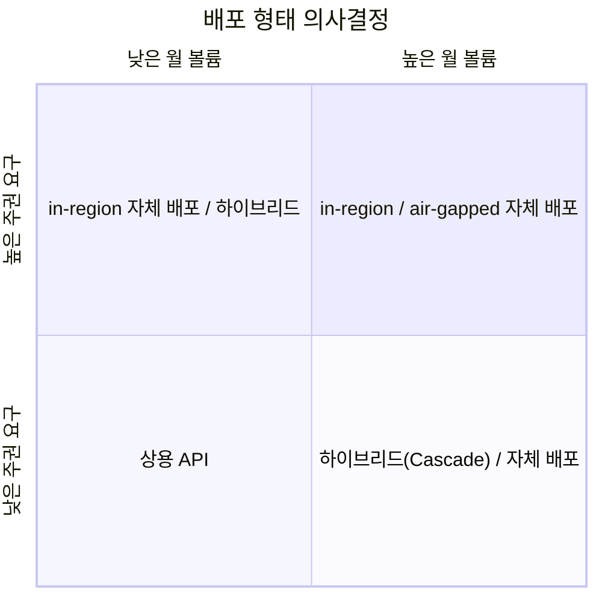
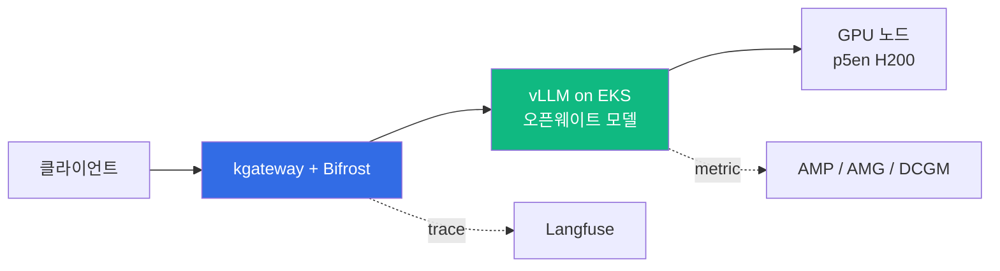

## 개요

이 문서는 오픈웨이트(open-weight) 대형 언어 모델을 상용 API 대신 자체 배포(self-host)할지 결정하려는 고객을 위한 의사결정 가이드입니다. 두 가지 가치 동인을 중심으로 다룹니다. 첫째는 **토큰 이코노믹스(Token Economics)**로, 상용 API의 토큰당 과금과 자체 배포의 고정비 구조 사이의 손익분기(break-even)입니다. 둘째는 **데이터 주권(Data Sovereignty)**으로, 데이터와 추론이 통제된 리전·VPC 경계를 벗어나지 않아야 하는 규제 요구입니다. 대상 독자는 금융·공공 등 규제 산업의 아키텍트와 의사결정자입니다.

이 문서는 의사결정과 트레이드오프에 집중합니다. 상위 플랫폼 선택 프레임은 [AI 플랫폼 선택 가이드](../../design-architecture/platform-selection/ai-platform-decision-framework.md), 비용 수치의 상세 산출은 [코딩 도구 비용 분석](./coding-tools-cost-analysis.md), 배포 구현 절차는 [커스텀 모델 배포 가이드](../model-lifecycle/custom-model-deployment.md)를 참조합니다.

---

## 배경: 왜 지금 오픈웨이트인가

오픈웨이트 모델은 가중치를 공개해 자체 인프라에서 추론할 수 있는 모델입니다. 2026년 들어 라이선스와 성능 양면에서 자체 배포 결정의 전제가 바뀌었습니다.

- **허용적 라이선스 확산**: 다수 플래그십 오픈웨이트 모델이 MIT 또는 Apache 2.0으로 배포됩니다. 예를 들어 Z.ai의 GLM-5.2는 MIT 라이선스로 공개되었습니다([Z.ai blog](https://z.ai/blog/glm-5.2)). 라이선스 제약이 자체 배포·상용 활용의 장애였던 시기와 구분됩니다.
- **프런티어급 성능 근접**: 오픈웨이트 모델의 코딩·추론 벤치마크가 상용 모델과의 격차를 좁혔습니다. 단, 벤치마크 수치는 출처·평가 조건에 따라 달라지므로 도입 전 자체 워크로드로 검증해야 합니다.
- **상용 API 의존의 한계**: 토큰 단가는 볼륨이 커질수록 비용을 선형 증가시킵니다. 또한 프롬프트·출력이 외부 서비스를 경유하므로 데이터 주권 요구를 충족하기 어렵습니다.

:::info 모델 명명·버전 검증
모델 스펙과 버전은 빠르게 변합니다. 이 문서의 모델 예시는 작성 시점(2026-06) 공개 정보 기준이며, 도입 전 해당 모델 카드와 추론 엔진 호환성을 재확인해야 합니다.
:::

---

## 기둥 1 — 토큰 이코노믹스

### 과금 구조의 차이

상용 API와 자체 배포는 비용이 발생하는 방식이 다릅니다.

| 구분 | 상용 API | 자체 배포(EKS + vLLM) |
|------|----------|----------------------|
| 비용 모델 | 토큰당 종량제(per-token) | GPU 시간당 고정비 |
| 볼륨 민감도 | 사용량에 선형 비례 | 볼륨 무관(용량 한도 내) |
| 초기 비용 | 없음 | GPU·운영 셋업 |
| 한계 비용 | 요청마다 발생 | 0에 수렴(용량 내) |

상용 API는 저볼륨에서 유리하고, 자체 배포는 일정 볼륨을 넘으면 토큰당 실효 단가가 낮아집니다. 교차점이 손익분기입니다.

### 손익분기 분석

손익분기의 상세 시뮬레이션(월 요청량별 비용표, Cascade·Spot 절감 효과)은 [코딩 도구 비용 분석](./coding-tools-cost-analysis.md)에 정리되어 있습니다. 핵심 기준선만 요약하면 다음과 같습니다.

- 상용 API 대비 자체 배포 24/7 운영의 손익분기는 월 수백만 요청 규모에서 형성됩니다.
- Cascade Routing(단순 요청은 SLM, 복잡 요청만 대형 모델)을 적용하면 손익분기 볼륨이 크게 낮아집니다.
- 업무시간(8시간/일)만 운영하거나 Spot 인스턴스를 쓰면 고정비 자체가 내려갑니다.

오픈웨이트 모델 일반에 이 로직을 적용할 때 변수는 **모델 처리량**과 **GPU 요구량**입니다. 같은 GPU 예산에서 처리량이 높을수록 토큰당 단가가 낮아집니다.

### 숨은 비용

자체 배포의 총소유비용(TCO)은 GPU 청구액만이 아닙니다. 의사결정 시 다음을 포함해야 합니다.

- **엔지니어링·운영 인력**: 배포·업그레이드·장애 대응을 위한 FTE. 모델 교체와 추론 엔진 버전 관리가 지속됩니다.
- **콜드 스타트**: 대형 모델은 가중치가 수백 GB입니다. 첫 기동 시 다운로드·로드 시간이 가용성에 영향을 줍니다.
- **GPU 유휴**: 트래픽이 없을 때의 GPU 비용. EKS의 scale-to-zero로 유휴 비용을 줄일 수 있으나, 콜드 스타트와 상충하므로 균형이 필요합니다.

AIDLC 관점의 TCO 산정 프레임은 [엔터프라이즈 비용 추정](../../../aidlc/enterprise/cost-estimation.md)을 참조합니다.

### 성능이 곧 단가

자체 배포에서는 추론 성능 최적화가 직접 토큰당 단가를 낮춥니다. 동일 GPU에서 처리량이 오르면 같은 비용으로 더 많은 토큰을 생성하기 때문입니다. 주요 레버는 다음과 같습니다.

- **양자화(Quantization)**: FP8·INT4 가중치는 필요한 GPU 메모리와 GPU 수를 줄입니다. 다만 품질 손실 가능성이 있어 워크로드별 검증이 필요합니다. 공식 체크포인트와 커뮤니티 양자화본의 신뢰성은 구분해야 합니다(아래 주의 참조).
- **vLLM 엔진 튜닝**: PagedAttention, FP8 KV cache, prefix caching, chunked prefill, Multi-Token Prediction(MTP) 기반 speculative decoding이 처리량을 높입니다. `--gpu-memory-utilization`, `--max-num-batched-tokens`, `--max-num-seqs`, `--max-model-len`은 동시성과 메모리 사용을 조정하는 핵심 플래그입니다. 개념 상세는 [vLLM 모델 서빙](../../model-serving/inference-frameworks/vllm-model-serving.md)을 참조합니다.
- **로컬 NVMe 스토리지**: 인스턴스 스토어(NVMe SSD)를 모델 캐시로 쓰면 콜드 스타트와 KV 오프로드가 빨라집니다. 노드 프로비저닝 방식에 따라 사용 가능 여부가 갈립니다(아래 인프라 항목).
- **EFA(Elastic Fabric Adapter)**: 멀티노드 분산 추론에서 노드 간 KV 전송 대역폭을 결정합니다. 단일노드 추론에는 영향이 없습니다(노드 내부는 NVLink/NVSwitch 사용).

:::caution 커뮤니티 양자화본 검증
HuggingFace에는 서드파티가 올린 양자화 체크포인트가 다수 존재합니다. 출처·캘리브레이션·라이선스를 확인하지 않은 가중치를 프로덕션에 사용하면 품질·보안 리스크가 있습니다. 가능하면 모델 제공자의 공식 양자화본을 우선 사용하고, 커뮤니티 양자화본은 자체 평가 후 채택합니다.
:::

---

## 기둥 2 — 데이터 주권

### 주권 요구 4단계

데이터 주권 요구는 단일 기준이 아니라 스펙트럼입니다. [AI 플랫폼 선택 가이드](../../design-architecture/platform-selection/ai-platform-decision-framework.md)는 이를 네 단계로 구분합니다.

| 주권 수준 | 추론 위치 | 권장 접근 |
|----------|----------|----------|
| Public | 리전 제약 없음 | 상용 API / AWS Native |
| In-country | 국내 리전 고정 | 리전 강제 + in-region 자체 배포 |
| Hybrid | 온프레미스 + in-country | EKS Hybrid Nodes + 자체 배포 |
| Air-gapped | 완전 격리 | 온프레미스 EKS 전용 |

요구 강도가 높을수록 매니지드 의존도는 낮아지고 자체 배포·온프레미스 비중이 커집니다. SCP 리전 강제와 EKS Hybrid Nodes 구현은 [소버린 & 하이브리드 배포](../../design-architecture/platform-selection/sovereign-hybrid-deployment.md)를 참조합니다.

### 자체 배포가 보장하는 것

오픈웨이트 모델의 자체 배포는 주권 요구에 다음을 제공합니다.

- **데이터·추론의 경계 내 처리**: 프롬프트·출력·임베딩이 통제된 VPC와 리전을 벗어나지 않습니다.
- **외부 미전송**: 추론 트래픽이 외부 모델 제공자로 나가지 않으므로, 데이터 반출 경로 자체가 제거됩니다.
- **감사 가능성**: 추론 트레이스·접근 로그를 자체 시스템에 보관해 감사 요구에 대응합니다.

### 한국 규제 적용

전자금융감독규정·ISMS-P·SOC2·ISO27001을 AI 운영에 매핑한 상세 통제는 [엔터프라이즈 컴플라이언스 프레임워크](../../operations-mlops/governance/compliance-framework.md)에 정리되어 있습니다. 배포 형태 선택 관점에서 핵심은 다음과 같습니다.

- 리전 내 자체 배포는 데이터 위치·접근통제 요건(전자금융감독규정 제15·17조, ISMS-P 2.6)을 인프라 수준에서 충족하는 기반이 됩니다.
- 자체 배포만으로 컴플라이언스가 완성되지는 않습니다. 접근통제·암호화·감사 로그·PII 통제 등 통제 항목 구현이 함께 필요합니다.

### 주권 프리미엄

주권 요구를 충족하는 데에는 추가 비용이 따릅니다. 의사결정 시 정량화해야 합니다.

- **리전 프리미엄**: GPU 인스턴스 단가는 리전마다 다릅니다. 예를 들어 p5en.48xlarge On-Demand 단가는 us-east-1 대비 도쿄(ap-northeast-1)가 약 25% 높습니다(아래 인프라 항목). 국내 리전 강제는 단가 상승을 수반할 수 있습니다.
- **규제 운영 비용**: 감사 대응, 증빙 산출, 배포 제약에 따른 인력·시간.
- **기회비용**: Bedrock AgentCore·SageMaker 등 매니지드 기능을 포기하면서 발생하는 자체 구현 부담.

---

## 두 동인의 교차 — 의사결정 매트릭스

토큰 이코노믹스(월 추론 볼륨)와 데이터 주권 요구를 두 축으로 두면, 배포 형태가 네 영역으로 정리됩니다.

| | 주권 요구 낮음 | 주권 요구 높음 |
|---|---------------|---------------|
| **볼륨 낮음** | 상용 API (가장 빠른 시작) | in-region 자체 배포(소규모) 또는 하이브리드 |
| **볼륨 높음** | 하이브리드(Cascade) 또는 비용 주도 자체 배포 | in-region / air-gapped 자체 배포 |

해석 시 두 가지 원칙이 있습니다.

- **주권이 하드 제약이면 먼저 적용합니다.** 주권 요구가 in-country 이상이면, 비용·볼륨 결론보다 우선해 자체 배포 또는 하이브리드를 강제합니다.
- **주권이 소프트하면 볼륨이 결정합니다.** 주권 제약이 없으면 손익분기 볼륨을 기준으로 상용 API와 자체 배포를 선택합니다.

고객 미팅용 디스커버리 질문은 [AI 플랫폼 선택 가이드](../../design-architecture/platform-selection/ai-platform-decision-framework.md)의 체크리스트를 활용합니다.

---

## 참조 아키텍처 요약

주권과 비용 양면을 만족하는 표준 형태는 리전 내 EKS 위의 vLLM 자체 배포입니다.

배포 구현의 상세(이미지 빌드, S3 캐시, 멀티노드 LeaderWorkerSet, 장애 사례)는 [커스텀 모델 배포 가이드](../model-lifecycle/custom-model-deployment.md)에, GPU 노드 프로비저닝 방식 선택은 [EKS GPU 노드 전략](../../model-serving/gpu-infrastructure/eks-gpu-node-strategy.md)에 정리되어 있습니다.

### 인프라 선택이 비용·주권에 미치는 영향

GPU 노드 프로비저닝 방식은 성능 최적화 가능 범위를 좌우합니다. 다음은 1차 출처로 확인된 제약입니다.

- **로컬 NVMe**: EKS Auto Mode는 인스턴스 스토어를 파드 볼륨으로 노출하는 CSI 드라이버를 지원하지 않으며, NodeClass의 `ephemeralStorage`는 EBS 볼륨을 구성합니다. 표준 Karpenter `EC2NodeClass`는 `instanceStorePolicy: RAID0`로 로컬 NVMe를 RAID0 구성할 수 있습니다([EKS Auto Mode NodeClass](https://docs.aws.amazon.com/eks/latest/userguide/create-node-class.html)).
- **EFA**: EKS Auto Mode는 EFA device plugin을 지원하지만, per-device `efa-only` 인터페이스 구성은 작성 시점 기준 미지원입니다. 최대 대역폭 구성은 표준 Karpenter `EC2NodeClass`의 `networkInterfaces`(Karpenter v1.11+)로만 가능합니다. p5.48xlarge·p5en.48xlarge는 32개 네트워크 카드와 3,200 Gbps를 지원합니다([Manage EFA devices on Amazon EKS](https://docs.aws.amazon.com/eks/latest/userguide/device-management-efa.html), [Maximize network bandwidth](https://docs.aws.amazon.com/AWSEC2/latest/UserGuide/efa-acc-inst-types.html)).
- **결론**: 단일노드 추론은 EKS Auto Mode로 충분합니다. 로컬 NVMe와 EFA 최대 대역폭을 활용하는 고성능 멀티노드 배포는 표준 Karpenter 노드풀이 필요합니다.

:::info GPU 인스턴스 가격
p5en.48xlarge(8×H200, 1,128 GiB GPU 메모리, EFAv3 3,200 Gbps)는 도쿄(ap-northeast-1) 리전에 제공됩니다([AWS News](https://aws.amazon.com/blogs/aws/new-amazon-ec2-p5en-instances-with-nvidia-h200-tensor-core-gpus-and-efav3-networking/)). On-Demand 단가는 us-east-1 약 $63/hr, 도쿄 약 $79/hr 수준으로 집계됩니다. 가격은 수시 변동하므로 실제 값은 [AWS 공식 가격 페이지](https://aws.amazon.com/ec2/instance-types/p5/)에서 확인해야 합니다.
:::

---

## 요약

오픈웨이트 모델의 자체 배포는 토큰 이코노믹스와 데이터 주권이라는 두 동인으로 결정합니다. 주권 요구가 in-country 이상이면 비용·볼륨에 우선해 리전 내 자체 배포 또는 하이브리드를 선택합니다. 주권 제약이 없으면 월 추론 볼륨이 손익분기를 넘는지가 기준이 됩니다. 자체 배포에서는 양자화·vLLM 튜닝·NVMe·EFA 등 성능 최적화가 직접 토큰당 단가를 낮춥니다. 노드 프로비저닝 방식(Auto Mode vs 표준 Karpenter)은 사용 가능한 최적화 범위를 좌우하므로 배포 형태와 함께 결정해야 합니다.

---

## 참고 자료

### 공식 문서

- [Manage EFA devices on Amazon EKS](https://docs.aws.amazon.com/eks/latest/userguide/device-management-efa.html) — EKS의 EFA device plugin·DRA 지원 범위
- [Create a Node Class for Amazon EKS](https://docs.aws.amazon.com/eks/latest/userguide/create-node-class.html) — EKS Auto Mode NodeClass 스펙
- [Amazon EC2 P5 Instances](https://aws.amazon.com/ec2/instance-types/p5/) — p5·p5en GPU 인스턴스 사양·가격
- [Z.ai GLM-5.2 blog](https://z.ai/blog/glm-5.2) — 오픈웨이트 모델 라이선스·아키텍처 예시

### 관련 문서 (내부)

- [AI 플랫폼 선택 가이드](../../design-architecture/platform-selection/ai-platform-decision-framework.md) — 매니지드 vs 오픈소스 vs 하이브리드 상위 의사결정
- [코딩 도구 비용 분석](./coding-tools-cost-analysis.md) — 손익분기·Cascade·Spot 비용 시뮬레이션 상세
- [엔터프라이즈 컴플라이언스 프레임워크](../../operations-mlops/governance/compliance-framework.md) — 전자금융감독규정·ISMS-P·SOC2 매핑
- [커스텀 모델 배포 가이드](../model-lifecycle/custom-model-deployment.md) — 대형 오픈웨이트 모델 EKS 배포 구현 상세
- [EKS GPU 노드 전략](../../model-serving/gpu-infrastructure/eks-gpu-node-strategy.md) — Auto Mode vs Karpenter 노드 프로비저닝
