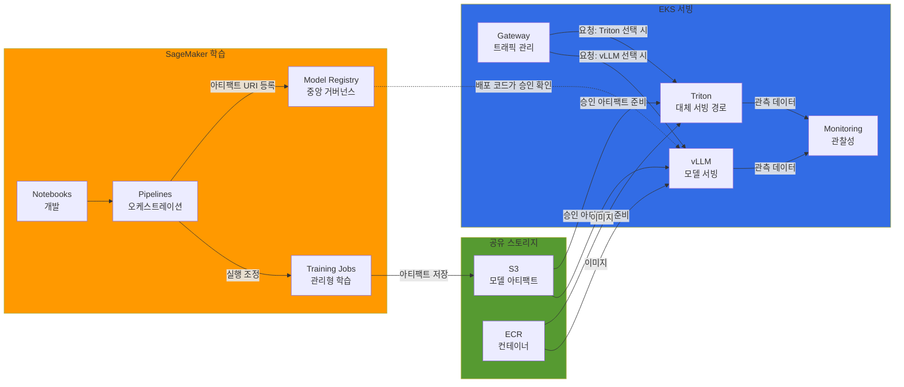
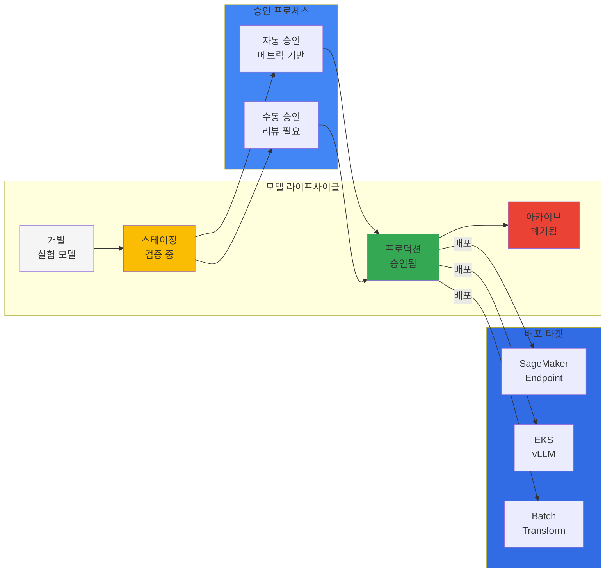
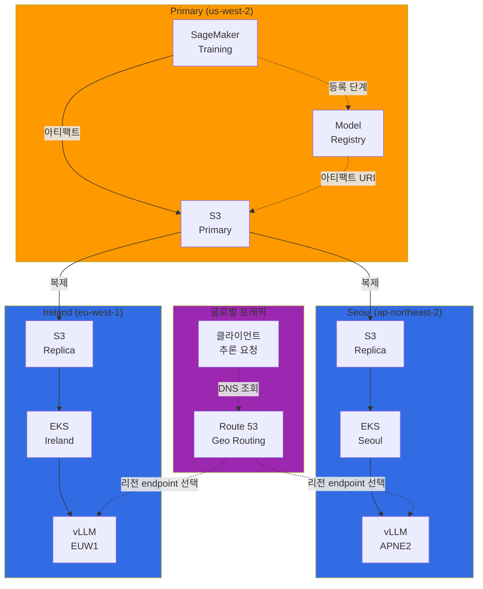
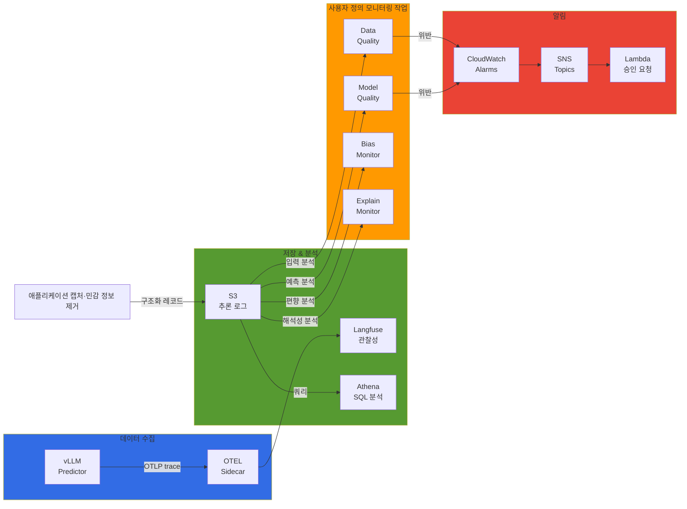

import SpecificationTable from '@site/src/components/tables/SpecificationTable';
import { HybridComparison, CostOptimization } from '@site/src/components/SagemakerTables';

## 개요

SageMaker에서 모델을 학습한 뒤, 승인된 모델 파일을 EKS로 가져와 추론 서비스를 운영하는 구성입니다. 학습 인프라 관리는 SageMaker에 맡기고 서빙 환경은 Kubernetes에서 직접 제어합니다. 두 환경을 연결하는 아티팩트 전달, 배포 승인, 관측 기능은 팀이 구현해야 하며 비용은 실제 사용량으로 비교해야 합니다.

<HybridComparison />


## 하이브리드 아키텍처 패턴

### 전체 아키텍처 개요



Pipelines는 학습 작업을 조정하고 Registry는 아티팩트 URI와 메타데이터를 참조합니다. vLLM과 Triton은 여기서 대체 서빙 경로입니다. Triton의 vLLM backend를 쓰는 별도 구성은 가능하지만 두 서버를 직렬로 통과시키는 GPU 최적화 계층을 뜻하지 않습니다.

### 패턴 1: SageMaker 학습 → EKS 서빙

**사용 사례:** 대규모 분산 학습, 학습 인프라 관리 부담 감소, 서빙 환경 세밀한 제어

### 패턴 2: EKS 학습 → SageMaker 서빙

**사용 사례:** 커스텀 학습 프레임워크, Kubernetes 네이티브 학습 도구 (Kubeflow, Ray)

### 패턴 3: 하이브리드 서빙

**사용 사례:** 고가용성 프로덕션, 멀티 리전, A/B 테스팅

---

## SageMaker Pipelines 통합

### SageMaker Components for Kubeflow Pipelines

아래는 공식 AWS 컴포넌트 자체가 아니라 SageMaker SDK를 호출하는 **사용자 정의 KFP v2 wrapper**입니다. 참조 버전은 `kfp==2.7.0`과 `sagemaker==2.200.0`입니다. 학습·등록까지 수행하고 `PendingManualApproval`에서 종료합니다. EKS 배포는 아래 승인 확인 어댑터를 사용하는 별도 릴리스 단계입니다.

필수 입력인 BYOC `training_image`에는 실제 학습 프로그램과 의존성이 들어 있어야 합니다. `/opt/ml/input/data/training`을 읽고 `/opt/ml/model`에 vLLM이 지원하는 Hugging Face causal-LM config, tokenizer 및 safetensors 가중치를 저장하도록 구현·검증합니다. 일반 PyTorch 이미지만 지정한다고 학습 알고리즘이 생기지는 않으며 임의 사기 탐지 모델이 vLLM과 호환되는 것도 아닙니다. `inference_image`는 등록할 아티팩트와 API 계약이 맞는 별도 검증 이미지입니다. 여기서 이미지를 만들거나 학습을 실행하지 않았습니다.

```python
# Custom wrappers, not the AWS-provided Kubeflow component package.
# Reference SDKs: kfp==2.7.0 and sagemaker==2.200.0; compile only after pinning images.
from kfp import dsl


@dsl.component(base_image='python:3.10-slim', packages_to_install=['sagemaker==2.200.0'])
def train(training_image: str, role_arn: str, s3_input: str, s3_output: str,
          hyperparameters: dict, region: str) -> str:
    import boto3
    import sagemaker
    from sagemaker.estimator import Estimator
    if '@sha256:' not in training_image:
        raise ValueError('supply a reviewed BYOC training image digest')
    estimator = Estimator(image_uri=training_image, role=role_arn,
        instance_count=2, instance_type='ml.g5.2xlarge',
        output_path=s3_output, hyperparameters=hyperparameters,
        max_run=43200, sagemaker_session=sagemaker.Session(
            boto_session=boto3.Session(region_name=region)))
    estimator.fit({'training': s3_input}, wait=True)
    return estimator.model_data


@dsl.component(base_image='python:3.10-slim', packages_to_install=['sagemaker==2.200.0'])
def register(model_data: str, group: str, inference_image: str, role_arn: str,
             region: str) -> str:
    import boto3
    import hashlib
    from urllib.parse import urlparse
    import sagemaker
    from sagemaker.model import Model
    session = boto3.Session(region_name=region)
    uri = urlparse(model_data)
    response = session.client('s3').get_object(Bucket=uri.netloc, Key=uri.path.lstrip('/'))
    digest = hashlib.sha256()
    try:
        if not response.get('VersionId') or response['VersionId'] == 'null':
            raise ValueError('enable bucket versioning before training')
        for chunk in response['Body'].iter_chunks(chunk_size=1024 * 1024):
            digest.update(chunk)
    finally:
        response['Body'].close()
    model = Model(image_uri=inference_image, model_data=model_data, role=role_arn,
                  sagemaker_session=sagemaker.Session(boto_session=session))
    package = model.register(content_types=['application/json'], response_types=['application/json'],
        model_package_group_name=group, approval_status='PendingManualApproval',
        customer_metadata_properties={'artifact_sha256': digest.hexdigest(),
            'artifact_version_id': response['VersionId'], 'artifact_format': 'hf-causal-lm-tar-v1'})
    return package.model_package_arn


@dsl.pipeline(name='sagemaker-to-eks-training-and-registration')
def hybrid_ml_pipeline(training_image: str, inference_image: str, role_arn: str,
                       s3_input: str, s3_output: str, group: str,
                       hyperparameters: dict, region: str = 'us-west-2'):
    trained = train(training_image=training_image, role_arn=role_arn, s3_input=s3_input,
        s3_output=s3_output, hyperparameters=hyperparameters, region=region)
    trained.set_caching_options(False)
    registered = register(model_data=trained.output, group=group,
        inference_image=inference_image, role_arn=role_arn, region=region)
    registered.set_caching_options(False)
    # Deliberately no deploy task: PendingManualApproval must not reach EKS.


# Submission is a separate, authorized operation; arguments must name real reviewed artifacts:
# kfp.Client(host=KFP_HOST).create_run_from_pipeline_func(
#     hybrid_ml_pipeline, arguments=reviewed_arguments,
#     namespace='training-pipeline', service_account='sagemaker-pipeline', enable_caching=False)
```

KFP 제출의 `service_account`를 사용하고 legacy `task.apply(use_aws_secret(...))`는 사용하지 않습니다. 플랫폼 관리자는 `training-pipeline/sagemaker-pipeline`의 IAM 연동을 구성합니다. 파이프라인 역할에는 제한된 Create/DescribeTrainingJob, 모델 등록·조회, 아티팩트 읽기와 정확한 실행 역할에 대한 `iam:PassRole`이 필요합니다. SageMaker 실행 역할의 S3/ECR/KMS 권한, EKS 배포자의 namespace RBAC, 모델 로더의 GetObjectVersion 권한은 각각 분리합니다. 정적 AWS access key를 Pod에 넣지 않습니다. 의존성 설치가 필요한 예제이므로 운영에서는 검토한 잠금 파일로 빌드한 digest 고정 이미지를 사용합니다.


---

## SageMaker Model Registry 거버넌스

### 중앙 집중식 모델 관리

Registry에 승인 상태를 기록해도 EKS가 자동으로 이를 강제하지 않습니다. 아래 수명 주기와 승인 흐름은 애플리케이션 정책입니다. SageMaker 제공 project template의 승인 후 배포 동작과 EKS 배포 코드를 구분합니다. EKS에서는 승인된 **특정 버전 ARN**을 릴리스에 고정하고 배포 직전에 상태를 다시 확인해야 합니다. 승인 취소 이후의 기존 Pod 회수나 라우팅 복구도 별도 제어 절차입니다.



### Model Registry 설정

Model Package Group은 별도 권한으로 한 번 준비합니다. 임의 `Rules` dict를 선언해도 AWS 승인 정책이 설치되지 않습니다. 아래는 검증된 평가 보고서와 승인자 권한을 확인한 애플리케이션이 실제 `UpdateModelPackage`를 호출하는 예입니다. 0.95는 이 예제의 accuracy 정책이며 생성 모델의 품질 전체를 대표하지 않습니다. 실제 보고서에는 모델 버전·평가 데이터·지표 정의를 연결해야 합니다.

```python
# model_registry_approval.py -- explicit approval after reviewing the release evidence.
def create_group(sm, name):
    # Administrative one-time operation for a NEW group; do not call on every deployment.
    return sm.create_model_package_group(ModelPackageGroupName=name,
        ModelPackageGroupDescription='Reviewed model releases for EKS serving',
        Tags=[{'Key': 'Team', 'Value': 'ml-platform'}, {'Key': 'Environment', 'Value': 'production'}])


def approve_release(sm, *, package_arn, verified_report):
    # The caller authenticates the report, dataset/model digest and reviewer authorization.
    # A mutable dict supplied by the model or an untrusted caller is not approval evidence.
    from math import isfinite
    if verified_report.get('model_package_arn') != package_arn:
        raise ValueError('report/package mismatch')
    accuracy = verified_report.get('accuracy')
    if type(accuracy) not in (int, float) or not isfinite(accuracy) or not 0 <= accuracy <= 1:
        raise ValueError('invalid accuracy')
    if verified_report.get('approved_by_reviewer') is not True or accuracy < 0.95:
        raise ValueError('reviewer approval and example accuracy threshold are required')
    package = sm.describe_model_package(ModelPackageName=package_arn)
    if package['ModelPackageStatus'] != 'Completed':
        raise ValueError('package registration is incomplete')
    sm.update_model_package(ModelPackageArn=package_arn, ModelApprovalStatus='Approved',
        ApprovalDescription='Release evidence reviewed; EKS deployer re-checks this version')
```

[승인 상태와 배포](https://docs.aws.amazon.com/sagemaker/latest/dg/model-registry-approve.html), [UpdateModelPackage](https://docs.aws.amazon.com/sagemaker/latest/APIReference/API_UpdateModelPackage.html)의 범위를 기준으로 합니다. 승인자가 이 함수를 호출할 수 있어도 임의 EKS 리소스 수정 권한까지 갖도록 구성하지 않습니다.

### EKS에서 Model Registry 조회

아래 어댑터는 `kubernetes==30.1.0`의 Python API를 사용하므로 `kubectl` 실행 파일에 의존하지 않습니다. 승인된 release manifest에는 `source_uri`, `artifact_sha256`, `artifact_version_id`, `artifact_format: hf-causal-lm-tar-v1`을 기록합니다. `target`에는 실제 `region`, `bucket`, `key`, `version_id`를 고정합니다. 원본·복제본이 같은 digest임을 검증한 manifest만 사용합니다. 단순 S3 문자열 치환이나 매번 최신 버전 검색은 하지 않습니다.

모델 버전 ARN과 파일 해시로 릴리스마다 다른 Deployment·Service 이름을 만듭니다. 아래 어댑터는 두 이름이 모두 비어 있을 때만 후보 리소스를 생성하며, 기존 리소스를 갱신하지 않습니다. 같은 릴리스의 재시도나 생성 중 충돌도 실패로 반환합니다. 실패 후 남은 후보는 해당 릴리스 범위에서 확인·정리하고, 준비 상태와 실제 응답을 검증한 뒤 별도 단계에서 라우팅을 전환하세요. 이전 안정 버전은 연결이 종료될 때까지 유지합니다.

```python
# eks_model_loader.py -- deployment adapter; Kubernetes Python client 30.1.0.
import hashlib
import re
import time
from urllib.parse import urlparse


def approved_release(sm, package_arn, release):
    match = re.fullmatch(r'arn:aws:sagemaker:([^:]+):(\d{12}):model-package/([^/]+)/([1-9]\d*)', package_arn)
    if not match or sm.meta.region_name != match[1]:
        raise ValueError('use a versioned model-package ARN and its registry Region')
    package = sm.describe_model_package(ModelPackageName=package_arn)
    if package.get('ModelPackageArn') != package_arn:
        raise ValueError('unexpected package')
    if package.get('ModelPackageStatus') != 'Completed' or package.get('ModelApprovalStatus') != 'Approved':
        raise ValueError('deployment blocked: package must be Completed and Approved')
    containers = package.get('InferenceSpecification', {}).get('Containers', [])
    if len(containers) != 1 or containers[0].get('ModelDataUrl') != release['source_uri']:
        raise ValueError('release does not match the single registered artifact')
    metadata = package.get('CustomerMetadataProperties', {})
    for key in ('artifact_sha256', 'artifact_version_id', 'artifact_format'):
        if not release.get(key) or metadata.get(key) != release[key]:
            raise ValueError(f'registered {key} does not match the approved release')
    if not re.fullmatch('[0-9a-f]{64}', release['artifact_sha256']):
        raise ValueError('invalid artifact digest')
    if release['artifact_format'] != 'hf-causal-lm-tar-v1' or release['artifact_version_id'] == 'null':
        raise ValueError('unsupported artifact contract')
    uri = urlparse(release['source_uri'])
    if uri.scheme != 's3' or not uri.netloc or not uri.path.strip('/') or uri.query or uri.fragment:
        raise ValueError('invalid registered S3 URI')
    return package


def release_resource_name(package_arn, artifact_sha256):
    if not re.fullmatch(
        r"arn:aws:sagemaker:[^:]+:\d{12}:model-package/[^/]+/[1-9]\d*",
        package_arn,
    ):
        raise ValueError("a versioned model-package ARN is required")
    if not re.fullmatch(r"[0-9a-f]{64}", artifact_sha256):
        raise ValueError("a SHA-256 artifact digest is required")
    identity = f"{package_arn}\0{artifact_sha256}".encode()
    return "vllm-r-" + hashlib.sha256(identity).hexdigest()[:32]


def create_candidate_resources(
    apps, core, deployment, service, *,
    package_arn, artifact_sha256, api_exception_type,
):
    """Read both names first, then create only absent candidate resources.

    Any existing resource rejects this attempt, even for the same identity.
    A create-time race raises to the caller. Never fall back to patch.
    Partial candidate creation can remain and needs explicit scoped cleanup.
    """
    expected = release_resource_name(package_arn, artifact_sha256)
    dep_meta, svc_meta = deployment["metadata"], service["metadata"]
    namespace = dep_meta["namespace"]
    if (
        dep_meta["name"] != expected or svc_meta["name"] != expected
        or svc_meta["namespace"] != namespace
    ):
        raise ValueError("candidate resources must use the derived release identity")
    labels = {"app": expected}
    template = deployment["spec"]["template"]["metadata"]
    if (
        deployment["spec"]["selector"]["matchLabels"] != labels
        or template["labels"] != labels
        or service["spec"]["selector"] != labels
        or template["annotations"].get("model-package-arn") != package_arn
        or template["annotations"].get("artifact-sha256") != artifact_sha256
    ):
        raise ValueError("candidate selectors/package/digest do not match the release")

    existing = []
    for read in (apps.read_namespaced_deployment, core.read_namespaced_service):
        try:
            found = read(name=expected, namespace=namespace, _request_timeout=(5, 30))
        except api_exception_type as exc:
            if exc.status != 404:
                raise
            found = None
        existing.append(found)
    if any(item is not None for item in existing):
        raise ValueError("candidate name already exists; automatic updates/resume are forbidden")

    apps.create_namespaced_deployment(
        namespace=namespace, body=deployment, _request_timeout=(5, 30))
    core.create_namespaced_service(
        namespace=namespace, body=service, _request_timeout=(5, 30))
    return expected


def manifests(name, namespace, package_arn, release, target, loader_image):
    if not re.fullmatch(r'[a-z0-9](?:[a-z0-9-]{0,61}[a-z0-9])?', name):
        raise ValueError('invalid DNS name')
    if not re.fullmatch(r'[^\s]+@sha256:[0-9a-f]{64}', loader_image):
        raise ValueError('supply an approved loader image pinned by digest')
    labels = {'app': name}
    env = [{'name': k, 'value': v} for k, v in {
        'ARTIFACT_REGION': target['region'], 'ARTIFACT_BUCKET': target['bucket'],
        'ARTIFACT_KEY': target['key'], 'ARTIFACT_VERSION': target['version_id'],
        'ARTIFACT_SHA256': release['artifact_sha256'],
    }.items()]
    pod = {
        'serviceAccountName': 'vllm-model-reader',
        'initContainers': [{
            'name': 'materialize-model', 'image': loader_image,
            'command': ['python', '/scripts/model_artifact.py'], 'env': env,
            'resources': {'requests': {'cpu': '1', 'memory': '512Mi', 'ephemeral-storage': '130Gi'},
                          'limits': {'cpu': '2', 'memory': '1Gi', 'ephemeral-storage': '160Gi'}},
            'volumeMounts': [{'name': 'model', 'mountPath': '/model'},
                             {'name': 'scripts', 'mountPath': '/scripts', 'readOnly': True}],
        }],
        'containers': [{
            'name': 'vllm-server', 'image': 'vllm/vllm-openai:v0.23.0',
            'args': ['--model', '/model', '--served-model-name', name,
                     '--tensor-parallel-size', '1', '--max-model-len', '4096'],
            'ports': [{'containerPort': 8000, 'name': 'http'}],
            'startupProbe': {'httpGet': {'path': '/health', 'port': 'http'},
                             'periodSeconds': 10, 'failureThreshold': 180},
            'readinessProbe': {'httpGet': {'path': '/health', 'port': 'http'}, 'periodSeconds': 10},
            'resources': {'requests': {'cpu': '2', 'memory': '16Gi', 'nvidia.com/gpu': '1'},
                          'limits': {'cpu': '4', 'memory': '32Gi', 'nvidia.com/gpu': '1'}},
            'volumeMounts': [{'name': 'model', 'mountPath': '/model', 'readOnly': True}],
        }],
        'volumes': [{'name': 'model', 'emptyDir': {'sizeLimit': '64Gi'}},
                    {'name': 'scripts', 'configMap': {'name': 'model-loader-code'}}],
    }
    deployment = {'apiVersion': 'apps/v1', 'kind': 'Deployment',
        'metadata': {'name': name, 'namespace': namespace},
        'spec': {'replicas': 2, 'selector': {'matchLabels': labels},
                 'template': {'metadata': {'labels': labels, 'annotations': {
                     'model-package-arn': package_arn, 'artifact-sha256': release['artifact_sha256']}},
                     'spec': pod}}}
    service = {'apiVersion': 'v1', 'kind': 'Service',
        'metadata': {'name': name, 'namespace': namespace},
        'spec': {'type': 'ClusterIP', 'selector': labels,
                 'ports': [{'name': 'http', 'port': 8000, 'targetPort': 'http'}]}}
    return deployment, service


def deploy_approved(sm, apps, core, *, package_arn, release, target, name, namespace,
                    loader_image, verify_endpoint, timeout=1800):
    # release/target are approved, immutable release-manifest inputs, not model-generated text.
    approved_release(sm, package_arn, release)  # Re-check at the mutation boundary.
    deployment, service = manifests(name, namespace, package_arn, release, target, loader_image)
    from kubernetes.client.exceptions import ApiException
    create_candidate_resources(apps, core, deployment, service,
        package_arn=package_arn, artifact_sha256=release['artifact_sha256'],
        api_exception_type=ApiException)
    deadline = time.monotonic() + timeout
    while time.monotonic() < deadline:
        actual = apps.read_namespaced_deployment(name, namespace, _request_timeout=(5, 30))
        status = actual.status
        if ((status.observed_generation or 0) >= actual.metadata.generation
                and status.updated_replicas == 2 and status.available_replicas == 2
                and status.replicas == 2):
            endpoint = f'http://{name}.{namespace}.svc.cluster.local:8000'
            # Caller must verify /v1/models and an approved smoke request from this cluster.
            # The callback raises on failure; it is not a default-true placeholder.
            if verify_endpoint(endpoint, name, release['artifact_sha256']) is not True:
                raise ValueError('endpoint identity/smoke verification failed')
            return {'status': 'ready', 'endpoint': endpoint, 'package_arn': package_arn}
        time.sleep(5)
    raise TimeoutError('deployment did not become ready; retain the last stable route')
```

`model-loader-code` ConfigMap에는 다음 로더를 준비하고 boto3가 포함된 검토·digest 고정 이미지로 실행합니다. ServiceAccount `vllm-model-reader`에는 해당 객체 버전의 읽기와 필요한 KMS 복호화만 허용합니다. deployment 호출자는 in-cluster 설정 또는 명시적 kube context로 연결하고 해당 namespace의 Deployment/Service get/create 권한을 사용합니다. 검증 어댑터에 필요한 Pod/EndpointSlice get/list 읽기 권한도 별도로 제한합니다. 모델 디렉터리는 init container가 S3 객체를 버전 지정으로 내려받아 SHA-256을 확인한 후 안전하게 압축을 풀어 준비합니다. tar 파일 자체를 `--model`에 전달하지 않습니다. vLLM의 별도 S3 loader 지원과 이 tar 배포 계약은 구분합니다.

```python
# model_artifact.py -- Python 3.12+, boto3 in a prebuilt, reviewed loader image.
import hashlib
import json
import os
from pathlib import Path, PurePosixPath
import tarfile
import tempfile


def extract_model(archive, destination, expected_sha256, max_bytes=64 * 1024**3):
    destination = Path(destination)
    if any(destination.iterdir()):
        raise ValueError('model destination must be empty')
    digest = hashlib.sha256()
    with open(archive, 'rb') as source:
        while chunk := source.read(1024 * 1024):
            digest.update(chunk)
    if digest.hexdigest() != expected_sha256:
        raise ValueError('artifact SHA-256 mismatch')
    with tarfile.open(archive, 'r:gz') as tar:
        members, names, total = [], set(), 0
        # Validate every member before extracting any member.
        for member in tar:
            name = PurePosixPath(member.name)
            normalized = str(name)
            if name.is_absolute() or '..' in name.parts or '\\' in member.name:
                raise ValueError('unsafe archive path')
            if not (member.isdir() or member.isfile()) or normalized in names:
                raise ValueError('links, special files and duplicate paths are forbidden')
            if normalized in ('', '.') and not member.isdir():
                raise ValueError('invalid archive root')
            names.add(normalized)
            total += member.size
            if member.size < 0 or total > max_bytes or len(names) > 100_000:
                raise ValueError('unpacked artifact exceeds limits')
            members.append(member)
        required = {'config.json', 'tokenizer_config.json'}
        if not required <= names or not any(n.endswith('.safetensors') for n in names):
            raise ValueError('expected a root-level Hugging Face causal-LM artifact')
        if not any(n in names for n in ('tokenizer.json', 'tokenizer.model', 'vocab.json')):
            raise ValueError('tokenizer assets missing')
        tar.extractall(destination, members=members, filter='data')
    config = json.loads((destination / 'config.json').read_text())
    if not isinstance(config.get('model_type'), str):
        raise ValueError('invalid model config')
    # Format checks do not prove vLLM architecture support or GPU memory fit.
    (destination / 'artifact.sha256').write_text(expected_sha256 + '\n')


def download_and_extract(s3, bucket, key, version_id, expected_sha256, destination,
                         max_bytes=64 * 1024**3):
    if not version_id or version_id == 'null':
        raise ValueError('a non-null S3 object version is required')
    response = s3.get_object(Bucket=bucket, Key=key, VersionId=version_id)
    body = response['Body']
    try:
        if response.get('VersionId') != version_id or not 0 < response['ContentLength'] <= max_bytes:
            raise ValueError('unexpected S3 version or size')
        with tempfile.NamedTemporaryFile(suffix='.tar.gz') as archive:
            size = 0
            while chunk := body.read(1024 * 1024):
                size += len(chunk)
                if size > max_bytes:
                    raise ValueError('download exceeds limit')
                archive.write(chunk)
            if size != response['ContentLength']:
                raise ValueError('incomplete S3 body')
            archive.flush()
            extract_model(archive.name, destination, expected_sha256, max_bytes)
    finally:
        body.close()


if __name__ == '__main__':
    import boto3
    download_and_extract(
        boto3.client('s3', region_name=os.environ['ARTIFACT_REGION']),
        os.environ['ARTIFACT_BUCKET'], os.environ['ARTIFACT_KEY'],
        os.environ['ARTIFACT_VERSION'], os.environ['ARTIFACT_SHA256'], '/model',
    )
```

이 구성의 1 GPU·메모리·디스크·시작 제한은 예시이며 대상 모델의 지원 아키텍처와 실제 용량을 검증해야 합니다. `/health` 성공만으로 품질이나 모델 정체성이 검증되지는 않습니다. `verify_endpoint`는 각 클러스터 내부에서 `/v1/models`의 served name, Pod의 승인 digest annotation/로더 결과, 승인된 smoke 요청을 확인하는 필수 통합 어댑터이며 이 문서에서는 구현·실행하지 않았습니다. replica 준비와 이 확인을 마친 뒤에만 `ready`를 반환합니다. 실패 시 기존 stable 라우트를 유지하고 이전 승인 버전으로 복구합니다.


---

## 비용 최적화 전략

### 학습 vs 서빙 비용 분석

<CostOptimization />

### 비용 최적화 체크리스트

아래 YAML은 **설계 체크리스트이며 서비스가 읽는 설정 파일이 아닙니다**. `auto_terminate`, `scale_down_delay`, `enable_gpu_sharing`, lifecycle 중첩 항목을 해석하는 controller는 제공하지 않습니다. 학습 Spot의 최대 90%는 AWS가 설명하는 조건부 상한이지 이 아키텍처의 측정 결과가 아닙니다.

```yaml
# cost-optimization-config.yaml
training:
  # SageMaker Managed Spot Training (최대 90% 절감)
  use_spot_instances: true
  max_wait_time_seconds: 86400  # 24시간
  max_run_time_seconds: 43200   # 12시간
  
  # 체크포인트 활성화 (Spot 중단 대비)
  checkpoint_s3_uri: s3://my-bucket/checkpoints/
  checkpoint_local_path: /opt/ml/checkpoints
  
  # 인스턴스 타입 최적화
  instance_type: ml.g5.2xlarge  # GPU 학습
  instance_count: 2
  
  # 학습 완료 후 자동 종료
  auto_terminate: true

serving:
  # Karpenter Spot 인스턴스 (할인율은 조건별 상이; 미측정)
  capacity_type: spot
  
  # 오토스케일링 설정
  min_replicas: 1
  max_replicas: 10
  target_utilization: 70
  
  # 유휴 시간 스케일 다운
  scale_down_delay: 300  # 5분
  
  # GPU 공유 (MIG 또는 MPS)
  enable_gpu_sharing: false
  max_shared_clients: 4

storage:
  # S3 Intelligent-Tiering
  s3_storage_class: INTELLIGENT_TIERING
  
  # 오래된 모델 아카이브
  lifecycle_policy:
    archive_after_days: 90
    delete_after_days: 365
```

| 항목 | 실제 구현 지점 |
|---|---|
| 학습 Spot·시간 제한·체크포인트 | Estimator의 `use_spot_instances`, `max_wait`, `max_run`, `checkpoint_s3_uri`, `checkpoint_local_path`; 학습 코드가 체크포인트 복구를 구현 |
| 학습 종료 | SageMaker 작업 완료/실패/중지 시 학습 리소스 종료; S3/ECR 등 잔존 비용은 별도 |
| EKS Spot | Karpenter NodePool 요구 사항과 중단 대응; 할인율은 미측정 |
| replica/축소 지연 | HPA/KEDA의 실제 메트릭·behavior와 node controller를 별도로 설정 |
| GPU 공유 | GPU·driver·device plugin별 MIG/MPS 호환성을 검증한 뒤 선택; 일반 불리언으로 활성화되지 않음 |
| S3 계층/만료 | 실제 bucket lifecycle API와 운영 아티팩트 보존 정책; 체크리스트를 그대로 적용하지 않음 |

### 비용 모니터링 대시보드

SageMaker 서비스 전체 비용과 학습 비용은 다릅니다. 학습 집계에는 이 payer 계정에서 확인한 training usage type allowlist를 적용합니다. EKS 예제는 활성화한 `Workload=eks-model-serving` 비용 할당 태그에 해당하는 **EC2 compute만** 집계합니다. EKS 제어 영역, EBS, S3, NAT/전송, 로드 밸런서와 공유 리소스 비용은 제외되므로 총 소유 비용이나 플랫폼 간 우열로 해석하지 않습니다. 태그의 활성화·청구 반영 시점과 누락 리소스도 확인합니다.

```python
# cost_monitoring.py -- returns explicitly scoped costs, not an EKS total-cost estimate.
from decimal import Decimal


def scoped_costs(ce, *, start, end, service, usage_types=None, tag=None):
    clauses = [{'Dimensions': {'Key': 'SERVICE', 'Values': [service]}}]
    if usage_types is not None:
        if not usage_types:
            raise ValueError('training usage-type allowlist must not be empty')
        clauses.append({'Dimensions': {'Key': 'USAGE_TYPE', 'Values': usage_types}})
    if tag:
        clauses.append({'Tags': {'Key': tag['key'], 'Values': [tag['value']]}})
    request = {'TimePeriod': {'Start': start, 'End': end}, 'Granularity': 'DAILY',
               'Metrics': ['UnblendedCost'],
               'Filter': clauses[0] if len(clauses) == 1 else {'And': clauses},
               'GroupBy': [{'Type': 'DIMENSION', 'Key': 'USAGE_TYPE'}]}
    rows, seen = [], set()
    while True:
        response = ce.get_cost_and_usage(**request)
        for day in response['ResultsByTime']:
            for group in day['Groups']:
                cost = group['Metrics']['UnblendedCost']
                amount = Decimal(cost['Amount'])
                if not amount.is_finite() or cost['Unit'] != 'USD':
                    raise ValueError('unexpected monetary unit or amount')
                rows.append({'period': day['TimePeriod'], 'usage_type': group['Keys'][0],
                             'amount_usd': str(amount), 'estimated': day['Estimated']})
        token = response.get('NextPageToken')
        if not token:
            return {'scope': request['Filter'], 'end_exclusive': end, 'rows': rows}
        if token in seen:
            raise ValueError('repeated Cost Explorer page token')
        seen.add(token)
        request['NextPageToken'] = token


# Supply actual billing usage types from this payer account; do not guess their names.
# training = scoped_costs(ce, start=start, end=end, service='Amazon SageMaker',
#                         usage_types=approved_training_usage_types)
# tagged_ec2 = scoped_costs(ce, start=start, end=end,
#     service='Amazon Elastic Compute Cloud - Compute',
#     tag={'key': 'Workload', 'value': 'eks-model-serving'})
```

모든 페이지를 읽고 `Estimated`, 통화, 시작 포함/종료 제외 구간을 보존합니다. 실제 비용 조회는 실행하지 않았습니다.


---

## 멀티 리전 배포 패턴

### 글로벌 모델 배포 아키텍처



Route 53은 DNS 응답으로 별도 구성한 리전 ingress endpoint를 선택하며 요청을 프록시하지 않습니다. 이 그림은 S3 복제·승인된 릴리스·리전 서빙의 관계를 보여주는 개념도이며 글로벌 ingress 설정은 포함하지 않습니다. 사용자별 생성 응답을 CDN이 자동 캐시한다고 가정하지 않습니다.

### S3 Cross-Region Replication 설정

아래는 `PutBucketReplication`의 ReplicationConfiguration 본문입니다. 원본·대상 bucket versioning, S3가 assume할 replication 역할, 양쪽 bucket 및 필요한 KMS 권한을 먼저 구성합니다. Filter를 사용하는 두 규칙에 `DeleteMarkerReplication`을 명시하고 RTC와 Metrics를 함께 설정합니다. 이 JSON은 SSE-S3 객체를 전제로 합니다. SSE-KMS 객체에는 `SourceSelectionCriteria.SseKmsEncryptedObjects`와 대상 `EncryptionConfiguration.ReplicaKmsKeyID` 및 관련 권한도 필요합니다. RTC는 추가 과금과 적용 조건이 있으며 모든 객체가 항상 15분 내 도착한다는 보장은 아닙니다. 기존 객체와 실패 복제는 별도 처리해야 합니다.

```json
{
  "Role": "arn:aws:iam::123456789012:role/S3ReplicationRole",
  "Rules": [
    {
      "ID": "ReplicateModelsToAPNE2",
      "Status": "Enabled",
      "Priority": 1,
      "Filter": {
        "Prefix": "models/"
      },
      "Destination": {
        "Bucket": "arn:aws:s3:::my-models-ap-northeast-2",
        "ReplicationTime": {
          "Status": "Enabled",
          "Time": {
            "Minutes": 15
          }
        },
        "Metrics": {
          "Status": "Enabled",
          "EventThreshold": {
            "Minutes": 15
          }
        }
      },
      "DeleteMarkerReplication": {
        "Status": "Disabled"
      }
    },
    {
      "ID": "ReplicateModelsToEUW1",
      "Status": "Enabled",
      "Priority": 2,
      "Filter": {
        "Prefix": "models/"
      },
      "Destination": {
        "Bucket": "arn:aws:s3:::my-models-eu-west-1",
        "ReplicationTime": {
          "Status": "Enabled",
          "Time": {
            "Minutes": 15
          }
        },
        "Metrics": {
          "Status": "Enabled",
          "EventThreshold": {
            "Minutes": 15
          }
        }
      },
      "DeleteMarkerReplication": {
        "Status": "Disabled"
      }
    }
  ]
}
```

### 멀티 리전 배포 자동화

Registry API는 ARN에 포함된 리전으로 호출합니다. 각 리전에는 실제 복제 객체 버전과 검토한 kube context를 전달하며, replica의 checksum·권한·모델 준비를 확인한 뒤에만 성공을 기록합니다. 객체 URI의 리전 문자열을 바꾸는 것은 복제가 아닙니다. 아래 함수는 앞의 동일한 승인·materialization·Service·readiness 어댑터를 재사용합니다.

```python
# multi_region_deployment.py -- calls the deployment adapter above; no URL string substitution.
import boto3
from kubernetes import client, config
from eks_model_loader import deploy_approved, release_resource_name


def deploy_regions(package_arn, release, approved_targets, loader_image, verifiers):
    registry_region = package_arn.split(':')[3]
    sm = boto3.client('sagemaker', region_name=registry_region)
    results = {}
    for region, target in approved_targets.items():
        if target['region'] != region or not target.get('version_id') or target['version_id'] == 'null':
            raise ValueError('a verified regional replica object version is required')
        # Explicit context-to-cluster mapping is reviewed before use; no global default switch.
        with config.new_client_from_config(context=target['kube_context']) as api:
            results[region] = deploy_approved(sm, client.AppsV1Api(api), client.CoreV1Api(api),
                package_arn=package_arn, release=release, target=target,
                name=release_resource_name(package_arn, release['artifact_sha256']),
                namespace='vllm-inference',
                loader_image=loader_image, verify_endpoint=verifiers[region])
    return results


# approved_targets maps each Region to its actual bucket, key, non-null version_id,
# region and kube_context. CRR is asynchronous; verify the replica exists first.
# All copies must hash to release['artifact_sha256']; the init container enforces it.
# A target failure raises rather than claiming that all Regions deployed successfully.
```


---

## 모델 모니터링 및 드리프트 탐지

### 통합 모니터링 아키텍처



Trace 수집과 입력/출력 데이터 캡처는 별도 경로입니다. stdout이나 임의 OTLP trace가 바로 Model Monitor용 데이터가 되지는 않습니다. 모델 품질에는 정답 레이블, bias에는 집단 정의·레이블, 설명 가능성에는 지원 모델·분석 설정이 추가로 필요합니다. 이 그림의 각 작업은 별도 구현 계약이며 자동 생성되지 않습니다.

### vLLM OTEL Sidecar 설정

아래 첫 YAML은 위 승인 배포의 Pod spec에 병합할 발췌입니다. 전체 `containers`/`volumes` 목록을 덮어써서 모델 init container·mount·probe·리소스 제한을 잃지 않도록 합니다. vLLM **v0.23.0**에서 OTEL 의존성이 포함되어 있어야 하며 `--otlp-traces-endpoint`로 전송을 명시합니다. Collector **0.123.0**은 HTTP/protobuf trace를 [Langfuse OTLP](https://langfuse.com/integrations/native/opentelemetry) `/api/public/otel`로 보냅니다. 이 경로의 자체 호스팅 최소 버전은 v3.22.0이며 실제 운영 버전으로 호환성을 검증합니다.

```yaml
# Pod-spec fragment: merge into the approved deployment above, retaining init/volumes/probes.
containers:
- name: vllm-server
  image: vllm/vllm-openai:v0.23.0
  args: [--model, /model, --served-model-name, '$(RELEASE_NAME)',
         --tensor-parallel-size, '1', --max-model-len, '4096',
         --otlp-traces-endpoint, 'http://127.0.0.1:4318/v1/traces']
  env:
  - {name: OTEL_EXPORTER_OTLP_TRACES_PROTOCOL, value: http/protobuf}
  - name: RELEASE_NAME
    valueFrom: {fieldRef: {fieldPath: "metadata.labels['app']"}}
- name: otel-collector
  image: otel/opentelemetry-collector-contrib:0.123.0
  args: [--config=/conf/otel-collector-config.yaml]
  volumeMounts:
  - {name: otel-config, mountPath: /conf, readOnly: true}
  env:
  - name: LANGFUSE_HOST
    value: https://langfuse.example.com
  - name: LANGFUSE_AUTH_STRING
    valueFrom: {secretKeyRef: {name: langfuse-credentials, key: auth-string}}
  resources:
    requests: {cpu: 200m, memory: 512Mi}
    limits: {cpu: 500m, memory: 1Gi}
volumes:
- name: otel-config
  configMap: {name: otel-collector-config}
```

```yaml
apiVersion: v1
kind: ConfigMap
metadata:
  name: otel-collector-config
  namespace: vllm-inference
data:
  otel-collector-config.yaml: |
    receivers:
      otlp:
        protocols:
          http: {endpoint: 127.0.0.1:4318}
    processors:
      memory_limiter: {check_interval: 1s, limit_mib: 768, spike_limit_mib: 128}
      batch: {timeout: 10s, send_batch_size: 1024}
      resource:
        attributes:
        - {key: service.name, value: vllm-approved-model, action: upsert}
    exporters:
      otlphttp/langfuse:
        endpoint: ${env:LANGFUSE_HOST}/api/public/otel
        headers:
          Authorization: Basic ${env:LANGFUSE_AUTH_STRING}
    service:
      pipelines:
        traces:
          receivers: [otlp]
          processors: [memory_limiter, resource, batch]
          exporters: [otlphttp/langfuse]
```

`auth-string`은 `public-key:secret-key`의 base64 인코딩을 Secret으로 공급합니다. Bearer secret-key나 `/api/public/ingestion`을 OTLP endpoint로 사용하지 않습니다. Langfuse v4의 실시간 수집을 선택하면 공식 지침에 따라 `x-langfuse-ingestion-version: "4"`도 설정합니다. Secret 값은 로그에 출력하지 않습니다. 이 trace 파이프라인은 stdout 수집이나 완전한 prompt/response 캡처를 구현하지 않습니다. 민감 정보를 제거한 구조화 요청 레코드를 별도 수집·보존하는 애플리케이션 경로가 필요합니다.

### SageMaker Model Monitor 통합

2026-09-19에 확인한 [공식 가용성 안내](https://docs.aws.amazon.com/sagemaker/latest/dg/model-monitor-availability-change.html)에 따르면 Model Monitor는 신규 고객에게 열려 있지 않으며 기존 고객은 계속 사용할 수 있습니다. 다음 SDK 예제는 **기존 고객의 실제 SageMaker endpoint**와 활성화된 data capture를 전제로 합니다. EKS 로그 prefix는 `endpoint_input`이 아닙니다. `DefaultModelMonitor` 인스턴스에서 baseline 결과와 schedule 이름을 읽으며 메서드 반환값을 Monitor 객체로 취급하지 않습니다.

```python
# Existing Model Monitor customers only; sagemaker==2.200.0 reference.
from sagemaker.model_monitor import DefaultModelMonitor, DatasetFormat, EndpointInput
from sagemaker import Session


def monitor_existing_sagemaker_endpoint(role_arn, endpoint_name, baseline_uri, output_uri):
    monitor = DefaultModelMonitor(role=role_arn, instance_count=1,
        instance_type='ml.m5.xlarge', volume_size_in_gb=20,
        max_runtime_in_seconds=3600, sagemaker_session=Session())
    monitor.suggest_baseline(baseline_dataset=baseline_uri,
        dataset_format=DatasetFormat.csv(header=True),
        output_s3_uri=output_uri + '/baseline', wait=True)
    monitor.create_monitoring_schedule(
        monitor_schedule_name='approved-endpoint-data-quality',
        endpoint_input=EndpointInput(endpoint_name=endpoint_name, destination='/opt/ml/processing/input'),
        output_s3_uri=output_uri + '/reports',
        statistics=monitor.baseline_statistics(), constraints=monitor.suggested_constraints(),
        schedule_cron_expression='cron(0 * * * ? *)', enable_cloudwatch_metrics=True)
    return monitor.monitoring_schedule_name
```

신규 EKS 구성은 사용자 정의 배치 분석 작업을 운영해야 합니다. 다음 함수는 PII를 제거한 JSONL 레코드의 `request_id`와 `input_tokens`를 받아 기준/현재 window의 입력 길이 평균 변화를 확인합니다. 캡처 작업이 같은 애플리케이션·스키마·모델 버전의 완전하고 겹치지 않는 window를 만들고 재시도를 중복 제거해야 합니다. 25%는 검토 요청을 위한 예시 정책이며 정확도·bias·설명 가능성 평가가 아닙니다. 스케줄·S3 읽기·메트릭 게시·알람 연결은 별도 배치 작업에서 구성해야 하며 여기서는 실행하지 않았습니다.

```python
# eks_data_quality.py -- offline numeric feature drift policy, not model-accuracy evaluation.
import math
from statistics import fmean


def feature_mean(rows):
    if len(rows) < 100:
        raise ValueError('at least 100 captured requests required per window')
    values, ids = [], set()
    for row in rows:
        identifier = row.get('request_id')
        if not isinstance(identifier, str) or not identifier or identifier in ids:
            raise ValueError('missing or duplicated request_id')
        ids.add(identifier)
        value = row.get('input_tokens')
        if type(value) is not int or not 0 < value <= 1_000_000:
            raise ValueError('input_tokens must be a bounded positive integer')
        values.append(value)
    return fmean(values)


def quality_report(baseline, current):
    # The capture job supplies disjoint, complete windows for the same application,
    # schema and model revision, with PII removed and retries deduplicated by request_id.
    if {r.get('request_id') for r in baseline} & {r.get('request_id') for r in current}:
        raise ValueError('baseline and current windows overlap')
    old, new = feature_mean(baseline), feature_mean(current)
    relative_change = abs(new - old) / old
    if not math.isfinite(relative_change):
        raise ValueError('invalid drift result')
    return {'baseline_mean_input_tokens': old, 'current_mean_input_tokens': new,
            'relative_change': relative_change, 'threshold': 0.25,
            'needs_review': relative_change > 0.25}
```

### 드리프트 탐지 및 자동 재학습

알람 이름의 부분 문자열만 보고 학습을 시작하지 않습니다. 아래 Lambda 예제는 허용한 SNS topic·정확한 alarm ARN·계정·ALARM 전환과 timestamp를 검사하고, 전환별 안정된 ID로 DynamoDB에 **승인 요청만** 기록합니다. 테이블 partition key는 `request_id`(String)이며 조건부 쓰기가 중복 알림을 막습니다. SNS subscription/Lambda resource policy도 해당 topic과 계정으로 제한해야 합니다. 이벤트의 문자열 검사는 인증을 대체하지 않습니다.

```python
# drift_detection_handler.py -- durable approval request; does not start paid training.
import hashlib
import json
from datetime import datetime, timezone


def approval_request(event, *, topic_arn, alarm_arn, now):
    records = event.get('Records', [])
    if len(records) != 1:
        raise ValueError('one SNS record required')
    record = records[0]
    sns = record.get('Sns', {})
    if record.get('EventSource') != 'aws:sns' or sns.get('TopicArn') != topic_arn:
        raise ValueError('unexpected event source')
    message = json.loads(sns['Message'])
    if message.get('AlarmArn') != alarm_arn:
        raise ValueError('unexpected alarm')
    parts = alarm_arn.split(':', 6)
    if len(parts) != 7 or parts[2] != 'cloudwatch' or message.get('AWSAccountId') != parts[4]:
        raise ValueError('unexpected account or alarm ARN')
    # CloudWatch's display-name Region field is not a Region code: trust the exact allowed ARN.
    if message.get('NewStateValue') != 'ALARM':
        return None
    stamp = datetime.fromisoformat(message['StateChangeTime'].replace('Z', '+00:00'))
    if stamp.tzinfo is None or now.tzinfo is None or not 0 <= (now - stamp).total_seconds() <= 900:
        raise ValueError('stale or future alarm transition')
    identity = alarm_arn + '|' + stamp.astimezone(timezone.utc).isoformat() + '|ALARM'
    return {'request_id': hashlib.sha256(identity.encode()).hexdigest(),
            'alarm_arn': alarm_arn, 'state_changed_at': stamp.isoformat(),
            'status': 'PendingApproval'}


def persist_request(ddb_table, request):
    if request is None:
        return 'ignored'
    from botocore.exceptions import ClientError
    try:
        ddb_table.put_item(Item=request, ConditionExpression='attribute_not_exists(request_id)')
    except ClientError as exc:
        if exc.response['Error']['Code'] == 'ConditionalCheckFailedException':
            return 'duplicate'
        raise
    return 'pending_approval'


def lambda_handler(event, context):
    import boto3
    import os
    request = approval_request(event, topic_arn=os.environ['ALLOWED_TOPIC_ARN'],
        alarm_arn=os.environ['ALLOWED_ALARM_ARN'], now=datetime.now(timezone.utc))
    return {'status': persist_request(boto3.resource('dynamodb').Table(
        os.environ['APPROVAL_REQUEST_TABLE']), request)}
```

승인 후 dispatcher는 검증한 입력 데이터 snapshot, BYOC 이미지 digest·실제 학습 프로그램, 실행 역할, `ml.g5.2xlarge` 2대·최대 43,200초 같은 명시적 자원/시간 상한과 비용 승인을 릴리스 요청에 고정합니다. `TrainingJobName="retrain-" + request_id[:40]`처럼 같은 요청에 같은 이름을 사용하고 기존 작업을 Describe하여 같은 설정인지 확인합니다. 조건부 상태 전이와 API 성공 후 기록 실패를 복구하는 reconciliation도 필요합니다. 이 dispatcher와 정확히 한 번 실행 보장은 구현되어 있지 않습니다. 승인 완료 전에는 CreateTrainingJob을 호출하지 않고, 학습 후에는 다시 평가·Registry 승인·Canary 단계를 거칩니다. 자동화 범위는 승인 요청 생성까지입니다.


---

## 요약

이 구성의 배포 단위는 Registry의 특정 모델 버전과 그 버전이 가리키는 검증된 파일입니다. 학습이 끝나도 평가와 승인을 거쳐야 추론 트래픽을 새 모델로 전환합니다.

### 핵심 포인트

1. 학습 작업은 모델 파일을 S3에 저장하고 Registry에 승인 대기 버전을 등록합니다.
2. 배포자는 승인 상태, S3 객체 버전, 파일 해시를 확인한 뒤 EKS에 모델을 준비합니다.
3. 리전마다 복제된 파일과 실제 서빙 모델을 확인한 뒤 트래픽을 전환합니다.
4. EKS 요청 데이터는 별도로 수집·분석합니다. Model Monitor 예제는 기존 고객의 SageMaker endpoint에 한해 적용합니다.

### 권장 사항

- 팀의 Kubernetes 운영 역량과 실제 학습·서빙 비용을 기준으로 하이브리드 구성을 선택합니다.
- 모델 승인 권한과 배포 권한을 분리하고, 이전 승인 버전으로 복구하는 절차를 검증합니다.
- 드리프트 알림은 검토 요청으로 받습니다. 재학습 비용을 승인한 뒤 학습·평가·배포를 진행합니다.

### 다음 단계

- [EKS 기반 MLOps 파이프라인](../model-lifecycle/mlops-pipeline-eks.md)
- [GPU 리소스 관리](../../model-serving/gpu-infrastructure/gpu-resource-management.md)
- [모델 모니터링](../../operations-mlops/observability/agent-monitoring.md)

---

## 참고 자료

- [SageMaker Components for Kubeflow Pipelines](https://docs.aws.amazon.com/sagemaker/latest/dg/kubernetes-sagemaker-components-for-kubeflow-pipelines.html)
- [SageMaker Model Registry](https://docs.aws.amazon.com/sagemaker/latest/dg/model-registry.html)
- [SageMaker Model Monitor](https://docs.aws.amazon.com/sagemaker/latest/dg/model-monitor.html)
- [vLLM Documentation](https://docs.vllm.ai/)
- [vLLM Deployment Guide](https://docs.vllm.ai/en/latest/deployment/docker/)
- [ArgoCD Documentation](https://argo-cd.readthedocs.io/)
- [OpenTelemetry Collector](https://opentelemetry.io/docs/collector/)
- [Langfuse Self-Hosting](https://langfuse.com/docs/deployment/self-host)
- [AWS Multi-Region Fundamentals](https://docs.aws.amazon.com/prescriptive-guidance/latest/aws-multi-region-fundamentals/introduction.html)

