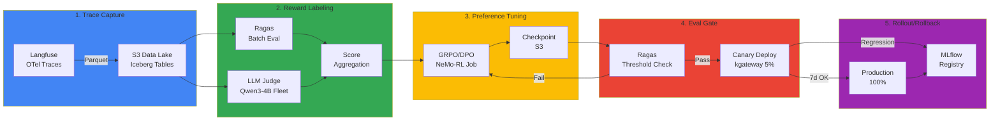

import DocCardList from '@theme/DocCardList';

## 개요

Continuous Training Pipeline은 프로덕션 추론 트레이스를 자동으로 학습 데이터로 전환하여 모델을 지속적으로 개선하는 **Self-Improving Agent Loop**의 구현 아키텍처입니다. Langfuse OTel 트레이스를 S3 Data Lake로 수집하고, Reward Labeler로 품질을 평가한 뒤, GRPO/DPO로 preference tuning을 수행합니다. 평가 통과 후 Canary 배포로 프로덕션에 점진 롤아웃합니다.

## 왜 Continuous Training인가

기존 학습 방식은 **정적 데이터셋**에 의존합니다. 하지만 프로덕션 사용자 피드백은 끊임없이 발생하며, 이를 반영하지 못하면 모델은 시간이 지날수록 **실제 사용 패턴과 괴리**됩니다.

| 문제 | 기존 방식 | Continuous Training |
|------|----------|---------------------|
| **데이터 수집** | 수동 라벨링 (월 1회) | 자동 trace 수집 (실시간) |
| **피드백 반영** | 3-6개월 | 1주일 |
| **품질 개선** | 신규 데이터셋 대기 | 사용자 피드백 즉시 반영 |
| **비용** | 라벨링 $10K/월 | Reward Model 자동화 |

:::tip 설계 문서 연계
이 문서는 [Self-Improving Agent Loop](../../../design-architecture/advanced-patterns/self-improving-agent-loop.md)의 5단계 아키텍처를 EKS에서 구현하는 방법을 다룹니다. 설계 배경과 전략적 의사결정은 설계 문서를 참조하세요.
:::

:::warning 실 운영 전 ADR 합의 필요
본 파이프라인을 실제 트래픽에 적용하려면 [ADR — Self-Improving Agent Loop 도입 의사결정](../../../design-architecture/advanced-patterns/adr-self-improving-loop.md)에 정의된 스코프·자동화 경계·데이터 게이트·롤백 기준이 조직 차원에서 합의돼야 합니다. Train/Deploy 단계는 수동 승인 경계로 운영하세요.
:::

## 5단계 파이프라인 흐름

**핵심 개념:**

1. **Trace → Dataset**: Langfuse 프로덕션 추론 로그를 학습 데이터로 전환
2. **Reward Labeling**: Ragas + LLM Judge로 trace 품질을 0-1점으로 스코어링
3. **GRPO/DPO**: 고득점 trace는 선호(preference), 저득점은 비선호로 학습
4. **Eval Gate**: 학습 후 품질 Threshold 검증
5. **Canary → 100%**: 점진적 트래픽 증가, 회귀 시 즉시 롤백

## 하위 문서

<DocCardList />

- [Trace → Dataset Materializer](./trace-to-dataset.md) — Langfuse OTel 수집, S3 Iceberg 테이블, Reward Labeler Fleet
- [GRPO/DPO 학습 Job](./grpo-dpo-training.md) — NeMo-RL/TRL 기반 preference tuning과 Karpenter Spot 노드풀
- [Eval Gate · Registry · KPI](./evaluation-rollout.md) — Threshold 검증, Canary 배포, MLflow Registry, 비용 KPI

## 요약

Continuous Training Pipeline은 5단계 워크플로우로 프로덕션 피드백을 자동으로 모델 개선에 반영합니다:

1. **Trace → Dataset**: Langfuse OTel → S3 Iceberg (날짜/모델/동의 파티셔닝)
2. **Reward Labeling**: Ragas + Qwen3-4B Judge Fleet (KServe + KEDA)
3. **GRPO/DPO 학습**: NeMo-RL 또는 TRL (Karpenter Spot p5en.48xlarge × 3 노드)
4. **Eval Gate**: Threshold 검증 + Canary 5% → 25% → 100% (kgateway)
5. **Registry & Rollback**: MLflow + Agent Versioning + 자동 롤백

**핵심 포인트:**

- **비용 효율**: Spot 인스턴스 + 격주 iteration → $4K/월 수준
- **품질 개선**: 월 1% faithfulness 증가 목표
- **안전성**: Eval Gate + 점진 Canary + 자동 롤백
- **ROI**: 학습 비용 대비 400% 매출 증대 가능

## 다음 단계

- [Self-Improving Agent Loop](../../../design-architecture/advanced-patterns/self-improving-agent-loop.md) — 설계 아키텍처 및 전략
- [커스텀 모델 파이프라인](../custom-model-pipeline.md) — SFT 학습 전제 조건
- [Cascade Routing Tuning](../../inference-gateway/cascade-routing-tuning.md) — 배포 후 라우팅 최적화
- [Agent Versioning](../../../../aidlc/enterprise/agent-versioning/index.md) — 모델·코드·프롬프트 동기화

## 참고 자료

### 공식 문서

- [NVIDIA NeMo Framework](https://docs.nvidia.com/nemo-framework/user-guide/latest/) — 대규모 모델 학습·RLHF
- [HuggingFace TRL](https://github.com/huggingface/trl) — DPO/PPO 레퍼런스 구현
- [MLflow](https://mlflow.org/) — 모델 레지스트리·버전 관리
- [Gateway API](https://gateway-api.sigs.k8s.io/) — Canary 트래픽 분할

### 논문 · 기술 블로그

- [GRPO Paper (arxiv 2402.03300)](https://arxiv.org/abs/2402.03300) — Group Relative Policy Optimization
- [DPO Paper (arxiv 2305.18290)](https://arxiv.org/abs/2305.18290) — Direct Preference Optimization

### 관련 문서

- [Self-Improving Agent Loop](../../../design-architecture/advanced-patterns/self-improving-agent-loop.md)
- [ADR — Self-Improving Loop](../../../design-architecture/advanced-patterns/adr-self-improving-loop.md)
- [Ragas Evaluation](../../../operations-mlops/governance/ragas-evaluation.md)

:::tip 프로덕션 체크리스트

- [ ] Langfuse OTel trace 수집 활성화 (user_consent 필드 추가)
- [ ] S3 Data Lake + Glue Iceberg 테이블 구성
- [ ] Reward Labeler Fleet (Qwen3-4B KServe + KEDA) 배포
- [ ] NeMo-RL 또는 TRL 학습 환경 구성 (Karpenter Spot 노드풀)
- [ ] Eval Gate Threshold 정의 (faithfulness >= 0.85)
- [ ] Canary Deployment HTTPRoute + 모니터링 알람 설정
- [ ] MLflow Registry + Agent Versioning 연동
- [ ] Rollback 자동화 (Argo Rollouts)
- [ ] 비용 KPI 대시보드 (Grafana) 구축
- [ ] 격주/월간 iteration 일정 수립

:::
