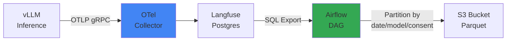

## 개요

Continuous Training Pipeline의 1~2단계인 **Trace 수집 → Reward 레이블링** 구현을 다룹니다. Langfuse에 저장된 프로덕션 추론 트레이스를 S3 Parquet로 적재하고, Ragas + LLM Judge Fleet으로 각 trace의 품질을 0-1점으로 스코어링하여 GRPO/DPO 학습 데이터셋을 구성합니다.

## Langfuse OTel → S3 Parquet

Langfuse는 OpenTelemetry 프로토콜로 추론 트레이스를 수집합니다. 이를 S3에 Parquet 형식으로 저장하여 대규모 배치 분석이 가능하도록 합니다.



### Langfuse Trace Schema

```sql
-- Langfuse traces 테이블 구조 (PostgreSQL)
CREATE TABLE traces (
    id UUID PRIMARY KEY,
    timestamp TIMESTAMP,
    user_id TEXT,
    session_id TEXT,
    input TEXT,
    output TEXT,
    model TEXT,
    latency_ms INT,
    token_count INT,
    metadata JSONB,
    user_consent BOOLEAN  -- GDPR 동의 여부
);

-- 예시 데이터
{
  "id": "trace-12345",
  "timestamp": "2026-04-18T03:15:00Z",
  "user_id": "user-abc",
  "input": "EKS Auto Mode와 Karpenter의 차이점은?",
  "output": "EKS Auto Mode는 AWS 완전 관리형 노드 그룹이며...",
  "model": "glm-5-32b",
  "latency_ms": 850,
  "token_count": 512,
  "metadata": {
    "domain": "eks-documentation",
    "feedback_score": 4.5
  },
  "user_consent": true
}
```

### S3 Partitioning 전략

```bash
s3://training-data-lake/
└── langfuse-traces/
    ├── date=2026-04-18/
    │   ├── model=glm-5-32b/
    │   │   ├── consent=true/
    │   │   │   └── traces-000001.parquet  (10k rows)
    │   │   └── consent=false/
    │   │       └── traces-000002.parquet
    │   └── model=qwen3-coder/
    │       └── consent=true/
    │           └── traces-000003.parquet
    └── date=2026-04-19/
        └── ...
```

**Partitioning 이유:**

- **날짜**: 시간 범위 쿼리 최적화 (예: 최근 7일 데이터)
- **모델**: 모델별 성능 추적, A/B 테스트 분리
- **동의**: GDPR/CCPA 규정 준수, 동의 없는 데이터 학습 제외

### Apache Iceberg vs Hudi

| 특징 | Apache Iceberg | Apache Hudi |
|------|---------------|-------------|
| **스냅샷 격리** | 완벽한 ACID 트랜잭션 | 타임라인 기반 일관성 |
| **Schema 진화** | 자동 컬럼 추가/삭제 | 수동 마이그레이션 필요 |
| **쿼리 성능** | 파티션 가지치기 최적화 | COW/MOR 모드 선택 |
| **AWS 통합** | Glue Catalog 네이티브 | EMR 최적화 |
| **권장 용도** | 대규모 분석 쿼리 | 실시간 upsert 중심 |

:::tip Iceberg 권장
Continuous Training은 **읽기 중심 워크로드**(배치 학습)이므로 Iceberg를 권장합니다. Schema 변경(신규 메타데이터 필드 추가)이 빈번하므로 자동 Schema Evolution이 유리합니다.
:::

### Airflow DAG 예시

```python
# dags/langfuse_to_s3.py
from airflow import DAG
from airflow.providers.postgres.hooks.postgres import PostgresHook
from airflow.providers.amazon.aws.hooks.s3 import S3Hook
from airflow.operators.python import PythonOperator
from datetime import datetime, timedelta
import pandas as pd
import pyarrow as pa
import pyarrow.parquet as pq

def export_langfuse_traces(**context):
    """Langfuse Postgres → S3 Parquet 변환"""
    
    # Langfuse DB 연결
    pg_hook = PostgresHook(postgres_conn_id='langfuse_db')
    
    # 어제 날짜 데이터 추출 (user_consent=true만)
    yesterday = context['ds']
    query = f"""
        SELECT 
            id, timestamp, user_id, session_id,
            input, output, model, latency_ms, token_count,
            metadata
        FROM traces
        WHERE DATE(timestamp) = '{yesterday}'
          AND user_consent = true
          AND output IS NOT NULL
        ORDER BY timestamp
    """
    
    df = pg_hook.get_pandas_df(query)
    
    # 모델별로 그룹화하여 Parquet 저장
    for model, group in df.groupby('model'):
        table = pa.Table.from_pandas(group)
        
        # S3 경로: s3://bucket/date=2026-04-18/model=glm-5-32b/consent=true/
        s3_key = f"langfuse-traces/date={yesterday}/model={model}/consent=true/traces-{context['ti'].xcom_pull()}.parquet"
        
        # S3 업로드
        s3_hook = S3Hook(aws_conn_id='aws_default')
        with s3_hook.get_conn().open(f"s3://training-data-lake/{s3_key}", 'wb') as f:
            pq.write_table(table, f, compression='snappy')
    
    return len(df)

with DAG(
    dag_id='langfuse_to_s3_daily',
    schedule_interval='0 6 * * *',  # 매일 오전 6시
    start_date=datetime(2026, 4, 1),
    catchup=False,
    default_args={
        'retries': 3,
        'retry_delay': timedelta(minutes=5),
    }
) as dag:
    
    export_task = PythonOperator(
        task_id='export_traces',
        python_callable=export_langfuse_traces,
    )
```

### AWS Glue Catalog 등록

```python
# glue_iceberg_table.py
import boto3

glue = boto3.client('glue')

# Iceberg 테이블 정의
glue.create_table(
    DatabaseName='training_data',
    TableInput={
        'Name': 'langfuse_traces',
        'StorageDescriptor': {
            'Columns': [
                {'Name': 'id', 'Type': 'string'},
                {'Name': 'timestamp', 'Type': 'timestamp'},
                {'Name': 'user_id', 'Type': 'string'},
                {'Name': 'input', 'Type': 'string'},
                {'Name': 'output', 'Type': 'string'},
                {'Name': 'model', 'Type': 'string'},
                {'Name': 'latency_ms', 'Type': 'int'},
                {'Name': 'metadata', 'Type': 'struct<feedback_score:double,domain:string>'},
            ],
            'Location': 's3://training-data-lake/langfuse-traces/',
            'InputFormat': 'org.apache.iceberg.mr.hive.HiveIcebergInputFormat',
            'OutputFormat': 'org.apache.iceberg.mr.hive.HiveIcebergOutputFormat',
            'SerdeInfo': {
                'SerializationLibrary': 'org.apache.iceberg.mr.hive.HiveIcebergSerDe'
            }
        },
        'PartitionKeys': [
            {'Name': 'date', 'Type': 'date'},
            {'Name': 'model', 'Type': 'string'},
            {'Name': 'consent', 'Type': 'boolean'},
        ],
        'Parameters': {
            'table_type': 'ICEBERG',
            'format': 'parquet',
            'write.parquet.compression-codec': 'snappy',
        }
    }
)
```

## Reward Labeler Fleet

### Reward Labeling 개념

**Reward Labeling**은 각 trace의 품질을 0-1점 사이 점수로 평가하는 프로세스입니다. 이 점수는 GRPO/DPO 학습에서 **선호도(preference) 신호**로 사용됩니다.

```
고득점 trace (0.8-1.0) → 선호 예제 (학습 시 가중치 ↑)
저득점 trace (0.0-0.3) → 비선호 예제 (학습 시 가중치 ↓)
```

### 평가 지표 조합

#### Ragas 메트릭

[Ragas 평가 프레임워크](../../operations-mlops/governance/ragas-evaluation.md)는 RAG 시스템의 품질을 객관적으로 측정합니다.

```python
from ragas.metrics import faithfulness, answer_relevancy, context_precision

# Ragas 배치 평가
scores = {
    'faithfulness': 0.92,      # 답변이 컨텍스트에 충실한가
    'answer_relevancy': 0.88,  # 답변이 질문과 관련있는가
    'context_precision': 0.85  # 검색된 컨텍스트가 정확한가
}

# 가중 평균으로 최종 Reward 계산
reward = (
    0.5 * scores['faithfulness'] +
    0.3 * scores['answer_relevancy'] +
    0.2 * scores['context_precision']
)
# → reward = 0.896
```

#### LLM-as-a-Judge

작은 모델(Qwen3-4B)을 judge로 활용하여 답변 품질을 평가합니다.

```python
# LLM Judge 프롬프트
JUDGE_PROMPT = """
다음 질문과 답변을 평가하세요.

**질문**: {question}
**답변**: {answer}

**평가 기준**:
1. 정확성: 기술적 오류가 없는가?
2. 완결성: 질문의 모든 측면을 다루는가?
3. 명확성: 이해하기 쉬운가?

점수를 0.0-1.0 사이로 출력하세요. JSON 형식으로만 응답하세요:
{{"score": 0.85, "reasoning": "..."}}
"""

# Qwen3-4B로 평가 (vLLM 배치 추론)
judge_response = vllm_client.chat.completions.create(
    model="qwen3-coder-4b",
    messages=[{"role": "user", "content": JUDGE_PROMPT.format(question=q, answer=a)}],
    temperature=0.1,
    max_tokens=200,
)

judge_score = json.loads(judge_response.choices[0].message.content)['score']
# → judge_score = 0.85
```

#### 최종 Reward 합산

```python
# Ragas + LLM Judge 조합
final_reward = (
    0.6 * ragas_reward +      # Ragas 가중치 60%
    0.4 * judge_score         # Judge 가중치 40%
)
```

### KServe InferenceService 배포

Qwen3-4B Judge 모델을 KServe로 배포하여 고가용성 fleet을 구성합니다.

```yaml
# reward-labeler-inference.yaml
apiVersion: serving.kserve.io/v1beta1
kind: InferenceService
metadata:
  name: reward-labeler-qwen3
  namespace: training-pipeline
spec:
  predictor:
    minReplicas: 3
    maxReplicas: 10
    containers:
    - name: kserve-container
      image: vllm/vllm-openai:v0.18.2
      args:
      - --model=Qwen/Qwen3-Coder-4B-Instruct
      - --served-model-name=qwen3-judge
      - --tensor-parallel-size=1
      - --max-model-len=8192
      - --gpu-memory-utilization=0.9
      resources:
        requests:
          nvidia.com/gpu: 1
          memory: 16Gi
        limits:
          nvidia.com/gpu: 1
          memory: 24Gi
      env:
      - name: SERVED_MODEL_NAME
        value: "qwen3-judge"
---
apiVersion: keda.sh/v1alpha1
kind: ScaledObject
metadata:
  name: reward-labeler-scaler
  namespace: training-pipeline
spec:
  scaleTargetRef:
    name: reward-labeler-qwen3
  minReplicaCount: 3
  maxReplicaCount: 10
  triggers:
  - type: prometheus
    metadata:
      serverAddress: http://prometheus:9090
      metricName: vllm_requests_running
      threshold: "10"
      query: |
        avg(vllm_requests_running{model="qwen3-judge"})
```

**오토스케일링 전략:**

- **최소 3 replica**: 기본 처리량 보장
- **최대 10 replica**: 배치 평가 시 스파이크 대응
- **트리거**: vLLM 대기 요청 수 > 10 시 스케일아웃

### 배치 평가 Job

```python
# batch_reward_labeling.py
import pandas as pd
from ragas import evaluate
from ragas.metrics import faithfulness, answer_relevancy, context_precision
import openai
import json
from concurrent.futures import ThreadPoolExecutor

# S3에서 최근 7일 trace 로드
df = pd.read_parquet(
    's3://training-data-lake/langfuse-traces/',
    filters=[
        ('date', '>=', '2026-04-11'),
        ('date', '<=', '2026-04-18'),
        ('model', '=', 'glm-5-32b'),
        ('consent', '=', True),
    ]
)

# Ragas 평가
ragas_results = evaluate(
    df,
    metrics=[faithfulness, answer_relevancy, context_precision]
)

# LLM Judge 평가 (병렬 처리)
def judge_single_trace(row):
    response = openai.ChatCompletion.create(
        model="qwen3-judge",
        messages=[{
            "role": "user",
            "content": JUDGE_PROMPT.format(
                question=row['input'],
                answer=row['output']
            )
        }],
        temperature=0.1,
        max_tokens=200,
        # KServe InferenceService 엔드포인트
        api_base="http://reward-labeler-qwen3.training-pipeline.svc.cluster.local:8000/v1"
    )
    return json.loads(response.choices[0].message.content)['score']

with ThreadPoolExecutor(max_workers=50) as executor:
    judge_scores = list(executor.map(judge_single_trace, df.to_dict('records')))

# 최종 Reward 계산
df['ragas_reward'] = (
    0.5 * ragas_results['faithfulness'] +
    0.3 * ragas_results['answer_relevancy'] +
    0.2 * ragas_results['context_precision']
)
df['judge_score'] = judge_scores
df['final_reward'] = 0.6 * df['ragas_reward'] + 0.4 * df['judge_score']

# S3에 레이블링된 데이터셋 저장
df.to_parquet('s3://training-data-lake/labeled-dataset/2026-04-18.parquet')
```

### 비용 예시

| 리소스 | 스펙 | 시간당 비용 | 일일 비용 (10시간 가동) |
|--------|------|-----------|----------------------|
| **Qwen3-4B Judge Fleet** | g6.xlarge × 3 | $0.93 | $9.30 |
| **Ragas 평가 (Bedrock Claude)** | - | API 호출당 | $5-10 (1만 trace 기준) |
| **Airflow/Kubernetes** | 기존 인프라 | - | - |
| **총 비용** | - | - | **$15-20/일** |

연간 $5,000-7,000 수준으로 수동 라벨링($10K/월) 대비 **95% 절감** 효과.

## 다음 단계

- [GRPO/DPO 학습 Job](./grpo-dpo-training.md) — 수집된 레이블 데이터셋으로 preference tuning 수행
- [Eval Gate · Registry · KPI](./evaluation-rollout.md) — 학습 후 품질 검증과 Canary 배포

## 참고 자료

### 공식 문서

- [Langfuse](https://langfuse.com/docs) — LLM Observability 플랫폼
- [Apache Iceberg](https://iceberg.apache.org/) — 오픈 테이블 포맷
- [AWS Glue Data Catalog](https://docs.aws.amazon.com/glue/latest/dg/components-overview.html) — Iceberg 메타스토어
- [KServe](https://kserve.github.io/website/) — Kubernetes ModelMesh/InferenceService

### 논문 · 기술 블로그

- [Ragas: Automated Evaluation of RAG (arxiv 2309.15217)](https://arxiv.org/abs/2309.15217)
- [LLM-as-a-Judge Survey (arxiv 2411.15594)](https://arxiv.org/abs/2411.15594)

### 관련 문서

- [Ragas Evaluation](../../operations-mlops/governance/ragas-evaluation.md) — Ragas 메트릭 심화
- [Agent 모니터링 (Langfuse)](../../operations-mlops/observability/agent-monitoring.md)
- [GRPO/DPO 학습 Job](./grpo-dpo-training.md)
