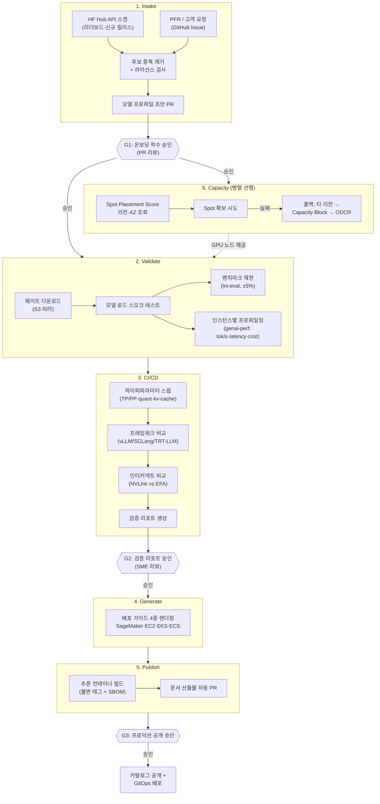
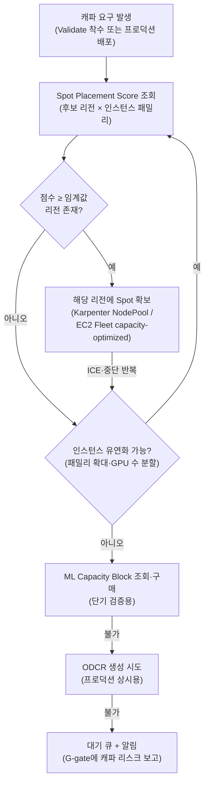

## 1. 문서 목적과 결론 (Executive Summary)

오픈 웨이트 모델의 릴리스 주기는 주 단위로 짧아졌습니다. 새 모델이 나올 때마다 사람이 수동으로 웨이트를 내려받고, 서빙 설정을 실험하고, 배포 매니페스트를 작성하는 방식은 더 이상 릴리스 속도를 따라가지 못합니다. 이 문서는 모델 감지부터 검증·배포·문서화·캐파 확보까지를 **에이전트가 실행하고 사람은 승인 게이트에서만 개입하는** 7단계 자동화 파이프라인 아키텍처를 제시합니다. 오케스트레이션 기반은 EKS 위의 Argo Events + Argo Workflows이며, 검증·프로파일링·캐파 확보에 각각 검증된 오픈소스·AWS 네이티브 도구를 매핑합니다.

**결론 요약:**

1. 파이프라인의 단일 진실 원천(Single Source of Truth)은 **Git에 저장되는 모델 프로파일(Model Profile)** 입니다. Intake가 후보를 프로파일 초안으로 만들고, Validate/CI/CD가 측정값을 채우며, Generate/Publish는 프로파일을 읽어 산출물을 렌더링합니다. 모든 단계는 프로파일에 대한 PR로 기록되므로 승인 게이트가 자연스럽게 PR 리뷰로 구현됩니다.
2. 품질 검증(벤치마크 재현)과 성능 검증(tok/s·latency·cost)은 **분리된 단계**로 설계합니다. 품질 재현은 lm-evaluation-harness로 공개 점수 대비 ±5% 이내를 확인하고, 성능 프로파일링은 genai-perf(AIPerf)로 인스턴스 타입별 매트릭스를 생성합니다. 두 검증을 한 Job에 합치면 실패 원인 격리가 어려워집니다.
3. 캐파 확보는 배포 시점이 아니라 **Validate 단계 이전에 병렬로 시작**합니다. 대형 모델(8×GPU 이상)은 EC2 Spot Placement Score로 리전·AZ별 확보 가능성을 먼저 조회하고, 확보 실패 시 ML Capacity Block 또는 ODCR(On-Demand Capacity Reservation)로 폴백합니다. GPU 캐파는 파이프라인에서 가장 긴 리드타임을 갖는 자원이기 때문입니다.
4. 사람의 개입 지점은 **3개 게이트로 고정**합니다 — (G1) 온보딩 착수 승인, (G2) 검증 리포트 승인, (G3) 프로덕션 공개 승인. 게이트 외 구간에서 SME(Subject Matter Expert)가 개입할 수 있도록 Argo Workflows의 suspend 스텝과 파라미터 오버라이드를 사용합니다.

## 2. 요건 정의

본 아키텍처가 충족해야 하는 7단계 요건은 다음과 같습니다.

| # | 단계 | 요건 | 핵심 판정 기준 |
|---|------|------|---------------|
| 1 | Intake | HuggingFace 리더보드 스캔 + PFR·고객 요청으로 새 모델 감지 | 사람 승인 게이트 통과 후에만 파이프라인 착수 |
| 2 | Validate | 모델 로드 검증, 공개 벤치마크 재현, 인스턴스별 성능 프로파일링 | 벤치마크 재현 오차 ±5% 이내, tok/s·latency·cost 산출 |
| 3 | CI/CD | 하이퍼파라미터 스윕, 프레임워크 비교, 인터커넥트(NVLink vs EFA) 리포트 | SME가 중간 개입(파라미터 수정·재실행) 가능 |
| 4 | Generate | SageMaker·EC2·EKS·ECS 4개 타깃용 배포 가이드 생성 | 단일 모델 프로파일에서 4종 가이드 렌더링 |
| 5 | Publish | 버전 관리된 추론 컨테이너 + 블로그 수준 문서 산출 | 불변(immutable) 태그, 문서 자동 PR |
| 6 | Capacity | 글로벌 스팟 컴퓨트 자동 확보 (리전 간) | Spot 확보 실패 시 리전 폴백·예약 폴백 자동화 |
| 7 | Human gate | 에이전트가 검증, 사람이 최종 승인 | 게이트 없는 프로덕션 반영 불가 |

### 기본 가정

- 실행 기반은 EKS이며, GPU 노드 프로비저닝은 Karpenter(또는 EKS Auto Mode)가 담당합니다.
- 모델 웨이트와 벤치마크 산출물은 S3에, 파이프라인 상태는 Git(모델 프로파일)에 저장합니다.
- 서빙 프레임워크는 vLLM을 기본으로 하고, 비교 대상으로 SGLang·TensorRT-LLM을 포함합니다.
- 조직에는 모델 온보딩을 승인할 SME 그룹(플랫폼 팀 + ML 엔지니어)이 존재합니다.

## 3. 전체 아키텍처



파이프라인 전 구간은 Argo Workflows의 단일 DAG로 표현하며, 게이트(G1~G3)는 suspend 스텝으로 구현합니다. 게이트에서 워크플로는 무기한 대기하고, 승인자가 resume하면 다음 단계로 진행합니다.

### 단계-도구 매핑

| 단계 | 오케스트레이션 | 핵심 도구 | 산출물 |
|------|--------------|----------|--------|
| Intake | Argo Events (Calendar/Webhook) | huggingface_hub API, GitHub Issue 템플릿 | 모델 프로파일 초안 PR |
| Validate | Argo Workflows DAG | vLLM, lm-evaluation-harness, genai-perf | 품질·성능 측정값 (프로파일 갱신) |
| CI/CD | Argo Workflows + suspend | 스윕 매트릭스 Job, 비교 하네스 | 검증 리포트 (Markdown) |
| Generate | Workflows 템플릿 스텝 | Handlebars/Jinja 렌더러 | 배포 가이드 4종 |
| Publish | GitHub Actions | BuildKit, ECR, syft(SBOM) | 버전 태그 이미지 + 문서 PR |
| Capacity | Workflows 병렬 브랜치 | Spot Placement Score API, EC2 Fleet, ODCR | 확보된 NodePool/예약 |
| Human gate | Argo suspend + Slack 알림 | PR 리뷰, `argo resume` | 승인 기록 (감사 추적) |

## 4. 단계별 상세 설계

### 4.1 Intake — 모델 감지와 착수 승인

감지 소스는 두 가지입니다.

**(a) 리더보드·릴리스 스캔.** Argo Events의 Calendar EventSource가 주기적(예: 6시간)으로 스캐너 Job을 트리거합니다. 스캐너는 huggingface_hub API로 다음을 수집합니다.

```python
from huggingface_hub import HfApi

api = HfApi()
# 최근 7일 내 생성·트렌딩 상위 text-generation 모델
candidates = api.list_models(
    filter="text-generation",
    sort="trendingScore",
    direction=-1,
    limit=50,
)
for m in candidates:
    info = api.model_info(m.id, files_metadata=True)
    # 게이트 조건: 오픈 웨이트 여부, 라이선스, 파라미터 수, safetensors 존재
    if info.gated or info.card_data.license not in ALLOWED_LICENSES:
        continue
    emit_candidate(info)
```

Open LLM Leaderboard 등 공개 리더보드는 결과 데이터셋을 HF Datasets로 제공하므로 동일 API로 점수를 조회할 수 있습니다. 스캐너는 **공개 벤치마크 점수를 프로파일 초안에 기록**해 두어야 합니다 — Validate 단계의 ±5% 재현 판정 기준값이 되기 때문입니다.

**(b) PFR·고객 요청.** 고객 요청은 GitHub Issue 템플릿(모델 ID, 요청 근거, 목표 워크로드, SLA)으로 접수합니다. Issue 라벨 웹훅이 Argo Events를 거쳐 동일한 후보 생성 경로로 합류합니다. 두 소스는 모델 ID 기준으로 중복 제거합니다.

**후보 → 프로파일 초안.** 감지된 후보는 자동으로 모델 프로파일 초안 PR이 됩니다.

```yaml
# profiles/qwen3-8b.yaml — 모델 프로파일 (SSOT)
model:
  id: Qwen/Qwen3-8B
  revision: main            # Validate 통과 시 커밋 SHA로 고정
  license: apache-2.0
  params_b: 8.2
intake:
  source: leaderboard-scan   # leaderboard-scan | pfr | customer-request
  detected_at: 2026-07-28
  published_scores:          # 재현 판정 기준값
    mmlu_pro: 58.4
    gsm8k: 89.1
validate: {}                 # Validate 단계가 채움
profiles: []                 # 인스턴스별 프로파일링 결과가 채움
serving: {}                  # CI/CD 스윕의 최적 설정이 채움
```

**G1 게이트.** 초안 PR의 승인·머지가 곧 온보딩 착수 승인입니다. CODEOWNERS로 승인자 그룹을 강제하고, 미승인 PR은 파이프라인을 트리거하지 않습니다. 라이선스 비허용·게이티드 모델은 스캐너가 PR 생성 전에 자동 탈락시키되, 탈락 사유를 로그로 남깁니다.

### 4.2 Validate — 로드 검증, 벤치마크 재현, 성능 프로파일링

Validate는 세 개의 독립 판정으로 구성되며, 하나라도 실패하면 프로파일에 실패 사유를 기록하고 중단합니다.

**(a) 모델 로드 스모크 테스트.** 웨이트를 S3에 미러링(HF 직접 다운로드는 1회로 제한)한 뒤, 대상 프레임워크로 서버를 기동해 다음을 확인합니다.

```bash
# 1) 서버 Ready (rollout 성공 ≠ 모델 로드 성공이므로 API로 확인)
kubectl rollout status deploy/${MODEL}-validate --timeout=30m
curl -sf http://${SVC}:8000/v1/models | jq -e '.data[0].id'

# 2) 실제 추론 1건 — greedy 출력이 비어있지 않은지 확인
curl -sf http://${SVC}:8000/v1/chat/completions -d '{
  "model": "'"${MODEL}"'",
  "messages": [{"role": "user", "content": "What is 2+2?"}],
  "temperature": 0, "max_tokens": 16
}' | jq -e '.choices[0].message.content | length > 0'
```

**(b) 벤치마크 재현 (±5%).** lm-evaluation-harness를 Kubernetes Job으로 실행하고, Intake가 기록한 공개 점수와 비교합니다.

```bash
lm_eval --model local-completions \
  --model_args model=${MODEL},base_url=http://${SVC}:8000/v1/completions \
  --tasks mmlu_pro,gsm8k \
  --batch_size auto --output_path /results
```

판정 로직은 단순 비교로 충분합니다: `abs(재현값 - 공개값) / 공개값 <= 0.05`. 다음 두 가지를 문서화된 규칙으로 고정해야 합니다.

- **재현 실패 ≠ 즉시 탈락.** 공개 점수는 평가 프롬프트·few-shot 수·채점 방식에 민감합니다. 실패 시 자동 재시도(harness 버전·태스크 설정을 모델 카드 명시값으로 교체) 1회 후, 그래도 실패하면 G2 게이트에 "재현 불가" 플래그와 함께 상정합니다. 판정을 사람에게 넘기는 것이지 파이프라인이 임의로 통과시키지 않습니다.
- **양자화 변형은 별도 프로파일.** FP8·INT4 변형은 원본과 점수가 다른 것이 정상이므로, 원본 대비 열화 허용치(예: -2%p)를 별도 기준으로 둡니다.

**(c) 인스턴스별 성능 프로파일링.** 모델 크기로 후보 인스턴스 집합을 결정하고(예: 8B → g6e.xlarge/g6e.12xlarge/inf2.8xlarge, 70B+ → p5en 계열), 인스턴스 타입별로 genai-perf 동시성 스윕을 실행합니다. 결과는 3개 축으로 정규화합니다.

| 축 | 산출식 | 용도 |
|----|-------|------|
| 처리량 | output tok/s ÷ GPU 수 | 인스턴스 간 정규화 비교 |
| 지연 | TTFT p50/p99, ITL p50/p99 | SLA 판정 |
| 비용 | (인스턴스 시간당 단가 ÷ 3600) ÷ (총 tok/s) × 10⁶ = $/1M tokens | 배포 가이드의 권장 인스턴스 선정 |

비용 축의 시간당 단가는 실행 시점의 Spot 가격(EC2 DescribeSpotPriceHistory)과 On-Demand 단가를 모두 기록합니다. 프로파일링 결과가 곧 Generate 단계의 "권장 인스턴스" 근거가 됩니다.

### 4.3 CI/CD — 스윕·비교·리포트와 SME 개입

CI/CD 단계는 Validate가 확보한 기준선 위에서 최적 서빙 설정을 탐색합니다.

**하이퍼파라미터 스윕.** 스윕 공간은 프로파일에 선언하고, Argo Workflows의 매트릭스 팬아웃으로 병렬 실행합니다.

```yaml
sweep:
  tensor_parallel: [1, 2, 4]
  quantization: [none, fp8]
  max_num_seqs: [64, 128, 256]
  kv_cache_dtype: [auto, fp8]
  # 전수 조합이 아닌 단계적 탐색: TP 확정 → quant 확정 → 나머지
  strategy: staged
```

전수 탐색(3×2×3×2=36 조합)은 GPU 시간을 낭비하므로, 축별 영향도가 큰 순서(TP → quantization → 배치 관련)로 단계적 탐색을 기본 전략으로 합니다.

**프레임워크 비교.** 동일 모델·동일 인스턴스·동일 워크로드(ISL/OSL 분포 고정)에서 vLLM·SGLang·TensorRT-LLM을 각각 최적 설정으로 실행하고 동일 지표로 비교합니다. 비교 조건 고정이 핵심입니다 — 프레임워크마다 다른 동시성·시퀀스 길이로 측정한 결과는 리포트에 실을 수 없습니다.

**인터커넥트 비교 (NVLink vs EFA).** 단일 노드에 들어가지 않는 모델(70B+ 비양자화, MoE 대형)에 대해서만 실행합니다.

- 단일 노드 TP(NVLink/NVSwitch 경유) vs 멀티 노드 TP·PP(EFA 경유)를 동일 총 GPU 수로 비교합니다.
- 멀티 노드 실행은 vLLM + Ray 또는 LeaderWorkerSet 기반으로 구성하고, EFA는 aws-ofi-nccl 플러그인과 `nccl-tests`(all_reduce_perf)로 대역폭 기준선을 먼저 검증합니다.
- 판정 기준: 단일 노드 대비 멀티 노드의 tok/s per GPU 열화율. 통상 TP는 노드 경계를 넘지 않는 구성이 우위이므로, 리포트에는 "멀티 노드가 필요한 최소 모델 크기"를 명시합니다.

**SME 중간 개입.** 각 스윕 라운드 종료 시 워크플로가 중간 결과 요약과 함께 suspend 스텝에 진입합니다. SME는 세 가지 행동을 선택할 수 있습니다.

1. `argo resume` — 제안된 다음 라운드 그대로 진행
2. 파라미터 오버라이드 후 resume — 탐색 공간 수정 (예: TP=4 제외, INT4 추가)
3. `argo stop` — 조기 종료 후 현재까지 결과로 리포트 생성

suspend 대기 시간에 상한(예: 4시간)을 두고, 초과 시 기본 경로로 자동 진행할지 중단할지는 조직 정책으로 정합니다. GPU 노드를 점유한 채 무기한 대기하면 캐파 낭비가 되므로, suspend 진입 전에 검증용 노드를 축소(scale-in)하는 스텝을 반드시 포함합니다.

**리포트 생성.** 모든 측정값은 모델 프로파일에 기록하고, 리포트 렌더러가 프로파일에서 Markdown 리포트(요약 → Pareto 차트 → 권장 설정 → 원시 데이터 링크)를 생성해 G2 게이트 PR에 첨부합니다.

### 4.4 Generate — 멀티 타깃 배포 가이드

Generate는 새 측정을 하지 않습니다. 확정된 모델 프로파일 하나에서 4개 타깃의 배포 가이드를 템플릿으로 렌더링합니다.

| 타깃 | 배포 형태 | 가이드에 포함되는 프로파일 값 |
|------|----------|---------------------------|
| SageMaker | LMI(Large Model Inference) 컨테이너 + Endpoint | 권장 인스턴스, `OPTION_TENSOR_PARALLEL_DEGREE` 등 serving 설정 |
| EC2 | DLAMI + Docker Compose (또는 systemd) | AMI 요건, NVIDIA 드라이버·컨테이너 툴킷 버전, 기동 커맨드 |
| EKS | Helm 차트 / Kustomize + Karpenter NodePool | nodeSelector·toleration, 리소스 요청, KEDA 스케일 정책 |
| ECS | Task Definition + Capacity Provider | GPU 태스크 정의, ASG 캐파 프로바이더 설정 |

템플릿·프로파일 분리 원칙 덕분에 vLLM 버전 업그레이드 같은 공통 변경은 템플릿 1곳 수정으로 4종 가이드에 반영됩니다. 렌더링된 가이드는 스타일 검사(vale 등)와 명령어 문법 검사(shellcheck, `helm template` 렌더 확인)를 통과해야 Publish로 넘어갑니다.

### 4.5 Publish — 버전 관리된 컨테이너와 문서 산출물

**추론 컨테이너.** 서빙 프레임워크 버전과 모델별 최적 설정을 베이크한 이미지를 빌드합니다.

- 태그 규칙: `{framework}-{fw_version}-{model_slug}-{profile_git_sha}` (예: `vllm-0.11.0-qwen3-8b-a1b2c3d`). `latest` 태그는 금지합니다.
- ECR 리포지토리는 **immutable tag** 설정을 강제해 동일 태그 덮어쓰기를 차단합니다.
- 빌드 시 SBOM(syft)을 생성해 아티팩트로 첨부하고, ECR enhanced scanning(Inspector)을 활성화합니다.
- 멀티 아치가 필요한 경우(웹 프론트 등 비GPU 보조 이미지)만 buildx 멀티 플랫폼을 사용하고, GPU 추론 이미지는 amd64 단일로 유지합니다.

**문서 산출물.** 리포트 렌더러가 블로그 수준 문서(개요 → 벤치마크 결과 → 인스턴스 선택 가이드 → 4종 배포 가이드 링크)를 생성하고, 문서 사이트 저장소에 자동 PR을 올립니다. 문서 PR 머지는 G3 게이트와 함께 처리합니다 — 문서만 먼저 공개되고 이미지는 미승인인 상태를 방지하기 위함입니다.

### 4.6 Capacity — 글로벌 스팟 캐파 자동 확보

GPU 캐파는 파이프라인 전체에서 리드타임이 가장 길고 실패 확률이 가장 높은 자원입니다. 대형 인스턴스(p5en, p6 계열)의 ICE(InsufficientCapacityError)는 상시 발생한다고 가정하고 설계합니다.



구현 요소는 다음과 같습니다.

- **Spot Placement Score API**: 리전·인스턴스 조합별 스팟 확보 가능성(1~10)을 사전 조회합니다. 점수가 낮은 리전에서 무한 재시도하는 대신, 점수 상위 리전으로 워크로드를 보냅니다.
- **리전 간 이동의 전제**: 웨이트 S3 버킷의 크로스 리전 복제(CRR)와, 검증 클러스터의 다중 리전 준비(리전별 상시 클러스터 또는 필요 시 생성)가 선행되어야 합니다. 검증 워크로드는 상태가 프로파일(Git)과 S3에만 있으므로 리전 이동 비용이 낮습니다 — 이 속성을 유지하는 것이 설계 원칙입니다.
- **용도별 확보 전략 분리**: 검증·스윕(수 시간~수 일)은 Spot → Capacity Block 순서, 프로덕션 서빙은 Spot + On-Demand 혼합에 KEDA 스케줄(업무 시간 스케일)과 ODCR을 조합합니다.
- **Karpenter 설정**: NodePool에 인스턴스 패밀리를 복수 허용(p5e/p5en/p6 등)하고 `capacity-type: [spot, on-demand]`를 함께 열어, 노드 단위 폴백은 Karpenter에 위임합니다. 리전 단위 폴백만 파이프라인이 담당합니다.

### 4.7 Human gate — 승인 게이트 설계

에이전트가 검증하고 사람이 승인한다는 원칙을 게이트 3개로 고정합니다.

| 게이트 | 시점 | 승인 대상 | 승인자 | 구현 |
|--------|------|----------|--------|------|
| G1 | Intake 직후 | 온보딩 착수 (GPU 비용 발생 시작) | 플랫폼 팀 | 프로파일 초안 PR 승인·머지 |
| G2 | CI/CD 리포트 완성 후 | 검증 결과·권장 설정 | SME 그룹 | 리포트 첨부 PR 승인 + `argo resume` |
| G3 | Publish 산출물 완성 후 | 프로덕션 공개 (카탈로그·문서·이미지) | 플랫폼 리드 | 릴리스 PR 승인·머지 |

- 게이트 도달 시 Slack/이메일로 승인 요청을 발송하고, 요청 메시지에 리포트 요약과 비용 누계를 포함합니다.
- 모든 승인은 PR 리뷰 기록으로 남아 감사 추적(audit trail)이 됩니다. 채팅 버튼 승인만으로 처리하지 않습니다.
- 게이트 간 자동 진행 구간에서 실패하면 해당 게이트로 되돌아가는 것이 아니라, 실패 지점부터 재시도합니다(Argo Workflows retryStrategy + 워크플로 재제출 시 완료 스텝 캐시).

## 5. 7단계 요건 충족 매핑

| 요건 | 충족 방법 (본 아키텍처) |
|------|------------------------|
| Intake | HF Hub API 스캐너(Argo Events cron) + GitHub Issue 접수 → 프로파일 초안 PR → G1 승인 게이트 |
| Validate | 로드 스모크 테스트(API 판정) + lm-eval ±5% 재현 + genai-perf 인스턴스 매트릭스(tok/s·TTFT/ITL·$/1M tok) |
| CI/CD | 단계적 하이퍼파라미터 스윕 + 조건 고정 프레임워크 비교 + NVLink/EFA 비교 → Markdown 리포트, suspend 스텝으로 SME 개입 |
| Generate | 모델 프로파일 SSOT → SageMaker·EC2·EKS·ECS 4종 가이드 템플릿 렌더링 + 문법·스타일 자동 검사 |
| Publish | 불변 태그 컨테이너(ECR immutable + SBOM + Inspector) + 문서 자동 PR (G3와 동시 머지) |
| Capacity | Spot Placement Score 기반 리전 선택 → Spot → Capacity Block → ODCR 폴백 체인, Validate와 병렬 선행 실행 |
| Human gate | G1(착수)·G2(검증)·G3(공개) 3게이트, PR 리뷰 기반 감사 추적, suspend 타임아웃 정책 |

## 6. 운영 고려사항

**비용 통제.** 파이프라인 1회 실행의 GPU 비용을 프로파일에 예산으로 선언하고(예: 8B 모델 $200, 70B 모델 $2,000), 누적 비용이 예산을 초과하면 자동 중단 후 G2로 상정합니다. 스윕 축소(staged 전략)와 suspend 전 노드 scale-in이 비용의 대부분을 결정합니다.

**파이프라인 자체의 관측성.** 워크플로 단계별 소요 시간·성공률·GPU 시간을 Prometheus로 수집하고, 벤치마크 결과는 Pushgateway를 거쳐 Grafana Pareto 대시보드로 시각화합니다. "모델 감지 → 카탈로그 공개" 리드타임이 파이프라인의 최상위 KPI입니다.

**보안.** HF 토큰·레지스트리 자격증명은 External Secrets Operator로 주입하고, 다운로드한 웨이트는 공개 전 무결성(체크섬)과 라이선스 파일 존재를 검증합니다. 서드파티 모델 코드 실행(`trust_remote_code`)은 기본 거부하고, 필요한 모델은 G1에서 명시 승인 항목으로 다룹니다.

**실패 모드.** 가장 흔한 실패는 (1) GPU ICE — Capacity 폴백 체인이 흡수, (2) 벤치마크 재현 실패 — 자동 재시도 1회 후 사람 판정, (3) OOM — 스윕 매트릭스에서 해당 조합만 실패 처리하고 계속 진행, 세 가지입니다. 셋 모두 파이프라인 중단이 아니라 격리·기록·계속 원칙으로 처리합니다.

## 7. 결론 (Summary)

오픈 웨이트 모델 온보딩은 Git 저장 모델 프로파일을 SSOT로 삼는 7단계 파이프라인으로 자동화할 수 있습니다. 에이전트는 감지·검증·프로파일링·문서화를 실행하고, 사람은 3개 게이트에서 PR 리뷰로 승인합니다. 품질 재현(±5%)과 성능 프로파일링을 분리하고, 캐파 확보를 검증에 선행시키는 것이 파이프라인 안정성의 핵심입니다. GPU ICE·재현 실패·OOM은 정상 운영의 일부로 간주하고 격리·기록·계속 원칙으로 설계합니다.

## 참고 자료

### AWS 공식 문서
- [Spot Placement Score](https://docs.aws.amazon.com/AWSEC2/latest/UserGuide/spot-placement-score.html) — 리전·AZ별 스팟 확보 가능성 사전 조회 API
- [On-Demand Capacity Reservations](https://docs.aws.amazon.com/AWSEC2/latest/UserGuide/ec2-capacity-reservations.html) — ODCR 생성·공유·폴백 구성
- [Amazon EC2 Capacity Blocks for ML](https://docs.aws.amazon.com/AWSEC2/latest/UserGuide/ec2-capacity-blocks.html) — 단기 GPU 캐파 예약 구매
- [ECR Image Tag Mutability](https://docs.aws.amazon.com/AmazonECR/latest/userguide/image-tag-mutability.html) — 불변 태그 강제 설정
- [Elastic Fabric Adapter](https://docs.aws.amazon.com/AWSEC2/latest/UserGuide/efa.html) — EFA 개요와 NCCL 연동

### Upstream 공식 문서
- [Argo Workflows — Suspending Workflows](https://argo-workflows.readthedocs.io/en/latest/walk-through/suspending/) — suspend/resume 기반 승인 게이트 구현
- [Argo Events](https://argoproj.github.io/argo-events/) — Calendar·Webhook 이벤트 소스
- [lm-evaluation-harness](https://github.com/EleutherAI/lm-evaluation-harness) — 공개 벤치마크 재현 하네스
- [huggingface_hub API](https://huggingface.co/docs/huggingface_hub/) — 모델 검색·메타데이터 조회
- [vLLM — Distributed Inference](https://docs.vllm.ai/en/latest/serving/distributed_serving.html) — 멀티 노드 TP/PP 구성

### 관련 문서 (내부)
- [EKS 기반 MLOps 파이프라인 구축](./mlops-pipeline-eks.md) — Kubeflow·ArgoCD 기반 학습 파이프라인
- [커스텀 모델 파이프라인 구축 가이드](./custom-model-pipeline.md) — LoRA Fine-tuning·Multi-LoRA 서빙
- [커스텀 모델 배포](./custom-model-deployment.md) — 단일 모델 수동 배포 절차
- [EKS GPU 노드 전략](../../model-serving/gpu-infrastructure/eks-gpu-node-strategy.md) — Karpenter GPU NodePool 설계
